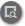
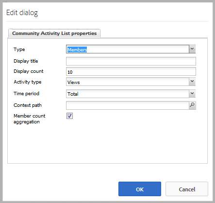
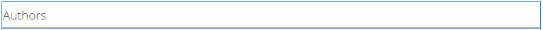

# Activity Trends {#activity-trends}

## Introduction {#introduction}

The `Community Activity List` component provides the ability to add trending information regarding posts and views by members as well as posts and views of content.

This section of the documentation describes

* Adding the `Community Activity List` component to a [community site](overview.md#community-sites)

* Configuration settings for the `Community Activity List` component

## Requirement {#requirement}

Data for the `Community Activity List` is only available when Adobe Analytics is licensed and configured for the community site.

See [Analytics Configuration for Communities Features](analytics.md).

## Adding a Community Activity List to a Page {#adding-a-community-activity-list-to-a-page}

To add a `Community Activity List` component to a page in author mode, locate the component `Communities / Community Activity List` and drag it into place on a page.

For necessary information, visit [Communities Components Basics](basics.md).

When first placed on a page of a community site, this is how the component appears:

## Configuring Community Activity List  {#configuring-community-activity-list}

Select the placed `Community Activity List` component to access and select the `Configure` icon which opens the edit dialog.

Under the **[!UICONTROL Comments]** tab, specify if and how comments for uploaded files appear:

* **[!UICONTROL Type]**

  Specify whether to to display data regarding community members or user generated content (UGC).

  Select from
  * `Members`
  * `Content`

  Default is `Members`.

* **[!UICONTROL Display title]**

  A descriptive title to display above the data, such as `Trending Content`.  

  Default is no title.

* **[!UICONTROL Display count]**

  The number of items to list.

  Default is 10.

* **[!UICONTROL Activity type]**

  Select one of
  * `Views`(page visits)
  * `Posts`(creating UGC)
  * `Follows`
  * `Likes`

  Default is Views.

* **[!UICONTROL Time period]**

  Select one of
  * `Last 24 hours`
  * `Last 7 days`
  * `Last 30 days`
  * `Last 90 days`
  * `This year (since Jan 1st)`
  * `Total`

  Default is `Total`.

* **[!UICONTROL Context path]**

  Provides the ability to scope the activity to a subset of the site, such as a specific Blog.

  Default is the entire community site.

* **[!UICONTROL ]Member count aggregation**

  When unchecked (turned off), only top-level posts are counted. For example, if the context is the root page (the default), then an `Activity Type`of `Posts`will never show any activity as there is no ability to post content to the root page. When checked, the counts on all descendant pages are included.

  Default is checked.

## Example Page with 4 Components {#example-page-with-components}

**Top Visitors** config: Type = Members, Activity type = Views

**Top Contributors** config: Type = Members, Activity type = Posts

**Top Content** config: Type = Content, Activity type = Views,

**Trending Content** config: Type = Content, Activity type = Posts

