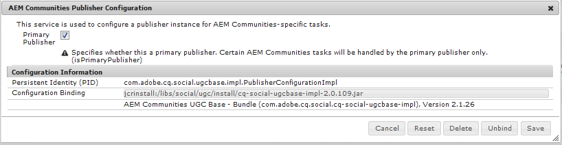

# Upgrading to AEM 6.4 Communities {#upgrading-to-aem-communities}

Depending on each site's topology and features, the following actions may be necessary when upgrading to AEM Communities 6.4 or installing the latest feature pack.

This section is specific to Communities and supplements the information provided in [Upgrading to AEM 6.4](../../help/sites-deploying/upgrade.md) (platform).

## Upgrading from AEM 6.1 or Later {#upgrading-from-aem-or-later}

### Reindex Solr {#reindex-solr}

When installing a new Communities feature pack on a deployment configured with MSRP, it will be necessary to:

1. Install the [latest feature pack](deploy-communities.md#latestfeaturepack)
2. Install the [latest Solr config files](msrp.md#upgrading)
3. Reindex MSRP

   see section [MSRP Reindex Tool](msrp.md#msrp-reindex-tool)

### Enablement 2.0 {#enablement}

As of AEM 6.3, the enablement features no longer store reporting information in MySQL. The MySQL dependency is only there for tracking SCORM content.

Please contact [customer care](https://helpx.adobe.com/marketing-cloud/contact-support.html) for assistance in migrating content from Enablement 1.0.

## Upgrading from AEM 6.0 {#upgrading-from-aem}

If pre-existing UGC needs to be retained, then the means to do so depends on whether the deployment stored UGC [on-premise](#on-premise-storage) or in the [Adobe cloud](#adobe-cloud-storage).

### Adobe Cloud Storage {#adobe-cloud-storage}

If the upgraded site was configured to use Adobe cloud storage, then it may appear (incorrectly) as if all UGC has been lost as the SRP methods will be unable to locate the pre-existing UGC in the old location.

Thus, there is the ability to instruct ASRP to use `AEM 6.0 compatability-mode` to access UGC.

For all AEM 6.3 author and publish instances

1. Sign in with administrator privileges
2. Configure [ASRP](asrp.md)
3. Follow these steps to make pre-existing UGC visible:
  i. Browse to the web console, for example
   [https://&lt;host&gt;:&lt;port&gt;/system/console/configMgr](http://localhost:4502/system/console/configMgr)
  ii. Locate **[!UICONTROL AEM Communities Utilities]** configuration
  iii. Select to expand config panel
    * *Uncheck* **`Cloud Storage`**
    * Select **[!UICONTROL Save]**

 

### On-premise Storage {#on-premise-storage}

If the upgraded site did not use cloud storage, any pre-existing UGC must be converted to conform to the new structure introduced in AEM 6.1 Communities in support of the common store.

For this purpose, an open source migration tool is available on GitHub:  
[AEM Communities UGC Migration Tool](https://github.com/Adobe-Marketing-Cloud/communities-ugc-migration)

### Java APIs {#java-apis}

When upgrading from AEM 6.0 social communities to AEM 6.3 Communities, be aware that many APIs have been reorganized into different packages. Most should be easily resolved when using an IDE for customization of Communities features.

For details on the deprecated SocialUtils package, visit [SocialUtils Refactoring](socialutils.md).

See also [Using Maven for Communities](maven.md).

### No JSP Component Templates {#no-jsp-component-templates}

The [social component framework](scf.md) (SCF) uses the [HandlebarsJS](https://www.handlebarsjs.com/) (HBS) templating language in place of Java Server Pages (JSP) used prior to AEM 6.0.

In AEM 6.0, the JSP components remained alongside the new HBS framework components in the same location, with the HBS components typically located in subfolders named "hbs".

As of AEM 6.1, the JSP components were completely removed. For Communities, it is recommended to replace all use of JSP components with SCF components.

## AEM Communities UGC Migration Tool {#aem-communities-ugc-migration-tool}

The [AEM Communities UGC Migration Tool](https://github.com/Adobe-Marketing-Cloud/communities-ugc-migration) is an open source migration tool, available on GitHub, that can be customized to export UGC from earlier versions of AEM social communities and import into AEM Communities 6.1 or later.

In additin to moving UGC from earlier versions, it is also possible to use the tool to move UGC from one [SRP](working-with-srp.md) to another, such as from MSRP to DSRP.

## Upgrading from AEM 5.6.1 or Earlier {#upgrading-from-aem-or-earlier}

Conceptually, there are three generations of communities components:

**Gen 1**: roughly CQ 5.4 through AEM 5.6.0 - these are the **collab** components which stored UGC in the local repository using replication as a means of synchronizing UGC across platforms. Other differences involve the implementation using Java Server Pages (JSP) as well as the blog feature consisting of authoring only in the author environment.

**Gen 2**: from AEM 5.6.1 through AEM 6.1 - this is a mix of **collab** and **social** components. AEM 6.0 introduced the new [social component framework](scf.md) (SCF) and AEM 6.2 introduced a [common UGC store](working-with-srp.md) where UGC is accessed using a [storage resource provider](srp.md) (SRP).

**Gen 3**: from AEM 6.2 forward, there are only **social** components, implemented in SCF as Handlebars (HBS) components requiring a choice of SRP for UGC.
