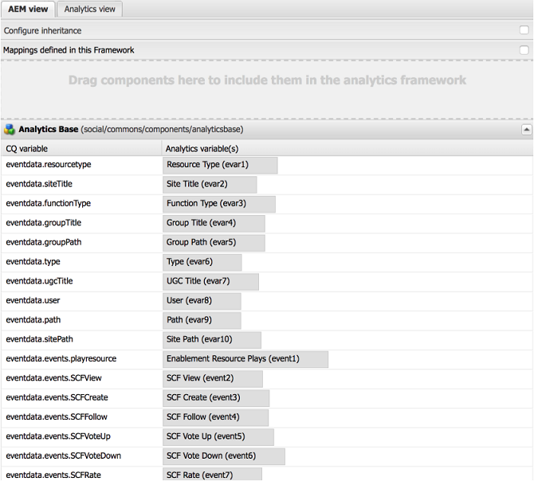

# User and UGC Management Service in AEM Communities {#user-and-ugc-management-service-in-aem-communities}

>[!IMPORTANT]
>
>GDPR is used as an example in the sections below, but the details covered are applicable to all data protection and privacy regulations; such as GDPR, CCPA and so on.

AEM Communities exposes APIs out-of-the-box to manage user profiles and bulk manage user generated content (UGC). Once enabled, the **UserUgcManagement** service allows the privileged users (community administrators and moderators) to disable user profiles, and bulk delete or bulk export UGC for specific users. These APIs also enable controllers and processors of customer data to comply with the European Union's General Data Protection Regulations (GDPR) and other GDPR inspired privacy mandates.

For further information see the [GDPR page at the Adobe Privacy Center](https://www.adobe.com/privacy/general-data-protection-regulation.html).

>[!NOTE]
>
>If you configured [Adobe Analytics in AEM Communities](/help/communities/analytics.md) site, the captured user data is sent to Adobe Analytics server. Adobe Analytics provides APIs that let you access, export, and delete user data and comply with GDPR. For more information, see [Submit Access and Delete Requests](https://experienceleague.adobe.com/docs/analytics/admin/data-governance/gdpr-submit-access-delete.html).

To put these APIs to use, you need to enable the `/services/social/ugcmanagement` endpoint by activating the UserUgcManagement service. To activate this service, install the [sample servlet](https://github.com/Adobe-Marketing-Cloud/aem-communities-ugc-migration/tree/main/bundles/communities-ugc-management-servlet) available on [GitHub.com](https://github.com/Adobe-Marketing-Cloud/aem-communities-ugc-migration/tree/main/bundles/communities-ugc-management-servlet). Then, hit the endpoint on publish instance of your communities site with appropriate parameters using an http request, similar to:

`https://localhost:port/services/social/ugcmanagement?user=<authorizable ID>&operation=<getUgc>`. However, you can also build a UI (user interface) to manage user profiles and user generated content in system.

These APIs enable perform the following functions.

## Retrieve the UGC of a user {#retrieve-the-ugc-of-a-user}

**getUserUgc(ResourceResolver resourceResolver, String user, OutputStream outputStream)** helps export all the UGC of a user from the system.

* **user**: Authorizable ID of a user.
* **outputStream**: Result is returned as output stream, which is a zip file including the user generated content (as json file) and attachments (which include images or videos uploaded by the user).

For example, to export the UGC of a user named Weston McCall, who uses weston.mccall@dodgit.com as authorizable ID to log in to communities site, you can send an http GET request similar to the following:

`https://localhost:port/services/social/ugcmanagement?user=weston.mccall@dodgit.com&operation=getUgc`

## Delete the UGC of a user {#delete-the-ugc-of-a-user}

**deleteUserUgc(ResourceResolver resourceResolver, String user)** helps delete all the UGC for a user from the system.

* **user**: Authorizable ID of the user.

For example, to delete the UGC of a user having authorizable ID weston.mccall@dodgit.com through http-POST request, use the following parameters:

* user = `weston.mccall@dodgit.com`
* operation = `deleteUgc`

### Delete UGC from Adobe Analytics {#delete-ugc-from-adobe-analytics}

To delete user data from the Adobe Analytics, follow the [GDPR Analytics workflow](https://experienceleague.adobe.com/docs/analytics/admin/data-governance/an-gdpr-workflow.html); as the API does not delete user data from Adobe Analytics.

For Adobe Analytics variables mappings used by AEM Communities, refer the following image:

## Disable a User Account {#disable-a-user-account}

**deleteUserAccount(ResourceResolver resourceResolver, String user)** helps disable a user account.

* **user**: Authorizable ID of the user.

>[!NOTE]
>
>Disabling a user deletes all the user generated content that the user has on the server.

For example, to delete the profile of a user having authorizable ID `weston.mccall@dodgit.com` through http-POST request, use the following parameters:

* user = `weston.mccall@dodgit.com`
* operation = `deleteUser`

>[!NOTE]
>
>deleteUserAccount() API only disables a user profile in the system and removes the UGC. However, to delete a user profile from the system, navigate to **CRXDE Lite**: [https://&lt;server&gt;/crx/de](https://localhost:4502/crx/de), locate the user node and delete it.
