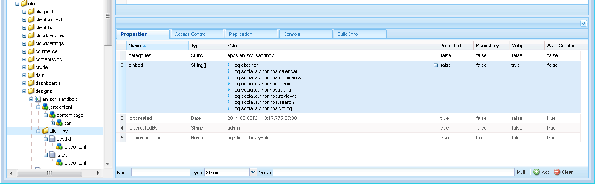

# Add Clientlibs{#add-clientlibs}

| ** [⇐ Develop Sandbox Application](/communities/using/develop-app.md)** |** [Develop Sandbox Content ⇒](/communities/using/develop-content.md)** |
|---|---|

### Add a ClientLibraryFolder (clientlibs) {#add-a-clientlibraryfolder-clientlibs}

Create a ClientLibraryFolder named `clientlibs`which will contain the JS and CSS used to render the pages of your site.

The `categories`property value given to this client library is the identifier used to directly include this clientlib from a content page or to embed it in other clientlibs.

1. using **CRXDE Lite**, expand `/etc/designs`

1. right click `an-scf-sandbox` and select `Create Node`

    * Name : `clientlibs`
    * Type : `cq:ClientLibraryFolder`

1. click **OK**


In the **Properties** tab for the new `clientlibs` node, enter the **`categories`**property:

* Name : **categories**
* Type : **String**
* Value : **apps.an-scf-sandbox**
* click **Add**
* click **Save All**

Note : prefacing the categories value with 'apps.' is a convention to identify the 'owning application' as being in the /apps folder, not /libs.  IMPORTANT : Add placeholder `js.tx`t and**`css.tx`**t files. (It's not officially a cq:ClientLibraryFolder without them.)

1. right click **`/etc/designs/an-scf-sandbox/clientlibs`**
1. select** Create File...**
1. enter** Name:** `css.txt`

1. select** Create File... **
1. enter **Name:** `js.txt`

1. click **Save All**


The first line of the css.txt and js.txt identifies the base location from which the following lists of files are to be found.

Try setting the content of css.txt to

```
#base=.
 style.css
```

Then create a file under clientlibs named style.css, and set the content to

`body {`

`background-color: #b0c4de;`

`}`

### Embed SCF Clientlibs {#embed-scf-clientlibs}

In the **Properties** tab for the `clientlibs` node, enter the multi-value String property **embed**. This embeds the necessary [client-side libraries (clientlibs) for SCF components](/communities/using/client-customize.md#clientlibs-for-scf). For this tutorial many of the clientlibs necessary for the Communities components are added.

**Note** that this may or may not be the desired approach to use for a production site as there are considerations of convenience versus size/speed of the clientlibs downloaded for every page.

If only using one feature on one page, you could include that feature's complete clientlib directly on the page, e.g., &lt;% ui:includeClientLib categories=cq.social.hbs.forum" %&gt;

In this case, including them all and so the more basic SCF clientlibs which are the author clientlibs are prefered:

* Name : **`embed`**
* Type : **`String`**
* click **`Multi`**
* Value: **`cq.social.scf`** 
  *&lt;enter&gt; will pop up a dialog  
  click **[+] **after each entry to add the following clientlib categories:*

    * **`cq.ckeditor`**
    * **`cq.social.author.hbs.comments`**
    * **`cq.social.author.hbs.forum`**
    * **`cq.social.author.hbs.rating`**
    * **`cq.social.author.hbs.reviews`**
    * **`cq.social.author.hbs.voting`**
    * click **OK**

* click **Save All**


This is how `/etc/designs/an-scf-sandbox/clientlibs` should now appear in the repository :

 

### Include Clientlibs in PlayPage Template {#include-clientlibs-in-playpage-template}

Without including the `apps.an-scf-sandbox` ClientLibraryFolder category on the page, the SCF components will not be functional nor styled as the necessary Javascript(s) and style(s) will not be available.

For example, without including the clientlibs, the SCF comments component appears unstyled :


Once apps.an-scf-sandbox clientlibs is included, the SCF comments component appears styled :


The include statement belongs in the <head> section of the <html> script. The default **`foundation head.jsp`** includes a script that can be overlaid : **`headlibs.jsp`**.

**Copy headlibs.jsp and include clientlibs:**

1. using **CRXDE Lite**, select **`/libs/foundation/components/page/headlibs.jsp`**

1. right click and select **Copy **(or select Copy from the toolbar)
1. select**`/apps/an-scf-sandbox/components/playpage`**
1. right click and select **Paste **(or select Paste from the toolbar)
1. double click **`headlibs.jsp`** to open it
1. append the following line to the end of the file  
   **`<ui:includeClientLib categories="apps.an-scf-sandbox"/>`**

1. click **Save All**

```xml
<%@ page session="false" %><%
%><%@include file="/libs/foundation/global.jsp" %><%
%><ui:includeClientLib categories="cq.foundation-main"/><%
%>
<cq:include script="/libs/cq/cloudserviceconfigs/components/servicelibs/servicelibs.jsp"/>
<% currentDesign.writeCssIncludes(pageContext); %>
<ui:includeClientLib categories="apps.an-scf-sandbox"/>

```

Load your website in the browser and see if the background is not a shade of blue.

[http://localhost:4502/content/an-scf-sandbox/en/play.html](http://localhost:4502/content/an-scf-sandbox/en/play.html)

 

### Saving Your Work So Far {#saving-your-work-so-far}

At this point, there exists a minimalist sandbox, and it might be worth saving as a package so that, while playing, if your repository becomes corrupt and you desire to start over, you can turn your server off, rename or delete the folder crx-quickstart/, turn your server on, upload and install this saved package, and not have to repeat these most basic of steps.

This package exists on the [Create a Sample Page](/communities/using/create-sample-page.md) tutorial for those who can't wait to just jump in and start playing!...

To create a package:

* from CRXDE Lite click the [Package icon](http://localhost:4502/crx/packmgr/) 
* click **Create Package**

    * Package Name: an-scf-sandbox-minimal-pkg
    * Version: 0.1
    * Group: &lt;leave as default&gt;
    * click **OK**

* click **Edit**

    * select **Filters **tab

        * click **Add filter**
        * Root Path: &lt;browse to** /apps/an-scf-sandbox**&gt;
        * click **Done**
        * click **Add filter**
        * Root Path: &lt;browse to **/etc/designs/an-scf-sandbox**&gt;
        * click **Done**
        * click **Add filter**
        * Root Path: &lt;browse to **/content/an-scf-sandbox**&gt;
        * click **Done**

    * click **Save**

* click **Build**

Now you can select **Download **to save it to disk and **Upload Package** elsewhere, as well as select **More &gt; Replicate** in order to push the sandbox to a localhost publish instance to expand the realm of your sandbox.  

| ** [⇐ Develop Sandbox Application](/communities/using/develop-app.md)** |** [Develop Sandbox Content ⇒](/communities/using/develop-content.md)** |
|---|---|

