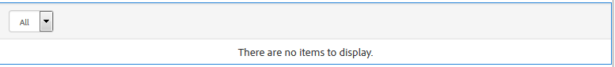

# Advanced Scoring and Badges{#advanced-scoring-and-badges}

## Overview {#overview}

Advanced scoring allows awarding of badges to identify members as experts. Advanced scoring assigns points based on the quantity *and *quality of content created by a member, whereas basic scoring assigns points simply based on the quantity of content created.

This difference is due to the scoring engine used to calculate the scores. The basic scoring engine applies simple math. The advanced scoring engine is an adaptive algorithm that rewards active members who contribute valued and relevant content, deduced through natural language processing (NLP) of a topic.

In addition to content relevance, the scoring algorithms take into account member activities, such as voting and percentage of answers. While basic scoring includes them quantitatively, advanced scoring uses them algorithmically.

Therefore, the advanced scoring engine requires enough data to make analysis meaningful. The achievement threshold for becoming an expert is constantly re-evaluated as the algorithm continually adjusts to the volume and quality of content created. There is also a concept of *decay *of a member's older posts. If an expert member stops participating in the subject matter where they gained expert status, at some pre-determined point (see [scoring engine configuration](#configurable-scoring-engine)) they could lose their status as an expert.

Setting up advanced scoring is virtually the same as basic scoring:

* basic and advanced scoring and badging rules are [applied to content](../../communities/using/implementing-scoring.md#apply-rules-to-content) in the same manner

    * basic and advanced scoring and badging rules may be applied to the same content

* [enabling badges for components](../../communities/using/implementing-scoring.md#enable-badges-for-component) is generic

The differences in setting up the scoring and badging rules are:

* configurable advanced scoring engine
* advanced scoring rules:

    * scoringType set to 'advanced'
    * requires stopwords

* advanced badging rules:

    * badgingType set to 'advanced'
    * badgingLevels set to number of expert levels to award
    * requires badgingPaths array of badges instead of thresholds array mapping points to badges

>[!NOTE]
>
>To use advanced scoring and badging capabilities, install the [Expert Identification package](https://www.adobeaemcloud.com/content/marketplace/marketplaceProxy.html?packagePath=/content/companies/public/adobe/packages/cq640/social/cq-social-expert-identification-pkg).

## Configurable Scoring Engine {#configurable-scoring-engine}

The advanced scoring engine provides an OSGi configuration with parameters that affect the advanced scoring algorithm. 

* **scoring weights** 
  For a topic, specify the verb that should be given the highest priority when calculating the score. One or more topics may be entered, but limited to **one verb per topic**. See [Topics and Verbs](../../communities/using/implementing-scoring.md#topics-and-verbs).  
  Entered as `topic,verb` with the comma escaped. For example:  
  `/social/forum/hbs/social/forum\,ADD`  
  Default is set to the ADD verb for QnA and forum components.

* **scoring range** 
  The range for advanced scores is defined by this value (maximum possible score) and 0 (lowest possible score.  
  Default value is 100 so that scoring range is 0-100.

* **entity decay time interval** 
  This parameter represents the number of hours after which all entity scores are decayed. This is required to no longer include old content in scores for a community site.  
  Default value is 216000 hours (~24 years).

* **scoring growth rate** 
  This specifies the score between 0 and scoring range, beyond which growth slows to limit the number of experts.  
  Default value is 50.

## Advanced Scoring Rules {#advanced-scoring-rules}

In basic scoring, the quantity needed to earn a badge is known.

In advanced scoring, the quantity needed is constantly adjusting based on the amount of quality data within the system. The scoring is continually calculated in a manner similar to a bell curve.

If a member earned an expert badge on a topic which is no longer active, there is a possibility they will lose their badge due to decay over time.

### scoringType {#scoringtype}

A scoring rule is a set of scoring sub-rules, each of which declares the `scoringType`.

To invoke the advanced scoring engine, the `scoringType`should be set to `advanced`.

See [Scoring Sub-Rules](../../communities/using/implementing-scoring.md#scoring-sub-rules).

### Stopwords {#stopwords}

The advanced scoring package installs a configuration folder that contains a stopwords file:

* /etc/community/scoring/configuration/stopwords

The advanced scoring algorithm uses the list of words contained in the stopwords file to identify common English words that are ignored during content processing.

There is no expectation that this file would be modified.

If the stopwords file is missing, the advanced scoring engine will throw an error.

## Advanced Badging Rules {#advanced-badging-rules}

The advanced badging rule properties differ from the [basic badging rule properties](../../communities/using/implementing-scoring.md#badging-rules).

Instead of associating points with a badge image, it is only necessary to identify the number of experts allowed and the badge image to award.

<table border="2" cellpadding="4" cellspacing="2" width="90%"> 
 <tbody>
  <tr>
   <th style="text-align: center;">Property</th> 
   <th style="text-align: center;">Type</th> 
   <th style="text-align: left;">Value Description</th> 
  </tr>
  <tr>
   <td style="text-align: center;">badgingPath</td> 
   <td style="text-align: center;">String[]</td> 
   <td style="text-align: left;"><em>(required)</em> A multi-value string of badge images up to the number of badgingLevels. The badge image paths must be ordered so the first is awarded to the highest expert. If there are less badges than indicated by badgingLevels, the last badge in the array fills out the rest of the array. Example entry:  /etc/community/badging/images/expert-badge/jcr:content/expert.png</td> 
  </tr>
  <tr>
   <td style="text-align: center;">badgingLevels</td> 
   <td style="text-align: center;">Long</td> 
   <td style="text-align: left;"><em>(optional)</em> Specifies the levels of expertise to be awarded. For example, if there should be an expert and an almost expert (two badges), then the value should be set to 2. The badgingLevel should correspond with the number of expert-related badge images listed for the badgingPath property. Default is 1.</td> 
  </tr>
  <tr>
   <td style="text-align: center;">badgingType</td> 
   <td style="text-align: center;">String</td> 
   <td style="text-align: left;"><em>(required)</em> Identifies the scoring engine as either "basic" or "advanced". Set to "advanced" else the default is "basic".</td> 
  </tr>
  <tr>
   <td style="text-align: center;">scoringRules</td> 
   <td style="text-align: center;">String[]</td> 
   <td style="text-align: left;"><em>(optional)</em> A multi-value string to restrict the badging rule to scoring events identified by the scoring rule(s) listed.  Example entry:  /etc/community/scoring/rules/adv-comments-scoring  Default is no restriction.</td> 
  </tr>
 </tbody>
</table>

## Included Rules and Badge {#included-rules-and-badge}

### Included Badge {#included-badge}

Included in this beta release is one reward-based expert badge:

* expert  
  /etc/community/badging/images/expert-badge/jcr:content/expert.png

For the expert badge to appear as a reward for activity, make sure:

* `badges` are enabled for the feature, such as a forum or QnA component
* advanced scoring and badging rules are applied to the page (or ancestor) on which the component is placed

See the basic information for:

* [enabling badging for a component](../../communities/using/implementing-scoring.md#enableforcomponent)
* [applying rules](../../communities/using/implementing-scoring.md#applytopage)

### Included Scoring Rules and Sub-Rules {#included-scoring-rules-and-sub-rules}

Included in the beta release are two advanced scoring rules for the [forum function](../../communities/using/functions.md#forum-function) (one each for the forum and comments components of the forum feature):

1. /etc/community/scoring/rules/adv-comments-scoring

    * subRules[] =  
      /etc/community/scoring/rules/sub-rules/adv-comments-rule  
      /etc/community/scoring/rules/sub-rules/adv-voting-rule-owner  
      /etc/community/scoring/rules/sub-rules/adv-voting-rule

1. /etc/community/scoring/rules/adv-forums-scoring

    * subRules[] =  
      /etc/community/scoring/rules/sub-rules/adv-forums-rule  
      /etc/community/scoring/rules/sub-rules/adv-comments-rule  
      /etc/community/scoring/rules/sub-rules/adv-voting-rule-owner

**Notes:**

* both `rules`and `sub-rules` nodes are of type cq:Page

* `subRules`is an attribute of type String[] on the rule's `jcr:content` node

* `sub-rules` may be shared among various scoring rules
* `rules`should be located in a repository location with read permission for everyone

    * rule names must be unique regardless of location

### Included Badging Rules {#included-badging-rules}

Included in the release are two advanced badging rules that correspond to the [advanced forums and comments scoring rules](#included-scoring-rules-and-sub-rules).

* /etc/community/badging/rules/adv-comments-badging
* /etc/community/badging/rules/adv-forums-badging

**Notes:**

* `rules` nodes are of type cq:Page
* `rules`should be located in a repository location with read permission for everyone

    * rule names must be unique regardless of location

