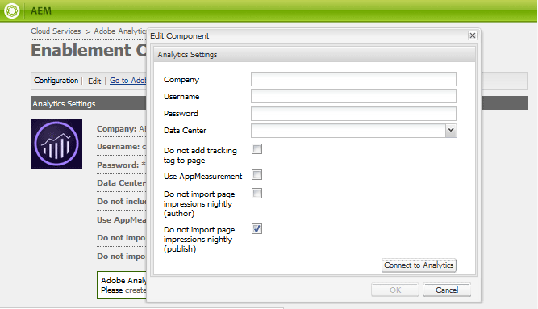

# Analytics Configuration for Communities Features{#analytics-configuration-for-communities-features}

## Overview {#overview}

Adobe Analytics and Adobe Experience Manager (AEM) are both solutions of Adobe Marketing Cloud.

Adobe Analytics may be configured for AEM Communities so that, as a member interacts with supported Communities features, events are sent to Adobe Analytics from which reports are generated.

For example, when a member of an enablement community site views a video resource assigned to them, the resource player will send events to Analytics, including video heartbeat data. From the community site, administrators are able to see various reports regarding the playing of the video.

Further, analytics is necessary for:

* in the publish environment:

    * reporting on community [trends](../../communities/using/trends.md)
    * allow site visitors to sort by "most viewed", "most active", "most liked"
    * view counts on UGC lists

* in the author environment:

    * display of participation data in the [members management console](/communities/using/members.md) (views, posts, follows, likes)
    * trend summary, video heartbeat and video device for enablement resource [reports](../../communities/using/reports.md)

Supported Communities features include:

* [enablement resources](/communities/using/resources.md)
* [forum](../../communities/using/forum.md)
* [QnA](../../communities/using/working-with-qna.md)
* [blog](../../communities/using/blog-feature.md)
* [file library](../../communities/using/file-library.md)
* [calendar](../../communities/using/calendar.md)

This section of the documentation describes how to connect an Analytics report suite with Communities features. The basic steps are:

1. [Replicate the crypto key](#replicate-the-crypto-key) to ensure encryption/decryption occurs correctly on all AEM instances
1. Prepare an Adobe Analytics [report suite](#adobe-analytics-report-suite-for-video-reporting)
1. Create an AEM Analytics [cloud service](#aem-analytics-cloud-service-configuration) and [framework](#aem-analytics-framework-configuration)

1. [Enable Analytics](#enable-analytics-for-a-community-site) for a community site
1. [**Verify**](#verify-analytics-to-aem-variable-mapping) Analytics to AEM variable mapping
1. Identify [primary publisher](#primary-publisher)
1. [Publish](#publish-community-site-and-analytics-cloud-service) the community site
1. Configure [import of report data](#obtaining-reports-from-analytics) from Adobe Analytics to the community site

## Prerequisites {#prerequisites}

To configure Analytics for Communities features, it is necessary to work with your account representative to setup an Adobe Analytics account and [report suite](#adobe-analytics-report-suite-for-video-reporting). Once established, the following information should be available:

* Company Name  
  the company that is associated with the Adobe Analytics account
* User name  
  the login user name for the user authorized to manage the Analytics account  
  (should include Web Service Access privileges)

* Password  
  the login password for the authorized user
* Analytics Data Center  
  the URL of the Analytics data center for the account
* Report Suite  
  the name of the Analytics report suite to use

## Adobe Analytics Report Suite for Video Reporting {#adobe-analytics-report-suite-for-video-reporting}

Using the Adobe Marketing Cloud's [Report Suite Manager](https://marketing.adobe.com/resources/help/en_US/reference/new_report_suite.html), Analytics report suites can be configured so that a community site may be enabled to provide reports for Communities features.

By signing in to [Adobe Marketing Cloud](https://marketing.adobe.com/resources/help/en_US/analytics/getting-started/analytics-navigation.html) with [Company Name and User name](../../communities/using/analytics.md#prerequisites), it is possible to configure a new or existing report suite to have:

* [11 Conversion Variables](https://marketing.adobe.com/resources/help/en_US/reference/conversion_var_admin.html) (eVars)

    * **`evar1`** through **`evar11`** enabled
    
    * can repurpose (rename) existing eVars or create new ones to use for Communities features

* [7 Success Events](https://marketing.adobe.com/resources/help/en_US/reference/success_event.html) (events)

    * **`event1`** through **`event7`** enabled
    
    * type **`Counter`**

        * not **`Counter (no subrelations)`**

    * can repurpose (rename) existing events or create new ones to use for Communities features

* [Video Management](https://marketing.adobe.com/resources/help/en_US/sc/appmeasurement/hbvideo/video_analytics_config.html)

    * Video Reporting console

        * enable `Video Core`
        * select Save

    * Video Core measurement console

        * select `Use Solution Variables`
        * select Save

If using a **new report suite**, be aware that a new report suite may only have 4 evars and 6 event variables, while 11 evars and 7 event vars are required for Communities.

If using an **existing report suite**, it may be necessary to [modify the variable mapping](#modifying-analytics-variable-mapping) prior to activating the Analytics framework for a community site. Contact your account representative for any concerns regarding the variables dedicated to Communities.

>[!CAUTION]
>
>**If using an existing report suite that already uses variables within**
>
>* **`evar1`** through **`evar11`**
>
>* **`event1`** through **`event7`**
>
>**Then before the community site is published,** it is important to restore the pre-existing mapping by moving the AEM variables that were automatically mapped to Analytics variables when Analytics was enabled for a community site.
>
>To restore the pre-existing mapping and move AEM variables to other Analytics variables, see the section on [Modifying Analytics Variable Mapping](#modifying-analytics-variable-mapping).
>
>Failure to do so may result in unrecoverable data loss.

### Video Heartbeat Analytics {#video-heartbeat-analytics}

When Video Heartbeat Analytics is licensed, a `Marketing Cloud Org Id` is assigned.

To enable Video Heartbeat reporting after [configuring the Analytics report suite for video reporting](#adobe-analytics-report-suite-for-video-reporting):

* create an [Analytics cloud service](#aem-analytics-cloud-service-configuration)
* enable [Analytics for a community site](#enable-analytics-for-a-community-site)
* associate the `Marketing Cloud Org Id` with the community site

The `Marketing Cloud Org Id` may be entered at the time of [community site creation](../../communities/using/sites-console.md#enablement) or later by [modifying](../../communities/using/sites-console.md#modifying-site-properties) the community site properties. [](#aem-analytics-cloud-service-configuration)


When Video Heartbeat Analytics is enabled, the JavaScript (JS) code for the video player instantiates the video heartbeat library code (also in JS) which handles all the logic for sending video status updates to the Analytics video tracking servers every 10 seconds (not configurable) and eventually sending a cumulative report of the video session to the main Analytics servers.

If not enabled, the video heartbeat code is never instantiated and only the video progress and resume position tracking is persisted to SRP for reporting.

## AEM Analytics Cloud Service Configuration {#aem-analytics-cloud-service-configuration}

To create a new Analytics Integration, which integrates Adobe Analytics with the AEM community site, using the standard UI on the author instance:

* from global navigation: **Tools, Deployment, Cloud Services**
* scroll down to **Adobe Analytics**
* select either **Configure Now** or **Show Configurations**

 

### Create Configuration Dialog {#create-configuration-dialog}

* select **[+]** icon next to **Available Configurations** to create a new configuration

On the Create Configuration dialog, the values to be entered identify the configuration.


* **Title** 
  (required) A display title for the configuration.  
  For example, enter *Enablement Community Analytics*

* **Name** 
  (optional) If not specified, the name will default to a valid node name derived from the title.  
  For example, enter *communities*

* *Template* 
  Select `Adobe Analytics Configuration`

* Select **Create **

    * launches configuration page and opens `Analytics Settings` dialog

### Analytics Settings Dialog {#analytics-settings-dialog}

The initial creation of a new Analytics configuration results in the display of the configuration and a new dialog for entry of the Analytics Settings. This dialog requires the [prerequisite account information](#prerequisites) obtained from the account representative.



* **Company** 
  the company that is associated with the Adobe Analytics account

* **User name** 
  the login user name for the user authorized to manage the Analytics account

* **Password** 
  the login password for the authorized user

* **Data Center** 
  select the Analytics data center hosting the report suite

* **Do not add tracking tag to page** 
  leave as default (deselected)

* **Use AppMeasurement** 
  leave as default (deselected)

* **Do not import page impressions nightly (author)** 
  leave as default (deselected)

* **Do not import page impressions nightly (publish)** 
  leave as default (deselected)

To save the settings:

* select **Connect to Analytics**

    * if not successful,

        * verify entries do not contain leading spaces
        * try a different data center
        * contact your account representative

* select **OK**

 

### Create Framework {#create-framework}

After successful configuration of the basic connection to Adobe Analytics, it is necessary to create or edit a framework for the community site. The purpose of the framework is to map Communities feature (AEM) variables to Analytics (report suite) variables.

* select `[+]` icon next to **Available Frameworks** to create a new framework


* **Title** 
  (required) A display title for the framework  
  For example, enter *Enablement Community Framework*

* **Name** 
  (optional) If not specified, the name will default to a valid node name derived from the title.  
  For example, enter *communities*

* *Template* 
  Select `Adobe Analytics Framework`

* Select **Create**

Creating the Analytics Framework opens the framework for configuration.

## AEM Analytics Framework Configuration {#aem-analytics-framework-configuration}

The purpose of the framework is to map AEM variables to Analytics variables (eVars and events). The Analytics variables available for mapping are [defined in the report suite](#adobe-analytics-report-suite-for-video-reporting).

 

### Select Report Suite {#select-report-suite}

Select the report suite that has been set up for video reporting.

If a report suite has not yet been created or not properly set up, see the previous section:  
[Adobe Analytics Report Suite for Video Reporting](#adobe-analytics-report-suite-for-video-reporting)

The Sidekick is not needed and may be minimized so that it does not obstruct access to the Report Suites settings.

#### Report Suites dialog before and after selecting 'Add Item' {#report-suites-dialog-before-and-after-selecting-add-item}


1. Select **Add Item +.** 
   Two drop-down boxes appear.

1. Choose a `Report suite.`  
   The report suites associated with the Company account are available for selection.

1. Select **Yes **in the dialog that opens:

   ```
   Load default server settings?
    Do you want to load the default server settings and overwrite current values in the Server section?
   ```

1. Choose a `Run Mode`
1. Select **publish**


The Analytic cloud service and framework are now complete. The Mappings will be defined once a community site has been created with this Analytics service enabled.

## Enable Analytics for a Community Site {#enable-analytics-for-a-community-site}

### Enable for New Community Site {#enable-for-new-community-site}

To add the Analytics cloud service while [creating a new community site](../../communities/using/sites-console.md):

* In step 3, under the [ANALYTICS tab](../../communities/using/sites-console.md#analytics):  
  - select the **Enable Analytics** check box.  
  - select the framework from the drop-down box.

* Optionally, return to the Analytics framework configuration to adjust the variable mappings.

### Enable for Existing Community Site {#enable-for-existing-community-site}

To add the Analytics cloud service to an [existing community site](../../communities/using/sites-console.md#modifying-site-properties):

* Navigate to the **Communities, Sites** console.
* Select the community site's Edit Site icon.
* Select the SETTINGS.
* In the Analytics section:  
  - Select the **Enable Analytics** check box.  
  - Choose the framework from the drop-down box.

* Optionally, return to the Analytics framework configuration to adjust the variable mappings.

### Enable for Customized Sites {#enable-for-customized-sites}

In order for Analytics tracking and import to work properly for a community site, a page element with the `scf-js-site-title` class and href attributes must be present. Only one such element should exist on the page, such as it does in an unmodified `sitepage.hbs` script for a community site. The value of `siteUrl` is extracted and sent to Adobe Analytics as the *site path*.

```xml
# present in default sitepage.hbs
# only one scf-js-site-title class should be included
# this example sets it to be hidden as it serves no visual purpose
<div 
    class="navbar-brand scf-js-site-title" 
    href="{{siteUrl}}.html" 
    style="visibility: hidden;"
>
</div>
```

For a **customized community site** that overlays the `sitepage.hbs` script, ensure the element is present. The `siteUrl`variable will be set when rendered on the server before serving to the client.

For a **generic AEM site** that includes Communities components, but is not created with the [site creation wizard](../../communities/using/sites-console.md), it is necessary to add the element. The value of the href should be the path to the site. For example, if the site path is `/content/my/company/en`, then use:

```xml
<div 
    class="navbar-brand scf-js-site-title" 
    href="/content/my/company/en.html" 
    style="visibility: hidden;"
>
</div>
```

## Analytics for Communities Features {#analytics-for-communities-features}

Analytics is automatically used for several Communities features.

The author environment's [OSGi configuration](/sites/deploying/using/configuring-osgi.md), `AEM Communities Analytics Component Configuration`, provides a listing of the components that have been instrumented for Analytics. The automatic mapping of variables is determined by the components listed.

If new custom components are created that are instrumented for Analytics, they should be added to this list of configured components.

### Component Configuration {#component-configuration}


>[!NOTE]
>
>The journal components are used to implement the blog feature.

### Mapped Analytics to AEM Variables {#mapped-analytics-to-aem-variables}

Once the community site is saved with Analytics enabled and the cloud config framework selected, the AEM variables will be automatically mapped to the Analytics eVars and events beginning with evar1 and event1, respectively, and incrementing by 1.

If using an existing report suite that mapped any of the variables within evar1 through evar11 and event1 through event7, it will be necessary to [remap the AEM variables](#modifying-analytics-variable-mapping) and restore the original mapping.

Following is an example of default mappings after following the [getting started tutorial](/communities/using/getting-started-enablement.md):

 

#### Map of eVars sent with each event {#map-of-evars-sent-with-each-event}

<table border="1" cellpadding="2" cellspacing="2" width="100%"> 
 <tbody> 
  <tr> 
   <td style="text-align: center;"><strong> </strong></td> 
   <td style="text-align: center;"><strong>Enablement<br /> Resource<br /> Type</strong></td> 
   <td style="text-align: center;"><strong>Site<br /> Title</strong></td> 
   <td style="text-align: center;"><strong>Function<br /> Type</strong></td> 
   <td style="text-align: center;"><strong>Group<br /> Title</strong></td> 
   <td style="text-align: center;"><strong>Group<br /> Path</strong></td> 
   <td style="text-align: center;"><strong>UGC<br /> Type</strong></td> 
   <td style="text-align: center;"><strong>UGC<br /> Title</strong></td> 
   <td style="text-align: center;"><strong>User<br /> (Member)</strong></td> 
   <td style="text-align: center;"><strong>UGC<br /> Path</strong></td> 
   <td style="text-align: center;"><strong>Site<br /> Path</strong></td> 
  </tr> 
  <tr> 
   <td style="text-align: center;"><strong> </strong></td> 
   <td style="text-align: center;"><strong>eVar1</strong></td> 
   <td style="text-align: center;"><strong>eVar2</strong></td> 
   <td style="text-align: center;"><strong>eVar3</strong></td> 
   <td style="text-align: center;"><strong>eVar4</strong></td> 
   <td style="text-align: center;"><strong>eVar5</strong></td> 
   <td style="text-align: center;"><strong>eVar6</strong></td> 
   <td style="text-align: center;"><strong>eVar7</strong></td> 
   <td style="text-align: center;"><strong>eVar8</strong></td> 
   <td style="text-align: center;"><strong>eVar9</strong></td> 
   <td style="text-align: center;"><strong>eVar10</strong></td> 
  </tr> 
  <tr> 
   <td style="text-align: center;"><strong>event1<br /> Resource Play</strong></td> 
   <td style="text-align: center;"><em>(a)</em></td> 
   <td style="text-align: center;"><em>-</em></td> 
   <td style="text-align: center;"><em>-</em></td> 
   <td style="text-align: center;"><em>-</em></td> 
   <td style="text-align: center;"><em>-</em></td> 
   <td style="text-align: center;"><em>-</em></td> 
   <td style="text-align: center;"><em>-</em></td> 
   <td style="text-align: center;"><em>-</em></td> 
   <td style="text-align: center;"><em>(i)</em></td> 
   <td style="text-align: center;"><em>-</em></td> 
  </tr> 
  <tr> 
   <td style="text-align: center;"><strong>event2<br /> SCFView</strong></td> 
   <td style="text-align: center;"><em>(a)</em></td> 
   <td style="text-align: center;"><em>(b)</em></td> 
   <td style="text-align: center;"><em>(c)</em></td> 
   <td style="text-align: center;"><em>(d)</em></td> 
   <td style="text-align: center;"><em>(e)</em></td> 
   <td style="text-align: center;"><em>(f)</em></td> 
   <td style="text-align: center;"><em>(g)</em></td> 
   <td style="text-align: center;"><em>(h)</em></td> 
   <td style="text-align: center;"><em>(i)</em></td> 
   <td style="text-align: center;"><em>(j)</em></td> 
  </tr> 
  <tr> 
   <td style="text-align: center;"><strong>event3<br /> SCFCreate (Post)</strong></td> 
   <td style="text-align: center;"><em>-</em></td> 
   <td style="text-align: center;"><em>(b)</em></td> 
   <td style="text-align: center;"><em>(c)</em></td> 
   <td style="text-align: center;"><em>(d)</em></td> 
   <td style="text-align: center;"><em>(e)</em></td> 
   <td style="text-align: center;"><em>(f)</em></td> 
   <td style="text-align: center;"><em>(g)</em></td> 
   <td style="text-align: center;"><em>(h)</em></td> 
   <td style="text-align: center;"><em>(i)</em></td> 
   <td style="text-align: center;"><em>(j)</em></td> 
  </tr> 
  <tr> 
   <td style="text-align: center;"><strong>event4<br /> SCFFollow</strong></td> 
   <td style="text-align: center;"><em>-</em></td> 
   <td style="text-align: center;"><em>(b)</em></td> 
   <td style="text-align: center;"><em>(c)</em></td> 
   <td style="text-align: center;"><em>(d)</em></td> 
   <td style="text-align: center;"><em>(e)</em></td> 
   <td style="text-align: center;"><em>(f)</em></td> 
   <td style="text-align: center;"><em>(g)</em></td> 
   <td style="text-align: center;"><em>(h)</em></td> 
   <td style="text-align: center;"><em>(i)</em></td> 
   <td style="text-align: center;"><em>(j)</em></td> 
  </tr> 
  <tr> 
   <td style="text-align: center;"><strong>event5<br /> SCFVoteUp</strong></td> 
   <td style="text-align: center;"><em>-</em></td> 
   <td style="text-align: center;"><em>(b)</em></td> 
   <td style="text-align: center;"><em>(c)</em></td> 
   <td style="text-align: center;"><em>(d)</em></td> 
   <td style="text-align: center;"><em>(e)</em></td> 
   <td style="text-align: center;"><em>(f)</em></td> 
   <td style="text-align: center;"><em>(g)</em></td> 
   <td style="text-align: center;"><em>(h)</em></td> 
   <td style="text-align: center;"><em>(i)</em></td> 
   <td style="text-align: center;"><em>(j)</em></td> 
  </tr> 
  <tr> 
   <td style="text-align: center;"><strong>event6<br /> SCFVoteDown</strong></td> 
   <td style="text-align: center;"><em>-</em></td> 
   <td style="text-align: center;"><em>(b)</em></td> 
   <td style="text-align: center;"><em>(c)</em></td> 
   <td style="text-align: center;"><em>(d)</em></td> 
   <td style="text-align: center;"><em>(e)</em></td> 
   <td style="text-align: center;"><em>(f)</em></td> 
   <td style="text-align: center;"><em>(g)</em></td> 
   <td style="text-align: center;"><em>(h)</em></td> 
   <td style="text-align: center;"><em>(i)</em></td> 
   <td style="text-align: center;"><em>(j)</em></td> 
  </tr> 
  <tr> 
   <td style="text-align: center;"><strong>event7<br /> SCFRate</strong></td> 
   <td style="text-align: center;"><em>-</em></td> 
   <td style="text-align: center;"><em>(b)</em></td> 
   <td style="text-align: center;"><em>(c)</em></td> 
   <td style="text-align: center;"><em>(d)</em></td> 
   <td style="text-align: center;"><em>(e)</em></td> 
   <td style="text-align: center;"><em>(f)</em></td> 
   <td style="text-align: center;"><em>(g)</em></td> 
   <td style="text-align: center;"><em>(h)</em></td> 
   <td style="text-align: center;"><em>(i)</em></td> 
   <td style="text-align: center;"><em>(j)</em></td> 
  </tr> 
 </tbody> 
</table>

**Examples for eVar values :**

* *(a) [MIME type](https://www.iana.org/assignments/media-types)*: video/mp4
* *(b) [community site title](../../communities/using/sites-console.md#step13asitetemplate)*: Geometrixx Communities
* *(c) [community function name](../../communities/using/functions.md)*: Forum
* *(d) [community group name](../../communities/using/creating-groups.md#creating-a-new-group)*: Hiking
* *(e) path to community group content*: /content/sites/communities/en/groups/hiking
* *(f) [UGC component resourceType](/communities/using/essentials.md)*: social/forum/components/hbs/topic
* *(g) UGC component title*: Hiking Topics
* *(h) login (authorizableId)*: aaron.mcdonald@mailinator.com
* *(i) SRP path to UGC*: /content/usergenerated/asi/.../forum/jmtz-topic3  
  or *path of component to follow*: /content/sites/communities/en/jcr:content/content/primary/forum

* *(j) path to community site content*: /content/sites/community/en

### Modifying Analytics Variable Mapping {#modifying-analytics-variable-mapping}

The mapping of Analytics eVars and events to AEM variables is visible from the framework configuration after Analytics is enabled for a community site.

After Analytics has been enabled and before the community site is published, the mapping may be altered in the framework by dragging the desired Analytics evar or event from the left rail and dropping it into the relevant row in the mapping table.

To avoid duplicate mappings, be sure to remove the replaced Analytics evar or event from the row by hovering over it and selecting the "X" which appears to the right of the Analytics variable element.

If Communities eVars and events overwrite mappings that pre-existed in the report suite, then to avoid data loss, assign the AEM variables for Communities features to other Analytics eVars or events and restore the original mappings.

>[!CAUTION]
>
>It is important to remap before the community site is [published](#publishing-the-community-site) with Analytics enabled, else there is risk of data loss.

#### Example Step 1: Dragging Analytics evar14 into mapping table {#example-step-dragging-analytics-evar-into-mapping-table}

 

#### Example Step 2: Selecting 'x' to remove replaced evar11 {#example-step-selecting-x-to-remove-replaced-evar}

 

#### Example Step 3: AEM var eventdata.siteId remapped to Analytics evar14 {#example-step-aem-var-eventdata-siteid-remapped-to-analytics-evar}

 

## Publishing the Community Site {#publishing-the-community-site}

### Verify Analytics to AEM Variable Mapping {#verify-analytics-to-aem-variable-mapping}

It is wise to verify the variable mapping prior to publishing the community site, which also publishes the Analytics cloud service and framework.

See sections:

* [Mapped Analytics to AEM Variables](#mapped-analytics-to-aem-variables)
* [Modifying Analytics Variable Mapping](#modifying-analytics-variable-mapping)

>[!CAUTION]
>
>**If using an existing report suite that already uses variables within**
>
>* **`evar1`** through **`evar11`**
>
>* **`event1`** through **`event7`**
>
>**Then before the community site is published,** it is important to restore the pre-existing mapping and move the Communities AEM variables that were automatically mapped (when Analytics was enabled for the community site) to other Analytics variables. This re-mapping should be consistent across all Communities components.
>
>Failure to do so may result in unrecoverable data loss.

### Primary Publisher {#primary-publisher}

When the deployment chosen is a [publish farm](/communities/using/topologies.md#tarmk-publish-farm), then one AEM publish instance must be identified as the primary publisher for polling Adobe Analytics for report data to write to [SRP](../../communities/using/working-with-srp.md).

By default, the `AEM Communities Publisher Configuration` OSGi configuration identifies its publish instance as the primary publisher, such that all publish instances in a publish farm would self-identify as the primary.

Therefore, it is necessary to edit the configuration on all secondary publish instances to deselect the **Primary Publisher** check box.

For specific instructions, see the primary publisher section of [Deploying Communities](../../communities/using/deploy-communities.md#primary-publisher).

>[!CAUTION]
>
>It is important that the primary publisher be configured to prevent polling from multiple publish instances.

### Replicate the Crypto Key {#replicate-the-crypto-key}

The Adobe Analytics credentials are encrypted. To facilitate the replication or transmission of encrypted analytics credentials between author and publishers, all AEM instances must share the same master encryption key.

To do so, follow the instructions at [Replicate the Crypto Key](../../communities/using/deploy-communities.md#replicate-the-crypto-key).

### Publish Community Site and Analytics Cloud Service {#publish-community-site-and-analytics-cloud-service}

Once the Analytics cloud service has been enabled for a community site and, if necessary, the [mapping of Analytics to AEM variables has been adjusted](#mapped-analytics-to-aem-variables), it is necessary to replicate the configuration to the publish environment by [(re)publishing the community site](../../communities/using/sites-console.md#publishing-the-site).

## Obtaining Reports from Analytics {#obtaining-reports-from-analytics}

### Report Management {#report-management}

The author and primary publisher's [OSGi configuration](/sites/deploying/using/configuring-osgi.md), `AEM Communities Analytics Report Management`, is used to query Analytics.

On author, the queries are for real time reports.

On the primary publisher, the queries are used to provide information in preparation for the Report Importer's Analytic data import.

The query interval defaults to 10 seconds.

### Report Importer {#report-importer}

Once an Analytics enabled community site has been published, the primary publisher's [OSGi configuration](/sites/deploying/using/configuring-osgi.md), `AEM Communities Analytics Report Importer`, may be configured to set the default polling interval for those configurations which are not individually configured in CRXDE.

The polling interval controls the frequency of requests to Adobe Analytics for data to be pulled and saved into [SRP](../../communities/using/working-with-srp.md).

When the data may be categorized as "big data", more frequent polling may put a large load on the community site.

The default polling **Import interval** is set to 12 hours.

 

### Component Report Customization {#component-report-customization}

Presently, to customize the metrics to track, nodes are created in the repository that define time periods for which to generate a report on that metric.

The forum topic is presently the only example of this customization:

* On the primary publisher, sign in with administrative privileges.
* Navigate to [CRXDE Lite](../../sites/developing/using/developing-with-crxde-lite.md). For example, [http://localhost:4503/crx/de](http://localhost:4503/crx/de).

* Under the jcr:content node of the language root (for example `/content/sites/engage/en/jcr:content),`navigate to the component configured for Analytics reporting.  
  For example, **`analytics/reportConfigs/social_forum_components_hbs_topic`**

* Notice the time periods created:

    * `last30Days`
    * `last90Days`
    * `thisYear`

* Notice the `total`node.

    * Modifying the **`interval`**property overrides the Report Importer interval.
    * The value is in seconds, and is set to 4 hours (14400 seconds).

 

## Manage user data in Analytics {#manage-user-data-in-analytics}

Adobe Analytics provides APIs that allow you to access, export, and delete user data. For more information, see [Submit Access and Delete Requests](https://marketing.adobe.com/resources/help/en_US/analytics/gdpr/gdpr_submit_access_delete.html).

## Resources {#resources}

* Adobe Marketing Cloud: [Analytics Help and Reference](https://marketing.adobe.com/resources/help/en_US/reference/)
* AEM: [Integrating with Adobe Analytics](../../sites/administering/using/adobeanalytics.md)
* AEM: [Analytics with External Providers](../../sites/administering/using/external-providers.md)

