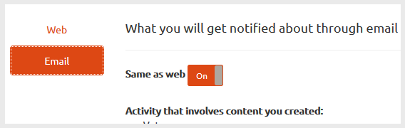

# Communities Notifications{#communities-notifications}

## Overview {#overview}

AEM Communities provides a notifications section which displays events of interest to the signed in community member.

Notifications are similar to [activities](../../communities/using/essentials-activities.md) and [subscriptions](/communities/using/subscriptions.md) as they may result from

* the member posting content
* the member choosing to follow another member
* the member choosing to follow specific topics, articles and other threads of content
* the member tagging (@mention) another community member in a user generated content

What distinguishes notifications from activities and subscriptions is

* a link to the notifications section is always present in a community site's header

    * activities require the [activity stream function](../../communities/using/functions.md#activity-stream-function) to be included in the community site's structure
    * subscriptions require [configuration of email](/communities/using/email.md)

* the implementation of notifications is through scalable and pluggable channels

    * activities are only available on the web
    * subscriptions are only available using email

As of Communities [FP1](../../communities/using/deploy-communities.md#latestfeaturepack), the notification channels available are

* the web channel, accessed using the `Notifications` link
* the email channel, available when email is properly configured

Future channels are mobile and desktop.

### Requirements {#requirements}

**Configure Email**

Email must be configured in order for the email channel for notifications to be functional.

For instructions on setting up email, see [Configuring Email](../../communities/using/analytics.md).

**Enable Follow**

Components must be configured to enable following. Features that allow following are [blog](../../communities/using/blog-feature.md), [forum](../../communities/using/forum.md), [QnA](../../communities/using/working-with-qna.md), [calendar](../../communities/using/calendar.md), [filelibrary](../../communities/using/file-library.md), and [comments](../../communities/using/comments.md).

Note that

* components used within community [site templates](/communities/using/sites.md) and [group templates](../../communities/using/tools-groups.md) may already be configured to allow following

* member profiles are already configured to allow other memebers to follow

## Notifications from Following {#notifications-from-following}


The **Follow **button provides a means to follow entries as activities, subscriptions and/or notifications. Each time the **Follow **button is selected, it is possible to toggle on or off a selection. The `Email Subscriptions` selection is only present when configured.

If any method of following is selected, the text of the button changes to **Following**. For convenience, it is possible to select `Unfollow All` to toggle off all methods.

The **Follow **button will appear

* when viewing another member's profile
* on a main feature page, such as forums, QnA, and blogs

    * follows all activity for that general feature

* for a specific entry, such as a forum topic, QnA question, or blog article

    * follows all activity for that specific entry

## Managing Notification Settings {#managing-notification-settings}

By selecting the Notification Settings link from the Notifications page, it is possible for each member to manage how notifications are received.

The web channel is always enabled.


The email channel, which relies on proper [configuration of email](/communities/using/email.md), provides the same settings as for the web channel.

The email channel is off by default.


It may be turned on by a member, but still depends on email being configured.

 

## Viewing Notifications {#viewing-notifications}

### Web Notifications {#web-notifications}

A [wizard created community site](../../communities/using/sites-console.md) now includes a link to the `Notifications` feature in the site's header bar above the banner. Unlike messages, notifications are created for every community site, while messages must be enabled during the site creation process.

When visiting the published site, selecting the `Notifications` link will display all notifications for the member.

 

### Email Notifications {#email-notifications}

When the email channel is enabled, the member receives an email which contains a link to the content on the web.

 

## Customize email notifications {#customize-email-notifications}

Organizations can customize the email notifications by [overlaying](/communities/using/client-customize.md#overlays) the templates at **/libs/settings/community/templates/email/html**.

For example, to modify the mentions emails notifications (for a communities component) add an** if **condition for verb **mention **in the templates of the components for which you enabled the** @mentions** support.

To modify the email notifications template for @mention in blog comments, place out of the box template at: **/libs/settings/community/templates/email/html/social.journal.components.hbs.comment/en**

```java
{{#equals this.verb "mention"}}\
    A new mention <a href="{{objectUrl}}">comment</a> {{#if this.target.properties.[jcr:title]}}to the article "{{{target.displayName}}}" {{/if}}was added by {{{user.name}}} on {{dateUtil this.published format="EEE, d MMM yyyy HH:mm:ss z"}}.\n \
{{/equals}}\
```

