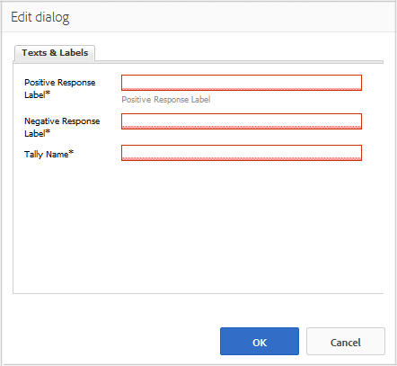

# Using Voting {#using-voting}

The `Voting` component is a useful tool that allows community members to rate a particular piece of content, such as an answer within a QnA component. With the `Voting` component, members select up or down arrows to indicate their opinion.

## Adding Voting to a Page {#adding-voting-to-a-page}

To add a `Voting` component to a page in author mode, use the component browser to locate `Communities / Voting` and drag it into place on a page, such as a position relative to the feature for users to vote on.

For necessary information, visit [Communities Components Basics](basics.md).

When the [required client-side libraries](essentials-voting.md#essentials-for-client-side) are included, this is how the `Voting` component will appear.

## Configuring Voting {#configuring-voting}

Select the placed `Voting` component to access and select the `Configure` icon which opens the edit dialog.

Under the **[!UICONTROL Texts & Labels]** tab, specify the properties used to record votes.

* **[!UICONTROL Positive Response Label]**
  (*Required*) The internal property name for a positive response.

* **[!UICONTROL Negative Response Label]**
  (*Required*) The internal property name for a negative response.

* **[!UICONTROL Tally Name]**
  (*Required*) The internal, identifiable property name for this instance of a voting component.

## Site Visitor Experience {#site-visitor-experience}

### Members {#members}

Members may only vote once, but may change their vote at any time.

### Anonymous {#anonymous}

Anonymous voting is not supported. Site visitors must register (become a member) and sign in to participate in voting once.

## Additional Information {#additional-information}

More information may be found on the [Voting Essentials](essentials-voting.md) page for developers.
