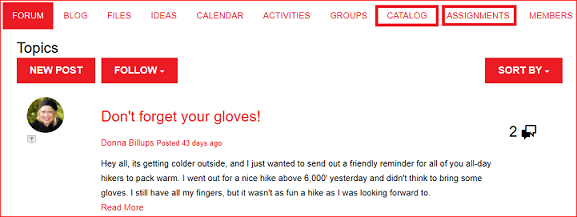
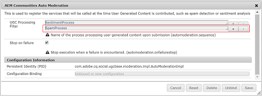

# What's New in AEM 6.4 Communities {#what-s-new-in-aem-communities}

AEM Communities offers a framework to businesses to collaborate among their partners, customers and employees. It imparts social capabilities to website structure, and helps businesses to engage and impart knowledge to their stakeholders, to enhance their brand value their way.

AEM 6.4 Communities brings in functionalities to enhance the experiences of community users, and ease the day-today tasks of community administrators, moderators, and managers.

Read further for quick introduction to new features and enhancements. Also, see AEM 6.4 Communities [release notes](../release-notes/communities-release-notes.md). For AEM 6.4 Communities documentation, visit [AEM 6.4 Communities User Guide](home.md).

## Managing Sub-Communities or Community Groups {#managing-sub-communities-or-community-groups}

AEM Communities enables community administrators to create groups and sub-groups within communities site, using pre-defined templates, in the author environment. These groups serve as sub communities, which can inherit many configurations, such as themes and styling from the parent site. However, these groups can differ from the parent site, for example having a different set of group moderators or can vary in the security level. These groups function as independent, fully fledged mini-communities which are further empowered by the following enhancements.

### Create multi-locale groups in single step {#create-multi-locale-groups-in-single-step}

As part of a community site, multi-lingual groups can be created in single operation. **[!UICONTROL Additional Available Community Group Language(s)]** field in **[!UICONTROL Community Group Template]** page, which is available while creating a [new community group](groups.md) within a community site, makes this feasible.

To create such groups, users can simply navigate to Group Collection of the desired communities site from the Sites console. Create a group, and specify the desired languages in **[!UICONTROL Additional Available Community Group Language(s)]** field of **[!UICONTROL Community Group Template]** page.

### Delete community groups from groups console {#delete-community-groups-from-groups-console}

AEM 6.4 Communities provides Delete Group icon on the existing community groups, in community Groups collection within community Sites console. This enables [group deletion](groups.md#deleting-the-group) in one click, along with the deletion of all the items associated (such as content and user memberships) with the group.

### Create and assign enablement resources within groups {#create-and-assign-enablement-resources-within-groups}

Learning content can now be created, managed and published for a specific set of targeted community members. Due to the availability of catalog and assignment functions for community groups (and not only the entire community site), enablement managers can [assign enablement resources](resource.md) and learning path to a small set of people too.

## Moderating user generated content {#moderating-user-generated-content}

AEM 6.4 Communities offers few improvements to moderation, which are instrumental in easing the day-to-day lives of community moderators.

### Automatic spam detection  {#automatic-spam-detection}

New spam detection engine helps in filtering out the unwanted and unsolicited user generated content on community sites or groups. When enabled, this functionality can mark a piece of user generated content as Spam or Not Spam based on a pre-defined set of spam words. Moderators can further act upon the content to deny or allow it to appear on the publish instance. These moderation actions can be performed inline or through bulk moderation console.

[Spam detector](moderate-ugc.md#spam-detection) finds and flags a given piece of user generated content with 90% accuracy. However, this functionality is not enabled by default. To enable it, community administrators need to navigate to configMgr on system/console and add Spam Process.

### New (Answered/Unanswered) filters for QnA {#new-answered-unanswered-filters-for-qna}

AEM 6.4 adds two [new filters](moderation.md#filter-rail), named Answered and Not Answered for QnA questions, to bulk moderation console. These filters are available under Status in Filter Rail.

On selecting the Answered status, all the answered questions are visible to the moderator in content area. Whereas, if only the Not Answered status is selected, then the moderator will see all the content (for all content types) except the answered questions, because the property responsible for the Answered Question does not exist in the case of not-answered questions and other content such as forum topic, blog article, or comments.

### Bookmark moderation filters {#bookmark-moderation-filters}

AEM Communities provides the ability to [bookmark the pre-defined moderation filters](moderation.md#filter-rail) on moderation console. These saved bookmarks can be revisited later and shared with other users.

Users simply need to select the desired filters from the Filter Rail in moderation console, to view the filtered UGC and bookmark the filters on their browsers. These filters are appended toward the end of the URL string, and therefore can be shared, reused and revisited later.

## Managing Community Sites {#managing-community-sites}

AEM 6.4 Communities provides site management enhancements, which ensure that numerous community sites in different language are easily created, managed, and deleted by site administrators.

### Create multi locale community sites in one step {#create-multi-locale-community-sites-in-one-step}

AEM Communities allows creating a [multi-lingual community sites](create-site.md) in single operation. This is possible due to the availability of multiple languages to select from in **[!UICONTROL Community Site Base Language]** field in **[!UICONTROL Site Template]** page, while creating a new community site from the sites console.

Users can select configuration folders, branding and many other configurations at once for all these sites.

### Delete community sites from sites console {#delete-community-sites-from-sites-console}

AEM 6.4 Communities provides Delete Site icon on the existing community sites, in community Sites console. This enables the [deletion of the site](create-site.md) and the associated items in one click.

## Managing UGC and user profiles {#managing-ugc-and-user-profiles}

Keeping user data protection at the heart of communities experience, AEM Communities exposes [APIs out-of-the-box](user-ugc-management-service.md) and [sample servlet](https://github.com/Adobe-Marketing-Cloud/aem-communities-ugc-migration/tree/master/bundles/communities-ugc-management-servlet). These APIs help bulk manage (bulk delete and bulk export) user generated content and delete user profiles, and are instrumental in handling EU GDPR compliance requests.

## What's Changed {#what-s-changed}

* Captcha verification, while creating a new community site, is no longer available out-of-the-box in AEM 6.4 Communities. However, Communities site can be customized to include [Google component reCAPTCHA](https://helpx.adobe.com/experience-manager/using/aem_recaptcha.html) for better security.
* Option to upload a custom CSS has been removed from the community sites and groups theme.
* Content Only and Search icons have been added in the Filter Rail in Bulk Moderation UI.
* Content Path filter has been added in Filter Rail in Bulk Moderation UI.  
* Switch to bulk mode and Exit bulk mode have been removed from the Bulk Moderation UI. To enter multi-select mode click the Select ( ) icon on a post, which appears on hovering over it with the mouse (desktop) or pressing and holding a finger on the post (mobile).
