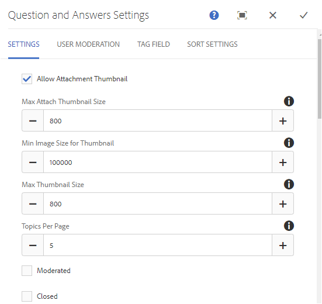

# Q&A Forum Feature{#q-a-forum-feature}

## Introduction {#introduction}

The QnA (questions and answers) forum feature provides an area for community members to ask and answer questions. It allows members to:

* Create questions
* Add inline images (with support for drag-and-drop)
* View and answer questions
* Search for a question
* Help moderate the QnA content
* Identify best answers
* Move QnA questions from one page to another

The documentation describes:

* Adding the QnA forum feature to an AEM site.
* Configuration settings for the `QnA`component.

## Adding a Q&A Forum to a Page {#adding-a-q-a-forum-to-a-page}

To add a `QnA` component to a page in author mode, use the component browser to locate `Communities / QnA` and drag it into place on a page where the QnA forum should appear.

For necessary information, visit [Communities Components Basics](/help/communities/basics.md).

When the [required client-side libraries](/help/communities/qna-essentials.md#essentials-for-client-side) are included, this is how the `QnA` component appears:

### Configuring QnA {#configuring-qna}

Select the placed `QnA` component so you can access and select the `Configure` icon which opens the edit dialog.

 

#### Settings tab {#settings-tab}

Under the **Settings** tab, specify settings for topics (questions) and replies (answers):

* **Allow Attachment Thumbnail**

  If checked, a thumbnail of the attached image is created.

* **Max Attach Thumbnail Size**

  Maximum size (in pixels) of the attachment thumbnail image. The default value is 800 x 800.

* **Min Image Size for Thumbnail**

  Minimum size (in bytes) of image for generating thumbnail for inline images. The default value is 100000 bytes (100 kb).

* **Max Thumbnail Size**

  Maximum size (in pixels) of the thumbnail image for inline image. The default value is 800 x 800.

* **Topics Per Page**

  Defines the number of questions/posts shown per page. Default is 10.

* **Moderated**

  If checked, posting of topics and comments must be approved before they appear on a publish site. Default is deselected.

* **Closed**

  If checked, the forum is closed to new questions and comments. Default is deselected.

* **Rich Text Editor**

  If checked, topics and comments can be entered with markup. Default is deselected.

* **Allow Tagging**

  If checked, allow members to add tag labels to their posts (see **Tag field** tab). Default is deselected.

* **Allow File Uploads**

  If checked, allow file attachments to be added to the question or comment. Default is deselected.

* **Allow Following**

  If checked, include the following feature for forum posts, which allows members to be [notified](/help/communities/notifications.md) of new posts. Default is deselected.

* **Allow Pinning**

  If checked, forum topics can be pinned to the top of the list of topics. Default is deselected.

* **Allow Email Subscriptions**

  If checked, allow members to be notified of new posts by email ([subscription](/help/communities/subscriptions.md)). Requires Allow Following to be checked and [email configured](/help/communities/email.md). Default is deselected.

* **Max File Size**

  Relevant only if `Allow File Uploads` is checked. This field limits the size (in bytes) of an uploaded file. Default is 104857600 (10 Mb).

* **Allowed File Types**

  Relevant only if `Allow File Uploads` is checked. A comma-separated list of file extensions with the "dot" separator. For example: .jpg, .jpeg, .png, .doc, .docx, .pdf. If any file types are specified, then those not specified cannot be uploaded. Default is none specified such that **all** file types are allowed.

* **Max Attach Image File Size**

  Relevant only if Allow File Uploads is checked. The maximum number of bytes an uploaded image file can have. Default is 2097152 (2 Mb).

* **Allow Replies**

  If checked, allow replies to comments posted to the question. Default is deselected.

* **Allow Voting**

  If checked, include the Voting feature with a question. Default is deselected.

* **Allow Users to Delete Comments and Topics**

  If checked, allow members to delete the comments and questions that they posted. Default is deselected.

* **Allow Privileged Members**

  If checked, only Privileged members are allowed to create content.

* **Block User Generated Content in Author Edit Mode**

  If enabled, blocks User Generated Content while editing in Author Mode.

* **Move Selected Answer To The Top**

  If checked, first answer shown is a selected answer. Default is deselected.
* **Display Badges**

  If checked, display earned and assigned [badges](/help/communities/implementing-scoring.md) with a member's blog entry. Default is deselected.

* **Allow Featured Content**

  If checked, the idea is identifiable as [featured content](/help/communities/featured.md). Default is deselected.

* **Enable Mention**

  If enabled, allows registered community users to identify other registered members (using first name, last name, user name) and tag them using the common @user-name syntax. The tagged users receive notifications about their mentions.

* **Max Mentions**

  Restrict the maximum number of mentions allowed in a post. Default is 10.

* **UI Mention Pattern**

  Specify the allowed pattern string to tag (@mention) the registered user in a post. For example, `~{{familyName}}{{givenName}}`.

#### User Moderation tab {#user-moderation-tab}

Under the **User Moderation** tab, specify how the posted topics (questions) and answers (user generated content) are managed. For more information, see [Moderating User Generated Content](/help/communities/moderate-ugc.md).

* **Deny Answers**

  If checked, trusted member moderators are allowed to deny posted answers and prevent the answers from appearing on the public Q&A forum. Default is deselected.

* **Close / Reopen Topics**

  If checked, trusted member moderators can close a question (topic) to further edits and answers, and also reopen a question. Default is deselected.

* **Move Topics**
  If checked, allow publish-side moderators to move questions. Default is deselected.

* **Flag Posts**

  If checked, allow members to flag others' questions or answers as inappropriate. Default is deselected.

* **Flag Reason List**

  If checked, allow members to choose, from a drop-down list, their reason for flagging a question or answer as inappropriate. Default is deselected.

* **Custom Flag Reason**

  If checked, allow members to enter their own reason for flagging a question or answer as inappropriate. Default is deselected.

* **Moderation Threshold**

  Enter the number of times a question or answer has to be flagged by members before moderators are notified. Default is 1 (one time).

* **Flagging Limit**

  Enter the number of times a question or answer has to be flagged before it is hidden from public view. If set to -1, the flagged question or answer is never hidden from public view. Else, this number must be greater than or equal to the Moderation Threshold. Default is 5.

#### Tag field tab {#tag-field-tab}

Under the **Tag field** tab, the tags that can be applied, if allowed under the **Settings** tab, are limited according to namespaces chosen.

* **Allowed Namespaces**
  
  Relevant if `Allow Tagging` is checked under the **Settings** tab. The tags that can be applied are limited to those within the namespace categories checked. The list of namespaces includes "Standard Tags" (the default namespace) and "Include All Tags". Default is none checked, which means all namespaces are allowed.

* **Suggestion Limit**
  
  Enter the number of tags to be displayed as a suggestion to the member posting to the forum. A value of **-**1 means no limits. Default is 0.

#### Sort Settings tab {#sort-settings-tab}

Under the **Sort Settings** tab, specify how the posted comments are sorted when displayed.

* **Sort By**

  Check all allowed sort selections: `Newest, Oldest, Last Updated, Most Viewed, Most Active, Most Followed and Most Liked`. Default is `Newest, Oldest, Last Updated`.

* **Set as Default**

  Pull down to select one of the checked sort options to appear as the default. Default is `Newest`.

* **Select Time Options for Analytics Sorting**

  Drop down to select one of `All, Last 24 Hours, Last 7 Days, Last 30 Days`. Default is `All`.

## Site Visitor Experience {#site-visitor-experience}

### Identifying Answers {#identifying-answers}

One answer can be marked as a correct or useful answer using the `Select Answer` button. Once a Question is marked as Answered, another answer cannot be selected until the first one has been deselected using the `Unmark Chosen Answer` button.

Once selected as a viable answer, it can be deselected using the `Unmark Chosen Answer` button.

Once an answer is selected as the viable answer, an indication that the question has been `Answered` is displayed next to the question topic on the main QnA page.

#### Moderators and Administrators {#moderators-and-administrators}

When the signed in user has moderator or administrator privileges, they are able to perform the moderation tasks permitted by the configuration of the component, regardless of who authored the question or answer.

They can also identify answers.

#### Members {#members}

When the site visitors are signed in, depending on the configuration, they can:

* Post a new question.
* Edit or delete questions they authored.
* Flag questions or answers of other members.
* Identify answers for questions they authored.

#### Anonymous {#anonymous}

Site visitors who are not signed in can only read posted questions and answers, translate them if supported, but can neither add a question nor answer, nor flag posts of others.

## Additional Information {#additional-information}

More information can be found on the [QnA Essentials](/help/communities/qna-essentials.md) page for developers.

For moderation of posted topics and comments, see [Moderating User Generated Content](/help/communities/moderate-ugc.md).

For tagging posted topics and comments, see [Tagging User Generated Content](/help/communities/tag-ugc.md).
