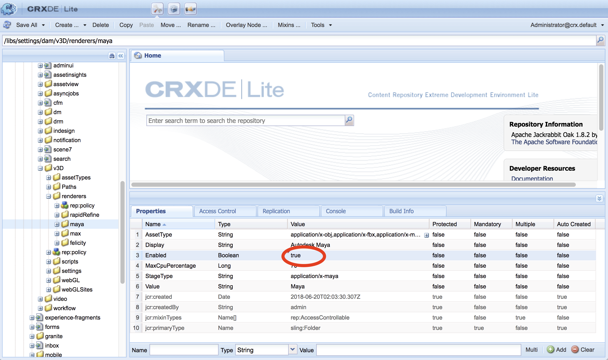
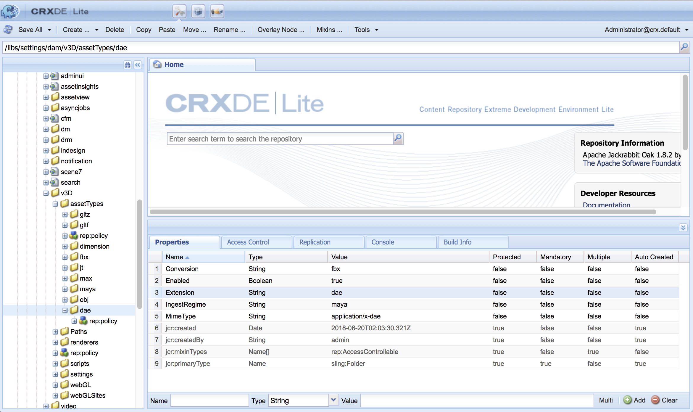

# Integrating AEM 3D with Autodesk Maya{#integrating-aem-d-with-autodesk-maya}

>[!NOTE]
>
>This task is optional and pertains to Windows only.

You can optionally integrate AEM 3D with Autodesk® Maya® software to enable support for native Maya files (.MA and .MB) and to let you render 3D assets in AEM with any available Maya renderer.* This integration is for Windows only*.

When integrating with Autodesk Maya, you must install and configure Autodesk Maya, add the path to the Maya executable folder, enable Maya for ingestion and rendering, and test the integration.

See [Advanced configuration settings](../../../6-4/assets/using/advanced-config-3d.md).

See also [Integrating AEM 3D with AutoDesk 3ds Max](../../../6-4/assets/using/integrating-aem-3d-with-autodesk-3ds-max.md).

To integrate AEM 3D with Autodesk Maya:

1. Install Autodesk Maya 2016 software on the same servers where AEM is hosted.

   Following installation, verify that you can open and use Maya and that there are no licensing issues.

   >[!NOTE]
   >
   >AEM only uses the Maya command line rendering tool (**`render.exe`**). A single Maya network license allows up to five servers to process or render Maya content simultaneously.

1. In Maya, enable the Autodesk FBX® Plug-In.
1. Install the MentalRay render plug-in or another desired renderer.

   Following installation, verify that MentalRay is available in Maya.

1. Add the path to the Maya executable folder to the Windows PATH environment variable.

   For example, on Windows Server 2012, tap or click **Start **> **Control Panel** > **System and Security** > **System **> **Advanced System Settings** > **Environment Variables**. Append the full path to the `Maya2016\bin` folder to the `Path`system variable.

   

1. To enable Maya for ingestion and rendering, open CRXDE Lite and navigate to **`/libs/settings/dam/v3D/assetTypes/maya`** and set the **Enabled** property to `true`.

   

1. To enable the JT (Siemens PLM Open CAD) file format, navigate to **`/libs/settings/dam/v3D/assetTypes/jt`** and set the **Enabled** property to `true`.
1. In AEM, enable Maya as a renderer. Begin by navigating to **Tools** &gt; **General** &gt; **CRXDE Lite**.
1. From the CRXDE Lite page, in the left panel, navigate to the following:

   `/libs/settings/dam/v3D/renderers/maya`

   

1. Set the **Enabled** property to `true`.

   See also [Advanced configuration settings for integration of AEM 3D with Autodesk Maya](#advancedconfigurationsettingsforintegrationofaem3dwithautodeskmaya).

1. Near the upper-left corner of the CRXDE Lite page, tap or click **Save All**.

   Maya is now enabled as a renderer.

### Testing the integration of AEM 3D with Autodesk Maya {#testing-the-integration-of-aem-d-with-autodesk-maya}

1. Open AEM Assets, then upload the `.MA` files located in `sample-3D-content/models`** **to the `test3d` folder.

   Note that `sample-3D-content.zip` was previously downloaded for validating the basic 3D functionality.

1. Return to the Card view and observe the message banners shown on the uploaded assets.

   The Converting Format banner is displayed while Maya is converting the native `.MA` format to `.FBX`.

1. After all processing is finished, open the `logo-sphere.ma` asset and select the `stage-helipad.ma` stage.

   The Preview experience is the same as with **`logo_sphere.fbx`** and **`stage-helipad.fbx`**.

1. Near the upper-left corner of the page, tap or click the drop-down list and then select **Render**.

   

1. In the **Renderer** drop-down list, select **Autodesk Maya**, then tap or click **Start Render**.
1. Near the upper-right corner of the page, tap or click **Close** to return to the Card view.

   Observe the message banner on the image asset that is rendering (**`logo-sphere`**, unless a different image name was specified). A progress bar on the banner shows rendering progress.

   >[!NOTE]
   >
   >Rendering is very CPU intensive and may take several minutes to complete

1. After rendering completes, open the rendered image asset.

   Check that the rendered image reasonably matches the image that you were viewing at the time you clicked **Render Now**.

## Enabling Additional Formats Supported By Maya {#enabling-additional-formats-supported-by-maya}

(Optional) Maya supports a number of 3D input formats, any of which can be enabled so that AEM recognizes the file type. When enabled, AEM sends the file to Maya to convert it to an intermediate format that can be ingested directly by AEM.

Depending on the format, feature support may be limited (for example, materials may not be passed through) and quality/fidelity may be limited (for example, reversed faces). Adobe only supports the general mechanism, but not any specific format conversion.

See [Supported Data Import Formats | Maya](https://knowledge.autodesk.com/support/maya/learn-explore/caas/CloudHelp/cloudhelp/2016/ENU/Maya/files/GUID-69BC066D-D4D8-4B12-900C-CF42E798A5D6-htm.html) for information about the formats supported by Maya.

To enable additional formats supported by AEM:

1. Using **CRXDE Lite**, navigate to **`/libs/settings/dam/v3D/assetTypes`.**
1. Make a copy of the **jt** node. Right-click on the **jt** node and select **Copy**, then right-click the **assetTypes** folder and select **Paste**. This should produce a new node **/apps/cq-scene7-v3D/config/assetTypes/Copy of jt**.
1. Rename the new node to give it a unique name which represents the file type to be added. The file suffix might be used or any other unique identifier.  

1. Set the **Enabled** property of the new node to `true`.  

1. Set the **Extension** property of the new note to the file suffix/extension of the format being added.
1. Set the **MimeType** property to an appropriate value. **`application/x-`** followed by the value of the **Extension **property should work for most file types.
1. Make certain that the **Conversion** property is set to **`fbx`** and **IngestRegime** to **`Maya`**.
1. Click **Save All** near the top left of the page.

The following illustrates an added file format, using COLLADA DAE as an example:

