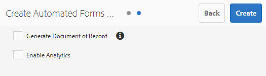

# Configure the Automated Forms Conversion service{#configure-the-automated-forms-conversion-service}

AEM Forms Automated Forms Conversion service, powered by Adobe Sensei, automatically converts your legacy forms to device-friendly and responsive adaptive forms. Whether you are using non-interactive PDF forms, Acroforms, or XFA-based PDF forms, the service can easily convert these forms into adaptive forms. For information about the capabilities, conversion workflow, and onboarding information see [Automated Forms Conversion](/6-4/forms/using/wip/introduction-to-automated-form-conversion-service.md) service.

## Set up the service {#set-up-the-service}

Before using the service, you connect your AEM Forms instance to the service running on Adobe Cloud. Perform the following steps in the listed sequence to prepare your instance for the service and connect your AEM Forms instance to the service:

* [Download and install AEM Forms add-on package](/6-4/forms/using/installing-configuring-aem-forms-osgi.md)
* [Download and install Conversion Manager package](../../../../6-4/forms/using/wip/configure-the-automated-forms-conversion-service.md#download-and-install-conversion-manager-package)
* [Configure email notifications](../../../../6-4/forms/using/wip/configure-the-automated-forms-conversion-service.md#configure-email-notification)
* [Configure the cloud service](../../../../6-4/forms/using/wip/configure-the-automated-forms-conversion-service.md#configure-the-cloud-service)

## Download and install AEM Forms add-on package  {#download-and-install-aem-forms-add-on-package}

An AEM instance contains basic forms capabilities. Install AEM Forms add-on package to avail all the capabilities of AEM Forms. The package is required to set up and run the conversion service:

1. Open the [AEM Forms Automated Forms Conversion Service Prerelease](/6-4/forms/using/wip/aem-forms-automated-forms-conversion-service-beta.md) Program article, locate, and download the AEM Forms add-on package. 
1. Log in to AEM instance as an administrator and open the Package Manager. The default URL is [http://&lt;server&gt;:4502/crx/packmgr/index.jsp](http://%3Cserver%3E:4502/crx/packmgr/index.jsp).
1. Click **Upload Package**, select the AEM Forms Automated Forms Conversion service package, and click **Upload**. After the package is uploaded, click package name, and click **Install**. The package is installed.

   <!--
   Comment Type: draft

   <li>Step text</li>
   -->

   <!--
   Comment Type: draft

   <li>Step text</li>
   -->

## Download and install Conversion Manager package  {#download-and-install-conversion-manager-package}

Conversion Manager package provides AEM cloud service configurations and Review and Correct editor for the conversion service. It also allows you to connect your AEM instance with conversion service running on Adobe I/O. Perform the following steps to download and install the package:

1. Open the [AEM Forms Automated Forms Conversion Service Prerelease](/6-4/forms/using/wip/aem-forms-automated-forms-conversion-service-beta.md) Program article, locate, and download the AEM Forms Automated Forms Conversion service package. 
1. Log in to AEM instance as an administrator and open the Package Manager. The default URL is [http://&lt;server&gt;:4502/crx/packmgr/index.jsp](http://%3Cserver%3E:4502/crx/packmgr/index.jsp).
1. Click **Upload Package**, select the AEM Forms Automated Forms Conversion service package, and click **Upload**. After the package is uploaded, click package name, and click **Install**. The package is installed.

   <!--
   Comment Type: draft

   <li>Step text</li>
   -->

   <!--
   Comment Type: draft

   <li>Step text</li>
   -->

<!--
Comment Type: draft

<ol>
<li>
Log in to AEM instance as an administrator and open the package share. The default URL of the package share is <a>http://[server]:[port]/crx/packageshare</a>.
 </li>
<li>
In package share, search <strong>AEM Forms <strong>Conversion Manager package</strong></strong>, click the package applicable to your AEM Forms instance, and click <strong>Download</strong>. Read and accept the license agreement and click <strong>OK</strong>. The download starts.
 </li>
<li>
After the download completes, click <strong>Downloaded</strong>. You are redirected to package manager. In the package manager, search the downloaded package, and click <strong>Install</strong>. 
 
After the package is successfully installed, the <strong>Start Automated Form Conversion</strong> option becomes visible in Forms & Documents UI. Do not start the conversion yet. 
 </li>
<draft-comment type="draft">
<li>Step text</li>
</draft-comment>
<draft-comment type="draft">
<li>Step text</li>
</draft-comment>
</ol>
-->

## Configure email notification {#configure-email-notification}

Configure the ** [Day CQ Mail Service](https://helpx.adobe.com/experience-manager/6-4/sites/administering/using/notification.html#ConfiguringtheMailService)** and specify an email address in the profile of a [forms user](https://helpx.adobe.com/experience-manager/6-4/forms/using/forms-groups-privileges-tasks.html). Emails are sent to specified email address on successful completion or failure of a conversion. To specify an email address for a user:

<!--
Comment Type: annotation
Last Modified By: khsingh
Last Modified Date: 2018-12-17T02:00:03.194-0500
Day CQ Mail Service: - After beta, change the email link to /content/help/en/experience-manager/6-4/sites/administering/using/notification.html#ConfiguringtheMailService form users - After beta, change the email link to /content/help/en/experience-manager/6-4/forms/using/forms-groups-privileges-tasks.html
-->

1. On your AEM Forms instance, tap **[!UICONTROL Adobe Experience Manager]** > **[!UICONTROL Tools]**> **[!UICONTROL Security]** > **[!UICONTROL Users]**.
1. Select the user designated to run the service and tap **[!UICONTROL Properties]**. The Edit User Settings page opens. 
1. Specify an email address in the **[!UICONTROL Email]**field and Tap **[!UICONTROL Save]**. The emails are sent to specified email address on successful completion or failure of the conversion.

   <!--
   Comment Type: draft

   <li>Step text</li>
   -->

   <!--
   Comment Type: draft

   <li>Step text</li>
   -->

## Configure the cloud service {#configure-the-cloud-service}

Create a cloud service configuration to connect your AEM Instance to the conversion service. It also allows you to specify a template, theme, and form fragments for a conversion. You can create multiple cloud service configurations separate for each set of forms. For example, you can have a separate configuration for sales department forms and a separate one for customer support forms. Perform the following steps to create a cloud service configuration:

1. On your AEM Forms instance, tap **[!UICONTROL Adobe Experience Manager]** > **[!UICONTROL Tools]**> **[!UICONTROL Cloud Services]** > **[!UICONTROL Automate Forms Conversion Configuration]**.
1. Tap the **[!UICONTROL **Global**]**folder and tap ****[!UICONTROL Create]****. The page to create Automated Forms Conversion configuration appears. The configuration is created in the Global folder. You can also create the configuration in a different folder that already exists or create a new folder for your configurations.   

1. In the **[!UICONTROL Basic]**tab of the **[!UICONTROL Create Automated Forms Conversion Configuration]** page, specify a value for the following fields:

<table border="1" cellpadding="1" cellspacing="0" width="100%"> 
 <tbody> 
  <tr> 
   <td width="30%">Field</td> 
   <td>Description</td> 
  </tr> 
  <tr> 
   <td>Title</td> 
   <td>Specify a unique title for the configuration. The title is displayed in the UI used to start conversion.</td> 
  </tr> 
  <tr> 
   <td>Name</td> 
   <td>Specify a unique name for the configuration. The configuration is saved in the CRX-Repository with the specified name. The name can be identical to the title. </td> 
  </tr> 
  <tr> 
   <td>Thumbnail location</td> 
   <td>Location of the thumbnail for the configuration. </td> 
  </tr> 
  <tr> 
   <td valign="top" width="96">
Service URL
 </td> 
   <td>Specify the <a href="https://flmorch-va7.cloud.adobe.io/">https://flmorch-va7.cloud.adobe.io</a> URL in the service URL field. </td> 
  </tr> 
  <tr> 
   <td valign="top" width="96">
Template
 </td> 
   <td>Specify the default template to be applied to converted forms. You can always specify a different template before starting the conversion.</td> 
  </tr> 
  <tr> 
   <td>Theme</td> 
   <td>Specify the default theme to be applied to converted forms. You can always specify a different theme before starting the conversion.</td> 
  </tr> 
  <tr> 
   <td valign="top" width="96">
Existing Fragments
 </td> 
   <td valign="top" width="456">
Specify the location of existing fragments, if any.
 </td> 
  </tr> 
 </tbody> 
</table>

   

1. In the **[!UICONTROL Advanced]**tab of the **[!UICONTROL Create Automated Forms Conversion Configuration]** page, specify value for the following field:

   | Field |Description |
   |---|---|
   | Generate Document of Record |Select the option to automatically generate Document of Record for converted forms. |
   | Enable Analytics |Select the option to enable Adobe Analytics on all the converted forms. |

   

1. Tap** **[!UICONTROL Save & Close]****. The cloud configuration is created. Your AEM Forms instance is ready to start converting legacy forms to adaptive forms.

## Previous {#previous}

* [Introduction to Automated Forms Conversion service](/6-4/forms/using/wip/introduction-to-automated-form-conversion-service.md)

## Next {#next}

* [Use Automated Forms Conversion service](/6-4/forms/using/wip/convert-existing-forms-to-adaptive-forms.md)

