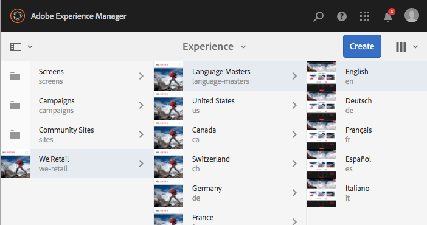

# Working with the Author Environment{#working-with-the-author-environment}

>[!NOTE]
>
>The following documentation focuses on the AEM standard, touch-enabled UI. For information about authoring in the classic UI, see the [Classic UI Authoring User Guide](/6-4/sites/classic-ui-authoring/user-guide.md).

The author environment allows for:

* [Authoring](/6-4/sites/authoring/using/author.md) (including [page authoring](/6-4/sites/authoring/using/page-authoring.md), [managing assets](/6-4/assets/user-guide.md), [communities](/6-4/communities/using/author-communities.md))  

* [Administering](/6-4/sites/administering/user-guide.md) tasks you need when generating and maintaining the content on your website

Two graphical user interfaces are provided to achieve this. These are accessible through any modern browser.

1. Touch-Enabled UI

    * This is the modern, standard AEM UI.
    * It is predominantly grey, with a clean, flat interface.
    * Designed for use on both touch and desktop devices, the look and feel is the same on all devices, though [viewing and selecting your resources](/6-4/sites/authoring/using/basic-handling.md#viewingandselectingyourresources) differs slightly (taps versus clicks).

        * Desktop:

   

    * Tablet devices (or desktop less than 1024 pixels wide):

   

1. Classic UI

    * This is the legacy UI and has been available in AEM for many years.
    * It is predominantly green.
    * It was designed for use on desktop devices.
    * The following documentation focuses on the modern UI. For information about authoring in the classic UI, see the [Authoring documentation for the Classic UI](/6-4/sites/classic-ui-authoring/using/classicui.md).

   

