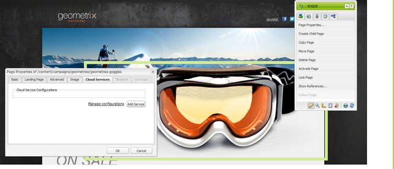

# Managing Subscriptions{#managing-subscriptions}

>[!NOTE]
>
>Adobe will not further enhance this capability (Managing Leads and Lists).
>
>Adobe's recommendation is to leverage [Adobe Campaign and the integration to AEM](/6-4/sites/administering/using/campaign.md).

Users can be asked to subscribe to **Email Service Provider's** mailing lists with the help of the** Form **component used on an AEM web page. To prepare an AEM page with a sign-up form for subscription to your e-mail service mailing lists, you must apply the corresponding service configuration to the AEM page that the potential subscriber will visit.

See [Managing Subscriptions in the classic user interface](/6-4/sites/classic-ui-authoring/using/classic-personalization-campaigns-email-subscriptions.md) for more detailed descriptions of how to manage your subscriptions.

<!--
Comment Type: draft

<h3>Applying Email Service configuration to a page</h3>
-->

<!--
Comment Type: draft

To configure an AEM page:

-->

<!--
Comment Type: draft

<ol>
<li>
Navigate to the <strong>Websites</strong> tab.
 </li>
<li>
Select the page that needs to be configured for the service. Right-click the page and select <strong>Properties</strong>.  
 </li>
<li>
Select <strong>Cloud Services</strong> then <strong>Add Service</strong>. Select a configuration from the list of available configurations. 
 </li>
<li>
Click <strong>OK</strong>.
 </li>
</ol>
-->

<!--
Comment Type: draft

<h3>Creating a Sign-up form on an AEM page for subscribing/unsubscribing to lists</h3>
-->

<!--
Comment Type: draft

To create a sign-up form and configure it for subscriptions to Email Service Provider's mailing lists:

-->

<!--
Comment Type: draft

<ol>
<li>
Open the AEM page that the user will visit.
 </li>
<li>
Apply the Email Service Provider's configuration to the page.  
 </li>
<li>
Add a <strong>Form</strong> component to the page by dragging the component from the sidekick. If the component is not available, switch to design mode and enable <strong>Form </strong>group.
 </li>
<li>
Click <strong>Edit</strong> in the <strong>Start of Form </strong>bar and navigate to the <strong>Advanced </strong>tab<strong>.</strong>
 </li>
<li>
In the<strong> Form</strong> drop-down menu, select <strong>E-mail Service: Create Subscriber and add to list.</strong>
 </li>
<li>
At the bottom of the dialog box, open the <strong>Action Configuration</strong> drop-down, which allows you to select one or more subscription lists.
 </li>
<li>
In the <strong>Select</strong> <strong>list</strong>, select the list you want users to subscribe to. You can add multiple lists by using the plus button (<strong>Add Item</strong>).
 
<note type="note">

Your dialog box may differ depending on the e-mail service provider.

</note></li>
<li>
In the <strong>Form</strong> tab, select the thank you page you want users to go to after they submit the form (If left blank, the form redisplays upon submission.) Click <strong>OK</strong>. An <strong>Email id</strong> component appears in the Form, which allows you to create a form where users can submit their email addresses to subscribe or unsubscribe from a mailing list.
 </li>
<li>
Add the <strong>Submit</strong> button component from the <strong>Form </strong>section in sidekick.
 
The form is ready. Publish the page configured in the steps above along with the <strong>thank you</strong> page to the publish instance. Any potential subscribers who visit the page can fill the form and subscribe to the list provided in the configuration.

<note type="note">

To make the form subscription fucntion correctly, <a href="#exporting-keys-from-author-and-importing-on-publish">encryption keys from author need to be exported and imported on the publish instance</a>.

</note></li>
</ol>
-->

<!--
Comment Type: draft

<h3>Exporting keys from author and importing on publish</h3>
-->

<!--
Comment Type: draft

In order for e-mail service subscribing and unsubscribing to work via the sign-up form on the publish instance, you need to follow these steps:

-->

<!--
Comment Type: draft

<ol>
<li>
On the author instance, navigate to the Package Manager.
 </li>
<li>
Create a new package. Set the filter as /etc/key.
 </li>
<li>
Build and download the package.
 </li>
<li>
Navigate to the Package Manager on the publish instance and upload this package.
 </li>
<li>
Navigate to the Publish osgi console and restart the bundle named <strong>Adobe Granite Crypto Support</strong>.
 </li>
</ol>
-->

<!--
Comment Type: draft

<h3>Unsubscribing users from lists</h3>
-->

<!--
Comment Type: draft

To unsubscribe users from lists:

-->

<!--
Comment Type: draft

<ol>
<li>
Open the page properties of the AEM page that has the sign-up form to unsubscribe a lead.
 </li>
<li>
Apply the service configuration to the page.
 </li>
<li>
Create a sign-up form on the page.
 </li>
<li>
While configuring the component, select the action <strong>E-mail Service</strong>: <strong>Unsubscribe user from list.</strong>
 </li>
<li>
From the drop-down menu, select the appropriate list from which the user will be removed when unsubscribing.
 </li>
<li>
Export the keys from author to publish.
 </li>
</ol>
-->

<!--
Comment Type: draft

<h3>Configuring auto-responder emails for Email Service</h3>
-->

<!--
Comment Type: draft

To configure an auto-responder email for a subscriber:

-->

<!--
Comment Type: draft

<ol>
<li>
Open the page properties of the AEM page that have the sign-up form to configure auto responder for a lead.
 </li>
<li>
Apply the ExactTarget configuration to the page.  
 </li>
<li>
Add a <strong>Form</strong> component to the page by dragging the component from the sidekick. If the component is not available, switch to design mode and enable the <strong>Form </strong>group.
 </li>
<li>
Click <strong>Edit</strong> in the <strong>Start of Form </strong>bar and navigate to the <strong>Advanced </strong>tab<strong>.</strong>
 </li>
<li>
In the<strong> Form</strong> drop-down menu, select <strong>E-mail Service: Send auto responder email.</strong>
 </li>
<li>
<strong>Select an email</strong> (this is the mail that is sent as an auto-responder email).  
 </li>
<li>
<strong>Select Classification</strong> (this classification is used to send the email).
 </li>
<li>
Select the<strong> Thank you </strong>page (the page where users are directed to once they submit the form).
 
In the <strong>Form</strong> tab, select the thank you page you want users to go to after they submit the form. (If left blank, the form redisplays upon submission.) Click <strong>OK</strong>.
 </li>
<li>
Export the keys from author to publish.
 </li>
<li>
Add the <strong>Submit</strong> button component from the <strong>Form </strong>section in sidekick.
 
The sign-up form is ready. Publish the page configured in the steps above along with the <strong>thank you</strong> page to the publish instance. Any potential subscribers who visit the page can fill the form and on submitting the form the visitor shall receive an auto-responder email on the email id filled in the form.

<note type="note">

To make the sign-up form subscription function correctly, <a href="#exporting-keys-from-author-and-importing-on-publish">encryption keys from author need to be exported and imported on the publish instance</a>.

</note></li>
</ol>
-->

