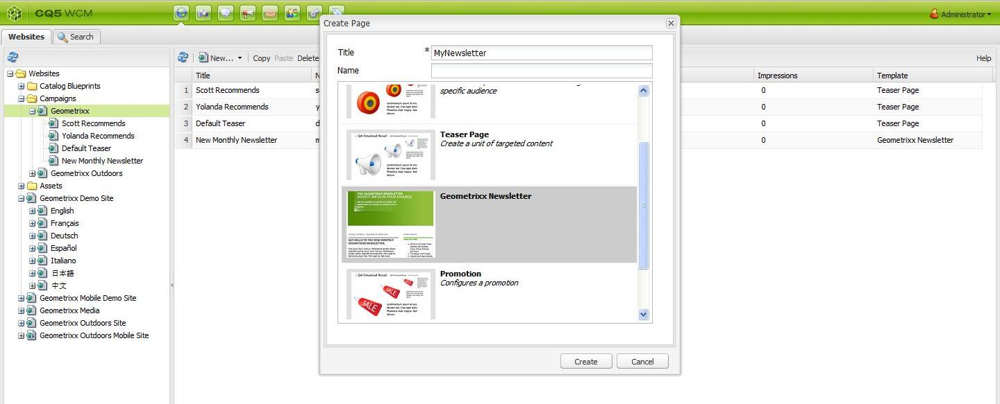
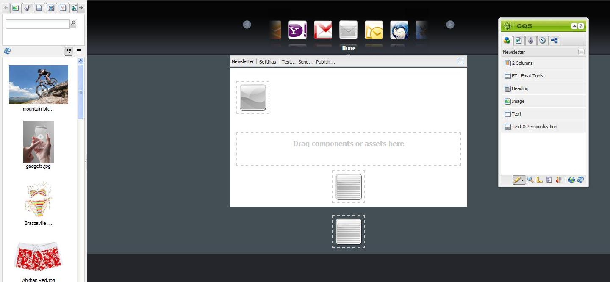
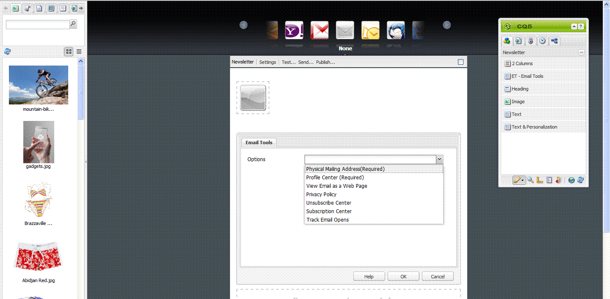
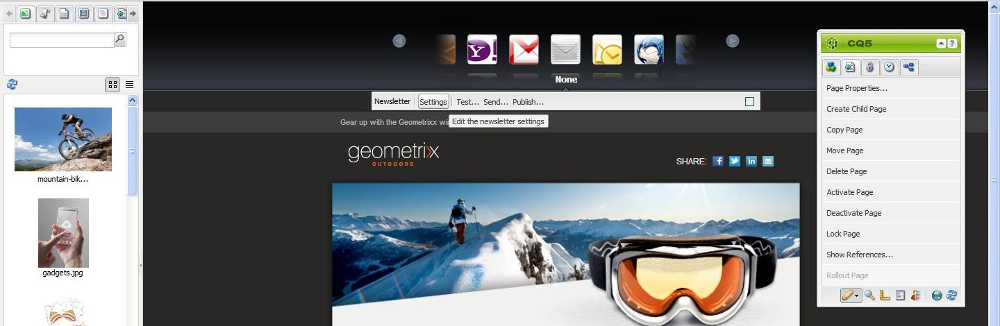

# Publishing an Email to Email Service Providers{#publishing-an-email-to-email-service-providers}

You can publish newsletters to e-mail services such as ExactTarget and Silverpop Engage.

See [Publishing an Email to Email Service Providers in the classic user interface](/6-4/sites/classic-ui-authoring/using/classic-personalization-campaigns-email-newsletters.md) for instructions on publishing your email.

<!--
Comment Type: remark
Last Modified By: unknown unknown (ims-author-77F410094CD97C4F0A746C1B@AdobeID)
Last Modified Date: 2018-02-02T12:33:15.057-0500

Drafted out content as this may have a touch-enabled equivalent. 

-->

<!--
Comment Type: draft

This document describes how to configure AEM to publish a newsletter to these e-mail services.

-->

<!--
Comment Type: draft

<note type="note">

You need to configure the service provider before you can create and publish an email. See <a href="/6-4/sites/administering/using/exacttarget.md">Configuring ExactTarget</a> and <a href="/6-4/sites/administering/using/silverpop.md">Configuring Silverpop Engage</a> for more information. 

</note>
-->

<!--
Comment Type: draft

To publish your email to the email service provider, you need to perform the following steps:

<ol>
<li>Create an email.</li>
<li>Apply the Email Service configuration to the email.</li>
<li>Publish the email.</li>
</ol>
-->

<!--
Comment Type: draft

<note type="note">

If you update email providers, do a flight test, or send a newsletter, these operations fail if the newsletter is not published to the Publish instance first or if the Publish instance is not available. Be sure to publish your newsletter and make sure the Publish instance is up and running.

</note>
-->

<!--
Comment Type: draft

<h2>Creating an Email</h2>
-->

<!--
Comment Type: draft

An email or newsletter that you want to publish to an e-mail service can be created under a campaign using the <strong>Geometrixx Newsletter</strong> template. You can also use the <strong>Geometrixx Outdoors E-Mail</strong> template. Sample email/newsletter-based on the <strong>Geometrixx Outdoors E-Mail</strong> template are available at http://&lt;hostname&gt;:&lt;port&gt;/cf#/content/campaigns/geometrixx-outdoors/e-mails.html.

To create a new email that is published to the configured e-mail service:

-->

<!--
Comment Type: draft

<ol>
<li>
Go to <strong>Websites</strong> and then <strong>Campaigns</strong>. Select a campaign. 
 </li>
<li>
Click <strong>New</strong> to open the <strong>Create Page </strong>window.
 </li>
<li>
Enter the title, name, and select the <strong>Geometrixx Newsletter</strong> template from the list of available templates.
 </li>
<li>
Click <strong>Create</strong>.
 </li>
<li>
Open the created email. 
 </li>
<li>
Switch to design mode to select the components you want to display in the sidekick. 
 </li>
<li>
Switch to edit mode and start adding content (text, images, <a href="#adding-exacttarget-email-tools-to-your-email">email tools</a>, <a href="#adding-text-and-personalization-tool-to-your-e-mail">personalization variables</a>, and so on) to your email. 
 </li>
</ol>
-->

<!--
Comment Type: draft

<h3>Adding ExactTarget Email Tools to your email</h3>
-->

<!--
Comment Type: draft

<note type="note">

This section is specific to the ExactTarget service.

</note>
-->

<!--
Comment Type: draft

The <strong>Email Tools</strong> component for ExactTarget can add more email functionality to your email/newsletter. 

-->

<!--
Comment Type: draft

<ol>
<li>
Open an email to be published to ExactTarget.
 </li>
<li>
Add the component <strong>ET - Email Tools </strong>to your page using the side kick. Open the component in Edit mode.
 </li>
<li>
Select an option from the <strong>Options</strong> menu:

<table border="1" cellpadding="1" cellspacing="0" width="100%">
<tbody>
<tr>
<td>Physical Mailing Address (Required)</td>
<td>This component inserts the physical mailing address of your organization in your email.</td>
</tr>
<tr>
<td>Profile Center (Required)</td>
<td>The profile center is a webpage where subscribers can enter and maintain the personal information that you keep about them.</td>
</tr>
<tr>
<td>View Email as a Web Page</td>
<td>This component allows the user to view the email as a webpage.</td>
</tr>
<tr>
<td>Privacy Policy</td>
<td>This component inserts the link to your privacy policy in the email.  </td>
</tr>
<tr>
<td>Unsubscribe Center</td>
<td>Gives the option to the user to unsubscribe from your mailing list.</td>
</tr>
<tr>
<td>Subscription Center</td>
<td>A subscription center is a web page where a subscriber can control the messages they receive from your organization.</td>
</tr>
<tr>
<td>Track Email Opens</td>
<td>A hidden component that allows you to use ExactTarget tracking feature.  </td>
</tr>
</tbody>
</table>
<note type="note">

The <strong>Options</strong> drop-down menu is only populated if ExactTarget configuration is applied to the email. See <a href="#applying-e-mail-service-configuration-to-e-mail-settings">Applying Email Service Configuration to Email Settings</a> for more information.

</note></li>
<li>
Publish the email to ExactTarget.
 
The email with the email tools is available for use in the configured ExactTarget account.
 </li>
</ol>
-->

<!--
Comment Type: draft

<note type="note">
<ul>
<li>The URLs within the email tools are replaced (in the received email) by their actual values only when an email is sent using <strong>Simple Send</strong> or <strong>Guided Send</strong> but not <strong>Test Send</strong>.</li>
<li>Two of the email tools are required: <strong>Physical Mailing Address (Required)</strong> and <strong>Profile Center (Required)</strong>. When the email is published to ExactTarget, these two email-tools are added to the bottom of every mail by default.</li>
</ul>
</note>
-->

<!--
Comment Type: draft

<h3>Adding Text and Personalization tool to your e-mail</h3>
-->

<!--
Comment Type: draft

You can add personalized fields in an email by adding the <strong>Text and Personalization</strong> component to the page:

-->

<!--
Comment Type: draft

<ol>
<li>
Open the e-mail to be published to your e-mail service.
 </li>
<li>
To enable personalization field from your email service, add the framework configuration while configuring the email service. See <a href="/6-4/sites/administering/using/silverpop.md">configuring Silverpop Engage</a> and <a href="/6-4/sites/administering/using/exacttarget.md">configuring Exact Target</a> for more information.
 </li>
<li>
nAdd the component <strong>Text & Personalization</strong> from the sidekick. This component is the part of newsletter group. Open this component in the edit mode.
 </li>
<li>
Add the required personalized field to the text by selecting the field from the drop-down menu and clicking <strong>Insert</strong>.
 </li>
<li>
Click <strong>OK </strong>to finish.
 </li>
</ol>
-->

<!--
Comment Type: draft

<h2>Applying E-mail Service Configuration to E-mail Settings</h2>
-->

<!--
Comment Type: draft

To apply your E-mail service configuration to a newsletter:

-->

<!--
Comment Type: draft

<ol>
<li>
Create an E-mail Service configuration. 
 </li>
<li>
Open your email/newsletter.
 </li>
<li>
Open the email/newsletter settings by either clicking <strong>Settings</strong> or by clicking <strong>Page Properties in</strong> the sidekick. 
 </li>
<li>
Click <strong>Add Service</strong> in <strong>Cloud Services</strong> tab. You see the list of services. Select your required configuration - either <strong>ExactTarget</strong> or <strong>Silverpop</strong> - from the list from the drop-down list.
 </li>
<li>
Click <strong>OK</strong>. 
 </li>
</ol>
-->

<!--
Comment Type: draft

<h2>Publishing Emails to Email Service</h2>
-->

<!--
Comment Type: draft

Emails/Newsletters can be published to your E-mail Service by following these steps:

-->

<!--
Comment Type: draft

<ol>
<li>
Open the email.
 </li>
<li>
Before publishing a email, make sure you have applied the correct configuration to your email.
 </li>
<li>
Click <strong>Publish</strong>. This opens the <strong>Publish Newsletter To E-mail Service Provider</strong> window. 
 </li>
<li>
Fill in the <strong>Newsletter Name</strong> field. The email/newsletter is published to E-mail Service Provider with this name. In case a email name is not provided, then the email is published using the page name of the newsletter in AEM. 
 </li>
<li>
Click <strong>Publish</strong>. 
 
If successful, AEM confirms you can view the email in ExactTarget or Silverpop Engage.
 
In the case of ExactTarget the published email can ve viewed by clicking <strong>View Published Email</strong>. This takes you directly to the published newsletter in the ExactTarget (<a href="http://members.exacttarget.com/">http://members.exacttarget.com/</a>.).
 </li>
</ol>
-->

<!--
Comment Type: draft

<note type="note">

If a email/newsletter is published with the same name as that of a email/newsletter already published, then the earlier email/newsletter is not replaced. Instead, a new email/newsletter is created with same name (the IDs of two newsletters are, however, different).

Publishing the email/newsletter to E-mail Service Provider also publishes the email/newsletter to the AEM publish instance.

</note>
-->

<!--
Comment Type: draft

<h3>Updating A Published E-mail</h3>
-->

<!--
Comment Type: draft

The <strong>Update</strong> button on the Publish dialog box lets you update a newsletter already published to an E-mail Service Provider. In case the newsletter has not yet been published and the <strong>Update</strong> button is clicked, a <strong>Newsletter is not published</strong> message displays.

To update a published email: 

-->

<!--
Comment Type: draft

<ol>
<li>
Open the email/newsletter that has previously been published to an e-mail service provider that you want to re-publish after making changes to the email/newsletter.
 </li>
<li>
Click <strong>Publish</strong>. The<strong> Publish Newsletter to Email Service Provider </strong>window displays. Click <strong>Update</strong>.
 
To check if the email/newsletter has been updated on ExactTarget, click <strong>View Published Email</strong>. This takes you to the published email in ExactTarget.
 
To check if the email/newsletter has been updated on Silverpop Email Service, visit the Silverpop Engage site.
 </li>
</ol>
-->

