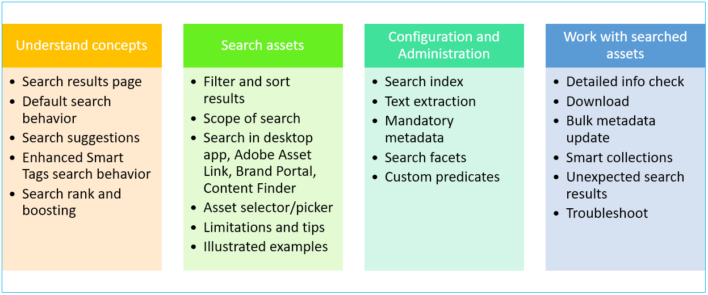
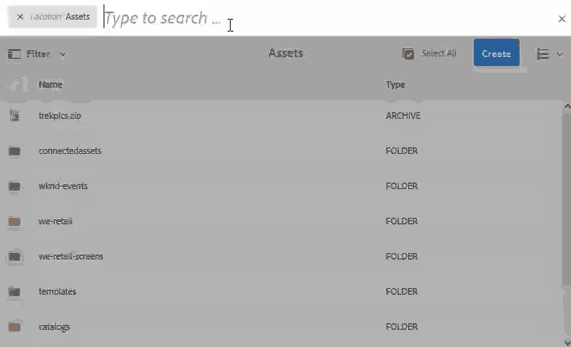

# Search assets in AEM{#search-assets-in-aem}

<!--
Comment Type: remark
Last Modified By: Ashish Gupta . (asgupta)
Last Modified Date: 2019-08-05T06:45:13.422-0400

Refer to the following resources for currently unknown-unknown info:

Adobe Experience Manager search demystified, L4080 Exp League Lab Workbook.pdf

Daycare tickets/verbatim about search

Top issues

Search KB/KT articles

-->

You can achieve higher content velocity using AEM's user-friendly asset discovery options. The digital assets stored in AEM can be searched using out-of-the-box functionality and custom methods. Searching assets is central to the usage of a digital asset management system -- be it for further use by creatives, for robust management of assets by the business users and marketers, or for administration by DAM administrators. Simple, advanced, and custom searches that you can perform via AEM Assets user interface or other apps and surfaces help fulfill these use cases.

AEM supports the following use cases and this document describes the configurations, settings, instructions, and limitations for these use cases.

Options and use cases in AEM to search digital assets

<table border="0" cellpadding="0" cellspacing="0"> 
 <tbody> 
  <tr> 
   <th scope="col" style="text-align: left;"><strong>Understand concepts</strong></th> 
   <th scope="col"><strong>Search assets</strong></th> 
   <th scope="col"><strong>Configuration and administration</strong></th> 
   <th scope="col"><strong>Work with search results</strong></th> 
  </tr> 
  <tr> 
   <td><a disablelinktracking="false" href="#searchui">Results page</a></td> 
   <td><a disablelinktracking="false" href="#sort">Sort results</a></td> 
   <td><a disablelinktracking="false" href="#searchindex">Search index</a></td> 
   <td><a disablelinktracking="false" href="#checkinfo">Detailed info</a></td> 
  </tr> 
  <tr> 
   <td><a disablelinktracking="false" href="#withsmarttags">Search behavior</a></td> 
   <td><a disablelinktracking="false" href="#scope">Search filters and scope</a></td> 
   <td><a disablelinktracking="false" href="#extracttextupload">Text extraction</a></td> 
   <td><a disablelinktracking="false" href="#download">Download</a></td> 
  </tr> 
  <tr> 
   <td><a disablelinktracking="false" href="#searchsuggestions">Search suggestions</a></td> 
   <td><a disablelinktracking="false" href="#beyondomnisearch">Search from other solutions  and apps</a></td> 
   <td><a disablelinktracking="false" href="#mandatorymetadata">Mandatory metadata</a></td> 
   <td><a disablelinktracking="false" href="#metadataupdates">Metadata updates</a></td> 
  </tr> 
  <tr> 
   <td><a disablelinktracking="false" href="#searchrank">Search rank and boosting</a></td> 
   <td><a disablelinktracking="false" href="#assetselector">Asset selector/picker</a></td> 
   <td><a disablelinktracking="false" href="#searchfacets">Search facets</a></td> 
   <td><a disablelinktracking="false" href="#collections">Smart collections</a></td> 
  </tr> 
  <tr> 
   <td> </td> 
   <td><a disablelinktracking="false" href="#limitations">Limitations</a></td> 
   <td><a disablelinktracking="false" href="#custompredicates">Custom predicates</a></td> 
   <td><a disablelinktracking="false" href="#unexpectedresults">Unexpected results</a></td> 
  </tr> 
  <tr> 
   <td> </td> 
   <td><a disablelinktracking="false" href="#tips">Tips</a></td> 
   <td> </td> 
   <td><a disablelinktracking="false" href="#troubleshoot">Troubleshoot</a></td> 
  </tr> 
  <tr> 
   <td> </td> 
   <td><a disablelinktracking="false" href="#samples">Illustrated examples</a></td> 
   <td> </td> 
   <td> </td> 
  </tr> 
 </tbody> 
</table>

## Concepts and overview {#concepts}

Understand the concepts, terms, user interface, and the behavior of AEM search before you begin using, configuring, and administering the search functionality.

### The search interface {#searchui}

Familiarize yourself with the search interface and the available actions.

Understanding parts of Assets search results interface

**A.** Save the search as a Smart Collection. **B.** Filters (predicates) to narrow the search results. **C.** Display Files, Folders, or both in the search results. **D.** Click Filters to open or close the left rail. **E.** Search location is DAM. **F.** Omnisearch bar with user-provided search keyword **G.** Check box to select all the search results **H.** Number of displayed search results out of the total search results **I.** Close the search **J.** Switch between card view and list view

### Dynamic search facets {#dynamicfacets}

You can discover the desired assets faster from the search results page using the dynamically updated number of expected search results in the search facets. The expected number of assets are updated even before applying the search filter. Seeing the expected count against the filter helps you navigate through the search results quickly and efficiently. For more info, see [Search assets in AEM](/6-4/assets/using/search-assets.md).

See the approximate number of assets without filtering search results in search facets.

### Suggestions as you type {#searchsuggestions}

When you start typing a keyword, AEM suggests the possible search keywords or phrases. The suggestions are based on the assets in AEM. AEM indexes all the metadata fields to help with search. To provide search suggestions the system uses the values of the following few metadata fields. To provide search suggestions, consider populating these fields with appropriate keywords.

<table border="1" cellpadding="1" cellspacing="0"> 
 <tbody> 
  <tr> 
   <th scope="col" style="text-align: center;"><strong>JCR field</strong>  </th> 
   <th scope="col" style="text-align: center;"><strong>Metadata field in Properties console</strong>  </th> 
  </tr> 
  <tr> 
   <td>jcr:content/metadata/cq:tags</td> 
   <td>Asset tags</td> 
  </tr> 
  <tr> 
   <td>jcr:content/metadata/dc:title</td> 
   <td>Asset title</td> 
  </tr> 
  <tr> 
   <td>jcr:content/metadata/dc:description</td> 
   <td>Asset description</td> 
  </tr> 
  <tr> 
   <td>jcr:content/jcr:title</td> 
   <td>Title in the JCR repository. The value may get mapped to Asset title.  </td> 
  </tr> 
  <tr> 
   <td>jcr:content/jcr:description</td> 
   <td>Description in the JCR repository. The value may get mapped to Asset description.</td> 
  </tr> 
 </tbody> 
</table>

### Understand default results and results with Enhanced Smart Tags {#withsmarttags}

By default, AEM search combines the search terms with an AND clause. For example, consider searching for keywords woman running. Only the assets with both woman and running keywords in the metadata appear in the search results by default. The same behavior is retained when special characters (periods, underscores, or dashes) are used with the keywords. The following search queries return the same results:

* `woman running`
* `woman.running`
* `woman-running`

However, the query `woman -running` returns assets without `running` in their metadata.   
Using smart tags adds an extra `OR` clause to find any of the search terms as the applied smart tags. An asset tagged with either `woman` or `running` using Smart Tags also appear in such a search query. So the search results are a combination of,

* assets with `woman` and `running` keywords in the metadata (default behavior).  

* assets smart tagged with either of the keywords (Smart Tags behavior).

### Search ranking and boosting {#searchrank}

The search results that match all search terms in metadata fields are displayed first, followed by the search results that match any of the search terms in the smart tags. In the above example, the approximate order of display of search results is:

1. matches of `woman running` in the various metadata fields.
1. matches of `woman running` in smart tags.
1. matches of `woman` or of `running` in smart tags.

You can improve the relevance of keywords for particular assets to help boost searches based on the keywords. In other words, the images for which you promote specific keywords appear at the top of the search results when you search based on these keywords.

1. From the Assets user interface, open the properties page for the asset. Click **[!UICONTROL Advanced]** and click/tap **[!UICONTROL Add]** under **[!UICONTROL Elevate for search keywords]**.
1. In the **[!UICONTROL Search Promote]** box, specify a keyword for which you want to boost the search for the image and then click/tap **[!UICONTROL Add]**. You can specify multiple keywords in the same way.
1. Click/tap **[!UICONTROL Save & Close]**. The asset which you promoted for this keyword appears among the top search results.

You can use this to your advantage by boosting the rank of some assets in the search results for the targeted keyword. See the example video below. For detailed info, see [search in AEM](/kt/assets/using/search-feature-video-use.md).

>[!VIDEO](https://video.tv.adobe.com/v/16766/?quality=6)

*Understand how search results are ranked and how the rank can be influenced.*

## Search assets {#searchassets}

You can search assets in AEM using the Omnisearch field at the top from Assets web interface. Go to **[!UICONTROL Assets > Files]** in AEM or access `http://[servername]:[port]/assets.html/content/dam`. Click  from the top bar. Alternatively, use the keyword shortcut / (forward slash) to open Omnisearch bar.

In the search bar, enter the search keyword and press return. `Location:Assets` is pre-selected to limit the searches to DAM assets. You can construct advanced searches to increase or limit the [scope of search](#scope).

Use the **[!UICONTROL Filters]** panel to search for assets, folders, tags, and metadata. You can filter search results based on the various options (predicates), such as file type, file size, last modified date, status of asset, insights data, Adobe Stock licensing, and so on. You can customize the Filters panel and add/remove search predicates using [search facets](/6-5/assets/using/search-facets.md).

AEM search capability supports searching for collections and searching for assets within a collection. See [search collections](../../../6-5/assets/using/managing-collections-touch-ui.md).

### Sort searched results {#sort}

Sorting search results helps you to discover required asset faster. Sorting search results works in list view only and only when **[!UICONTROL [Files](#searchui)]** are selected to be displayed from the **[!UICONTROL Filters]** panel. AEM Assets uses server-side sorting to quickly sort all the assets (howsoever numerous) within a folder or results of a search query. Server-side sorting provides faster and more accurate results than client-side sorting.

In list view, you can sort the search results just as you can sort assets in any folder. Sorting works on these columns -- Title, Status, Dimensions, Size, Rating, Usage, (Date) Modified, (Date) Published, Workflow, and Checked out.

To sort by Name, see [configuration tasks](#configadmin). For limitations of sort functionality, see [limitations](#limitations).

## Advanced search: Filter results or change the scope {#scope}

<!--
Comment Type: remark
Last Modified By: Ashish Gupta . (asgupta)
Last Modified Date: 2019-08-06T13:46:15.189-0400
<ol>
<li>Understand in-built options to improve search experience -- dynamic facets, select all, display of number of search results, list view enhancements from 6.4, card view enhancements from 6.4.  </li>
<li>Use metadata. Custom metadata for your specific business case: https://helpx.adobe.com/experience-manager/6-5/assets/using/metadata-schemas.html</li>
<li>See organize assets article for pointers</li>
<li>Improve performance by various configurations (see below)  </li>
</ol>
-->

AEM provides various methods like filters that apply to the searched assets, to help you locate the desired assets faster. A few commonly used methods are described below. Some [illustrated examples](#samples) are shared below.

**Search for files or folders**: In the search results, see either files, folders, or both. From **[!UICONTROL Filters]** panel you can select the appropriate option. See [search interface](#searchui).

**Search for assets within a folder**: You can limit the search to a specific folder. In the **[!UICONTROL Filters]** panel, add path of a folder. You can select only one folder at a time.

Limit search results to a folder by adding a folder path in Filters panel

### Adobe Stock images {#adobestock}

From within the AEM user interface, users can search [Adobe Stock assets](/6-4/assets/using/aem-assets-adobe-stock.md) and license the required assets. Add `Location: Adobe Stock` in the Omnisearch bar. You can also use Filters panel to find all the licensed or unlicensed assets or search a specific asset using Adobe Stock file number.

### Dynamic Media assets {#dmassets}

You can filter for Dynamic Media images by selecting **[!UICONTROL Dynamic Media > Sets]** from the **[!UICONTROL Filters]** panel. It filters and displays assets such as image sets, carousels, mixed media sets, and spin sets.

### Search using specific values in metadata fields {#gqlsearch}

You can for assets based on exact values of specific metadata fields, such as title, description, author, and so on. The GQL full-text search feature fetches only those assets whose metadata value exactly matches your search query. The names of the properties (for example author, title, and so on) and the values are case-sensitive.

<table border="1" cellpadding="1" cellspacing="0"> 
 <tbody> 
  <tr> 
   <th scope="col" style="text-align: center;"><strong>Metadata field</strong></th> 
   <th scope="col" style="text-align: center;"><strong>Facet value and usage</strong>  </th> 
  </tr> 
  <tr> 
   <td>Title</td> 
   <td>title:John</td> 
  </tr> 
  <tr> 
   <td>Creator</td> 
   <td>creator:John</td> 
  </tr> 
  <tr> 
   <td>Location</td> 
   <td>location:NA</td> 
  </tr> 
  <tr> 
   <td>Description</td> 
   <td>description:"Sample Image"</td> 
  </tr> 
  <tr> 
   <td>Creator tool</td> 
   <td>creatortool:"Adobe Photoshop CC 2015"</td> 
  </tr> 
  <tr> 
   <td>Copyright Owner</td> 
   <td>copyrightowner:"Adobe Systems"</td> 
  </tr> 
  <tr> 
   <td>Contributor</td> 
   <td>contributor:John</td> 
  </tr> 
  <tr> 
   <td>Usage Terms</td> 
   <td>usageterms:"CopyRights Reserved"</td> 
  </tr> 
  <tr> 
   <td>Created</td> 
   <td>created:YYYY-MM-DDTHH</td> 
  </tr> 
  <tr> 
   <td>Expires Date</td> 
   <td>expires:YYYY-MM-DDTHH</td> 
  </tr> 
  <tr> 
   <td>On time  </td> 
   <td>ontime:YYYY-MM-DDTHH</td> 
  </tr> 
  <tr> 
   <td>Off time  </td> 
   <td>offtime:YYYY-MM-DDTHH</td> 
  </tr> 
  <tr> 
   <td>Range of time(expires dateontime,offtime)</td> 
   <td>facet field : lowerbound..upperbound</td> 
  </tr> 
  <tr> 
   <td>Path</td> 
   <td>/content/dam/&lt;folder name&gt;</td> 
  </tr> 
  <tr> 
   <td>PDF Title</td> 
   <td>pdftitle:"Adobe Document"</td> 
  </tr> 
  <tr> 
   <td>Subject</td> 
   <td>subject:"Training"</td> 
  </tr> 
  <tr> 
   <td>Tags</td> 
   <td>tags:"Location And Travel"</td> 
  </tr> 
  <tr> 
   <td>Type</td> 
   <td>type:"image\png"</td> 
  </tr> 
  <tr> 
   <td>Width of image</td> 
   <td>width:lowerbound..upperbound</td> 
  </tr> 
  <tr> 
   <td>Height of image</td> 
   <td>height:lowerbound..upperbound</td> 
  </tr> 
  <tr> 
   <td>Person</td> 
   <td>person:John</td> 
  </tr> 
 </tbody> 
</table>

The properties path, limit, size, and orderby cannot be ORed with any other property.

The keyword for a user-generated property is its field label in the property editor in lowercase, with spaces removed.

Here are some examples of search formats for complex queries:

* To display all assets with multiple facets fields (for example: title=John Doe and creator tool = Adobe Photoshop): `tiltle:"John Doe" creatortool : Adobe*`
* To display all assets when the facets value is not a single word but a sentence (for example: title=Scott Reynolds): `title:"Scott Reynolds"`
* To display assets with multiple values of a single property (for example: title=Scott Reynolds or John Doe): `title:"Scott Reynolds" OR "John Doe"`
* To display assets with property values starting with a specific string (for example: title is Scott Reynolds): `title:Scott*`
* To display assets with property values ending with a specific string (for example: title is Scott Reynolds): `title:*Reynolds`
* To display assets with a property value that contains a specific string (for example: title = Basel Meeting Room): `title:*Meeting*`
* To display assets that contain a particular string and have a specific property value (for example: search for string Adobe in assets having title=John Doe): `*Adobe* title:"John Doe"`

## Search assets from other solutions and surfaces {#beyondomnisearch}

Adobe Experience Manager allows connection between the DAM repository and various other AEM solutions, to provide faster access to digital assets and streamline the creative workflows. Any asset discovery starts with browse or search. The search behavior largely remains the same across the various surfaces and solutions. Some search methods change because of the differences in the target audience, the use cases, and the user interface across the various AEM solutions. The specific methods are documented for the individual solutions at the links below. The universally applicable tips and behaviors are documented in this article.

**Adobe Asset Link** Using Adobe Asset Link, the creative professionals can now access content stored in AEM Assets, without leaving the supported Adobe Creative Cloud apps. Creatives can seamlessly browse, search, check out, and check in assets using the in-app panel in the Creative Cloud apps: Photoshop, Illustrator, and InDesign. Asset Link also allows users to search visually similar results. The visual search display results are powered by Adobe Sensei's machine learning algorithms and help users find aesthetically similar images. See search and browse assets using Adobe Asset Link.

**AEM desktop app** Creative professionals use the desktop app to make the AEM Assets easily searchable and available on their local desktop (Win or Mac). Creatives can easily reveal the desired assets in Mac Finder or Windows Explorer, opened in desktop applications, and changed locally - the changes are saved back to AEM with a new version created in the repository. The application supports basic searches using one or more keywords, &#42; and ? wildcards, and AND operator. See browse, search, and preview assets in desktop app.

**Brand Portal** Line-of-business users and marketers use Brand Portal to efficiently and securely share the approved digital assets with their extended internal teams, partners, and resellers. See search assets on Brand Portal.

**Adobe Stock images** From within the AEM user interface, users can search Adobe Stock assets and license the required assets. Add Location: Adobe Stock in the Omnisearch bar. You can also use Filters panel to find all the licensed or unlicensed assets or search a specific asset using Adobe Stock file number. See manage Adobe Stock images in AEM.

**Dynamic Media assets** You can filter for Dynamic Media images by selecting Dynamic Media > Sets from the Filters panel. It filters and displays assets such as image sets, carousels, mixed media sets, and spin sets. While authoring web pages, the authors can search for sets from within the Content Finder. A filter for sets is available in a pop-up menu.

**Remote AEM deployment** Authors can use the Connected Assets functionality to search for assets that are available on a remote AEM deployment and use these assets in web pages they author on a local AEM deployment. See use remote assets.

**Content Finder** Authors can use Content Finder to search the DAM repository for the relevant assets and use the assets in the web pages they create.

**Search Collections** AEM search capability supports searching for collections and searching for assets within a collection. See search collections.

## Asset selector {#assetselector}

Asset selector lets you search, filter, and browse the DAM assets in a special way. Asset selector is available at `http://[aem-server]:[port]/aem/assetpicker.html`. You can fetch the metadata of assets that you select using the asset selector. You can launch it with supported request parameters, such as asset type (image, video, text) and selection mode (single or multiple selections). These parameters set the context of the asset selector for a particular search instance and remains intact throughout the selection.

The asset selector uses the HTML5 Window.postMessage message to send data for the selected asset to the recipient. The asset selector is based on Granite's foundation picker vocabulary. By default, the asset selector operates in Browse mode.

You can pass the following request parameters in a URL to launch the asset selector in a particular context:

<table border="1" cellpadding="1" cellspacing="0" width="100%"> 
 <tbody> 
  <tr> 
   <td valign="top">
<strong>Name</strong>
 </td> 
   <td valign="top">
<strong>Values</strong>
 </td> 
   <td valign="top">
<strong>Example</strong>
 </td> 
   <td valign="top">
<strong>Purpose</strong>
 </td> 
  </tr> 
  <tr> 
   <td valign="top">
resource suffix (B)
 </td> 
   <td valign="top">
Folder path as the resource suffix in the URL:
 
<a href="http://localhost:4502/aem/assetpicker.html?mimetype=*presentation&amp;mimetype=*png">http://localhost:4502/aem/assetpicker.html</a>/&amp;lt;folder_path&amp;gt;
 </td> 
   <td valign="top">
To launch the asset selector with a particular folder selected, for example with the folder <a href="http://localhost:4502/aem/assetpicker.html/content/dam/we-retail/en/activities?assettype=images">/content/dam/we-retail/en/activities</a>, selected, the URL should be of the form: <a href="http://localhost:4502/aem/assetpicker.html/content/dam/we-retail/en/activities?assettype=images">http://localhost:4502/aem/assetpicker.html/content/dam/we-retail/en/activities?assettype=images</a>
 </td> 
   <td valign="top">
If you require a particular folder to be selected when the asset selector is launched, passed it as a resource suffix.
 </td> 
  </tr> 
  <tr> 
   <td valign="top">
mode
 </td> 
   <td valign="top">
single, multiple
 </td> 
   <td valign="top">
<a href="http://localhost:4502/aem/assetpicker.html?mode=multiple">http://localhost:4502/aem/assetpicker.html?mode=multiple</a>
 
<a href="http://localhost:4502/aem/assetpicker.html?mode=single">http://localhost:4502/aem/assetpicker.html?mode=single</a>
 </td> 
   <td valign="top">
In multiple mode, you can select several assets simultaneously using the asset selector.
 </td> 
  </tr> 
  <tr> 
   <td valign="top">
mimetype
 </td> 
   <td valign="top">
mimetype(s) (/jcr:content/metadata/dc:format) of an asset (wildcard also supported)
 </td> 
   <td valign="top">
<a href="http://localhost:4502/aem/assetpicker.html?mimetype=image/png">http://localhost:4502/aem/assetpicker.html?mimetype=image/png</a>
 
<a href="http://localhost:4502/aem/assetpicker.html?mimetype=*png">http://localhost:4502/aem/assetpicker.html?mimetype=*png</a>
 
<a href="http://localhost:4502/aem/assetpicker.html?mimetype=*presentation">http://localhost:4502/aem/assetpicker.html?mimetype=*presentation</a>
 
<a href="http://localhost:4502/aem/assetpicker.html?mimetype=*presentation&amp;mimetype=*png">http://localhost:4502/aem/assetpicker.html?mimetype=*presentation&amp;mimetype=*png</a>
 </td> 
   <td valign="top">
Use it to filter assets based on MIME type(s)
 </td> 
  </tr> 
  <tr> 
   <td valign="top">
dialog
 </td> 
   <td valign="top">
true, false
 </td> 
   <td valign="top">
<a href="http://localhost:4502/aem/assetpicker.html?dialog=true">http://localhost:4502/aem/assetpicker.html?dialog=true</a>
 </td> 
   <td valign="top">
Use these parameters to open the asset selector as <a href="https://helpx.adobe.com/experience-manager/6-5/sites/developing/using/reference-materials/granite-ui/api/jcr_root/libs/granite/ui/components/foundation/layouts/dialog/index.html" target="_blank">Granite Dialog</a>. This option is only applicable when you launch the asset selector through <a href="https://helpx.adobe.com/experience-manager/6-5/sites/developing/using/reference-materials/granite-ui/api/jcr_root/libs/granite/ui/components/coral/foundation/form/pathfield/index.html?highlight=pathfield" target="_blank">Granite Path Field</a>, and configure it as pickerSrc URL.
 </td> 
  </tr> 
  <tr> 
   <td valign="top">
assettype (S)
 </td> 
   <td valign="top">
images, documents, multimedia, archives
 </td> 
   <td valign="top">
<a href="http://localhost:4502/aem/assetpicker.html?assettype=images">http://localhost:4502/aem/assetpicker.html?assettype=images</a>
 
<a href="http://localhost:4502/aem/assetpicker.html?assettype=documents">http://localhost:4502/aem/assetpicker.html?assettype=documents</a>
 
<a href="http://localhost:4502/aem/assetpicker.html?assettype=multimedia">http://localhost:4502/aem/assetpicker.html?assettype=multimedia</a>
 
<a href="http://localhost:4502/aem/assetpicker.html?assettype=archives">http://localhost:4502/aem/assetpicker.html?assettype=archives</a>
 </td> 
   <td valign="top">
Use this option to filter asset types based on the value passed.
 </td> 
  </tr> 
  <tr> 
   <td valign="top">
root
 </td> 
   <td valign="top">
&amp;lt;folder_path&amp;gt;
 </td> 
   <td valign="top">
<a href="http://localhost:4502/aem/assetpicker.html?assettype=images&amp;root=/content/dam/we-retail/en/activities">http://localhost:4502/aem/assetpicker.html?assettype=images&amp;root=/content/dam/we-retail/en/activities</a>
 </td> 
   <td valign="top">
Use this option to specify the root folder for the asset selector. In this case, the asset selector lets you select only child assets (direct/indirect) under the root folder.
 </td> 
  </tr> 
 </tbody> 
</table>

To access the asset selector interface, go to `http://[aem-server]:[port]/aem/assetpicker`. Navigate to the desired folder, and select one or more assets. Alternatively, search for the desired asset from the Omnisearch box, apply filter as required, and then select it.

Browse and select asset in the asset picker

## Limitations {#limitations}

The search capability in AEM Assets has the following limitations:

* Do not enter a leading space in the search query otherwise the search does not work.
* AEM may continue to show the search term after you select properties of an asset from searched results and then cancel the search (CQ-4273540).
* When searching for folders or files and folders, the search results cannot be sorted on any parameter.
* If you press return without tying anything in Omnisearch bar, AEM returns a list of only files and not folders. If you search specifically for folders without using a keyword, AEM does not return any results.

## Search tips {#tips}

<!--
Comment Type: remark
Last Modified By: Ashish Gupta . (asgupta)
Last Modified Date: 2019-08-06T14:29:02.828-0400

How to improve or augment search capability?

Better indexing

Better tagging

Use AI services for tagging

Taxonomy and metadata hygiene  

Search as you type suggestions  

 

-->

* When monitoring the review status of assets, use the appropriate option to find which assets are approved or assets that are pending approval.
* Use the Insights predicate to search for supported assets based on their usage statistics obtained from various Creative apps. Usage data is grouped under Usage score, Impressions, Clicks, and Media channels where the assets appear categories.
* Use check box to select all the search results or the filtered search results to operate on the selection. For example, you can download all the selected assets, update metadata properties in bulk for all the selected assets, or add selected assets to a Collection.
* To search for assets that do not contain the mandatory metadata, see [mandatory metadata](#mandatorymetadata).
* Search uses all metadata fields. A generic search, such as searching for 12, usually returns many results. For better results, use double (not single) quotes or ensure that the number is contiguous to a word without a special character (for example *shoe12*).
* Full text search supports operators such as -, ^, and so on. To search these letters as string literals, enclose the search expression in double quotes. For example, use "Notebook - Beauty" instead of Notebook - Beauty.
* If the search results are too many, limit the [scope of search](#scope) to zero-in on the desired assets. It works best when you have some idea of how to better look for the desired assets, for example, specific file type, specific location, specific metadata, and so on.  

* **Tagging**: Tags helps you categorize assets that can be browsed and searched more efficiently. Tagging helps in propagating the appropriate taxonomy to other users and workflows. AEM offers methods to automatically tag assets using Adobe Sensei's artificially intelligent services that keep getting better at tagging your assets with usage and training. When you search for assets, the smart tags are factored in if the feature is enabled on your account. It works alongside AEM's in-built search functionality. See [search behavior](#withsmarttags). To optimize the order in which the search results are displayed, you can [boost the search ranking](#searchrank) of a few select assets.

* **Indexing**: Only indexed metadata and assets are returned in the search results. For better coverage and performance, ensure proper indexing and follow the best practices. See [indexing](#searchindex).

## Some examples illustrating search {#samples}

Use double quotations around keywords to find assets that contain the exact phrase in the exact order as specified by the user.

Search behavior with and without quotation marks

**Search with asterisk wildcard**: To broaden the search, use an asterisk before or after the search word to match any number of characters. For example, searching for run without an asterisk does not return assets containing any variation of the word (including in the metadata). An asterisk substitutes for any number of characters. For example,

* `run` returns assets with exactly run keyword
* `run*` returns assets with running, run, runaway, and so on.
* `*run` returns outrun, rerun, and so on.
* `*run*` returns all possible combinations.

Illustrating use of asterisk wildcard in Asset search using an example

**Search with question mark wildcard**: To broaden the search, use an asterisk before or after the search word to match any number of characters. For example, searching for run without an asterisk does not return assets containing any variation of the word (including in the metadata). Asterisk(s) help you make up for any characters. For example,

* `run???` does not match with any keyword in the DAM.  

* `run????` returns assets as it matches running.
* `??run` returns an asset as it matches rerun.

Illustrating use of question mark wildcard in Asset search using an example

**Exclude a keyword**: Use dash to search for assets that do not contain a keyword. For example, `running -shoe` query returns assets that contain `running`, but not `shoe`. Similarly, `camp -night` query returns assets that contain `camp` but not `night`. Note that `camp-night` query returns assets that contain both `camp` and `night`.

Use of dash to search for assets not containing an excluded keyword

## Configuration and administration tasks related to search functionality {#configadmin}

<!--
Comment Type: remark
Last Modified By: Ashish Gupta . (asgupta)
Last Modified Date: 2019-08-02T07:24:04.667-0400
<ul>
<li>Configure search results refresh interval of Content Finder: https://helpx.adobe.com/experience-manager/kb/HowToChangeContentFinderRefreshInterval.html  </li>
<li>Disable Full Repository View in Content Finder: https://helpx.adobe.com/experience-manager/kb/DisablingTheContentFinderFullView.html</li>
</ul>
-->

### Search index configurations {#searchindex}

Asset discovery relies on indexing of DAM contents, including the metadata. Faster and accurate asset discovery relies on optimized indexing and appropriate configurations. See [search index](../../../6-5/assets/using/performance-tuning-guidelines.md#search-indexes), [oak queries and indexing](/6-5/sites/deploying/using/queries-and-indexing.md), and [best practices](/6-5/sites/deploying/using/best-practices-for-queries-and-indexing.md).

### Extract text when uploading assets {#extracttextupload}

You can configure AEM to extract the text from the assets when users upload assets, such as PSD or PDF files. AEM indexes the extracted text and helps users search these assets based on the extracted text. See [upload assets](/6-4/assets/using/managing-assets-touch-ui.md#uploading-assets).

### Mandatory metadata {##mandatorymetadata}

Business users, administrators, or DAM librarians can define some metadata as mandatory metadata that is a must for the business processes to work. For various reasons, some assets may be missing this metadata, such as legacy assets or assets migrated in bulk. Assets with missing or invalid metadata are detected and reported based on the indexed metadata property. To configure it, see [mandatory metadata](../../../6-5/assets/using/metadata-schemas.md#defining-mandatory-metadata).

### Modify search facets {#searchfacets}

To improve the speed of discovery, AEM Assets offers search facets using which you can filter your search results. The Filters panel includes a few standard facets by default. Administrators can customize the Filters panel to modify the default facets using the in-built predicates. AEM provides a good collection of in-built predicates and an editor to customize the facets. See [search facets](/6-5/assets/using/search-facets.md).

### Sort on Name column {#sortbyname}

In list view, you can sort the search results just as you can sort assets in any folder. Sorting does not work on the `Name` column by default. To sort by the `Name` column, overlay `/libs/dam/gui/content/commons/availablecolumns` and change the value of sortable to `True`.

### Custom predicates to filter search results {#custompredicates}

Predicates are used to create facets. Administrators can customize the search facets in the Filters panel using pre-configured predicates. These predicates can be customized using overlays. See [create custom predicates](../../../6-5/assets/using/searchx.md).

You can search for digital assets based on one or more of the following properties. Filters that apply on some of these properties are available by default and some other filters can be custom-created to apply on the other properties.

<table border="1" cellpadding="0" cellspacing="0"> 
 <tbody> 
  <tr> 
   <th scope="col" style="text-align: center;"><strong>Search field</strong>  </th> 
   <th scope="col" style="text-align: center;"><strong>Search property values</strong>  </th> 
  </tr> 
  <tr> 
   <td>MIME Types</td> 
   <td>Images, Documents, Multimedia, Archives, or Other.</td> 
  </tr> 
  <tr> 
   <td>Last Modified</td> 
   <td>Hour, Day, Week, Month, or Year.</td> 
  </tr> 
  <tr> 
   <td>File Size</td> 
   <td>Small, Medium, or Large.</td> 
  </tr> 
  <tr> 
   <td>Publish Status</td> 
   <td>Published or Unpublished.</td> 
  </tr> 
  <tr> 
   <td>Approved Status</td> 
   <td>Approved or Rejected.</td> 
  </tr> 
  <tr> 
   <td>Orientation</td> 
   <td>Horizontal, Vertical, or Square.</td> 
  </tr> 
  <tr> 
   <td>Style</td> 
   <td>Color, or Black &amp; White.</td> 
  </tr> 
  <tr> 
   <td>Video Height</td> 
   <td>Specified as a minimum and maximum value. Value is stored in the metadata of video renditions only.</td> 
  </tr> 
  <tr> 
   <td>Video Width</td> 
   <td>Specified as a minimum and maximum value. Value is stored in the metadata of video renditions only.</td> 
  </tr> 
  <tr> 
   <td>Video Format</td> 
   <td>DVI, Flash, MPEG4, MPEG, OGG Theora, QuickTime, Windows Media. Value is stored in the metadata of the source video and any renditions.</td> 
  </tr> 
  <tr> 
   <td>Video Codec</td> 
   <td>x264. Value is stored in the metadata of video renditions only.</td> 
  </tr> 
  <tr> 
   <td>Video Bitrate</td> 
   <td>Specified as a minimum and maximum value. Value is stored in the metadata of video renditions only.</td> 
  </tr> 
  <tr> 
   <td>Audio Codec</td> 
   <td>Libvorbis, Lame MP3, AAC Encoding. Value is stored in the metadata of video renditions only.</td> 
  </tr> 
  <tr> 
   <td>Audio Bitrate</td> 
   <td>Specified as a minimum and maximum value. Value is stored in the metadata of video renditions only.</td> 
  </tr> 
 </tbody> 
</table>

## Work with asset search results {#aftersearch}

Once you see some searched assets that match your criteria, you can do the following typical tasks with or take the following actions on these search results:

* View metadata properties and other information.
* Download one or more assets.
* Use Desktop Actions to open these assets in the desktop app.  
* Create smart collections.

### Check detailed information of an asset {##checkinfo}

You can check detailed information of a searched assets from the search result page.

To see all metadata of an asset, select the asset and click **[!UICONTROL properties]** from the toolbar.

To check the comments on an asset or version history of an asset, click the asset to open large-sized preview. Open timeline in the left rail and select Comments or Versions. You can also sort the timeline activity like comments or versions in a chronological order.

Sort timeline entries for a search asset

### Download searched assets {#download}

You can download the searched assets and their renditions just as you download regular assets from folders. Select one or more assets from the search results and click **[!UICONTROL Download]** from the toolbar.

### Bulk update metadata properties {##metadataupdates}

It is possible to make bulk updates to the common metadata fields of multiple assets. From the search results, select one or more assets. Click **[!UICONTROL Properties]** from the toolbar and update the metadata as required. Click **[!UICONTROL Save and Close]** when done. The previously existing metadata in the updated fields is overwritten.

### Smart collections {#collections}

A collection is an ordered set of assets that can include assets from different locations because collections contain only references to these assets. Collections are of the following two types:

* A static reference list of assets, folders, and other collections.  
* A dynamic list (smart collection) that populates assets in the collection based on a search criteria.

You can create smart collections based on the search criteria. From the **[!UICONTROL Filters]** panel, select **[!UICONTROL Files]** and click **[!UICONTROL Save Smart Collection]**. See [manage collections](../../../6-5/assets/using/managing-collections-touch-ui.md).

## Unexpected search results {##unexpectedresults}

<!--
Comment Type: remark
Last Modified By: Ashish Gupta . (asgupta)
Last Modified Date: 2019-08-05T06:23:33.581-0400

 &lt;<strong> PM and engg inputs required </strong>&gt;

<ul>
<li>What are some edge cases we know of?</li>
<li>Limitations go in the limitations section below, but do share.</li>
<li>What results are as designed by may seem unexpected to the user?</li>
<li>How to improve performance of searches done in Content Finder</li>
</ul>
-->

**Search for missing metadata**: When searching for assets that are missing the mandatory metadata, AEM may display some assets that have valid metadata. Missing metadata is detected and reported based on indexed metadata property. Even if the asset metadata is fixed, it continues to show as missing metadata until re-indexing occurs. See [mandatory metadata](../../../6-5/assets/using/metadata-schemas.md#defining-mandatory-metadata).

**More than the expected results**: To avoid getting too many search results, consider limiting the search results. For example, to search for assets in DAM, select `Location:Assets` in Omnisearch bar. For more search filters, see [scope of search](#scope).

Another reason to get more than expected search results can be use of smarts tags. See [search behavior with smart tags](#withsmarttags).

**Partially related or unrelated search results**: AEM may display seemingly partially related or unrelated assets, alongside the desired assets in the search results. If you enable Enhanced Smart Tags, the search behavior changes slightly. See how it changes [after smart tagging](#withsmarttags).

**No auto-complete suggestions for newly uploaded assets**: The metadata (titles, tags, and so on) of the recently uploaded assets is not immediately available as suggestions when you start typing a search keyword in Omnisearch bar. AEM Assets waits until the expiry of a timeout period (one hour by default) before running a background job to index the metadata for all newly uploaded or updated assets and then adds the metadata to the list of suggestions.

**No search results**: If AEM and displays an empty page for a search query, the following may be reasons:

* No assets exist that match your query.
* You add a whitespace before the search query. It is a [known limitation](#limitations).  

* An unsupported metadata field contains the keyword that you search for. Not all metadata fields are considered for searches. See [scope](#scope).
* On time and off time is configured for asset and the search was made during an asset's off time.

**Search filter/predicate is not available**: If an expected customization to search filters is not available on the user interface, contact your administrator to check if the customization was implemented for all authors and on the production server you are using. It is possible that the configuration was incorrect.

<!--
Comment Type: draft

<h2 id="troubleshoot">Troubleshoot search issues</h2>
-->

<!--
Comment Type: draft

See the issues and possible course of action below:

<ul>
<li>If an expected search filter/predicate is not visible, contact your administrator.</li>
<li>What to do when asset UUID is not searchable?</li>
<li>How to improve performance of searches done in Content Finder  </li>
</ul>
-->

<!--
<related-links>
<a href="/kt/sites/using/search-tutorial-develop.md">AEM search implementation guide</a>
<a href="/kt/assets/using/search-feature-video-use.md">Advanced configuration of multi-value and tag search predicates</a>
<a href="/kt/assets/using/smart-translation-search-technical-video-setup.md">Configure smart translation search</a>
</related-links>
-->

