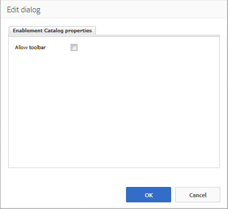

# Assignments Feature{#assignments-feature}

The Enablement Assignments and [Enablement Catalog](/6-5/communities/using/catalog.md) components found in the Communities group in the components browser are components of an [enablement community](../../../6-5/communities/using/overview.md#enablement-community).

The Enablement Assignments component allows the currently signed-in community member (learner) to access their assigned [enablement resources](/6-5/communities/using/resources.md).

From the [Getting Started with AEM Communities for Enablement](/6-5/communities/using/getting-started-enablement.md) tutorial, see a member's view of assignments and catalogs in the [Experience the Published Site](/6-5/communities/using/enablement-published-site.md) section.

<!--
Comment Type: draft

<h3>Introduction</h3>
-->

<!--
Comment Type: draft

The Enablement feature for AEM Communities provides an environment where resources for learning can be accessed from a catalog or assigned to members of a community.

This section of the documentation describes:

<ul>
<li>adding the Enablement feature to non-<a href="../../../6-5/communities/using/overview.md#community-sites">Community Sites</a></li>
<li>configuration settings for Enablement components</li>
</ul>
-->

<!--
Comment Type: draft

<h3>Adding Enablement Components to a Page</h3>
-->

<!--
Comment Type: draft

When the AEM Site is not a Community Site, and it is desired to add components of the Enablement feature to a page in author mode, locate the components

<ul>
<li>Communities / Enablement Assignments</li>
<li>Communities / Enablement Catalog</li>
</ul>

to enable them to be dragged into place on a page where the assignments or catalog should appear.

For necessary information, visit <a href="/6-5/communities/using/basics.md">Communities Components Basics</a>.

When the <a href="../../../6-5/communities/using/essentials-assignments.md#essentials-for-client-side">required client-side libraries</a> are included, this is how the Enablement Assignments component appears:

-->

<!--
Comment Type: draft

-->

<!--
Comment Type: draft

And the Enablement Catalog appears as follows:

-->

<!--
Comment Type: draft

-->

<!--
Comment Type: draft

<h3>Configuring Enablement Assignments</h3>
-->

<!--
Comment Type: draft

When you double-click the Enablement Assignments component, an edit dialog opens up.

Under the <strong>My Assigned properties</strong> tab, specify the basic features of the assignments listing:

-->

<!--
Comment Type: draft

-->

<!--
Comment Type: draft

<ul>
<li><strong>Allow toolbar</strong>  If checked, display the toolbar. Default is deselected.</li>
<li><strong>Allow type selection</strong>  Defunct.</li>
<li><strong>Allow search</strong>  If checked, allow searching for specific assignments. Default is deselected.</li>
</ul>
-->

<!--
Comment Type: draft

<h3>Configuring Enablement Catalog</h3>
-->

<!--
Comment Type: draft

When you double-click the Enablement Catalog component, an edit dialog opens up.

Under the <strong>Enablement Catalog properties</strong> tab, specify whether or not to allow the toolbar:

-->

<!--
Comment Type: draft

-->

<!--
Comment Type: draft

<ul>
<li><strong>Allow toolbar</strong>  If checked, display the toolbar. Default is deselected.</li>
</ul>
-->

### Additional Information {#additional-information}

For more information, see the [Assignments Essentials](../../../6-5/communities/using/essentials-assignments.md) page for developers.

The [assignments function](../../../6-5/communities/using/functions.md#assignments-function) is available while creating a [community site](../../../6-5/communities/using/sites-console.md).
