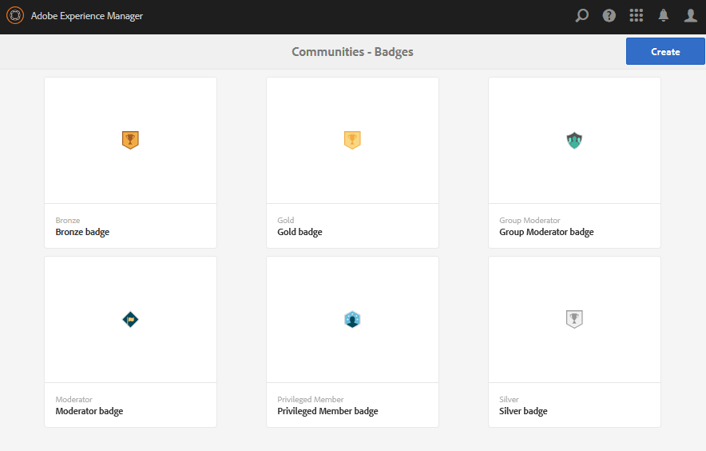

# Badges Console{#badges-console}

## About Badges {#about-badges}

The Communities Badges console provides the ability to add custom badges which can be displayed for a member when earned (awarded) or when they take on a specific role in the community (assigned).

### Badge Visibility {#badge-visibility}

Currently, badges a community member earns or is assigned will appear along with their name and avatar in the following locations :

* profiles
* [forums](../../../6-5/communities/using/forum.md)
* [QnA](../../../6-5/communities/using/working-with-qna.md)
* [leaderboards](../../../6-5/communities/using/enabling-leaderboard.md)
* [ideation](../../../6-5/communities/using/ideation-feature.md)

##

In the author environment, to reach the Badges console

* from global navigation : **Tools, Communities, Badges**

This console displays the badges currently available and from which new badges can be added.

## Create Badge {#create-badge}

A badge is created by uploading a suitably small image (72dpi with a height ranging from 26-32 pixels) and providing a name. The badge image is stored in the repository at `/etc/community/badging/images` and is automatically replicated to the publish environment.

If the publish environment is a farm of publishers, it is necessary to configure [user sync](../../../6-5/communities/using/sync.md).

* **Upload Image** 
  (*required*) A badge image with a recommended size of 32 x 32 pixels at 72dpi in either the JPEG or PNG format.

* **Name** 
  (*required*) The badge name. It is the default `Display Name` as well as the repository node name. If the `Name` is not a valid repository node name, it will be modified.

* **Display Name** 
  (*optional*) The name to display for the badge in the UI. Default is the unaltered text entered for the `Name`.

* **Description** 
  (*optional*) A description for the badge.

## Additional Information {#additional-information}

For details on setting up scoring and badging rules, see [Scoring and Badges](../../../6-5/communities/using/implementing-scoring.md).

For managing badges for members, see [Members Console](/6-5/communities/using/members.md).
