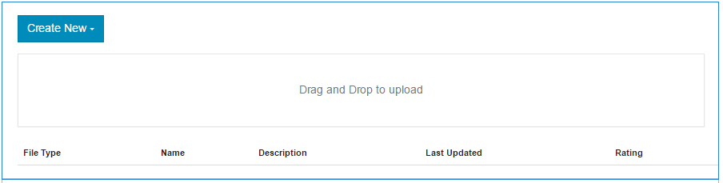

# File Library Feature{#file-library-feature}

### Introduction {#introduction}

The file library feature provides a place for signed-in site visitors (community members) to upload, manage and download files within the community site.

This section of the documentation describes

* adding the file library feature to an AEM site
* configuration settings for the `File Library` component

### Adding a File Library to a Page {#adding-a-file-library-to-a-page}

To add a `File Library` component to a page in author mode, locate the component

* `Communities / File Library`

and drag it into place on a page.

For necessary information, visit [Communities Components Basics](/6-5/communities/using/basics.md).

When the [required client-side libraries](/6-5/communities/using/essentials-file-library.md#essentials-for-client-side) are included, this is how the `File Library` component will appear :

### Configuring File Library {#configuring-file-library}

Select the placed `File Library` component to access and select the `Configure` icon which opens the edit dialog.

 

#### Comments tab {#comments-tab}

Under the **Comments **tab, specify if and how comments for uploaded files appear :

* **Allow Comments on Files** 
  If checked, allow comments on uploaded files. Default is unchecked.

* **Comments Per Page** 
  Limits the number of comments shown per page as well as the number of replies shown. Default is **10**.

* **Max File Size** 
  This value will limit the uploaded file size. Default limit is 104857600 (10 Mb).

* **Max Message Length** 
  Maximum number of characters that may be entered into the text box. Default is 4096 characters.

* **Allowed File Types** 
  A comma separated list of file extensions with the "dot" separater. For example : .jpg, .jpeg, .png, .doc, .docx, .pdf. If any file types are specifed, then those not specified will not be allowed. Default is none specified such that** **all file types are allowed.

* **Rich Text Editor** 
  If checked, comments may be entered with markup. Default is unchecked.

* **Delete Comments** 
  If checked, users are allowed to delete their own comments. Default is checked.

* **Allow Tagging** 
  If checked, the ability to add a tag to the file will be enabled. Default is unchecked.

* **Allowed Namespaces** 
  If Allow Tagging is checked, the tags available will be limited to the namespaces checked. If none are checked, then all are allowed. Default is all namespaces.

* **Suggestion Limit** 
  If Allow Tagging is checked, this setting limits the number of suggested tags to display. If set to -1, there is no limit. Default is -1.

* **Allow Voting** 
  If checked, the ability to voter for a file will be enabled. Default is unchecked.

* **Allow Following** 
  If checked, include the following feature for blog articles, which allows members to be [notified](../../../6-5/communities/using/notifications.md) of new posts. Default is unchecked.

* **Enable Mention** 
  If enabled, allows registered community users to identify other registered members (using first name, last name, user name) and tag them using the common @user-name syntax. The tagged users recieve notifications about their mentions. 

* **Max Mentions** 
  Restrict the maximum number of mentions allowed in a post. Default is 10.  

* **UI Mention Pattern** 
  Specify the alowed pattern string to tag (@mention) the registered user in a post. For example ~{{familyName}}{{givenName}}.

* **Allow Threaded Replies** 
  If checked, allow replies to posted comments. Default is unchecked.

#### User Moderation tab {#user-moderation-tab}

Under the **User Moderation** tab, configure moderation of comments, if comments are allowed :

* **Pre-Moderation** 
  If checked, comments must be approved before they will appear on a publish site. Default is unchecked.

* **Delete Comments** 
  If checked, the visitor who posted the comment is provided the ability to delete it. Default is checked.

* **Deny Comments** 
  If checked, allow trusted member moderators to deny comments. Default is unchecked.

* **Close / Reopen Comments** 
  If checked, allow trusted member moderators to close and reopen comments. Default is unchecked.

* **Flag Comments** 
  If checked, allow visitors to flag comments as inappropriate. Default is unchecked.

* **Flag Reason List** 
  If checked, allow visitors to choose, from a drop-down list, their reason for flagging a comment as inappropriate. Default is unchecked.

* **Custom Flag Reason** 
  If checked, allow visitors to enter their own reason for flagging a comment as inappropriate. Default is unchecked.

* **Moderation Threshold** 
  Enter the number of times a comment has to be flagged by visitors before moderators are notified. Default is one time (**1**).

* **Flagging Limit** 
  Enter the number of times a comment has to be flagged before it is hidden from public view. This number must be greater than or equal to the **Moderation Threshold**. Default is 5.

### Sort Settings tab {#sort-settings-tab}

Sort By

Set as Default

### Additional Information {#additional-information}

More information may be found on the [File Library Essentials](/6-5/communities/using/essentials-file-library.md) page for developers.

For moderation of posted topics and comments, see [Moderating User Generated Content](../../../6-5/communities/using/moderate-ugc.md).

For tagging posted topics and comments, see [Tagging User Generated Content](/6-5/communities/using/tag-ugc.md).
