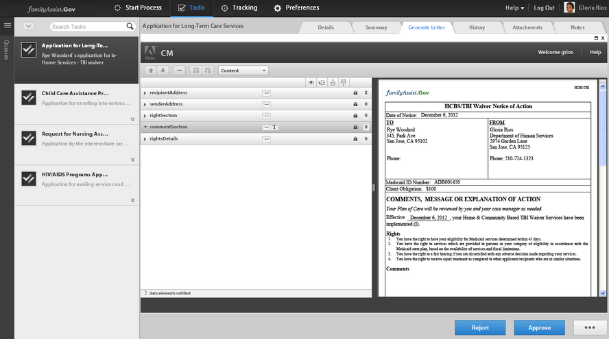
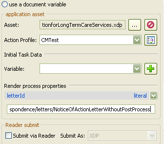

# Integrating third-party applications in AEM Forms workspace{#integrating-third-party-applications-in-aem-forms-workspace}

AEM Forms workspace supports the management of task assignment and completion activities for forms and documents. These forms and documents can be XDP Forms, Flex® forms, or Guides (deprecated) that have been rendered in XDP, PDF, HTML, or Flex formats.

These capabilities are further enhanced. AEM Forms now supports collaboration with third-party applications that support functionality similar to the AEM Forms workspace. A common part of this functionality is the workflow of assignment and subsequent approval of a task. AEM Forms provides a single unified experience for AEM Forms enterprise users so that all such task assignments or approvals for the supported applications can be handled through AEM Forms workspace.

As an example, let us consider Correspondence Management as the sample candidate for integration with AEM Forms workspace. Correspondence Management has the concept of a 'Letter', which can be rendered and allows actions.

## Create Correspondence Management assets {#create-correspondence-management-assets}

Start by creating a sample Correspondence Management template that is rendered in AEM Forms workspace. For more details, see [Create a letter template](../../../6-5/forms/using/create-letter.md).

Access the Correspondence Management template at its URL to verify if the Correspondence Management template can be rendered successfully. The URL has a pattern similar to `http://[server]:[port]/lc/content/cm/createcorrespondence.html?cmLetterId=encodedLetterId&cmUseTestData=1&cmPreview=0;`

where `encodedLetterId` is the URL-encoded letter Id. Specify the same letter Id, when defining the render process for workspace task in Workbench.

<!--
Comment Type: draft

<p>Hidden heading: Create a task to view the external app</p>
-->

<!--
Comment Type: draft


-->

<!--
Comment Type: draft

<ol>
<li><p>Add a process called CMTest to the application.</p> </li>
<li><p>Add an xdp (say ApplicationforLongTermCareServices.xdp) to the application and place it under CMDemoSample/CMDemoSample/1.0</p>  </li>
<li><p> Select ‘AssignTask’ from Activity Picker. A warning may appear asking you to change the process from short lived to long lived. Click Yes.</p>  </li>
<li><p>In ‘Initial User Selection’, select ‘Assign to specific user’ and add user (say Gloria Rios).</p> </li>
<li><p>In the ‘Presentation and Data’ tab’ for the asset, browse to ApplicationforLongTermCareServices.xdp added in step 2. This asset is a placeholder and will not be used in case of external application.</p> </li>
<li><p>Click ‘Manage Action Profiles’</p>  </li>
<li><p>Add a new Action Profile and name it CMTest</p>  </li>
<li><p>In Render Process, select the renderer you created, that is <br /> /CMDemoSample/1.0/CMRenderer.process</p> </li>
<li><p>Click OK. Render process properties are displayed as shown here:</p> <p>Specify a letter Id for example /content/apps/cm/correspondence/letters/NoticeOfActionLetterWithoutPostProcess. This is the same letter Id that you created at the beginning of the exercise.</p> </li>
<li><p>Deploy the Application. Check in and save assets if prompted.</p> </li>
<li><p>Right click the CMTest process from Workbench and select Invoke.</p> </li>
<li><p>Log in to AEM Forms workspace <span class="code">http://[server]:[port]/lc/content/ws</span> as Gloria Rios, as specified in Step 4.</p>  </li>
<li><p>Open the task you had added. The Correspondence Management Letter should open up.</p>  </li>
<li><p>Fill in the required data and submit the letter. The window should close. Any Correspondence Management post-process activity associated with the letter is invoked.</p> </li>
</ol>
-->

<!--
Comment Type: draft

<p>Hidden heading: Create Custom Render/Submit Process</p>
-->

<!--
Comment Type: draft

<p>The custom render/submit process let you use the data specified in 'Assign Task' operation. The process interprets the location of the form template and data and returns it appropriately to the workspace client.</p>
<p>Use the following steps to create a custom renderer:</p>
<p> </p>
-->

<!--
Comment Type: draft

<ol>
<li><p>Launch Workbench. Log in to localhost as administrator.</p>  </li>
<li><p>Click File &gt; New &gt; Application. In the Application Name field, enter <span class="code">CMDemoSample</span> and then click Finish.</p> </li>
<li><p>Select <span class="code">CMDemoSample/1.0</span> and right-click <span class="code">NewProcess</span>. In the name field, enter <span class="code">CMRenderer</span> and then click Finish.</p> </li>
<li><p>Drag the Activity Picker and add the Set Value Operation.</p> </li>
<li><p>Create an output variable <span class="code">runtimeMap</span> of type ‘map’ and subtype ‘object’ (WorkflowDSC &gt; object).</p> </li>
<li><p>Add mappings as shown here.</p>
<table border="1" cellpadding="1" cellspacing="0" width="100%">
<tbody>
<tr>
<td style="text-align: center;"><strong>Location</strong></td>
<td style="text-align: center;"><strong>Expression</strong></td>
<td> </td>
</tr>
<tr>
<td>/process_data/runtimeMap[@id="hint:externalAppForm"]<br /> </td>
<td>true()<br /> </td>
<td>Denotes if the application is an external application. Value in this field is mandatory for successful integration.<br /> </td>
</tr>
<tr>
<td>/process_data/runtimeMap[@id="externalAppFormUrl"]<br /> </td>
<td>concat('/lc/content/cm/createcorrespondence.html?cmLetterId=',/process_data/@letterId,'&cmUseTestData=1&cmPreview=0&cmLcWorkspace=1')<br /> </td>
<td>Complete URL, which when loaded in workspace client iframe, renders the external application form user interface.</td>
</tr>
<tr>
<td>/process_data/runtimeMap[@id="externalAppFormType"]</td>
<td>'text/html'</td>
<td>Optional. Denotes the external app content type. Not in use currently. Meant for any possible future enhancements (Default: text/html)<br /> </td>
</tr>
<tr>
<td>/process_data/runtimeMap[@id="hideACLActions"]</td>
<td><br /> true()</td>
<td>Optional. If true, hides actions such as forward, reject, and share from the user interface (Default: false)</td>
</tr>
<tr>
<td>/process_data/runtimeMap[@id="hideDirectActions"]</td>
<td>false()</td>
<td>Optional. If true, hides actions such as submit and save from the user interface (Default: false)<br /> </td>
</tr>
<tr>
<td>/process_data/runtimeMap[@id="cancelMessage"]</td>
<td>'submitCancel'</td>
<td>Optional. Message from third-party app to notify workspace to cancel the task (that is, close without save/submit). (Default: cancel)</td>
</tr>
<tr>
<td>/process_data/runtimeMap[@id="errorMessage"]</td>
<td>'submitFault'</td>
<td>Optional. Message from third-party app to notify workspace that an error occurred. (Default: error)</td>
</tr>
<tr>
<td>/process_data/runtimeMap[@id="successMessage"]</td>
<td>'submitSuccess'</td>
<td>Optional. Message from third-party app to workspace that an event has occurred successfully. (Default: submit)</td>
</tr>
<tr>
<td>/process_data/runtimeMap[@id="actionEnabledMessage"]</td>
<td>'actionChanged'<br /> </td>
<td>Optional. Message from third-party app to notify workspace whether to enable a direct action button. The third-party app is required to send a payload (true/false).</td>
</tr>
<tr>
<td>/process_data/runtimeMap[@id="externalAppName"]</td>
<td>'ccrSwf'<br /> </td>
<td>Optional. Id of the embed tag of the third-party application. (Default 'ccrSwf')</td>
</tr>
</tbody>
</table> </li>
<li><p>Drag the Activity Picker to add an Execute Script Operation.</p> </li>
<li><p>Add the following script:</p> <p><span class="code">import java.util.Map;</span></p> <p><span class="code">import java.util.HashMap;</span></p> <p><span class="code">Map runtimeMap = patExecContext.getProcessDataMapValue("runtimeMap");</span></p> <p><span class="code">Map routeActionMap = new HashMap();</span></p> <p><span class="code">routeActionMap.put("complete","Submit");</span></p> <p><span class="code">routeActionMap.put("Approve","Submit");</span></p> <p><span class="code">routeActionMap.put("Reject","Submit");</span></p> <p><span class="code">runtimeMap.put("routeActionMap",routeActionMap);</span></p> <p><span class="code">patExecContext.setProcessDataMapValue("runtimeMap",runtimeMap);</span></p> <p>This maps the user actions defined for the task with the third-party application actions. If no user action is defined for the task, ‘complete’ is used. Otherwise, the named actions are used. Since a render service is orchestration-agnostic, map all possible user actions (across processes) to the corresponding third-party app actions.</p> </li>
<li><p> Add another variable to the application named letterId of type string. Mark it as input and required </p>  
<note>
<p>Correspondence Management does not have a requirement of custom submit process as Correspondence Management submit takes care of the post process requirements. For other applications, a custom submit can be created for the additional requirements.</p>
</note></li>
</ol>
-->

## Create a task to render and submit a letter in AEM Workspace {#create-a-task-to-render-and-submit-a-letter-in-aem-workspace}

Before executing these steps, ensure that you are a member of the following groups:

* cm-agent-users
* Workspace Users

For more information, see [Add and configure users](/6-4/forms/using/admin-help/adding-configuring-users.md).

Use the following steps to create a task to render and submit a letter in AEM Workspace:

1. Launch Workbench. Log in to localhost as administrator.
1. Click File > New > Application. In the Application Name field, enter `CMDemoSample` and then click Finish.
1. Select `CMDemoSample/1.0` and right-click `NewProcess`. In the name field, enter `CMRenderer` and then click Finish.
1. Drag the Start Point activity picker and configure it:

    1. In Presentation Data, select Use A CRX Asset.
    
       

    1. Browse for an asset. In the Select Form Asset dialog, the Letters tab lists all the letters on the server.
    
       

    1. Select the appropriate letter and click **OK**.

1. Click Manage Action Profiles. The Manage Action Profile dialog appears. Ensure that the Render Process and Submit Process are appropriately selected.
1. To open the letter with a data XML file, browse and select the appropriate data file in the Prepare Data Process. 
1. Click OK.
1. Define the variables for Start Point Output and Task Attachments. The defined variables will contain Start Point Output and Task Attachments data. 
1. (Optional) To add another user in the workflow, drag an activity picker, configure it, and assign it to a user. Write a custom wrapper (sample given below) or download and install the DSC (given below) to extact Letter template, Start Point Output, and task Attachment.

   A sample custom wrapper is as listed below:

   ```java
   public LetterInstanceInfo getLetterInstanceInfo(Document dataXML) throws Exception {
   try {
   if(dataXML == null)
   throw new Exception("dataXML is missing");
   
   CoreService coreService = getRemoteCoreService();
   if (coreService == null)
   throw new Exception("Unable to retrive service. Please verify connection details.");
   Map<String, Object> result = coreService.getLetterInstanceInfo(IOUtils.toString(dataXML.getInputStream(), "UTF-8"));
   LetterInstanceInfo letterInstanceInfo = new LetterInstanceInfo();
   
   List<Document> attachmentDocs = new ArrayList<Document>();
   List<byte[]> attachments = (List<byte[]>)result.get(CoreService.ATTACHMENT_KEY);
   if (attachments != null){
   for (byte[] attachment : attachments)
   { attachmentDocs.add(new Document(attachment)); }
   
   }
   letterInstanceInfo.setLetterAttachments(attachmentDocs);
   
   byte[] updateLayout = (byte[])result.get(CoreService.LAYOUT_TEMPLATE_KEY);
   if (updateLayout != null)
   { letterInstanceInfo.setLetterTemplate(new Document(updateLayout)); }
   
   else
   { throw new Exception("template bytes missing while getting Letter instance Info."); }
   
   return letterInstanceInfo;
   } catch (Exception e)
   { throw new Exception(e); }
   
   }
   
   ```

   [Get File](assets/dscsample.zip)
   Download DSC: A sample DSC is available in the DSCSample.zip file attached above. Download and unzip the DSCSample.zip file. Before you use the DSC service, you need to configure it. For information, see [Configure the DSC Service](../../../6-5/forms/using/add-action-button-in-create-correspondence-ui.md#p-configure-the-dsc-service-p).

   In the Define Activity dialog, select the appropriate activity such as getLetterInstanceInfo and click **OK**.

1. Deploy the application. If prompted check-in and save the assets.
1. Log in to the AEM forms workspace at http://[server]:[port]/lc/content/ws.
1. Open the task you had added, CMRenderer. The Correspondence Management letter appears.

   

1. Fill in the required data and submit the letter. The window closes. In this process, the task gets assigned to the user specified in the workflow in step 9.

   >[!NOTE]
   >
   >The Submit button is not enabled until all the required variables in the letter are filled in.

[**Contact Support**](https://www.adobe.com/account/sign-in.supportportal.html)

<!--
<related-links>
<a href="../../../6-5/forms/using/introduction-customizing-html-workspace.md">Introduction to Customizing AEM Forms workspace</a>
<a href="../../../6-5/forms/using/generic-steps-html-workspace-customization.md">Generic steps for AEM Forms workspace customization</a>
<a href="../../../6-5/forms/using/tasks-organizational-hierarchy-using-manager.md">Managing tasks in an organizational hierarchy using Manager View</a>
<a href="../../../6-5/forms/using/integrating-correspondence-management-html-workspace.md">Integrating Correspondence Management in AEM Forms workspace</a>
<a href="/6-5/forms/using/single-sign-timeout-handlers.md">Single Sign On and timeout handlers</a>
<a href="/6-5/forms/using/displaying-user-avatar.md">Displaying the user avatar</a>
<a href="/6-5/forms/using/displaying-information-task-summary-pane.md">Displaying information in the Task Summary pane</a>
<a href="/6-5/forms/using/changing-organization-logo-branding.md">Changing the organization logo</a>
<a href="/6-5/forms/using/changing-color-scheme-interface.md">Changing the color scheme of the interface</a>
<a href="../../../6-5/forms/using/changing-font-interface.md">Changing the font on the interface</a>
<a href="../../../6-5/forms/using/changing-locale-user-interface.md">Changing the locale of the user interface</a>
<a href="/6-5/forms/using/customizing-error-dialogs.md">Customizing error dialogs</a>
<a href="/6-5/forms/using/customizing-tabs-task.md">Customizing tabs for a task</a>
<a href="/6-5/forms/using/customizing-task-actions.md">Customizing Task Actions</a>
<a href="/6-5/forms/using/customizing-listing-process-instances.md">Customizing the listing of process instances</a>
<a href="/6-5/forms/using/customizing-task-details-page.md">Customizing the task Details page</a>
<a href="../../../6-5/forms/using/display-additional-data-in-todo-list.md">Displaying additional data in ToDo list</a>
<a href="/6-5/forms/using/getting-task-variables-summary-url.md">Getting Task Variables in Summary URL</a>
<a href="/6-5/forms/using/images-route-actions.md">Images for Route Actions</a>
<a href="../../../6-5/forms/using/creating-new-login-screen.md">Creating a new login screen</a>
<a href="/6-5/forms/using/minification-javascript-files.md">Minification of the JavaScript files</a>
<a href="/6-5/forms/using/sorting-tracking-tables-add-columns.md">Sorting of Tracking tables and adding more columns</a>
<a href="/6-5/forms/using/updating-link-help-documentation.md">Updating the link to the documentation</a>
<a href="/6-5/forms/using/two-html-workspace-instances-one.md">Hosting two AEM Forms workspace instances on one server</a>
</related-links>
-->

