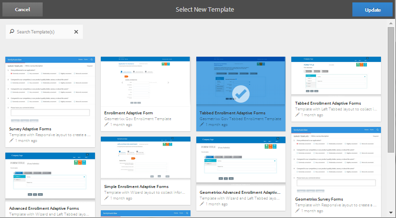

# DO NOT PUBLISH - Changing the template applied to an adaptive form{#do-not-publish-changing-the-template-applied-to-an-adaptive-form}

<!--
Comment Type: remark
Last Modified By: (vishgupt)
Last Modified Date: 2017-11-30T06:06:45.437-0500

This feature is removed from 6.2. Hence, pulling it down and removing references from other articles.

-->

<!--
Comment Type: remark
Last Modified By: (asgupta)
Last Modified Date: 2017-11-30T06:06:45.451-0500

Link to the template creation article and other relevant customization articles, ones those are available.

http://chl-author.corp.adobe.com/content/help/en/aem-forms/6/custom-adaptive-forms-templates.html  

-->

Changing an adaptive form’s template updates the appearances, the layout, and the design of the form. A change in the template does not impact the form data or the information present in the form.

1. Select an adaptive form and click Edit Template  in the toolbar.
1. On the Edit Template Wizard, select the new template. To search for the applicable template, use the search box and select from the search results.

   >[!NOTE]
   >
   >You can use text strings or strings with wildcards to search for available templates. To know more, see [Searching for forms and assets](../../../../6-5/forms/using/searching-forms-or-assets.md). The template search behaves similar to the asset search.

   

   Edit Template Wizard

1. After selecting the applicable template, click Update in upper right corner. If the change is successful, a success message is displayed. Optionally, you can open the adaptive form with newly applied template from this dialog.

The following form properties are updated with new values, when a new template is applied to an adaptive form:

* `cq:designPath`
* `sling:resourceSuperType`
* `sling:resourceType`
* `cq:template`

<!--
<related-links>
<a href="../../../../6-5/forms/using/introduction-aem-forms.md" target="_blank">Introduction to adaptive forms</a>
<a href="../../../../6-5/forms/using/creating-adaptive-form.md" target="_blank">Creating an adaptive form</a>
</related-links>
-->

