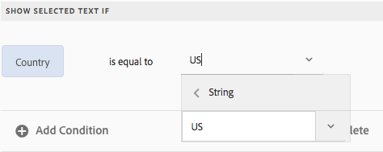

# [DO NOT PUBLISH] Implementing Interactive Communication{#do-not-publish-implementing-interactive-communication}

## Before you create an interactive communication {#before-you-create-an-interactive-communication}

### Anatomy of an interactive communication {#anatomy-of-an-interactive-communication}

### Form Data Model {#form-data-model}

#### Create sample data {#create-sample-data}

#### Associate an FDM instance with a data source {#associate-an-fdm-instance-with-a-data-source}

### Print and web channel templates {#print-and-web-channel-templates}

#### Theme in web channel {#theme-in-web-channel}

#### Using print as master for web channel {#using-print-as-master-for-web-channel}

#### Using sync functionality to keep print and web channels in sync {#using-sync-functionality-to-keep-print-and-web-channels-in-sync}

#### Adding adaptive form components to an interactive communication template {#adding-adaptive-form-components-to-an-interactive-communication-template}

### Document fragments {#document-fragments}

<!--
Comment Type: annotation
Last Modified By: gtalwar
Last Modified Date: 2018-02-14T12:13:32.560-0500
theme mandatory with web template - either the web template has a theme or while creating the IC you specify a theme
-->

#### Adding form data model elements in document fragments {#adding-form-data-model-elements-in-document-fragments}

Add Form Data Model (FDM) elements to the following document fragments in your interactive communication to supply recipient-specific data while creating instance of an interactive communication:

* [Text](/6-5/forms/using/text-interactive-communications.md) 
* [Condition](/6-5/forms/using/condition-interactive-communications.md)

For example, you can use a back end data source, such as Microsoft Dynamics, to insert FDM elements in your interactive communication and populate the following while creating the interactive communication's instance for a recipient:

* Customer name and address in a communication
* Due Amount in the credit card statement
* Premium due amount in an auto insurance renewal letter

To be able to add FDM elements in Text and Condition, you need to specify the FDM while creating a text or condition. The FDM needs to be the same for the document fragments and the interactive communication in which you intend to use the document fragments.

To insert FDM elements While creating or editing a text/condition, do the following:

* Specify the FDM while creating a [condition](/6-5/forms/using/condition-interactive-communications.md#createcondition)/ [text](/6-5/forms/using/text-interactive-communications.md#createtext). 

* Insert the FDM elements while editing or creating a condition/ [text](/6-5/forms/using/text-interactive-communications.md#fdm).

#### Using rules to make interactive communication contextual {#using-rules-to-make-interactive-communication-contextual}

 

You can use rules to make your interactive communications highly contextual. You can use rules to:

* Show/hide parts of text/content in a text document fragment
* Show/hide specific assets in a condition document fragment

Examples:

* In a credit card statement, display the credit card annual fee and credit card image based on the type of customer's credit card.
* In an insurance premium due reminder, display calculations of tax based on the customer's state's taxes.
* Display specific toll free numbers based on the country of the recipient.

#### Using repeat to render dynamic information {#using-repeat-to-render-dynamic-information}

#### Using lists to add patterns of components in interactive communications {#using-lists-to-add-patterns-of-components-in-interactive-communications}

#### Using mathematical expressions to create rules {#using-mathematical-expressions-to-create-rules}

### Upload the required images to your server {#upload-the-required-images-to-your-server}

## Create interactive communication {#create-interactive-communication}

### Create interactive communication {#create-interactive-communication-1}

<!--
Comment Type: annotation
Last Modified By: gtalwar
Last Modified Date: 2018-02-14T06:29:50.479-0500
post process aem forms workflow
-->

### Add content to web and print channel of interactive communication {#add-content-to-web-and-print-channel-of-interactive-communication}

#### Adding document fragments to interactive communication {#adding-document-fragments-to-interactive-communication}

#### Adding layout fragments to interactive communication template to render dynamic data in a table {#adding-layout-fragments-to-interactive-communication-template-to-render-dynamic-data-in-a-table}

#### Adding charts and graphs to the interactive communication {#adding-charts-and-graphs-to-the-interactive-communication}

#### Adding attachments to an interactive communication {#adding-attachments-to-an-interactive-communication}

### Preview web and print channels of interactive communication {#preview-web-and-print-channels-of-interactive-communication}

<!--
Comment Type: annotation
Last Modified By: gtalwar
Last Modified Date: 2018-02-14T06:36:34.496-0500
ad theme web template theme component theme (style layer) Edit > Style - then for a component you can edit the formatting properties
-->

## Create instance of interactive communication in Agent UI {#create-instance-of-interactive-communication-in-agent-ui}

### Make the required changes in the interactive communication instance {#make-the-required-changes-in-the-interactive-communication-instance}

### Submit interactive communication instance {#submit-interactive-communication-instance}

### Post processing {#post-processing}

## Target Integration {#target-integration}

<!--
Comment Type: annotation
Last Modified By: gtalwar
Last Modified Date: 2018-02-14T06:38:29.163-0500
talk to paras or anish
-->

<!--
Comment Type: annotation
Last Modified By: gtalwar
Last Modified Date: 2018-02-14T06:39:43.677-0500
talk to paras or anish for details
-->

## Sites Integration {#sites-integration}

<!--
Comment Type: annotation
Last Modified By: gtalwar
Last Modified Date: 2018-02-14T06:41:20.281-0500
check if there is existing documentation about this from AF
-->

