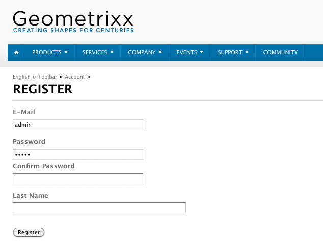
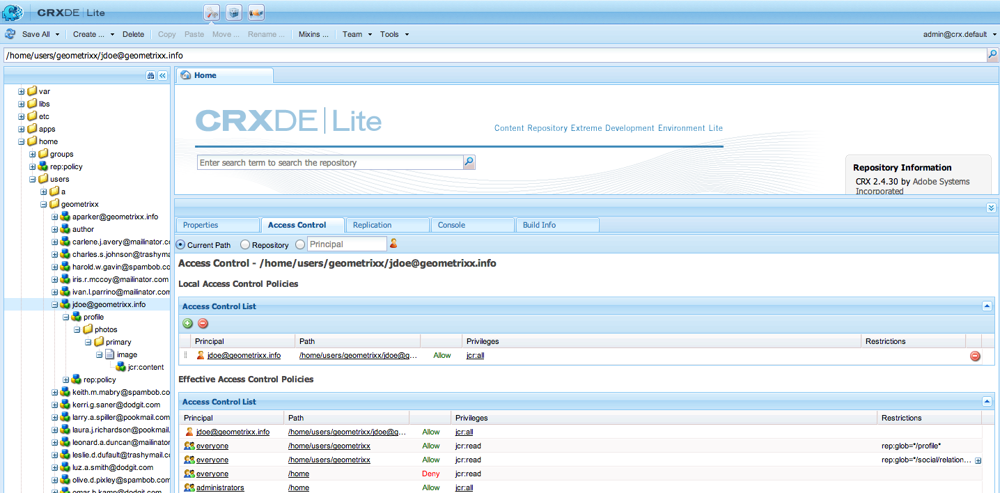

# Identity Management{#identity-management}

<!--
Comment Type: remark
Last Modified By: Alison Heimoz (aheimoz)
Last Modified Date: 2017-11-30T05:00:36.840-0500
<p>See <a href="http://bugzilla.day.com/bugzilla/show_bug.cgi?id=31331">#31331 - Clean up and re-design profile and account management</a> <br /> </p>
-->

Individual visitors to your website can only be identified when you provide the ability for them to log in. There are various reasons why you may want to provide a login capability:

* [AEM Communities  
  ](../../../../6-5/communities/using/overview.md)Site visitors are required to sign in to post content to the community.
* [Closed User Groups](../../../../6-5/sites/administering/using/cug.md)  
  You may need to limit access to your website (or sections of it) to specific visitors.

* [Personalization  
  ](/6-5/sites/administering/using/personalization.md) Allowing visitors to configure certains aspects of how they access your website.

Log in (and out) functionality is provided by an [account with a **Profile**](#profiles-and-user-accounts), which holds additional information about the registered visitor (user). The actual processes for registration and authorization may differ:

* Self-registration from the website  
  A [Community Site](../../../../6-5/communities/using/sites-console.md) may be configured to allow visitors to self-register or sign-in with their Facebook or Twitter accounts.  

* Request for registration from the website  
  For a closed user group you might allow visitors to request registration, but enforce authorization by means of a workflow.
* Register each account from the author environment  
  If you have a small number of profiles, which will need authorization anyway, you may decide to register each directly.

To allow visitors to register, a series of components and forms can be used to collect the required identification information, then the additional (often optional) profile information. After they have registered, they should also be able to check and update, the details that they have submitted.

Additional functionality can be configured or developed:

* Configure any reverse replication that is required.
* Allow a user to remove their profile, by developing a form together with a workflow.

>[!NOTE]
>
>The information specified in the profile can also be used to provide the user with targeted content via [Segments](../../../../6-5/sites/administering/using/campaign-segmentation.md) and [Campaigns](/6-5/sites/classic-ui-authoring/using/classic-personalization-campaigns.md).

## Registration Forms {#registration-forms}

A [form](/6-5/sites/authoring/using/default-components.md#formcomponent) can be used to collect the registration information, then generate the new account and profile.

For example, users can request a new profile, using the Geometrixx page  
`http://localhost:4502/content/geometrixx-outdoors/en/user/register.html`

 

<!--
Comment Type: remark
Last Modified By: Alison Heimoz (aheimoz)
Last Modified Date: 2017-11-30T05:00:36.969-0500
<p>foundation/components/account/actions/accountrequest</p>
-->

Upon submitting the request, the profile page opens where the user can provide personal details.

 

<!--
Comment Type: draft

<p>Submitting the request will take the user to a <strong>Thank You</strong> page, after which they will receive an email.<br /> </p>
-->

<!--
Comment Type: draft


-->

<!--
Comment Type: draft

<p>The email contains a link to the page for confirming the request by registering details for the new profile; for example, using the Geometrixx page<br /> <span class="code">http://localhost:4502/content/geometrixx/en/toolbar/account/register.html</span><br /> </p>
-->

<!--
Comment Type: draft


-->

<!--
Comment Type: draft

<p>Completion of the registration will be confirmed:<br /> </p>
-->

<!--
Comment Type: draft


-->

The new account is also visible in the [Users console](../../../../6-5/sites/administering/using/security.md).

<!--
Comment Type: remark
Last Modified By: Alison Heimoz (aheimoz)
Last Modified Date: 2017-11-30T05:00:37.158-0500
<p>foundation/components/account/actions/update</p>
-->

<!--
Comment Type: remark
Last Modified By: Alison Heimoz (aheimoz)
Last Modified Date: 2017-11-30T05:00:37.171-0500
<p>need information about sending an email when the registration is complete.</p>
-->

<!--
Comment Type: remark
Last Modified By: Alison Heimoz (aheimoz)
Last Modified Date: 2017-11-30T05:00:37.185-0500
<p>check purpose of hidden field on</p>
<p> http://localhost:4502/cf#/content/geometrixx/en/toolbar/account/register.html<br /> </p>
-->

## Login {#login}

The login component can be used to collect the login information, then activate the login process.

This provides the visitor with the standard fields of **Username** and **Password**, with a **Login** button to activate the login process when the credentials are entered.

<!--
Comment Type: remark
Last Modified By: Alison Heimoz (aheimoz)
Last Modified Date: 2017-11-30T05:00:37.246-0500
<p>need information about the actual mechanics.....or links to the info.<br /> </p>
-->

For example, users can either log in, or create a new account, using the **Sign In** option on the Geometrixx toolbar, which uses the page:

`http://localhost:4502/content/geometrixx-outdoors/en/user/sign-in.html`

 

## Logging Out {#logging-out}

As there is a login mechanism, a logout mechanism is also required. This is available as the **Sign Out** option in Geometrixx.

## Viewing and Updating a Profile {#viewing-and-updating-a-profile}

Depending on your registration form the visitor may have registered information in their profile. They should be able to view and/or update this at a later stage. This can be done with a similar form; for example, in Geometrixx:

```
http://localhost:4502/content/geometrixx-outdoors/en/user/profile.html

```

To see the details of your profile click on **My Profile** in the top right corner of any page; for example with the `admin` account:  
`http://localhost:4502/home/users/a/admin/profile.form.html/content/geometrixx-outdoors/en/user/profile.html.`

You can view another profile using the [client context](../../../../6-5/sites/administering/using/client-context.md) (on the author environment and with sufficient privileges):

1. Open a page; for example the Geometrixx page:  
   `http://localhost:4502/cf#/content/geometrixx/en.html`
1. Click **My Profile** in the top right corner. You will see the profile of your current account; for example the administrator.
1. Press **control-alt-C** to open the client context.
1. In top left corner of the client context, click the **Load a Profile** button.

   

1. Select another profile from the drop down list in the dialog window; for example, **Alison Parker**.
1. Click **OK**.
1. Click again on **My Profile**. The form will be updated with Alison's details.

   

1. You can now use **Edit Profile** or **Change Password** to update the details.

## Adding Fields to the Profile Definition {#adding-fields-to-the-profile-definition}

You can add fields to the profile definition. For example to add a "Favorite Color" field to the Geometrixx profile:

1. From the Websites console navigate to Geometrixx Outdoors Site &gt; English &gt; User &gt;My Profile.  

1. Double-click on the **My Profile** page to open it for editing.  

1. In the **Components** tab of sidekick expand the **Form** section.  

1. Drag a **Dropdown List** from sidekick to the form, just below the **About me** field.  

1. Double-click the **Dropdown List** component to open the dialog for configuration and enter:

    * **Element Name** - `favoriteColor`
    
    * **Title** - `Favorite Color`
    
    * **Items** - Add several colors as items

   Click **OK** to save.

1. Close the page and return to the **Websites** console and activate the My Profile page.

   Next time you view a profile you can select a favorite color:

   

   The field will be saved under the **profile** section of the relevant user account:

   

## Profile States {#profile-states}

<!--
Comment Type: remark
Last Modified By: Alison Heimoz (aheimoz)
Last Modified Date: 2017-11-30T05:00:38.152-0500
<p>http://bugs.day.com/bugzilla/show_bug.cgi?id=30345</p>
-->

There are a number of use cases that require knowing whether a user (or rather their profile) is in a *specific state* or not.

This involves defining an appropriate property in the user profile in a way that:

* is visible and accessible to the user
* defines two states for each property
* allows toggling between the two states defined

This is done with:

* [State Providers](#state-providers)  
  To manage the two states of a specific property and the transitions between the two.  

* [Workflows](#workflows)  
  To manage actions related to the states.

Multiple states can be defined; for example in Geometrixx these include:

* subscribing (or unsubscribing) to notifications on newsletters or comment threads  
* adding and removing a connection to a friend

### State Providers {#state-providers}

A state provider manages the current state of the property in question, together with the transitions between the two possible states.

State providers are implemented as components, so can be customized for your project. In Geometrixx these include:

* Un-/Subscribe Forum Topic
* Add/Remove Friend

### Workflows {#workflows}

State providers manage a profile property and its states.

A workflow is needed to implement the actions related to the states. For example, when subscribing for notifications, the workflow will handle the actual subscription action; when unsubscribing from notifications, the workflow will handle removing the user from the subscription list.

## Profiles and User Accounts {#profiles-and-user-accounts}

<!--
Comment Type: remark
Last Modified By: unknown unknown (remove-legacyref-6-1)
Last Modified Date: 2017-11-30T05:00:38.275-0500
<p>Remark jhoh@adobe.com</p>
<p><br _rte_temp_br="brEOB" /> This section needs to be changed for CQ 5.5 and also for 5.6:</p>
<ul>
<li>the problem only applies for users defined in /home/users/geometrixx</li>
<li>because there the mentioned rep:policy with wildcard setting is set.</li>
<li>Other users not below /home/users/geometrixx are not affected.</li>
</ul>
<p>Therefor the easiest way to get rid of this problem is to remove /home/users/geometrixx, which is a good thing anyway for any production environment!<br /> </p>
-->

Profiles are stored in the Content Repository as part of the the [user account](/6-5/sites/administering/using/security-landing.md#usersandgroupsinaem).

The profile can be found under `/home/users/geometrixx`:


On a standard installation (author or publish) everyone has read access to the entire profile information of all users. everyone is a "*Built-in group automatically containing all existing users and groups. The list of members cannot be edited*".

These access rights are defined by the following wildcard ACL:

/home everyone allow jcr:read rep:glob = &#42;/profile&#42;

That allows:

* forum, comments or blog posts to display information (such as icon or full name) from the appropriate profile
* links to geometrixx profile pages

If such access is not appropriate for your installation you can change these default settings.

This can be done using the ** [Access Control](../../../../6-5/sites/administering/using/user-group-ac-admin.md#access-right-management)** tab:

 

<!--
Comment Type: draft

<p>variant 2)<br /> in CRX: create a single access control entry on the first common ancestor node granting permissions to the group you wish to have access to all the profile nodes and in addition edit the restriction to limit the effect of that additional read permission to the profile node and all child items.</p>
<p> </p>
<p>Minimal instructions how to use the wildcard acl (and any other access control list containing restrictions):<br /> <br /> - ac editing on jcr repository level is only possible in CRX repository management (neither in CQ nor in CRXDE)<br /> <br /> - open access control editor and select a node (or in case of principalbased ac also a principal) on which you wish to edit the permissions.<br /> <br /> - edit the access control content:<br /> &gt; select an access control policy to be applied at the selected node<br /> &gt; or edit an existing policy at that node<br /> <br /> - if the access control policy is an access control list you will be allowed to add/remove/reorder entries.<br /> <br /> - if the ACL is the jackrabbit extension of the jcr interface it may allow to additionally specify restrictions for every single access control entry that limit the effect in an implementation specific way.<br /> <br /> - the possible restrictions are listed in the right column with it's name and an form field suitable for the required restriction type.<br /> <br /> - in case of the resource-based AC configured by default this is a single, optional restriction named "rep:glob", which requires a string value.<br /> <br /> - the rep:glob string value is a path or path-fragment that may contain wildcard character(s) in order to limit the effect of the ACE to a subset of items in the subtree of the selected node.<br /> <br /> - for examples please see javadoc of org.apache.jackrabbit.core.security.authorization.GlobPattern<br /> <br /> - the related jackrabbit API calls are<br /> JackrabbitAccessControlList#getRestrictionNames()<br /> JackrabbitAccessControlList#getRestrictionType(String)<br /> JackrabbitAccessControlList#addEntry(<br /> Principal, Privilege[], boolean, Map&lt;String, Value&gt;)<br /> <br /> JackrabbitAccessControlEntry#getRestrictionNames()<br /> JackrabbitAccessControlEntry#getRestriction(String)</p>
-->

## Profile Components {#profile-components}

A range of profile components are also available for defining the profile requirements for your site.

### Checked Password Field {#checked-password-field}

This component gives you two fields for:

* the input of a password
* a check to confirm that the password has been input correctly.

With default settings the component will appear as follows:

 

### Profile Avatar Photo {#profile-avatar-photo}

This component provides the user with a mechanism for selecting and uploading an Avatar Photo file.

 

### Profile Detailed Name {#profile-detailed-name}

This component allows the user to input a detailed name.

 

### Profile Gender {#profile-gender}

This component allows the user to input their gender.


