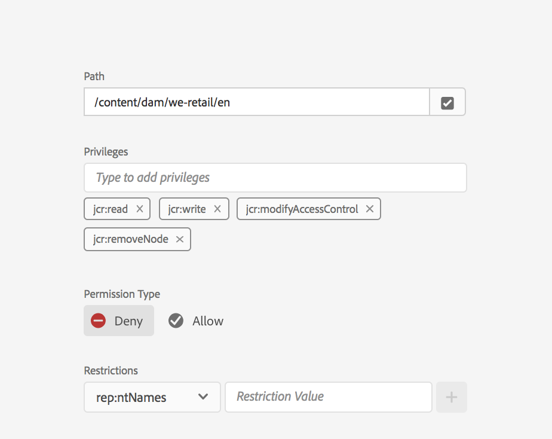

# Principal View for Permissions Management{#principal-view-for-permissions-management}

## Overview {#overview}

AEM 6.5 introduces Permissions Management for Users and Groups. The main functionality remains the same as the classic UI, but is more user friendly and efficient.

## How to Use {#how-to-use}

### Accessing the UI {#accessing-the-ui}

The new UI based permissions management is accessed through the Permissions card under Security as shown below:

The new view makes it easier to look at the whole set of privileges and restrictions for a given principal at all paths where Permissions have been granted explicitly. This removes the need to go to

CRXDE to manage advanced privileges and restrictions. It has been consolidated in the same view. The view defaults to the Group "everyone".

There is a filter that allows the user to select the type of principals to look at **Users**, **Groups**, or **All **and search for any principal**.**

### Viewing Permissions for a Principal {#viewing-permissions-for-a-principal}

The frame on the left allows users to scroll down to find any principal or search for a Group or a User based on the selected filter, as shown below:

Clicking on the name shows the assigned permissions on the right. The permissions pane shows the the list of Access Control Entries on specific paths along with configured restrictions.

### Adding new Access Control Entry for a Principal {#adding-new-access-control-entry-for-a-principal}

New permissions can be added by adding a new Access Controlling Entry by clicking the Add ACE button.

This brings up the window shown below, the next step is to choose a path where the permission needs to be configured.

Here we select a path where we want to configure a permission for **dam-users**:

After the path is selected, the workflow goes back to this screen, where the user can then select one or more of the privileges from the available namespaces (like `jcr`, `rep` or `crx`) as shown i below.

Privileges can be added by searching using the text field and then selecting from the list.

>[!NOTE]
>
>For a complete list of privileges and descriptions, please see [this page](../../../../6-5/sites/administering/using/user-group-ac-admin.md#access-right-management).

 

After the list of privileges has been selected, the user can choose the Permission Type : Deny or Allow, as shown below.

 

### Using Restrictions {#using-restrictions}

In addition to list of privileges and the Permission Type on a given path, this screen also allows to add restrictions for fine grained access control as shown below:

>[!NOTE]
>
>For more information on what each restriction means, please consult [this page](../../../../6-5/sites/administering/using/user-group-ac-admin.md#restrictions).

Restrictions can be added as shown below by choosing the restriction type, entering the value and hitting the **+** icon.  

The new ACE is reflected in the Access Control List as shown below. Note that `jcr:write` is an aggregate privilege that includes `jcr:removeNode` that was added above, but is not shown below as its covered under `jcr:write`.

### Editing ACEs {#editing-aces}

Access Control Entries can be edited by selecting a principal and choosing the ACE that you want to edit.

For example here we can edit the below entry for **dam-users** by clicking the pencil icon on the right:

The edit screen is shown with configured ACEs preselected, these can be deleted by clicking the cross icon next to them or new privileges can be added for the given path, as shown below.

Here we are adding the `addChildNodes` privilege for **dam-users** on the given path.

Changes can be saved by clicking the **Save** button on top right, and the changes will reflect in the new permissions for **dam-users **as shown below:

### Deleting ACEs {#deleting-aces}

Access Control Entries can be deleted to remove all permissions given to a principal on a specific path. The X icon on next to ACE can be used to delete it as shown below:

 

### Classic UI Privilege Combinations {#classic-ui-privilege-combinations}

Note that the new permissions UI explicitly uses the basic set of privileges instead of predefined combinations that did not truly reflect exact underlying privileges that were granted.

It caused confusion as to what exactly is being configured. The following table lists the mapping between the privilege combinations from the Classic UI to the actual privileges that constitute them:

| 
|

<table border="1" cellpadding="1" cellspacing="0" width="100%"> 
 <tbody>
  <tr>
   <th>Classic UI Privilege Combinations</th> 
   <th>Permissions UI Privilege</th> 
  </tr>
  <tr>
   <td>Read</td> 
   <td>jcr:read</td> 
  </tr>
  <tr>
   <td>Modify</td> 
   <td>
jcr:modifyProperties
 
jcr:lockManagement
 
jcr:versionManagement
 </td> 
  </tr>
  <tr>
   <td>Create</td> 
   <td>
jcr:addChildNodes
 
jcr:nodeTypeManagement
 </td> 
  </tr>
  <tr>
   <td>Delete</td> 
   <td>
jcr:removeNode
 
jcr:removeChildNodes
 </td> 
  </tr>
  <tr>
   <td>Read ACL</td> 
   <td>jcr:readAccessControl</td> 
  </tr>
  <tr>
   <td>Edit ACL</td> 
   <td>jcr:modifyAccessControl</td> 
  </tr>
  <tr>
   <td>Replicate</td> 
   <td>crx:replicate</td> 
  </tr>
 </tbody>
</table>

