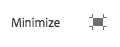

# Use Rich Text Editor to author content{#use-rich-text-editor-to-author-content}

The Rich Text Editor (RTE) is a basic building block for inserting textual content into AEM. It forms the basis of various components, including:

* Text
* Text Image
* Table

>[!NOTE]
>
>Copying nested lists into the RTE does not work as expected. When copying nested lists from Microsoft Word, you will need to manually clean up the lists after pasting the text in the RTE.

## In-Place Editing {#in-place-editing}

Selecting a text-based component with a single tap or click will reveal the [component toolbar](../../../../6-5/sites/authoring/using/editing-content.md#editmovecopypastedeletetouchoptimizedui) as with any component.

Tapping/clicking agin or initially selecting the component with a slow double-tap/click will open in-place editing, which has its own toolbar. Here you can edit the content and make basic formatting changes.

This toolbar provides the following options:

* **Format** 
  This allows you to set Bold, Italic and Underline.

* **Lists** 
  With this you can create bulleted or numbered lists, or set the indentation.

* **Hyperlink**
* **Unlink**
* **Fullscreen** 

* **Close**
* **Save**

## Full-Screen Editing {#full-screen-editing}

For text-based components, selecting the full screen mode from the [toolbar](#componenttoolbar) will open the rich text editor and hide the rest of the page content.

Fullscreen mode will show all options of your rich text editor, which can vary [depending on the configuration](../../../../6-5/sites/administering/using/rich-text-editor.md).

Additional rich text editor options include:

* **Anchor** 
  Create an anchor in the text that you can later link to/reference.

* **Align Text Left**
* **Cetner Text**
* **Align Text Right**

Close fullscreen mode by clicking the minimize icon.

<!--
<related-links>
<a href="../../../../6-5/sites/administering/using/rich-text-editor.md">Configure Rich Text Editor</a>
<a href="/6-5/sites/administering/using/rte-accessible-content.md">Configure RTE to produce accessible sites</a>
</related-links>
-->

