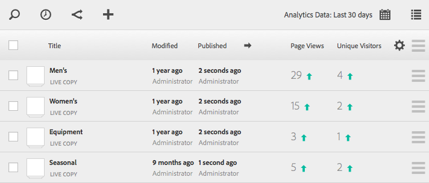

# Seeing Page Analytics Data{#seeing-page-analytics-data}

Use page analytics data to gauge the effectiveness of their page content.

Page analytics data is displayed in the Sites console. When sites are displayed in list format, the following columns are available by default:

* Page Views
* Unique Visitors
* Time on Page

>[!NOTE]
>
>Displaying site analytics data diretly in the console is only available in the touch-optimized UI. See [Seeing Page Analytics Data](../../../../6-5/sites/authoring/using/page-analytics-using.md) in the standard authoring documentation for details.

