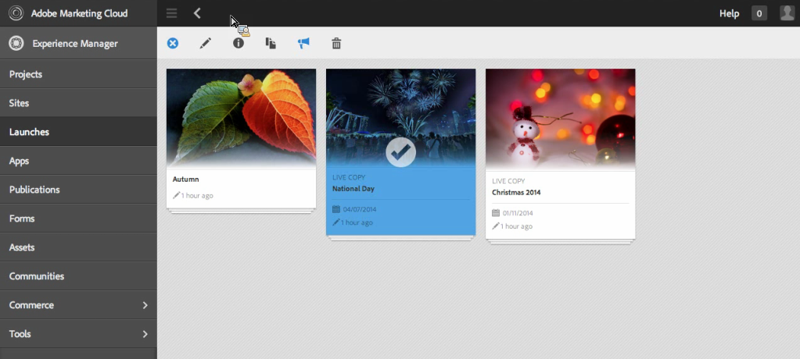
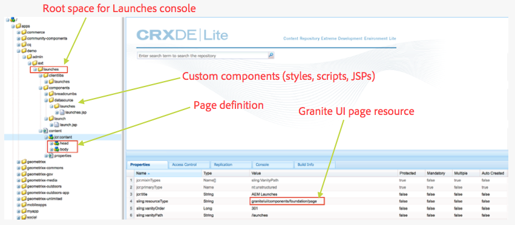
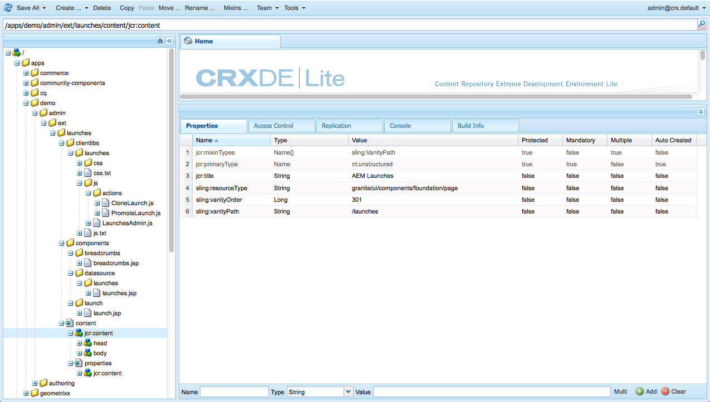
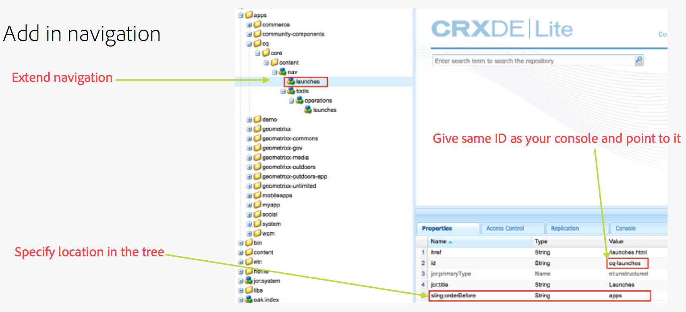
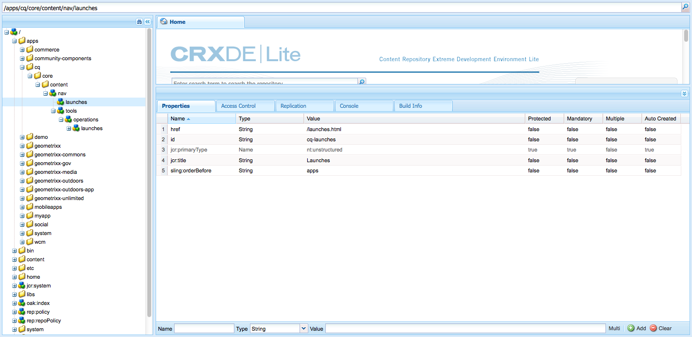

# Customizing the Consoles{#customizing-the-consoles}

<!--
Comment Type: remark
Last Modified By: Alison Heimoz (aheimoz)
Last Modified Date: 2018-01-18T11:19:42.686-0500
<p>following paragraph also occurs on <a href="http://ec2author.day.com:8080/content/docs/en/aem/6-2/develop/extending/customizing-page-authoring-touch.html">http://ec2author.day.com:8080/content/docs/en/aem/6-2/develop/extending/customizing-page-authoring-touch.html</a> - update one update both</p>
<p>gknob: why not a paragraph reference?</p>
<p>ajh&gt;&gt;&gt; because we decided not to use them in docu.....long story</p>
-->

>[!CAUTION]
>
>This document describes how to customize consoles in the modern, touch-enabled UI and does not apply to the classic UI.

AEM provides various mechanisms to enable you to customize the consoles (and the [page authoring functionality](/6-5/sites/developing/using/customizing-page-authoring-touch.md)) of your authoring instance.

* Clientlibs  
  Clientlibs allow you to extend the default implementation to realize new functionality, while reusing the standard functions, objects, and methods. When customizing, you can create your own clientlib under `/apps.` For example it can hold the code required for your custom component.  

* Overlays  
  Overlays are based on node definitions and allow you to overlay the standard functionality (in `/libs`) with your own customized functionality (in `/apps`). When creating an overlay a 1:1 copy of the original is not required, as the sling resource merger allows for inheritance.

These can be used in many ways to extend your AEM consoles. A small selection are covered below (at a high level).

<!--
Comment Type: remark
Last Modified By: Alison Heimoz (aheimoz)
Last Modified Date: 2018-01-18T11:19:42.787-0500
<p>Title of Gems session is version specific - need to check/revisit/reword for 6.1.<br /> </p>
-->

>[!NOTE]
>
>For further information see:
>
>* Using and creating [clientlibs](../../../../6-5/sites/developing/using/clientlibs.md).
>* Using and creating [overlays](/6-5/sites/developing/using/overlays.md).
>* [Granite](/6-5/sites/developing/using/reference-materials/granite-ui/api/index.md) 
>
>This topic is also covered in the [AEM Gems](http://docs.adobe.com/content/ddc/en/gems.html) session - [User interface customization for AEM 6.0](http://docs.adobe.com/content/ddc/en/gems/user-interface-customization-for-aem-6.html).

>[!CAUTION]
>
>You ***must*** not change anything in the `/libs` path.
>
>This is because the content of `/libs` is overwritten the next time you upgrade your instance (and may well be overwritten when you apply either a hotfix or feature pack).
>
>The recommended method for configuration and other changes is:
>
>1. Recreate the required item (i.e. as it exists in `/libs`) under `/apps`  
>
>1. Make any changes within `/apps`
>

For example, the following location within the `/libs` structure can be overlaid:

* consoles (any consoles based on Granite UI pages); for example:

    * `/libs/wcm/core/content`

<!--
Comment Type: draft

<p>For example, the following locations within the <span class="code">/libs</span> structure can be overlaid:</p>
<ul>
<li>consoles (any consoles based on Granite UI pages); for example:<br />
<ul>
<li><span class="code">/libs/wcm/core/content</span></li>
</ul> </li>
<li>secondary (inner) rails; for example:
<ul>
<li><span class="code">/libs/wcm/core/content/search</span></li>
</ul> </li>
<li>toolbar(s) (dependent on console; for example sites):<br />
<ul>
<li>default<br /> <span class="code">/libs/wcm/core/content/sites/jcr:content/body/content/header/items/default</span></li>
<li>selection mode<br /> <span class="code">/libs/wcm/core/content/sites/jcr:content/body/content/header/items/selection</span></li>
</ul> </li>
<li>help menu options (dependent on console; for example sites):
<ul>
<li><span class="code">/libs/wcm/core/content/sites/jcr:content/body/help</span></li>
</ul> </li>
<li>information shown on the card view (dependent on console; for example sites):
<ul>
<li><span class="code">/libs/wcm/core/content/sites/jcr:content/body/content/content/items/childpages</span></li>
</ul> </li>
</ul>
-->

>[!NOTE]
>
>See the Knowledge Base article, [Troubleshooting AEM TouchUI issues](/kb/troubleshooting-aem-touchui-issues.md), for further tips and tools.

<!--
Comment Type: draft

<h3>Code Samples</h3>
-->

<!--
Comment Type: draft

<p>Various packages have been made available on Github. These provide code samples related to the tasks covered on this page.<br /> </p>
-->

<!--
Comment Type: draft

<h4>aem-admin-extension-new-console</h4>
-->

<!--
Comment Type: draft

<p><span class="code">aem-admin-extension-new-console</span> is a sample package showing how to <a href="#create-a-custom-console">create a new AEM 6 console</a>. This package provides a UI for managing <a href="../../../../6-5/sites/authoring/using/launches.md">Launches</a> and adds a link in the navigation:</p>
-->

<!--
Comment Type: draft

<p>CODE ON GITHUB</p>
<p>You can find the code of this page on GitHub</p>
<ul>
<li><a href="https://github.com/Adobe-Marketing-Cloud/aem-admin-extension-new-console">Open aem-admin-extension-new-console project on GitHub</a></li>
<li>Download the project as <a href="https://github.com/Adobe-Marketing-Cloud/aem-admin-extension-new-console/archive/master.zip">a ZIP file</a></li>
</ul>
-->

<!--
Comment Type: draft

<h4>aem-admin-extension-customize-sites</h4>
-->

<!--
Comment Type: draft

<p><span class="code">aem-admin-extension-customize-sites</span> is a sample package showing how to customize an existing AEM 6 admin console. This package provides updates to Sites administration:</p>
-->

<!--
Comment Type: draft

<p>CODE ON GITHUB</p>
<p>You can find the code of this page on GitHub</p>
<ul>
<li><a href="https://github.com/Adobe-Marketing-Cloud/aem-admin-extension-customize-sites">Open aem-admin-extension-customize-sites project on GitHub</a></li>
<li>Download the project as <a href="https://github.com/Adobe-Marketing-Cloud/aem-admin-extension-customize-sites/archive/master.zip">a ZIP file</a></li>
</ul>
-->

<!--
Comment Type: draft

<h3>Create a Custom Console</h3>
-->

<!--
Comment Type: remark
Last Modified By: Alison Heimoz (aheimoz)
Last Modified Date: 2018-01-18T11:19:43.127-0500
<p>6.2 Review - is this still a good example?</p>
-->

<!--
Comment Type: draft

<ol>
<li><p>You can create a custom console with related actions; for example, Launches at the top level (below Sites).</p>
<draft-comment type="draft">

</draft-comment><p>This involves:</p>
<ul>
<li>creating the root space definition of your new console<span class="code"></span>; for example:
<ul>
<li><span class="code">/apps/&lt;<i>yourProject</i>&gt;/admin/ext/launches</span></li>
</ul> </li>
<li>this can contain (according to requirements):<br />
<ul>
<li>the corresponding <a href="../../../../6-5/sites/developing/using/clientlibs.md">clientlibs</a> for custom actions and <span class="code">less</span>/<span class="code">css</span> definitions
<ul>
<li><span class="code">/apps/&lt;<i>yourProject</i>&gt;/admin/ext/launches/clientlibs</span></li>
</ul> </li>
<li>components that need to be redefined/adjusted; for example, the breadcrumbs, datasource and the launch
<ul>
<li><span class="code">/apps/&lt;<i>yourProject</i>&gt;/admin/ext/launches/components</span></li>
</ul> </li>
<li>the Granite UI page resource:
<ul>
<li><span class="code">/apps/&lt;<i>yourProject</i>&gt;/admin/ext/launches/content/jcr:content</span><br /> property: <span class="code">sling:resourceType</span></li>
</ul> </li>
<li>the page definition of the console
<ul>
<li><span class="code">/apps/&lt;<i>yourProject</i>&gt;/admin/ext/launches/content/jcr:content/head</span></li>
<li><span class="code">/apps/&lt;<i>yourProject</i>&gt;/admin/ext/launches/content/jcr:content/body</span></li>
</ul> </li>
</ul> </li>
</ul>
<draft-comment type="draft">

</draft-comment><p>To use the new console (for example in the <a href="#add-new-navigation-option-to-rail">rail for navigation</a>) an ID is used, so that it can be explicitly referenced. The ID is used to connect the console and its navigation definition. The ID is defined in the <span class="code">rail</span> node of the page; for example, for the Sites console: </p>
<ul>
<li>the rail node is:<br /> <span class="code">/libs/wcm/core/content/sites/jcr:content/body/rail</span>
<ul>
<li>here the <span class="code">currentId</span> property is defined:<br /> <span class="code">currentId</span> = <span class="code">cq-sites</span></li>
</ul> </li>
</ul> <p>For the Launches console example:</p>
<ul>
<li>the node is:
<ul>
<li><span class="code">/apps/&lt;<i>yourProject</i>&gt;/admin/ext/launches/content/jcr:content/body/rail </span></li>
</ul> </li>
<li>with the following properties:
<ul>
<li><span class="code">currentId</span> = <span class="code">cq-launches</span></li>
<li><span class="code">sling:resourceType</span> = <span class="code">granite/ui/components/endor/navcolumns</span></li>
<li><span class="code">srcPath</span> = <span class="code">cq/core/content/nav</span></li>
</ul> </li>
</ul> </li>
</ol>
-->

### Customizing the Default View for a Console {#customizing-the-default-view-for-a-console}

You can customize the default view (column, card, list) for a console:

1. You can reorder the views by overlaying the required entry from under:

   `/libs/wcm/core/content/sites/jcr:content/views`

   The first entry will be the default.

   The nodes available correlate to the view options available:

    * `column`
    * `card`
    * `list`

1. For example, in a overlay for list:

   `/apps/wcm/core/content/sites/jcr:content/views/list`

   Define the following property:

    * **Name**: `sling:orderBefore`
    
    * **Type**: `String`  
    
    * **Value**: `column`

<!--
Comment Type: draft

<p><span class="code">aem-admin-extension-customize-sites</span> is a sample package showing how to customize an existing AEM 6 admin console. This package provides updates to Sites administration:</p>
-->

<!--
Comment Type: draft

<p>CODE ON GITHUB</p>
<p>You can find the code of this page on GitHub</p>
<ul>
<li><a href="https://github.com/Adobe-Marketing-Cloud/aem-admin-extension-customize-sites">Open aem-admin-extension-customize-sites project on GitHub</a></li>
<li>Download the project as <a href="https://github.com/Adobe-Marketing-Cloud/aem-admin-extension-customize-sites/archive/master.zip">a ZIP file</a></li>
</ul>
-->

<!--
Comment Type: draft

<h3>Add New Navigation Option to Rail</h3>
-->

<!--
Comment Type: draft

<ol>
<li><p>You can add a navigation entry in the rail (for example, a <a href="#create-a-custom-console">custom console</a> such as Launches). </p> <p>To do this, you create an overlay of:</p> <p style="margin-left: 40px;"><span class="code">/libs/cq/core/content/nav</span></p> <p>In the <span class="code">/apps</span> overlay:</p> <p style="margin-left: 40px;"><span class="code">/apps/cq/core/content/nav</span></p> <p>Create the new nodes and properties: <br /> </p>
<draft-comment type="draft">

</draft-comment>
<ul>
<li>Extend navigation:
<ul>
<li><span class="code">/apps/cq/core/content/nav/launches</span></li>
</ul> </li>
<li>Specify location in the tree:
<ul>
<li>property: <span class="code">sling:orderBefore</span></li>
</ul> </li>
<li>To create the connection, the <span class="code">id</span> property references (i.e. must be the same as) the <span class="code">currentID</span> property <a href="#create-a-custom-console">for the appropriate console</a>:
<ul>
<li>property: <span class="code">id</span></li>
<li>value: same as for your console (e.g. <span class="code">cq-launches</span>)<br /> for example: the same value as the <span class="code">currentId</span> property on:<br /> <span class="code">/apps/&lt;<i>yourProject</i>&gt;/admin/ext/launches/content/jcr:content/body/rail</span><br /> <span class="code"></span></li>
</ul> </li>
</ul> </li>
</ol>
-->

### Add New Action to the Toolbar {#add-new-action-to-the-toolbar}

1. You can build your own components and include the corresponding client libraries for custom actions. For example, a **Promote to Twitter** action at:

   `/apps/wcm/core/clientlibs/sites/js/twitter.js`

   This can then be connected to a toolbar item on your console:

   `/apps/<*yourProject*>/admin/ext/launches`

   For example, in selection mode:

   `content/jcr:content/body/content/header/items/selection/items/twitter`

### Restrict a Toolbar Action to a specific Group {#restrict-a-toolbar-action-to-a-specific-group}

1. You can use a custom rendering condition to overlay the standard action and impose specific conditions that must be fulfilled before it is rendered.

   For example, create a component to control the renderconditions according to group:

   `/apps/myapp/components/renderconditions/group`

1. To apply these to the Create Site action on the Sites console:

   `/libs/wcm/core/content/sites`

   Create the overlay:

   `/apps/wcm/core/content/sites`

1. Then add the rendercondition for the action:

   `jcr:content/body/content/header/items/default/items/create/items/createsite/rendercondition`

   Using properties on this node you can define the `groups` allowed to perform the specific action; for example, `administrators`

<!--
Comment Type: draft

<h3>Renaming a Rail Entry</h3>
-->

<!--
Comment Type: draft

<ol>
<li><p>You can rename a navigation entry in the rail by overriding:</p> <p style="margin-left: 40px;"><span class="code">/libs/cq/core/content/nav/sites/jcr:title</span></p> </li>
<li><p>Depending on how you want to configure your instance, you might want to consider the impact on:</p>
<ul>
<li>The title as used in the toolbar:<br /> <span class="code">/libs/wcm/core/content/sites/jcr:content/body/title/rootTitle</span></li>
<li>The tab title in the window:<br /> <span class="code">/libs/wcm/core/content/sites/jcr:content/jcr:title</span></li>
<li>The entry in the breadcrumbs<br /> <span class="code">/libs/wcm/core/content/sites/jcr:content/body/breadcrumbs/rootTitle</span> </li>
</ul>
<draft-comment color="blue" lastmodifiedby="gknob@adobe.com" lastmodifieddate="2018-01-18T11:19:44.506-0500" prevfirstname="unknown" prevlastname="unknown" type="remark">
<p>Also found this entry - where/how is it used?</p>
<p>/libs/cq/gui/content/common/links/sites/jcr:title - ??? seems to be a left-over</p>
<p>gknob: yes, this one can be ignored.</p>
</draft-comment></li>
</ol>
-->

<!--
Comment Type: draft

<h3>Remove Access to Navigation Option on Rail</h3>
-->

<!--
Comment Type: draft

<ol>
<li><p>You can rename a navigation entry in the rail by overlaying the required entry from under:</p> <p style="margin-left: 40px;"><span class="code">/libs/cq/core/content/nav</span></p> <p>The nodes available correlate to the navigation options in the rail:</p>
<ul>
<li><span class="code">projects</span></li>
<li><span class="code">sites</span></li>
<li><code class="code">assets
<discoiqbr /> </code></li>
<li><span class="code">apps</span></li>
<li><span class="code">forms</span></li>
<li><span class="code">screens</span></li>
<li><span class="code">personalization</span></li>
<li><span class="code">commerce</span></li>
<li><span class="code">tools</span></li>
<li><code class="code">communities
<discoiqbr /> </code></li>
</ul> </li>
<li><p>For example, on a overlay at:</p> <p style="margin-left: 40px;"><span class="code">/apps/cq/core/content/nav/sites</span></p> <p>Define the following property:</p>
<ul>
<li><strong>Name</strong>: <span class="code">sling:hideResource</span></li>
<li><strong>Type</strong>: <span class="code">String</span><br /> </li>
<li><strong>Value</strong>: <span class="code">true</span></li>
</ul> </li>
</ol>
-->

<!--
Comment Type: draft

<p><span class="code">aem-admin-extension-customize-sites</span> is a sample package showing how to customize an existing AEM 6 admin console. This package provides updates to Sites administration:</p>
-->

<!--
Comment Type: draft

<p>CODE ON GITHUB</p>
<p>You can find the code of this page on GitHub</p>
<ul>
<li><a href="https://github.com/Adobe-Marketing-Cloud/aem-admin-extension-new-console">Open aem-admin-extension-new-console project on GitHub</a></li>
<li>Download the project as <a href="https://github.com/Adobe-Marketing-Cloud/aem-admin-extension-new-console/archive/master.zip">a ZIP file</a></li>
</ul>
-->

<!--
Comment Type: draft

<h3>Restrict Access to Navigation Option on Rail</h3>
-->

<!--
Comment Type: draft

<p>You can restrict access to a navigation option using ACLs:<br /> </p>
-->

<!--
Comment Type: draft

<ol>
<li><p>Open the <a href="../../../../6-5/sites/administering/using/security.md">user and/or group management</a> and select the user/group you want to restrict access for.<br /> </p>
<note type="note">
<p>Avoid assigning/restricting permissions on a user-by-user basis. It is <a href="../../../../6-5/sites/administering/using/security.md#best-practices">recommended to use groups</a>.</p>
</note></li>
<li><p>Remove access <a href="../../../../6-5/sites/administering/using/security.md#permissions">permissions</a> to the appropriate node(s) under <span class="code">/libs/cq/core/content/nav/sites</span>. These correlate to the navigation options in the rail:</p>
<ul>
<li><span class="code">projects</span></li>
<li><span class="code">sites</span></li>
<li><code class="code">assets
<discoiqbr /> </code></li>
<li><span class="code">apps</span></li>
<li><span class="code">forms</span></li>
<li><span class="code">screens</span></li>
<li><span class="code">personalization</span></li>
<li><span class="code">commerce</span></li>
<li><span class="code">tools</span></li>
<li><code class="code">communities
<discoiqbr /> </code></li>
</ul> </li>
</ol>
-->

### Customizing Columns in the List View {#customizing-columns-in-the-list-view}

>[!NOTE]
>
>This feature is optimized for columns of text fields; for other data types it is possible to overlay `cq/gui/components/siteadmin/admin/listview/columns/analyticscolumnrenderer` in `/apps`.

<!--
Comment Type: draft

<p>CODE ON GITHUB</p>
<p>You can find the code of this page on GitHub</p>
<ul>
<li><a href="https://github.com/Adobe-Marketing-Cloud/aem-sites-extension-listview-columns">Open aem-sites-extension-listview-columns project on GitHub</a></li>
<li>Download the project as <a href="https://github.com/Adobe-Marketing-Cloud/aem-sites-extension-listview-columns/archive/master.zip">a ZIP file</a></li>
</ul>
-->

To customize the columns in the list view:

1. Overlay the list of available columns.

    * On the node:    
    
      ```    
             /apps/wcm/core/content/common/availablecolumns
      ```    
    
    * Add your new columns - or remove existing ones.

   See [Using Overlays (and the Sling Resource Merger)](/6-5/sites/developing/using/overlays.md) for more information.

1. Optionally:

    * If you want to plug additional data, you need to write a ` [PageInforProvider](/6-5/sites/developing/using/reference-materials/javadoc/com/day/cq/wcm/api/PageInfoProvider.md)` with a   
      `pageInfoProviderType` property.

   For example, see the class/bundle attached (from GitHub) below.

1. You can now select the column in the column configurator of list view.

### Filtering Resources {#filtering-resources}

When using a console, a common use case is when the user must select from resources (e.g. pages, components, assets, etc.). This can take the form of a list for example from which the author must choose an item.

In order to keep the list to a reasonable size and also relevant to the use case, a filter can be implemented in the form of a custom predicate. See [this article](/6-5/sites/developing/using/customizing-page-authoring-touch.md#filtering-resources) for details.
