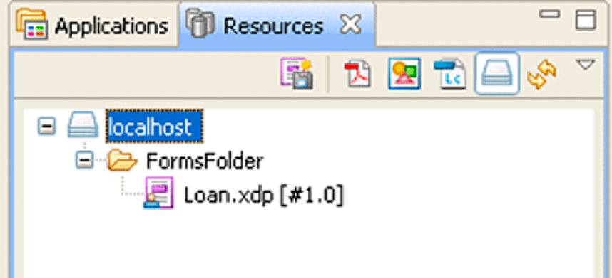

# Working with AEM Forms Repository {#working-with-aem-forms-repository} 

**Samples and examples in this document are only for AEM Forms on JEE environment.**

**About the Repository Service**

The Repository service provides resource storage and management services to AEM Forms. When developers create an *AEM Forms* application, they can deploy the assets in the repository instead of the file system. The assets can include any type of collateral, including XML forms, PDF forms (including Acrobat forms), form fragments, images, profiles, policies, SWF files, DDX files, XML schemas, WSDL files, and test data.

For example, consider the following Forms application named *Applications/FormsApplication*:

Notice that there is a file named Loan.xdp in the FormsFolder. To access this form design, you specify the complete path (including version): `Applications/FormsApplication/1.0/FormsFolder/Loan.xdp`.

>[!NOTE]
>
>For information about creating a Forms application using Workbench, see [Workbench Help](https://www.adobe.com/go/learn_aemforms_workbench_63).

The path to a resource in the AEM Forms repository is:

`Applications/Application-name/Application-version/Folder.../Filename`

The following values show some examples of URI values:

* Applications/AppraisalReport/1.0/Forms/FullForm.xdp
* Applications/AnotherApp/1.1/Assets/picture.jpg
* Applications/SomeApp/2.0/Resources/Data/XSDs/MyData.xsd

>[!NOTE]
>
>You can browse the AEM Forms Repository by using a web browser. To browse the repository, enter the following URL into a web browser `https://[server name]:[server port]/repository`. You can verify quick start results that are associated with the Working with AEM Forms Repository section by using a web browser. For example, if you add content to the AEM Forms Repository, you can see the content in a web browser. (See [Quick Start (SOAP mode): Writing a resource using the Java API](/help/forms/developing/repository-service-api-quick-starts.md#quick-start-soap-mode-writing-a-resource-using-the-java-api).)

The repository API provides several operations that you can use to store and retrieve information from the repository. For example, you can obtain a list of resources or retrieve specific resources that are stored in the repository when a resource is needed as part of processing an application.

>[!NOTE]
>
>The repository API cannot be used to interact with Content Services (deprecated). To interact with Content Services (deprecated), you use the Document Management API.

Using the Repository service API, you can accomplish the following tasks:

* Create folders. See [Creating Folders](aem-forms-repository.md#creating-folders).
* Write resources and their properties. See [Writing Resources](aem-forms-repository.md#writing-resources).
* List resources in a given collection or related to other resources. See [Listing Resources](aem-forms-repository.md#listing-resources).
* Read resources and their properties. See [Reading Resources](aem-forms-repository.md#reading-resources).
* Update resources and their properties. See [Updating Resources](aem-forms-repository.md#updating-resources).
* Search for resources, including their history, related resources, and properties. See [Searching for Resources](aem-forms-repository.md#searching-for-resources).
* Specify relationships between resources. See [Creating Resource Relationships](aem-forms-repository.md#creating-resource-relationships).
* Manage resource access control, including locking and unlocking resources, and reading and writing access control lists (ACLs). See [Locking Resources](aem-forms-repository.md#locking-resources).
* Delete resources and their properties. See [Deleting Resources](aem-forms-repository.md#deleting-resources).

>[!NOTE]
>
>Using the repository API, you cannot manage resource access control, search for resources, or specify resource relationships by using an ECM repository.

>[!NOTE]
>
>When an encrypted PDF is written to the repository, the automated relationship extraction feature cannot be used. Otherwise, an encrypted PDF can be stored in the repository and later retrieved. The retriever can choose to decrypt the PDF after it is retrieved from the repository.

>[!NOTE]
>
>For more information about the Repository service, see [Services Reference for AEM Forms](https://www.adobe.com/go/learn_aemforms_services_63).

## Creating Folders {#creating-folders}

Folders (resource collections) are used to store objects (files or resources) in organized groupings. Folders can contain resources and other folders, also known as subfolders. Resources can only be stored in one folder at a time.

Files inherit access control lists (ACLs) from folders, and subfolders inherit ACLs from their parent folders. Therefore, the parent folders must exist before you can create child folders. The IDE lets you interact only on a folder-by-folder basis, not on a file-by-file basis. You cannot version folders and there is no need to do so; a folder does not contain data itself. Rather, it is only a container for resources that contain data. The default ACL is system-level permission, which means that users must have system-level permissions (read, write, traverse, managing ACLs) until someone gives them permissions for a particular folder. ACLs only work in the IDE.

>[!NOTE]
>
>For more information about the Repository service, see [Services Reference for AEM Forms](https://www.adobe.com/go/learn_aemforms_services_63).

### Summary of steps {#summary-of-steps}

To create a folder, follow these steps:

1. Include project files.
1. Create the service client.
1. Create the folder.
1. Write the folder to the repository.

**Include project files**

Include the necessary files in your development project. If you are creating a client application using Java, include the necessary JAR files. If you are using web services, include the proxy files.

**Create the service client**

Before you can programmatically create a resource collection, you must establish a connection and provide credentials. This is accomplished by creating a service client.

**Create the folder**

Invoke the Repository service method to create the resource collection and populate the resource collection with identifying information, including its UUID, folder name, and description.

**Write the folder to the repository**

Invoke the Repository service method to write the resource collection, specifying the target folder’s URI.

**See also**

[Create folders using the Java API](aem-forms-repository.md#create-folders-using-the-java-api)

[Create folders using the web service API](aem-forms-repository.md#create-folders-using-the-web-service-api)

[Including AEM Forms Java library files](/help/forms/developing/invoking-aem-forms-using-java.md#including-aem-forms-java-library-files)

[Setting connection properties](/help/forms/developing/invoking-aem-forms-using-java.md#setting-connection-properties)

[Repository Service API Quick Starts](/help/forms/developing/repository-service-api-quick-starts.md#repository-service-api-quick-starts)

### Create folders using the Java API {#create-folders-using-the-java-api}

Create a folder by using the Repository service API (Java):

1. Include project files

   Include project files in your Java project’s class path.

1. Create the service client

   Create a `ResourceRepositoryClient` object by using its constructor and passing a `ServiceClientFactory` object that contains connection properties.

1. Create the folder

   To create a resource collection, you must first create a `com.adobe.repository.infomodel.bean.RepositoryInfomodelFactoryBean` object.

   Invoke the `repositoryInfomodelFactoryBean` object’s `newResourceCollection` method, and pass in the following parameters:

    * A `com.adobe.repository.infomodel.Id` UUID identifier to be assigned to the resource.
    * A `com.adobe.repository.infomodel.Lid` UUID identifier to be assigned to the resource.
    * A `java.lang.String` containing the name of the resource collection. For example, `FormsFolder`.

   The method returns a `com.adobe.repository.infomodel.bean.ResourceCollection` object representing the new folder.

   Set the folder’s description by using the `setDescription` method and pass in the following parameter:

    * A `String` that describes the resource collection. In this example, `"test Folder"` is used `.`

1. Write the folder to the repository

   Invoke the `ResourceRepositoryClient` object’s `writeResource` method and pass in the URI of the folder and the `ResourceCollection` object. For example, the URI to the folder can be the following value `/Applications/FormsApplication/1.0/`.

   The method returns an instance of the newly created `com.adobe.repository.infomodel.bean.Resource` object. You can, for example, retrieve the identifier value of the new resource by invoking the `com.adobe.repository.infomodel.bean.Resource` object’s `getId` method.

**See also**

[Creating Folders](aem-forms-repository.md#creating-folders)

[Quick Start (SOAP mode): Creating a folder using the Java API](/help/forms/developing/repository-service-api-quick-starts.md#quick-start-soap-mode-creating-a-folder-using-the-java-api)

[Including AEM Forms Java library files](/help/forms/developing/invoking-aem-forms-using-java.md#including-aem-forms-java-library-files)

[Setting connection properties](/help/forms/developing/invoking-aem-forms-using-java.md#setting-connection-properties)

### Create folders using the web service API {#create-folders-using-the-web-service-api}

Create a folder by using the Repository service API (web service):

1. Include project files

    * Create a Microsoft .NET client assembly that consumes the Repository WSDL using base64.
    * Reference the Microsoft .NET client assembly.

1. Create the service client

   Using the Microsoft .NET client assembly, create a `RepositoryServiceService` object by invoking its default constructor. Set its `Credentials` property using a `System.Net.NetworkCredential` object that contains the user name and password.

1. Create the folder

   Create the folder by using the default constructor for the `ResourceCollection` class and pass in the following parameters:

    * An `Id` object, which is created by invoking the default constructor for the `Id` class and assigned to the `Resource` object’s `id` field.
    * An `Lid` object, which is created by invoking the default constructor for the `Lid` class and assigned to the `Resource` object’s `lid` field.
    * A string containing the name of the resource collection, which is assigned to the `Resource` object’s `name` field. The name used in this example is `"testfolder"`.
    * A string containing the description of the resource collection, which is assigned to the `Resource` object’s `description` field. The description used in this example is `"test folder"`.

1. Write the folder to the repository

   Invoke the `RepositoryServiceService` object’s `writeResource` method and pass in the following parameters:

    * The path where the folder is to be created.
    * The `ResourceCollection` object representing the folder.
    * Pass `null` for the other two parameters.

**See also**

[Creating Folders](aem-forms-repository.md#creating-folders)

[Invoking AEM Forms using Base64 encoding](/help/forms/developing/invoking-aem-forms-using-web.md#invoking-aem-forms-using-base64-encoding)

## Writing Resources {#writing-resources}

You can create resources in a given location in the repository. The natural file size is subject to database limitations and session time-out. For the default configuration, files are limited to 25 MB. To raise or lower the maximum file size, you must change the database configuration.

Writing resources is equivalent to storing data in the repository. Once you write a resource to the repository, it becomes accessible to all clients in the repository ecosystem. When you write resources, such as XML schemas, XDP files, and XSD files, to the repository, the contents are parsed based on the MIME type. If the MIME type is supported, the parser determines whether there is an implied relationship to other content. For example, if a cascading style sheet (CSS) has a relative URL that references a common CSS, it is expected that you will submit the common CSS into the repository as well. The relationship between the two resources is stored as a pending relationship for a non-adjustable period of 30 days. When you submit the common CSS to the repository within the 30-day period, the relationship is formed.

When you create a resource, the access control list (ACL) is inherited from the parent folder. The root folder has system-level permissions until an initial resource or folder is created, at which point the resource or folder is given default ACL permissions.

You can programmatically write resources by using the Repository service Java API or web service API.

>[!NOTE]
>
>For more information about the Repository service, see [Services Reference for AEM Forms](https://www.adobe.com/go/learn_aemforms_services_63).

### Summary of steps {#summary_of_steps-1}

To write a resource, follow these steps:

1. Include project files.
1. Create a Repository service client.
1. Specify the URI of the resource to be read.
1. Read the resource.

**Include project files**

Include the necessary files in your development project. If you are creating a client application using Java, include the necessary JAR files. If you are using web services, include the proxy files.

**Create the service client**

Before you can programmatically read a resource, you must establish a connection and provide credentials. This is accomplished by creating a service client.

**Specify the URI of the target folder for the resource**

Create a string containing the URI of the resource to be read. The syntax includes forward slashes, as in this example: "/*path*/*folder*".

**Create the resource**

Invoke the Repository service method to create the resource, and populate the resource with identifying information, including its UUID, resource name, and description.

**Specify the resource content**

Invoke the Repository service method to create resource content, and store that content in the resource.

**Write the resource to the target folder**

Invoke the Repository service method to write the resource, specifying the target folder’s URI.

**See also**

[Write resources using the Java API](aem-forms-repository.md#write-resources-using-the-java-api)

[Write resources using the web service API](aem-forms-repository.md#write-resources-using-the-web-service-api)

[Including AEM Forms Java library files](/help/forms/developing/invoking-aem-forms-using-java.md#including-aem-forms-java-library-files)

[Setting connection properties](/help/forms/developing/invoking-aem-forms-using-java.md#setting-connection-properties)

[Repository Service API Quick Starts](/help/forms/developing/repository-service-api-quick-starts.md#repository-service-api-quick-starts)

### Write resources using the Java API {#write-resources-using-the-java-api}

Write a resource by using the Repository service API (Java):

1. Include project files

   Include client JAR files in your Java project’s class path.

1. Create the service client

   Create a `ResourceRepositoryClient` object by using its constructor and passing a `ServiceClientFactory` object that contains connection properties.

1. Specify the URI of the target folder for the resource

   Specify the URI of the target folder for the resource. In this case, because the resource named `testResource` will be stored in the folder named `testFolder`, the folder’s URI is `"/testFolder"`. The URI is stored as a `java.lang.String` object.

1. Create the resource

   To create a resource, you must first create a `com.adobe.repository.infomodel.bean.RepositoryInfomodelFactoryBean` object.

   Invoke the `RepositoryInfomodelFactoryBean` object’s `newResource` method, which creates a `com.adobe.repository.infomodel.bean.Resource` object. In this example, the following parameters are provided:

    * A `com.adobe.repository.infomodel.Id` object, which is created by invoking the default constructor for the `Id` class.
    * A `com.adobe.repository.infomodel.Lid` object, which is created by invoking the default constructor for the `Lid` class.
    * A `java.lang.String` containing the file name of the resource.

   To specify the resource’s description, invoke the `Resource` object’s `setDescription` method and pass a string containing the description. In this example, the description is `"test resource"`.

1. Specify the resource content

   To create content for the resource, invoke the `RepositoryInfomodelFactoryBean` object’s `newResourceContent` method, which returns a `com.adobe.repository.infomodel.bean.ResourceContent` object. Add content to the `ResourceContent` object. In this example, this is accomplished by doing the following tasks:

    * Invoking the `ResourceContent` object’s `setDataDocument` method and passing in a `com.adobe.idp.Document` object
    * Invoking the `ResourceContent` object’s `setSize` method and passing in the size in bytes of the `Document` object

   Add the content to the resource by invoking the `Resource` object’s `setContent` method and passing in the `ResourceContent` object. For more information, see [AEM Forms API Reference](https://www.adobe.com/go/learn_aemforms_javadocs_63_en).

1. Write the resource to the target folder

   Invoke the `ResourceRepositoryClient` object’s `writeResource` method and pass in the URI of the folder, and the `Resource` object.

**See also**

[Writing Resources](aem-forms-repository.md#writing-resources)

[Quick Start (SOAP mode): Writing a resource using the Java API](/help/forms/developing/repository-service-api-quick-starts.md#quick-start-soap-mode-writing-a-resource-using-the-java-api)

[Including AEM Forms Java library files](/help/forms/developing/invoking-aem-forms-using-java.md#including-aem-forms-java-library-files)

[Setting connection properties](/help/forms/developing/invoking-aem-forms-using-java.md#setting-connection-properties)

### Write resources using the web service API {#write-resources-using-the-web-service-api}

Write a resource by using the Repository service API (web service):

1. Include project files

    * Create a Microsoft .NET client assembly that consumes the Repository WSDL using base64.
    * Reference the Microsoft .NET client assembly.

1. Create the service client

   Using the Microsoft .NET client assembly, create a `RepositoryServiceService` object by invoking its default constructor. Set its `Credentials` property using a `System.Net.NetworkCredential` object containing the user name and password.

1. Specify the URI of the target folder for the resource

   Specify the URI of the target folder for the resource. In this case, because the resource named `testResource` will be stored in the folder named `testFolder`, the folder’s URI is `"/testFolder"`. When using a language compliant with the Microsoft .NET Framework (for example, C#), store the URI in a `System.String` object.

1. Create the resource

   To create a resource, invoke the default constructor for the `Resource` class. In this example, the following information is stored in the `Resource` object:

    * A `com.adobe.repository.infomodel.Id` object, which is created by invoking the default constructor for the `Id` class and assigned to the `Resource` object’s `id` field.
    * A `com.adobe.repository.infomodel.Lid` object, which is created by invoking the default constructor for the `Lid` class and assigned to the `Resource` object’s `lid` field.
    * A string containing the file name of the resource, which is assigned to the `Resource` object’s `name` field. The name used in this example is `"testResource"`.
    * A string containing the description of the resource, which is assigned to the `Resource` object’s `description` field. The description used in this example is `"test resource"`.

1. Specify the resource content

   To create content for the resource, invoke the default constructor for the `ResourceContent` class. Then add content to the `ResourceContent` object. In this example, this is accomplished by doing the following tasks:

    * Assigning a `BLOB` object containing a document to the `ResourceContent` object’s `dataDocument` field.
    * Assigning the size in bytes of the `BLOB` object to the `ResourceContent` object’s `size` field.

   Add the content to the resource by assigning the `ResourceContent` object to the `Resource` object’s `content` field.

1. Write the resource to the target folder

   Invoke the `RepositoryServiceService` object’s `writeResource` method and pass in the URI of the folder, and the `Resource` object. Pass `null` for the other two parameters.

**See also**

[Writing Resources](aem-forms-repository.md#writing-resources)

[Invoking AEM Forms using Base64 encoding](/help/forms/developing/invoking-aem-forms-using-web.md#invoking-aem-forms-using-base64-encoding)

## Listing Resources {#listing-resources}

You can discover resources by listing resources. A query is performed against the repository to find all the resources that are related to a given resource collection.

Once you organize your resources, you can inspect the structure you created by seeing a particular branch of the structure, much like you would do in an operating system.

Listing resources operates by relationship: resources are members of folders. Membership is represented by a relationship of type "member of". When you list resources in a given folder, you are querying for resources that are related to a given folder by the relationship "member of". Relationships are directional: a member of a relationship has a source that is a member of the target. The source is the resource; the target is the parent folder.

>[!NOTE]
>
>For more information about the Repository service, see [Services Reference for AEM Forms](https://www.adobe.com/go/learn_aemforms_services_63).

### Summary of steps {#summary_of_steps-2}

To list resources, follow these steps:

1. Include project files.
1. Create the service client.
1. Specify the folder path.
1. Retrieve the list of resources.

**Include project files**

Include the necessary files in your development project. If you are creating a client application using Java, include the necessary JAR files. If you are using web services, include the proxy files.

**Create the service client**

Before you can programmatically create a resource collection, you must establish a connection and provide credentials. This is accomplished by creating a service client.

**Specify the folder path**

Create a string containing the path of the folder containing the resources. The syntax includes forward slashes, as in this example: "/*path*/*folder*".

**Retrieve the list of resources**

Invoke the Repository service method to retrieve the list of resources, specifying the target folder’s path.

**See also**

[List resources using the Java API](aem-forms-repository.md#list-resources-using-the-java-api)

[List resources using the web service API](aem-forms-repository.md#list-resources-using-the-web-service-api)

[Including AEM Forms Java library files](/help/forms/developing/invoking-aem-forms-using-java.md#including-aem-forms-java-library-files)

[Setting connection properties](/help/forms/developing/invoking-aem-forms-using-java.md#setting-connection-properties)

[Repository Service API Quick Starts](/help/forms/developing/repository-service-api-quick-starts.md#repository-service-api-quick-starts)

### List resources using the Java API {#list-resources-using-the-java-api}

List resources by using the Repository service API (Java):

1. Include project files

   Include client JAR files in your Java project’s class path.

1. Create the service client

   Create a `ResourceRepositoryClient` object by using its constructor and passing a `ServiceClientFactory` object that contains connection properties.

1. Specify the folder path

   Specify the URI of the resource collection to be queried. In this case, its URI is `"/testFolder"`. The URI is stored as a `java.lang.String` object.

1. Retrieve the list of resources

   Invoke the `ResourceRepositoryClient` object’s `listMembers` method and pass in the URI of the folder.

   The method returns a `java.util.List` of `com.adobe.repository.infomodel.bean.Resource` objects that are the source of a `com.adobe.repository.infomodel.bean.Relation` of type `Relation.TYPE_MEMBER_OF` and have the resource collection URI as the target. You can iterate through this `List` to retrieve each of the resources. In this example, the name and description of each resource is displayed.

**See also**

[Listing Resources](aem-forms-repository.md#listing-resources).

[Quick Start (SOAP mode): Listing resources using the Java API](/help/forms/developing/repository-service-api-quick-starts.md#quick-start-soap-mode-listing-resources-using-the-java-api)

[Including AEM Forms Java library files](/help/forms/developing/invoking-aem-forms-using-java.md#including-aem-forms-java-library-files)

[Setting connection properties](/help/forms/developing/invoking-aem-forms-using-java.md#setting-connection-properties)

### List resources using the web service API {#list-resources-using-the-web-service-api}

List resources by using the Repository service API (web service):

1. Include project files

    * Create a Microsoft .NET client assembly that consumes the Repository WSDL.
    * Reference the Microsoft .NET client assembly.

1. Create the service client

   Using the Microsoft .NET client assembly, create a `RepositoryServiceService` object by invoking its default constructor. Set its `Credentials` property using a `System.Net.NetworkCredential` object containing the user name and password.

1. Specify the folder path

   Specify a string containing the URI of the folder to be queried. In this case, its URI is `"/testFolder"`. When using a language that is compliant with the Microsoft .NET Framework (for example, C#), store the URI in a `System.String` object.

1. Retrieve the list of resources

   Invoke the `RepositoryServiceService` object’s `listMembers` method and pass in the URI of the folder as the first parameter. Pass `null` for the other two parameters.

   The method returns an array of objects that can be cast to `Resource` objects. You can iterate through the object array to retrieve each of the related resources. In this example, the name and description of each resource is displayed.

**See also**

[Listing Resources](aem-forms-repository.md#listing-resources).

[Invoking AEM Forms using Base64 encoding](/help/forms/developing/invoking-aem-forms-using-web.md#invoking-aem-forms-using-base64-encoding)

## Reading Resources {#reading-resources}

You can retrieve resources from a given location in the repository to read their content and metadata. The workflow is front-ended by an initialization form. The process has all the permissions it needs to read the form. The system retrieves the data form and reads the content from the repository. The repository grants access to the content and the metadata (the ability to even know the resource exists).

The repository has the following four permission types:

* **traverse**: lets you list resources; that is, to read resource metadata, but not resource content
* **read**: lets you read resource content
* **write**: lets you write resource content
* **managing access control lists (ACLs)**: lets you manipulate ACLs on resources

Users can only run processes when they have permission to run the process. IDE users need traverse and read permissions to synchronize with the repository. ACLs apply only at design time because runtime occurs within the system context.

You can programmatically read resources by using the Repository service Java API or web service API.

>[!NOTE]
>
>For more information about the Repository service, see [Services Reference for AEM Forms](https://www.adobe.com/go/learn_aemforms_services_63).

### Summary of steps {#summary_of_steps-3}

To read a resource, follow these steps:

1. Include project files.
1. Create a Repository service client.
1. Specify the URI of the resource to be read.
1. Read the resource.

**Include project files**

Include the necessary files in your development project. If you are creating a client application using Java, include the necessary JAR files. If you are using web services, include the proxy files.

**Create the service client**

Before you can programmatically read a resource, you must establish a connection and provide credentials. This is accomplished by creating a service client.

**Specify the URI of the resource to be read**

Create a string containing the URI of the resource to be read. The syntax includes forward slashes, as in this example: "/*path*/*resource*".

**Read the resource**

Invoke the Repository service method to read the resource, specifying the URI.

**See also**

[Read resources using the Java API](aem-forms-repository.md#read-resources-using-the-java-api)

[Reading resources using the web service API](aem-forms-repository.md#reading-resources-using-the-web-service-api)

[Including AEM Forms Java library files](/help/forms/developing/invoking-aem-forms-using-java.md#including-aem-forms-java-library-files)

[Setting connection properties](/help/forms/developing/invoking-aem-forms-using-java.md#setting-connection-properties)

[Repository Service API Quick Starts](/help/forms/developing/repository-service-api-quick-starts.md#repository-service-api-quick-starts)

### Read resources using the Java API {#read-resources-using-the-java-api}

Read a resource by using the Repository service API (Java):

1. Include project files

   Include client JAR files in your Java project’s class path.

1. Create the service client

   Create a `ResourceRepositoryClient` object by using its constructor and passing a `ServiceClientFactory` object that contains connection properties.

1. Specify the URI of the resource to be read

   Specify a string value that represents the URI of the resource to retrieve. For example, assuming the resource is named *testResource* which is in a folder named *testFolder*, specify `/testFolder/testResource`.

1. Read the resource

   Invoke the `ResourceRepositoryClient` object’s `readResource` method and pass the URI of the resource as a parameter. This method returns a `Resource` instance that represents the resource.

**See also**

[Reading Resources](aem-forms-repository.md#reading-resources)

[Quick Start (SOAP mode): Reading a resource using the Java API](/help/forms/developing/repository-service-api-quick-starts.md#quick-start-soap-mode-reading-a-resource-using-the-java-api)

[Including AEM Forms Java library files](/help/forms/developing/invoking-aem-forms-using-java.md#including-aem-forms-java-library-files)

[Setting connection properties](/help/forms/developing/invoking-aem-forms-using-java.md#setting-connection-properties)

### Reading resources using the web service API {#reading-resources-using-the-web-service-api}

Read a resource by using the Repository service API (web service):

1. Include project files

    * Create a Microsoft .NET client assembly that consumes the Repository WSDL. (See [Creating a .NET client assembly that uses Base64 encoding](/help/forms/developing/invoking-aem-forms-using-web.md#creating-a-net-client-assembly-that-uses-base64-encoding).)
    * Reference the Microsoft .NET client assembly. (See [Creating a .NET client assembly that uses Base64 encoding](/help/forms/developing/invoking-aem-forms-using-web.md#creating-a-net-client-assembly-that-uses-base64-encoding).)

1. Create the service client

   Using the Microsoft .NET client assembly, create a `RepositoryServiceService` object by invoking its default constructor. Set its `Credentials` property using a `System.Net.NetworkCredential` object containing the user name and password.

1. Specify the URI of the resource to be read

   Specify a string containing the URI of the resource to be retrieved. In this case, because the resource named `testResource` is in the folder named `testFolder`, its URI is `"/testFolder/testResource"`. When using a language compliant with the Microsoft .NET Framework (for example, C#), store the URI in a `System.String` object.

1. Read the resource

   Invoke the `RepositoryServiceService` object’s `readResource` method and pass the URI of the resource as the first parameter. Pass `null` for the other two parameters.

**See also**

[Reading Resources](aem-forms-repository.md#reading-resources)

[Invoking AEM Forms using Base64 encoding](/help/forms/developing/invoking-aem-forms-using-web.md#invoking-aem-forms-using-base64-encoding)

## Updating Resources {#updating-resources}

You can retrieve and update the content of resources in the repository. When you update resources, access control to those resources remains unchanged between versions. When performing an update, you have the option of incrementing the major version. If you do not choose to increment the major version, the minor version is automatically updated.

When you update a resource, the new version is created based on the specified resource attributes. When you update a resource you specify two important parameters: the target URI and a resource instance containing all the updated metadata. It is important to note that if you are not changing a given attribute (for example, the name), the attribute is still required in the instance you pass in. The relationships that are created when parsing the content are added to the specific version and are not brought forward unless specified.

For example, if you update an XDP file and it contains references to other resources, those additional references will also be recorded. Suppose that form.xdp version 1.0 has two external references: a logo and a style sheet, and you subsequently update form.xdp so that it now has three references: a logo, a style sheet, and a schema file. During the update, the repository will add the third relationship (to the schema file) to its pending relation table. Once the schema file is present in the repository, the relationship will automatically be formed. However, if form.xdp version 2.0 no longer uses the logo, form.xdp version 2.0 will not have a relationship to the logo.

All update operations are atomic and transactional. For example, if two users read the same resource and both decide to update version 1.0 to version 2.0, one of them will succeed and one of them will fail, the integrity of the repository will be maintained, and both will get a message confirming success or failure. If the transaction does not commit, it will roll back if there is a database failure and will time out or roll back depending on the application server.

You can programmatically update resources by using the Repository service Java API or web service API.

>[!NOTE]
>
>For more information about the Repository service, see [Services Reference for AEM Forms](https://www.adobe.com/go/learn_aemforms_services_63).

### Summary of steps {#summary_of_steps-4}

To update a resource, follow these steps:

1. Include project files.
1. Create a Repository service client.
1. Retrieve the resource to be updated.
1. Update the resource.

**Include project files**

Include the necessary files in your development project. If you are creating a client application using Java, include the necessary JAR files. If you are using web services, include the proxy files.

**Create the service client**

Before you can programmatically read a resource, you must establish a connection and provide credentials. This is accomplished by creating a service client.

**Retrieve the resource to be updated**

Read the resource. For more information, see [Reading Resources](aem-forms-repository.md#reading-resources).

**Update the resource**

Set the new information in the resource and invoke the Repository service method to update the resource, specifying the URI, the updated resource, and how the version information should be updated.

**See also**

[Update resources using the Java API](aem-forms-repository.md#update-resources-using-the-java-api)

[Update resources using the web service API](aem-forms-repository.md#update-resources-using-the-web-service-api)

[Including AEM Forms Java library files](/help/forms/developing/invoking-aem-forms-using-java.md#including-aem-forms-java-library-files)

[Setting connection properties](/help/forms/developing/invoking-aem-forms-using-java.md#setting-connection-properties)

[Repository Service API Quick Starts](/help/forms/developing/repository-service-api-quick-starts.md#repository-service-api-quick-starts)

### Update resources using the Java API {#update-resources-using-the-java-api}

Update a resource by using the Repository service API (Java):

1. Include project files

   Include client JAR files in your Java project’s class path.

1. Create the service client

   Create a `ResourceRepositoryClient` object by using its constructor and passing a `ServiceClientFactory` object that contains connection properties.

1. Retrieve the resource to be updated

   Specify the URI of the resource to retrieve and read the resource. In this example, the URI of the resource is `"/testFolder/testResource"`.

1. Update the resource

   Update the `Resource` object’s information. In this example, to update the description, invoke the `Resource` object’s `setDescription` method and pass the new description string as a parameter.

   Then invoke the `ServiceClientFactory` object’s `updateResource` method, and pass in the following parameters:

    * A `java.lang.String` object containing the resource’s URI.
    * The `Resource` object containing the updated resource information.
    * A `boolean` value indicating whether to update the major or minor version. In this example, a value of `true` is passed in to indicate that the major version is to be incremented.

**See also**

[Updating Resources](aem-forms-repository.md#updating-resources)

[Quick Start (SOAP mode): Updating a resource using the Java API](/help/forms/developing/repository-service-api-quick-starts.md#quick-start-soap-mode-updating-a-resource-using-the-java-api)

[Including AEM Forms Java library files](/help/forms/developing/invoking-aem-forms-using-java.md#including-aem-forms-java-library-files)

[Setting connection properties](/help/forms/developing/invoking-aem-forms-using-java.md#setting-connection-properties)

### Update resources using the web service API {#update-resources-using-the-web-service-api}

Update a resource by using the Repository API (web service):

1. Include project files

    * Create a Microsoft .NET client assembly that consumes the Repository WSDL.
    * Reference the Microsoft .NET client assembly.

1. Create the service client

   Using the Microsoft .NET client assembly, create a `RepositoryServiceService` object by invoking its default constructor. Set its `Credentials` property using a `System.Net.NetworkCredential` object containing the user name and password.

1. Retrieve the resource to be updated

   Specify the URI of the resource to be retrieved and read the resource. In this example, the URI of the resource is `"/testFolder/testResource"`. For more information, see [Reading Resources](aem-forms-repository.md#reading-resources).

1. Update the resource

   Update the `Resource` object’s information. In this example, to update the description, assign a new value to the `Resource` object’s `description` field.

1. Invoke the `RepositoryServiceService` object’s `updateResource` method, and pass in the following parameters:

    * A `System.String` object containing the resource’s URI.
    * The `Resource` object containing the updated resource information.
    * A `boolean` value indicating whether to update the major or minor version. In this example, a value of `true` is passed in to indicate that the major version is to be incremented.
    * Pass `null` for the remaining two parameters.

**See also**

[Updating Resources](aem-forms-repository.md#updating-resources)

[Invoking AEM Forms using Base64 encoding](/help/forms/developing/invoking-aem-forms-using-web.md#invoking-aem-forms-using-base64-encoding)

## Searching for Resources {#searching-for-resources}

You can construct queries used to search for resources in the repository, including history, related resources, and properties.

You can retrieve related resources to determine dependencies between a form and its fragments. For example, if you have a form you can determine what fragments or external resources it uses. If you have an image, you can also find out what forms use the image. You can also search for related resources using filtering based on properties. For example, you can search for all forms that use an image with a specified name, or find any image used by a form with a specified name. You can also search using resource properties. For example, you can conduct a query to find all forms or resources whose name starts with a given string that may include ’%’ and ’_’ wildcards. Remember that searches based on properties are not based on relationships; such searches are based on the assumption that you have specific knowledge about a given resource.

**Query statements**

A *query* contains one or more statements that are logically joined with conditions. A *statement* consists of a left operand, an operator, and a right operand. In addition, you can specify the sort order to be used for the search results. The *sort order* contains information equivalent to an SQL `ORDER BY` clause and is comprised of elements that contain the attributes on which the search was based and a value indicating whether ascending or descending order is to be used.

You can programmatically search for resources by using the Repository service Java API. At this time, it is not possible to use the web service API to search for resources.

**Sort behaviour**

Sort order is not respected when invoking the `ResourceRepositoryClient` object’s `searchProperties` method and specifying a sort order. For example, assume that you create a resource with three custom properties, where attribute names are `name`, `secondName`, and `asecondName`. Next you create a sort order element on the attribute name and set the `ascending` value to `true`.

Then you invoke the `ResourceRepositoryClient` object’s `searchProperties` method and pass in the sort order. The search returns the right resource, with the three properties. However, the properties are not sorted by attribute name. They are returned in the order they were added: `name`, `secondName`, and `asecondName`.

>[!NOTE]
>
>For more information about the Repository service, see [Services Reference for AEM Forms](https://www.adobe.com/go/learn_aemforms_services_63).

### Summary of steps {#summary_of_steps-5}

To search for resources, follow these steps:

1. Include project files.
1. Create a Repository service client.
1. Specify the target folder for the search.
1. Specify the attributes used in the search.
1. Create the query used in the search.
1. Create the sort order for the search results.
1. Search for the resources.
1. Retrieve the resources from the search result.

**Include project files**

Include the necessary files in your development project. If you are creating a client application using Java, include the necessary JAR files. If you are using web services, include the proxy files.

**Create the service client**

Before you can programmatically read a resource, you must establish a connection and provide credentials. This is accomplished by creating a service client.

**Specify the target folder for the search**

Create a string containing the base path from which to conduct the search. The syntax includes forward slashes, as in this example: "/*path*/*folder*".

**Specify the attributes used in the search**

You can base your search on the attributes contained within resources. Specify the values of the attributes on which to conduct the search.

**Create the query used in the search**

Construct a query by using statements and conditions. Each statement will specify the attribute on which to base the search, the condition to be used, and the attribute value to be used in the search.

**Create the sort order for the search results**

The sort order is comprised of elements, each of which contains one of the attributes used in the search and a value indicating whether ascending or descending order is to be used.

**Search for the resources**

Search for the resources using the folder, query, and sort order. In addition, indicate the depth of the search and an upper limit on the number of results to be returned.

**Retrieve the resources from the search result**

Iterate through the returned list of resources and extract the information for further processing.

**See also**

[Search for resources using the Java API](aem-forms-repository.md#search-for-resources-using-the-java-api)

[Including AEM Forms Java library files](/help/forms/developing/invoking-aem-forms-using-java.md#including-aem-forms-java-library-files)

[Setting connection properties](/help/forms/developing/invoking-aem-forms-using-java.md#setting-connection-properties)

[Repository Service API Quick Starts](/help/forms/developing/repository-service-api-quick-starts.md#repository-service-api-quick-starts)

### Search for resources using the Java API {#search-for-resources-using-the-java-api}

Search for a resource by using the Repository service API (Java):

1. Include project files

   Include client JAR files in your Java project’s class path.

1. Create the service client

   Create a `ResourceRepositoryClient` object by using its constructor and passing a `ServiceClientFactory` object that contains connection properties.

1. Specify the target folder for the search

   Specify the URI of the base path from which to execute the search. In this example, the URI of the resource is `/testFolder`.

1. Specify the attributes used in the search

   Specify the values for the attributes on which to conduct the search. The attributes exist within a `com.adobe.repository.infomodel.bean.Resource` object. In this example, the search will be conducted on the name attribute; therefore, a `java.lang.String` containing the `Resource` object’s name is used, which is `testResource` in this case.

1. Create the query used in the search

   To create a query, create a `com.adobe.repository.query.Query` object by invoking the default constructor for the `Query` class and add statements to the query.

   To create a statement, invoke the constructor for the `com.adobe.repository.query.Query.Statement` class and pass in the following parameters:

    * A left operand containing the resource attribute constant. In this example, because the resource’s name is used as the basis for the search, the static value `Resource.ATTRIBUTE_NAME` is used.
    * An operator containing the condition used in the search for the attribute. The operator must be one of the static constants in the `Query.Statement` class. In this example, the static value `Query.Statement.OPERATOR_BEGINS_WITH` is used.
    * A right operand containing the attribute value on which to conduct the search. In this example, the name attribute, a `String` containing the value `"testResource"`, is used.

   Specify the namespace of the left operand by invoking the `Query.Statement` object’s `setNamespace` method and passing in one of the static values contained in the `com.adobe.repository.infomodel.bean.ResourceProperty` class. In this example, `ResourceProperty.RESERVED_NAMESPACE_REPOSITORY` is used.

   Add each statement to the query by invoking the `Query` object’s `addStatement` method and passing in the `Query.Statement` object.

1. Create the sort order for the search results

   To specify the sort order used in the search results, create a `com.adobe.repository.query.sort.SortOrder` object by invoking the default constructor for the `SortOrder` class, and add elements to the sort order.

   To create an element for the sort order, invoke one of the constructors for the `com.adobe.repository.query.sort.SortOrder.Element` class. In this example, because the resource’s name is used as the basis for the search, the static value `Resource.ATTRIBUTE_NAME` is used as the first parameter, and ascending order (a `boolean` value of `true`) is specified as the second parameter.

   Add each element to the sort order by invoking the `SortOrder` object’s `addSortElement` method and passing in the `SortOrder.Element` object.

1. Search for the resources

   To search for `resources` based on attribute properties, invoke the `ResourceRepositoryClient` object’s `searchProperties` method and pass in the following parameters:

    * A `String` containing the base path from which to execute the search. In this case, `"/testFolder"` is used.
    * The query used in the search.
    * The depth of the search. In this case, `com.adobe.repository.infomodel.bean.ResourceCollection.DEPTH_INFINITE` is used to indicate that the base path and all its folders are to be used.
    * An `int` value indicating the first row from which to select the unpaged result set. In this example, `0` is specified.
    * An `int` value indicating the maximum number of results to be returned. In this example, `10` is specified.
    * The sort order used in the search.

   The method returns a `java.util.List` of `Resource` objects in the specified sort order.

1. Retrieve the resources from the search result

   To retrieve the resources contained in the search result, iterate through the `List` and cast each object to a `Resource` to extract its information. In this example, the name of each resource is displayed.

**See also**

[Searching for Resources](aem-forms-repository.md#searching-for-resources)

[Quick Start (SOAP mode): Searching for resources using the Java API](/help/forms/developing/repository-service-api-quick-starts.md#quick-start-soap-mode-searching-for-resources-using-the-java-api)

[Including AEM Forms Java library files](/help/forms/developing/invoking-aem-forms-using-java.md#including-aem-forms-java-library-files)

[Setting connection properties](/help/forms/developing/invoking-aem-forms-using-java.md#setting-connection-properties)

## Creating Resource Relationships {#creating-resource-relationships}

You can specify relationships between resources in the repository. There are three kinds of relationships:

* **Dependence**: a relationship in which a resource depends on other resources, meaning that all related resources are needed in the repository.
* **Membership (file system)**: a relationship in which a resource is located within a given folder.
* **Custom**: a relationship you specify between resources. For example, if one resource has been deprecated and another resource introduced into the repository, you could specify your own replacement relationship.

You can create your own custom relationships. For example, if you store an HTML file in the repository and it uses an image, you could specify a custom relationship to relate the HTML file with the image (since normally only XML files are associated with images using a repository-defined dependence relationship). Another example of a custom relationship would be if you wanted to build a different view of the repository with a cyclical graph structure instead of a tree structure. You could define a circular graph along with a viewer to traverse those relationships. Finally, you could indicate that a resource replaces another resource even though the two resources are completely different. In that case you could define a relationship type outside of the reserved range and create a relationship between those two resources. Your application would be the only client that could detect and process the relationship, and it could be used to conduct searches on that relationship.

You can programmatically specify relationships between resources by using the Repository service Java API or web service API.

>[!NOTE]
>
>For more information about the Repository service, see [Services Reference for AEM Forms](https://www.adobe.com/go/learn_aemforms_services_63).

### Summary of steps {#summary_of_steps-6}

To specify a relationship between two resources, follow these steps:

1. Include project files.
1. Create a Repository service client.
1. Specify the URIs of the resources to be related.
1. Create the relationship.

**Include project files**

Include the necessary files in your development project. If you are creating a client application using Java, include the necessary JAR files. If you are using web services, include the proxy files.

**Create the service client**

Before you can programmatically read a resource, you must establish a connection and provide credentials. This is accomplished by creating a service client.

**Specify the URIs of the resources to be related**

Create strings containing the URIs of the resource to be related. The syntax includes forward slashes, as in this example: "/*path*/*resource*".

**Create the relationship**

Invoke the Repository service method to create and specify the type of relationship.

**See also**

[Create relationship resources using the Java API](aem-forms-repository.md#create-relationship-resources-using-the-java-api)

[Create relationship resources using the web service API](aem-forms-repository.md#create-relationship-resources-using-the-web-service-api)

[Including AEM Forms Java library files](/help/forms/developing/invoking-aem-forms-using-java.md#including-aem-forms-java-library-files)

[Setting connection properties](/help/forms/developing/invoking-aem-forms-using-java.md#setting-connection-properties)

[Repository Service API Quick Starts](/help/forms/developing/repository-service-api-quick-starts.md#repository-service-api-quick-starts)

### Create relationship resources using the Java API {#create-relationship-resources-using-the-java-api}

Create relationship resources by using the Repository service Java API, perform the following tasks:

1. Include project files

   Include client JAR files in your Java project’s class path.

1. Create the service client

   Create a `ResourceRepositoryClient` object by using its constructor and passing a `ServiceClientFactory` object that contains connection properties.

1. Specify the URIs of the resources to be related

   Specify the URIs of the resources to be related. In this case, because the resources are named `testResource1` and `testResource2` and are in the folder named `testFolder`, their URIs are `"/testFolder/testResource1"` and `"/testFolder/testResource2"`. The URIs are stored as a `java.lang.String` objects. In this example, the resources are first written to the repository, and their URIs are retrieved. For more information about writing a resource, see [Writing Resources](aem-forms-repository.md#writing-resources).

1. Create the relationship

   Invoke the `ResourceRepositoryClient` object’s `createRelationship` method and pass in the following parameters:

    * The URI of the source resource.
    * The URI of the target resource.
    * The type of relationship, which is one of the static constants in the `com.adobe.repository.infomodel.bean.Relation` class. In this example, a dependence relationship is established by specifying the value `Relation.TYPE_DEPENDANT_OF`.
    * A `boolean` value indicating whether the target resource is automatically updated to the `com.adobe.repository.infomodel.Id`-based identifier of the new head resource. In this example, because of the dependence relationship, the value `true` is specified.

   You can also retrieve a list of related resources for a given resource by invoking the `ResourceRepositoryClient` object’s `getRelated` method and passing in the following parameters:

    * The URI of the resource for which to retrieve related resources. In this example, the source resource ( `"/testFolder/testResource1"`) is specified.
    * A `boolean` value indicating whether the specified resource is the source resource in the relationship. In this example, the value `true` is specified because this is the case.
    * The relationship type, which is one of the static constants in the `Relation` class. In this example, a dependence relationship is specified by using the same value used earlier: `Relation.TYPE_DEPENDANT_OF`.

   The `getRelated` method returns a `java.util.List` of `Resource` objects through which you can iterate to retrieve each of the related resources, casting the objects contained in the `List` to `Resource` as you do so. In this example, `testResource2` is expected to be in the list of returned resources.

**See also**

[Creating Resource Relationships](aem-forms-repository.md#creating-resource-relationships)

[Quick Start (SOAP mode): Creating relationships between resources using the Java API](/help/forms/developing/repository-service-api-quick-starts.md#quick-start-soap-mode-creating-relationships-between-resources-using-the-java-api)

[Including AEM Forms Java library files](/help/forms/developing/invoking-aem-forms-using-java.md#including-aem-forms-java-library-files)

[Setting connection properties](/help/forms/developing/invoking-aem-forms-using-java.md#setting-connection-properties)

### Create relationship resources using the web service API {#create-relationship-resources-using-the-web-service-api}

Create relationship resources by using the Repository API (web service):

1. Include project files

    * Create a Microsoft .NET client assembly that consumes the Repository WSDL.
    * Reference the Microsoft .NET client assembly.

1. Create the service client

   Using the Microsoft .NET client assembly, create a `RepositoryServiceService` object by invoking its default constructor. Set its `Credentials` property using a `System.Net.NetworkCredential` object containing the user name and password.

1. Specify the URIs of the resources to be related

   Specify the URIs of the resources to be related. In this case, because the resources are named `testResource1` and `testResource2` and are in the folder named `testFolder`, their URIs are `"/testFolder/testResource1"` and `"/testFolder/testResource2"`. When using a language compliant with the Microsoft .NET Framework (for example, C#), the URIs are stored as a `System.String` objects. In this example, the resources are first written to the repository, and their URIs are retrieved. For more information about writing a resource, see [Writing Resources](aem-forms-repository.md#writing-resources).

1. Create the relationship

   Invoke the `RepositoryServiceService` object’s `createRelationship` method and pass in the following parameters:

    * The URI of the source resource.
    * The URI of the target resource.
    * The type of relationship. In this example, a dependence relationship is established by specifying the value `3`.
    * A `boolean` value indicating whether the relationship type was specified. In this example, the value `true` is specified.
    * A `boolean` value indicating whether the target resource is automatically updated to the `Id`-based identifier of the new head resource. In this example, because of the dependence relationship, the value `true` is specified.
    * A `boolean` value indicating whether the target head was specified. In this example, the value `true` is specified.
    * Pass `null` for the last parameter.

   You can also retrieve a list of related resources for a given resource by invoking the `RepositoryServiceService` object’s `getRelated` method and passing in the following parameters:

    * The URI of the resource for which to retrieve related resources. In this example, the source resource ( `"/testFolder/testResource1"`) is specified.
    * A `boolean` value indicating whether the specified resource is the source resource in the relationship. In this example, the value `true` is specified because this is the case.
    * A `boolean` value indicating whether the source resource was specified. In this example, the value `true` is provided.
    * An array of integers containing the relationship types. In this example, a dependence relationship is specified by using the same value in the array as was used earlier: `3`.
    * Pass `null` for the remaining two parameters.

   The `getRelated` method returns an array of objects that can be cast to `Resource` objects through which you can iterate to retrieve each of the related resources. In this example, `testResource2` is expected to be in the list of returned resources.

**See also**

[Creating Resource Relationships](aem-forms-repository.md#creating-resource-relationships)

[Invoking AEM Forms using Base64 encoding](/help/forms/developing/invoking-aem-forms-using-web.md#invoking-aem-forms-using-base64-encoding)

## Locking Resources {#locking-resources}

You can lock a resource or set of resources for exclusive use by a particular user or shared use among more than one user. A shared lock is an indication that something will happen with the resource, but it does not prevent anyone else from taking actions with that resource. A shared lock should be considered a signaling mechanism. An exclusive lock means that the user who locked the resource is going to change the resource, and the lock ensures that nobody else can do so until the user no longer needs access to the resource and has released the lock. If a repository administrator unlocks a resource, all exclusive and shared locks on that resource will automatically be removed. This type of action is meant for situations in which a user is no longer available and has not unlocked the resource.

When a resource is locked, a lock icon appears when you view the Resources tab in Workbench, as shown in the following illustration.

You can programmatically control access to resources by using the Repository service Java API or web service API.

>[!NOTE]
>
>For more information about the Repository service, see [Services Reference for AEM Forms](https://www.adobe.com/go/learn_aemforms_services_63).

### Summary of steps {#summary_of_steps-7}

To lock and unlock resources, follow these steps:

1. Include project files.
1. Create a Repository service client.
1. Specify the URI of the resource to be locked.
1. Lock the resource.
1. Retrieve the locks for the resource.
1. Unlock the resource

**Include project files**

Include the necessary files in your development project. If you are creating a client application using Java, include the necessary JAR files. If you are using web services, include the proxy files.

**Create the service client**

Before you can programmatically read a resource, you must establish a connection and provide credentials. This is accomplished by creating a service client.

**Specify the URI of the resource to be locked**

Create a string containing the URI of the resource to be locked. The syntax includes forward slashes, as in this example: "/*path*/*resource*".

**Lock the resource**

Invoke the Repository service method to lock the resource, specifying the URI, the type of lock, and the locking depth.

**Retrieve the locks for the resource**

Invoke the Repository service method to retrieve the locks for the resource, specifying the URI.

**Unlock the resource**

Invoke the Repository service method to unlock the resource, specifying the URI.

**See also**

[Lock resources using the Java API](aem-forms-repository.md#lock-resources-using-the-java-api)

[Lock resources using the web service API](aem-forms-repository.md#lock-resources-using-the-web-service-api)

[Including AEM Forms Java library files](/help/forms/developing/invoking-aem-forms-using-java.md#including-aem-forms-java-library-files)

[Setting connection properties](/help/forms/developing/invoking-aem-forms-using-java.md#setting-connection-properties)

[Repository Service API Quick Starts](/help/forms/developing/repository-service-api-quick-starts.md#repository-service-api-quick-starts)

### Lock resources using the Java API {#lock-resources-using-the-java-api}

Lock resources by using the Repository service API (Java):

1. Include project files

   Include client JAR files in your Java project’s class path.

1. Create the service client

   Create a `ResourceRepositoryClient` object by using its constructor and passing a `ServiceClientFactory` object that contains connection properties.

1. Specify the URI of the resource to be locked

   Specify the URI of the resource to be locked. In this case, because the resource named `testResource` is in the folder named `testFolder`, its URI is `"/testFolder/testResource"`. The URI is stored as a `java.lang.String` object.

1. Lock the resource

   Invoke the `ResourceRepositoryClient` object’s `lockResource` method and pass in the following parameters:

    * The URI of the resource.
    * The lock scope. In this example, because the resource will be locked for exclusive use, the lock scope is specified as `com.adobe.repository.infomodel.bean.Lock.SCOPE_EXCLUSIVE`.
    * The lock depth. In this example, because the locking will apply only to the particular resource and none of its members or children, the lock depth is specified as `Lock.DEPTH_ZERO`.

   >[!NOTE]
   >
   >The overloaded version of the `lockResource` method that requires four parameters throws an exception. Ensure to use the `lockResource` method that requires three parameters as shown in this walkthrough.

1. Retrieve the locks for the resource

   Invoke the `ResourceRepositoryClient` object’s `getLocks` method and pass the URI of the resource as a parameter. The method returns a List of Lock objects through which you can iterate. In this example, the lock owner, depth, and scope are printed for each object by invoking each Lock object’s `getOwnerUserId`, `getDepth`, and `getType` methods, respectively.

1. Unlock the resource

   Invoke the `ResourceRepositoryClient` object’s `unlockResource` method and pass the URI of the resource as a parameter. For more information, see the [AEM Forms API Reference](https://www.adobe.com/go/learn_aemforms_javadocs_63_en).

**See also**

[Locking Resources](aem-forms-repository.md#locking-resources)

[Quick Start (SOAP mode): Locking a resource using the Java API](/help/forms/developing/repository-service-api-quick-starts.md#quick-start-soap-mode-locking-a-resource-using-the-java-api)

[Including AEM Forms Java library files](/help/forms/developing/invoking-aem-forms-using-java.md#including-aem-forms-java-library-files)

[Setting connection properties](/help/forms/developing/invoking-aem-forms-using-java.md#setting-connection-properties)

### Lock resources using the web service API {#lock-resources-using-the-web-service-api}

Lock resources by using the Repository service API (web service):

1. Include project files

    * Create a Microsoft .NET client assembly that consumes the Repository WSDL using Base64.
    * Reference the Microsoft .NET client assembly.

1. Create the service client

   Using the Microsoft .NET client assembly, create a `RepositoryServiceService` object by invoking its default constructor. Set its `Credentials` property using a `System.Net.NetworkCredential` object containing the user name and password.

1. Specify the URI of the resource to be locked

   Specify a string containing the URI of the resource to be locked. In this case, because the resource named `testResource` is in the folder `testFolder`, its URI is `"/testFolder/testResource"`. When using a language compliant with the Microsoft .NET Framework (for example, C#), store the URI in a `System.String` object.

1. Lock the resource

   Invoke the `RepositoryServiceService` object’s `lockResource` method and pass in the following parameters:

    * The URI of the resource.
    * The lock scope. In this example, because the resource will be locked for exclusive use, the lock scope is specified as `11`.
    * The lock depth. In this example, because the locking will apply only to the particular resource and none of its members or children, the lock depth is specified as `2`.
    * An `int` value indicating the number of seconds until the lock expires. In this example, the value of `1000` is used.
    * Pass `null` for the last parameter.

1. Retrieve the locks for the resource

   Invoke the `RepositoryServiceService` object’s `getLocks` method and pass the URI of the resource as the first parameter and `null` for the second parameter. The method returns an `object` array containing `Lock` objects through which you can iterate. In this example, the lock owner, depth, and scope are printed for each object by accessing each `Lock` object’s `ownerUserId`, `depth`, and `type` fields, respectively.

1. Unlock the resource

   Invoke the `RepositoryServiceService` object’s `unlockResource` method and pass the URI of the resource as the first parameter and `null` for the second parameter.

**See also**

[Locking Resources](aem-forms-repository.md#locking-resources)

[Invoking AEM Forms using Base64 encoding](/help/forms/developing/invoking-aem-forms-using-web.md#invoking-aem-forms-using-base64-encoding)

## Deleting Resources {#deleting-resources}

You can programmatically delete resources from a given location in the repository by using the Repository service Java API(SOAP).

When you delete a resource, the deletion is normally permanent, though in some cases ECM repositories may store the versions of the resource according to their history mechanisms. Therefore, when deleting a resource, it is important to be sure that you will never need that resource again. The common reasons for deleting a resource include the need to increase the available space in the database. You can delete a version of a resource, but if you do so you must specify the resource identifier, and not its logical identifier (LID) or path. If you delete a folder, everything in that folder, including subfolders and resources, will be automatically deleted.

Related resources are not deleted. For example, if you have a form that uses the logo.gif file, and you delete logo.gif, a relationship will be stored in the pending relationship table. As an alternative, for version deprecation, set the object status of the latest version to deprecated.

A deletion operation is not transaction-safe in ECM systems. For example, if you attempt to delete 100 resources and the operation fails on the 50th resource, the first 49 instances will be deleted but the rest will not be. Otherwise, the default behavior is rollback (non-commitment).

>[!NOTE]
>
>When using the `com.adobe.repository.bindings.dsc.client.ResourceRepositoryClient.deleteResources()` method with ECM repository (EMC Documentum Content Server and IBM FileNet P8 Content Manager), the transaction will not be rolled back if the deletion fails for one of the specified resources, which means that those files that have been deleted cannot be undeleted.

>[!NOTE]
>
>For more information about the Repository service, see [Services Reference for AEM Forms](https://www.adobe.com/go/learn_aemforms_services_63).

### Summary of steps {#summary_of_steps-8}

To delete a resource, follow these steps:

1. Include project files.
1. Create a Repository service client.
1. Specify the URI of the resource to be deleted.
1. Delete the resource.

**Include project files**

Include the necessary files in your development project. If you are creating a client application using Java, include the necessary JAR files. If you are using web services, include the proxy files.

**Create the service client**

Before you can programmatically read a resource, you must establish a connection and provide credentials. This is accomplished by creating a service client.

**Specify the URI of the resource to be deleted**

Create a string containing the URI of the resource to be deleted. The syntax includes forward slashes, as in this example: "/*path*/*resource*". If the resource to be deleted is a folder, the deletion will be recursive.

**Delete the resource**

Invoke the Repository service method to delete the resource, specifying the URI.

**See also**

[Delete resources using the Java API](aem-forms-repository.md#delete-resources-using-the-java-api-soap)

[Delete resources using the web service API](aem-forms-repository.md#delete-resources-using-the-web-service-api)

[Including AEM Forms Java library files](/help/forms/developing/invoking-aem-forms-using-java.md#including-aem-forms-java-library-files)

[Setting connection properties](/help/forms/developing/invoking-aem-forms-using-java.md#setting-connection-properties)

[Repository Service API Quick Starts](/help/forms/developing/repository-service-api-quick-starts.md#repository-service-api-quick-starts)

### Delete resources using the Java API(SOAP) {#delete-resources-using-the-java-api-soap}

Delete a resource by using the Repository API (Java):

1. Include project files

   Include client JAR files in your Java project’s class path.

1. Create the service client

   Create a `ResourceRepositoryClient` object by using its constructor and passing a `ServiceClientFactory` object that contains connection properties.

1. Specify the URI of the resource to be deleted

   Specify the URI of the resource to be retrieved. In this case, because the resource named testResourceToBeDeleted is in the folder named testFolder, its URI is `/testFolder/testResourceToBeDeleted`. The URI is stored as a `java.lang.String` object. In this example, the resource is first written to the repository, and its URI is retrieved. For more information about writing a resource, see [Writing Resources](aem-forms-repository.md#writing-resources).

1. Delete the resource

   Invoke the `ResourceRepositoryClient` object’s `deleteResource` method and pass the URI of the resource as a parameter.

**See also**

[Deleting Resources](aem-forms-repository.md#deleting-resources)

[Quick Start (SOAP mode): Searching for resources using the Java API](/help/forms/developing/repository-service-api-quick-starts.md#quick-start-soap-mode-searching-for-resources-using-the-java-api)

[Including AEM Forms Java library files](/help/forms/developing/invoking-aem-forms-using-java.md#including-aem-forms-java-library-files)

[Setting connection properties](/help/forms/developing/invoking-aem-forms-using-java.md#setting-connection-properties)

### Delete resources using the web service API {#delete-resources-using-the-web-service-api}

Delete a resource by using the Repository API (web service):

1. Include project files

    * Create a Microsoft .NET client assembly that consumes the Repository WSDL using Base64.
    * Reference the Microsoft .NET client assembly.

1. Create the service client

   Using the Microsoft .NET client assembly, create a `RepositoryServiceService` object by invoking its default constructor. Set its `Credentials` property using a `System.Net.NetworkCredential` object containing the user name and password.

1. Specify the URI of the resource to be deleted

   Specify the URI of the resource to be retrieved. In this case, because the resource named `testResourceToBeDeleted` is in the folder named `testFolder`, its URI is `"/testFolder/testResourceToBeDeleted"`. In this example, the resource is first written to the repository, and its URI is retrieved. For more information about writing a resource, see [Writing Resources](aem-forms-repository.md#writing-resources).

1. Delete the resource

   Invoke the `RepositoryServiceService` object’s `deleteResources` method and pass a `System.String` array containing the URI of the resource as the first parameter. Pass `null` for the second parameter.

**See also**

[Deleting Resources](aem-forms-repository.md#deleting-resources)

[Invoking AEM Forms using Base64 encoding](/help/forms/developing/invoking-aem-forms-using-web.md#invoking-aem-forms-using-base64-encoding)
