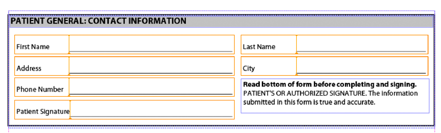
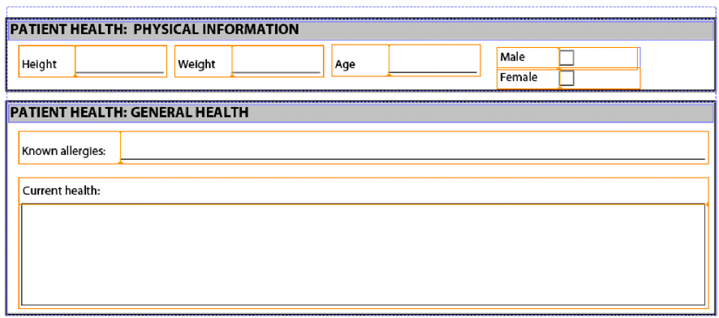

# Assembling Multiple XDP Fragments{#assembling-multiple-xdp-fragments}

You can assemble multiple XDP fragments into a single XDP document. For example, consider XDP fragments where each XDP file contains one or more subforms used to create a health form. The following illustration shows the outline view (represents the tuc018_template_flowed.xdp file used in the *Assembling multiple XDP fragments* quick start):


The following illustration shows the patient section (represents the tuc018_contact.xdp file used in the *Assembling multiple XDP fragments* quick start):



The following illustration shows the patient health section (represents the tuc018_patient.xdp file used in the *Assembling multiple XDP fragments* quick start):



This fragment contains two subforms named *subPatientPhysical* and *subPatientHealth*. Both of these sub forms are referenced in the DDX document that is passed to the Assembler service. Using the Assembler service, you can combine all of these XDP fragments into a single XDP document, as shown in the following illustration.


The following DDX document assembles multiple XDP fragments into an XDP document.

```xml
 <?xml version="1.0" encoding="UTF-8"?>
 <DDX xmlns="https://ns.adobe.com/DDX/1.0/">
         <XDP result="tuc018result.xdp">
            <XDP source="tuc018_template_flowed.xdp">
             <XDPContent insertionPoint="ddx_fragment" source="tuc018_contact.xdp" fragment="subPatientContact" required="false"/>
               <XDPContent insertionPoint="ddx_fragment" source="tuc018_patient.xdp" fragment="subPatientPhysical" required="false"/>
               <XDPContent insertionPoint="ddx_fragment" source="tuc018_patient.xdp" fragment="subPatientHealth" required="false"/>
            </XDP>
         </XDP>
 </DDX>
```

The DDX document contains an XDP `result` tag that specifies the name of the result. In this situation, the value is `tuc018result.xdp`. This value is referenced in the application logic that is used to retrieve the XDP document after the Assembler service returns the result. For example, consider the following Java application logic that is used to retrieve the assembled XDP document (notice the value is bolded):

```java
 //Iterate through the map object to retrieve the result XDP document
 for (Iterator i = allDocs.entrySet().iterator(); i.hasNext();) {
     // Retrieve the Map object’s value
     Map.Entry e = (Map.Entry)i.next();
     //Get the key name as specified in the
     //DDX document
     String keyName = (String)e.getKey();
     if (keyName.equalsIgnoreCase("tuc018result.xdp"))
                 {
         Object o = e.getValue();
         outDoc = (Document)o;
         //Save the result PDF file
         File myOutFile = new File("C:\\AssemblerResultXDP.xdp");
         outDoc.copyToFile(myOutFile);
     }
 }
```

The `XDP source` tag specifies the XDP file that represents a complete XDP document that can be used as a container for adding XDP fragments or as one of several documents that are appended together in order. In this situation, the XDP document is used only as a container (the first illustration shown in *Assembling Multiple XDP Fragments*). That is, the other XDP files are placed within the XDP container.

For each sub form, you can add an `XDPContent` element (this element is optional). In the above example, notice that there are three sub forms: `subPatientContact`, `subPatientPhysical`, and `subPatientHealth`. Both the `subPatientPhysical` subform and the `subPatientHealth` sub form are in the same XDP file, tuc018_patient.xdp. The fragment element specifies the name of the sub form, as defined in Designer.

>[!NOTE]
>
>For more information about the Assembler service, see [Services Reference for AEM Forms](https://www.adobe.com/go/learn_aemforms_services_63).

>[!NOTE]
>
>For more information about a DDX document, see [Assembler Service and DDX Reference](https://www.adobe.com/go/learn_aemforms_ddx_63).

## Summary of steps {#summary-of-steps}

To assemble multiple XDP fragments, perform the following tasks:

1. Include project files.
1. Create a PDF Assembler client.
1. Reference an existing DDX document.
1. Reference the XDP documents.
1. Set run-time options.
1. Assemble the multiple XDP documents.
1. Retrieve the assembled XDP document.

**Include project files**

Include the necessary files in your development project. If you are creating a client application by using Java, include the necessary JAR files. If you are using web services, ensure that you include the proxy files.

The following JAR files must be added to your project’s class path:

* adobe-livecycle-client.jar
* adobe-usermanager-client.jar
* adobe-assembler-client.jar
* adobe-utilities.jar (required if AEM Forms is deployed on JBoss)
* jbossall-client.jar (required if AEM Forms is deployed on JBoss)

**Create a PDF Assembler client**

Before you can programmatically perform an Assembler operation, create an Assembler service client.

**Reference an existing DDX document**

A DDX document must be referenced to assemble multiple XDP documents. This DDX document must contain `XDP result`, `XDP source`, and `XDPContent` elements.

**Reference the XDP documents**

To assemble multiple XDP documents, reference all XDP files that are used to assemble the result XDP document. Ensure that the name of the sub form contained in the XDP document that is referenced by the `source` attribute is specified in the `fragment` attribute. A sub form is defined in Designer. For example, consider the following XML.

```xml
 <XDPContent insertionPoint="ddx_fragment" source="tuc018_contact.xdp" fragment="subPatientContact" required="false"/>
```

The sub form named *subPatientContact* must be in the XDP file named *tuc018_contact.xdp*.

**Set run-time options**

You can set run-time options that control the behavior of the Assembler service while it performs a job. For example, you can set an option that instructs the Assembler service to continue processing a job if an error is encountered.

**Assemble the multiple XDP documents**

To assemble multiple XDP files, call the `invokeDDX` operation. The Assembler service returns the assembled XDP document within a collection object.

**Retrieve the assembled XDP document**

An assembled XDP document is returned within a collection object. Iterate through the collection object and save the XDP document as an XDP file. You can also pass the XDP document to another AEM Forms service, such as Output.

**See also**

[Assemble multiple XDP fragments using the Java API](assembling-multiple-xdp-fragments.md#assemble-multiple-xdp-fragments-using-the-java-api)

[Assemble multiple XDP fragments using the web service API](assembling-multiple-xdp-fragments.md#assemble-multiple-xdp-fragments-using-the-web-service-api)

[Including AEM Forms Java library files](/help/forms/developing/invoking-aem-forms-using-java.md#including-aem-forms-java-library-files)

[Setting connection properties](/help/forms/developing/invoking-aem-forms-using-java.md#setting-connection-properties)

[Programmatically Assembling PDF Documents](/help/forms/developing/programmatically-assembling-pdf-documents.md#programmatically-assembling-pdf-documents)

[Creating PDF Documents Using Fragments](/help/forms/developing/creating-document-output-streams.md#creating-pdf-documents-using-fragments)

## Assemble multiple XDP fragments using the Java API {#assemble-multiple-xdp-fragments-using-the-java-api}

Assemble multiple XDP fragments by using the Assembler Service API (Java):

1. Include project files.

   Include client JAR files, such as adobe-assembler-client.jar, in your Java project’s class path.

1. Create a PDF Assembler client.

    * Create a `ServiceClientFactory` object that contains connection properties.
    * Create an `AssemblerServiceClient` object by using its constructor and passing the `ServiceClientFactory` object.

1. Reference an existing DDX document.

    * Create a `java.io.FileInputStream` object that represents the DDX document by using its constructor and passing a string value that specifies the location of the DDX file.
    * Create a `com.adobe.idp.Document` object by using its constructor and passing the `java.io.FileInputStream` object.

1. Reference the XDP documents.

    * Create a `java.util.Map` object that is used to store input XDP documents by using a `HashMap` constructor.
    * Create a `com.adobe.idp.Document` object and pass the `java.io.FileInputStream` object that contains the input XDP file (repeat this task for each XDP file).
    * Add an entry to the `java.util.Map` object by invoking its `put` method and passing the following arguments:

        * A string value that represents the key name. This value must match the `source` element value specified in the DDX document (repeat this task for each XDP file).
        * A `com.adobe.idp.Document` object that contains the XDP document that corresponds to the `source` element (repeat this task for each XDP file).

1. Set the run-time options.

    * Create an `AssemblerOptionSpec` object that stores run-time options by using its constructor.
    * Set run-time options to meet your business requirements by invoking a method that belongs to the `AssemblerOptionSpec` object. For example, to instruct the Assembler service to continue processing a job when an error occurs, invoke the `AssemblerOptionSpec` object’s `setFailOnError` method and pass `false`.

1. Assemble the multiple XDP documents.

   Invoke the `AssemblerServiceClient` object’s `invokeDDX` method and pass the following required values:

    * A `com.adobe.idp.Document` object that represents the DDX document to use
    * A `java.util.Map` object that contains the input XDP files
    * A `com.adobe.livecycle.assembler.client.AssemblerOptionSpec` object that specifies the run-time options, including the default font and the job log level

   The `invokeDDX` method returns a `com.adobe.livecycle.assembler.client.AssemblerResult` object that contains the assembled XDP document.

1. Retrieve the assembled XDP document.

   To obtain the assembled XDP document, perform the following actions:

    * Invoke the `AssemblerResult` object’s `getDocuments` method. This method returns a `java.util.Map` object.
    * Iterate through the `java.util.Map` object until you find the resultant `com.adobe.idp.Document` object.
    * Invoke the `com.adobe.idp.Document` object’s `copyToFile` method to extract the assembled XDP document.

**See also**

[Assembling Multiple XDP Fragments](assembling-multiple-xdp-fragments.md#assembling-multiple-xdp-fragments)
[Quick Start (SOAP mode): Assembling multiple XDP fragments using the Java API](/help/forms/developing/assembler-service-java-api-quick.md#quick-start-soap-mode-assembling-multiple-xdp-fragments-using-the-java-api)
[Including AEM Forms Java library files](/help/forms/developing/invoking-aem-forms-using-java.md#including-aem-forms-java-library-files)
[Setting connection properties](/help/forms/developing/invoking-aem-forms-using-java.md#setting-connection-properties)

## Assemble multiple XDP fragments using the web service API {#assemble-multiple-xdp-fragments-using-the-web-service-api}

Assemble multiple XDP fragments by using the Assembler Service API (web service):

1. Include project files.

   Create a Microsoft .NET project that uses MTOM. Ensure that you use the following WSDL definition when setting a service reference:

   ```java
    https://localhost:8080/soap/services/AssemblerService?WSDL&lc_version=9.0.1.
   ```

   >[!NOTE]
   >
   >Replace `localhost` with the IP address of the server hosting AEM Forms.

1. Create a PDF Assembler client.

    * Create an `AssemblerServiceClient` object by using its default constructor.
    * Create an `AssemblerServiceClient.Endpoint.Address` object by using the `System.ServiceModel.EndpointAddress` constructor. Pass a string value that specifies the WSDL to the AEM Forms service, such as `https://localhost:8080/soap/services/AssemblerService?blob=mtom`). You do not need to use the `lc_version` attribute. This attribute is used when you create a service reference.
    * Create a `System.ServiceModel.BasicHttpBinding` object by getting the value of the `AssemblerServiceClient.Endpoint.Binding` field. Cast the return value to `BasicHttpBinding`.
    * Set the `System.ServiceModel.BasicHttpBinding` object’s `MessageEncoding` field to `WSMessageEncoding.Mtom`. This value ensures that MTOM is used.
    * Enable basic HTTP authentication by performing the following tasks:

        * Assign the AEM forms user name to the `AssemblerServiceClient.ClientCredentials.UserName.UserName` field.
        * Assign the corresponding password value to the `AssemblerServiceClient.ClientCredentials.UserName.Password`field.
        * Assign the `HttpClientCredentialType.Basic` constant value to the `BasicHttpBindingSecurity.Transport.ClientCredentialType`field.
        * Assign the `BasicHttpSecurityMode.TransportCredentialOnly` constant value to the `BasicHttpBindingSecurity.Security.Mode`field.

1. Reference an existing DDX document.

    * Create a `BLOB` object by using its constructor. The `BLOB` object is used to store the DDX document.
    * Create a `System.IO.FileStream` object by invoking its constructor and passing a string value that represents the file location of the DDX document and the mode in which to open the file.
    * Create a byte array that stores the content of the `System.IO.FileStream` object. You can determine the size of the byte array by getting the `System.IO.FileStream` object’s `Length` property.
    * Populate the byte array with stream data by invoking the `System.IO.FileStream` object’s `Read` method. Pass the byte array, starting position, and stream length to read.
    * Populate the `BLOB` object by assigning its `MTOM` property with the contents of the byte array.

1. Reference the XDP documents.

    * For each input XDP file, create a `BLOB` object by using its constructor. The `BLOB` object is used to store the input file.
    * Create a `System.IO.FileStream` object by invoking its constructor and passing a string value that represents the file location of the input file and the mode in which to open the file.
    * Create a byte array that stores the content of the `System.IO.FileStream` object. You can determine the size of the byte array by getting the `System.IO.FileStream` object’s `Length` property.
    * Populate the byte array with stream data by invoking the `System.IO.FileStream` object’s `Read` method. Pass the byte array, starting position, and stream length to read.
    * Populate the `BLOB` object by assigning its `MTOM` field with the contents of the byte array.
    * Create a `MyMapOf_xsd_string_To_xsd_anyType` object. This collection object is used to store input files required to create an assembled XDP document.
    * For each input file, create a `MyMapOf_xsd_string_To_xsd_anyType_Item` object.
    * Assign a string value that represents the key name to the `MyMapOf_xsd_string_To_xsd_anyType_Item` object's `key` field. This value must match the value of the element specified in the DDX document. (Perform this task for each input XDP file.)
    * Assign the `BLOB` object that stores the input file to the `MyMapOf_xsd_string_To_xsd_anyType_Item` object's `value` field. (Perform this task for each input XDP file.)
    * Add the `MyMapOf_xsd_string_To_xsd_anyType_Item` object to the `MyMapOf_xsd_string_To_xsd_anyType` object. Invoke the `MyMapOf_xsd_string_To_xsd_anyType` object's `Add` method and pass the `MyMapOf_xsd_string_To_xsd_anyType` object. (Perform this task for each input XDP document.)

1. Set run-time options.

    * Create an `AssemblerOptionSpec` object that stores run-time options by using its constructor.
    * Set run-time options to meet your business requirements by assigning a value to a data member that belongs to the `AssemblerOptionSpec` object. For example, to instruct the Assembler service to continue processing a job when an error occurs, assign `false` to the `AssemblerOptionSpec` object’s `failOnError` data member.

1. Assemble the multiple XDP documents.

   Invoke the `AssemblerServiceClient` object’s `invokeDDX` method and pass the following values:

    * A `BLOB` object that represents the DDX document
    * The `MyMapOf_xsd_string_To_xsd_anyType` object that contains the required files
    * An `AssemblerOptionSpec` object that specifies run-time options

   The `invokeDDX` method returns an `AssemblerResult` object that contains the results of the job and any exceptions that occurred.

1. Retrieve the assembled XDP document.

   To obtain the newly created XDP document, perform the following actions:

    * Access the `AssemblerResult` object’s `documents` field, which is a `Map` object that contains the resultant PDF documents.
    * Iterate through the `Map` object to obtain each resultant document. Then, cast that array member’s `value` to a `BLOB`.
    * Extract the binary data that represents the PDF document by accessing its `BLOB` object’s `MTOM` property. This returns an array of bytes that you can write out to an XDP file.

**See also**

[Assembling Multiple XDP Fragments](assembling-multiple-xdp-fragments.md#assembling-multiple-xdp-fragments)
[Invoking AEM Forms using MTOM](/help/forms/developing/invoking-aem-forms-using-web.md#invoking-aem-forms-using-mtom)
