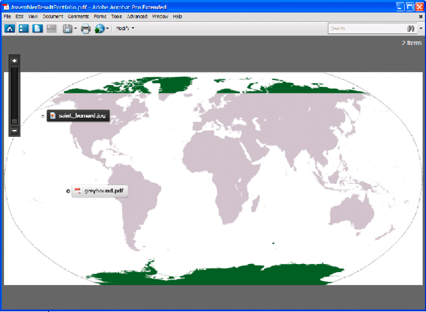

# Assembling PDF Portfolios {#assembling-pdf-portfolios} 

**Samples and examples in this document are only for AEM Forms on JEE environment.**

You can assemble a PDF Portfolio using the Assembler Java and web service API. A portfolio can combine several documents of various types, including word file, image files (for example, a jpeg file), and PDF documents. The layout of the portfolio can be set to different styles like the *Grid with Preview*, the *On an Image* layout or even *Revolve*.

The following illustration is a screenshot of a portfolio with *On an Image* style layout.



Creating a PDF Portfolio serves as a paperless alternative to passing a collection of documents. Using AEM Forms you can create portfolios by invoking the Assembler service with a structured DDX document. The following DDX document is an example of a DDX document that creates a PDF Portfolio.

```xml
 <DDX xmlns="https://ns.adobe.com/DDX/1.0/">
     <PDF result="portfolio1.pdf">
         <Portfolio>
             <Navigator source="myNavigator">
                 <Resource name="navigator/image.xxx" source="myImage.png"/>
             </Navigator>
         </Portfolio>
         <PackageFiles source="dog1"  >
              <FieldData name="X">72</FieldData>
             <FieldData name="Y">72</FieldData>
             <File filename="saint_bernard.jpg" mimetype="image/jpeg"/>
         </PackageFiles>
         <PackageFiles source="dog2"  >
             <FieldData name="X">120</FieldData>
             <FieldData name="Y">216</FieldData>
             <File filename="greyhound.pdf"/>
         </PackageFiles>
     </PDF>
 </DDX>
```

The DXX document must contain a `Portfolio` tag with a nested `Navigator` tag. Note the tag `<Resource name="navigator/image.xxx" source="myImage.png"/>` is only necessary if `myNavigator` is assigned as the onImage layout navigator: `AdobeOnImage.nav`. This tag allows the Assembler service to select the image to use as the portfolio background. Include `PackageFiles` and `File` tags to define the filename and MIME type of the packaged file.

>[!NOTE]
>
>For more information about the Assembler service, see [Services Reference for AEM Forms](https://www.adobe.com/go/learn_aemforms_services_63).

>[!NOTE]
>
>For more information about a DDX document, see [Assembler Service and DDX Reference](https://www.adobe.com/go/learn_aemforms_ddx_63).

## Summary of steps {#summary-of-steps}

To create a PDF Portfolio, perform the following tasks:

1. Include project files.
1. Create a PDF Assembler client.
1. Reference an existing DDX document.
1. Reference the required documents.
1. Set run-time options.
1. Assemble the portfolio.
1. Save the assembled portfolio.

**Include project files**

Include the necessary files in your development project. If you are creating a client application by using Java, include the necessary JAR files. If you are using web services, ensure that you include the proxy files.

The following JAR files must be added to your project’s class path:

* adobe-livecycle-client.jar
* adobe-usermanager-client.jar
* adobe-assembler-client.jar
* adobe-utilities.jar (required if AEM Forms is deployed on JBoss)
* jbossall-client.jar (required if AEM Forms is deployed on JBoss)

**Create a PDF Assembler client**

Before you can programmatically perform an Assembler operation, create an Assembler service client.

**Reference an existing DDX document**

A DDX document must be referenced to assemble a PDF Portfolio. This DDX document must contain the `Portfolio`, `Navigator` and, `PackageFiles` elements.

**Reference the required documents**

To assemble a PDF Portfolio, reference all files that represents the documents to assemble. For example, pass all image files that are specified in the DDX document to the Assembler service. Notice that these files are referenced in the DDX document specified in this section: *myImage.png* and *saint_bernard.jpg*.

When assembling a PDF Portfolio, pass a NAV file (a navigator file) to the Assembler service. The NAV file that you pass to the Assembler service depends upon what type of PDF Portfolio to create. For example, to create an *On an Image* layout, pass the AdobeOnImage.nav file. You can locate NAV files in the following folder:

`<Install folder>\Acrobat 9.0\Acrobat\Navigators`

Copy the NAV file from the Acrobat 9 (or later) installation directory. Place the NAV file in a location where your client application can access it. All files are passed to the Assembler service within a Map collection object.

>[!NOTE]
>
>The quick starts that are associated with Assembling PDF Portfolios use AdobeOnImage.nav.

**Set run-time options**

You can set run-time options that control the behavior of the Assembler service while it performs a job. For example, you can set an option that instructs the Assembler service to continue processing a job if an error is encountered.

**Assemble the portfolio**

To assemble a PDF Portfolio, you call the `invokeDDX` operation. The Assembler service returns the PDF Portfolio within a collection object.

**Save the assembled portfolio**

A PDF Portfolio is returned within a collection object. Iterate through the collection object and save PDF Portfolio as a PDF file.

**See also**

[Assemble a PDF Portfolio using the Java API](#assemble-a-pdf-portfolio-using-the-java-api)

[Assemble a PDF Portfolio using the web service API](#assemble-a-pdf-portfolio-using-the-web-service-api)

[Including AEM Forms Java library files](/help/forms/developing/invoking-aem-forms-using-java.md#including-aem-forms-java-library-files)

[Setting connection properties](/help/forms/developing/invoking-aem-forms-using-java.md#setting-connection-properties)

[Programmatically Assembling PDF Documents](/help/forms/developing/programmatically-assembling-pdf-documents.md)

## Assemble a PDF Portfolio using the Java API {#assemble-a-pdf-portfolio-using-the-java-api}

Assemble a PDF Portfolio by using the Assembler Service API (Java):

1. Include project files.

   Include client JAR files, such as adobe-assembler-client.jar, in your Java project’s class path.

1. Create a PDF Assembler client.

    * Create a `ServiceClientFactory` object that contains connection properties.
    * Create an `AssemblerServiceClient` object by using its constructor and passing the `ServiceClientFactory` object.

1. Reference an existing DDX document.

    * Create a `java.io.FileInputStream` object that represents the DDX document by using its constructor and passing a string value that specifies the location of the DDX file.
    * Create a `com.adobe.idp.Document` object by using its constructor and passing the `java.io.FileInputStream` object.

1. Reference the required documents.

    * Create a `java.util.Map` object that is used to store input PDF documents by using a `HashMap` constructor.
    * Create a `java.io.FileInputStream` object by using its constructor. Pass the location of the required NAV file (repeat this task for each file required to create a portfolio).
    * Create a `com.adobe.idp.Document` object and pass the `java.io.FileInputStream` object that contains the NAV file (repeat this task for each file required to create a portfolio).
    * Add an entry to the `java.util.Map` object by invoking its `put` method and passing the following arguments:

        * A string value that represents the key name. This value must match the value of the source element specified in the DDX document. (repeat this task for each file required to create a portfolio).
        * A `com.adobe.idp.Document` object that contains the PDF document. (repeat this task for each file required to create a portfolio).

1. Set run-time options.

    * Create an `AssemblerOptionSpec` object that stores run-time options by using its constructor.
    * Set run-time options to meet your business requirements by invoking a method that belongs to the `AssemblerOptionSpec` object. For example, to instruct the Assembler service to continue processing a job when an error occurs, invoke the `AssemblerOptionSpec` object’s `setFailOnError` method and pass `false`.

1. Assemble the portfolio.

   Invoke the `AssemblerServiceClient` object’s `invokeDDX` method and pass the following required values:

    * A `com.adobe.idp.Document` object that represents the DDX document to use
    * A `java.util.Map` object that contains the files required to build a PDF Portfolio.
    * A `com.adobe.livecycle.assembler.client.AssemblerOptionSpec` object that specifies the runtime options, including the default font and the job log level

   The `invokeDDX` method returns a `com.adobe.livecycle.assembler.client.AssemblerResult` object that contains the assembled PDF Portfolio and any exceptions that occurred.

1. Save the assembled portfolio.

   To obtain the PDF Portfolio, perform the following actions:

    * Invoke the `AssemblerResult` object’s `getDocuments` method. This method returns a `java.util.Map` object.
    * Iterate through the `java.util.Map` object until you find the resultant `com.adobe.idp.Document` object.
    * Invoke the `com.adobe.idp.Document` object’s `copyToFile` method to extract the PDF Portfolio.

**See also**

[Quick Start (SOAP mode): Assembling PDF Portfolios using the Java API](/help/forms/developing/assembler-service-java-api-quick.md#quick-start-soap-mode-assembling-pdf-portfolios-using-the-java-api)

[Including AEM Forms Java library files](/help/forms/developing/invoking-aem-forms-using-java.md#including-aem-forms-java-library-files)

[Setting connection properties](/help/forms/developing/invoking-aem-forms-using-java.md#setting-connection-properties)

## Assemble a PDF Portfolio using the web service API {#assemble-a-pdf-portfolio-using-the-web-service-api}

Assemble a PDF Portfolio by using the Assembler Service API (web service):

1. Include project files.

   Create a Microsoft .NET project that uses MTOM. Ensure that you use the following WSDL definition when setting a service reference: `http://localhost:8080/soap/services/AssemblerService?WSDL&lc_version=9.0.1`.

   >[!NOTE]
   >
   >Replace `localhost` with the IP address of the server hosting AEM Forms.

1. Create a PDF Assembler client.

    * Create an `AssemblerServiceClient` object by using its default constructor.
    * Create an `AssemblerServiceClient.Endpoint.Address` object by using the `System.ServiceModel.EndpointAddress` constructor. Pass a string value that specifies the WSDL to the AEM Forms service (for example, `http://localhost:8080/soap/services/AssemblerService?blob=mtom`). You do not need to use the `lc_version` attribute. This attribute is used when you create a service reference.
    * Create a `System.ServiceModel.BasicHttpBinding` object by getting the value of the `AssemblerServiceClient.Endpoint.Binding` field. Cast the return value to `BasicHttpBinding`.
    * Set the `System.ServiceModel.BasicHttpBinding` object’s `MessageEncoding` field to `WSMessageEncoding.Mtom`. This value ensures that MTOM is used.
    * Enable basic HTTP authentication by performing the following tasks:

        * Assign the AEM forms user name to the field `AssemblerServiceClient.ClientCredentials.UserName.UserName`.
        * Assign the corresponding password value to the field `AssemblerServiceClient.ClientCredentials.UserName.Password`.
        * Assign the constant value `HttpClientCredentialType.Basic` to the field `BasicHttpBindingSecurity.Transport.ClientCredentialType`.
        * Assign the constant value `BasicHttpSecurityMode.TransportCredentialOnly` to the field `BasicHttpBindingSecurity.Security.Mode`.

1. Reference an existing DDX document.

    * Create a `BLOB` object by using its constructor. The `BLOB` object is used to store the DDX document.
    * Create a `System.IO.FileStream` object by invoking its constructor and passing a string value that represents the file location of the DDX document and the mode in which to open the file.
    * Create a byte array that stores the content of the `System.IO.FileStream` object. You can determine the size of the byte array by getting the `System.IO.FileStream` object’s `Length` property.
    * Populate the byte array with stream data by invoking the `System.IO.FileStream` object’s `Read` method. Pass the byte array, the starting position, and the stream length to read.
    * Populate the `BLOB` object by assigning its `MTOM` property with the contents of the byte array.

1. Reference the required documents.

    * For each input file, create a `BLOB` object by using its constructor. The `BLOB` object is used to store the input file.
    * Create a `System.IO.FileStream` object by invoking its constructor and passing a string value that represents the file location of the input file and the mode in which to open the file.
    * Create a byte array that stores the content of the `System.IO.FileStream` object. You can determine the size of the byte array by getting the `System.IO.FileStream` object’s `Length` property.
    * Populate the byte array with stream data by invoking the `System.IO.FileStream` object’s `Read` method. Pass the byte array, the starting position, and the stream length to read.
    * Populate the `BLOB` object by assigning its `MTOM` field with the contents of the byte array.
    * Create a `MyMapOf_xsd_string_To_xsd_anyType` object. This collection object is used to store input files required to create a PDF Portfolio.
    * For each input file, create a `MyMapOf_xsd_string_To_xsd_anyType_Item` object.
    * Assign a string value that represents the key name to the `MyMapOf_xsd_string_To_xsd_anyType_Item` object's `key` field. This value must match the value of the element specified in the DDX document. (Perform this task for each input file.)
    * Assign the `BLOB` object that stores the input file to the `MyMapOf_xsd_string_To_xsd_anyType_Item` object's `value` field. (Perform this task for each input PDF document.)
    * Add the `MyMapOf_xsd_string_To_xsd_anyType_Item` object to the `MyMapOf_xsd_string_To_xsd_anyType` object. Invoke the `MyMapOf_xsd_string_To_xsd_anyType` object's `Add` method and pass the `MyMapOf_xsd_string_To_xsd_anyType` object. (Perform this task for each input PDF document.)

1. Set run-time options.

    * Create an `AssemblerOptionSpec` object that stores run-time options by using its constructor.
    * Set run-time options to meet your business requirements by assigning a value to a data member that belongs to the `AssemblerOptionSpec` object. For example, to instruct the Assembler service to continue processing a job when an error occurs, assign `false` to the `AssemblerOptionSpec` object’s `failOnError` data member.

1. Assemble the portfolio.

   Invoke the `AssemblerServiceClient` object’s `invokeDDX` method and pass the following values:

    * A `BLOB` object that represents the DDX document
    * The `MyMapOf_xsd_string_To_xsd_anyType` object that contains the required files
    * An `AssemblerOptionSpec` object that specifies run-time options

   The `invokeDDX` method returns an `AssemblerResult` object that contains the results of the job and any exceptions that occurred.

1. Save the assembled portfolio.

   To obtain the newly created PDF Portfolio,perform the following actions:

    * Access the `AssemblerResult` object’s `documents` field, which is a `Map` object that contains the resultant PDF documents.
    * Iterate through the `Map` object to obtain each resultant document. Then, cast that array member’s `value` to a `BLOB`.
    * Extract the binary data that represents the PDF document by accessing its `BLOB` object’s `MTOM` property. This returns an array of bytes that you can write out to a PDF file.

**See also**

[Invoking AEM Forms using MTOM](/help/forms/developing/invoking-aem-forms-using-web.md#invoking-aem-forms-using-mtom)

[Invoking AEM Forms using SwaRef](/help/forms/developing/invoking-aem-forms-using-web.md#invoking-aem-forms-using-swaref)
