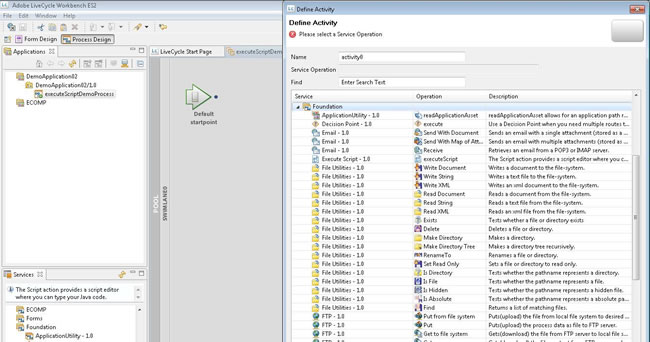
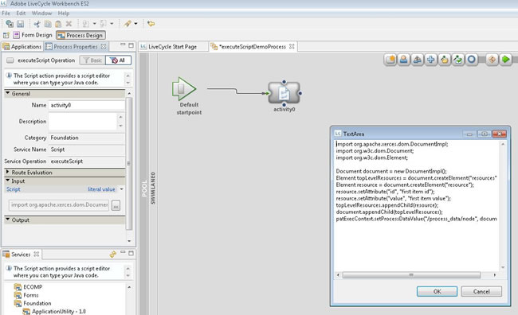

# Using the execute script service in AEM Forms on JEE Workbench to build XML data {#using-execute-script-service-forms-jee-workbench}

There is much XML involved with AEM Forms on JEE Process Management workflows, for instance: XML information may be built in a process and sent to a Flex application in AEM Forms on JEE Workspace, used for systems settings, or passing information to and from forms. There are many instances where a AEM Forms on JEE developer needs to manage XML, and many times this requires that the XML be managed via a AEM Forms on JEE process.

When dealing with simple XML settings, one may use the `Set Value` service, which is a default AEM Forms on JEE service. This service sets the value of one or more data items in the process data model. For simple conditional logic "if this, then that" scenarios, this service can suit the purpose.

However, in more complex situations, the Set Value service is not as effective. In these situations, one must rely on a more robust set of programming commands, such as those provided by a programming language like Java&trade;. Using Java&trade; to build complex XML can be much easier and more clear than building an XML document from simple text within the Set Value service. In addition, it is easier to include conditional programming in Java&trade; than within a Set Value service.

## Using the Execute Script Service in a Process {#using-execute-script-service-in-process}

Within the set of the standard AEM Forms on JEE services available in AEM Forms on JEE Workbench, is the `Execute Script` service. This service lets you execute scripts in processes and provides the `executeScript` operation to do so.

### Create an Application and a Process with the "Execute Script" Service Defined as an Activity {#create-an-application}

Overall application and process creation is out-of-scope for this tutorial, but for the sake of this instruction, an application named "DemoApplication02" has been created. Assuming that an application has already been created, you need to create a process in this application to call the executeScript service. To add a process to the application that includes the `Execute Script` service:

1. Right-click your application and select **[!UICONTROL New]**. In **[!UICONTROL New]** slide-out menu, select **[!UICONTROL Process]**. Name your process, add a description, if necessary, and select the icon you wish to represent this process. For the purposes of this tutorial, we have created a process and named it the  `executeScriptDemoProcess`.
1. Define your start points, or simple opt to add your start points later.
1. The process is now created and should automatically open in the [!UICONTROL Process Design] window. In this window, click the Activity Picker icon at the top of the Process Design window and drag the new activity onto the swim lane. At this point, the [!UICONTROL Define Activity Window] should appear (see Figure below).
   
1. The executeScript service can be found under the `Foundation` set of services. The Services name lists the object as `Execute Script – 1.0` with the Operation name `executeScript`. Click to select this item.
1. This process should now be created, and by default the [!UICONTROL Process Properties] window should appear in the pane on the left.

#### Add a Script to the Process with the "Execute Script" Service {#add-script-to-process-with-execute-script}

Once the process has been created with the "Execute Script" Service activity defined, one can then add a script to this process. To add a script to this process:

1. Navigate to the [!UICONTROL Process Properties] palette. Within this palette, expand the [!UICONTROL Input] section and click the "…" icon.

1. In the text box that appears write your script. When the script has been written, press OK (see Figure below).
   

## Creating XML Using the Execute Script Service {#create-xml-execute-script-service}

Once a process has been created with the Execute Script service included, one can then use this script to create XML. One would write the scripts described below in the text box described in the Add a script to the process with the `Execute Script` Service section above.

>[!TIP]
>
> Use the `Execute Script` Service component to write custom Java code directly within a process. However, if the task involves more than a few lines of Java code, create a custom service component for better maintainability and performance.


**About the Execute Script Service's Technology**

To know what the abilities and limitations of the Execute Script service are, one must know the technological underpinnings of the service. AEM Forms on JEE uses the Apache Xerces Document Object Model (DOM) parser to create and store XML variables within processes. Xerces is a Java&trade; implementation of W3C's [Document Object Model specification](https://dom.spec.whatwg.org/). The DOM specification is a standard way of manipulating XML that has been around since 1998. The Java&trade; implementation of Xerces, Xerces-J, supports DOM Level 2 version 1.0.

The Java&trade; classes used to store XML variables are:

* org.apache.xerces.dom.NodeImpl and

* org.apache.xerces.dom.DocumentImpl

DocumentImpl is a subclass of NodeImpl, so it can be supposed that any XML process variable is a NodeImpl derivation. See the documentation of [NodeImpl](https://xerces.apache.org/xerces-j/apiDocs/org/apache/xerces/dom/NodeImpl.html) for more details.

**A Sample XML Creation Using the Execute Script Service**

Here is the example of creating XML, within an Execute Script service. The process has a variable node that is of type XML. The result of this activity is an XML document. What that document does, or how it applies to the overall process is out-of-scope for this tutorial; ultimately it comes down to what the XML is required to do in the overall application. As was mentioned in the introduction, XML can be used for many purposes in AEM Forms on JEE forms and processes, this is simply an explanation of how to code the Execute Script activity to output a simple XML document.

A simple JavaScript to output XML would looks something like this:

```xml
import org.apache.xerces.dom.DocumentImpl;

import org.w3c.dom.Document;

import org.w3c.dom.Element;


Document document = new DocumentImpl();

Element topLevelResources = document.createElement("resources");

Element resource = document.createElement("resource");

resource.setAttribute("id", "first item id");

resource.setAttribute("value", "first item value");

topLevelResources.appendChild(resource);

document.appendChild(topLevelResources);

patExecContext.setProcessDataValue("/process_data/node", document);

```

>[!NOTE]
>
>The previously mentioned DOM objects must be imported into the script.

The result of this simple script is a new XML document with a variable node that is set to:

```xml
<resources>

<resource id="first item id" value="first item value"/>

</resources>

```

**Using an Iterative loop to Add Nodes to the XML**

Nodes can be added to an existing XML variable within the process, too. The variable, node, contains the XML object that was created.

```xml
Document document = patExecContext.getProcessDataValue("/process_data/node");

NodeList childNodes = document.getChildNodes();

int numChildren = childNodes.getLength();

for (int i = 0; i < numChildren; i++)

{

Node currentChild = childNodes.item(i);

if (currentChild.getNodeType() == Node.ELEMENT_NODE)

{

// found the top-level node

Element newResource = document.createElement("resource");

newResource.setAttribute("id", "second item id");

newResource.setAttribute("value", "second item value");

currentChild.appendChild(newResource);

break;

}

}

patExecContext.setProcessDataValue("/process_data/node", document);
The variable node in the XML is now set to:

<resources> 

<resource id="first item id" value="first item value"/> 

<resource id="second item id" value="second item value"/> 

</resources>

```