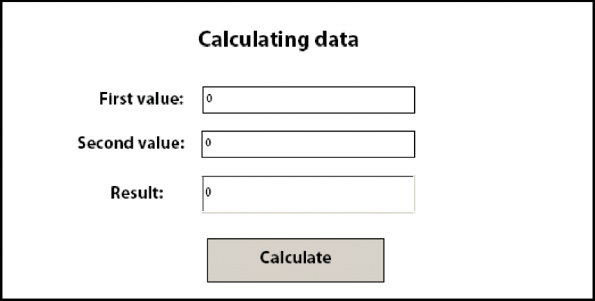

# Calculating Form Data {#calculating-form-data} 

**Samples and examples in this document are only for AEM Forms on JEE environment.**

The Forms service can calculate the values that a user enters into a form and display the results. To calculate form data, you must perform two tasks. First, you create a form design script that calculates form data. A form design supports three types of scripts. One script type runs on the client, another runs on the server, and the third type runs on both the server and the client. The script type discussed in this topic runs on the server. Server-side calculations are supported for HTML, PDF, and form Guide (deprecated) transformations.

As part of the form design process, you can use calculations and scripts to provide a richer user experience. Calculations and scripts can be added to most form fields and objects. Create a form design script to perform calculation operations on data that a user enters into an interactive form.

The user enters values into the form and clicks the Calculate button to view the results. The following process describes an example application that enables a user to calculate data:

* The user accesses an HTML page named StartLoan.html that acts as the web application's start page. This page invokes a Java Servlet named `GetLoanForm`.
* The `GetLoanForm` servlet renders a loan form. This form contains a script, interactive fields, a calculate button, and a submit button.
* The user enters values into the form's fields and clicks the Calculate button. The form is sent to the `CalculateData` Java Servlet where the script is executed. The form is sent back to the user with the calculation results displayed in the form.
* The user continues entering and calculating values until a satisfactory result is displayed. When satisfied, the user clicks the Submit button to process the form. The form is sent to another Java Servlet named `ProcessForm` that is responsible for retrieving submitted data. (See [Handling Submitted Forms](/help/forms/developing/rendering-forms.md#handling-submitted-forms).)


The following diagram shows the application's logic flow.


The following table describes the steps in this diagram.

<table>
 <thead>
  <tr>
   <th><p>Step</p></th>
   <th><p>Description</p></th>
  </tr>
 </thead>
 <tbody>
  <tr>
   <td><p>1</p></td>
   <td><p>The <code>GetLoanForm</code> Java Servlet is invoked from the HTML start page. </p></td>
  </tr>
  <tr>
   <td><p>2</p></td>
   <td><p>The <code>GetLoanForm</code> Java Servlet uses the Forms service Client API to render the loan form to the client web browser. The difference between rendering a form that contains a script configured to run on the server and rendering a form that does not contain a script is that you must specify the target location used to execute the script. If a target location is not specified, a script that is configured to run on the server is not executed. For example, consider the application introduced in this section. The <code>CalculateData</code> Java Servlet is the target location where the script is executed.</p></td>
  </tr>
  <tr>
   <td><p>3</p></td>
   <td><p>The user enters data into interactive fields and clicks the Calculate button. The form is sent to the <code>CalculateData</code> Java Servlet, where the script is executed. </p></td>
  </tr>
  <tr>
   <td><p>4</p></td>
   <td><p>The form is rendered back to the web browser with the calculation results displayed in the form. </p></td>
  </tr>
  <tr>
   <td><p>5</p></td>
   <td><p>The user clicks the Submit button when the values are satisfactory. The form is sent to another Java Servlet named <code>ProcessForm</code>.</p></td>
  </tr>
 </tbody>
</table>

Typically, a form that is submitted as PDF content contains scripts that are executed on the client. However, server-side calculations can also be executed. A Submit button cannot be used to calculate scripts. In this situation, calculations are not executed because the Forms service considers the interaction to be complete.

To illustrate the usage of a form design script, this section examines a simple interactive form that contains a script that is configured to run on the server. The following diagram shows a form design containing a script that adds values that a user enters into the first two fields and displays the result in the third field.



**A.** A field named NumericField1 **B.** A field named NumericField2 **C.** A field named NumericField3

The syntax of the script in this form design is as follows:

```javascript
     NumericField3 = NumericField2 + NumericField1
```

In this form design, the Calculate button is a command button, and the script is in this button's `Click` event. When a user enters values into the first two fields (NumericField1 and NumericField2) and clicks the Calculate button, the form is sent to the Forms service, where the script is executed. The Forms service renders the form back to the client device with the results of the calculation displayed in the NumericField3 field.

>[!NOTE]
>
>For information about creating a form design script, see [Forms Designer](https://www.adobe.com/go/learn_aemforms_designer_63).

>[!NOTE]
>
>For more information about the Forms service, see [Services Reference for AEM Forms](https://www.adobe.com/go/learn_aemforms_services_63).

## Summary of steps {#summary-of-steps}

To calculate form data, perform the following tasks:

1. Include project files.
1. Create a Forms Client API object.
1. Retrieve a form containing a calculation script.
1. Write the form data stream back to the client web browser

**Include project files**

Include necessary files into your development project. If you are creating a client application using Java, include the necessary JAR files. If you are using web services, ensure that you include the proxy files.

**Create a Forms Client API object**

Before you can programmatically perform a Forms service Client API operation, you must create a Forms service client. If you are using the Java API, create a `FormsServiceClient` object. If you are using the Forms web service API, create a `FormsServiceService` object.

**Retrieve a form containing a calculation script**

You use the Forms service Client API to create application logic that handles a form that contains a script configured to run on the server. The process is similar to handling a submitted form. (See [Handling Submitted Forms](/help/forms/developing/handling-submitted-forms.md).)

Verify that the processing state associated with the submitted form is `1` `(Calculate)`, which means that the Forms service is performing a calculation operation on the form data and the results must be written back to the user. In this situation, a script configured to run on the server is automatically executed.

**Write the form data stream back to the client web browser**

After you verify the processing state associated with a submitted form is `1`, you must write the results back to the client web browser. When the form is displayed, the calculated value will appear in the appropriate field(s).

**See also**

[Including AEM Forms Java library files](/help/forms/developing/invoking-aem-forms-using-java.md#including-aem-forms-java-library-files)
[Calculate form data using the Java API](/help/forms/developing/calculating-form-data.md#calculate-form-data-using-the-java-api)
[Calculate form data using the web service API](/help/forms/developing/calculating-form-data.md#calculate-form-data-using-the-web-service-api)
[Setting connection properties](/help/forms/developing/invoking-aem-forms-using-java.md#setting-connection-properties)
[Forms Service API Quick Starts](/help/forms/developing/forms-service-api-quick-starts.md#forms-service-api-quick-starts)
[Rendering Interactive PDF Forms](/help/forms/developing/rendering-interactive-pdf-forms.md)
[Creating Web Applications that Renders Forms](/help/forms/developing/creating-web-applications-renders-forms.md)

## Calculate form data using the Java API {#calculate-form-data-using-the-java-api}

Calculate form data by using the Forms API (Java):

1. Include project files

   Include client JAR files, such as adobe-forms-client.jar in your Java project's class path.

1. Create a Forms Client API object

    * Create a `ServiceClientFactory` object that contains connection properties.
    * Create an `FormsServiceClient` object by using its constructor and passing the `ServiceClientFactory` object.

1. Retrieve a form containing a calculation script

    * To retrieve form data that contains a calculation script, create a `com.adobe.idp.Document` object by using its constructor and invoking the `javax.servlet.http.HttpServletResponse` object's `getInputStream` method from within the constructor.
    * Invoke the `FormsServiceClient` object's `processFormSubmission` method and pass the following values:

        * The `com.adobe.idp.Document` object that contains the form data.
        * A string value that specifies environment variables including all relevant HTTP headers. Specify the content type to handle by specifying one or more values for the `CONTENT_TYPE` environment variable. For example, to handle XML and PDF data, specify the following string value for this parameter: `CONTENT_TYPE=application/xml&CONTENT_TYPE=application/pdf`
        * A string value that specifies the `HTTP_USER_AGENT` header value; for example, `Mozilla/4.0 (compatible; MSIE 6.0; Windows NT 5.1; SV1; .NET CLR 1.1.4322)`.
        * A `RenderOptionsSpec` object that stores run-time options.

      The `processFormSubmission` method returns a `FormsResult` object containing the results of the form submission.

    * Verify that the processing state associated with a submitted form is `1` by invoking the `FormsResult` object's `getAction` method. If this method returns the value `1`, the calculation was performed and the data can be written back to the client web browser.

1. Write the form data stream back to the client web browser

    * Create a `javax.servlet.ServletOutputStream` object used to send a form data stream to the client web browser.
    * Create a `com.adobe.idp.Document` object by invoking the `FormsResult` object 's `getOutputContent` method.
    * Create a `java.io.InputStream` object by invoking the `com.adobe.idp.Document` object's `getInputStream` method.
    * Create a byte array and populate it with the form data stream by invoking the `InputStream` object's `read` method and passing the byte array as an argument.
    * Invoke the `javax.servlet.ServletOutputStream` object's `write` method to send the form data stream to the client web browser. Pass the byte array to the `write` method.

**See also**


[Including AEM Forms Java library files](/help/forms/developing/invoking-aem-forms-using-java.md#including-aem-forms-java-library-files)
[Setting connection properties](/help/forms/developing/invoking-aem-forms-using-java.md#setting-connection-properties)

## Calculate form data using the web service API {#calculate-form-data-using-the-web-service-api}

Calculate form data by using the Forms API (web service):

1. Include project files

    * Create Java proxy classes that consume the Forms service WSDL.
    * Include the Java proxy classes into your class path.

1. Create a Forms Client API object

   Create a `FormsService` object and set authentication values.

1. Retrieve a form containing a calculation script

    * To retrieve form data that was posted to a Java Servlet, create a `BLOB` object by using its constructor.
    * Create a `java.io.InputStream` object by using the `javax.servlet.http.HttpServletResponse` object's `getInputStream` method.
    * Create a `java.io.ByteArrayOutputStream` object by using its constructor and passing the length of the `java.io.InputStream` object.
    * Copy the contents of the `java.io.InputStream` object into the `java.io.ByteArrayOutputStream` object.
    * Create a byte array by invoking the `java.io.ByteArrayOutputStream` object's `toByteArray` method.
    * Populate the `BLOB` object by invoking its `setBinaryData` method and passing the byte array as an argument.
    * Create a `RenderOptionsSpec` object by using its constructor. Set the locale value by invoking the `RenderOptionsSpec` object's `setLocale` method and passing a string value that specifies the locale value.
    * Invoke the `FormsServiceClient` object's `processFormSubmission` method and pass the following values:

        * The `BLOB` object that contains the form data.
        * A string value that specifies environment variables included all relevant HTTP headers. For example, you can specify the following string value: `HTTP_REFERER=referrer&HTTP_CONNECTION=keep-alive&CONTENT_TYPE=application/xml`
        * A string value that specifies the `HTTP_USER_AGENT` header value; for example, `Mozilla/4.0 (compatible; MSIE 6.0; Windows NT 5.1; SV1; .NET CLR 1.1.4322)`.
        * A `RenderOptionsSpec` object that stores run-time options. For more information, .
        * An empty `BLOBHolder` object that is populated by the method.
        * An empty `javax.xml.rpc.holders.StringHolder` object that is populated by the method.
        * An empty `BLOBHolder` object that is populated by the method.
        * An empty `BLOBHolder` object that is populated by the method.
        * An empty `javax.xml.rpc.holders.ShortHolder` object that is populated by the method.
        * An empty `MyArrayOf_xsd_anyTypeHolder` object that is populated by the method. This parameter is used to store file attachments that are submitted along with the form.
        * An empty `FormsResultHolder` object that is populated by the method with the form that is submitted.

      The `processFormSubmission` method populates the `FormsResultHolder` parameter with the results of the form submission. The `processFormSubmission` method returns a `FormsResult` object containing the results of the form submission.

    * Verify that the processing state associated with a submitted form is `1` by invoking the `FormsResult` object's `getAction` method. If this method returns the value `1`, the calculation was performed and the data can be written back to the client web browser.

1. Write the form data stream back to the client web browser

    * Create a `javax.servlet.ServletOutputStream` object used to send a form data stream to the client web browser.
    * Create a `BLOB` object that contains form data by invoking the `FormsResult` object's `getOutputContent` method.
    * Create a byte array and populate it by invoking the `BLOB` object's `getBinaryData` method. This task assigns the content of the `FormsResult` object to the byte array.
    * Invoke the `javax.servlet.http.HttpServletResponse` object's `write` method to send the form data stream to the client web browser. Pass the byte array to the `write` method.

**See also**
[Invoking AEM Forms using Base64 encoding](/help/forms/developing/invoking-aem-forms-using-web.md#invoking-aem-forms-using-base64-encoding)
