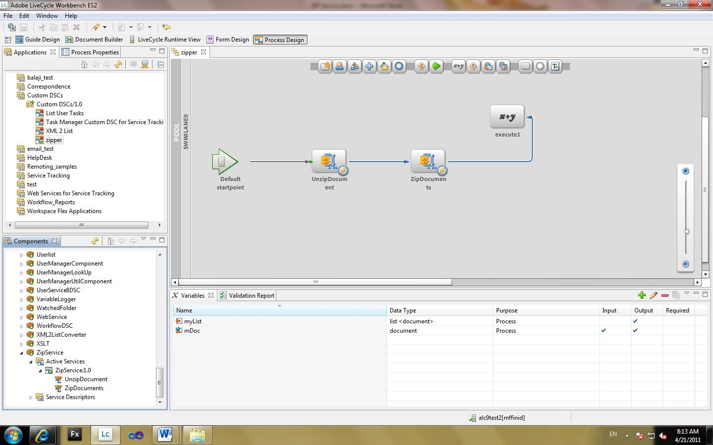
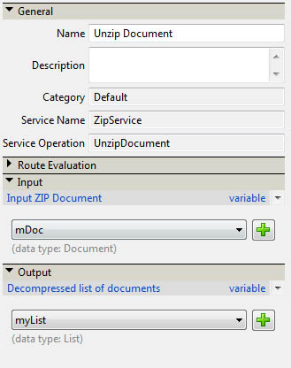
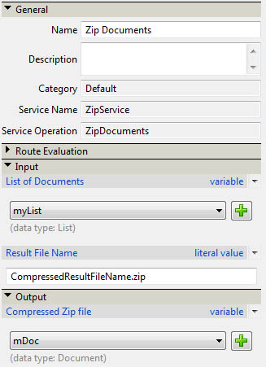
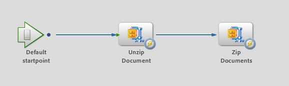

# Compressing and decompressing files using a AEM Forms on JEE Custom DSC {#compressing-decompressing-files}

## Prerequisite knowledge {#prerequisites}

Experience with AEM Forms on JEE Process Management, basic Java programming, and creating custom Component.

**Additional required other products**

Java editor such as [Eclipse](https://www.eclipse.org/) or [Netbeans IDE](https://netbeans.apache.org/)

## User level {#user-level}

Intermediate

AEM Forms on JEE enables developers to create custom DSC (Document Service Container) to create enriched out of the box features. Creating such components are pluggable to the AEM Forms on JEE runtime environment and serves the intended purpose. This article explains how to create a custom ZIP Service which can be used to compress a list of files into a .zip file and decompress a .zip to a list of documents.

## Creating a custom DSC component {#create-custom-dsc-component}

Create a custom DSC component with two service operations to compress and decompress list of documents. This component uses java.util.zip package for compression and decompression. Follow the below steps to create a custom component:

1. Add the adobe-livecycle-client.jar file to the library
1. Add the required Icons
1. Create a public class
1. Create two public methods named UnzipDocument & ZipDocuments
1. Write the logic for Compression & Decompression

The code can be found here:

```java
/*
 * Custom DSC : ZIP Utility
 * Purpose: This is a LiveCycle ES2 custom component used to Compress & Decompress List of Documents
 * Author: Nithiyanandam Dharmadass
 * Organization: Ministry of Finance, Kingdom of Bahrain
 * Last modified Date: 18/Apr/2011
 */
package nith.lces2.dsc;

import java.util.zip.ZipEntry;
import java.util.zip.ZipInputStream;
import com.adobe.idp.Document;
import java.io.ByteArrayOutputStream;
import java.io.InputStream;
import java.util.ArrayList;
import java.util.List;
import java.util.zip.ZipOutputStream;

public class ZIPService {

    static final int BUFFER = 2048; // 2MB buffer size

    public java.util.List UnzipDocument(com.adobe.idp.Document zipDocument) throws Exception {
        ZipInputStream zis = new ZipInputStream(zipDocument.getInputStream());

        ZipEntry zipFile;

        List resultList = new ArrayList();

        while ((zipFile = zis.getNextEntry()) != null) {

            ByteArrayOutputStream byteArrayOutStream = new ByteArrayOutputStream();

            int count;  // an int variable to hold the number of bytes read from input stream
            byte data[] = new byte[BUFFER];
            while ((count = zis.read(data, 0, BUFFER)) != -1) {
                byteArrayOutStream.write(data, 0, count);   // write to byte array
            }

            com.adobe.idp.Document unzippedDoc = new Document(byteArrayOutStream.toByteArray());  // create an idp document
            unzippedDoc.setAttribute("file", zipFile.getName());
            unzippedDoc.setAttribute("wsfilename", zipFile.getName());  // update the wsfilename attribute
            resultList.add(unzippedDoc);
        }
        return resultList;  // List of uncompressed documents
    }

    public com.adobe.idp.Document ZipDocuments(java.util.List listOfDocuments,java.lang.String zipFileName) throws Exception {

        if (listOfDocuments == null || listOfDocuments.size() == 0) {
            return null;
        }

        ByteArrayOutputStream byteArrayOutStream = new ByteArrayOutputStream();
        ZipOutputStream zos = new ZipOutputStream(byteArrayOutStream);  // ZIP Output Stream

        for (int i = 0; i < listOfDocuments.size(); i++) {
            Document doc = (Document) listOfDocuments.get(i);
            InputStream docInputStream = doc.getInputStream();
            ZipEntry zipEntry = new ZipEntry(doc.getAttribute("file").toString());
            zos.putNextEntry(zipEntry);
            int count;
            byte data[] = new byte[BUFFER];
            while ((count = docInputStream.read(data, 0, BUFFER)) != -1) {
                zos.write(data, 0, count);  // Read document content and add to zip entry
            }
            zos.closeEntry();
        }
        zos.flush();
        zos.close();

        Document zippedDoc = new Document(byteArrayOutStream.toByteArray());
        if(zipFileName==null || zipFileName.equals(""))
        {
            zipFileName = "CompressedList.zip";
        }
        zippedDoc.setAttribute("file", zipFileName);
        return zippedDoc;
    }
}

```

## Creating a Component.XML file {#create-component-xml-file}

A component.xml file must be created within the root folder of the package which defined the service operations and their parameters.

The component.xml file is shown here:

```xml
<?xml version="1.0" encoding="UTF-8"?>
<component xmlns="https://adobe.com/idp/dsc/component/document">
<!-- Unique id identifying this component -->
   <component-id>ZipService</component-id>

<!-- Version -->
   <version>1.0</version>

<!-- Start of the Service definition -->
   <services>
<!-- Unique name for service descriptor.
           The value is used as the default name for
           deployed services -->
      <service name="ZipService">
<!-- service implementation class definition -->
        <implementation-class>nith.lces2.dsc.ZIPService</implementation-class>

<!-- description -->
        <description>Compress or Decompress list of documents</description>

<!--  You can provide your own icons for a distinct look   -->
          <small-icon>icons/Zip_icon16.png</small-icon>
          <large-icon>icons/Zip_icon32.png</large-icon>


<!-- automatically deploys the service and starts it after installation -->
         <auto-deploy service-id="ZipService" />

         <operations>
<!-- method name in the interface setSmtpHost-->
            <operation name="UnzipDocument">
<!-- input parameters to the "send" method -->
              <input-parameter name="zipDocument" title="Input ZIP Document" type="com.adobe.idp.Document">
                    <hint>A ZIP File to be decompressed</hint>
                </input-parameter>
                <output-parameter name="resultList" title="Decompressed list of documents" type="java.util.List">
                    <hint>Decompressed ZIP list</hint>
                </output-parameter>
            </operation>
            <operation name="ZipDocuments">
<!-- input parameters to the "send" method -->
              <input-parameter name="listOfDocuments" title="List of Documents" type="java.util.List">
                    <hint>A list of documents to be Compressed</hint>
                </input-parameter>
                <input-parameter name="zipFileName" title="Result File Name" type="java.lang.String">
                    <hint>The name of compressed file (optional)</hint>
                </input-parameter>

                <output-parameter name="zippedDoc" title="Compressed Zip file" type="com.adobe.idp.Document">
                    <hint>Compressed ZIP File</hint>
                </output-parameter>
            </operation>
             </operations>
      </service>
   </services>
</component>

```

## Packaging and deploying the component {#packaging-deploying-component}

1. Compile the java project and create a .JAR file.
1. Deploy the component (.JAR file) to the AEM Forms on JEE runtime through Workbench.
1. Start the service from Workbench (see Figure below).



## Using the ZIP service in workflows {#using-zip-service-in-workflows}

The UnzipDocument operation of the custom service can now accept a document variable as input and return a list of document variables as output.



Similarly the ZipDocuments operation of the custom component can accept a list of documents as input, compress them as a zip file and return the compressed document.



The following workflow orchestration shows how to decompress the given ZIP file, compress them back to another ZIP file, and returns output (see Figure below).



## Some business use cases {#business-use-cases}

You can use this ZIP Service for the following use cases:

* Find all files in a given folder and return the files as a compressed document.

* Supply a ZIP file containing a number of PDF documents which can be reader extended after decompressing them. This requires AEM Forms on JEE Reader Extensions module.

* Supply a ZIP file containing heterogeneous type of document which can be decompressed and converted as PDF document using Generate PDF service.

* Policy protect a list of documents and return as a ZIP file.

* Allow users to download all the attachments of a process instance as a single ZIP file.
