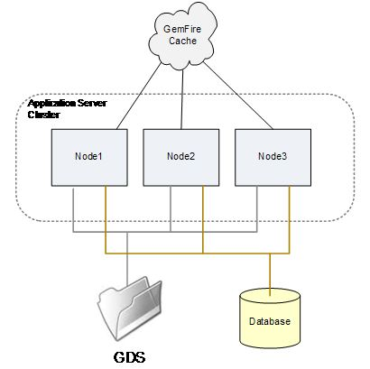
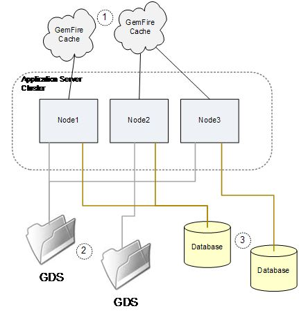

# Configuring and troubleshooting an AEM Forms on JEE server cluster {#configuring-troubleshooting-aem-forms-jee-server-cluster}

## Prerequisite knowledge {#prerequisites}

Familiarity with Adobe Experience Manager (AEM) Forms on JEE, JBoss&reg;, WebSphere&reg;, and WebLogic application servers, Red Hat&reg; Linux&reg;, SUSE&reg; Linux&reg;, Microsoft&reg; Windows, IBM&reg; AIX&reg;, or Sun Solaris&trade; operating systems, Oracle, IBM&reg; DB2&reg;, or SQL Server database servers, and web environments.

## User level {#user-level}

Advanced

An AEM Forms on JEE Cluster is a topology that is designed to enable AEM Forms on JEE to be resilient to the failure of a cluster. It also allows the  topology to scale system capacity beyond the abilities of a single node. A cluster combines multiple nodes into a single logical system that shares data and allows transactions to span multiple nodes in their execution. A cluster is the most general way to scale AEM Forms on JEE, in that any combination of services handling any combination of workloads can be supported. An AEM Forms on JEE cluster is not necessarily the best fit for all types of deployments and, a non-clustered server load-balanced architecture may be appropriate.

This document discusses the specific configuration requirements and potential problem areas that you may encounter with an AEM Forms on JEE cluster.

## What's in a cluster? {#what-is-in-cluster}

The AEM Forms on JEE cluster nodes communicate among themselves and share information to enable the cluster as a whole to have a single consistent configuration and application state. The sharing of information within the cluster is done in several different ways simultaneously that are used in different contexts. The basic information sharing methods are illustrated in Figure below:



### Application server cluster {#application-server-cluster}

An AEM Forms on JEE cluster relies on the underlying application server's clustering capabilities. Application server clusters enable the cluster configuration to be managed as a whole and provide low-level cluster services like Java&trade; Naming and Directory Interface (JNDI) that enable software components to find one another within the cluster. The sophistication of cluster services and the underlying technical dependencies that the application server has, depend on the application server. WebSphere&reg; and WebLogic have sophisticated management capabilities for clusters, while JBoss&reg; has a basic approach.

### GemFire cache {#gemfire-cache}

The GemFire cache is a distributed cache mechanism implemented in each cluster node. The nodes find each other and build a single logical cache that is kept coherent between the nodes. The nodes that find each other join to maintain a single notional cache that is shown as a cloud in Figure 1. Unlike the GDS and database, the cache is a purely notional entity. The actual cached content is stored in memory and in the `LC_TEMP` directory on each of the cluster nodes.

### Database {#database}

The AEM Forms on JEE database&ndash;which is accessed by way of the JDBC data sources IDP_DS, EDC_DS, and others&ndash;is shared by all nodes of the cluster. Most persistent data regarding the state of AEM Forms on JEE&ndash;such as what transactions are in progress, the user data associated with ongoing transactions, and data regarding how system settings have been set&ndash;is in this database.

### Global Document Storage {#global-document-storage}

The Global Document Storage (GDS) is a file system-based storage area used by the Document Manager (IDPDocument class) within AEM Forms on JEE. The GDS stores short-lived and long-lived files that must be accessible to all nodes of the cluster.

### Other items {#other-items}

In addition to these main shared resources, there are other items that have a specific cluster behavior, such as Quartz. Quartz is a scheduler subsystem used by AEM Forms on JEE, and it uses database tables to hold its knowledge of what has been scheduled and what scheduled activities are running. Quartz must be configured differently for single-node installations and clusters, and it takes its cue from other AEM Forms on JEE settings.

## Common configuration problems {#common-configuration}

One of the most frustrating things about maintaining or troubleshooting an AEM Forms on a JEE cluster is that there is no single place to look to confirm positively that the cluster is healthy. To confirm that all is well in the cluster takes some investigation and analysis, and there are several modes of failure for cluster operation, depending on what is wrong with the cluster configuration. Figure below illustrates a badly configured cluster in which several of the shared resources are improperly shared.



Understand the way clustering works and the kinds of things that you can look for and verify in a cluster, even if you do not intend to run AEM Forms on JEE in a cluster. The reason is because some parts of AEM Forms on JEE may take their cues about operating in a cluster incorrectly, and take on cluster behavior you do not expect.

So what's wrong with the sharing configuration from Figure above? The following sections describe the problems:

### (1) GemFire cluster configuration {#gemfire-cluster-configuration}

Several things can go wrong with the Gemfire cache. Two typical scenarios are:

* Nodes that ought to be able to find each other are unable to do so.

* Nodes that are clustered can find each other, and share a cache when they should not.

If you have nodes that you intend to cluster, they need to find each other on the network. By default, they do this with multicast UDP messages. Each node sends out broadcast messages advertising that it is present, and any node that receives such a message begins to talk to the other nodes that it finds. This kind of method of autodiscovery is common, and many types of software and appliances do this.

One common problem with autodiscovery is that multicast messages may be filtered by the network. This may be part of a network policy, or due to software firewall rules, or because they cannot route across the network that exists between nodes. Because of the general difficulty with getting UDP autodiscovery to work in complex networks, it is common practice for production deployments to use an alternative discovery method: TCP locators. A general discussion of TCP locators can be found in the references.

**How do I know if I am using locators or UDP?**

The following JVM properties control the method the GemFire cache uses to find other nodes.

Multicast settings:

* `adobe.cache.multicast-port`: The multicast port used to communicate with other members of the distributed system. If this is set to zero, multicast is disabled for both member discovery and distribution.

* `gemfire.mcast-address` (optional): Overrides the default IP address used by Gemfire.

TCP Locator settings:

* `adobe.cache.cluster-locators`: The IP address/host name of the TCP locator and TCP locator port for all locators used by system members to communicate with running locators.

The list must include all locators currently in use, and must be configured consistently for every member of the cluster system.

If the TCP Locator list is empty, locators are not used and the multicast method is used instead.

**How can I check if my TCP locator is running?**

First, if TCP locators are in use, you should have your TCP locators listed in the following JVM property on all cluster nodes:

`-Dadobe.cache.cluster-locators=aix01.adobe.com[22345],aix02.adobe.com[22345]`

It is not necessary to run the locators on the AEM Forms on JEE cluster nodes—they can be run on other systems separate from the cluster, if desired. More than one system can run locators. And, it is considered best practice to have locators running in two locations against the possibility that a single failure of the locators could cause a problem with cluster restart. On each of the systems running locators, you should be able to verify that they are running using the following commands on those machines:

`netstat -an | grep 22345`

The expected response should be this:

`tcp 0 0 *.22345 *.* LISTEN`

Another verification command is this:

`ps -ef | grep gemfire`

The expected response should look something like this:

`livecycl 331984 1 0 10:14:51 pts/0 0:03 java -cp ./gemfire.jar: -Dgemfire.license-type=production -Dlocators=localhost[22345] com.gemstone.gemfire.distributed.Locator 22345`

**How do I see what nodes GemFire thinks are in the cluster?**

GemFire produces logging information that can be used to diagnose what cluster members have been found and adopted by the GemFire cache. This can be used to verify that all the correct cluster members are found and that no extra or incorrect cluster node discovery is happening. The log file for GemFire is in the configured AEM Forms on JEE temporary directory:

`.../LC_TEMP/adobeZZ__123456/Caching/Gemfire.log`

The numeric string after `adobeZZ_` is unique to the server node, and so you must search the actual contents of your temporary directory. The two characters after `adobe` depend on the application serve type: either `wl`, `jb`, or `ws`.

The following sample logs show what happens when a two-node cluster finds itself.

On the first node, AP-HP8:

```xml

[config 2011/08/05 09:28:09.143 EDT GemfireCacheAdapter <server.startup : 0> tid=0x65] This member, ap-hp8(4268):18763, is becoming group coordinator.
[info 2011/08/05 09:28:09.151 EDT GemfireCacheAdapter <server.startup : 0> tid=0x65] Entered into membership in group GF6.5.1.17 with ID ap-hp8(4268)<v0>:18763/56449.
[info 2011/08/05 09:28:09.152 EDT GemfireCacheAdapter <server.startup : 0> tid=0x65] Starting DistributionManager ap-hp8(4268)<v0>:18763/56449.
[info 2011/08/05 09:28:09.153 EDT GemfireCacheAdapter <server.startup : 0> tid=0x65] Initial (membershipManager) view =  [ap-hp8(4268)<v0>:18763/56449]
[info 2011/08/05 09:28:09.153 EDT GemfireCacheAdapter <server.startup : 0> tid=0x65] Admitting member <ap-hp8(4268)<v0>:18763/56449>. Now there are 1 non-admin member(s).
[info 2011/08/05 09:28:09.154 EDT GemfireCacheAdapter <server.startup : 0> tid=0x65] ap-hp8(4268)<v0>:18763/56449 is the elder and the only member.
[info 2011/08/05 09:28:09.163 EDT GemfireCacheAdapter <server.startup : 0> tid=0x65] Did not hear back from any other system. I am the first one.
[info 2011/08/05 09:28:09.164 EDT GemfireCacheAdapter <server.startup : 0> tid=0x65] DistributionManager ap-hp8(4268)<v0>:18763/56449 started on 239.192.81.1[33456]. There were 0 other DMs. others: []
[info 2011/08/05 09:28:20.841 EDT GemfireCacheAdapter <Pooled Message Processor 1> tid=0xc4] New administration member detected at ap-hp7(2821)<v1>:19498/59136.

```

On the other node, AP-HP7:

```xml

[info 2011/08/05 09:28:09.830 EDT GemfireCacheAdapter <server.startup : 0> tid=0x64] Attempting to join distributed system whose membership coordinator is ap-hp8(4268)<v0>:18763 using membership ID ap-hp7(2821):19498
[info 2011/08/05 09:28:10.058 EDT GemfireCacheAdapter <server.startup : 0> tid=0x64] Entered into membership in group GF6.5.1.17 with ID ap-hp7(2821)<v1>:19498/59136.
[info 2011/08/05 09:28:10.059 EDT GemfireCacheAdapter <server.startup : 0> tid=0x64] Starting DistributionManager ap-hp7(2821)<v1>:19498/59136.
[info 2011/08/05 09:28:10.060 EDT GemfireCacheAdapter <server.startup : 0> tid=0x64] Initial (membershipManager) view =  [ap-hp8(4268)<v0>:18763/56449, ap-hp7(2821)<v1>:19498/59136]
[info 2011/08/05 09:28:10.060 EDT GemfireCacheAdapter <server.startup : 0> tid=0x64] Admitting member <ap-hp8(4268)<v0>:18763/56449>. Now there are 1 non-admin member(s).
[info 2011/08/05 09:28:10.060 EDT GemfireCacheAdapter <server.startup : 0> tid=0x64] Admitting member <ap-hp7(2821)<v1>:19498/59136>. Now there are 2 non-admin member(s).
[info 2011/08/05 09:28:10.128 EDT GemfireCacheAdapter <server.startup : 0> tid=0x64] DistributionManager ap-hp7(2821)<v1>:19498/59136 started on 239.192.81.1[33456]. There were 1 other DMs. others: [ap-hp8(4268)<v0>:18763/56449]

```

**What if GemFire is finding nodes that it should not?**

Each distinct cluster that shares a corporate network should use a separate set of TCP locators, if TCP locators are used, or a separate UDP port number if multicast UDP configuration is used. Because UDP autodiscovery is the default configuration for AEM Forms on JEE, and the same default port 33456 is in use by multiple clusters, it is possible that clusters that should not be attempting to communicate, may be unexpectedly doing so. For example, the production and QA clusters should remain separate, but may connect to each other by way of UDP multicast.

The most common situation when you might discover duplicate ports in a network to which GemFire is improperly clustering is during the Bootstrap of a cluster. What you may find is that the Bootstrap process fails without clear cause. Typically, errors such as this are seen:

```xml

Caused by: com.ibm.ejs.container.UnknownLocalException: nested exception is: com.adobe.pof.schema.ObjectTypeNotFoundException: Object Type: dsc.sc_service_configuration not found.
                at com.adobe.pof.schema.POFDefaultDomain.getObjectType(POFDefaultDomain.java:93)
                at com.adobe.idp.dsc.initializer.DSCInitializerBean.serviceConfigAuditAttributeExists(DSCInitializerBean.java:225)
                at com.adobe.idp.dsc.initializer.DSCInitializerBean.installSchema(DSCInitializerBean.java:186)
                at com.adobe.idp.dsc.initializer.DSCInitializerBean.bootstrap(DSCInitializerBean.java:94)
                at com.adobe.idp.dsc.initializer.EJSLocalStatelessDSCInitializerBeanLocalEJB_7bb34e85.bootstrap(Unknown Source)
                at com.adobe.livecycle.bootstrap.bootstrappers.DSCBootstrapper.bootstrap(DSCBootstrapper.java:68)

```

In this case, the bootstrapper is working with GemFire to access the required tables. And, there is an inconsistency between the tables accessed through JDBC and the cached table information returned by GemFire, which is coming from a different cluster with a different underlying database.

Although a duplicate port often becomes evident during Bootstrap, it is possible for this situation to show up later. This can occur when a cluster is restarted after being down when the Bootstrap of the other cluster occurred. Or, when the network configuration is changed to make clusters that were previously isolated, for multicast purposes, visible to one another.

To diagnose these situations, look at the GemFire logs and carefully consider whether only the expected nodes are being found. To correct the problem, it is necessary to change the `adobe.cache.multicast-port` property to a different value on one or both of the clusters.

### 2) GDS Sharing {#gds-sharing}

GDS sharing is configured outside AEM Forms on JEE itself, at the O/S level, where you must arrange for the same shared directory structure to be available to all cluster nodes. On Windows-type systems, this is accomplished by setting up a file share either from one node to the other, or from a remote filesystem such as a NAS appliance to all the nodes. On UNIX&reg; systems, GDS sharing is typically accomplished by way of NFS file share, again, either from one node to the other, or from a NAS appliance.

A possible failure mode for the cluster is if this remote file share becomes unavailable, or has subtle problems. A remote mount might fail due to network problems, security settings, or incorrect configuration. A system reboot can cause configuration changes made days or weeks beforehand to come into effect, and this can cause surprises.

**What would happen if an NFS share fails to mount?**

On UNIX&reg;, the way that NFS mounts are mapped to the directory structure can allow for an apparently usable GDS directory to be available, even if the mount fails. Consider:

* NAS server: NFS shared folder /u01/iapply/livecycle_gds
* Node 1: a mount point to the shared folder (hosted on the DB server) located here: /u01/iapply/livecycle_gds
* Node 2: a mount point to the shared folder (hosted on the DB server) located here: /u01/iapply/livecycle_gds

* LCES specifies the path to GDS: /u01/iapply/livecycle_gds

If the mount on Node 1 fails, the directory structure still contains a path `/u01/iapply/livecycle_gds` to the empty mount point, and the node appears to run correctly. But because the GDS content is not actually being shared with the other node, the cluster does not operate properly. This can and does happen, and the result is that the cluster fails in mysterious ways.

The best practice is to arrange things so that the Linux&reg; mount point is not used as the root of the GDS, but instead some directory within it is used as the GDS root:

* If you have an NFS server, it may have a directory: /some/storage/lc_cluster_dev/LC_GDS
* And on your cluster node you have a mount point: /u01/iapply/shared
* Mount nfs_server: /some/storage/lc_cluster_dev/u01/iapply/shared
* Point your GDS to /u01/iapply/shared/LC_GDS

Now, if for some reason the mount does not succeed, the bare mount point does not contain an LC_GDS directory and your cluster fails predictably because it cannot find any GDS.

**How can I verify that all the nodes see the same GDS and have permissions?**

Verification of GDS access and sharing is best done by accessing each of the nodes as an interactive user. You can do this either by way of SSH or telnet to UNIX&reg; nodes, or by way of remote desktop to Windows systems. You should be able to navigate to the configured GDS directory or file system on each node and create test files from every node that are visible in all other nodes.

Pay attention to the user ID under which AEM Forms on JEE operates. On Windows turnkey installations, this is as a local administrator. On UNIX&reg;, it may be as a specific service user configured in the startup script or in the application server configuration. It is important that this user ID is able to create and manipulate GDS files equally on all nodes.

On UNIX&reg; systems, NFS configurations often default to distrust root ownership or root access rights to files and objects. If you are running the application server as the root user, you may find that you must specify options on the NFS server, the node mounting the files, or both. Doing so allows bilateral access and control of files created by one node and accessed by another.

### (3) Database sharing {#database-sharing}

For a cluster to work correctly, the same database must be shared by all the cluster members. The scope for getting this wrong is roughly:

* accidentally setting the IDP_DS, EDC_DS, AdobeDefaultSA_DS or other required data sources differently on separate cluster nodes, so that the nodes point to different databases.
* accidentally setting multiple separate nodes to share a database when they should not.

Depending on your application server, it may be natural that the JDBC connection is defined at a cluster scope, so that different definitions are not possible on different nodes. On JBoss&reg;, however, it is entirely possible to set up things so that a data source, such as IDP_DS, points to one database on node 1, but points to something else on node 2.

The reverse problem is more common. That is, a situation where multiple standalone (or cluster) AEM Forms on JEE nodes accidentally point at the same schema when they are not intended to. This most often happens when a DBA unknowingly gives out a single AEM Forms on JEE database's connection information to both the DEV and QA setup teams. Neither team realizing that the DEV and QA instances require separate databases.

## Application server cluster {#application-server-cluster-1}

To have a successful AEM Forms on JEE cluster, the application server must be configured and operate properly as a cluster. In WebSphere&reg; and WebLogic, this is a straightforward well-documented process. In JBoss&reg;, cluster configuration is a bit more hands-on, and ensuring the nodes are configured to act as a cluster and do in fact find and communicate with one another can be a challenge. JBoss&reg; relies internally on JGroups, which uses UDP multicast to find and coordinate with peer nodes. Some of the problems mentioned with GemFire can occur, such as nodes failing to find one another when they should, or finding each other when they should not.

References:

* [High availability enterprise services by way of JBoss&reg; clusters](https://docs.jboss.org/jbossas/jboss4guide/r4/html/cluster.chapt.html)

* [Oracle WebLogic Server&ndash;Using clusters](https://docs.oracle.com/cd/E12840_01/wls/docs103/pdf/cluster.pdf)

### How do I check that JBoss&reg; is clustering correctly? {#check-jboss-clustering}

When JBoss&reg; starts up, as cluster members are discovered, INFO level messages about the node joining the cluster are logged to the log file/console.

If a cluster name was specified by way of the -g command-line option on run, you see messages similar to the following:

```xml

GMS: address is 10.36.34.44:55200 (cluster=QE_cluster)
GMS: address is 10.36.34.44:55200 (cluster=QE_cluster-HAPartitionCache)
and ones like:

[org.jboss.ha.framework.interfaces.HAPartition.QE_cluster] (JBoss System Threads(1)-3) Number of cluster members: 1
2011-07-14 11:34:03,072 INFO  [org.jboss.ha.framework.interfaces.HAPartition.QE_cluster] (JBoss System Threads(1)-3) Other members: 0
2011-07-14 11:34:03,138 INFO  [org.jboss.cache.RPCManagerImpl] (main) Received new cluster view: [10.36.34.44:55200|0] [10.36.34.44:55200]
2011-07-14 11:34:03,139 INFO  [org.jboss.cache.RPCManagerImpl] (main) Cache local address is 10.36.34.44:55200

```

### Quartz scheduler {#quartz-scheduler}

Generally, AEM Forms on JEE's use of the internal Quartz scheduler in a cluster is meant to automatically follow the global cluster configuration of AEM Forms on JEE in general. There is, however a bug, #2794033, which causes the automatic cluster configuration of Quartz to fail if TCP locators are being used for Gemfire instead of multicast autodiscovery. In this case, Quartz incorrectly runs in a nonclustered mode. This creates deadlocks and data corruption in the Quartz tables. The side effects are worse in version 8.2.x than 9.0, as Quartz is not used as much, but is still there.

Fixes are available as follows for this problem: 8.2.1.2 QF2.143 and 9.0.0.2 QF2.44.

There is also a work-around, which is to set both these properties:

* `-Dadobe.cache.cluster.locators=xxx`

* `-Dadobe.cache.cluster-locators=xxx`

One setting uses a period between "cluster" and "locators" and the other uses a hyphen. This is easy to implement and less risky than applying a software patch, but it involves artificially creating a confusing additional, misnamed configuration setting.

### How do I check that Quartz is running as a single node or cluster? {#check-quartz}

To determine how Quartz has configured itself, you must look at the messages generated by the AEM Forms on JEE Scheduler service during startup. These messages are generated at INFO severity, and it may be necessary to adjust the log level and restart to obtain the messages. Within the AEM Forms on JEE startup sequence, Quartz initialization begins with the following line:

INFO  `[com.adobe.idp.scheduler.SchedulerServiceImpl]` IDPSchedulerService onLoad
It is important to locate this first line in the logs. The reason is because some application servers use Quartz too, and their Quartz instances should not be confused with the instances being used by the AEM Forms on JEE Scheduler service. This is the indication that the Scheduler service is starting up, and the lines that follow it tell you whether it is starting in clustered mode properly. Several messages appear in this sequence, and it is the last "started" message that reveals how Quartz is configured:

Here the name of the Quartz instance is given: `IDPSchedulerService_$_ap-hp8.ottperflab.adobe.com1312883903975`. The name of the scheduler's Quartz instance always begins with the string `IDPSchedulerService_$_`. The string that is appended to the end of this tells you whether Quartz is running in clustered mode. The long unique identifier generated from the hostname of the node and a long string of digits, here `ap-hp8.ottperflab.adobe.com1312883903975`, indicates that it is operating in a cluster. If it is operating as a single node, then the identifier is a two-digit number, "20":

INFO  `[org.quartz.core.QuartzScheduler]` Scheduler `IDPSchedulerService_$_20` started.
This check must be done on all cluster nodes separately because each node's scheduler independently determines whether to operate in cluster mode.

### What kinds of problems result if Quartz is running in the wrong mode? {#quartz-running-in-wrong-mode}

If Quartz is set up to run as a single node, but is running in a cluster, and sharing Quartz database tables with other nodes, this results in unreliable operation of the AEM Forms on JEE Scheduler service. And it is often accompanied by database deadlocks. This is a fairly typical stack trace that you might see in this situation:

```xml

[1/20/11 10:40:57:584 EST] 00000035 ErrorLogger   E org.quartz.core.ErrorLogger schedulerError An error occured while marking executed job complete. job= 'Asynchronous.TaskFormDataSaved:12955380518320.5650479324757354'
 org.quartz.JobPersistenceException: Could not remove trigger: ORA-00060: deadlock detected while waiting for resource  [See nested exception: java.sql.SQLException: ORA-00060: deadlock detected while waiting for resource ]
        at org.quartz.impl.jdbcjobstore.JobStoreSupport.removeTrigger(JobStoreSupport.java:1405)
        at org.quartz.impl.jdbcjobstore.JobStoreSupport.triggeredJobComplete(JobStoreSupport.java:2888)
        at org.quartz.impl.jdbcjobstore.JobStoreSupport$38.execute(JobStoreSupport.java:2872)
        at org.quartz.impl.jdbcjobstore.JobStoreSupport$40.execute(JobStoreSupport.java:3628)
        at org.quartz.impl.jdbcjobstore.JobStoreSupport.executeInNonManagedTXLock(JobStoreSupport.java:3662)
        at org.quartz.impl.jdbcjobstore.JobStoreSupport.executeInNonManagedTXLock(JobStoreSupport.java:3624)
        at org.quartz.impl.jdbcjobstore.JobStoreSupport.triggeredJobComplete(JobStoreSupport.java:2868)
        at org.quartz.core.QuartzScheduler.notifyJobStoreJobComplete(QuartzScheduler.java:1698)
        at org.quartz.core.JobRunShell.run(JobRunShell.java:273)
        at org.quartz.simpl.SimpleThreadPool$WorkerThread.run(SimpleThreadPool.java:529)
Caused by: java.sql.SQLException: ORA-00060: deadlock detected while waiting for resource

```

### How do I synchronize system clocks in a cluster? {#synchronize-system-clocks-cluster}

For a cluster to operate smoothly, the clocks on all cluster nodes must be closely synchronized. This cannot be done adequately by hand and has to be done by some form of time-sync service that runs regularly. The clocks on all nodes must be within a second of each other. Best practice dictates that not only the cluster nodes, but also the load balancer, database server, GDS NAS server, and any other components, all be synchronized.

Windows time synchronization tends to be to the domain controller. UNIX&reg; systems may synchronize using NTP to a different time source. It is best if all systems&ndash;both the AEM Forms on JEE nodes and other system components&ndash;synchronize to the same source, if possible.

It is not sufficient, even in the most temporary test environments, to manually set the clocks on the nodes. Manually setting the clocks does not give enough precise synchronization, and the clocks on the two nodes inevitably drift relative to one another, even over a period of just a day. An active time synchronization mechanism is essential to reliable cluster operation.

### Load Balancer {#load-balancer}

A typical requirement for a cluster that provides user-interactive services is an HTTP load balancer that distributes HTTP requests across the cluster. Successfully using a load balancer with an AEM Forms on JEE cluster requires configuring the following:

* session stickiness

* URL rewrite rules

* node health check

### What should I do about my Load Balancer health check function? {#load-balancer-health-check}

Some load balancers can be configured to perform a periodic health check on the nodes being load-balanced. Usually, this is a URL to an application function that the load balancer attempts to access. If the load succeeds, then the node is assumed to be healthy and is kept in the load balancing set. If the URL fails to load, the node is assumed to be faulty and is eliminated from the set. Commonly, the health check URL is connected to the AEM Forms on JEE AdminUI login page. This is not an ideal health check for a cluster member, and it would be better to implement a short-lived process and use the REST API URL as the health check function.

## Temporary file path and similar cluster settings {#temporary-file-path-cluster-settings}

Certain file path settings within AEM Forms on JEE are established cluster-wide and have the same effective setting on every node, but are interpreted independently on each node to refer to local files. The key ones to think about are the font path settings and temporary directory settings. Go to the AdminUI Core Configurations screen (Home > Settings > Core System > Core Configurations)

The following settings should be checked:

1. Location of temp directory
1. Location of the Adobe Server Fonts directory
1. Location of the Customer Fonts directory
1. Location of the System Fonts directory
1. Location of the Data Services Configuration file

The cluster has only a single path setting for each of these configuration settings. For example, your Temp directory location might be `/home/project/QA2/LC_TEMP`. In a cluster, it is necessary that each node actually has this particular path accessible. If one node has the expected temporary file path and another node does not, the node that does not, functions incorrectly.

Although these files and paths may be shared among the nodes or located separately, or on remote file systems, it is best practice that they be local copies on the local node's disk storage.

The Temporary Directory path, in particular, should not be shared among nodes. A procedure similar to the one described for verifying that the GDS should be used to verify that the temporary directory is not being shared. Go to each node, create a temporary file in the path indicated by the path setting, and then verify that the other nodes do not share the file. The temporary directory path should refer to local disk storage on each node, if at all possible, and should be checked.

For each of the path settings, ensure that the path actually exists and is accessible from each node in the cluster, using the effective use identity under which AEM Forms on JEE runs. The font directory contents must be readable. The temp directory must allow read, write, and control.
