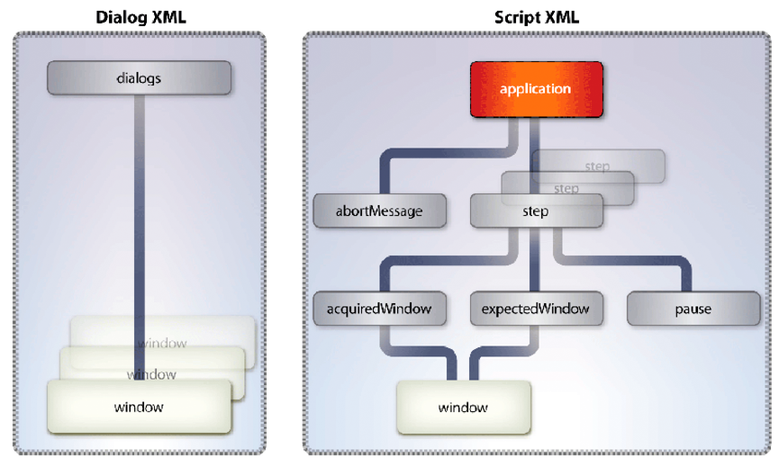

# Converting Between File Formats and PDF {#converting-between-file-formatsand-pdf} 

**Samples and examples in this document are only for AEM Forms on JEE environment.**

**About the Generate PDF Service**

The Generate PDF service converts native file formats to PDF. It also converts PDF to other file formats and optimizes the size of PDF documents.

The Generate PDF service uses native applications to convert the following file formats to PDF. Unless otherwise indicated, only the German, French, English, and Japanese versions of these applications are supported. *Windows only* indicates support for only Windows Server&reg; 2003 and Windows Server 2008.

* Microsoft Office 2003 and 2007 to convert DOC, DOCX, RTF, TXT, XLS, XLSX, PPT, PPTX, VSD, MPP, MPPX, XPS, and PUB (Windows only)

>[!NOTE]
>
>Acrobat&reg; 9.2 or later is required to convert Microsoft XPS format to PDF.

* Autodesk AutoCAD 2005, 2006, 2007, 2008, and 2009 to convert DWF, DWG, and DXW (English only)
* Corel WordPerfect 12 and X4 to convert WPD, QPW, SHW (English only)
* OpenOffice 2.0, 2.4, 3.0.1, and 3.1 to convert ODT, ODS, ODP, ODG, ODF, SXW, SXI, SXC, SXD, DOC, DOCX, RTF, TXT, XLS, XLSX, PPT, PPTX, VSD, MPP, MPPX, and PUB

>[!NOTE]
>
>The Generate PDF service does not support the 64-bit versions of OpenOffice.

* Adobe Photoshop&reg; CS2 to convert PSD (Windows only)

>[!NOTE]
>
>Photoshop CS3 and CS4 are not supported because they do not support Windows Server 2003 or Windows Server 2008.

* Adobe FrameMaker&reg; 7.2 and 8 to convert FM (Windows only)
* Adobe PageMaker&reg; 7.0 to convert PMD, PM6, P65, and PM (Windows only)
* Native formats supported by third-party applications (requires development of setup files specific for the application) (Windows only)

The Generate PDF service converts the following standards-based file formats to PDF.

* Video formats: SWF, FLV (Windows only)
* Image formats: JPEG, JPG, JP2, J2Kí, JPC, J2C, GIF, BMP, TIFF, TIF, PNG, JPF
* HTML (Windows, Sun&trade; Solaris&trade;, and Linux&reg;)

The Generate PDF service converts PDF to the following file formats (Windows only):

* Encapsulated PostScript (EPS)
* HTML 3.2
* HTML 4.01 with CSS 1.0
* DOC (Microsoft Word format)
* RTF
* Text (both accessible and plain)
* XML
* PDF/A-1a that uses only the DeviceRGB color space
* PDF/A-1b that uses only the DeviceRGB color space

The Generate PDF service requires that you perform these administrative tasks:

* Install required native applications on the computer hosting AEM Forms
* Install Adobe Acrobat Professional or Acrobat Pro Extended 9.2 on the computer hosting AEM Forms
* Perform post-installation setup tasks

These tasks are described in Installing and Deploying AEM forms Using JBoss Turnkey.

You can accomplish these tasks using the Generate PDF service:

* Convert from native file formats to PDF.
* Convert HTML documents to PDF documents.
* Convert PDF documents to file formats.

>[!NOTE]
>
>For more information about the Generate PDF service, see [Services Reference for AEM Forms](https://www.adobe.com/go/learn_aemforms_services_63).

## Converting Word Documents to PDF Documents {#converting-word-documents-to-pdf-documents}

This section describes how you can use the Generate PDF API to programmatically convert a Microsoft Word document to a PDF document.

>[!NOTE]
>
>For more information about additional file formats, see [Adding Support for Additional Native File Formats](converting-file-formats-pdf.md#adding-support-for-additional-native-file-formats).

>[!NOTE]
>
>For more information about the Generate PDF service, see [Services Reference for AEM Forms](https://www.adobe.com/go/learn_aemforms_services_63).

### Summary of steps {#summary-of-steps}

To convert a Microsoft Word document to a PDF document, perform the following tasks:

1. Include project files.
1. Create a Generate PDF client.
1. Retrieve the file to convert to a PDF document.
1. Convert the file to a PDF document.
1. Retrieve the results.

**Include project files**

Include necessary files into your development project. If you are creating a client application using Java, include the necessary JAR files. If you are using web services, ensure that you include the proxy files.

**Create a Generate PDF client**

Before you can programmatically perform a Generate PDF operation, create a Generate PDF service client. If you are using the Java API, create a `GeneratePdfServiceClient` object. If you are using the web service API, create a `GeneratePDFServiceService` object.

**Retrieve the file to convert to a PDF document**

Retrieve the Microsoft Word document to convert to a PDF document.

**Convert the file to a PDF document**

After you create the Generate PDF service client, you can invoke the `createPDF2` method. This method needs information about the document to convert, including the file extension.

**Retrieve the results**

After the file is converted to a PDF document, you can retrieve the results. For example, after you convert a Word file to a PDF document, you can retrieve and save the PDF document.

**See also**

[Convert Word documents to PDF documents using the Java API](converting-file-formats-pdf.md#convert-word-documents-to-pdf-documents-using-the-java-api)

[Convert Word documents to PDF documents using the web service API](converting-file-formats-pdf.md#convert-word-documents-to-pdf-documents-using-the-web-service-api)

[Including AEM Forms Java library files](/help/forms/developing/invoking-aem-forms-using-java.md#including-aem-forms-java-library-files)

[Setting connection properties](/help/forms/developing/invoking-aem-forms-using-java.md#setting-connection-properties)

[Generate PDF Service API Quick Starts](/help/forms/developing/generate-pdf-service-java-api.md#generate-pdf-service-java-api-quick-start-soap)

### Convert Word documents to PDF documents using the Java API {#convert-word-documents-to-pdf-documents-using-the-java-api}

Convert a Microsoft Word document to a PDF document by using the Generate PDF API (Java):

1. Include project files.

   Include client JAR files, such as adobe-generatepdf-client.jar, in your Java project's class path.

1. Create a Generate PDF client.

    * Create a `ServiceClientFactory` object that contains connection properties.
    * Create a `GeneratePdfServiceClient` object by using its constructor and passing the `ServiceClientFactory` object.

1. Retrieve the file to convert to a PDF document.

    * Create a `java.io.FileInputStream` object that represents the Word file to convert by using its constructor. Pass a string value that specifies the file location.
    * Create a `com.adobe.idp.Document` object by using its constructor and passing the `java.io.FileInputStream` object.

1. Convert the file to a PDF document.

   Convert the file to a PDF document by invoking the `GeneratePdfServiceClient` object's `createPDF2` method and passing the following values:

    * A `com.adobe.idp.Document` object that represents the file to convert.
    * A `java.lang.String` object that contains the file extension.
    * A `java.lang.String` object that contains the file type settings to be used in the conversion. File type settings provide conversion settings for different file types, such as .doc or .xls.
    * A `java.lang.String` object that contains the name of the PDF settings to be used. For example, you can specify `Standard`.
    * A `java.lang.String` object that contains the name of the security settings to be used.
    * An optional `com.adobe.idp.Document` object that contains settings to be applied while generating the PDF document.
    * An optional `com.adobe.idp.Document` object that contains metadata information to be applied to the PDF document.

   The `createPDF2` method returns a `CreatePDFResult` object that contains the new PDF document and a log information. The log file typically contains error or warning messages generated by the conversion request.

1. Retrieve the results.

   To obtain the PDF document, perform the following actions:

    * Invoke the `CreatePDFResult` object's `getCreatedDocument` method, which returns a `com.adobe.idp.Document` object.
    * Invoke the `com.adobe.idp.Document` object's `copyToFile` method to extract the PDF document from the object created in the previous step.

   If you used the `createPDF2` method to obtain the log document (not applicable to HTML conversions), perform the following actions:

    * Invoke the `CreatePDFResult` object's `getLogDocument` method. This returns a `com.adobe.idp.Document` object.
    * Invoke the `com.adobe.idp.Document` object's `copyToFile` method to extract the log document.

**See also**

[Summary of steps](converting-file-formats-pdf.md#summary-of-steps)

[Quick Start (SOAP mode): Converting a Microsoft Word document to a PDF document using the Java API](/help/forms/developing/generate-pdf-service-java-api.md#quick-start-soap-mode-converting-a-microsoft-word-document-to-a-pdf-document-using-the-java-api)

[Including AEM Forms Java library files](/help/forms/developing/invoking-aem-forms-using-java.md#including-aem-forms-java-library-files)

[Setting connection properties](/help/forms/developing/invoking-aem-forms-using-java.md#setting-connection-properties)

### Convert Word documents to PDF documents using the web service API {#convert-word-documents-to-pdf-documents-using-the-web-service-api}

Convert a Microsoft Word document to a PDF document by using the Generate PDF API (web service):

1. Include project files.

   Create a Microsoft .NET project that uses MTOM. Ensure that you use the following WSDL definition: `http://localhost:8080/soap/services/GeneratePDFService?WSDL&lc_version=9.0.1`.

   >[!NOTE]
   >
   >Replace `localhost` with the IP address of the server hosting AEM Forms.

1. Create a Generate PDF client.

    * Create a `GeneratePDFServiceClient` object by using its default constructor.
    * Create a `GeneratePDFServiceClient.Endpoint.Address` object by using the `System.ServiceModel.EndpointAddress` constructor. Pass a string value that specifies the WSDL to the AEM Forms service (for example, `http://localhost:8080/soap/services/GeneratePDFService?blob=mtom`.) You do not need to use the `lc_version` attribute. However, specify `?blob=mtom`.
    * Create a `System.ServiceModel.BasicHttpBinding` object by getting the value of the `GeneratePDFServiceClient.Endpoint.Binding` field. Cast the return value to `BasicHttpBinding`.
    * Set the `System.ServiceModel.BasicHttpBinding` object's `MessageEncoding` field to `WSMessageEncoding.Mtom`. This value ensures that MTOM is used.
    * Enable basic HTTP authentication by performing the following tasks:

        * Assign the AEM forms user name to the field `GeneratePDFServiceClient.ClientCredentials.UserName.UserName`.
        * Assign the corresponding password value to the field `GeneratePDFServiceClient.ClientCredentials.UserName.Password`.
        * Assign the constant value `HttpClientCredentialType.Basic` to the field `BasicHttpBindingSecurity.Transport.ClientCredentialType`.
        * Assign the constant value `BasicHttpSecurityMode.TransportCredentialOnly` to the field `BasicHttpBindingSecurity.Security.Mode`.

1. Retrieve the file to convert to a PDF document.

    * Create a `BLOB` object by using its constructor. The `BLOB` object is used to store the file that you want to convert to a PDF document.
    * Create a `System.IO.FileStream` object by invoking its constructor. Pass a string value that represents the file location of the file to convert and the mode in which to open the file.
    * Create a byte array that stores the content of the `System.IO.FileStream` object. You can determine the size of the byte array by getting the `System.IO.FileStream` object's `Length` property.
    * Populate the byte array with stream data by invoking the `System.IO.FileStream` object's `Read` method and passing the byte array, the starting position, and the stream length to read.
    * Populate the `BLOB` object by assigning to its `MTOM` property the contents of the byte array.

1. Convert the file to a PDF document.

   Convert the file to a PDF document by invoking the `GeneratePDFServiceService` object's `CreatePDF2` method and passing the following values:

    * A `BLOB` object that represents the file to be converted.
    * A string that contains the file extension.
    * A `java.lang.String` object that contains the file type settings to be used in the conversion. File type settings provide conversion settings for different file types, such as .doc or .xls.
    * A string object that contains the PDF settings to be used. You can specify `Standard`.
    * A string object that contains the security settings to be used. You can specify `No Security`.
    * An optional `BLOB` object that contains settings to be applied while generating the PDF document.
    * An optional `BLOB` object that contains metadata information to be applied to the PDF document.
    * An output parameter of type `BLOB` that is populated by the `CreatePDF2` method. The `CreatePDF2` method populates this object with the converted document. (This parameter value is required only for web service invocation).
    * An output parameter of type `BLOB` that is populated by the `CreatePDF2` method. The `CreatePDF2` method populates this object with the log document. (This parameter value is required only for web service invocation).

1. Retrieve the results.

    * Retrieve the converted PDF document by assigning the `BLOB` object's `MTOM` field to a byte array. The byte array represents the converted PDF document. Ensure you use the `BLOB` object that is used as the output parameter for the `createPDF2` method.
    * Create a `System.IO.FileStream` object by invoking its constructor and passing a string value that represents the file location of the converted PDF document.
    * Create a `System.IO.BinaryWriter` object by invoking its constructor and passing the `System.IO.FileStream` object.
    * Write the contents of the byte array to a PDF file by invoking the `System.IO.BinaryWriter` object's `Write` method and passing the byte array.

**See also**

[Summary of steps](converting-file-formats-pdf.md#summary-of-steps)

[Invoking AEM Forms using MTOM](/help/forms/developing/invoking-aem-forms-using-web.md#invoking-aem-forms-using-mtom)

[Invoking AEM Forms using SwaRef](/help/forms/developing/invoking-aem-forms-using-web.md#invoking-aem-forms-using-swaref)

## Converting HTML Documents to PDF Documents {#converting-html-documents-to-pdf-documents}

This section describes how you can use the Generate PDF API to programmatically convert HTML documents to PDF documents.

>[!NOTE]
>
>For more information about the Generate PDF service, see [Services Reference for AEM Forms](https://www.adobe.com/go/learn_aemforms_services_63).

### Summary of steps {#summary_of_steps-1}

To convert an HTML document to a PDF document, perform the following tasks:

1. Include project files.
1. Create a Generate PDF client.
1. Retrieve the HTML content to convert to a PDF document.
1. Convert the HTML content to a PDF document.
1. Retrieve the results.

**Include project files**

Include necessary files into your development project. If you are creating a client application using Java, include the necessary JAR files. If you are using web services, ensure that you include the proxy files.

**Create a Generate PDF client**

Before you can programmatically perform a Generate PDF operation, you must create a Generate PDF service client. If you are using the Java API, create a `GeneratePdfServiceClient` object. If you are using the web service API, create a `GeneratePDFServiceService`.

**Retrieve the HTML content to convert to a PDF document**

Reference HTML content that you want to convert to a PDF document. You can reference HTML content such as an HTML file or HTML content that is accessible using a URL.

**Convert the HTML content to a PDF document**

After you create the service client, you can invoke the appropriate PDF creation operation. This operation needs information about the document to be converted, including the path to the target document.

**Retrieve the results**

After the HTML content is converted to a PDF document, you can retrieve the results and save the PDF document.

**See also**

[Convert HTML content to a PDF document using the Java API](converting-file-formats-pdf.md#convert-html-content-to-a-pdf-document-using-the-java-api)

[Convert HTML content to a PDF document using the web service API](converting-file-formats-pdf.md#convert-html-content-to-a-pdf-document-using-the-web-service-api)

[Including AEM Forms Java library files](/help/forms/developing/invoking-aem-forms-using-java.md#including-aem-forms-java-library-files)

[Setting connection properties](/help/forms/developing/invoking-aem-forms-using-java.md#setting-connection-properties)

[Generate PDF Service API Quick Starts](/help/forms/developing/generate-pdf-service-java-api.md#generate-pdf-service-java-api-quick-start-soap)

### Convert HTML content to a PDF document using the Java API {#convert-html-content-to-a-pdf-document-using-the-java-api}

Convert an HTML document to a PDF document using the Generate PDF API (Java):

1. Include project files.

   Include client JAR files, such as adobe-generatepdf-client.jar, in your Java project's class path.

1. Create a Generate PDF client.

   Create a `GeneratePdfServiceClient` object by using its constructor and passing a `ServiceClientFactory` object that contains connection properties.

1. Retrieve the HTML content to convert to a PDF document.

   Retrieve HTML content by creating a string variable and assigning a URL that points to HTML content.

1. Convert the HTML content to a PDF document.

   Invoke the `GeneratePdfServiceClient` object's `htmlToPDF2` method and pass the following values:

    * A `java.lang.String` object that contains the URL of the HTML file to be converted.
    * A `java.lang.String` object that contains the file type settings to be used in the conversion. File type settings can include spidering levels.
    * A `java.lang.String` object that contains the name of the security settings to be used.
    * An optional `com.adobe.idp.Document` object that contains settings to be applied while generating the PDF document. If this information is not supplied, the settings are automatically chosen based on the previous three parameters.
    * An optional `com.adobe.idp.Document` object that contains metadata information to be applied to the PDF document.

1. Retrieve the results.

   The `htmlToPDF2` method returns an `HtmlToPdfResult` object that contains the new PDF document that was generated. To obtain the newly created PDF document, perform the following actions:

    * Invoke the `HtmlToPdfResult` object's `getCreatedDocument` method. This returns a `com.adobe.idp.Document` object.
    * Invoke the `com.adobe.idp.Document` object's `copyToFile` method to extract the PDF document from the object created in the previous step.

**See also**

[Converting HTML Documents to PDF Documents](converting-file-formats-pdf.md#converting-html-documents-to-pdf-documents)

[Quick Start (SOAP mode): Converting HTML content to a PDF document using the Java API](/help/forms/developing/generate-pdf-service-java-api.md#quick-start-soap-mode-converting-html-content-to-a-pdf-document-using-the-java-api)

[Quick Start (SOAP mode): Converting HTML content to a PDF document using the Java API](/help/forms/developing/generate-pdf-service-java-api.md#quick-start-soap-mode-converting-html-content-to-a-pdf-document-using-the-java-api)

[Including AEM Forms Java library files](/help/forms/developing/invoking-aem-forms-using-java.md#including-aem-forms-java-library-files)

[Setting connection properties](/help/forms/developing/invoking-aem-forms-using-java.md#setting-connection-properties)

### Convert HTML content to a PDF document using the web service API {#convert-html-content-to-a-pdf-document-using-the-web-service-api}

Convert HTML content to a PDF document by using the Generate PDF API (web service):

1. Include project files.

   Create a Microsoft .NET project that uses MTOM. Ensure that you use the following WSDL definition: `http://localhost:8080/soap/services/GeneratePDFService?WSDL&lc_version=9.0.1`.

   >[!NOTE]
   >
   >Replace `localhost` with the IP address of the server hosting AEM Forms.

1. Create a Generate PDF client.

    * Create a `GeneratePDFServiceClient` object by using its default constructor.
    * Create a `GeneratePDFServiceClient.Endpoint.Address` object by using the `System.ServiceModel.EndpointAddress` constructor. Pass a string value that specifies the WSDL to the AEM Forms service (for example, `http://localhost:8080/soap/services/GeneratePDFService?blob=mtom`.) You do not need to use the `lc_version` attribute. However, specify `?blob=mtom`.
    * Create a `System.ServiceModel.BasicHttpBinding` object by getting the value of the `GeneratePDFServiceClient.Endpoint.Binding` field. Cast the return value to `BasicHttpBinding`.
    * Set the `System.ServiceModel.BasicHttpBinding` object's `MessageEncoding` field to `WSMessageEncoding.Mtom`. This value ensures that MTOM is used.
    * Enable basic HTTP authentication by performing the following tasks:

        * Assign the AEM forms user name to the field `GeneratePDFServiceClient.ClientCredentials.UserName.UserName`.
        * Assign the corresponding password value to the field `GeneratePDFServiceClient.ClientCredentials.UserName.Password`.
        * Assign the constant value `HttpClientCredentialType.Basic` to the field `BasicHttpBindingSecurity.Transport.ClientCredentialType`.
        * Assign the constant value `BasicHttpSecurityMode.TransportCredentialOnly` to the field `BasicHttpBindingSecurity.Security.Mode`.

1. Retrieve the HTML content to convert to a PDF document.

   Retrieve HTML content by creating a string variable and assigning a URL that points to HTML content.

1. Convert the HTML content to a PDF document.

   Convert the HTML content to a PDF document by invoking the `GeneratePDFServiceService` object's `HtmlToPDF2` method and pass the following values:

    * A string that contains the HTML content to convert.
    * A `java.lang.String` object that contains the file type settings to be used in the conversion.
    * A string object that contains the security settings to be used.
    * An optional `BLOB` object that contains settings to be applied while generating the PDF document.
    * An optional `BLOB` object that contains metadata information to be applied to the PDF document.
    * An output parameter of type `BLOB` that is populated by the `CreatePDF2` method. The `CreatePDF2` method populates this object with the converted document. (This parameter value is required only for web service invocation).

1. Retrieve the results.

    * Retrieve the converted PDF document by assigning the `BLOB` object's `MTOM` field to a byte array. The byte array represents the converted PDF document. Ensure you use the `BLOB` object that is used as the output parameter for the `HtmlToPDF2` method.
    * Create a `System.IO.FileStream` object by invoking its constructor and passing a string value that represents the file location of the converted PDF document.
    * Create a `System.IO.BinaryWriter` object by invoking its constructor and passing the `System.IO.FileStream` object.
    * Write the contents of the byte array to a PDF file by invoking the `System.IO.BinaryWriter` object's `Write` method and passing the byte array.

**See also**

[Converting HTML Documents to PDF Documents](converting-file-formats-pdf.md#converting-html-documents-to-pdf-documents)

[Invoking AEM Forms using MTOM](/help/forms/developing/invoking-aem-forms-using-web.md#invoking-aem-forms-using-mtom)

[Invoking AEM Forms using SwaRef](/help/forms/developing/invoking-aem-forms-using-web.md#invoking-aem-forms-using-swaref)

## Converting PDF Documents to Non-image Formats {#converting-pdf-documents-to-non-image-formats}

This section describes how you can use the Generate PDF Java API and web service API to programmatically convert a PDF document to an RTF file, which is an example of a non-image format. Other non-image formats include HTML, text, DOC, and EPS. When converting a PDF document to RTF, ensure that the PDF document does not contain form elements, such as a submit button. Form elements are not converted.

>[!NOTE]
>
>For more information about the Generate PDF service, see [Services Reference for AEM Forms](https://www.adobe.com/go/learn_aemforms_services_63).

### Summary of steps {#summary_of_steps-2}

To convert a PDF document to any of the supported types, perform the following steps:

1. Include project files.
1. Create a Generate PDF client.
1. Retrieve the PDF document to convert.
1. Convert the PDF document.
1. Save the converted file.

**Include project files**

Include necessary files into your development project. If you are creating a client application using Java, include the necessary JAR files. If you are using web services, ensure that you include the proxy files.

**Create a Generate PDF client**

Before you can programmatically perform a Generate PDF operation, you must create a Generate PDF service client. If you are using the Java API, create a `GeneratePdfServiceClient` object. If you are using the web service API, create a `GeneratePDFServiceService` object.

**Retrieve the PDF document to convert**

Retrieve the PDF document to convert to a non-image format.

**Convert the PDF document**

After you create the service client, you can invoke the PDF export operation. This operation needs information about the document to be converted, including the path to the target document.

**Save the converted file**

Save the converted file. For example, if you convert a PDF document to an RTF file, save the converted document to an RTF file.

**See also**

[Convert a PDF document to a RTF file using the Java API](converting-file-formats-pdf.md#convert-a-pdf-document-to-a-rtf-file-using-the-java-api)

[Convert a PDF document to a RTF file using the web service API](converting-file-formats-pdf.md#convert-a-pdf-document-to-a-rtf-file-using-the-web-service-api)

[Including AEM Forms Java library files](/help/forms/developing/invoking-aem-forms-using-java.md#including-aem-forms-java-library-files)

[Setting connection properties](/help/forms/developing/invoking-aem-forms-using-java.md#setting-connection-properties)

[Generate PDF Service API Quick Starts](/help/forms/developing/generate-pdf-service-java-api.md#generate-pdf-service-java-api-quick-start-soap)

### Convert a PDF document to a RTF file using the Java API {#convert-a-pdf-document-to-a-rtf-file-using-the-java-api}

Convert a PDF document to an RTF file by using the Generate PDF API (Java):

1. Include project files.

   Include client JAR files, such as adobe-generatepdf-client.jar, in your Java project's class path.

1. Create a Generate PDF client.

   Create a `GeneratePdfServiceClient` object by using its constructor and passing a `ServiceClientFactory` object that contains connection properties.

1. Retrieve the PDF document to convert.

    * Create a `java.io.FileInputStream` object that represents the PDF document to convert by using its constructor. Pass a string value that specifies the location of the PDF document.
    * Create a `com.adobe.idp.Document` object by using its constructor and passing the `java.io.FileInputStream` object.

1. Convert the PDF document.

   Invoke the `GeneratePdfServiceClient` object's `exportPDF2` method and pass the following values:

    * A `com.adobe.idp.Document` object that represents the PDF file to convert.
    * A `java.lang.String` object that contains the name of the file to convert.
    * A `java.lang.String` object that contains the name of the Adobe PDF settings.
    * A `ConvertPDFFormatType` object that specifies the target file type for the conversion.
    * An optional `com.adobe.idp.Document` object that contains settings to be applied while generating the PDF document.

   The `exportPDF2` method returns an `ExportPDFResult` object that contains the converted file.

1. Convert the PDF document.

   To obtain the newly created file, perform the following actions:

    * Invoke the `ExportPDFResult` object's `getConvertedDocument` method. This returns a `com.adobe.idp.Document` object.
    * Invoke the `com.adobe.idp.Document` object's `copyToFile` method to extract the new document.

**See also**

[Summary of steps](converting-file-formats-pdf.md#summary-of-steps)

[Quick Start (SOAP mode): Converting HTML content to a PDF document using the Java API](/help/forms/developing/generate-pdf-service-java-api.md#quick-start-soap-mode-converting-html-content-to-a-pdf-document-using-the-java-api)

[Including AEM Forms Java library files](/help/forms/developing/invoking-aem-forms-using-java.md#including-aem-forms-java-library-files)

[Setting connection properties](/help/forms/developing/invoking-aem-forms-using-java.md#setting-connection-properties)

### Convert a PDF document to a RTF file using the web service API {#convert-a-pdf-document-to-a-rtf-file-using-the-web-service-api}

Convert a PDF document to an RTF file by using the Generate PDF API (web service):

1. Include project files.

   Create a Microsoft .NET project that uses MTOM. Ensure that you use the following WSDL definition: `http://localhost:8080/soap/services/GeneratePDFService?WSDL&lc_version=9.0.1`.

   >[!NOTE]
   >
   >Replace `localhost` with the IP address of the server hosting AEM Forms.

1. Create a Generate PDf client.

    * Create a `GeneratePDFServiceClient` object by using its default constructor.
    * Create a `GeneratePDFServiceClient.Endpoint.Address` object by using the `System.ServiceModel.EndpointAddress` constructor. Pass a string value that specifies the WSDL to the AEM Forms service (for example, `http://localhost:8080/soap/services/GeneratePDFService?blob=mtom`.) You do not need to use the `lc_version` attribute. However, specify `?blob=mtom`.
    * Create a `System.ServiceModel.BasicHttpBinding` object by getting the value of the `GeneratePDFServiceClient.Endpoint.Binding` field. Cast the return value to `BasicHttpBinding`.
    * Set the `System.ServiceModel.BasicHttpBinding` object's `MessageEncoding` field to `WSMessageEncoding.Mtom`. This value ensures that MTOM is used.
    * Enable basic HTTP authentication by performing the following tasks:

        * Assign the AEM forms user name to the field `GeneratePDFServiceClient.ClientCredentials.UserName.UserName`.
        * Assign the corresponding password value to the field `GeneratePDFServiceClient.ClientCredentials.UserName.Password`.
        * Assign the constant value `HttpClientCredentialType.Basic` to the field `BasicHttpBindingSecurity.Transport.ClientCredentialType`.
        * Assign the constant value `BasicHttpSecurityMode.TransportCredentialOnly` to the field `BasicHttpBindingSecurity.Security.Mode`.

1. Retrieve the PDF document to convert.

    * Create a `BLOB` object by using its constructor. The `BLOB` object is used to store a PDF document that is converted.
    * Create a `System.IO.FileStream` object by invoking its constructor and passing a string value that represents the file location of the PDF document and the mode in which to open the file.
    * Create a byte array that stores the content of the `System.IO.FileStream` object. You can determine the size of the byte array by getting the `System.IO.FileStream` object's `Length` property.
    * Populate the byte array with stream data by invoking the `System.IO.FileStream` object's `Read` method and passing the byte array, the starting position, and the stream length to read.
    * Populate the `BLOB` object by assigning to its `MTOM` property the contents of the byte array.

1. Convert the PDF document.

   Invoke the `GeneratePDFServiceServiceWse` object's `ExportPDF2` method and pass the following values:

    * A `BLOB` object that represents the PDF file to convert.
    * A string that contains the path name of the file to convert.
    * A `java.lang.String` object that specifies the file location.
    * A string object that specifies the target file type for the conversion. Specify `RTF`.
    * An optional `BLOB` object that contains settings to be applied while generating the PDF document.
    * An output parameter of type `BLOB` that is populated by the `ExportPDF2` method. The `ExportPDF2` method populates this object with the converted document. (This parameter value is required only for web service invocation).

1. Save the converted file.

    * Retrieve the converted RTF document by assigning the `BLOB` object's `MTOM` field to a byte array. The byte array represents the converted RTF document. Ensure you use the `BLOB` object that is used as the output parameter for the `ExportPDF2` method.
    * Create a `System.IO.FileStream` object by invoking its constructor. Pass a string value that represents the location of the RTF file.
    * Create a `System.IO.BinaryWriter` object by invoking its constructor and passing the `System.IO.FileStream` object.
    * Write the contents of the byte array to a RTF file by invoking the `System.IO.BinaryWriter` object's `Write` method and passing the byte array.

**See also**

[Summary of steps](converting-file-formats-pdf.md#summary-of-steps)

[Invoking AEM Forms using MTOM](/help/forms/developing/invoking-aem-forms-using-web.md#invoking-aem-forms-using-mtom)

[Invoking AEM Forms using SwaRef](/help/forms/developing/invoking-aem-forms-using-web.md#invoking-aem-forms-using-swaref)

## Adding Support for Additional Native File Formats {#adding-support-for-additional-native-file-formats}

This section explains how to add support for additional native file formats. It provides an overview of the interactions between the Generate PDF service and the native applications that this service uses to convert native file formats into PDF.

This section also explains the following:

* How to modify the response that the Generate PDF service provides to the native applications that this product already uses to convert native file formats into PDF
* The interactions between the Generate PDF service, the Generate PDF service Application Monitor (AppMon) component, and native applications, such as Microsoft Word
* The roles that XML grammars play in those interactions

### Component interactions {#component-interactions}

The Generate PDF service converts native file formats by invoking the application associated with the file format and then interacting with the application to print the document using the default printer. The default printer must be set up as the Adobe PDF printer.

This illustration shows the components and drivers involved with native application support. It also mentions the XML grammars that influence the interactions.

Component interactions for native file conversion

This document uses the term *native application* to indicate the application used to produce a native file format, such as Microsoft Word.

*AppMon* is an enterprise component that interacts with a native application in the same way a user would navigate through the dialog boxes presented by that application. The XML grammars used by AppMon to instruct an application, such as Microsoft Word, to open and print a file involve these sequential tasks:

1. Opening the file by selecting File &gt; Open
1. Ensuring that the Open dialog box appears; if not, handling the error
1. Providing the file name in the File Name field and then clicking the Open button
1. Ensuring that the file actually opens
1. Opening the Print dialog box by selecting File &gt; Print
1. Ensuring that the Print dialog box appears

AppMon uses standard Win32 APIs to interact with third-party applications to transfer UI events such as key-strokes and mouse clicks, which is useful to control these applications to produce PDF files from them.

Due to a limitation with these Win32 APIs, AppMon is not able to dispatch these UI events to some specific kinds of windows, such as floating menu-bars (found in some applications such as TextPad), and certain kind of dialogs whose contents cannot be retrieved using the Win32 APIs.

It is easy to visually identify a floating menu-bar; however it might not be possible to identify the special types of dialogs just by visual inspection. You would require a third-party application such as Microsoft Spy++ (part of the Microsoft Visual C++ development environment) or its equivalent WinID (that can be downloaded free of cost from [https://www.dennisbabkin.com/php/download.php?what=WinID](https://www.dennisbabkin.com/php/download.php?what=WinID)) to examine a dialog to determine if AppMon would be able to interact with it using standard Win32 APIs.

If WinID is able to extract the dialog contents such as the text, sub-windows, window class ID, and so on, then AppMon would also be able to do the same.

This table lists the type of information used in printing native file formats.

<table>
 <thead>
  <tr>
   <th><p>Information type</p></th>
   <th><p>Description</p></th>
   <th><p>Modifying/creating entries related to native files </p></th>
  </tr>
 </thead>
 <tbody>
  <tr>
   <td><p>Administrative settings </p></td>
   <td><p>Includes PDF settings, security settings, and file type settings. </p><p>File type settings associate file name extensions with the corresponding native applications. File type settings also specify native application settings used to print native files. </p></td>
   <td><p>To change settings for an already supported native application, the system administrator sets the File Type Settings in the administration console. </p><p>To add support for a new native file format, you must manually edit the file. (See <a href="converting-file-formats-pdf.md#adding-or-modifying-support-for-a-native-file-format">Adding or modifying support for a native file format</a>.) </p></td>
  </tr>
  <tr>
   <td><p>Script </p></td>
   <td><p>Specifies interactions between the Generate PDF service and a native application. Such interactions usually direct the application to print a file to the Adobe PDF driver. </p><p>The script contains instructions that direct the native application to open specific dialog boxes and that supply specific responses to fields and buttons in those dialog boxes. </p></td>
   <td><p>The Generate PDF service includes script files for all supported native applications. You can modify these files using an XML editing application.</p><p>To add support for a new native application, you must create a script file. (See <a href="converting-file-formats-pdf.md#creating-or-modifying-an-additional-dialog-xml-file-for-a-native-application">Creating or modifying an additional dialog XML file for a native application</a>.) </p></td>
  </tr>
  <tr>
   <td><p>Generic dialog box instructions </p></td>
   <td><p>Specifies how to respond to dialog boxes that are common to multiple applications. Such dialog boxes are generated by operating systems, helper applications (such as PDFMaker), and drivers. </p><p>The file that contains this information is appmon.global.en_US.xml.</p></td>
   <td><p>Do not modify this file. </p></td>
  </tr>
  <tr>
   <td><p>Application-specific dialog box instructions</p></td>
   <td><p>Specifies how to respond to application-specific dialog boxes. </p><p>The file that contains this information is appmon.<i>`[appname]`</i>.dialog.<i>`[locale]`</i>.xml (for example, appmon.word.en_US.xml).</p></td>
   <td><p>Do not modify this file. </p><p>To add dialog box instructions for a new native application, see <a href="converting-file-formats-pdf.md#creating_or_modifying_an_additional_dialog_xml_file_for_a_native_application">Creating or modifying an additional dialog XML file for a native application</a>.</p></td>
  </tr>
  <tr>
   <td><p>Additional application-specific dialog box instructions </p></td>
   <td><p>Specifies overrides and additions to application-specific dialog box instructions. The section presents an example of such information. </p><p>The file that contains this information is appmon.<i>`[appname]`</i>.addition.<i>`[locale]`</i>.xml. An example is appmon.addition.en_US.xml.</p></td>
   <td><p>Files of this type can be created and modified using an XML editing application. (See <a href="converting-file-formats-pdf.md#creating-or-modifying-an-additional-dialog-xml-file-for-a-native-application">Creating or modifying an additional dialog XML file for a native application</a>.) </p><p><strong>Important</strong>: Create additional application-specific dialog box instructions for each native application your server will support. </p></td>
  </tr>
 </tbody>
</table>

### About the script and dialog XML files {#about-the-script-and-dialog-xml-files}

Script XML files direct the Generate PDF service to navigate through application dialog boxes in the same way a user would navigate through the application dialog boxes. Script XML files also direct the Generate PDF service to respond to dialog boxes by performing actions such as pressing buttons, selecting or deselecting check boxes, or selecting menu items.

In contrast, dialog XML files simply respond to dialog boxes with the same types of actions used in script XML files.

#### Dialog box and window element terminology {#dialog-box-and-window-element-terminology}

This section and the next section use different terminology for dialog boxes and the components they contain, depending on the perspective being described. Dialog box components are items such as buttons, fields, and combo boxes.

When this section and the next section describe dialog boxes and their components from the perspective of a user, terms such as *dialog box*, *button*, *field*, and *combo box* are used.

When this section and the next section describe dialog boxes and their components from the perspective of their internal representation, the term *window element* is used. The internal representation of window elements is a hierarchy, where each window element instance is identified by labels. The window element instance also describes its physical characteristics and behavior.

From a user's perspective, the dialog boxes and their components show different behaviors, where some dialog box elements are hidden until activated. From an internal representation perspective, no such issue of behavior exists. For example, the internal representation of a dialog box looks similar to that of the components it contains, with the exception that the components are nested within the dialog box.

This section describes XML elements that provide AppMon with instructions. These elements have names such as the `dialog` element and the `window` element. This document uses a monospaced font to distinguish XML elements. The `dialog` element identifies a dialog box that an XML script file can cause to be displayed, either intentionally or unintentionally. The `window` element identifies a window element (dialog box or the components of a dialog box).

#### Hierarchy {#hierarchy}

This diagram shows the hierarchy of script and dialog XML. A script XML file conforms to the script.xsd schema, which includes (in the XML sense) the window.xsd schema. Similarly, a dialog XML file conforms to the dialogs.xsd schema, which also includes the window.xsd schema.



Hierarchy of script and dialog XML

#### Script XML files {#script-xml-files}

A *script XML file* specifies a series of steps that direct the native application to navigate to certain window elements and then supply responses to those elements. Most responses are text or keystrokes that correspond to the input a user would provide to a field, combo box, or button in the corresponding dialog box.

The intent of the Generate PDF service's support for script XML files is to direct a native application to print a native file. However, script XML files can be used to accomplish any task that a user can perform when interacting with the native application's dialog boxes.

The steps in a script XML file are executed in order, without any opportunity for branching. The only conditional test supported is for time-out/retry, which causes a script to terminate if a step does not complete successfully within a specific period of time and after a specific number of retries.

In addition to steps being sequential, the instructions within a step are also executed in order. Ensure that the steps and instructions reflect the order in which a user would perform those same steps.

Each step in a script XML file identifies the window element that is expected to appear if the step's instructions are successfully performed. If an unexpected dialog box appears while executing a script step, the Generate PDF service searches the dialog XML files as described in the next section.

#### Dialog XML files {#dialog-xml-files}

Running native applications displays different dialog boxes, which appear regardless of whether the native applications are in a visible or invisible mode. The dialog boxes can be generated by the operating system or by the application itself. When native applications are running under control of the Generate PDF service, system and native application dialog boxes are displayed in an invisible window.

A *dialog XML file* specifies how the Generate PDF service responds to system or native application dialog boxes. The dialog XML files allow the Generate PDF service to respond to unprompted dialog boxes in a way that facilitates the conversion process.

When the system or native application displays a dialog box that is not handled by the currently executing script XML file, the Generate PDF service searches the dialog XML files in this order, stopping when it finds a match:

* appmon.`[appname]`.additional.`[locale]`.xml
* appmon.`[appname]`.`[locale]`.xml (Do not modify this file.)
* appmon.global.`[locale]`.xml (Do not modify this file.)

If the Generate PDF service finds a match for the dialog box, it dismisses it by sending it the keystroke or other action specified for the dialog box. If the instructions for the dialog box specify an abort message, the Generate PDF service terminates the currently executing job and generates an error message. Such an abort message would be specified in the `abortMessage` element in the script XML grammar.

If the Generate PDF service encounters a dialog box that is not described in any of the previously-listed files, the Generate PDF service incorporates the dialog box's caption into the log file entry. The currently executing job eventually times out. You can then use the information in the log file to compose new instructions in the additional dialog XML file for the native application.

### Adding or modifying support for a native file format {#adding-or-modifying-support-for-a-native-file-format}

This section describes the tasks you must perform to support other native file formats or to modify support for an already supported native file format.

Before you can add or modify support, you must complete the following tasks.

#### Choosing a tool for identifying window elements {#choosing-a-tool-for-identifying-window-elements}

The dialog and script XML files require you to identify the window element (dialog box, field, or other dialog component) to which your dialog or script element is responding. For example, after a script invokes a menu for a native application, the script must identify the window element on that menu to which keystrokes or an action are to be applied.

You can easily identify a dialog box by the caption it displays in its title bar. However, you must use a tool such as Microsoft Spy++ to identify lower-level window elements. The lower-level window elements can be identified through a variety of attributes, which are not obvious. Additionally, each native application may identify its window element differently. As a result, there are multiple ways of identifying a window element. Here is the suggested order for considering window element identification:

1. Caption itself if it is unique
1. Control ID, which may or may not be unique for a given dialog box
1. Class name, which may or may not be unique

Any one or a combination of these three attributes can be used to identify a window.

If the attributes fail to identify a caption, you can instead identify a window element by using its index with respect to its parent. An *index* specifies the position of the window element relative to its sibling window elements. Frequently, indexes are the only way to identify combo boxes.

Be aware of these issues:

* Microsoft Spy++ displays captions by using an ampersand (&) to identify the caption's hot key. For example, Spy++ shows the caption for one Print dialog box as `Pri&nt`, which indicates that the hotkey is *n*. Caption titles in script and dialog XML files must omit ampersands.
* Some captions include line breaks. the Generate PDF service cannot identify line breaks. If a caption includes a line break, include enough of the caption to differentiate it from the other menu items and then use regular expressions for the omitted part. An example is ( `^Long caption title$`). (See [Using regular expressions in caption attributes](converting-file-formats-pdf.md#using-regular-expressions-in-caption-attributes).)
* Use character entities (also called escape sequences) for reserved XML characters. For example, use `&` for ampersands, `<` and `>` for less than and greater than symbols, `&apos;` for apostrophes, and `&quot;` for quotation marks.

If you plan to work on dialog or script XML files, you should install the application Microsoft Spy++.

#### Unpackaging the dialog and script files {#unpackaging-the-dialog-and-script-files}

The dialog and script files reside in the appmondata.jar file. Before you can modify any of these files or add new script or dialog files, you must unpackage this JAR file. For example, assume that you want to add support for the EditPlus application. You create two XML files, named appmon.editplus.script.en_US.xml and appmon.editplus.script.addition.en_US.xml. These XML scripts must be added to the adobe-appmondata.jar file in two locations, as specified below:

* adobe-livecycle-native-jboss-x86_win32.ear &gt; adobe-Native2PDFSvc.war\WEB-INF\lib &gt; adobe-native.jar &gt; Native2PDFSvc-native.jar\bin &gt; adobe-appmondata.jar\com\adobe\appmon. The adobe-livecycle-native-jboss-x86_win32.ear file is in the export folder at `[AEM forms install directory]\configurationManager`. (if AEM Forms is deployed on another J2EE application server, replace the adobe-livecycle-native-jboss-x86_win32.ear file with the EAR file that corresponds to your J2EE application server.)
* adobe-generatepdf-dsc.jar &gt; adobe-appmondata.jar\com\adobe\appmon (the adobe-appmondata.jar file is within the adobe-generatepdf-dsc.jar file). The adobe-generatepdf-dsc.jar file is in the `[AEM forms install directory]\deploy` folder.

After you add these XML files to the adobe-appmondata.jar file, you must redeploy the GeneratePDF component. To add dialog and script XML files to the adobe-appmondata.jar file, perform these tasks:

1. Using a tool such as WinZip or WinRAR, open the adobe-livecycle-native-jboss-x86_win32.earfile &gt; adobe-Native2PDFSvc.war\WEB-INF\lib &gt; adobe-native.jar &gt; Native2PDFSvc-native.jar\bin &gt; adobe-appmondata.jar file.
1. Add the dialog and script XML files to the appmondata.jar file or modify existing XML files in this file. (See [Creating or modifying a script XML file for a native application](converting-file-formats-pdf.md#creating-or-modifying-a-script-xml-file-for-a-native-application)and [Creating or modifying an additional dialog XML file for a native application](converting-file-formats-pdf.md#creating-or-modifying-an-additional-dialog-xml-file-for-a-native-application).)
1. Using a tool such as WinZip or WinRAR, open adobe-generatepdf-dsc.jar &gt; adobe-appmondata.jar.
1. Add the dialog and script XML files to the appmondata.jar file or modify existing XML files in this file. (See [Creating or modifying a script XML file for a native application](converting-file-formats-pdf.md#creating-or-modifying-a-script-xml-file-for-a-native-application)and [Creating or modifying an additional dialog XML file for a native application](converting-file-formats-pdf.md#creating-or-modifying-an-additional-dialog-xml-file-for-a-native-application).) After you add the XML files to the adobe-appmondata.jar file, place the new adobe-appmondata.jar file into the adobe-generatepdf-dsc.jar file.
1. If you added support for an additional native file format, create a system environment variable that provides the path of the application (See [Creating an environment variable to locate the native application](converting-file-formats-pdf.md#creating-an-environment-variable-to-locate-the-native-application).)

**To redeploy the GeneratePDF component**

1. Log in to Workbench.
1. Select **Window** &gt; **Show Views** &gt; **Components**. This action adds the Components view to Workbench.
1. Right-click the GeneratePDF component, and then select **Stop Component**.
1. When the component has stopped, right-click and select Uninstall Component to remove it.
1. Right-click the **Components** icon and select **Install Component**.
1. Browse for and select the modified adobe-generatepdf-dsc.jar file and then click Open. Notice that a red square appears next to the GeneratePDF component.
1. Expand the GeneratePDF component, select Service Descriptors, and then right-click GeneratePDFService and select Activate Service.
1. In the configuration dialog box that appears, enter applicable configuration values. If you leave these values blank, default configuration values are used.
1. Right-click GeneratePDF and select Start Component.
1. Expand Active Services. A green arrow appears next to the service name if it is running. Otherwise, the service is in a stopped state.
1. If the service is in a stopped state, right-click the service name and select Start Service.

### Creating or modifying a script XML file for a native application {#creating-or-modifying-a-script-xml-file-for-a-native-application}

If you want to direct files to a new native application, you must create a script XML file for that application. If you want to modify how the Generate PDF service interacts with a native application that is already supported, you must modify the script for that application.

The script contains instructions that navigate through the native application's window elements and that supply specific responses to those elements. The file that contains this information is `appmon.`[appname]`` `.script.`[locale]`.xml`. An example is appmon.notepad.script.en_US.xml.

#### Identifying steps the script must execute {#identifying-steps-the-script-must-execute}

Using the native application, determine the window elements that you must navigate and each response you must perform to print the document. Notice the dialog boxes that result from any response. The steps will be similar to these steps:

1. Select File &gt; Open.
1. Specify the path and then click Open.
1. Select File &gt; Print on the menu bar.
1. Specify the properties required for the printer.
1. Select Print and wait for the Save As dialog box to appear. The Save As dialog box is required for the Generate PDF service to specify the destination for the PDF file.

#### Identifying the dialogs specified in caption attributes {#identifying-the-dialogs-specified-in-caption-attributes}

Use Microsoft Spy++ to obtain the identities of window element properties in the native application. You must have these identities to write scripts.

#### Using regular expressions in caption attributes {#using-regular-expressions-in-caption-attributes}

You can use regular expressions in caption specifications. The Generate PDF service uses the `java.util.regex.Matcher` class to support regular expressions. That utility supports the regular expressions described in `java.util.regex.Pattern`.

**Regular expression accommodating the file name prepended to Notepad in the Notepad banner**

```xml
 <!-- The regular expression ".*Notepad" means any number of non-terminating characters followed by Notepad. -->
 <step>
     <expectedWindow>
         <window caption=".*Notepad"/>
     </expectedWindow>
 </step>
```

**Regular expression differentiating Print from Print Setup**

```xml
 <!-- This regular expression differentiates the Print dialog box from the Print Setup dialog box. The "^" specifies the beginning of the line, and the "$" specifies the end of the line. -->
 <windowList>
     <window controlID="0x01" caption="^Print$" action="press"/>
 </windowList>
```

#### Ordering the window and windowList elements {#ordering-the-window-and-windowlist-elements}

Order `window` and `windowList` elements as follows:

* When multiple `window` elements appear as children in a `windowList` or `dialog` element, order those `window` elements in descending order, with the lengths of the `caption` names indicating the position in the order.
* When multiple `windowList` elements appear in a `window` element, order those `windowList` elements in descending order, with the lengths of the `caption` attributes of the first `indexes/`element indicating the position in the order.

**Ordering window elements in a dialog file**

```xml
 <!-- The caption attribute in the following window element is 40 characters long. It is the longest caption in this example, so its parent window element appears before the others. -->
 <window caption="Unexpected Failure in DebugActiveProcess">
     <…>
 </window>

 <!-- Caption length is 33 characters. -->
 <window caption="Adobe Acrobat - License Agreement">
     <…>
 </window>

 <!-- Caption length is 33 characters. -->
 <window caption="Microsoft Visual.*Runtime Library">
     <…>
 </window>

 <!-- The caption attribute in the following window element is 28 characters long. It is the shortest caption in this example, so its parent window element appears after the others. -->
 <window caption="Adobe Acrobat - Registration">
     <…>
 </window>
```

**Ordering window elements within a windowList element**

```xml
 <!-- The caption attribute in the following indexes element is 56 characters long. It is the longest caption in this example, so its parent window element appears before the others. -->
 <windowList>
     <window caption="Can&apos;t exit design mode because.* cannot be created"/>
     <window className="Button" caption="OK" action="press"/>
 </windowList>
 <windowList>
     <window caption="Do you want to continue loading the project?"/>
     <window className="Button" caption="No" action="press"/>
 </windowList>
 <windowList>
     <window caption="The macros in this project are disabled"/>
     <window className="Button" caption="OK" action="press"/>
 </windowList>
```

### Creating or modifying an additional dialog XML file for a native application {#creating-or-modifying-an-additional-dialog-xml-file-for-a-native-application}

If you create a script for a native application that was not previously supported, you must also create an additional dialog XML file for that application. Every native application that AppMon uses must have only one additional dialog XML file. The additional dialog XML file is required even if no unsolicited dialog boxes are expected. The additional dialog box must have at least one `window` element, even if that `window` element is merely a placeholder.

>[!NOTE]
>
>In this context, the term additional means the contents of the `appmon.[applicationname].addition.[locale].xml` file. Such a file specifies overrides and additions to the dialog XML file.

You can also modify the additional dialog XML file for a native application for these purposes:

* To override the dialog XML file for an application with a different response
* To add a response to a dialog box that is not addressed in the dialog XML file for that application

The file name that identifies an additional dialogXML file is `appmon.[appname].addition.[locale].xml`. An example is appmon.excel.addition.en_US.xml.

The name of the additional dialog XML file must use the format `appmon.[applicationname].addition.[locale].xml`, where *applicationname* must exactly match the application name used in the XML configuration file and in the script.

>[!NOTE]
>
>None of the generic applications specified in the native2pdfconfig.xml configuration file have a primary dialog XML file. The section [Adding or modifying support for a native file format](converting-file-formats-pdf.md#adding-or-modifying-support-for-a-native-file-format) describes such specifications.

Order `windowList` elements that appear as children in a `window` element. (See [Ordering the window and windowList elements](converting-file-formats-pdf.md#ordering-the-window-and-windowlist-elements).)

### Modifying the general dialog XML file {#modifying-the-general-dialog-xml-file}

You can modify the general dialog XML file to respond to dialog boxes that are generated by the system or to respond to dialog boxes that are common to multiple applications.

#### Adding a filetype entry in the XML configuration file {#adding-a-filetype-entry-in-the-xml-configuration-file}

This procedure explains how to update the Generate PDF service configuration file to associate file types with native applications. To update this configuration file, you must use administration console to export the configuration data to a file. The default file name for the configuration data is native2pdfconfig.xml.

**Update the Generate PDF service configuration file**

1. Select **Home** &gt; **Services** &gt; **Adobe PDF Generator** &gt; **Configuration Files**, and then select **Export Configuration**.
1. Modify the `filetype-settings` element in the native2pdfconfig.xml file, as needed.
1. Select **Home** &gt; **Services** &gt; **Adobe PDF Generator** &gt;**Configuration Files**, and then select **Import Configuration**. The configuration data is imported into the Generate PDF service, replacing previous settings.

>[!NOTE]
>
>The name of the application is specified as the value of the `GenericApp` element's `name` attribute. This value must exactly match the corresponding name specified in the script that you develop for that application. Likewise, the `GenericApp` element's `displayName` attribute should exactly match the corresponding script's `expectedWindow` window caption. Such equivalency is evaluated after resolving any regular expressions that appear in the `displayName` or `caption` attributes.

In this example, the default configuration data supplied with the Generate PDF service was modified to specify that Notepad (not Microsoft Word) should be used to process files with the file name extension .txt. Before this modification, Microsoft Word was specified as the native application that should process such files.

**Modifications for directing text files to Notepad (native2pdfconfig.xml)**

```xml
 <filetype-settings>

 <!-- Some native app file types were omitted for brevity. -->
 <!-- The following GenericApp element specifies Notepad as the native application that should be used to process files that have a txt file name extension. -->
             <GenericApp
                 extensions="txt"
                 name="Notepad" displayName=".*Notepad"/>
             <GenericApp
                 extensions="wpd"
                 name="WordPerfect" displayName="Corel WordPerfect"/>
             <GenericApp extensions="pmd,pm6,p65,pm"
                 name="PageMaker" displayName="Adobe PageMaker"/>
             <GenericApp extensions="fm"
                 name="FrameMaker" displayName="Adobe FrameMaker"/>
             <GenericApp extensions="psd"
                 name="Photoshop" displayName="Adobe Photoshop"/>
         </settings>
     </filetype-settings>
```

#### Creating an environment variable to locate the native application {#creating-an-environment-variable-to-locate-the-native-application}

Create an environment variable that specifies the location of the native application executable. The variable must use the format `[applicationname]_PATH`, where *applicationname* must exactly match the application name used in the XML configuration file and in the script, and where the path contains the path to the executable in double quotation marks. An example of such an environment variable is `Photoshop_PATH`.

After creating the new environment variable, you must restart the server on which the Generate PDF service is deployed.

>[!NOTE]
>
> It is recommended to use the 'Ctrl + C' command to restart the SDK server. Restarting the AEM SDK server using alternative methods, for example, stopping Java processes, may lead to inconsistencies in the AEM development environment.

**Create a system variable in the Windows XP environment**

1. Select **Control Panel &gt; System**.
1. In the System Properties dialog box, click the **Advanced** tab and then click **Environment Variables**.
1. Under System Variables in the Environment Variables dialog box, click **New**.
1. In the New System Variable dialog box, in the **Variable name** box, type a name that uses the format `[applicationname]_PATH`.
1. In the **Variable value** box, type the full path and file name of the application's executable file and then click **OK**. For example, type: `c:\windows\Notepad.exe`
1. In the Environment Variables dialog box, click **OK**.

**Create a system variable from the command line**

1. In a command line window, type the variable definition, using this format:

   ```shell
            [applicationname]_PATH=[Full path name]
   ```

   For example, type: `NotePad_PATH=C:\WINDOWS\NOTEPAD.EXE`

1. Start a fresh command line prompt for the system variable to take effect.

#### XML files {#xml-files}

AEM Forms includes sample XML files that cause the Generate PDF service to use Notepad to process any files with the file name extension .txt. This code is included in this section. In addition, you must make the other modifications described in this section.

#### Additional dialog XML file {#additional-dialog-xml-file}

This example contains the additional dialog boxes for the Notepad application. These dialog boxes can be in addition to the ones specified by the Generate PDF service.

**Notepad dialog boxes(appmon.notepad.addition.en_US.xml)**

```xml
 <dialogs app="Notepad" locale="en_US" version="7.0" xmlns:xsi="https://www.w3.org/2001/XMLSchema-instance" xsi:noNamespaceSchemaLocation="dialogs.xsd">
     <window caption="Caption Title">
         <windowList>
             <window className="Button" caption="OK" action="press"/>
         </windowList>
     </window>
 </dialogs>
```

#### Script XML file {#script-xml-file}

This example specifies how the Generate PDF service should interact with Notepad to print files by using the Adobe PDF printer.

**Notepad script XML file (appmon.notepad.script.en_US.xml)**

```xml
<?xml version="1.0" encoding="UTF-8" standalone="yes"?>
<!--
*
* ADOBE CONFIDENTIAL
* ___________________
* Copyright 2004 - 2005 Adobe Systems Incorporated
* All Rights Reserved.
*
* NOTICE:  All information contained herein is, and remains
* the property of Adobe Systems Incorporated and its suppliers,
* if any.  The intellectual and technical concepts contained
* herein are proprietary to Adobe Systems Incorporated and its
* suppliers and may be covered by U.S. and Foreign Patents,
* patents in process, and are protected by trade secret or copyright law.
* Dissemination of this information or reproduction of this material
* is strictly forbidden unless prior written permission is obtained
* from Adobe Systems Incorporated.
*-->

<!-- This file automates printing of text files via notepad to Adobe PDF printer. To see the complete hierarchy Adobe recommends using the Microsoft Spy++ which details the properties of windows necessary to write scripts. In this sample there are total of eight steps-->

<application name="Notepad" version="9.0" locale="en_US" xmlns:xsi="https://www.w3.org/2001/XMLSchema-instance" xsi:noNamespaceSchemaLocation="scripts.xsd">

    <!-- In this step we wait for the application window to appear -->
    <step>
        <expectedWindow>
            <window caption=".*Notepad"/>
        </expectedWindow>
    </step>

    <!-- In this step, we acquire the application window and send File->Open menu bar, menu item commands and the expectation is the windows Open dialog-->
    <step>
        <acquiredWindow>
            <window caption=".*Notepad">
                <virtualInput>
                    <menuBar>
                        <selection>
                            <name>File</name>
                        </selection>
                        <selection>
                            <name>Open...</name>
                        </selection>
                    </menuBar>
                </virtualInput>
            </window>
        </acquiredWindow>
        <expectedWindow>
            <window caption="Open"/>
        </expectedWindow>
    </step>

    <!-- In this step, we acquire the Open window and then select the 'Edit' widget and input the source path followed by clicking on the 'Open' button . The expectation of this 'action' is that the Open dialog will disappear -->
    <step>
        <acquiredWindow>
            <window caption="Open">
                <windowList>
                    <window className="ComboBoxEx32">
                        <windowList>
                            <window className="ComboBox">
                                <windowList>
                                <window className="Edit" action="inputSourcePath"/>
                                </windowList>
                            </window>
                        </windowList>
                    </window>
                </windowList>
                <windowList>
                    <window className="Button" caption="Open" action="press"/>
                </windowList>
            </window>
        </acquiredWindow>
        <expectedWindow>
            <window caption="Open" action="disappear"/>
        </expectedWindow>
        <pause value="30"/>
    </step>

    <!-- In this step, we acquire the application window and send File->Print menu bar, menu item commands and the expectation is the windows Print dialog-->
    <step>
        <acquiredWindow>
            <window caption=".*Notepad">
                <virtualInput>
                    <menuBar>
                        <selection>
                            <name>File</name>
                        </selection>
                        <selection>
                            <name>Print...</name>
                        </selection>
                    </menuBar>
                </virtualInput>
            </window>
        </acquiredWindow>
        <expectedWindow>
            <window caption="Print">
        </window>
        </expectedWindow>
    </step>

    <!-- In this step, we acquire the Print dialog and click the 'Preferences' button and the expected window in this case is the dialog with the caption '"Printing Preferences' -->
    <step>
        <acquiredWindow>
            <window caption="Print">
                <windowList>
                    <window caption="General">
                        <windowList>
                            <window className="Button" caption="Preferences" action="press"/>
                        </windowList>
                    </window>
                </windowList>
            </window>
        </acquiredWindow>
        <expectedWindow>
            <window caption="Printing Preferences"/>
        </expectedWindow>
    </step>

    <!-- In this step, we acquire the dialog "Printing Preferences' and select the combo box which is the 10th child of window with caption '"Adobe PDF Settings' and select the first index. (Note: All indeces start with 0.) Besides this we uncheck the box which has the caption '"View Adobe PDF results' and we click the button OK. The expectation is that 'Printing Preferences' dialog disappears. -->
    <step>
        <acquiredWindow>
            <window caption="Printing Preferences">
                <windowList>
                    <window caption="Adobe PDF Settings">
                        <windowList>
                            <window className="Button" caption="View Adobe PDF results" action="uncheck"/>
                        </windowList>
                        <windowList>
                            <window className="Button" caption="Ask to Replace existing PDF file" action="uncheck"/>
                        </windowList>
                    </window>
                </windowList>
                <windowList>
                    <window className="Button" caption="OK" action="press"/>
                </windowList>
            </window>
        </acquiredWindow>
        <expectedWindow>
            <window caption="Printing Preferences" action="disappear"/>
        </expectedWindow>
    </step>

    <!-- In this step, we acquire the 'Print' dialog and click the Print button. The expectation is that the dialog with caption 'Print' disappears. In this case we use the regular expression '^Print$' for specifying the caption given there could be multiple dialogs with caption that includes the word Print. -->
    <step>
        <acquiredWindow>
            <window caption="Print">
                <windowList>
                    <window caption="General"/>
                    <window className="Button" caption="^Print$" action="press"/>
                </windowList>
            </window>
        </acquiredWindow>
        <expectedWindow>
            <window caption="Print" action="disappear"/>
        </expectedWindow>
    </step>
    <step>
        <expectedWindow>
            <window caption="Save PDF File As"/>
        </expectedWindow>
    </step>
    <!-- Finally in this step, we acquire the dialog with caption "Save PDF File As" and in the Edit widget type the destination path for the output PDF file and click the Save button. The expectation is that the dialog disappears-->
    <step>
        <acquiredWindow>
            <window caption="Save PDF File As">
                <windowList>
                    <window className="Edit" action="inputDestinationPath"/>
                </windowList>
                <windowList>
                    <window className="Button" caption="Save" action="press"/>
                </windowList>
            </window>
        </acquiredWindow>
        <expectedWindow>
            <window caption="Save PDF File As" action="disappear"/>
        </expectedWindow>
    </step>

    <!-- We can always set a retry count or a maximum time for a step. In case we surpass these limitations, PDF Generator generates this abort message and terminates processing. -->
    <abortMessage msg="15078"/>
</application>
```
