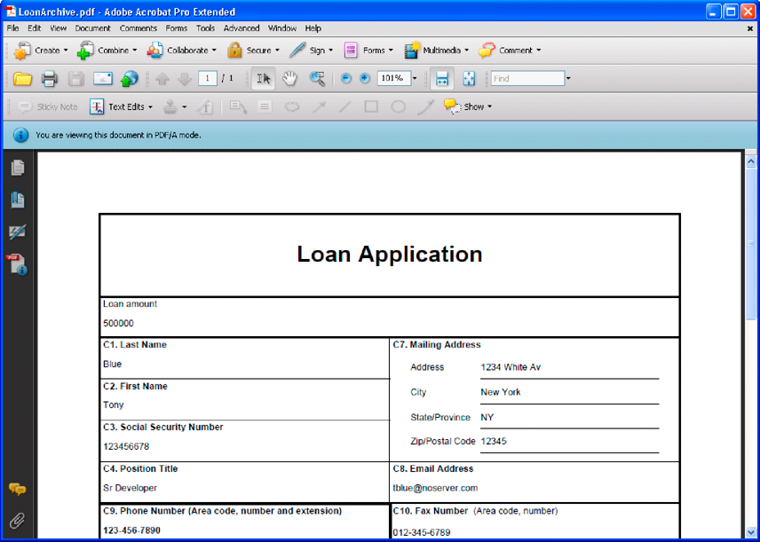
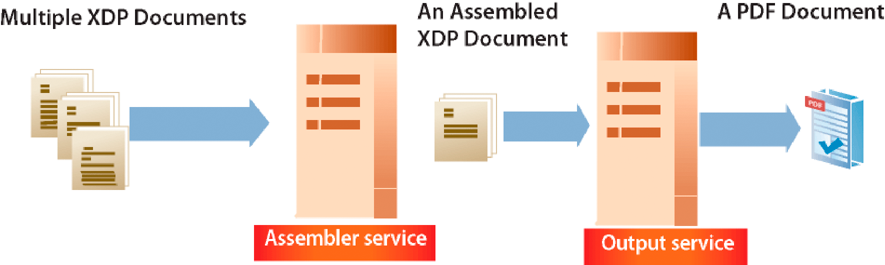
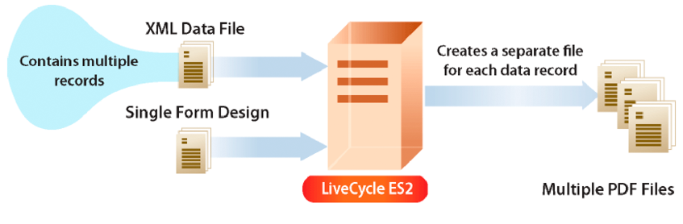
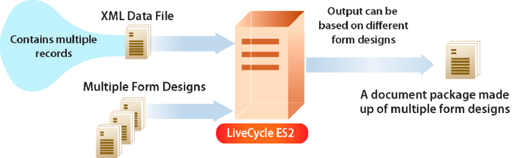

# Creating Document Output Streams  {#creating-document-output-streams} 

**Samples and examples in this document are only for AEM Forms on JEE environment.**

**About the Output Service**

The Output service lets you output documents as PDF (including PDF/A documents), PostScript, Printer Control Language (PCL), and the following label formats:

* Zebra - ZPL
* Intermec - IPL
* Datamax - DPL
* TecToshiba - TPCL

Using the Output service, you can merge XML form data with a form design and output the document to a network printer or file.

There are two ways in which you can pass a form design (an XDP file) to the Output service. You can either pass a `com.adobe.idp.Document` instance that contains a form design to the Output service. Or you can pass a URI value that specifies the location of the form design. Both of these ways are discussed in *Programming with AEM forms*.

>[!NOTE]
>
>The Output service does not support Acroform PDF documents that contain application object specific scripts. Acroform PDF documents that contain application object specific scripts are not rendered.

The following sections show how to pass a form design to the Output service using a URI value:

* [Creating PDF Documents](creating-document-output-streams.md#creating-pdf-documents)
* [Creating PDF/A Documents](creating-document-output-streams.md#creating-pdf-a-documents)

The following sections show how to pass a form design within a `com.adobe.idp.Document` instance:

* [Passing Documents in Content Services (deprecated) to the Output Service](creating-document-output-streams.md#passing-documents-located-in-content-services-deprecated-to-the-output-service)
* [Creating PDF Documents Using Fragments](creating-document-output-streams.md#creating-pdf-documents-using-fragments)

One consideration when deciding which technique to use is if you are getting the form design from another AEM Forms service, then pass it within a `com.adobe.idp.Document` instance. Both the *Passing Documents to the Output Service* and *Creating PDF Documents using Fragments* sections show how to get a form design from another AEM Forms service. The first section retrieves the form design from Content Services (deprecated). The second section retrieves the form design from the Assembler service.

If you are getting the form design from a fixed location, such as the file system, then you can use either technique. That is, you can specify the URI value to an XDP file or use a `com.adobe.idp.Document` instance.

To pass a URI value that specifies the location of the form design when creating a PDF document, use the `generatePDFOutput` method. Likewise, to pass a `com.adobe.idp.Document` instance to the Output service when creating a PDF document, use the `generatePDFOutput2` method.

When sending an output stream to a network printer, you can also use either technique. To send an output stream to a printer by passing a `com.adobe.idp.Document` instance that contains a form design, use the `sendToPrinter2`method. To send an output stream to a printer by passing a URI value, use the `sendToPrinter`method. The *Sending Print Streams to Printers* section uses the `sendToPrinter` method.

You can accomplish these tasks by using the Output service:

* [Creating PDF Documents](creating-document-output-streams.md#creating-pdf-documents)
* [Creating PDF/A Documents](creating-document-output-streams.md#creating-pdf-a-documents)
* [Passing Documents in Content Services (deprecated) to the Output Service](creating-document-output-streams.md#passing-documents-located-in-content-services-deprecated-to-the-output-service)
* [Creating PDF Documents Using Fragments](creating-document-output-streams.md#creating-pdf-documents-using-fragments)
* [Printing to Files](creating-document-output-streams.md#printing-to-files)
* [Sending Print Streams to Printers](creating-document-output-streams.md#sending-print-streams-to-printers)
* [Creating Multiple Output Files](creating-document-output-streams.md#creating-multiple-output-files)
* [Creating Search Rules](creating-document-output-streams.md#creating-search-rules)
* [Flattening PDF Documents](creating-document-output-streams.md#flattening-pdf-documents)

>[!NOTE]
>
>For more information about the Output service, see [Services Reference for AEM Forms](https://www.adobe.com/go/learn_aemforms_services_63).

## Creating PDF Documents {#creating-pdf-documents}

You can use the Output service to create a PDF document that is based on a form design and XML form data that you provide. The PDF document that is created by the Output service is not an interactive PDF document; a user cannot enter or modify form data.

If you want to create a PDF document meant for long-term storage, it is recommended that you create a PDF/A document. (See [Creating PDF/A Documents](creating-document-output-streams.md#creating-pdf-a-documents).)

To create an interactive PDF form that lets a user enter data, use the Forms service. (See [Rendering Interactive PDF Forms](/help/forms/developing/rendering-forms.md#rendering-interactive-pdf-forms).)

>[!NOTE]
>
>For more information about the Output service, see [Services Reference for AEM Forms](https://www.adobe.com/go/learn_aemforms_services_63).

### Summary of steps {#summary-of-steps}

To create a PDF document, perform the following steps:

1. Include project files.
1. Create an Output Client object.
1. Reference an XML data source.
1. Set PDF run-time options.
1. Set rendering run-time options.
1. Generate a PDF document.
1. Retrieve the results of the operation.

**Include project files**

Include necessary files in your development project. If you are creating a client application by using Java, include the necessary JAR files. If you are using web services, make sure that you include the proxy files.

The following JAR files must be added to your project's classpath:

* adobe-livecycle-client.jar
* adobe-usermanager-client.jar
* adobe-output-client.jar
* adobe-utilities.jar (Required if AEM Forms is deployed on JBoss)
* jbossall-client.jar (Required if AEM Forms is deployed on JBoss)

if AEM Forms is deployed on a supported J2EE application server that is not JBoss, you must replace the adobe-utilities.jar and jbossall-client.jar files with JAR files that are specific to the J2EE application server on which AEM Forms is deployed.

**Create an Output Client object**

Before you can programmatically perform an Output service operation, you must create an Output service client object. If you are using the Java API, create an `OutputClient` object. If you are using the Output web service API, create an `OutputServiceService` object.

**Reference an XML data source**

To merge data with the form design, you must reference an XML data source that contains data. An XML element must exist for every form field that you plan to populate with data. The XML element name must match the field name. An XML element is ignored if it does not correspond to a form field or if the XML element name does not match the field name. It is not necessary to match the order in which the XML elements are displayed if all XML elements are specified.

Consider the following example loan application form.


To merge data into this form design, you must create an XML data source that corresponds to the form. The following XML represents an XDP XML data source that corresponds to the example mortgage application form.

```xml
 <?xml version="1.0" encoding="UTF-8" ?>
 - <xfa:datasets xmlns:xfa="https://www.xfa.org/schema/xfa-data/1.0/">
 - <xfa:data>
 - <data>
     - <Layer>
         <closeDate>1/26/2007</closeDate>
         <lastName>Johnson</lastName>
         <firstName>Jerry</firstName>
         <mailingAddress>JJohnson@NoMailServer.com</mailingAddress>
         <city>New York</city>
         <zipCode>00501</zipCode>
         <state>NY</state>
         <dateBirth>26/08/1973</dateBirth>
         <middleInitials>D</middleInitials>
         <socialSecurityNumber>(555) 555-5555</socialSecurityNumber>
         <phoneNumber>5555550000</phoneNumber>
     </Layer>
     - <Mortgage>
         <mortgageAmount>295000.00</mortgageAmount>
         <monthlyMortgagePayment>1724.54</monthlyMortgagePayment>
         <purchasePrice>300000</purchasePrice>
         <downPayment>5000</downPayment>
         <term>25</term>
         <interestRate>5.00</interestRate>
     </Mortgage>
 </data>
 </xfa:data>
 </xfa:datasets>
```

**Set PDF run-time options**

Set the file URI option when creating a PDF document. This option specifies the name and location of the PDF file that the Output service generates.

>[!NOTE]
>
>Instead of setting the file URI run-time option, you can programmatically retrieve the PDF document from the complex data type that is returned by the Output service. However, by setting the file URI run-time option, you do not need to create application logic that programmatically retrieves the PDF document.

**Set rendering run-time options**

You can set rendering run-time options when creating a PDF document. Although these options are not required (unlike PDF run-time options that are required), you can perform tasks such as improving the performance of the Output service. For example, you can cache the form design that the Output service uses to improve its performance.

If you use a tagged Acrobat form as input, you cannot use the Output service Java or web service API to turn off the tagged setting. If you attempt to programmatically set this option to `false`, the result PDF document is still tagged.

>[!NOTE]
>
>If you do not specify rendering run-time options, then default values are used. For information about rendering run-time options, see the `RenderOptionsSpec` class reference. (See [AEM Forms API Reference](https://www.adobe.com/go/learn_aemforms_javadocs_63_en)).

**Generate a PDF document**

After you reference a valid XML data source that contains form data and you set run-time options, you can invoke the Output service, which results in it generating a PDF document.

When generating a PDF document, you specify URI values that are required by the Output service to create a PDF document. A form design can be stored in locations such as the server file system or as part of an AEM Forms application. A form design (or other resources such as an image file) that exists as part of a Forms application can be referenced by using the content root URI value `repository:///`. For example, consider the following form design named *Loan.xdp* located within a Forms application named *Applications/FormsApplication*:


To access the Loan.xdp file shown in the previous illustration, specify `repository:///Applications/FormsApplication/1.0/FormsFolder/` as the third parameter passed to the `OutputClient` object's `generatePDFOutput` method. Specify the form name (*Loan.xdp*) as the second parameter passed to the `OutputClient` object's `generatePDFOutput` method.

If the XDP file contains images (or other resources such as fragments), place the resources in the same application folder as the XDP file. AEM Forms uses the content root URI as the base path to resolve references to images. For example, if the Loan.xdp file contains an image, ensure that you place the image in `Applications/FormsApplication/1.0/FormsFolder/`.

>[!NOTE]
>
>You can reference a Forms application URI when invoking the `OutputClient` object's `generatePDFOutput` or `generatePrintedOutput` methods.

>[!NOTE]
>
>To see a complete quick start that creates a PDF document by referencing an XDP in a Forms application, see [Quick Start (EJB mode): Creating a PDF document based on an application XDP file using the Java API](/help/forms/developing/output-service-java-api-quick.md#quick-start-soap-mode-creating-a-pdf-document-based-on-an-application-xdp-file-using-the-java-api).

**Retrieve the results of the operation**

After the Output service performs an operation, it returns various data items such as status XML data that specifies whether the operation was successful.

**See also**

[Create a PDF document using the Java API](creating-document-output-streams.md#create-a-pdf-document-using-the-java-api)

[Create a PDF document using the web service API](creating-document-output-streams.md#create-a-pdf-document-using-the-web-service-api)

[Including AEM Forms Java library files](/help/forms/developing/invoking-aem-forms-using-java.md#including-aem-forms-java-library-files)

[Setting connection properties](/help/forms/developing/invoking-aem-forms-using-java.md#setting-connection-properties)

[Output Service API Quick Starts](/help/forms/developing/output-service-java-api-quick.md#output-service-java-api-quick-start-soap)

### Create a PDF document using the Java API {#create-a-pdf-document-using-the-java-api}

Create a PDF document by using the Output API (Java):

1. Include project files.

   Include client JAR files, such as adobe-output-client.jar, in your Java project's class path.

1. Create an Output Client object.

    * Create a `ServiceClientFactory` object that contains connection properties.
    * Create an `OutputClient` object by using its constructor and passing the `ServiceClientFactory` object.

1. Reference an XML data source.

    * Create a `java.io.FileInputStream` object that represents the XML data source that is used to populate the PDF document by using its constructor and passing a string value that specifies the location of the XML file.
    * Create a `com.adobe.idp.Document` object by using its constructor. Pass the `java.io.FileInputStream` object.

1. Set PDF run-time options.

    * Create a `PDFOutputOptionsSpec` object by using its constructor.
    * Set the File URI option by invoking the `PDFOutputOptionsSpec` object's `setFileURI` method. Pass a string value that specifies the location of the PDF file that the Output service generates. The File URI option is relative to the J2EE application server hosting AEM Forms, not the client computer.

1. Set rendering run-time options.

    * Create a `RenderOptionsSpec` object by using its constructor.
    * Cache the form design to improve the performance of the Output service by invoking the `RenderOptionsSpec` object's `setCacheEnabled` and passing `true`.

   >[!NOTE]
   >
   >You cannot set the version of the PDF document by using the `RenderOptionsSpec` object's `setPdfVersion` method if the input document is an Acrobat form (a form created in Acrobat) or an XFA document that is signed or certified. The output PDF document retains the original PDF version. Likewise, you cannot set the tagged Adobe PDF option by invoking the `RenderOptionsSpec` object's `setTaggedPDF` method if the input document is an Acrobat form or a signed or certified XFA document.

   >[!NOTE]
   >
   >You cannot set the linearized PDF option by using the `RenderOptionsSpec` object's `setLinearizedPDF` method if the input PDF document is certified or digitally signed. (See [Digitally Signing PDF Documents](/help/forms/developing/digitally-signing-certifying-documents.md#digitally-signing-pdf-documents)*.)*

1. Generate a PDF document.

   Create a PDF document by invoking the `OutputClient` object's `generatePDFOutput` method and passing the following values:

    * A `TransformationFormat` enumeration value. To generate a PDF document, specify `TransformationFormat.PDF`.
    * A string value that specifies the name of the form design.
    * A string value that specifies the content root where the form design is located.
    * A `PDFOutputOptionsSpec` object that contains PDF run-time options.
    * A `RenderOptionsSpec` object that contains rendering run-time options.
    * The `com.adobe.idp.Document` object that contains the XML data source that contains data to merge with the form design.

   The `generatePDFOutput` method returns an `OutputResult` object that contains the results of the operation.

   >[!NOTE]
   >
   >When generating a PDF document by invoking the `generatePDFOutput` method, you cannot merge data with an XFA PDF form that is signed or certified. (See [Digitally Signing and Certifying Documents](/help/forms/developing/digitally-signing-certifying-documents.md#digitally-signing-and-certifying-documents)*.)*

   >[!NOTE]
   >
   >The `OutputResult` object's `getRecordLevelMetaDataList` method returns `null`*.*

   >[!NOTE]
   >
   >You can also create a PDF document by invoking the `OutputClient` object's `generatePDFOutput2` method. (See [Passing Documents in Content Services (deprecated) to the Output Service](creating-document-output-streams.md#passing-documents-located-in-content-services-deprecated-to-the-output-service)*.)*

1. Retrieve the results of the operation.

    * Retrieve a `com.adobe.idp.Document` object that represents the status of the `generatePDFOutput` operation by invoking the `OutputResult` object's `getStatusDoc` method. This method returns status XML data that specifies whether the operation was successful.
    * Create a `java.io.File` object that contains the results of the operation. Ensure that the file name extension is .xml.
    * Invoke the `com.adobe.idp.Document` object's `copyToFile` method to copy the contents of the `com.adobe.idp.Document` object to the file (ensure that you use the `com.adobe.idp.Document` object that was returned by the `getStatusDoc` method).

   Although the Output service writes the PDF document to the location specified by the argument that is passed to the `PDFOutputOptionsSpec` object's `setFileURI` method, you can programmatically retrieve the PDF/A document by invoking the `OutputResult` object's `getGeneratedDoc` method.

**See also**

[Summary of steps](creating-document-output-streams.md#summary-of-steps)

[Quick Start (EJB mode): Creating a PDF document using the Java API](/help/forms/developing/output-service-java-api-quick.md#quick-start-soap-mode-creating-a-pdf-document-using-the-java-api)

[Quick Start (SOAP mode): Creating a PDF document using the Java API](/help/forms/developing/output-service-java-api-quick.md#quick-start-soap-mode-creating-a-pdf-document-using-the-java-api)

[Including AEM Forms Java library files](/help/forms/developing/invoking-aem-forms-using-java.md#including-aem-forms-java-library-files)

[Setting connection properties](/help/forms/developing/invoking-aem-forms-using-java.md#setting-connection-properties)

### Create a PDF document using the web service API {#create-a-pdf-document-using-the-web-service-api}

Create a PDF document by using the Output API (web service):

1. Include project files.

   Create a Microsoft .NET project that uses MTOM. Ensure that you use the following WSDL definition: `http://localhost:8080/soap/services/OutputService?WSDL&lc_version=9.0.1`.

   >[!NOTE]
   >
   >Replace `localhost` with the IP address of the server hosting AEM Forms.

1. Create an Output Client object.

    * Create an `OutputServiceClient` object by using its default constructor.
    * Create an `OutputServiceClient.Endpoint.Address` object by using the `System.ServiceModel.EndpointAddress` constructor. Pass a string value that specifies the WSDL to the AEM Forms service (for example, `http://localhost:8080/soap/services/OutputService?blob=mtom`.) You do not need to use the `lc_version` attribute. This attribute is used when you create a service reference. However, specify `?blob=mtom` to use MTOM.
    * Create a `System.ServiceModel.BasicHttpBinding` object by getting the value of the `OutputServiceClient.Endpoint.Binding` field. Cast the return value to `BasicHttpBinding`.
    * Set the `System.ServiceModel.BasicHttpBinding` object's `MessageEncoding` field to `WSMessageEncoding.Mtom`. This value ensures that MTOM is used.
    * Enable basic HTTP authentication by performing the following tasks:

        * Assign the AEM forms user name to the field `OutputServiceClient.ClientCredentials.UserName.UserName`.
        * Assign the corresponding password value to the field `OutputServiceClient.ClientCredentials.UserName.Password`.
        * Assign the constant value `HttpClientCredentialType.Basic` to the field `BasicHttpBindingSecurity.Transport.ClientCredentialType`.
        * Assign the constant value `BasicHttpSecurityMode.TransportCredentialOnly` to the field `BasicHttpBindingSecurity.Security.Mode`.

1. Reference an XML data source.

    * Create a `BLOB` object by using its constructor. The `BLOB` object is used to store XML data that will be merged with the PDF document.
    * Create a `System.IO.FileStream` object by invoking its constructor and passing a string value that represents the file location of the XML file that contains form data.
    * Create a byte array that stores the content of the `System.IO.FileStream` object. You can determine the size of the byte array by getting the `System.IO.FileStream` object's `Length` property.
    * Populate the byte array with stream data by invoking the `System.IO.FileStream` object's `Read` method and passing the byte array, the starting position, and the stream length to read.
    * Populate the `BLOB` object by assigning its `MTOM` field with the contents of the byte array.

1. Set PDF run-time options

    * Create a `PDFOutputOptionsSpec` object by using its constructor.
    * Set the File URI option by assigning a string value that specifies the location of the PDF file that the Output service generates to the `PDFOutputOptionsSpec` object's `fileURI` data member. The File URI option is relative to the J2EE application server hosting AEM Forms, not the client computer.

1. Set rendering run-time options.

    * Create a `RenderOptionsSpec` object by using its constructor.
    * Cache the form design to improve the performance of the Output service by assigning the value `true` to the `RenderOptionsSpec` object's `cacheEnabled` data member.

   >[!NOTE]
   >
   >You cannot set the version of the PDF document by using the `RenderOptionsSpec` object's `setPdfVersion` method if the input document is an Acrobat form (a form created in Acrobat) or an XFA document that is signed or certified. The output PDF document retains the original PDF version. Likewise, you cannot set the tagged Adobe PDF option by invoking the `RenderOptionsSpec` object's `setTaggedPDF`* method if the input document is an Acrobat form or a signed or certified XFA document.*

   >[!NOTE]
   >
   >You cannot set the linearized PDF option by using the `RenderOptionsSpec` object's `linearizedPDF` member if the input PDF document is certified or digitally signed. (See [Digitally Signing PDF Documents](/help/forms/developing/digitally-signing-certifying-documents.md#digitally-signing-pdf-documents)*.)*

1. Generate a PDF document.

   Create a PDF document by invoking the `OutputServiceService` object's `generatePDFOutput`method and passing the following values:

    * A `TransformationFormat` enumeration value. To generate a PDF document, specify `TransformationFormat.PDF`.
    * A string value that specifies the name of the form design.
    * A string value that specifies the content root where the form design is located.
    * A `PDFOutputOptionsSpec` object that contains PDF run-time options.
    * A `RenderOptionsSpec` object that contains rendering run-time options.
    * The `BLOB` object that contains the XML data source that contains data to merge with the form design.
    * A `BLOB` object that is populated by the `generatePDFOutput` method. The `generatePDFOutput` method populates this object with generated metadata that describes the document. (This parameter value is required only for web service invocation).
    * A `BLOB` object that is populated by the `generatePDFOutput` method. The `generatePDFOutput` method populates this object with result data. (This parameter value is required only for web service invocation).
    * An `OutputResult` object that contains the results of the operation. (This parameter value is required only for web service invocation).

   >[!NOTE]
   >
   >When generating a PDF document by invoking the `generatePDFOutput` method, you cannot merge data with an XFA PDF form that is signed or certified. (See [Digitally Signing and Certifying Documents](/help/forms/developing/digitally-signing-certifying-documents.md#digitally-signing-and-certifying-documents)*.)*

   >[!NOTE]
   >
   >You can also create a PDF document by invoking the `OutputClient` object's `generatePDFOutput2` method. (See [Passing Documents in Content Services (deprecated) to the Output Service](creating-document-output-streams.md#passing-documents-located-in-content-services-deprecated-to-the-output-service)*.)*

1. Retrieve the results of the operation.

    * Create a `System.IO.FileStream` object by invoking its constructor and passing a string value that represents an XML file location that contains result data. Ensure that the file name extension is .xml.
    * Create a byte array that stores the data content of the `BLOB` object that was populated with result data by the `OutputServiceService` object's `generatePDFOutput` method (the eighth parameter). Populate the byte array by getting the value of the `BLOB` object's `MTOM` `field`.
    * Create a `System.IO.BinaryWriter` object by invoking its constructor and passing the `System.IO.FileStream` object.
    * Write the contents of the byte array to the XML file by invoking the `System.IO.BinaryWriter` object's `Write` method and passing the byte array.

   See also

   [Summary of steps](creating-document-output-streams.md#summary-of-steps)

   [Invoking AEM Forms using MTOM](/help/forms/developing/invoking-aem-forms-using-web.md#invoking-aem-forms-using-mtom)

   [Invoking AEM Forms using SwaRef](/help/forms/developing/invoking-aem-forms-using-web.md#invoking-aem-forms-using-swaref)

   >[!NOTE]
   >
   >The `OutputServiceService` object's `generateOutput` method is deprecated.

## Creating PDF/A Documents {#creating-pdf-a-documents}

You can use the Output service to create a PDF/A document. Because PDF/A is an archival format for long-term preservation of the document's content, all fonts are embedded and the file is uncompressed. As a result, a PDF/A document is typically larger than a standard PDF document. In addition, a PDF/A document does not contain audio and video content. Like other Output service tasks, you provide both a form design and data to merge with a form design to create a PDF/A document.

The PDF/A-1 specification consists of two levels of conformance, namely a and b. The major difference between the two is regarding the logical structure (accessibility) support, which is not required for conformance level b. Regardless of the conformance level, PDF/A-1 dictates that all fonts are embedded in the generated PDF/A document.

Although PDF/A is the standard for archiving PDF documents, it is not mandatory that PDF/A be used for archiving if a standard PDF document meets your company's needs. The purpose of the PDF/A standard is to establish a PDF file that can be stored for a long period of time and meet document preservation requirements. For example, a URL cannot be embedded in a PDF/A because over time the URL may become invalid.

Your organization must assess its own needs, the length of time you intend to keep the document, file size considerations, and determine your own archiving strategy. You can programmatically determine if a PDF document is PDF/A compliant by using the DocConverter service. (See [Programmatically Determining PDF/A Compliancy](/help/forms/developing/pdf-a-documents.md#programmatically-determining-pdf-a-compliancy).)

A PDF/A document must use the font that is specified in the form design and fonts cannot be substituted. As a result, if a font that is located within a PDF document is not available on the host operating system (OS), then an exception occurs.

When a PDF/A document is opened in Acrobat, a message is displayed that confirms that the document is a PDF/A document, as shown in the following illustration.



>[!NOTE]
>
>The AIIM web site has a PDF/A FAQ section that you can access at [https://www.loc.gov/preservation/digital/formats/fdd/fdd000125.shtml](https://www.loc.gov/preservation/digital/formats/fdd/fdd000125.shtml).

>[!NOTE]
>
>For more information about the Output service, see [Services Reference for AEM Forms](https://www.adobe.com/go/learn_aemforms_services_65).

### Summary of steps {#summary_of_steps-1}

To create a PDF/A document, perform the following steps:

1. Include project files.
1. Create an Output Client object.
1. Reference an XML data source.
1. Set PDF/A run-time options.
1. Set rendering run-time options.
1. Generate a PDF/A document.
1. Retrieve the results of the operation.

**Include project files**

Include necessary files in your development project. If you are creating a custom application by using Java, include the necessary JAR files. If you are using web services, make sure that you include the proxy files.

The following JAR files must be added to your project's class path:

* adobe-livecycle-client.jar
* adobe-usermanager-client.jar
* adobe-output-client.jar
* adobe-utilities.jar (Required if AEM Forms is deployed on JBoss)
* jbossall-client.jar (Required if AEM Forms is deployed on JBoss)

if AEM Forms is deployed on a supported J2EE application server that is not JBoss, you must replace the adobe-utilities.jar and jbossall-client.jar files with JAR files that are specific to the J2EE application server on which AEM Forms is deployed.

**Create an Output Client object**

Before you can programmatically perform an Output service operation, you must create an Output service client object. If you are using the Java API, create an `OutputClient` object. If you are using the Output web service API, create an `OutputServiceService` object.

**Reference an XML data source**

To merge data with the form design, you must reference an XML data source that contains data. An XML element must exist for every form field that you want to populate with data. The XML element name must match the field name. An XML element is ignored if it does not correspond to a form field or if the XML element name does not match the field name. It is not necessary to match the order in which the XML elements are displayed if all XML elements are specified.

**Set PDF/A run-time options**

You can set the File URI option when creating a PDF/A document. The URI is relative to the J2EE application server hosting AEM Forms. That is, if you set C:\Adobe, the file is written to the folder on the server, not the client computer. The URI specifies the name and location of the PDF/A file that the Output service generates.

**Set rendering run-time options**

You can set rendering run-time options when creating PDF/A documents. Two PDF/A related options that you can set are the `PDFAConformance` and `PDFARevisionNumber` values. The `PDFAConformance` value refers to how a PDF document adheres to requirements that specify how long-term electronic documents are preserved. Valid values for this option are `A` and `B`. For information about level a and b conformance, see the PDF/A-1 ISO specification that is titled *ISO 19005-1 Document management*.

The `PDFARevisionNumber` value refers to the revision number of a PDF/A document. For information about the revision number of a PDF/A document, see the PDF/A-1 ISO specification that is titled *ISO 19005-1 Document management*.

>[!NOTE]
>
>You cannot set the tagged Adobe PDF option to `false` when creating a PDF/A 1A document. PDF/A 1A will always be a tagged PDF document. Also, you cannot set the tagged Adobe PDF option to `true` when creating a PDF/A 1B document. PDF/A 1B will always be an untagged PDF document.

**Generate a PDF/A document**

After you reference a valid XML data source that contains form data and you set run-time options, you can invoke the Output service, causing it to generate a PDF/A document.

**Retrieve the results of the operation**

After the Output service performs an operation, it returns various data items such as XML data that specifies whether the operation was successful.

**See also**

[Create a PDF/A document using the Java API](creating-document-output-streams.md#create-a-pdf-a-document-using-the-java-api)

[Create a PDF/A document using the web service API](creating-document-output-streams.md#create-a-pdf-a-document-using-the-web-service-api)

[Including AEM Forms Java library files](/help/forms/developing/invoking-aem-forms-using-java.md#including-aem-forms-java-library-files)

[Setting connection properties](/help/forms/developing/invoking-aem-forms-using-java.md#setting-connection-properties)

[Output Service API Quick Starts](/help/forms/developing/output-service-java-api-quick.md#output-service-java-api-quick-start-soap)

### Create a PDF/A document using the Java API {#create-a-pdf-a-document-using-the-java-api}

Create a PDF/A document by using the Output API (Java):

1. Include project files.

   Include client JAR files, such as adobe-output-client.jar, in your Java project's class path.

1. Create an Output Client object.

    * Create a `ServiceClientFactory` object that contains connection properties.
    * Create an `OutputClient` object by using its constructor and passing the `ServiceClientFactory` object.

1. Reference an XML data source.

    * Create a `java.io.FileInputStream` object that represents the XML data source that is used to populate the PDF/A document by using its constructor and passing a string value that specifies the location of the XML file.
    * Create a `com.adobe.idp.Document` object by using its constructor and passing the `java.io.FileInputStream` object.

1. Set PDF/A run-time options.

    * Create a `PDFOutputOptionsSpec` object by using its constructor.
    * Set the File URI option by invoking the `PDFOutputOptionsSpec` object's `setFileURI` method. Pass a string value that specifies the location of the PDF file that the Output service generates. The File URI option is relative to the J2EE application server hosting AEM Forms, not the client computer.

1. Set rendering run-time options.

    * Create a `RenderOptionsSpec` object by using its constructor.
    * Set the `PDFAConformance` value by invoking the `RenderOptionsSpec` object's `setPDFAConformance` method and passing a `PDFAConformance` enum value that specifies the conformance level. For example, to specify conformance level A, pass `PDFAConformance.A`.
    * Set the `PDFARevisionNumber` value by invoking the `RenderOptionsSpec` object's `setPDFARevisionNumber` method and passing `PDFARevisionNumber.Revision_1`.

   >[!NOTE]
   >
   >The PDF version of a PDF/A document is 1.4 regardless of which value you specify for the `RenderOptionsSpec` object's `setPdfVersion`*method.*

1. Generate a PDF/A document.

   Create a PDF/A document by invoking the `OutputClient` object's `generatePDFOutput` method and passing the following values:

    * A `TransformationFormat` enumeration value. To generate a PDF/A document, specify `TransformationFormat.PDFA`.
    * A string value that specifies the name of the form design.
    * A string value that specifies the content root where the form design is located.
    * A `PDFOutputOptionsSpec` object that contains PDF run-time options.
    * A `RenderOptionsSpec` object that contains rendering run-time options.
    * The `com.adobe.idp.Document` object that contain the XML data source that contains data to merge with the form design.

   The `generatePDFOutput` method returns an `OutputResult` object that contains the results of the operation.

   >[!NOTE]
   >
   >The `OutputResult` object's `getRecordLevelMetaDataList` method returns `null`.

   >[!NOTE]
   >
   >You can also create a PDF /A document by invoking the `OutputClient` object's `generatePDFOutput`2 method. (See [Passing Documents in Content Services (deprecated) to the Output Service](creating-document-output-streams.md#passing-documents-located-in-content-services-deprecated-to-the-output-service).)

1. Retrieve the results of the operation.

    * Create a `com.adobe.idp.Document` object that represents the status of the `generatePDFOutput` method by invoking the `OutputResult` object's `getStatusDoc` method.
    * Create a `java.io.File` object that will contain the results of the operation. Ensure that the file name extension is .xml.
    * Invoke the `com.adobe.idp.Document` object's `copyToFile` method to copy the contents of the `com.adobe.idp.Document` object to the file (ensure that you use the `com.adobe.idp.Document` object that was returned by the `getStatusDoc` method).

   >[!NOTE]
   >
   >Although the Output service writes the PDF/A document to the location specified by the argument that is passed to the `PDFOutputOptionsSpec` object's `setFileURI` method, you can programmatically retrieve the PDF/A document by invoking the `OutputResult` object's `getGeneratedDoc` method.

**See also**

[Summary of steps](creating-document-output-streams.md#summary-of-steps)

[Quick Start (SOAP mode): Creating a PDF/A document using the Java API](/help/forms/developing/output-service-java-api-quick.md#quick-start-soap-mode-creating-a-pdf-a-document-using-the-java-api)

[Including AEM Forms Java library files](/help/forms/developing/invoking-aem-forms-using-java.md#including-aem-forms-java-library-files)

[Setting connection properties](/help/forms/developing/invoking-aem-forms-using-java.md#setting-connection-properties).

### Create a PDF/A document using the web service API {#create-a-pdf-a-document-using-the-web-service-api}

Create a PDF/A document by using the Output API (web service):

1. Include project files.

   Create a Microsoft .NET project that uses MTOM. Ensure that you use the following WSDL definition: `http://localhost:8080/soap/services/OutputService?WSDL&lc_version=9.0.1`.

   >[!NOTE]
   >
   >Replace `localhost` with the IP address of the server hosting AEM Forms.

1. Create an Output Client object.

    * Create an `OutputServiceClient` object by using its default constructor.
    * Create an `OutputServiceClient.Endpoint.Address` object by using the `System.ServiceModel.EndpointAddress` constructor. Pass a string value that specifies the WSDL to the AEM Forms service (for example, `http://localhost:8080/soap/services/OutputService?blob=mtom`.) You do not need to use the `lc_version` attribute. This attribute is used when you create a service reference. However, specify `?blob=mtom` to use MTOM.
    * Create a `System.ServiceModel.BasicHttpBinding` object by getting the value of the `OutputServiceClient.Endpoint.Binding` field. Cast the return value to `BasicHttpBinding`.
    * Set the `System.ServiceModel.BasicHttpBinding` object's `MessageEncoding` field to `WSMessageEncoding.Mtom`. This value ensures that MTOM is used.
    * Enable basic HTTP authentication by performing the following tasks:

        * Assign the AEM forms user name to the field `OutputServiceClient.ClientCredentials.UserName.UserName`.
        * Assign the corresponding password value to the field `OutputServiceClient.ClientCredentials.UserName.Password`.
        * Assign the constant value `HttpClientCredentialType.Basic` to the field `BasicHttpBindingSecurity.Transport.ClientCredentialType`.
        * Assign the constant value `BasicHttpSecurityMode.TransportCredentialOnly` to the field `BasicHttpBindingSecurity.Security.Mode`.

1. Reference an XML data source.

    * Create a `BLOB` object by using its constructor. The `BLOB` object is used to store data that will be merged with the PDF/A document.
    * Create a `System.IO.FileStream` object by invoking its constructor and passing a string value that represents the file location of the PDF document to encrypt and the mode in which to open the file.
    * Create a byte array that stores the content of the `System.IO.FileStream` object. You can determine the size of the byte array by getting the `System.IO.FileStream` object's `Length` property.
    * Populate the byte array with stream data by invoking the `System.IO.FileStream` object's `Read` method and passing the byte array, the starting position, and the stream length to read.
    * Populate the `BLOB` object by assigning its `MTOM` field with the byte array contents.

1. Set PDF/A run-time options.

    * Create a `PDFOutputOptionsSpec` object by using its constructor.
    * Set the File URI option by assigning a string value that specifies the location of the PDF file that the Output service generates to the `PDFOutputOptionsSpec` object's `fileURI` data member. The File URI option is relative to the J2EE application server hosting AEM Forms, not the client computer

1. Set rendering run-time options.

    * Create a `RenderOptionsSpec` object by using its constructor.
    * Set the `PDFAConformance` value by assigning a `PDFAConformance` enum value to the `RenderOptionsSpec` object's `PDFAConformance` data member. For example, to specify conformance level A, assign `PDFAConformance.A` to this data member.
    * Set the `PDFARevisionNumber` value by assigning a `PDFARevisionNumber` enum value to the `RenderOptionsSpec` object's `PDFARevisionNumber` data member. Assign `PDFARevisionNumber.Revision_1` to this data member.

   >[!NOTE]
   >
   >The PDF version of a PDF/A document is 1.4 regardless of which value you specify.

1. Generate a PDF/A document.

   Create a PDF document by invoking the `OutputServiceService` object's `generatePDFOutput`method and passing the following values:

    * A TransformationFormat enumeration value. To generate a PDF document, specify `TransformationFormat.PDFA`.
    * A string value that specifies the name of the form design.
    * A string value that specifies the content root where the form design is located.
    * A `PDFOutputOptionsSpec` object that contains PDF run-time options.
    * A `RenderOptionsSpec` object that contains rendering run-time options.
    * The `BLOB` object that contains the XML data source that contains data to merge with the form design.
    * A `BLOB` object that is populated by the `generatePDFOutput` method. The `generatePDFOutput` method populates this object with generated metadata that describes the document. (This parameter value is required for web service invocation only.)
    * A `BLOB` object that is populated by the `generatePDFOutput` method. The `generatePDFOutput` method populates this object with result data. (This parameter value is required for web service invocation only.)
    * An `OutputResult` object that contains the results of the operation. (This parameter value is required for web service invocation only.)

   >[!NOTE]
   >
   >You can also create a PDF /A document by invoking the `OutputClient` object's `generatePDFOutput`2 method. (See [Passing Documents in Content Services (deprecated) to the Output Service](creating-document-output-streams.md#passing-documents-located-in-content-services-deprecated-to-the-output-service).)

1. Retrieve the results of the operation.

    * Create a `System.IO.FileStream` object by invoking its constructor and passing a string value that represents an XML file location that contains result data. Ensure that the file name extension is .xml.
    * Create a byte array that stores the data content of the `BLOB` object that was populated with result data by the `OutputServiceService` object's `generatePDFOutput` method (the eighth parameter). Populate the byte array by getting the value of the `BLOB` object's `MTOM` field.
    * Create a `System.IO.BinaryWriter` object by invoking its constructor and passing the `System.IO.FileStream` object.
    * Write the contents of the byte array to the XML file by invoking the `System.IO.BinaryWriter` object's `Write` method and passing the byte array.

**See also**

[Summary of steps](creating-document-output-streams.md#summary-of-steps)

[Invoking AEM Forms using MTOM](/help/forms/developing/invoking-aem-forms-using-web.md#invoking-aem-forms-using-mtom)

[Invoking AEM Forms using SwaRef](/help/forms/developing/invoking-aem-forms-using-web.md#invoking-aem-forms-using-swaref)

## Passing Documents in Content Services (deprecated) to the Output Service {#passing-documents-located-in-content-services-deprecated-to-the-output-service}

The Output service renders a non-interactive PDF form that is based on a form design that is typically saved as an XDP file and created in Designer. You can pass a `com.adobe.idp.Document` object that contains the form design to the Output service. The Output service then renders the form design in the `com.adobe.idp.Document` object.

An advantage of passing a `com.adobe.idp.Document` object to the Output service is that other AEM Forms service operations return a `com.adobe.idp.Document` instance. That is, you can get a `com.adobe.idp.Document` instance from another service operation and render it. For example, assume that an XDP file is stored in a Content Services (deprecated) node named `/Company Home/Form Designs`, as shown in the following illustration.

You can programmatically retrieve Loan.xdp from Content Services (deprecated) and pass the XDP file to the Output service within a `com.adobe.idp.Document` object.

>[!NOTE]
>
>For more information about the Forms service, see [Services Reference for AEM Forms](https://www.adobe.com/go/learn_aemforms_services_63).

### Summary of steps {#summary_of_steps-2}

To pass a document obtained from Content Services (deprecated) to the Output service, perform the following tasks:

1. Include project files.
1. Create an Output and a Document Management Client API object.
1. Retrieve the form design from Content Services (deprecated).
1. Render the non-interactive PDF form.
1. Perform an action with the data stream.

**Include project files**

Include the necessary files to your development project. If you are creating a client application by using Java, include the necessary JAR files. If you are using web services, include the proxy files.

**Create an Output and a Document Management Client API object**

Before you can programmatically perform an Output service API operation, create an Output Client API object. Also, because this workflow retrieves an XDP file from Content Services (deprecated), create a Document Management API object.

**Retrieve the form design from Content Services (deprecated)**

Retrieve the XDP file from Content Services (deprecated) by using the Java or web service API. The XDP file is returned within a `com.adobe.idp.Document` instance (or a `BLOB` instance if you are using web services). You can then pass the `com.adobe.idp.Document` instance to the Output service.

**Render the non-interactive PDF form**

To render a non-interactive form, pass the `com.adobe.idp.Document` instance that was returned from Content Services (deprecated) to the Output service.

>[!NOTE]
>
>Two new methods named `generatePDFOutput2`and g `eneratePrintedOutput2`accept a `com.adobe.idp.Document` object that contains a form design. You can also pass a `com.adobe.idp.Document`that contains the form design to the Output service when sending a print stream to a network printer.

**Perform an action with the form data stream**

You can save the non-interactive form as a PDF file. The form can be viewed in Adobe Reader or Acrobat.

**See also**

[Pass documents to the Output Service using the Java API](creating-document-output-streams.md#pass-documents-to-the-output-service-using-the-java-api)

[Pass documents to the Output Service using the web service API](creating-document-output-streams.md#pass-documents-to-the-output-service-using-the-web-service-api)

[Including AEM Forms Java library files](/help/forms/developing/invoking-aem-forms-using-java.md#including-aem-forms-java-library-files)

[Setting connection properties](/help/forms/developing/invoking-aem-forms-using-java.md#setting-connection-properties)

[Output Service API Quick Starts](/help/forms/developing/output-service-java-api-quick.md#output-service-java-api-quick-start-soap)

[Creating PDF Documents Using Fragments](creating-document-output-streams.md#creating-pdf-documents-using-fragments)

### Pass documents to the Output Service using the Java API {#pass-documents-to-the-output-service-using-the-java-api}

Pass a document retrieved from Content Services (deprecated) by using the Output service and Content Services (deprecated) API (Java):

1. Include project files.

   Include client JAR files, such as adobe-output-client.jar and adobe-contentservices-client.jar, in your Java project's class path.

1. Create an Output and a Document Management Client API object.

    * Create a `ServiceClientFactory` object that contains connection properties. (See [Setting connection properties](/help/forms/developing/invoking-aem-forms-using-java.md#setting-connection-properties).)
    * Create an `OutputClient` object by using its constructor and passing the `ServiceClientFactory` object.
    * Create a `DocumentManagementServiceClientImpl` object by using its constructor and passing the `ServiceClientFactory` object.

1. Retrieve the form design from Content Services (deprecated).

   Invoke the `DocumentManagementServiceClientImpl` object's `retrieveContent` method and pass the following values:

    * A string value that specifies the store where the content is added. The default store is `SpacesStore`. This value is a mandatory parameter.
    * A string value that specifies the fully qualified path of the content to retrieve (for example, `/Company Home/Form Designs/Loan.xdp`). This value is a mandatory parameter.
    * A string value that specifies the version. This value is an optional parameter, and you can pass an empty string. In this situation, the latest version is retrieved.

   The `retrieveContent` method returns a `CRCResult` object that contains the XDP file. Retrieve a `com.adobe.idp.Document` instance by invoking the `CRCResult` object's `getDocument` method.

1. Render the non-interactive PDF form.

   Invoke the `OutputClient` object's `generatePDFOutput2` method and pass the following values:

    * A `TransformationFormat` enumeration value. To generate a PDF document, specify `TransformationFormat.PDF`.
    * A string value that specifies the content root where the additional resources such as images are located.
    * A `com.adobe.idp.Document` object that represents the form design (use the instance returned by the `CRCResult` object's `getDocument` method).
    * A `PDFOutputOptionsSpec` object that contains PDF run-time options.
    * A `RenderOptionsSpec` object that contains rendering run-time options.
    * The `com.adobe.idp.Document` object that contains the XML data source that contains data to merge with the form design.

   The `generatePDFOutput2` method returns an `OutputResult` object that contains the results of the operation.

1. Perform an action with the form data stream.

    * Retrieve a `com.adobe.idp.Document` object that represents the non-interactive form by invoking the `OutputResult` object's `getGeneratedDoc` method.
    * Create a `java.io.File` object that contains the results of the operation. Ensure that the file name extension is .pdf.
    * Invoke the `com.adobe.idp.Document` object's `copyToFile` method to copy the contents of the `com.adobe.idp.Document` object to the file (ensure that you use the `com.adobe.idp.Document` object that was returned by the `getGeneratedDoc` method).

**See also**

[Summary of steps](creating-document-output-streams.md#summary-of-steps)

[Quick Start (EJB mode): Passing documents to the Output Service using the Java API](/help/forms/developing/output-service-java-api-quick.md#quick-start-soap-mode-passing-documents-to-the-output-service-using-the-java-api)

[Quick Start (SOAP mode): Passing documents to the Output Service using the Java API](/help/forms/developing/output-service-java-api-quick.md#quick-start-soap-mode-passing-documents-to-the-output-service-using-the-java-api)

[Including AEM Forms Java library files](/help/forms/developing/invoking-aem-forms-using-java.md#including-aem-forms-java-library-files)

[Setting connection properties](/help/forms/developing/invoking-aem-forms-using-java.md#setting-connection-properties)

### Pass documents to the Output Service using the web service API {#pass-documents-to-the-output-service-using-the-web-service-api}

Pass a document retrieved from Content Services (deprecated) by using the Output service and Content Services (deprecated) API (web service):

1. Include project files.

   Create a Microsoft .NET project that uses MTOM. Because this client application invokes two AEM Forms services, create two service references. Use the following WSDL definition for the service reference associated with the Output service: `http://localhost:8080/soap/services/OutputService?WSDL&lc_version=9.0.1`.

   Use the following WSDL definition for the service reference associated with the Document Management service: `http://localhost:8080/soap/services/DocumentManagementService?WSDL&lc_version=9.0.1`.

   Because the `BLOB` data type is common to both service references, fully qualify the `BLOB` data type when using it. In the corresponding web service quick start, all `BLOB` instances are fully qualified.

   >[!NOTE]
   >
   >Replace `localhost` with the IP address of the server hosting AEM Forms.

1. Create an Output and a Document Management Client API object.

    * Create an `OutputServiceClient` object by using its default constructor.
    * Create an `OutputServiceClient.Endpoint.Address` object by using the `System.ServiceModel.EndpointAddress` constructor. Pass a string value that specifies the WSDL to the Forms service (for example, `http://localhost:8080/soap/services/OutputService?blob=mtom`). You do not need to use the `lc_version` attribute. This attribute is used when you create a service reference.)
    * Create a `System.ServiceModel.BasicHttpBinding` object by getting the value of the `OutputServiceClient.Endpoint.Binding` field. Cast the return value to `BasicHttpBinding`.
    * Set the `System.ServiceModel.BasicHttpBinding` object's `MessageEncoding` field to `WSMessageEncoding.Mtom`. This value ensures that MTOM is used.
    * Enable basic HTTP authentication by performing the following tasks:

        * Assign the AEM forms user name to the field `OutputServiceClient.ClientCredentials.UserName.UserName`.
        * Assign the corresponding password value to the field `OutputServiceClient.ClientCredentials.UserName.Password`.
        * Assign the constant value `HttpClientCredentialType.Basic` to the field `BasicHttpBindingSecurity.Transport.ClientCredentialType`.

    * Assign the constant value `BasicHttpSecurityMode.TransportCredentialOnly` to the field `BasicHttpBindingSecurity.Security.Mode`.

   >[!NOTE]
   >
   >Repeat these steps for the `DocumentManagementServiceClient`service client.

1. Retrieve the form design from Content Services (deprecated).

   Retrieve content by invoking the `DocumentManagementServiceClient` object's `retrieveContent` method and passing the following values:

    * A string value that specifies the store where the content is added. The default store is `SpacesStore`. This value is a mandatory parameter.
    * A string value that specifies the fully qualified path of the content to retrieve (for example, `/Company Home/Form Designs/Loan.xdp`). This value is a mandatory parameter.
    * A string value that specifies the version. This value is an optional parameter, and you can pass an empty string. In this situation, the latest version is retrieved.
    * A string output parameter that stores the browse link value.
    * A `BLOB` output parameter that stores the content. You can use this output parameter to retrieve the content.
    * A `ServiceReference1.MyMapOf_xsd_string_To_xsd_anyType` output parameter that stores content attributes.
    * A `CRCResult` output parameter. Instead of using this object, you can use the `BLOB` output parameter to retrieve the content.

1. Render the non-interactive PDF form.

   Invoke the `OutputServiceClient` object's `generatePDFOutput2` method and pass the following values:

    * A `TransformationFormat` enumeration value. To generate a PDF document, specify `TransformationFormat.PDF`.
    * A string value that specifies the content root where the additional resources such as images are located.
    * A `BLOB` object that represents the form design (use the `BLOB` instance returned by Content Services (deprecated)).
    * A `PDFOutputOptionsSpec` object that contains PDF run-time options.
    * A `RenderOptionsSpec` object that contains rendering run-time options.
    * The `BLOB` object that contains the XML data source that contains data to merge with the form design.
    * An output `BLOB` object that is populated by the `generatePDFOutput2` method. The `generatePDFOutput2` method populates this object with generated metadata that describes the document. (This parameter value is required only for web service invocation).
    * An output `OutputResult` object that contains the results of the operation. (This parameter value is required only for web service invocation).

   The `generatePDFOutput2` method returns a `BLOB` object that contains the non-interactive PDF form.

1. Perform an action with the form data stream.

    * Create a `System.IO.FileStream` object by invoking its constructor. Pass a string value that represents the file location of the interactive PDF document and the mode in which to open the file.
    * Create a byte array that stores the content of the `BLOB` object retrieved from the `generatePDFOutput2` method. Populate the byte array by getting the value of the `BLOB` object's `MTOM` data member.
    * Create a `System.IO.BinaryWriter` object by invoking its constructor and passing the `System.IO.FileStream` object.
    * Write the contents of the byte array to a PDF file by invoking the `System.IO.BinaryWriter` object's `Write` method and passing the byte array.

**See also**

[Summary of steps](creating-document-output-streams.md#summary-of-steps)

[Invoking AEM Forms using MTOM](/help/forms/developing/invoking-aem-forms-using-web.md#invoking-aem-forms-using-mtom)

## Passing Documents in the Repository to the Output Service {#passing-documents-located-in-the-repository-to-the-output-service}

The Output service renders a non-interactive PDF form that is based on a form design that is typically saved as an XDP file and created in Designer. You can pass a `com.adobe.idp.Document` object that contains the form design to the Output service. The Output service then renders the form design in the `com.adobe.idp.Document` object.

An advantage of passing a `com.adobe.idp.Document` object to the Output service is that other AEM Forms service operations return a `com.adobe.idp.Document` instance. That is, you can get a `com.adobe.idp.Document` instance from another service operation and render it. For example, assume that an XDP file is stored in the AEM Forms repository, as shown in the following illustration.


The *FormsFolder* folder is a user-defined location in the AEM Forms repository (this location is an example and does not exist by default). In this example, a form design named Loan.xdp is in this folder. In addition to the form design, other form collateral such as images can be stored in this location. The path to a resource in the AEM Forms repository is:

`Applications/Application-name/Application-version/Folder.../Filename`

You can programmatically retrieve Loan.xdp from the AEM Forms repository and pass it to the Output service within a `com.adobe.idp.Document` object.

You can create a PDF based on an XDP file in the repository using one of two ways. You can pass the XDP loction by reference or you can programmatically retrieve the XDP from the repository and pass it to the Output service within an XDP file.

[Quick Start (EJB mode): Creating a PDF document based on an application XDP file using the Java API](/help/forms/developing/output-service-java-api-quick.md#quick-start-soap-mode-creating-a-pdf-document-based-on-an-application-xdp-file-using-the-java-api) (shows how to pass the location of the XDP file by reference).

[Quick Start (EJB mode): Passing a document in the AEM Forms Repository to the Output service using the Java API](/help/forms/developing/output-service-java-api-quick.md#quick-start-soap-mode-passing-a-document-located-in-the-repository-to-the-output-service-using-the-java-api) (shows how to programmatically retrieve the XDP file from the AEM Forms Repository and pass it to the Output service within a `com.adobe.idp.Document` instance). (This section discusses how to perform this task)

>[!NOTE]
>
>For more information about the Forms service, see [Services Reference for AEM Forms](https://www.adobe.com/go/learn_aemforms_services_63).

### Summary of steps {#summary_of_steps-3}

To pass a document obtained from the AEM Forms repository to the Output service, perform the following tasks:

1. Include project files.
1. Create an Output and a Document Management Client API object.
1. Retrieve the form design from the AEM Forms repository.
1. Render the non-interactive PDF form.
1. Perform an action with the data stream.

**Include project files**

Include the necessary files to your development project. If you are creating a client application by using Java, include the necessary JAR files. If you are using web services, include the proxy files.

**Create an Output and a Document Management Client API object**

Before you can programmatically perform an Output service API operation, create an Output Client API object. Also, because this workflow retrieves an XDP file from Content Services (deprecated), create a Document Management API object.

**Retrieve the form design from the AEM Forms Repository**

Retrieve the XDP file from the AEM Forms Repository by using the Repository API. (See [Reading Resources](/help/forms/developing/aem-forms-repository.md#reading-resources).)

The XDP file is returned within a `com.adobe.idp.Document` instance (or a `BLOB` instance if you are using web services). You can then pass the `com.adobe.idp.Document` instance o the Output service.

**Render the non-interactive PDF form**

To render a non-interactive form, pass the `com.adobe.idp.Document` instance that was returned using the AEM Forms Repository API.

>[!NOTE]
>
>Two new methods named `generatePDFOutput2`and `generatePrintedOutput2`accept a `com.adobe.idp.Document`object that contains a form design. You can also pass a `com.adobe.idp.Document` that contains the form design to the Output service when sending a print stream to a network printer.

**Perform an action with the form data stream**

You can save the non-interactive form as a PDF file. The form can be viewed in Adobe Reader or Acrobat.

**See also**

[Pass documents in the Repository to the Output Service using the Java API](creating-document-output-streams.md#pass-documents-located-in-the-repository-to-the-output-service-using-the-java-api)

[Including AEM Forms Java library files](/help/forms/developing/invoking-aem-forms-using-java.md#including-aem-forms-java-library-files)

[Setting connection properties](/help/forms/developing/invoking-aem-forms-using-java.md#setting-connection-properties)

[Output Service API Quick Starts](/help/forms/developing/output-service-java-api-quick.md#output-service-java-api-quick-start-soap)

ResourceRepositoryClient

### Pass documents in the Repository to the Output Service using the Java API {#pass-documents-located-in-the-repository-to-the-output-service-using-the-java-api}

Pass a document retrieved from the Repository by using the Output service and Repository API (Java):

1. Include project files.

   Include client JAR files, such as adobe-output-client.jar and adobe-repository-client.jar, in your Java project's class path.

1. Create an Output and a Document Management Client API object.

    * Create a `ServiceClientFactory` object that contains connection properties. (See [Setting connection properties](/help/forms/developing/invoking-aem-forms-using-java.md#setting-connection-properties).)
    * Create an `OutputClient` object by using its constructor and passing the `ServiceClientFactory` object.
    * Create a `DocumentManagementServiceClientImpl` object by using its constructor and passing the `ServiceClientFactory` object.

1. Retrieve the form design from the AEM Forms Repository.

   Invoke the `ResourceRepositoryClient` object's `readResourceContent` method and pass a string value that specifies the URI location to the XDP file. For example, `/Applications/FormsApplication/1.0/FormsFolder/Loan.xdp`. This value is a mandatory. This method returns a `com.adobe.idp.Document` instance that represents the XDP file.

1. Render the non-interactive PDF form.

   Invoke the `OutputClient` object's `generatePDFOutput2` method and pass the following values:

    * A `TransformationFormat` enumeration value. To generate a PDF document, specify `TransformationFormat.PDF`.
    * A string value that specifies the content root where the additional resources such as images are located. For example, `repository:///Applications/FormsApplication/1.0/FormsFolder/`.
    * A `com.adobe.idp.Document` object that represents the form design (use the instance returned by the `ResourceRepositoryClient` object's `readResourceContent` method).
    * A `PDFOutputOptionsSpec` object that contains PDF run-time options.
    * A `RenderOptionsSpec` object that contains rendering run-time options.
    * The `com.adobe.idp.Document` object that contains the XML data source that contains data to merge with the form design.

   The `generatePDFOutput2` method returns an `OutputResult` object that contains the results of the operation.

1. Perform an action with the form data stream.

    * Retrieve a `com.adobe.idp.Document` object that represents the non-interactive form by invoking the `OutputResult` object's `getGeneratedDoc` method.
    * Create a `java.io.File` object that contains the results of the operation. Ensure that the file name extension is .pdf.
    * Invoke the `com.adobe.idp.Document` object's `copyToFile` method to copy the contents of the `com.adobe.idp.Document` object to the file (ensure that you use the `com.adobe.idp.Document` object that was returned by the `getGeneratedDoc` method).

**See also**

[Summary of steps](creating-document-output-streams.md#summary-of-steps)

[Quick Start (EJB mode): Passing a document in the AEM Forms Repository to the Output service using the Java API](/help/forms/developing/output-service-java-api-quick.md#quick-start-soap-mode-passing-a-document-located-in-the-repository-to-the-output-service-using-the-java-api)

[Including AEM Forms Java library files](/help/forms/developing/invoking-aem-forms-using-java.md#including-aem-forms-java-library-files)

[Setting connection properties](/help/forms/developing/invoking-aem-forms-using-java.md#setting-connection-properties)

## Creating PDF Documents Using Fragments {#creating-pdf-documents-using-fragments}

You can use the Output and Assembler services to create an output stream, such as a PDF document, that is based on fragments. The Assembler service assembles an XDP document that is based on fragments in multiple XDP files. The assembled XDP document is passed to the Output service, which creates a PDF document. Although this workflow shows a PDF document being generated, the Output service can generate other output types, such as ZPL, for this workflow. A PDF document is used for discussion purposes only.

The following illustration shows this workflow.



Before reading *Creating PDF Documents using Fragments*, it is recommended that you become familiar with using the Assembler service to assemble multiple XDP documents. (See [Assembling Multiple XDP Fragments](/help/forms/developing/assembling-pdf-documents.md#assembling-multiple-xdp-fragments).)

>[!NOTE]
>
>You can also pass a form design assembled by the Assembler service to the Forms service instead of the Output service. The primary difference between the Output service and Forms service is that the Forms service generates interactive PDF documents and the Output service produces non-interactive PDF documents. Also the Forms service cannot generate printer-based output streams like ZPL.

>[!NOTE]
>
>For more information about the Output service, see [Services Reference for AEM Forms](https://www.adobe.com/go/learn_aemforms_services_63).

### Summary of steps {#summary_of_steps-4}

To create a PDF document based on fragments, perform the following steps:

1. Include project files.
1. Create an Output and Assembler Client object.
1. Use the Assembler service to generate the form design.
1. Use the Output service to generate the PDF document.
1. Save the PDF document as a PDF file.

**Include project files**

Include necessary files in your development project. If you are creating a client application by using Java, include the necessary JAR files. If you are using web services, make sure that you include the proxy files.

**Create an Output and Assembler Client object**

Before you can programmatically perform an Output service API operation, create an Output Client API object. Also, because this workflow invokes the Assembler service to create the form design, create an Assembler Client API object.

**Use the Assembler service to generate the form design**

Use the Assembler service to generate the form design using fragments. The Assembler service returns a `com.adobe.idp.Document` instance that contains the form design.

**Use the Output service to generate the PDF document**

You can use the Output service to generate a PDF document using the form design that the Assembler service created. Pass the `com.adobe.idp.Document` instance that the Assembler service returned to the Output service.

**Save the PDF document as a PDF file**

After the Output service generates a PDF document, you can save it as a PDF file.

**See also**

[Create a PDF document based on fragments using the Java API](creating-document-output-streams.md#create-a-pdf-document-based-on-fragments-using-the-java-api)

[Create a PDF document based on fragments using the web service API](creating-document-output-streams.md#create-a-pdf-document-based-on-fragments-using-the-web-service-api)

[Including AEM Forms Java library files](/help/forms/developing/invoking-aem-forms-using-java.md#including-aem-forms-java-library-files)

[Setting connection properties](/help/forms/developing/invoking-aem-forms-using-java.md#setting-connection-properties)

[Output Service API Quick Starts](/help/forms/developing/output-service-java-api-quick.md#output-service-java-api-quick-start-soap)

[Assembling Multiple XDP Fragments](/help/forms/developing/assembling-pdf-documents.md#assembling-multiple-xdp-fragments)

[Creating PDF Documents](creating-document-output-streams.md#creating-pdf-documents)

### Create a PDF document based on fragments using the Java API {#create-a-pdf-document-based-on-fragments-using-the-java-api}

Create a PDF document based on fragments by using the Output Service API and Assembler Service API (Java):

1. Include project files.

   Include client JAR files, such as adobe-output-client.jar, in your Java project's class path.

1. Create an Output and Assembler Client object.

    * Create a `ServiceClientFactory` object that contains connection properties.
    * Create an `OutputClient` object by using its constructor and passing the `ServiceClientFactory` object.
    * Create an `AssemblerServiceClient` object by using its constructor and passing the `ServiceClientFactory` object.

1. Use the Assembler service to generate the form design.

   Invoke the `AssemblerServiceClient` object's `invokeDDX` method and pass the following required values:

    * A `com.adobe.idp.Document` object that represents the DDX document to use.
    * A `java.util.Map` object that contains the input XDP files.
    * A `com.adobe.livecycle.assembler.client.AssemblerOptionSpec` object that specifies the run-time options, including the default font and the job log level.

   The `invokeDDX` method returns a `com.adobe.livecycle.assembler.client.AssemblerResult` object that contains the assembled XDP document. To retrieve the assembled XDP document, perform the following actions:

    * Invoke the `AssemblerResult` object's `getDocuments` method. This method returns a `java.util.Map` object.
    * Iterate through the `java.util.Map` object until you find the resultant `com.adobe.idp.Document` object.
    * Invoke the `com.adobe.idp.Document` object's `copyToFile` method to extract the assembled XDP document.

1. Use the Output service to generate the PDF document.

   Invoke the `OutputClient` object's `generatePDFOutput2` method and pass the following values:

    * A `TransformationFormat` enumeration value. To generate a PDF document, specify `TransformationFormat.PDF`
    * A string value that specifies the content root where the additional resources, such as images, are located
    * A `com.adobe.idp.Document` object that represents the form design (use the instance returned by the Assembler service)
    * A `PDFOutputOptionsSpec` object that contains PDF run-time options
    * A `RenderOptionsSpec` object that contains rendering run-time options
    * The `com.adobe.idp.Document` object that contains the XML data source that contains data to merge with the form design

   The `generatePDFOutput2` method returns an `OutputResult` object that contains the results of the operation

1. Save the PDF document as a PDF file.

    * Retrieve a `com.adobe.idp.Document` object that represents the PDF document by invoking the `OutputResult` object's `getGeneratedDoc` method.
    * Create a `java.io.File` object that contains the results of the operation. Ensure that the filename extension is .pdf.
    * Invoke the `com.adobe.idp.Document` object's `copyToFile` method to copy the contents of the `com.adobe.idp.Document` object to the file. (Ensure that you use the `com.adobe.idp.Document` object that the `getGeneratedDoc` method returned.).

**See also**

[Summary of steps](creating-document-output-streams.md#summary-of-steps)

[Quick Start (EJB mode): Creating a PDF document based on fragments using the Java API](/help/forms/developing/output-service-java-api-quick.md#quick-start-soap-mode-creating-a-pdf-document-based-on-fragments-using-the-java-api)

[Quick Start (SOAP mode): Creating a PDF document based on fragments using the Java API](/help/forms/developing/output-service-java-api-quick.md#quick-start-soap-mode-creating-a-pdf-document-based-on-fragments-using-the-java-api)

[Including AEM Forms Java library files](/help/forms/developing/invoking-aem-forms-using-java.md#including-aem-forms-java-library-files)

[Setting connection properties](/help/forms/developing/invoking-aem-forms-using-java.md#setting-connection-properties).

### Create a PDF document based on fragments using the web service API {#create-a-pdf-document-based-on-fragments-using-the-web-service-api}

Create a PDF document based on fragments by using the Output Service API and Assembler Service API (web service):

1. Include project files.

   Create a Microsoft .NET project that uses MTOM. Use the following WSDL definition for the service reference associated with the Output service:

   ```java
    http://localhost:8080/soap/services/OutputService?WSDL&lc_version=9.0.1.
   ```

   Use the following WSDL definition for the service reference associated with the Assembler service:

   ```java
    http://localhost:8080/soap/services/AssemblerService?WSDL&lc_version=9.0.1.
   ```

   Because the `BLOB` data type is common to both service references, fully qualify the `BLOB` data type when using it. In the corresponding web service quick start, all `BLOB` instances are fully qualified.

   >[!NOTE]
   >
   >Replace `localhost` with the IP address of the server hosting AEM Forms.

1. Create an Output and Assembler Client object.

    * Create an `OutputServiceClient` object by using its default constructor.
    * Create an `OutputServiceClient.Endpoint.Address` object by using the `System.ServiceModel.EndpointAddress` constructor. Pass a string value that specifies the WSDL to the AEM Forms service (for example, `http://localhost:8080/soap/services/OutputService?blob=mtom`.) You do not need to use the `lc_version` attribute. This attribute is used when you create a service reference. However, specify `?blob=mtom` to use MTOM.
    * Create a `System.ServiceModel.BasicHttpBinding` object by getting the value of the `OutputServiceClient.Endpoint.Binding` field. Cast the return value to `BasicHttpBinding`.
    * Set the `System.ServiceModel.BasicHttpBinding` object's `MessageEncoding` field to `WSMessageEncoding.Mtom`. This value ensures that MTOM is used.
    * Enable basic HTTP authentication by performing the following tasks:

        * Assign the AEM forms user name to the `OutputServiceClient.ClientCredentials.UserName.UserName`field.
        * Assign the corresponding password value to the `OutputServiceClient.ClientCredentials.UserName.Password`field.
        * Assign the constant value `HttpClientCredentialType.Basic` to the `BasicHttpBindingSecurity.Transport.ClientCredentialType`field.

    * Assign the `BasicHttpSecurityMode.TransportCredentialOnly` constant value to the `BasicHttpBindingSecurity.Security.Mode`field.

   >[!NOTE]
   >
   >Repeat these steps for the `AssemblerServiceClient`object.

1. Use the Assembler service to generate the form design.

   Invoke the `AssemblerServiceClient` object's `invokeDDX` method and pass the following values:

    * A `BLOB` object that represents the DDX document
    * The `MyMapOf_xsd_string_To_xsd_anyType` object that contains the required files
    * An `AssemblerOptionSpec` object that specifies run-time options

   The `invokeDDX` method returns an `AssemblerResult` object that contains the results of the job and any exceptions that occurred. To obtain the newly created XDP document, perform the following actions:

    * Access the `AssemblerResult` object's `documents` field, which is a `Map` object that contains the resultant PDF documents.
    * Iterate through the `Map` object to retrieve the assembled form design. Cast that array member's `value` to a `BLOB`. Pass this `BLOB` instance to the Output service.

1. Use the Output service to generate the PDF document.

   Invoke the `OutputServiceClient` object's `generatePDFOutput2` method and pass the following values:

    * A `TransformationFormat` enumeration value. To generate a PDF document, specify `TransformationFormat.PDF`.
    * A string value that specifies the content root where the additional resources, such as images, are located.
    * A `BLOB` object that represents the form design (use the `BLOB` instance returned by the Assembler service).
    * A `PDFOutputOptionsSpec` object that contains PDF run-time options.
    * A `RenderOptionsSpec` object that contains rendering run-time options.
    * The `BLOB` object that contains the XML data source that contains data to merge with the form design.
    * An output `BLOB` object that the `generatePDFOutput2` method populates. The `generatePDFOutput2` method populates this object with generated metadata that describes the document. (This parameter value is required only for web service invocation).
    * An output `OutputResult` object that contains the results of the operation. (This parameter value is required only for web service invocation).

   The `generatePDFOutput2` method returns a `BLOB` object that contains the non-interactive PDF form.

1. Save the PDF document as a PDF file.

    * Create a `System.IO.FileStream` object by invoking its constructor. Pass a string value that represents the file location of the interactive PDF document and the mode in which to open the file.
    * Create a byte array that stores the content of the `BLOB` object retrieved from the `generatePDFOutput2` method. Populate the byte array by getting the value of the `BLOB` object's `MTOM` data member.
    * Create a `System.IO.BinaryWriter` object by invoking its constructor and passing the `System.IO.FileStream` object.
    * Write the contents of the byte array to a PDF file by invoking the `System.IO.BinaryWriter` object's `Write` method and passing the byte array.

**See also**

[Summary of steps](creating-document-output-streams.md#summary-of-steps)

[Invoking AEM Forms using MTOM](/help/forms/developing/invoking-aem-forms-using-web.md#invoking-aem-forms-using-mtom)

## Printing to Files {#printing-to-files}

You can use the Output service to print streams such as PostScript, Printer Control Language (PCL), or the following label formats to a file:

* Zebra - ZPL
* Intermec - IPL
* Datamax - DPL
* TecToshiba - TPCL

Using the Output service, you can merge XML data with a form design and print the form to a file. The following illustration shows the Output service creating laser and label files.

>[!NOTE]
>
>For information about sending print streams to printers, see [Sending Print Streams to Printers](creating-document-output-streams.md#sending-print-streams-to-printers).

>[!NOTE]
>
>For more information about the Output service, see [Services Reference for AEM Forms](https://www.adobe.com/go/learn_aemforms_services_63).

### Summary of steps {#summary_of_steps-5}

To print to a file, perform the following steps:

1. Include project files.
1. Create an Output Client object.
1. Reference an XML data source.
1. Set print run-time options required to print to a file.
1. Print the print stream to a file.
1. Retrieve the results of the operation.

**Include project files**

Include necessary files in your development project. If you are creating a client application by using Java, include the necessary JAR files. If you are using web services, make sure that you include the proxy files.

The following JAR files must be added to your project's class path:

* adobe-livecycle-client.jar
* adobe-usermanager-client.jar
* adobe-output-client.jar
* adobe-utilities.jar (required if AEM Forms is deployed on JBoss)
* jbossall-client.jar (required if AEM Forms is deployed on JBoss)

if AEM Forms is deployed on a supported J2EE application server that is not JBoss, you must replace the adobe-utilities.jar and jbossall-client.jar files with JAR files that are specific to the J2EE application server on which AEM Forms is deployed. (See [Including AEM Forms Java library files](/help/forms/developing/invoking-aem-forms-using-java.md#including-aem-forms-java-library-files).)

**Create an Output Client object**

Before you can programmatically perform an Output service operation, you must create an Output service client object. If you are using the Java API, create an `OutputClient` object. If you are using the Output web service API, create an `OutputServiceService` object.

**Reference an XML data source**

To print a document that contains data, you must reference an XML data source that contains XML elements for every form field that you want to populate with data. The XML element name must match the field name. An XML element is ignored if it does not correspond to a form field or if the XML element name does not match the field name. It is not necessary to match the order in which the XML elements are displayed if all XML elements are specified.

**Set print run-time options required to print to a file**

To print to a file, you must set the File URI run-time option by specifying the location and the name of the file to which the Output service prints. For example, to instruct the Output service to print a PostScript file named *MortgageForm.ps* to C:\Adobe, specify C:\Adobe\MortgageForm.ps.

>[!NOTE]
>
>There are optional run-time options that you can define. For information about all the options that you can set, see the `PrintedOutputOptionsSpec` class reference in [AEM Forms API Reference](https://www.adobe.com/go/learn_aemforms_javadocs_63_en).

**Print the print stream to a file**

After you reference a valid XML data source that contains form data and you set print run-time options, you can invoke the Output service, which causes it to print a file.

**Retrieve the results of the operation**

After the Output service performs an operation, it returns various data items, such as XML data, that specifies whether the operation was successful.

**See also**

[Print to files using the Java API](creating-document-output-streams.md#print-to-files-using-the-java-api)

[Print to files using the web service API](creating-document-output-streams.md#print-to-files-using-the-web-service-api)

[Including AEM Forms Java library files](/help/forms/developing/invoking-aem-forms-using-java.md#including-aem-forms-java-library-files)

[Setting connection properties](/help/forms/developing/invoking-aem-forms-using-java.md#setting-connection-properties)

[Output Service API Quick Starts](/help/forms/developing/output-service-java-api-quick.md#output-service-java-api-quick-start-soap)

### Print to files using the Java API {#print-to-files-using-the-java-api}

Print to a file using the Output API (Java):

1. Include project files.

   Include client JAR files, such as the adobe-output-client.jar, in your Java project's class path.

1. Create an Output Client object.

    * Create a `ServiceClientFactory` object that contains connection properties.
    * Create an `OutputClient` object by using its constructor and passing the `ServiceClientFactory` object.

1. Reference an XML data source.

    * Create a `java.io.FileInputStream` object that represents the XML data source that is used to populate the document by using its constructor and passing a string value that specifies the location of the XML file.
    * Create a `com.adobe.idp.Document` object by using its constructor and passing the `java.io.FileInputStream` object.

1. Set print run-time options required to print to a file.

    * Create a `PrintedOutputOptionsSpec` object by using its constructor.
    * Specify the file by invoking the PrintedOutputOptionsSpec object's `setFileURI` method and passing a string value that represents the name and location of the file. For example, if you want the Output service to print to a PostScript file named MortgageForm.ps in C:\Adobe, specify C:\\Adobe\MortgageForm.ps.
    * Specify the number of copies to print by invoking the `PrintedOutputOptionsSpec` object's `setCopies` method and passing an integer value that represents the number of copies.

1. Print the print stream to a file.

   Print to a file by invoking the `OutputClient` object's `generatePrintedOutput` method and passing the following values:

    * A `PrintFormat` enumeration value that specifies the print stream format to create. For example, to create a PostScript print stream, pass `PrintFormat.PostScript`.
    * A string value that specifies the name of the form design.
    * A string value that specifies the location of related collateral files such as image files.
    * A string value that specifies the location of the XDC file to use (you can pass `null` if you specified the XDC file to use by using the `PrintedOutputOptionsSpec` object).
    * The `PrintedOutputOptionsSpec` object that contains run-time options required to print to a file.
    * The `com.adobe.idp.Document` object that contain the XML data source that contains form data.

   The `generatePrintedOutput` method returns an `OutputResult` object that contains the results of the operation.

   >[!NOTE]
   >
   >The `OutputResult` object's `getRecordLevelMetaDataList` method returns `null`.

1. Retrieve the results of the operation.

    * Create a `com.adobe.idp.Document` object that represents the status of the `generatePrintedOutput` method by invoking the `OutputResult` object's `getStatusDoc` method (the `OutputResult` object was returned by the `generatePrintedOutput` method).
    * Create a `java.io.File` object that will contain the results of the operation. Ensure that the file extension is XML.
    * Invoke the `com.adobe.idp.Document` object's `copyToFile` method to copy the contents of the `com.adobe.idp.Document` object to the file (ensure that you use the `com.adobe.idp.Document` object that was returned by the `getStatusDoc` method).

**See also**

[Summary of steps](creating-document-output-streams.md#summary-of-steps)

[Quick Start (SOAP mode): Printing to a file using the Java API](/help/forms/developing/output-service-java-api-quick.md#quick-start-soap-mode-printing-to-a-file-using-the-java-api)

[Including AEM Forms Java library files](/help/forms/developing/invoking-aem-forms-using-java.md#including-aem-forms-java-library-files)

[Setting connection properties](/help/forms/developing/invoking-aem-forms-using-java.md#setting-connection-properties).

### Print to files using the web service API {#print-to-files-using-the-web-service-api}

Print to a file using the Output API (web service):

1. Include project files.

   Create a Microsoft .NET project that uses MTOM. Ensure that you use the following WSDL definition: `http://localhost:8080/soap/services/OutputService?WSDL&lc_version=9.0.1`.

   >[!NOTE]
   >
   >Replace `localhost` with the IP address of the server hosting AEM Forms.

1. Create an Output Client object.

    * Create an `OutputServiceClient` object by using its default constructor.
    * Create an `OutputServiceClient.Endpoint.Address` object by using the `System.ServiceModel.EndpointAddress` constructor. Pass a string value that specifies the WSDL to the AEM Forms service (for example, `http://localhost:8080/soap/services/OutputService?blob=mtom`.) You do not need to use the `lc_version` attribute. This attribute is used when you create a service reference. However, specify `?blob=mtom` to use MTOM.
    * Create a `System.ServiceModel.BasicHttpBinding` object by getting the value of the `OutputServiceClient.Endpoint.Binding` field. Cast the return value to `BasicHttpBinding`.
    * Set the `System.ServiceModel.BasicHttpBinding` object's `MessageEncoding` field to `WSMessageEncoding.Mtom`. This value ensures that MTOM is used.
    * Enable basic HTTP authentication by performing the following tasks:

        * Assign the AEM forms user name to the field `OutputServiceClient.ClientCredentials.UserName.UserName`.
        * Assign the corresponding password value to the field `OutputServiceClient.ClientCredentials.UserName.Password`.
        * Assign the constant value `HttpClientCredentialType.Basic` to the field `BasicHttpBindingSecurity.Transport.ClientCredentialType`.
        * Assign the constant value `BasicHttpSecurityMode.TransportCredentialOnly` to the field `BasicHttpBindingSecurity.Security.Mode`.

1. Reference an XML data source.

    * Create a `BLOB` object by using its constructor. The `BLOB` object is used to store form data.
    * Create a `System.IO.FileStream` object by invoking its constructor and passing a string value that specifies the location of the XML file that contains form data.
    * Create a byte array that stores the content of the `System.IO.FileStream` object. You can determine the size of the byte array by getting the `System.IO.FileStream` object's `Length` property.
    * Populate the byte array with stream data by invoking the `System.IO.FileStream` object's `Read` method and passing the byte array, the starting position, and the stream length to read.
    * Populate the `BLOB` object by assigning its `binaryData` property with the contents of the byte array.

1. Set print run-time options required to print to a file.

    * Create a `PrintedOutputOptionsSpec` object by using its constructor.
    * Specify the file by assigning a string value that represents the location and name of the file to the `PrintedOutputOptionsSpec` object's `fileURI` data member. For example, if you want the Output service to print to a PostScript file named *MortgageForm.ps* in C:\Adobe, specify C:\\Adobe\MortgageForm.ps.
    * Specify the number of copies to print by assigning an integer value that represents the number of copies to the `PrintedOutputOptionsSpec` object's `copies` data members.

1. Print the print stream to a file.

   Print to a file by invoking the `OutputServiceService` object's `generatePrintedOutput` method and passing the following values:

    * A `PrintFormat` enumeration value that specifies the print stream format to create. For example, to create a PostScript print stream, pass `PrintFormat.PostScript`.
    * A string value that specifies the name of the form design.
    * A string value that specifies the location of related collateral files such as image files.
    * A string value that specifies the location of the XDC file to use (you can pass `null` if you specified the XDC file to use by using the `PrintedOutputOptionsSpec` object).
    * The `PrintedOutputOptionsSpec` object that contains print run-time options required to print to a file.
    * The `BLOB` object that contains the XML data source that contains form data.
    * A `BLOB` object that is populated by the `generatePDFOutput` method. The `generatePDFOutput` method populates this object with generated metadata that describes the document. (This parameter value is required for web service invocation only.)
    * A `BLOB` object that is populated by the `generatePDFOutput` method. The `generatePDFOutput` method populates this object with result data. (This parameter value is required for web service invocation only.)
    * An `OutputResult` object that contains the results of the operation. (This parameter value is required for web service invocation only.)

1. Retrieve the results of the operation.

    * Create a `System.IO.FileStream` object by invoking its constructor and passing a string value that represents an XML file location that contains result data. Ensure that the file extension is XML.
    * Create a byte array that stores the data content of the `BLOB` object that was populated with result data by the `OutputServiceService` object's `generatePDFOutput` method (the eighth parameter). Populate the byte array by getting the value of the `BLOB` object's `MTOM` data member.
    * Create a `System.IO.BinaryWriter` object by invoking its constructor and passing the `System.IO.FileStream` object.
    * Write the contents of the byte array to the XML file by invoking the `System.IO.BinaryWriter` object's `Write` method and passing the byte array.

**See also**

[Summary of steps](creating-document-output-streams.md#summary-of-steps)

[Invoking AEM Forms using MTOM](/help/forms/developing/invoking-aem-forms-using-web.md#invoking-aem-forms-using-mtom)

[Invoking AEM Forms using SwaRef](/help/forms/developing/invoking-aem-forms-using-web.md#invoking-aem-forms-using-swaref)

## Sending Print Streams to Printers {#sending-print-streams-to-printers}

You can use the Output service to send print streams such as PostScript, Printer Control Language (PCL), or the following label formats to network printers:

* Zebra - ZPL
* Intermec - IPL
* Datamax - DPL
* TecToshiba - TPCL

Using the Output service, you can merge XML data with a form design and output the form as a print stream. For example, you can create a PostScript print stream and send it to a network printer. The following illustration shows the Output service sending print streams to network printers.

>[!NOTE]
>
>To demonstrate how to send a print stream to a network printer, this section sends a PostScript print stream to a network printer by using the SharedPrinter printer protocol.

>[!NOTE]
>
>For more information about the Output service, see [Services Reference for AEM Forms](https://www.adobe.com/go/learn_aemforms_services_63).

### Summary of steps {#summary_of_steps-6}

To send a print stream to a network printer, perform the following steps:

1. Include project files.
1. Create an Output Client object.
1. Reference an XML data source.
1. Set print run-time options
1. Retrieve a document to print.
1. Send the document to a network printer.

**Include project files**

Include necessary files in your development project. If you are creating a client application by using Java, include the necessary JAR files. If you are using web services, make sure that you include the proxy files.

The following JAR files must be added to your project's class path:

* adobe-livecycle-client.jar
* adobe-usermanager-client.jar
* adobe-output-client.jar
* adobe-utilities.jar (Required if AEM Forms is deployed on JBoss)
* jbossall-client.jar (Required if AEM Forms is deployed on JBoss)

if AEM Forms is deployed on a supported J2EE application server that is not JBoss, you must replace the adobe-utilities.jar and jbossall-client.jar files with JAR files that are specific to the J2EE application server on which AEM Forms is deployed.

**Create an Output Client object**

Before you can programmatically perform an Output service operation, create an Output service client object. If you are using the Java API, create an `OutputClient` object. If you are using the Output web service API, create an `OutputServiceClient` object.

**Reference an XML data source**

To print a document that contains data, you must reference an XML data source that contains XML elements for every form field that you want to populate with data. The XML element name must match the field name. An XML element is ignored if it does not correspond to a form field or if the XML element name does not match the field name. It is not necessary to match the order in which the XML elements are displayed if all XML elements are specified.

**Set print run-time options**

You can set the run-time options when sending a print stream to a printer, including the following options:

* **Copies**: Specifies the number of copies to send to the printer. The default value is 1.
* **Staple**: An XCI option is set when a stapler is used. This option can be specified in the configuration model by the staple element and is used for PS and PCL printers only.
* **OutputJog**: An XCI option is set when output pages should be jogged (physically shifted in the output tray). This option is for PS and PCL printers only.
* **OutputBin**: XCI value that is used to enable the print driver to select the appropriate output bin.

>[!NOTE]
>
>For information about all run-time options that you can set, see the `PrintedOutputOptionsSpec` class reference.

**Retrieve a document to print**

Retrieve a print stream to send to a printer. For example, you can retrieve a PostScript file and send it to a printer.

You can choose to send a PDF file if your printer supports PDF. However, an issue with sending a PDF document to a printer is that each printer manufacturer has a different implementation of the PDF interpreter. That is, some print manufacturers use Adobe PDF interpretation, but it depends on the printer. Other printers have their own PDF interpreter. As a result, printing results may vary.

Another limitation of sending a PDF document to a printer is that it just prints; it cannot access duplex, paper tray selection, and stapling, except through settings on the printer.

To retrieve a document to print, you use the `generatePrintedOutput` method. The following table specifies content types that are set for a given print stream when using the `generatePrintedOutput` method.

<table>
 <thead>
  <tr>
   <th><p>Print format </p></th>
   <th><p>Description</p></th>
  </tr>
 </thead>
 <tbody>
  <tr>
   <td><p>DPL </p></td>
   <td><p>Creates a dpl203.xdc by default or custom xdc output stream.</p></td>
  </tr>
  <tr>
   <td><p>DPL300DPI </p></td>
   <td><p>Creates a DPL 300 DPI output stream.</p></td>
  </tr>
  <tr>
   <td><p>DPL406DPI </p></td>
   <td><p>Creates a DPL 400 DPI output stream.</p></td>
  </tr>
  <tr>
   <td><p>DPL600DPI </p></td>
   <td><p>Creates a DPL 600 DPI output stream.</p></td>
  </tr>
  <tr>
   <td><p>GenericColorPCL </p></td>
   <td><p>Creates a Generic Color PCL (5c) output stream.</p></td>
  </tr>
  <tr>
   <td><p>GenericPSLevel3 </p></td>
   <td><p>Creates a Generic PostScript Level 3 output stream.</p></td>
  </tr>
  <tr>
   <td><p>IPL </p></td>
   <td><p>Creates a Custom IPL output stream.</p></td>
  </tr>
  <tr>
   <td><p>IPL300DPI </p></td>
   <td><p>Creates a IPL 300 DPI output stream.</p></td>
  </tr>
  <tr>
   <td><p>IPL400DPI </p></td>
   <td><p>Creates a IPL 400 DPI output stream.</p></td>
  </tr>
  <tr>
   <td><p>PCL </p></td>
   <td><p>Creates a Generic Monochrome PCL (5e) output stream.</p></td>
  </tr>
  <tr>
   <td><p>PostScript </p></td>
   <td><p>Creates a Generic PostScript Level 2 output stream.</p></td>
  </tr>
  <tr>
   <td><p>TPCL </p></td>
   <td><p>Creates a Custom TPCL output stream.</p></td>
  </tr>
  <tr>
   <td><p>TPCL305DPI </p></td>
   <td><p>Creates a TPCL 305 DPI output stream.</p></td>
  </tr>
  <tr>
   <td><p>TPCL600DPI </p></td>
   <td><p>Creates a TPCL 600 DPI output stream.</p></td>
  </tr>
  <tr>
   <td><p>ZPL </p></td>
   <td><p>Creates a ZPL 203 DPI output stream.</p></td>
  </tr>
  <tr>
   <td><p>ZPL300DPI </p></td>
   <td><p>Creates a ZPL 300 DPI output stream.</p></td>
  </tr>
 </tbody>
</table>

>[!NOTE]
>
>You can also send a print stream to a printer by using the `generatePrintedOutput2` method. However the quick starts associated with the Sending Print Streams to Printers section use the `generatePrintedOutput` method.

**Send the print stream to a network printer**

After you retrieve a document to print, you can invoke the Output service, which causes it to send a print stream to a network printer. For the Output service to successfully locate the printer, you have to specify both the print server and the printer name. In addition, you must also specify the printing protocol.

>[!NOTE]
>
>If PDFG is installed on the Forms Server and the server runs on Windows Server 2008, you cannot use the SharedPrinter property. In this situation, use a different printer protocol.

>[!NOTE]
>
>If you are using a network printer and the access mechanism is SharedPrinter, you need to specify the complete network path of printer.Send a print stream to a network printer using the Java API

Send a print stream to a network printer by using the Output API (Java):

1. Include project files.

   Include client JAR files, such as the adobe-output-client.jar, in your Java project's class path.

1. Create an Output Client object

    * Create a `ServiceClientFactory` object that contains connection properties.
    * Create an `OutputClient` object by using its constructor and passing the `ServiceClientFactory` object.

1. Reference an XML data source

    * Create a `java.io.FileInputStream` object that represents the XML data source that is used to populate the document by using its constructor and passing a string value that specifies the location of the XML file.
    * Create a `com.adobe.idp.Document` object by using its constructor and passing the `java.io.FileInputStream` object.

1. Set print run-time options

   Create a `PrintedOutputOptionsSpec` object that represents print run-time options. For example, you can specify the number of copies to print by invoking the `PrintedOutputOptionsSpec` object's `setCopies` method.

   >[!NOTE]
   >
   >You cannot set the pagination value by using the `PrintedOutputOptionsSpec` object's `setPagination` method if you are generating a ZPL print stream. Likewise, you cannot set the following options for a ZPL print stream: OutputJog, PageOffset, and Staple. The `setPagination` method is not valid for PostScript generation. It is valid only for PCL generation.

1. Retrieve a document to print

    * Retrieve a document to print by invoking the `OutputClient` object's `generatePrintedOutput` method and passing the following values:

        * A `PrintFormat` enumeration value that specifies the print stream. For example, to create a PostScript print stream, pass `PrintFormat.PostScript`.
        * A string value that specifies the name of the form design.
        * A string value that specifies the location of related collateral files, such as image files.
        * A string value that specifies the location of the XDC file to use.
        * The `PrintedOutputOptionsSpec` object that contains run-time options that are required to print to a file.
        * The `com.adobe.idp.Document` object that represents the XML data source that contains form data to merge with the form design.

      This method returns an `OutputResult` object that contains the results of the operation.

    * Create a `com.adobe.idp.Document` object to send to the printer by invoking the `OutputResult` object 's `getGeneratedDoc` method. This method returns a `com.adobe.idp.Document` object.

1. Send the print stream to a network printer

   Send the print stream to a network printer by invoking the `OutputClient` object's `sendToPrinter` method and passing the following values:

    * A `com.adobe.idp.Document` object that represents the print stream to send to the printer.
    * A `PrinterProtocol` enumeration value that specifies the printer protocol to use. For example, to specify the SharedPrinter protocol, pass `PrinterProtocol.SharedPrinter`.
    * A string value that specifies the name of the print server. For example, assuming the name of the print server is PrintSever1, pass `\\\PrintSever1`.
    * A string value that specifies the name of the printer. For example, assuming the name of the printer is Printer1, pass `\\\PrintSever1\Printer1`.

   >[!NOTE]
   >
   >The `sendToPrinter` method was added to the AEM Forms API in version 8.2.1.

### Send a print stream to a printer using the web service API {#send-a-print-stream-to-a-printer-using-the-web-service-api}

Send a print stream to a network printer by using the Output API (web service):

1. Include project files.

   Create a Microsoft .NET project that uses MTOM. Ensure that you use the following WSDL definition: `http://localhost:8080/soap/services/OutputService?WSDL&lc_version=9.0.1`.

   >[!NOTE]
   >
   >Replace `localhost` with the IP address of the server hosting AEM Forms.

1. Create an Output Client object.

    * Create an `OutputServiceClient` object by using its default constructor.
    * Create an `OutputServiceClient.Endpoint.Address` object by using the `System.ServiceModel.EndpointAddress` constructor. Pass a string value that specifies the WSDL to the AEM Forms service (for example, `http://localhost:8080/soap/services/OutputService?blob=mtom`.) You do not need to use the `lc_version` attribute. This attribute is used when you create a service reference. However, specify `?blob=mtom` to use MTOM.
    * Create a `System.ServiceModel.BasicHttpBinding` object by getting the value of the `OutputServiceClient.Endpoint.Binding` field. Cast the return value to `BasicHttpBinding`.
    * Set the `System.ServiceModel.BasicHttpBinding` object's `MessageEncoding` field to `WSMessageEncoding.Mtom`. This value ensures that MTOM is used.
    * Enable basic HTTP authentication by performing the following tasks:

        * Assign the AEM forms user name to the field `OutputServiceClient.ClientCredentials.UserName.UserName`.
        * Assign the corresponding password value to the field `OutputServiceClient.ClientCredentials.UserName.Password`.
        * Assign the constant value `HttpClientCredentialType.Basic` to the field `BasicHttpBindingSecurity.Transport.ClientCredentialType`.
        * Assign the constant value `BasicHttpSecurityMode.TransportCredentialOnly` to the field `BasicHttpBindingSecurity.Security.Mode`.

1. Reference an XML data source.

    * Create a `BLOB` object by using its constructor. The `BLOB` object is used to store form data.
    * Create a `System.IO.FileStream` object by invoking its constructor. Pass a string value that specifies the location of the XML file that contains form data.
    * Create a byte array that stores the content of the `System.IO.FileStream` object. Determine the byte array length by getting the `System.IO.FileStream` object's `Length` property.
    * Populate the byte array with stream data by invoking the `System.IO.FileStream` object's `Read` method and passing the byte array, the starting position, and the stream length to read.
    * Populate the `BLOB` object by assigning its `MTOM` field with the contents of the byte array.

1. Set print run-time options.

   Create a `PrintedOutputOptionsSpec` object by using its constructor. For example, you can specify the number of copies to print by assigning an integer value that represents the number of copies to the `PrintedOutputOptionsSpec` object's `copies` data member.

   >[!NOTE]
   >
   >You cannot set the pagination value by using the `PrintedOutputOptionsSpec` object's `pagination` data member if you are generating a ZPL print stream. Likewise, you cannot set the following options for a ZPL print stream: OutputJog, PageOffset and Staple. The `pagination` data member is not valid for PostScript generation. It is valid only for PCL generation. 

1. Retrieve a document to print.

    * Retrieve a document to print by invoking the `OutputServiceService` object's `generatePrintedOutput` method and passing the following values:

        * A `PrintFormat` enumeration value that specifies the print stream. For example, to create a PostScript print stream, pass `PrintFormat.PostScript`.
        * A string value that specifies the name of the form design.
        * A string value that specifies the location of related collateral files, such as image files.
        * A string value that specifies the location of the XDC file to use.
        * The `PrintedOutputOptionsSpec` object that contains print run-time options that are used when sending a print stream to a network printer.
        * The `BLOB` object that contains the XML data source that contains form data.
        * A `BLOB` object that is populated by the `generatePrintedOutput` method. The `generatePrintedOutput` method populates this object with generated metadata that describes the document. (This parameter value is required for web service invocation only.)
        * A `BLOB` object that is populated by the `generatePrintedOutput` method. The `generatePrintedOutput` method populates this object with result data. (This parameter value is required for web service invocation only.)
        * An `OutputResult` object that contains the results of the operation. (This parameter value is required for web service invocation only.)

    * Create a `BLOB` object to send to the printer by getting the value of the `OutputResult` object 's `generatedDoc` method. This method returns a `BLOB` object that contains PostScript data returned by the `generatePrintedOutput` method.

1. Send the print stream to a network printer.

   Send the print stream to a network printer by invoking the `OutputClient` object's `sendToPrinter` method and passing the following values:

    * A `BLOB` object that represents the print stream to send to the printer.
    * A `PrinterProtocol` enumeration value that specifies the printer protocol to use. For example, to specify the SharedPrinter protocol, pass `PrinterProtocol.SharedPrinter`.
    * A `bool` value that specifies whether to user the previous parameter value. Pass the value `true`. (This parameter value is required for web service invocation only.)
    * A string value that specifies the name of the print server. For example, assuming that the name of the print server is PrintSever1, pass `\\\PrintSever1`.
    * A string value that specifies the name of the printer. For example, assuming that the name of the printer is Printer1, pass `\\\PrintSever1\Printer1`.

   >[!NOTE]
   >
   >The `sendToPrinter` method was added to the AEM Forms API in version 8.2.1.

## Creating Multiple Output Files {#creating-multiple-output-files}

The Output service can create separate documents for each record within an XML data source or a single file that contains all records (this functionality is the default). For example, assume that ten records are located within an XML data source and you instruct the Output service to create separate PDF documents (or other types of output) for each record by using the Output Service API. As a result, the Output service generates ten PDF documents. (Instead of creating documents, you can send multiple print streams to a printer.)

The following illustration also shows the Output service processing an XML data file that contains multiple records. However, assume that you instruct the Output service to create a single PDF document that contains all the data records. In this situation, the Output service generates one document that contains all the records.

The following illustration shows the Output service processing an XML data file that contains multiple records. Assume that you instruct the Output service to create a separate PDF document for each data record. In this situation, the Output service generates a separate PDF document for each data record.



The following XML data shows an example of a data file that contains three data records.

```xml
 <?xml version="1.0" encoding="UTF-8"?>
 <batch>
 <LoanRecord>
     <mortgageAmount>500000</mortgageAmount>
     <lastName>Blue</lastName>
     <firstName>Tony</firstName>
     <SSN>555666777</SSN>
     <PositionTitle>Product Manager</PositionTitle>
     <Address>555 No Where Dr</Address>
     <City>New York</City>
     <StateProv>New York</StateProv>
     <ZipCode>51256</ZipCode>
     <Email>TBlue@NoMailServer.com</Email>
     <PhoneNum>555-7418</PhoneNum>
     <FaxNum>555-9981</FaxNum>
     <Description>Buy a home</Description>
 </LoanRecord>
 <LoanRecord>
     <mortgageAmount>300000</mortgageAmount>
     <lastName>White</lastName>
     <firstName>Sam</firstName>
     <SSN>555666222</SSN>
     <PositionTitle>Program Manager</PositionTitle>
     <Address>557 No Where Dr</Address>
     <City>New York</City>
     <StateProv>New York</StateProv>
     <ZipCode>51256</ZipCode>
     <Email>SWhite@NoMailServer.com</Email>
     <PhoneNum>555-7445</PhoneNum>
     <FaxNum>555-9986</FaxNum>
     <Description>Buy a home</Description>
 </LoanRecord>
 <LoanRecord>
     <mortgageAmount>700000</mortgageAmount>
     <lastName>Green</lastName>
     <firstName>Steve</firstName>
     <SSN>55566688</SSN>
     <PositionTitle>Project Manager</PositionTitle>
     <Address>445 No Where Dr</Address>
     <City>New York</City>
     <StateProv>New York</StateProv>
     <ZipCode>51256</ZipCode>
     <Email>SGreeb@NoMailServer.com</Email>
     <PhoneNum>555-2211</PhoneNum>
     <FaxNum>555-2221</FaxNum>
     <Description>Buy a home</Description>
 </LoanRecord>
 </batch>
```

Notice that the XML element that starts and ends each data record is `LoanRecord`. This XML element is referenced by the application logic that generates multiple files.

>[!NOTE]
>
>For more information about the Output service, see [Services Reference for AEM Forms](https://www.adobe.com/go/learn_aemforms_services_63).

### Summary of steps {#summary_of_steps-7}

To create multiple PDF files based on an XML data source, perform the following steps:

1. Include project files.
1. Create an Output Client object.
1. Reference an XML data source.
1. Set PDF run-time options.
1. Set rendering run-time options.
1. Generate multiple PDF files.
1. Retrieve the results of the operation.

**Include project files**

Include necessary files in your development project. If you are creating a client application using Java, include the necessary JAR files. If you are using web services, make sure that you include the proxy files.

The following JAR files must be added to your project's class path:

* adobe-livecycle-client.jar
* adobe-usermanager-client.jar
* adobe-output-client.jar
* adobe-utilities.jar (required if AEM Forms is deployed on JBoss)
* jbossall-client.jar (required if AEM Forms is deployed on JBoss)

if AEM Forms is deployed on a supported J2EE application server that is not JBoss, you must replace the adobe-utilities.jar and jbossall-client.jar files with JAR files that are specific to the J2EE application server on which AEM Forms is deployed.

**Create an Output Client object**

Before you can programmatically perform an Output service operation, you must create an Output service client object. If you are using the Java API, create an `OutputClient` object. If you are using the Output web service API, create an `OutputServiceService` object.

**Reference an XML data source**

Reference an XML data source that contains multiple records. An XML element must be used to separate the data records. For example, in the example XML data source that is shown earlier in this section, the XML element that separates data records is named `LoanRecord`.

An XML element must exist for every form field that you want to populate with data. The XML element name must match the field name. An XML element is ignored if it does not correspond to a form field or if the XML element name does not match the field name. It is not necessary to match the order in which the XML elements are displayed if all XML elements are specified.

**Set PDF run-time options**

Set the following run-time options for the Output service to successfully create multiple files based on an XML data source:

* **Many Files**: Specifies whether the Output service creates a single document or multiple documents. You can specify true or false. To create a separate document for each data record in the XML data source, specify true.
* **File URI**: Specifies the location of the files that the Output service generates. For example, assume that you specify C:\\Adobe\forms\Loan.pdf. In this situation, the Output service creates a file named Loan.pdf and places the file in the C:\\Adobe\forms folder. When there are multiple files, the file names are Loan0001.pdf, Loan0002.pdf, Loan0003.pdf, and so on. If you specify a file location, the files are placed on the server, not the client computer.
* **Record Name**: Specifies the XML element name in the data source that separates the data records. For example, in the example XML data source that is shown earlier in this section, the XML element that separates data records is called `LoanRecord`. (Instead of setting the Record Name run-time option, you can set the Record Level by assigning it a numeric value that indicates the element level that contains data records. However, you can set only the Record Name or the Record Level. You cannot set both values.)

**Set rendering run-time options**

You can set rendering run-time options while creating multiple files. Although these options are not required (unlike output run-time options, which are required), you can perform tasks such as improving the performance of the Output service. For example, you can cache the form design that the Output service uses to improve performance.

When the Output service processes batch records, it reads data that contains multiple records in an incremental manner. That is, the Output service reads the data into memory and releases the data as the batch of records is processed. The Output service loads data in an incremental manner when either one of two run-time options are set. If you set the Record Name run-time option, the Output service reads data in an incremental manner. Likewise, if you set the Record Level run-time option to 2 or greater, the Output service reads data in an incremental manner.

You can control whether the Output service performs incremental loading by using the `PDFOutputOptionsSpec` or the `PrintedOutputOptionSpec` object's `setLazyLoading` method. You can pass the value `false` to this method which turns off incremental loading.

**Generate multiple PDF files**

After you reference a valid XML data source that contains multiple data records and set run-time options, you can invoke the Output service, which causes it to generate multiple files. When generating multiple records, the `OutputResult` object's `getGeneratedDoc` method returns `null`.

**Retrieve the results of the operation**

After the Output service performs an operation, it returns XML data that specifies whether the operation was successful. The following XML is returned by the Output service. In this situation, the Output service generated 42 documents.

```xml
 <?xml version="1.0" encoding="UTF-8"?>
 <printResult>
 <status>0</status>
 <requestId>4ad85f9e2</requestId>
 <context/>
 <messages>
 <message>Printed all 42 records successfully.</message>
 </messages>
 <printSpec>
 <input>
 <validated>true</validated>
 <dataFile recordIdField="" recordLevel="0" recordName="LoanRecord"/>
 <sniffRules lookAhead="300"/>
 <formDesign>Loan.xdp</formDesign>
 <contentRoot>C:\Adobe</contentRoot>
 <metadata-spec record="false"/>
 </input>
 <output>
 <format>PDF</format>
 <fileURI>C:\Adobe\forms\Loan.pdf</fileURI>
 <optionString>cacheenabled=true&padebug=false&linearpdf=false&pdfarevisionnumber=1&pdfaconformance=A&taggedpdf=false&TransactionTimeOut=180</optionString>
 <waitForResponse>true</waitForResponse>
 <outputStream>multiple</outputStream>
 </output>
 </printSpec>
 </printResult>
```

**See also**

[Including AEM Forms Java library files](/help/forms/developing/invoking-aem-forms-using-java.md#including-aem-forms-java-library-files)

[Setting connection properties](/help/forms/developing/invoking-aem-forms-using-java.md#setting-connection-properties)

[Output Service API Quick Starts](/help/forms/developing/output-service-java-api-quick.md#output-service-java-api-quick-start-soap)

### Create multiple PDF files using the Java API {#create-multiple-pdf-files-using-the-java-api}

Create multiple PDF files by using the Output API (Java):

1. Include project files"

   Include client JAR files, such as adobe-output-client.jar, in your Java project's class path.

1. Create an Output Client object

    * Create a `ServiceClientFactory` object that contains connection properties.
    * Create an `OutputClient` object by using its constructor and passing the `ServiceClientFactory` object.

1. Reference an XML data source

    * Create a `java.io.FileInputStream` object that represents the XML data source that contains multiple records by using its constructor and passing a string value that specifies the location of the XML file.
    * Create a `com.adobe.idp.Document` object by using its constructor and passing the `java.io.FileInputStream` object.

1. Set PDF run-time options

    * Create a `PDFOutputOptionsSpec` object by using its constructor.
    * Set the Many Files option by invoking the `PDFOutputOptionsSpec` object's `setGenerateManyFiles` method. For example, pass the value `true` to instruct the Output service to create a separate PDF file for each record in the XML data source. (If you pass `false`, the Output service generates a single PDF document that contains all records).
    * Set the File URI option by invoking the `PDFOutputOptionsSpec` object's `setFileUri` method and passing a string value that specifies the location of the files that the Output service generates. The File URI option is relative to the J2EE application server hosting AEM Forms, not the client computer.
    * Set the Record Name option by invoking the `OutputOptionsSpec` object's `setRecordName` method and passing a string value that specifies the XML element name in the data source that separates the data records. (For example, consider the XML data source shown earlier in this section. The name of the XML element that separates data records is LoanRecord).

1. Set rendering run-time options

    * Create a `RenderOptionsSpec` object by using its constructor.
    * Cache the form design to improve the performance of the Output service by invoking the `RenderOptionsSpec` object's `setCacheEnabled` and passing a `Boolean` value of `true`.

1. Generate multiple PDF files

   Generate multiple PDF files by invoking the `OutputClient` object's `generatePDFOutput` method and passing the following values:

    * A `TransformationFormat` enum value. To generate a PDF document, specify `TransformationFormat.PDF`.
    * A string value that specifies the name of the form design.
    * A string value that specifies the content root where the form design is located.
    * A `PDFOutputOptionsSpec` object that contains PDF run-time options.
    * A `RenderOptionsSpec` object that contains rendering run-time options.
    * The `com.adobe.idp.Document` object that contains the XML data source that contains data to merge with the form design.

   The `generatePDFOutput` method returns an `OutputResult` object that contains the results of the operation.

1. Retrieve the results of the operation

    * Create a `java.io.File` object that represents an XML file that will contain the results of the `generatePDFOutput` method. Ensure that the file name extension is .xml.
    * Invoke the `com.adobe.idp.Document` object's `copyToFile` method to copy the contents of the `com.adobe.idp.Document` object to the file (ensure that you use the `com.adobe.idp.Document` object that was returned by the `applyUsageRights` method).

**See also**

[Summary of steps](creating-document-output-streams.md#summary-of-steps)

[Quick Start (EJB mode): Creating multiple PDF files using the Java API](/help/forms/developing/output-service-java-api-quick.md#quick-start-soap-mode-creating-multiple-pdf-files-using-the-java-api)

[Including AEM Forms Java library files](/help/forms/developing/invoking-aem-forms-using-java.md#including-aem-forms-java-library-files)

[Setting connection properties](/help/forms/developing/invoking-aem-forms-using-java.md#setting-connection-properties)

### Create multiple PDF files using the web service API {#create-multiple-pdf-files-using-the-web-service-api}

Create multiple PDF files by using the Output API (web service):

1. Include project files.

   Create a Microsoft .NET project that uses MTOM. Ensure that you use the following WSDL definition: `http://localhost:8080/soap/services/OutputService?WSDL&lc_version=9.0.1`.

   >[!NOTE]
   >
   >Replace `localhost` with the IP address of the server hosting AEM Forms.

1. Create an Output Client object.

    * Create an `OutputServiceClient` object by using its default constructor.
    * Create an `OutputServiceClient.Endpoint.Address` object by using the `System.ServiceModel.EndpointAddress` constructor. Pass a string value that specifies the WSDL to the AEM Forms service (for example, `http://localhost:8080/soap/services/OutputService?blob=mtom`.) You do not need to use the `lc_version` attribute. This attribute is used when you create a service reference. However, specify `?blob=mtom` to use MTOM.
    * Create a `System.ServiceModel.BasicHttpBinding` object by getting the value of the `OutputServiceClient.Endpoint.Binding` field. Cast the return value to `BasicHttpBinding`.
    * Set the `System.ServiceModel.BasicHttpBinding` object's `MessageEncoding` field to `WSMessageEncoding.Mtom`. This value ensures that MTOM is used.
    * Enable basic HTTP authentication by performing the following tasks:

        * Assign the AEM forms user name to the field `OutputServiceClient.ClientCredentials.UserName.UserName`.
        * Assign the corresponding password value to the field `OutputServiceClient.ClientCredentials.UserName.Password`.
        * Assign the constant value `HttpClientCredentialType.Basic` to the field `BasicHttpBindingSecurity.Transport.ClientCredentialType`.
        * Assign the constant value `BasicHttpSecurityMode.TransportCredentialOnly` to the field `BasicHttpBindingSecurity.Security.Mode`.

1. Reference an XML data source.

    * Create a `BLOB` object by using its constructor. The `BLOB` object is used to store form data that contains multiple records.
    * Create a `System.IO.FileStream` object by invoking its constructor. Pass a string value that represents the file location of the XML file that contains multiple records.
    * Create a byte array that stores the content of the `System.IO.FileStream` object. You can determine the size of the byte array by getting the `System.IO.FileStream` object's `Length` property.
    * Populate the byte array with stream data by invoking the `System.IO.FileStream` object's `Read` method and passing the byte array, the starting position, and the stream length to read.
    * Populate the `BLOB` object by assigning its `MTOM` field with the contents of the byte array.

1. Set PDF run-time options.

    * Create a `PDFOutputOptionsSpec` object by using its constructor.
    * Set the Many Files option by assigning a Boolean value to the `OutputOptionsSpec` object's `generateManyFiles` data member. For example, assign the value `true` to this data member to instruct the Output service to create a separate PDF file for each record in the XML data source. (If you assign `false` to this data member, then the Output service generates a single PDF that contains all records).
    * Set the file URI option by assigning a string value that specifies the location of the file(s) that the Output service generates to the `OutputOptionsSpec` object's `fileURI` data member. The File URI option is relative to the J2EE application server hosting AEM Forms, not the client computer.
    * Set the record name option by assigning a string value that specifies the XML element name in the data source that separates the data records to the `OutputOptionsSpec` object's `recordName` data member.
    * Set the copies option by assigning an integer value that specifies the number of copies that the Output service generates to the `OutputOptionsSpec` object's `copies` data member.

1. Set rendering run-time options.

    * Create a `RenderOptionsSpec` object by using its constructor.
    * Cache the form design to improve the performance of the Output service by assigning the value `true` to the `RenderOptionsSpec` object's `cacheEnabled` data member.

1. Generate multiple PDF files.

   Create multiple PDF files by invoking the `OutputServiceService` object's `generatePDFOutput`method and passing the following values:

    * A TransformationFormat enum value. To generate a PDF document, specify `TransformationFormat.PDF`.
    * A string value that specifies the name of the form design.
    * A string value that specifies the content root where the form design is located.
    * A `PDFOutputOptionsSpec` object that contains PDF run-time options.
    * A `RenderOptionsSpec` object that contains rendering run-time options.
    * The `BLOB` object that contains the XML data source that contains data to merge with the form design.
    * A `BLOB` object that is populated by the `generatePDFOutput` method. The `generatePDFOutput` method populates this object with generated metadata that describes the document.
    * A `BLOB` object that is populated by the `generatePDFOutput` method. The `generatePDFOutput` method populates this object with result data.
    * An `OutputResult` object that contains the results of the operation.

1. Retrieve the results of the operation

    * Create a `System.IO.FileStream` object by invoking its constructor and passing a string value that represents an XML file location that contains result data. Ensure that the file name extension is .xml.
    * Create a byte array that stores the data content of the `BLOB` object that was populated with result data by the `OutputServiceService` object's `generatePDFOutput` method (the eighth parameter). Populate the byte array by getting the value of the `BLOB` object's `binaryData` data member.
    * Create a `System.IO.BinaryWriter` object by invoking its constructor and passing the `System.IO.FileStream` object.
    * Write the contents of the byte array to the XML file by invoking the `System.IO.BinaryWriter` object's `Write` method and passing the byte array.

**See also**

[Summary of steps](creating-document-output-streams.md#summary-of-steps)

[Invoking AEM Forms using MTOM](/help/forms/developing/invoking-aem-forms-using-web.md#invoking-aem-forms-using-mtom)

[Invoking AEM Forms using SwaRef](/help/forms/developing/invoking-aem-forms-using-web.md#invoking-aem-forms-using-swaref)

## Creating Search Rules {#creating-search-rules}

You can create search rules that result in the Output service examining input data and using different form designs based on the data content to generate output. For example, if the text *mortgage* is located within the input data, then the Output service can use a form design named Mortgage.xdp. Likewise, if the text *automobile* is in the input data, then the Output service can use a form design that is saved as AutomobileLoan.xdp. Although the Output service can generate different output types, this section assumes that the Output service generates a PDF file. The following diagram shows the Output service generating a PDF file by processing an XML data file and using one of many form designs.

In addition, the Output service is able to generate document packages, where multiple records are provided in the data set and each record is matched to a form design and a single document is generated made up of multiple form designs.



>[!NOTE]
>
>For more information about the Output service, see [Services Reference for AEM Forms](https://www.adobe.com/go/learn_aemforms_services_63).

### Summary of steps {#summary_of_steps-8}

To instruct the Output service to use search rules while generating a document, perform the following steps:

1. Include project files.
1. Create an Output Client object.
1. Reference an XML data source.
1. Define search rules.
1. Set PDF run-time options.
1. Set rendering run-time options.
1. Generate a PDF document.
1. Retrieve the results of the operation.

**Include project files**

Include necessary files in your development project. If you are creating a client application using Java, then include the necessary JAR files. If you are using web services, then make sure that you include the proxy files.

The following JAR files must be added to your project's classpath:

* adobe-livecycle-client.jar
* adobe-usermanager-client.jar
* adobe-output-client.jar
* adobe-utilities.jar (Required if AEM Forms is deployed on JBoss)
* jbossall-client.jar (Required if AEM Forms is deployed on JBoss)

if AEM Forms is deployed on a supported J2EE application server that is not JBoss, then you must replace adobe-utilities.jar and jbossall-client.jar with JAR files that are specific to the J2EE application server on which AEM Forms is deployed.

**Create an Output Client object**

Before you can programmatically perform an Output service operation, you must create an Output service client object.

**Reference an XML data source**

An XML element must exist for every form field that you want to populate with data. The XML element name must match the field name. An XML element is ignored if it does not correspond to a form field or if the XML element name does not match the field name. It is not necessary to match the order in which the XML elements are displayed, as long as all XML elements are specified.

**Define search rules**

To define search rules, you define one or more text patterns that the Output services searches for in the input data. For each text pattern that you define, you specify a corresponding form design that is used if the text pattern is located. If a text pattern is located, then the Output service uses the corresponding form design to generate the output. An example of a text pattern is *mortgage*.

>[!NOTE]
>
>If text patterns are not located, then the default form is used. Make sure that all form designs that you use are in the content root.

**Set PDF run-time options**

Set the following PDF run-time options in order for the Output service to successfully create a PDF document based on multiple form designs:

* **File URI**: Specifies the name and location of the PDF file that the Output service generates.
* **Rules**: Specifies rules that you defined.
* **LookAHead**: Specifies the number of bytes to use from the beginning of the input data file to scan for the defined text patterns. The default is 500 bytes.

**Set rendering run-time options**

You can set rendering run-time options while creating PDF files. Although these options are not required (unlike PDF run-time options), you can perform tasks such as improving the performance of the Output service. For example, you can cache the form design that the Output service uses to improve performance.

**Generate a PDF document**

After you reference a valid XML data source and set run-time options, you can invoke the Output service resulting in it generating a PDF document. If the Output service locates a specified text pattern in the input data, then it uses the corresponding form design. If a text pattern is not used, then the Output service uses the default form design.

**Retrieve the results of the operation**

After the Output service performs an operation, it returns XML data that specifies whether the operation was successful.

**See also**

[Including AEM Forms Java library files](/help/forms/developing/invoking-aem-forms-using-java.md#including-aem-forms-java-library-files)

[Setting connection properties](/help/forms/developing/invoking-aem-forms-using-java.md#setting-connection-properties)

[Output Service API Quick Starts](/help/forms/developing/output-service-java-api-quick.md#output-service-java-api-quick-start-soap)

### Create search rules using the Java API {#create-search-rules-using-the-java-api}

Create search rules by using the Output API (Java):

1. Include project files.

   Include client JAR files, such as adobe-output-client.jar, in your Java project's class path.

1. Create an Output Client object.

    * Create a `ServiceClientFactory` object that contains connection properties.
    * Create an `OutputClient` object by using its constructor and passing the `ServiceClientFactory` object.

1. Reference an XML data source.

    * Create a `java.io.FileInputStream` object that represents the XML data source that is used to populate the PDF document by using its constructor and passing a string value that specifies the location of the XML file.
    * Create a `com.adobe.idp.Document` object by using its constructor and passing the `java.io.FileInputStream` object.

1. Define search rules.

    * Create a `Rule` object by using its constructor.
    * Define a text pattern by invoking the `Rule` object's `setPattern` method and passing a string value that specifies a text pattern.
    * Define the corresponding form design by invoking the `Rule` object's `setForm` method . Pass a string value that specifies the name of the form design.

   >[!NOTE]
   >
   >For each text pattern that you want to define, repeat the previous three sub-steps.

    * Create a `java.util.List` object by using an `java.util.ArrayList` constructor.
    * For each `Rule` object that you created, invoke the `java.util.List` object's `add` method and pass the `Rule` object.

1. Set PDF run-time options.

    * Create a `PDFOutputOptionsSpec` object by using its constructor.
    * Specify the name and location of the PDF file that the Output service generates by invoking the `PDFOutputOptionsSpec` object's `setFileURI` method. Pass a string value that specifies the location of the PDF file. The File URI option is relative to the J2EE application server hosting AEM Forms, not the client computer.
    * Set the rules that you defined by invoking the `PDFOutputOptionsSpec` object's `setRules` method. Pass the `java.util.List` object that contains the `Rule` objects.
    * Set the number of bytes to scan for the defined text patterns by invoking the `PDFOutputOptionsSpec` object's `setLookAhead` method. Pass an integer value that represents the numbers of bytes.

1. Set rendering run-time options.

    * Create a `RenderOptionsSpec` object by using its constructor.
    * Cache the form design to improve the performance of the Output service by invoking the `RenderOptionsSpec` object's `setCacheEnabled` and passing `true`.

1. Generate a PDF document.

   Generate a PDF document that is based on multiple form designs by invoking the `OutputClient` object's `generatePDFOutput` method and passing the following values:

    * A `TransformationFormat` enumeration value. To generate a PDF document, specify `TransformationFormat.PDF`.
    * A string value that specifies the name of the default form design. That is, the form design that is used if a text pattern is not located.
    * A string value that specifies the content root where the form designs are located.
    * A `PDFOutputOptionsSpec` object that contains PDF run-time options.
    * A `RenderOptionsSpec` object that contains rendering run-time options.
    * The `com.adobe.idp.Document` object that contains the form data that is searched by the Output service for the defined text patterns.

   The `generatePDFOutput` method returns an `OutputResult` object that contains the results of the operation.

1. Retrieve the results of the operation.

    * Create a `com.adobe.idp.Document` object that represents the status of the `generatePDFOutput` method by invoking the `OutputResult` object's `getStatusDoc` method.
    * Create a `java.io.File` object that will contain the results of the operation. Ensure that the file extension is .xml.
    * Invoke the `com.adobe.idp.Document` object's `copyToFile` method to copy the contents of the `com.adobe.idp.Document` object to the file (ensure that you use the `com.adobe.idp.Document` object that was returned by the `getStatusDoc` method).

**See also**

[Summary of steps](creating-document-output-streams.md#summary-of-steps)

[Quick Start (EJB mode): Creating search rules using the Java API](/help/forms/developing/output-service-java-api-quick.md#quick-start-soap-mode-creating-search-rules-using-the-java-api)

[Quick Start (SOAP mode): Creating search rules using the Java API](/help/forms/developing/output-service-java-api-quick.md#quick-start-soap-mode-creating-search-rules-using-the-java-api)

[Including AEM Forms Java library files](/help/forms/developing/invoking-aem-forms-using-java.md#including-aem-forms-java-library-files)

[Setting connection properties](/help/forms/developing/invoking-aem-forms-using-java.md#setting-connection-properties)

### Create search rules using the web service API {#create-search-rules-using-the-web-service-api}

Create search rules by using the Output API (web service):

1. Include project files.

   Create a Microsoft .NET project that uses MTOM. Ensure that you use the following WSDL definition: `http://localhost:8080/soap/services/OutputService?WSDL&lc_version=9.0.1`.

   >[!NOTE]
   >
   >Replace `localhost` with the IP address of the server hosting AEM Forms.

1. Create an Output Client object.

    * Create an `OutputServiceClient` object by using its default constructor.
    * Create an `OutputServiceClient.Endpoint.Address` object by using the `System.ServiceModel.EndpointAddress` constructor. Pass a string value that specifies the WSDL to the AEM Forms service (for example, `http://localhost:8080/soap/services/OutputService?blob=mtom`.) You do not need to use the `lc_version` attribute. This attribute is used when you create a service reference. However, specify `?blob=mtom` to use MTOM.
    * Create a `System.ServiceModel.BasicHttpBinding` object by getting the value of the `OutputServiceClient.Endpoint.Binding` field. Cast the return value to `BasicHttpBinding`.
    * Set the `System.ServiceModel.BasicHttpBinding` object's `MessageEncoding` field to `WSMessageEncoding.Mtom`. This value ensures that MTOM is used.
    * Enable basic HTTP authentication by performing the following tasks:

        * Assign the AEM forms user name to the field `OutputServiceClient.ClientCredentials.UserName.UserName`.
        * Assign the corresponding password value to the field `OutputServiceClient.ClientCredentials.UserName.Password`.
        * Assign the constant value `HttpClientCredentialType.Basic` to the field `BasicHttpBindingSecurity.Transport.ClientCredentialType`.
        * Assign the constant value `BasicHttpSecurityMode.TransportCredentialOnly` to the field `BasicHttpBindingSecurity.Security.Mode`.

1. Reference an XML data source.

    * Create a `BLOB` object by using its constructor. The `BLOB` object is used to store data that will be merged with the PDF document.
    * Create a `System.IO.FileStream` object by invoking its constructor and passing a string value that represents the file location of the PDF document to encrypt and the mode in which to open the file.
    * Create a byte array that stores the content of the `System.IO.FileStream` object. You can determine the size of the byte array by getting the `System.IO.FileStream` object's `Length` property.
    * Populate the byte array with stream data by invoking the `System.IO.FileStream` object's `Read` method and passing the byte array, the starting position, and the stream length to read.
    * Populate the `BLOB` object by assigning its `MTOM` field with the contents of the byte array.

1. Define search rules.

    * Create a `Rule` object by using its constructor.
    * Define a text pattern by assigning a string value that specifies a text pattern to the `Rule` object's `pattern` data member.
    * Define the corresponding form design by assigning a string value that specifies the form design to the `Rule` object's `form` data member.

   >[!NOTE]
   >
   >For each text pattern that you want to define, repeat the previous three sub-steps.

    * Create a `MyArrayOf_xsd_anyType` object that stores the rules.
    * Assign each `Rule` object to an element of the `MyArrayOf_xsd_anyType` array. Invoke the `MyArrayOf_xsd_anyType` object's `Add` method for each `Rule` object.

1. Set PDF run-time options

    * Create a `PDFOutputOptionsSpec` object by using its constructor.
    * Set the file URI option by assigning a string value that specifies the location of the PDF file that the Output service generates to the `PDFOutputOptionsSpec` object's `fileURI` data member. The File URI option is relative to the J2EE application server hosting AEM Forms, not the client computer.
    * Set the copies option by assigning an integer value that specifies the number of copies that the Output service generates to the `PDFOutputOptionsSpec` object's `copies` data member.
    * Set the rules that you defined by assigning the `MyArrayOf_xsd_anyType` object that stores the rules to the `PDFOutputOptionsSpec` object's `rules` data member.
    * Set the number of bytes to scan for the defined text patterns by assigning an integer value that represents the numbers of bytes to scan to the `PDFOutputOptionsSpec` object's `lookAhead` data method.

1. Set rendering run-time options

    * Create a `RenderOptionsSpec` object by using its constructor.
    * Cache the form design to improve the performance of the Output service by assigning the value `true` to the `RenderOptionsSpec` object's `cacheEnabled` data member.

   >[!NOTE]
   >
   >You cannot set the version of the PDF document by using the `RenderOptionsSpec` object's `pdfVersion` member if the input document is an Acrobat form. The output PDF document retains the PDF version of the Acrobat form. Likewise, you cannot set the tagged PDF option by using the `RenderOptionsSpec` object's `taggedPDF` method if the input document is an Acrobat form.

   >[!NOTE]
   >
   >You cannot set the linearized PDF option by using the `RenderOptionsSpec` object's `linearizedPDF` member if the input PDF document is certified or digitally signed. For information, see [Digitally Signing PDF Documents](/help/forms/developing/digitally-signing-certifying-documents.md#digitally-signing-pdf-documents).

1. Generate a PDF document

   Create a PDF document by invoking the `OutputServiceService` object's `generatePDFOutput`method and passing the following values:

    * A `TransformationFormat` enumeration value. To generate a PDF document, specify `TransformationFormat.PDF`.
    * A string value that specifies the name of the form design.
    * A string value that specifies the content root where the form design is located.
    * A `PDFOutputOptionsSpec` object that contains PDF run-time options.
    * A `RenderOptionsSpec` object that contains rendering run-time options.
    * The `BLOB` object that contains the XML data source that contains data to merge with the form design.
    * A `BLOB` object that is populated by the `generatePDFOutput` method. The `generatePDFOutput` method populates this object with generated metadata that describes the document. (This parameter value is required only for web service invocation).
    * A `BLOB` object that is populated by the `generatePDFOutput` method. The `generatePDFOutput` method populates this object with result data. (This parameter value is required only for web service invocation).
    * An `OutputResult` object that contains the results of the operation. (This parameter value is required only for web service invocation).

   >[!NOTE]
   >
   >When generating a PDF document by invoking the `generatePDFOutput` method, you cannot merge data with an XFA PDF form that is signed, certified, or contains usage rights. For information about usage rights, see [Applying Usage Rights to PDF Documents](/help/forms/developing/assigning-usage-rights.md#applying-usage-rights-to-pdf-documents).

1. Retrieve the results of the operation

    * Create a `System.IO.FileStream` object by invoking its constructor and passing a string value that represents an XML file location that contains result data. Ensure that the file extension is XML.
    * Create a byte array that stores the data content of the `BLOB` object that was populated with result data by the `OutputServiceService` object's `generatePDFOutput` method (the eighth parameter). Populate the byte array by getting the value of the `BLOB` object's `MTOM` data member.
    * Create a `System.IO.BinaryWriter` object by invoking its constructor and passing the `System.IO.FileStream` object.
    * Write the contents of the byte array to the XML file by invoking the `System.IO.BinaryWriter` object's `Write` method and passing the byte array.

**See also**

[Summary of steps](creating-document-output-streams.md#summary-of-steps)

[Invoking AEM Forms using MTOM](/help/forms/developing/invoking-aem-forms-using-web.md#invoking-aem-forms-using-mtom)

[Invoking AEM Forms using SwaRef](/help/forms/developing/invoking-aem-forms-using-web.md#invoking-aem-forms-using-swaref)

## Flattening PDF Documents {#flattening-pdf-documents}

You can use the Output service to transform an interactive PDF document to a non-interactive PDF. An interactive PDF document lets users enter or modify data that is in the PDF document fields. The process of transforming an interactive PDF document to a non-interactive PDF document is called *flattening*. When a PDF document is flattened, a user cannot modify the data in the document fields. One reason to flatten a PDF document is to ensure that data cannot be modified.

You can flatten the following types of PDF documents:

* Interactive XFA PDF documents
* Acrobat Forms

Attempting to flatten a PDF that is a non-interactive PDF document causes an exception.

>[!NOTE]
>
>For more information about the Output service, see [Services Reference for AEM Forms](https://www.adobe.com/go/learn_aemforms_services_63).

### Summary of steps {#summary_of_steps-9}

To flatten an interactive PDF document to a non-interactive PDF document, perform the following steps:

1. Include project files.
1. Create an Output Client object.
1. Retrieve an interactive PDF document.
1. Transform the PDF document.
1. Save the non-interactive PDF document as a PDF file.

**Include project files**

Include the necessary files in your development project. If you are creating a client application by using Java, include the necessary JAR files. If you are by using web services, make sure that you include the proxy files.

The following JAR files must be added to your project's class path:

* adobe-livecycle-client.jar
* adobe-usermanager-client.jar
* adobe-output-client.jar
* adobe-utilities.jar (required if AEM Forms is deployed on JBoss)
* jbossall-client.jar (required if AEM Forms is deployed on JBoss)

if AEM Forms is deployed on a supported J2EE application server that is not JBoss, you must replace the adobe-utilities.jar and jbossall-client.jar files with JAR files that are specific to the J2EE application server on which AEM Forms is deployed. For information about the location of all AEM Forms JAR files, see [Including AEM Forms Java library files](/help/forms/developing/invoking-aem-forms-using-java.md#including-aem-forms-java-library-files).

**Create an Output Client object**

Before you can programmatically perform an Output service operation, you must create an Output service client object. If you are using the Java API, create an `OutputClient` object. If you are using the Output web service API, create an `OutputServiceService` object.

**Retrieve an interactive PDF document**

Retrieve an interactive PDF document that you want to transform to a non-interactive PDF document. Attempting to transform a non-interactive PDF document, causes an exception.

**Transform the PDF document**

After you retrieve an interactive PDF document, you can transform it to a non-interactive PDF document. The Output service returns a non-interactive PDF document.

**Save the non-interactive PDF document as a PDF file**

You can save the non-interactive PDF document as a PDF file.

**See also**

[Flatten a PDF document using the Java API](creating-document-output-streams.md#flatten-a-pdf-document-using-the-java-api)

[Flatten a PDF document using the web service API](creating-document-output-streams.md#flatten-a-pdf-document-using-the-web-service-api)

[Including AEM Forms Java library files](/help/forms/developing/invoking-aem-forms-using-java.md#including-aem-forms-java-library-files)

[Setting connection properties](/help/forms/developing/invoking-aem-forms-using-java.md#setting-connection-properties)

[Output Service API Quick Starts](/help/forms/developing/output-service-java-api-quick.md#output-service-java-api-quick-start-soap)

### Flatten a PDF document using the Java API {#flatten-a-pdf-document-using-the-java-api}

Flatten an interactive PDF document to a non-interactive PDF document by using the Output API (Java):

1. Include project files.

   Include client JAR files, such as adobe-output-client.jar, in your Java project's class path.

1. Create an Output Client object.

    * Create a `ServiceClientFactory` object that contains connection properties.
    * Create an `OutputClient` object by using its constructor and passing the `ServiceClientFactory` object.

1. Retrieve an interactive PDF document.

    * Create a `java.io.FileInputStream` object that represents the interactive PDF document to transform by using its constructor and passing a string value that specifies the location of the interactive PDF file.
    * Create a `com.adobe.idp.Document` object by using its constructor and passing the `java.io.FileInputStream` object.

1. Transform the PDF document.

   Transform the interactive PDF document to a non-interactive PDF document by invoking the `OutputServiceService` object's `transformPDF` method and passing the following values:

    * The `com.adobe.idp.Document` object that contains the interactive PDF document.
    * A `TransformationFormat` enum value. To generate a non-interactive PDF document, specify `TransformationFormat.PDF`.
    * A `PDFARevisionNumber` enum value that specifies the revision number. Because this parameter is meant for a PDF/A document, you can specify `null`.
    * A string value that represents the amendment number and year, separated by a colon. Because this parameter is meant for a PDF/A document, you can specify `null`.
    * A `PDFAConformance` enum value that represents the PDF/A conformance level. Because this parameter is meant for a PDF/A document, you can specify `null`.

   The `transformPDF` method returns a `com.adobe.idp.Document` object that contains a non-interactive PDF document.

1. Save the non-interactive PDF document as a PDF file.

    * Create a `java.io.File` object and ensure that the file name extension is .pdf.
    * Invoke the `Document` object's `copyToFile` method to copy the contents of the `Document` object to the file (ensure that you use the `Document` object that was returned by the `transformPDF` method).

**See also**

[Summary of steps](creating-document-output-streams.md#summary-of-steps)

[Quick Start (EJB mode): Transforming a PDF document using the Java API](/help/forms/developing/output-service-java-api-quick.md#quick-start-soap-mode-transforming-a-pdf-document-using-the-java-api)

[Quick Start (SOAP mode): Transforming a PDF document using the Java API](/help/forms/developing/output-service-java-api-quick.md#quick-start-soap-mode-transforming-a-pdf-document-using-the-java-api)

[Including AEM Forms Java library files](/help/forms/developing/invoking-aem-forms-using-java.md#including-aem-forms-java-library-files)

[Setting connection properties](/help/forms/developing/invoking-aem-forms-using-java.md#setting-connection-properties)

### Flatten a PDF document using the web service API {#flatten-a-pdf-document-using-the-web-service-api}

Flatten an interactive PDF document to a non-interactive PDF document by using the Output API (web service):

1. Include project files.

   Create a Microsoft .NET project that uses MTOM. Ensure that you use the following WSDL definition: `http://localhost:8080/soap/services/OutputService?WSDL&lc_version=9.0.1`.

   >[!NOTE]
   >
   >Replace `localhost` with the IP address of the server hosting AEM Forms.

1. Create an Output Client object.

    * Create an `OutputServiceClient` object by using its default constructor.
    * Create an `OutputServiceClient.Endpoint.Address` object by using the `System.ServiceModel.EndpointAddress` constructor. Pass a string value that specifies the WSDL to the AEM Forms service (for example, `http://localhost:8080/soap/services/OutputService?blob=mtom`.) You do not need to use the `lc_version` attribute. This attribute is used when you create a service reference. However, specify `?blob=mtom` to use MTOM.
    * Create a `System.ServiceModel.BasicHttpBinding` object by getting the value of the `OutputServiceClient.Endpoint.Binding` field. Cast the return value to `BasicHttpBinding`.
    * Set the `System.ServiceModel.BasicHttpBinding` object's `MessageEncoding` field to `WSMessageEncoding.Mtom`. This value ensures that MTOM is used.
    * Enable basic HTTP authentication by performing the following tasks:

        * Assign the AEM forms user name to the field `OutputServiceClient.ClientCredentials.UserName.UserName`.
        * Assign the corresponding password value to the field `OutputServiceClient.ClientCredentials.UserName.Password`.
        * Assign the constant value `HttpClientCredentialType.Basic` to the field `BasicHttpBindingSecurity.Transport.ClientCredentialType`.
        * Assign the constant value `BasicHttpSecurityMode.TransportCredentialOnly` to the field `BasicHttpBindingSecurity.Security.Mode`.

1. Retrieve an interactive PDF document.

    * Create a `BLOB` object by using its constructor. The `BLOB` object is used to store the interactive PDF document.
    * Create a `System.IO.FileStream` object by invoking its constructor and passing a string value that represents the file location of the interactive PDF document.
    * Create a byte array that stores the content of the `System.IO.FileStream` object. You can determine the size of the byte array by getting the `System.IO.FileStream` object's `Length` property.
    * Populate the byte array with stream data by invoking the `System.IO.FileStream` object's `Read` method and passing the byte array, the starting position, and the stream length to read.
    * Populate the `BLOB` object by assigning its `MTOM` property with the contents of the byte array.

1. Transform the PDF document.

   Transform the interactive PDF document to a non-interactive PDF document by invoking the `OutputClient` object's `transformPDF` method and passing the following values:

    * A `BLOB` object that contains the interactive PDF document.
    * A `TransformationFormat` enumeration value. To generate a non-interactive PDF document, specify `TransformationFormat.PDF`.
    * A `PDFARevisionNumber` enum value that specifies the revision number.
    * A Boolean value that specifies whether the `PDFARevisionNumber` enum value is used. Because this parameter is meant for a PDF/A document, you can specify `false`.
    * A string value that represents the amendment number and year, separated by a colon. Because this parameter is meant for a PDF/A document, you can specify `null`.
    * A `PDFAConformance` enum value that represents the PDF/A conformance level.
    * Boolean value that specifies whether the `PDFAConformance` enum value is used. Because this parameter is meant for a PDF/A document, you can specify `false`.

   The `transformPDF` method returns a `BLOB` object that contains a non-interactive PDF document.

1. Save the non-interactive PDF document as a PDF file.

    * Create a `System.IO.FileStream` object by invoking its constructor and passing a string value that represents the file location of the non-interactive PDF document.
    * Create a byte array that stores the data content of the `BLOB` object that was returned by the `transformPDF` method. Populate the byte array by getting the value of the `BLOB` object's `MTOM` data member.
    * Create a `System.IO.BinaryWriter` object by invoking its constructor and passing the `System.IO.FileStream` object.
    * Write the contents of the byte array to a PDF file by invoking the `System.IO.BinaryWriter` object's `Write` method and passing the byte array.

**See also**

[Summary of steps](creating-document-output-streams.md#summary-of-steps)

[Invoking AEM Forms using MTOM](/help/forms/developing/invoking-aem-forms-using-web.md#invoking-aem-forms-using-mtom)

[Invoking AEM Forms using SwaRef](/help/forms/developing/invoking-aem-forms-using-web.md#invoking-aem-forms-using-swaref)
