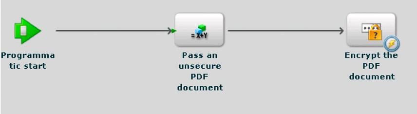
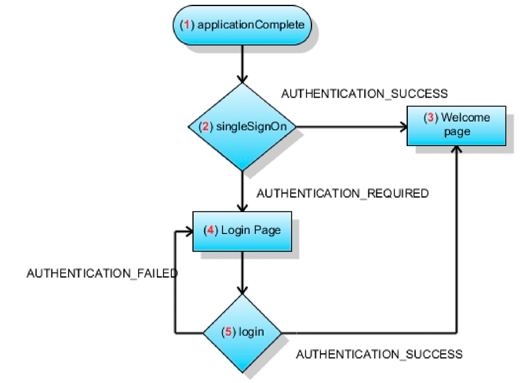
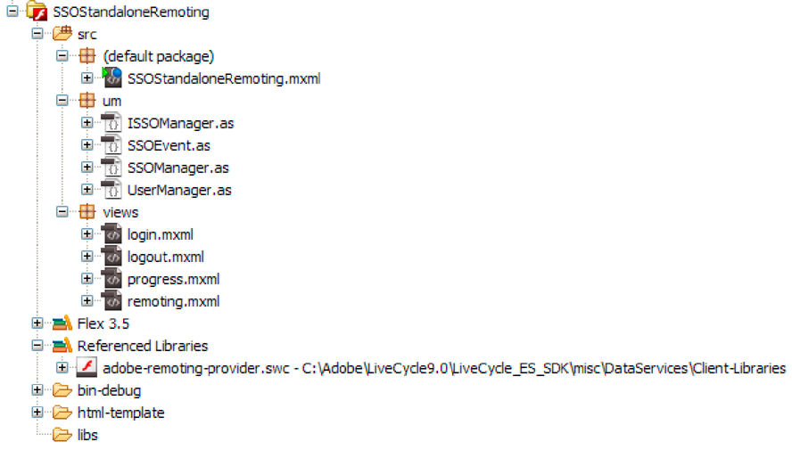

# Creating Flash Builder applications that perform SSO authentication using HTTP tokens {#creating-flash-builder-applicationsthat-perform-sso-authentication-using-http-tokens} 

**Samples and examples in this document are only for AEM Forms on JEE environment.**

You can create a client application using Flash Builder that performs single-sign on (SSO) authentication using HTTP tokens. Assume, for example, that you create a web-based application using Flash Builder. Next assume that the application contains different views, where each view invokes a different AEM Forms operation. Instead of authenticating a user for each Forms operation, you can create a login page that lets a user authenticate once. Once authenticated, a user is able to invoke multiple operations without having to authenticate again. For example, if a user has logged into Workspace (or another Forms application), the user would not need to authenticate again.

Although the client application contains required application logic to perform SSO authentication, AEM forms user Management performs the actual user authentication. To authenticate a user using HTTP tokens, the client application invokes the Authentication Manager service’s `authenticateWithHTTPToken` operation. User Management is able to authenticate users using a HTTP token. For subsequent remoting or web service calls to AEM Forms, you do not have to pass credentials for authentication.

>[!NOTE]
>
>Before reading this section, it is recommended that you are familair with Invoking AEM Forms using Remoting. (See [Invoking AEM Forms using AEM Forms Remoting](/help/forms/developing/invoking-aem-forms-using-remoting.md#invoking-aem-forms-using-remoting).)

The following AEM Forms short-lived process, named `MyApplication/EncryptDocument`, is invoked after a user is authenticated using SSO. (For information about this process such as its input and output values, see [Short lived process example](/help/forms/developing/aem-forms-processes.md).)



>[!NOTE]
>
>This process is not based on an existing AEM Forms process. To follow along with the code examples that discuss how to invoke this process, create a process named `MyApplication/EncryptDocument` using workbench. (See [Using Workbench](https://www.adobe.com/go/learn_aemforms_workbench_63).)

The client application built using Flash Builder interacts with the User Manager’s security servlet configured at `/um/login` and `/um/logout`. That is, the client application sends a request to the `/um/login` URL during startup to determine the status of the user. Then User Manager responds with the user status. The client application and the User Manager security servlet communicate using HTTP.

**Request format**

The security servlet requires the following input variables:

* `um_no_redirect` - This value must be `true`. This variable accompanies all the requests made to the User Manager security servlet. It also helps the security servlet differentiate the incoming request coming from a flex client or other web applications.
* `j_username` - This value is the login identifier value of the user as provided in the login form.
* `j_password` - This value is the corresponding password of the user as provided in the login form.

The `j_password` value is only required for credential requests. If the password value is not specified, then the security servlet checks to determine if the account you are using is already authenticated. If so, you are able to proceed; however, the security servlet does not authenticate you again.

>[!NOTE]
>
>For proper handling of i18n, ensure that these values are in POST form.

**Response format**

The security servlet configured at `/um/login` responds by using the `URLVariables` format. In this format, the output of the content type is text/plain. The output contains name value pairs separated by an ampersand (&) character. The response contains the following variables:

* `authenticated` - The value is either `true` or `false`.
* `authstate` - This value can contain one of the following values:

    * `CREDENTIAL_CHALLENGE` - This state indicates that User Manager is not able to determine the user's identity through any means. In order for authentication to occur, the user's username and password is required.
    * `SPNEGO_CHALLENGE`- This state is treated the same as `CREDENTIAL_CHALLENGE`.
    * `COMPLETE` - This state indicates that User Manager is able to authenticate the user.
    * `FAILED` - This state indicates that User Manager was not able to authenticate the user. As a response to this state, the flex client can show an error message to the user.
    * `LOGGED_OUT` - This state indicates that the user has successfully logged out.

* `assertionid` - If the state was `COMPLETE` then it contains the user's `assertionId` value. A client application can obtain the `AuthResult` for the user.

**Login process**

When a client application starts, you can make a POST request to the `/um/login` security servlet. For example, `https://<your_serverhost>:<your_port>/um/login?um_no_redirect=true`. When the request reaches the User Manager security servlet, it performs the following steps:

1. It looks for a cookie named `lcAuthToken`. If the user has already logged in to another Forms application, then this cookie is present. If the cookie is found, then its content is validated.
1. If Header based SSO is enabled, then the servlet looks for configured headers to determine the user's identity.
1. If SPNEGO is enabled, then the servlet tries to initiate SPNEGO and tries to determine the user's identity.

If the security servlet locates a valid token that matches a user, the security servlet lets you proceed and responds with `authstate=COMPLETE`. Otherwise the security servlet responds with `authstate=CREDENTIAL_CHALLENGE`. The following list explains these values:

* `Case authstate=COMPLETE`: Indicates that the user is authenticated and the `assertionid` value contains the assertion identifier for the user. At this stage, the client application can connect to AEM Forms. The servlet configured for that URL can obtain the `AuthResult` for the user by invoking the `AuthenticationManager.authenticate(HttpRequestToken)` method. The `AuthResult` instance can create the user manager context and store it in the session.
* `Case authstate=CREDENTIAL_CHALLENGE`: Indicates that the security servlet requires the user's credentials. As a response, the client application can display the login screen to the user and send the obtained credential to the security servlet (for example, `https://<your_serverhost>:<your_port>/um/login?um_no_redirect=true&j_username=administrator&j_password=password)`. If authentication is successful, then the security servlet responds with `authstate=COMPLETE`.

If the authentication is still not successful, then the security servlet responds with `authstate=FAILED`. To respond to this value, the client application can display a message to obtain the credentials again.

>[!NOTE]
>
>While `authstate=CREDENTIAL_CHALLENGE`, it's recommended that client send the obtained credential to the security servlet in a POST form.

**Logout process**

When a client application logs out, you can send a request to the following URL:

`https://<your_serverhost>:<your_port>/um/logout?um_no_redirect=true`

On receiving this request, the User Manager security servlet deletes the `lcAuthToken` cookie and responds with `authstate=LOGGED_OUT`. After the client application receives this value, the application can perform cleanup tasks.

## Creating a client application that authenticates AEM forms users using SSO {#creating-a-client-application-that-authenticates-aem-forms-users-using-sso}

To demonstrate how to create a client application that performs SSO authentication, an example client application is created. The following illustration shows the steps that the client application performs to authenticate a user using SSO.



The previous illustration describes the application flow that occurs when the client application starts.

1. The client application triggers the `applicationComplete` event.
1. The call to `ISSOManager.singleSignOn` is made. The client application sends a request to the User Manager security servlet.
1. If the security servlet authenticates the user, then `ISSOManager` dispatches `SSOEvent.AUTHENTICATION_SUCCESS`. As a response, the client application shows the main page. In this example, the main page invokes the AEM Forms short-lived process named MyApplication/EncryptDocument.
1. If the security servlet cannot determine if the user is valid, then the application requests user credentials again. The `ISSOManager` class dispatches the `SSOEvent.AUTHENTICATION_REQUIRED` event. The client application displays the login page.
1. The credentials provided in the login page are sent to the `ISSOManager.login` method. If the authentication is successful, then it leads to step 3. Otherwise the `SSOEvent.AUTHENTICATION_FAILED` event is triggered. The client application displays the login page and an appropriate error message.

### Creating the client application {#creating-the-client-application}

The client application consists of the following files:

* `SSOStandalone.mxml`: The main MXML file that represents the client application. (See [Creating the SSOStandalone.mxml file](creating-flash-builder-applications-perform.md#creating-the-ssostandalone-mxml-file).)
* `um/ISSOManager.as`: Expose operations related to Single Sign On (SSO). (See [Creating the ISSOManager.as file](creating-flash-builder-applications-perform.md#creating-the-issomanager-as-file).)
* `um/SSOEvent.as`: The `SSOEvent` is dispatched for SSO related events. (See [Creating the SSOEvent.as file](creating-flash-builder-applications-perform.md#creating-the-ssoevent-as-file).)
* `um/SSOManager.as`: Manages the SSO related operations and dispatches appropriate events. (See [Creating the SSOManager.as file](creating-flash-builder-applications-perform.md#creating-the-ssomanager-as-file).)
* `um/UserManager.as`: Contains application logic that invokes the Authentication Manager service using its WSDL. (See [Creating the UserManager.as file](creating-flash-builder-applications-perform.md#creating-the-usermanager-as-file).)
* `views/login.mxml`: Represents the login screen. (See [Creating the login.mxml file](creating-flash-builder-applications-perform.md#creating-the-login-mxml-file).)
* `views/logout.mxml`: Represents the logout screen. (See [Creating the logout.mxml file](creating-flash-builder-applications-perform.md#creating-the-logout-mxml-file).)
* `views/progress.mxml`: Represents a progress view. (See [Creating the progress.mxml file](creating-flash-builder-applications-perform.md#creating-the-progress-mxml-file).)
* `views/remoting.mxml`: Represents the view that invokes AEM Forms short-lived process named MyApplication/EncryptDocument using remoting. (See [Creating the remoting.mxml file](creating-flash-builder-applications-perform.md#creating-the-remoting-mxml-file).)

The following illustration provides a visual representation of the client application.



>[!NOTE]
>
>Notice that there are two packages named um and views. When creating the client application, ensure that you place the files in their proper packages. Also, ensure that you add the adobe-remoting-provider.swc file to your project’s class path. (See [Including the AEM Forms Flex library file](/help/forms/developing/invoking-aem-forms-using-remoting.md#including-the-aem-forms-flex-library-file).)

### Creating the SSOStandalone.mxml file {#creating-the-ssostandalone-mxml-file}

The following code represents the SSOStandalone.mxml file.

```xml
 <?xml version="1.0" encoding="utf-8"?>
 <mx:Application
                 layout="absolute"
                 applicationComplete="initApp()"
                 height="400" width="550"
                 xmlns:v="views.*"
                 backgroundColor="#EDE8F0" viewSourceURL="srcview/index.html">
     <mx:Script>
         <![CDATA[
             import mx.utils.URLUtil;
             import um.SSOEvent;
             import mx.core.UIComponent;
             import um.SSOManager;
             import mx.rpc.events.ResultEvent;
             import mx.utils.ObjectUtil;
             import mx.controls.Alert;
 
             [Bindable]
             private var _serverURL:String;
 
             private var _ssoManager:SSOManager;
 
             private var _progress:UIComponent;
 
             private var _loginPage:UIComponent;
 
             private function initApp():void{
                 _serverURL = determineServerUrl();
                 _ssoManager = new SSOManager(_serverURL);
 
                 _ssoManager.addEventListener(SSOEvent.AUTHENTICATION_FAILED,loginHandler);
                 _ssoManager.addEventListener(SSOEvent.AUTHENTICATION_SUCCESS,loginHandler);
                 _ssoManager.addEventListener(SSOEvent.AUTHENTICATION_REQUIRED,loginHandler);
                 _ssoManager.addEventListener(SSOEvent.LOGOUT_COMPLETE,loginHandler);
                 _ssoManager.addEventListener(SSOEvent.AUTHENTICATION_FAULT,loginHandler);
 
                 trace("[Main] Add the required event handlers for authentication");
                 _ssoManager.singleSignOn();
 
                 showBusy();
             }
 
             private function determineServerUrl():String
             {
                 var s:String ;
                 var appUrl:String = Application.application.url;
                 var givenUrl:String  = ExternalInterface.call("serverUrl.toString");
                 trace("[Main] Application url ["+appUrl+"] Given url ["+givenUrl+"]");
                 if(appUrl != null && appUrl.search("^http") != -1){
                     s = appUrl;
                 }
                 if(s == null){
                     s = givenUrl;
                 }
                 if(s== null){
                     s = "https://hiro-xp:8080/";
                 }
                 s = URLUtil.getFullURL(s,"/");
                 trace("[Main] Would be using ["+s+"] as serverUrl");
                 return s;
             }
 
             private function loginHandler(event:SSOEvent):void
             {
                 trace("[Main] Handling event "+event.type);
                 switch(event.type)
                 {
                     case SSOEvent.AUTHENTICATION_FAILED:
                         viewContent.selectedChild = login;
                         login.showLoginFailed();
                         break;
                     case SSOEvent.AUTHENTICATION_SUCCESS:
                         viewContent.selectedChild = remoting;
                         break;
                     case SSOEvent.AUTHENTICATION_REQUIRED:
                         viewContent.selectedChild = login;
                         break;
                     case SSOEvent.LOGOUT_COMPLETE:
                         viewContent.selectedChild = logout;
                         break;
                     case SSOEvent.AUTHENTICATION_FAULT:
                         Alert.show("Error doing authentication. Root error ["+event.rootEvent+"]","Authentication Fault",Alert.OK);
                 }
             }
 
             public function get ssoManager():SSOManager
             {
                 return _ssoManager;
             }
 
             public function showBusy():void
             {
                 viewContent.selectedChild = progress;
             }
 
             public function get serverUrl():String
             {
                 return _serverURL;
             }
 
         ]]>
     </mx:Script>
     <mx:ViewStack x="0" y="0" id="viewContent" >
         <v:login id="login" />
         <v:remoting id="remoting"  />
         <v:progress id="progress" />
         <v:logout id="logout"/>
     </mx:ViewStack>
 </mx:Application>
 
```

### Creating the ISSOManager.as file {#creating-the-issomanager-as-file}

The following code represents the ISSOManager.as file.

```java
 package um
 {
     import flash.events.IEventDispatcher;
 
     /**
      * The <code>ISSOManager</code> expose operations related to Single Sign On (SSO) in AEM Forms
      * environment. The application should register appropriate <code>SSOEvent</code> handlers prior
      * to calling any of the following operations
      */
     public interface ISSOManager extends IEventDispatcher
     {
         /**
          * Tries to validate whether the user has an already existing session or not (SSO Scenarios). The application
          * may call this method during the initialization. In general this call would lead to one of the
          * following events getting dispatched
          * <ul>
          * <li>SSOEvent.AUTHENTICATION_SUCCESS - If a SSO session was found and valid
          * <li>SSOEvent.AUTHENTICATION_REQUIRED - No SSO session was found and as such authentication is required in
          * the form of username and password.
          * <li>SSOEvent.AUTHENTICATION_FAULT - Some error has occured while connecting to the server
          * </ul>
          */
         function singleSignOn():void;
 
         /**
          * Authenticates the user using username and password. It may lead to one of the following events
          * <ul>
          * <li>SSOEvent.AUTHENTICATION_SUCCESS - The authentication is successful and a session is established
          * <li>SSOEvent.AUTHENTICATION_FAILED - Authentication has failed
          * </ul>
          */
         function login(username:String, password:String):void;
 
         /**
          * Terminates the current session and logs out the user.
          */
         function logout():void;
 
         /**
          * Get the assertionId for the logged in user
          */
         function get assertionId():String;
     }
 }
```

### Creating the SSOEvent.as file {#creating-the-ssoevent-as-file}

The following code represents the SSOEvent.as file.

```java
 package um
 {
     import flash.events.Event;
 
     /**
      * The <code>SSOEvent</code> is dispatched for SSO related events
      */
     public class SSOEvent extends Event
     {
         /**
          * This type of event would be dispatched when the Authentication process is successful. Authentication
          * might have been done with SSO or username and password. As a response to this event the application
          * can show the welcome page to the user
          * The application may want to perform specific check for permission/role so as to verify the user is allowed.
          * So as a response to this event the application would do those checks and then only show the welcome page
          */
         public static const AUTHENTICATION_SUCCESS:String = "authenticationSuccess";
 
         /**
          * This type of event would be dispatched when authentication fails using the username, password.
          * As a response to this type of event an application can show an error message to the user.
          * This event would only happen when authentication is done using username and password and NOT in
          * SSO case.
          */
         public static const AUTHENTICATION_FAILED:String = "authenticationFailed";
 
         /**
          * This type of event would be dispatched when authentication using SSO is not achieved. And due to
          * that we require the user's username and password for authentication. As a response to this event
          * the application can show the login page to the user.
          */
         public static const AUTHENTICATION_REQUIRED:String = "authenticationRequired";
 
         /**
          * This type of event would be dispatched when logout is complete. As a response to this event the
          * application may show a logout page informing the user that he has been logged out. Or the application
          * can take the user back to login page
          */
         public static const LOGOUT_COMPLETE:String = "logoutComplete";
 
         /**
          * This type of event would be dispatched when ever there is a problem in doing Authentication. The root cause
          * can be obtained from the <code>rootEvent</code>.
          */
         public static const AUTHENTICATION_FAULT:String = "authenticationFault";
 
         private var _rootEvent:Event;
 
         public function SSOEvent(type:String, rootEvent:Event=null)
         {
             super(type,true,false);
             _rootEvent = rootEvent;
         }
 
         /**
          * The root event. If current event type is <code>AUTHENTICATION_FAULT</code> then it would be an
          * <code>IOErrorEvent</code> in other cases it would be complete event. Its basic use is to extract the root
          * cause if there is an authentication fault.
          */
         public function get rootEvent():Event
         {
             return _rootEvent;
         }
     }
 }
```

### Creating the SSOManager.as file {#creating-the-ssomanager-as-file}

The following code represents the SSOManager.as file.

```java
 package um
 {
     import flash.events.Event;
     import flash.events.EventDispatcher;
     import flash.events.IOErrorEvent;
     import flash.external.ExternalInterface;
     import flash.net.URLLoader;
     import flash.net.URLLoaderDataFormat;
     import flash.net.URLRequest;
     import flash.net.URLVariables;
 
     import mx.utils.ObjectUtil;
 
     /**
      * Manages the SSO related operations and dispatches appropriate events. It would connect to the UM Filter/Servlet
      * at <code>um/login</code> The UM response would be of form of url encoded variables. It would look for
      * <code>authstate</code> value in the response and depending on that it would proceed.
      *
      * <p>If there is an IO_Error while initial attempt to UM then it would assume it as a 401 response. And it would
      * be assumed that SPNEGO based authenticatin is not working and therefore user would be shown a login page.
      */
     public class SSOManager extends EventDispatcher implements ISSOManager
     {
         private static const SSO_URL:String = "um/login";
         private static const SSO_LOGOUT_URL:String = "um/logout";
         private static const AUTH_COOKIE_NAME:String = "lcAuthToken";
 
         private var _serverUrl:String;
         private var _assertionId:String;
 
         /**
          * Constructs an SSOManager with the given server url.
          *
          * @param serverUrl - The uri of the server to connect to. it must be without any context path for example,
          * http://localhost:8080/. The SSOManager would directly append the path of UM exposed SSO url to it
          * for its operations
          */
         public function SSOManager(serverUrl:String)
         {
             _serverUrl = serverUrl;
         }
 
         public function singleSignOn():void
         {
             sendRequest(SSO_URL,true);
         }
 
         public function login(username:String, password:String):void
         {
             sendRequest(SSO_URL,false,
                 function(request:URLRequest,vars:URLVariables):void
                 {
                     vars.j_username = username;
                     vars.j_password = password;
                 }
             );
         }
 
         public function logout():void
         {
             sendRequest(SSO_LOGOUT_URL);
         }
 
         public function get assertionId():String
         {
             return _assertionId;
         }
 
 
 
         /**
          * Connects to the UM security service.
          */
         private function sendRequest(relativeUrl:String,authenticationRequest:Boolean=false, requestProcessor:Function=null):void
         {
             var loader:URLLoader = new URLLoader();
             loader.dataFormat = URLLoaderDataFormat.VARIABLES;
             var request:URLRequest = new URLRequest(_serverUrl + relativeUrl);
             trace("[SSOmanager] Contacting ["+request.url+"]");
             var vars:URLVariables = new URLVariables();
             vars.um_no_redirect = "true";
             request.data = vars;
             if(requestProcessor != null){
                 requestProcessor(request,vars);
             }
 
             loader.addEventListener(Event.COMPLETE,authHandler);
             //if its an authentication request then only treat io error as a possible 401
             //for others treat them as faults
             if(authenticationRequest){
                 loader.addEventListener(IOErrorEvent.IO_ERROR,httpAuthenticationHandler);
             }else{
                 loader.addEventListener(IOErrorEvent.IO_ERROR,authFaultHandler);
             }
             trace("[SSOmanager] Sending request "+ ObjectUtil.toString(request));
             loader.load(request);
         }
 
         private function authHandler(event:Event):void
         {
             var loader:URLLoader = URLLoader(event.target);
             var response:URLVariables = URLVariables(loader.data);
             trace("[SSOmanager] Processing response ["+ObjectUtil.toString(response)+"]");
             handleAuthResult(response["authstate"],response);
         }
 
         /**
          * Handles the IOErrorEvent. Flash would dispatch IOEvent in response to HTTP 401.
          * There is no way to distinguish it from the genuine IOError.
          */
         private function httpAuthenticationHandler(event:IOErrorEvent):void
         {
             trace("[SSOmanager] Processing IOErrorEvent ["+ObjectUtil.toString(event)+"]");
             handleAuthResult("CREDENTIAL_CHALLENGE");
 
         }
 
         /**
          * Dispatches appropriate <code>SSOEvent</code> on the basis of the <code>authstate</code>
          * value of the response.
          * The response is url encoded in for of
          * <pre>
          * authenticated=false&authstate=SPNEGO_CHALLENGE
          * </pre>
          * Depending on <code>authstate</code> the SSOEvent is dispatched
          */
         private function handleAuthResult(authState:String,response:URLVariables = null):void
         {
             trace("[SSOmanager] processing state "+authState);
             switch(authState)
             {
                 case "FAILED"  :
                     dispatchEvent(new SSOEvent(SSOEvent.AUTHENTICATION_FAILED));
                     break;
                 case "COMPLETE" :
                     _assertionId = response ? response["assertionid"] : null;
                     dispatchEvent(new SSOEvent(SSOEvent.AUTHENTICATION_SUCCESS));
                     break;
                 case "CREDENTIAL_CHALLENGE" :
                     dispatchEvent(new SSOEvent(SSOEvent.AUTHENTICATION_REQUIRED));
                     break;
                 case "LOGGED_OUT" :
                     dispatchEvent(new SSOEvent(SSOEvent.LOGOUT_COMPLETE));
                     break;
                 default:
                     dispatchEvent(new SSOEvent(SSOEvent.AUTHENTICATION_REQUIRED));
                     break;
             }
         }
 
         private function authFaultHandler(event:Event):void
         {
             dispatchEvent(new SSOEvent(SSOEvent.AUTHENTICATION_FAULT,event));
         }
 
     }
 }
```

### Creating the UserManager.as file {#creating-the-usermanager-as-file}

The following code represents the UserManager.as file.

```java
 package um
 {
     import flash.events.Event;
     import mx.rpc.soap.WebService;
     import mx.rpc.soap.Operation;
     import mx.rpc.IResponder;
     import mx.rpc.events.FaultEvent;
     import mx.rpc.events.ResultEvent;
     import mx.rpc.soap.LoadEvent;
 
     public class UserManager
     {
         private var _ssoManager:ISSOManager;
         private var _serverUrl:String;
 
         public function UserManager(ssoManager:ISSOManager,serverUrl:String)
         {
             _serverUrl = serverUrl;
             _ssoManager = ssoManager;
         }
 
         public function retrieveAssertion(responder:IResponder):String
         {
             var assertionId:String = _ssoManager.assertionId;
             if(!assertionId)
             {
                 trace("[UserManager] AssertionId not found");
                 return null;
             }
 
             var ws:WebService = new WebService();
             var wsdl:String = _serverUrl+'soap/services/AuthenticationManagerService?wsdl&lc_version=8.2.1';
             ws.loadWSDL(wsdl);
             ws.addEventListener(LoadEvent.LOAD,
                 function(event:Event):void
                 {
                     trace("[UserManager] WSDL loaded");
                     var authenticate:Operation = ws.authenticateWithHttpToken as Operation;
                     authenticate.resultFormat = "e4x";
                     authenticate.addEventListener(ResultEvent.RESULT,
                         function(event:Event):void
                         {
                             responder.result(event);
                         }
                     );
                     authenticate.send({assertionId:assertionId});
                 }
             );
 
             ws.addEventListener(FaultEvent.FAULT,
                 function(event:Event):void
                 {
                     responder.fault(event);
                 }
             );
             return null;
         }
     }
 }
```

### Creating the login.mxml file {#creating-the-login-mxml-file}

The following code represents the login.mxml file.

```xml
 <?xml version="1.0" encoding="utf-8"?>
 <mx:Canvas  width="500" height="400">
     <mx:Script>
         <![CDATA[
             import mx.core.Application;
             public function showLoginFailed():void
             {
                 loginMessage.text = "Username or Password incorrect";
             }
 
             private function doLogin():void
             {
                 Application.application.ssoManager.login(j_username.text,j_password.text);
                 Application.application.showBusy();
             }
 
         ]]>
     </mx:Script>
 
     <mx:VBox height="113" width="244" x="128" y="144" horizontalAlign="center" verticalGap="10">
         <mx:HBox width="100%">
             <mx:HBox width="100%" verticalAlign="middle" horizontalAlign="center" height="32">
                 <mx:Label text="Username" fontWeight="bold"/>
                 <mx:TextInput id="j_username"/>
             </mx:HBox>
         </mx:HBox>
         <mx:HBox width="100%" height="33" horizontalAlign="center" horizontalGap="10" verticalAlign="middle">
             <mx:Label text="Password" fontWeight="bold"/>
             <mx:TextInput displayAsPassword="true" id="j_password"/>
         </mx:HBox>
         <mx:Button label="Login" click="doLogin()"/>
     </mx:VBox>
     <mx:Text x="128" y="122" id="loginMessage" width="230" height="14"/>
     <mx:Label x="154" y="65" text="AEM Forms SSO Demo" fontFamily="Georgia" fontSize="20" color="#0A0A0A"/>
 </mx:Canvas>
 
```

### Creating the logout.mxml file {#creating-the-logout-mxml-file}

The following code represents the logout.mxml file.

```xml
 <?xml version="1.0" encoding="utf-8"?>
 <mx:Canvas  width="500" height="400">
     <mx:Label x="97" y="188" text="You have successfully logged out from the application"/>
 
 </mx:Canvas>
 
```

### Creating the progress.mxml file {#creating-the-progress-mxml-file}

The following code represents the progress.mxml file.

```xml
 <?xml version="1.0" encoding="utf-8"?>
 <mx:Canvas >
     <mx:Label x="151" y="141" text="Wait...."/>
     <mx:SWFLoader source="LoadingCircle.swf" width="50" height="50" horizontalCenter="0" verticalCenter="0"/>
 </mx:Canvas>
```

### Creating the remoting.mxml file {#creating-the-remoting-mxml-file}

The following code represents the remoting.mxml file that invokes the `MyApplication/EncryptDocument` process. Because a document is passed to the process, application logic responsible for passing a secure document to AEM Forms is in this file. (See [Passing secure documents to invoke processes using Remoting](/help/forms/developing/invoking-aem-forms-using-remoting.md#passing-secure-documents-to-invoke-processes-using-remoting).)

```xml
 <?xml version="1.0" encoding="utf-8"?>
 <mx:Canvas  width="664" height="400" creationComplete="initializeChannelSet()" xmlns:views="views.*">
     <mx:Script>
 
         <![CDATA[
 
             import mx.rpc.livecycle.DocumentReference;
             import flash.net.FileReference;
             import flash.net.URLRequest;
             import flash.events.Event;
             import flash.events.DataEvent;
             import mx.messaging.ChannelSet;
             import mx.messaging.channels.AMFChannel;
             import mx.rpc.events.ResultEvent;
             import mx.collections.ArrayCollection;
             import mx.rpc.AsyncToken;
             import um.UserManager;
             import mx.rpc.events.ResultEvent;
             import mx.rpc.events.FaultEvent;
             import mx.core.Application;
             import mx.rpc.Responder;
             import mx.utils.ObjectUtil;
 
             // Classes used in file retrieval
             private var fileRef:FileReference = new FileReference();
             private var docRef:DocumentReference = new DocumentReference();
             private var parentResourcePath:String = "/";
             //private var serverPort:String = "'[server]:[port]'";
             private var serverPort:String = "'[server]:[port]'";
             private var now1:Date;
             private var userManager:UserManager;
 
             // Define a ChannelSet object.
             public var cs:ChannelSet;
 
             // Holds information returned from AEM Forms
             [Bindable]
             public var progressList:ArrayCollection = new ArrayCollection();
 
 
             // Set up channel set to invoke AEM Forms.
             // This must be done before calling any service or process, but only
             // once for the entire application.
             private function initializeChannelSet():void {
                 cs = new ChannelSet();
                 cs.addChannel(new AMFChannel("remoting-amf", "https://" + serverPort + "/remoting/messagebroker/amf"));
                 EncryptDocument.channelSet = cs;
 
             //Get the user that is authenticated
             userManager = new UserManager(Application.application.ssoManager,Application.application.serverUrl);
             userManager.retrieveAssertion(
                     new mx.rpc.Responder(
                         function(event:ResultEvent):void
                         {
                             var name:String = XML(event.currentTarget.lastResult)..*::authenticatedUser.*::userid.text();
                             username.text = "Welcome "+name;
                         },
                         function(event:FaultEvent):void
                         {
                             mx.controls.Alert.show(event.fault.faultString,'Error')
                         }
                     )
                 );
 
             }
 
             // Call this method to upload the file.
             // This creates a file picker and lets the user select a PDF file to pass to the EncryptDocument process.
             private function uploadFile():void {
                 fileRef.addEventListener(Event.SELECT, selectHandler);
                 fileRef.addEventListener(DataEvent.UPLOAD_COMPLETE_DATA,completeHandler);
                 fileRef.browse();
             }
 
             // Gets called for selected file. Does the actual upload via the file upload servlet.
             private function selectHandler(event:Event):void {
                 var authTokenService:RemoteObject = new RemoteObject("LC.FileUploadAuthenticator");
                 authTokenService.addEventListener("result", authTokenReceived);
                 authTokenService.channelSet = cs;
                 authTokenService.getFileUploadToken();
             }
 
             private function authTokenReceived(event:ResultEvent):void
             {
                 var token:String = event.result as String;
                 var request:URLRequest = DocumentReference.constructRequestForUpload("https://hiro-xp:8080", token);
 
                 try
                 {
                     fileRef.upload(request);
                 }
                 catch (error:Error)
                 {
                     trace("Unable to upload file.");
                 }
             }
 
             // Called once the file is completely uploaded.
             private function completeHandler(event:DataEvent):void {
 
                 // Set the docRefs url and referenceType parameters
                 docRef.url = event.data as String;
                 docRef.referenceType=DocumentReference.REF_TYPE_URL;
                 executeInvokeProcess();
             }
 
             //This method invokes the EncryptDocument process
             public function executeInvokeProcess():void {
                 //Create an Object to store the input value for the EncryptDocument process
                 now1 = new Date();
 
                 var params:Object = new Object();
                 params["inDoc"]=docRef;
 
                 // Invoke the EncryptDocument process
                 var token:AsyncToken;
                 token = EncryptDocument.invoke(params);
                 token.name = name;
             }
 
 
             // This method handles a successful conversion invocation
             public function handleResult(event:ResultEvent):void
             {
 
                 //Retrieve information returned from the service invocation
                 var token:AsyncToken = event.token;
                 var res:Object = event.result;
                 var dr:DocumentReference = res["outDoc"] as DocumentReference;
                 var now2:Date = new Date();
 
                 // These fields map to columns in the DataGrid
                 var progObject:Object = new Object();
                 progObject.filename = token.name;
                 progObject.timing = (now2.time - now1.time).toString();
                 progObject.state = "Success";
                 progObject.link = "<a href='" + dr.url + "'> open </a>";
                 progressList.addItem(progObject);
             }
 
 
             private function resultHandler(event:ResultEvent):void {
             // Do anything else here.
 
             }
 
             private function logout():void
             {
                 Application.application.ssoManager.logout();
                 Application.application.showBusy();
             }
 
 
         ]]>
 
     </mx:Script>
 
     <mx:RemoteObject id="EncryptDocument" destination="MyApplication/EncryptDocument" result="resultHandler(event);">
             <mx:method name="invoke" result="handleResult(event)"/>
     </mx:RemoteObject>
 
 
     <!--//This consists of what is displayed on the webpage-->
     <mx:Panel id="lcPanel" title="EncryptDocument  (Deprecated for AEM forms) AEM Forms Remoting Example"
           height="25%" width="25%" paddingTop="10" paddingLeft="10" paddingRight="10"
           paddingBottom="10">
         <mx:Label width="100%" color="blue"
                   id="username"/>
 
         <mx:DataGrid x="10" y="0" width="500" id="idProgress" editable="false"
                          dataProvider="{progressList}" height="231" selectable="false" >
         <mx:columns>
                 <mx:DataGridColumn headerText="Filename" width="200" dataField="filename" editable="false"/>
                 <mx:DataGridColumn headerText="State" width="75" dataField="state" editable="false"/>
                 <mx:DataGridColumn headerText="Timing" width="75" dataField="timing" editable="false"/>
                 <mx:DataGridColumn headerText="Click to Open" dataField="link" editable="false" >
                 <mx:itemRenderer>
 
                         <mx:Component>
                         <mx:Text x="0" y="0" width="100%" htmlText="{data.link}"/>
                         </mx:Component>
                     </mx:itemRenderer>
             </mx:DataGridColumn>
         </mx:columns>
     </mx:DataGrid>
     <mx:Button label="Select File" click="uploadFile()" />
     <mx:Button label="Logout"  click="logout()" />
     </mx:Panel>
 </mx:Canvas>
 
 
```

### Additional Information {#additional-information}

The following sections provide additional details that describe the communication between the client application and the User Manager security servlet.

### A new authentication occurs {#a-new-authentication-occurs}

In this situation, the user attempts to log in from a client application to AEM Forms for the first time. (no previous session involving the user exists.) In the `applicationComplete` event, the `SSOManager.singleSignOn` method is invoked that sends a request to the User Manager.

`GET /um/login?um%5Fno%5Fredirect=true HTTP/1.1`

The User Manager security servlet responds with the following value:

`HTTP/1.1 200 OK`

`authenticated=false&authstate=CREDENTIAL_CHALLENGE`

As response to this value, a `SSOEvent.AUTHENTICATION_REQUIRED` value is dispatched. As a result, the client application displays a login screen to the user. The credentials are submitted back to the User Manager security servlet.

`GET /um/login?um%5Fno%5Fredirect=true&j%5Fusername=administrator&j%5Fpassword=password HTTP/1.1`

The User Manager security servlet responds with the following value:

```verilog
 HTTP/1.1 200 OK
 Set-Cookie: lcAuthToken=53630BC8-F6D4-F588-5D5B-4668EFB2EC7A; Path=/
 authenticated=true&authstate=COMPLETE&assertionid=53630BC8-F6D4-F588-5D5B-4668EFB2EC7A
```

As a result, `authstate=COMPLETE the SSOEvent.AUTHENTICATION_SUCCESS` is dispatched. The client application can perform further processing if necessary. For example, a log that tracks the date and time that the user was authenticated can be created.

### The user is already authenticated {#the-user-is-already-authenticated}

In this situation, the user has already logged in to AEM Forms and then navigates to the client application. The client application connects to the User Manager security servlet during startup.

```verilog
 GET /um/login?um%5Fno%5Fredirect=true HTTP/1.1
 Cookie: JSESSIONID=A4E0BCC2DD4BCCD3167C45FA350BD72A; lcAuthToken=53630BC8-F6D4-F588-5D5B-4668EFB2EC7A
```

Because the user is already authenticated, the User Manager cookie is present and is sent to the User Manager security servlet. The servlet then gets the `assertionId` value and verifies whether it is valid. If it is valid, then `authstate=COMPLETE` is returned. Otherwise `authstate=CREDENTIAL_CHALLENGE` is returned. The following is a typical response:

```verilog
 HTTP/1.1 200 OK
        authenticated=true&authstate=COMPLETE&assertionid=53630BC8-F6D4-F588-5D5B-4668EFB2EC7A
```

In this situation, the user is not shown a login screen and instead directly taken to a Welcome Screen.
