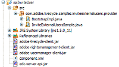

# Creating an Invite External Users Handler {#create-invite-external-users-handler} 

**Samples and examples in this document are only for AEM Forms on JEE environment.**

You can create an Invite External Users Handler for the Rights Management service. An Invite External Users Handler enables the Rights Management service to invite external users to become Rights Management users. After a user becomes a Rights Management user, the user is able to perform tasks, such as opening a policy-protected PDF document. After the Invite External Users Handler is deployed to AEM Forms, you can use administration console to interact with it.

>[!NOTE]
>
>An Invite External Users Handler is a AEM Forms component. Before you create an Invite External Users Handler, it is recommended that you become familiar with creating components.

**Summary of steps**

To develop an Invite External Users Handler, you must perform the following steps:

1. Set up your development environment.
1. Define the Invite External Users Handler implementation.
1. Define the component XML file.
1. Deploy the Invite External Users Handler.
1. Test the Invite External Users Handler.

## Setting up your development environment {#setting-up-development-environment}

To set up your development environment, you must create a Java project, such as an Eclipse project. The version of Eclipse that is supported is `3.2.1` or later.

The Rights Management SPI requires the `edc-server-spi.jar` file to be set in your project's class path. If you do not reference this JAR file, you cannot use the Rights Management SPI in your Java project. This JAR file is installed with the AEM Forms SDK in the `[install directory]\Adobe\Adobe_Experience_Manager_forms\sdk\spi` folder.

In addition to adding the `edc-server-spi.jar` file to your project's class path, you must also add the JAR files that are required to use the Rights Management Service API. These files are needed to use the Rights Management Service API within the Invite External Users Handler.

## Defining the invite external users handler implementation {#define-invite-external-users-handler}

To develop an invite external users handler, you must create a Java class that implements the `com.adobe.edc.server.spi.ersp.InvitedUserProvider` interface. This class contains a method named `invitedUser`, which the Rights Management service invokes when email addresses are submitted using the **Add Invited Users** page accessible through administration console.

The `invitedUser` method accepts a `java.util.List` instance, which contains string-typed email addresses that are submitted from the **Add Invited Users** page. The `invitedUser` method returns an array of `InvitedUserProviderResult` objects, which is generally a mapping of email addresses to User objects (do not return null).

>[!NOTE]
>
>In addition to demonstrating how to create an invite external users handler, this section also uses the AEM Forms API.

The implementation of the invite external users handler contains a user-defined method named `createLocalPrincipalAccount`. This method accepts a string value that specifies an email address as a parameter value. The `createLocalPrincipalAccount` method assumes the pre-existence of a local domain called `EDC_EXTERNAL_REGISTERED`. You can configure this domain name to be anything you wish; however, for a production application, you may want to integrate with an enterprise domain.

The `createUsers` method iterates over every email address and creates a corresponding User object (a local user in the `EDC_EXTERNAL_REGISTERED` domain). Finally, the `doEmails` method is called. This method is intentionally left as a stub in the sample. In a production implementation, it would contain application logic to send invitation email messages to the newly created users. It is left in the sample to demonstrate the application logic flow of a real application.

### Defining the invite external users handler implementation {#user-handler-implementation}

The following invite external users handler implementation accepts email addresses that are submitted from the Add Invited Users page accessible through administration console.

```as3
package com.adobe.livecycle.samples.inviteexternalusers.provider; 
 
import com.adobe.edc.server.spi.ersp.*; 
import com.adobe.idp.dsc.clientsdk.ServiceClientFactory; 
import com.adobe.idp.um.api.*; 
import com.adobe.idp.um.api.infomodel.*; 
import com.adobe.idp.um.api.impl.UMBaseLibrary; 
import com.adobe.livecycle.usermanager.client.DirectoryManagerServiceClient; 
 
import java.util.ArrayList; 
import java.util.Iterator; 
import java.util.List; 
 
public class InviteExternalUsersSample implements InvitedUserProvider 
{ 
       private ServiceClientFactory _factory = null; 
 
       private User createLocalPrincipalAccount(String email_address) throws Exception 
       { 
    String ret = null; 
 
    //  Assume the local domain already exists! 
    String domain = "EDC_EXTERNAL_REGISTERED"; 
         
    List aliases = new ArrayList(); 
    aliases.add( email_address ); 
         
    User local_user = UMBaseLibrary.createUser( email_address, domain, email_address ); 
    local_user.setCommonName( email_address ); 
    local_user.setEmail( email_address ); 
    local_user.setEmailAliases( aliases ); 
         
    //  You may wish to disable the local user until, for example, his registration is processed by a confirmation link 
    //local_user.setDisabled( true ); 
 
    DirectoryManager directory_manager = new DirectoryManagerServiceClient( _factory ); 
    String ret_oid = directory_manager.createLocalUser( local_user, null ); 
     
    if( ret_oid == null ) 
    { 
        throw new Exception( "FAILED TO CREATE PRINCIPAL FOR EMAIL ADDRESS: " + email_address ); 
    } 
 
    return local_user; 
       } 
 
       protected User[] createUsers( List emails ) throws Exception 
       { 
    ArrayList ret_users = new ArrayList(); 
 
    _factory = ServiceClientFactory.createInstance(); 
 
    Iterator iter = emails.iterator(); 
 
    while( iter.hasNext() ) 
    { 
        String current_email = (String)iter.next(); 
 
        ret_users.add( createLocalPrincipalAccount( current_email ) ); 
    } 
 
    return (User[])ret_users.toArray( new User[0] ); 
       } 
 
       protected void doInvitations(List emails) 
       { 
    //  Here you may choose to send the users who were created an invitation email 
    //  This step is completely optional, depending on your requirements.   
       } 
 
       public InvitedUserProviderResult[] invitedUser(List emails) 
       { 
    //  This sample demonstrates the workflow for inviting a user via email 
 
    try 
    { 
 
        User[] principals = createUsers(emails); 
 
        InvitedUserProviderResult[] result = new InvitedUserProviderResult[principals.length]; 
        for( int i = 0; i < principals.length; i++ ) 
        { 
        result[i] = new InvitedUserProviderResult(); 
 
        result[i].setEmail( (String)emails.get( i ) ); 
        result[i].setUser( principals[i] ); 
        } 
 
        doInvitations(emails); 
 
        System.out.println( "SUCCESSFULLY INVITED " + result.length + " USERS" ); 
 
        return result; 
 
    } 
    catch( Exception e ) 
    { 
        System.out.println( "FAILED TO INVITE USERS FOR INVITE USERS SAMPLE" ); 
        e.printStackTrace(); 
 
        return new InvitedUserProviderResult[0]; 
    } 
       } 
}
 
```

>[!NOTE]
>
>This Java class is saved as a JAVA file named InviteExternalUsersSample.java.

## Defining the component XML file for the authorization handler {#define-component-xml-authorization-handler}

Fefine a component XML file to deploy the invite external users handler component. A component XML file exists for each component and provides metadata about the component.

The following `component.xml` file is used for the invite external users handler. Notice that the service name is `InviteExternalUsersSample` and the operation this service exposes is named `invitedUser`. The input parameter is a `java.util.List` instance and the output value is an array of `com.adobe.edc.server.spi.esrp.InvitedUserProviderResult` instances.

### Defining the component XML file for the invite external users handler {#component-xml-invite-external-users-handler}

```as3
<component xmlns="https://adobe.com/idp/dsc/component/document"> 
<component-id>com.adobe.livecycle.samples.inviteexternalusers</component-id> 
<version>1.0</version> 
<bootstrap-class>com.adobe.livecycle.samples.inviteexternalusers.provider.BootstrapImpl</bootstrap-class> 
<descriptor-class>com.adobe.idp.dsc.component.impl.DefaultPOJODescriptorImpl</descriptor-class> 
<services> 
<service name="InviteExternalUsersSample"> 
<specifications> 
<specification spec-id="com.adobe.edc.server.spi.ersp.InvitedUserProvider"/> 
</specifications> 
<specification-version>1.0</specification-version> 
<implementation-class>com.adobe.livecycle.samples.inviteexternalusers.provider.InviteExternalUsersSample</implementation-class> 
<auto-deploy category-id="Samples" service-id="InviteExternalUsersSample" major-version="1" minor-version="0"/> 
<operations> 
<operation name="invitedUser"> 
<input-parameter name="input" type="java.util.List" required="true"/> 
<output-parameter name="result" type="com.adobe.edc.server.spi.esrp.InvitedUserProviderResult[]"/> 
</operation> 
</operations> 
</service> 
</services> 
</component> 

```

## Packaging the invite external users handler {#packaging-invite-external-users-handler}

To deploy the invite external users handler to AEM Forms, you must package your Java project into a JAR file. Ensure that the external JAR files on which the invite external users handler's business logic depends, such as the `edc-server-spi.jar` and `adobe-rightsmanagement-client.jar` files are also included in the JAR file. As well, the component XML file must be present. The `component.xml` file and external JAR files must be located at the root of the JAR file.

>[!NOTE]
>
>In the illustration below, a `BootstrapImpl` class is shown. This section does not discuss how to create a `BootstrapImpl` class.

The following illustration shows the Java project's content that is packaged into the invite external users handler's JAR file.



A. External JAR files required by the component B. JAVA file

Package the invite external users handler into a JAR file. In the previous diagram, notice that .JAVA files are listed. Once packaged into a JAR file, the corresponding .CLASS files must also be specified. Without the .CLASS files, the authorization handler does not work.

>[!NOTE]
>
>After you package the external authorization handler into a JAR file, you can deploy the component to AEM Forms. Only one invite external users handler can be deployed at a given time.

>[!NOTE]
>
>You can also programmatically deploy a component.

## Testing the invite external users handler {#testing-invite-external-users-handler}

To test the invite external users handler, you can add external users to invite by using administration console.

To add external users to invite using administration console:

1. Deploy the invite external users handler's JAR file using Workbench.
1. Restart the application server.

    >[!NOTE]
    >
    > It is recommended to use the 'Ctrl + C' command to restart the SDK. Restarting the AEM SDK using alternative methods, for example, stopping Java processes, may lead to inconsistencies in the AEM development environment.
    
1. Log in to administration console.
1. Click **[!UICONTROL Services]** > **[!UICONTROL Rights Management]** > **[!UICONTROL Configuration]** > Invited **[!UICONTROL User Registration]**.
1. Enable invited user registration by checking the **[!UICONTROL Enable invited user registration]** box. Under **[!UICONTROL Use Built-in registration system]**, click **[!UICONTROL No]**. Save your settings.
1. From the administration console home page, click **[!UICONTROL Settings]** > **[!UICONTROL User Management]** > **[!UICONTROL Domain Management]**.
1. Click **[!UICONTROL New Local Domain]**. On the following page, create a domain with the name and identifier value of `EDC_EXTERNAL_REGISTERED`. Save your changes.
1. From the administration console home page, click **[!UICONTROL Services]** > **[!UICONTROL Rights Management]** > **[!UICONTROL Invited and Local Users]**. The **[!UICONTROL Add Invited User]** page appears.
1. Enter email addresses (because the current invite external users handler does not actually send email messages, the email addressed do not have to be valid). Click **[!UICONTROL OK]**. The users are invited to the system.
1. From the administration console home page, click **[!UICONTROL Settings]** > **[!UICONTROL User Management]** > **[!UICONTROL Users and Groups]**.
1. In the **[!UICONTROL Find]** field, enter an email address that you specified. Click **[!UICONTROL Find]**. The user you invited appears as a user in the local `EDC_EXTERNAL_REGISTERED` domain.

>[!NOTE]
>
>The invite external users handler fails if the component is stopped or uninstalled.
