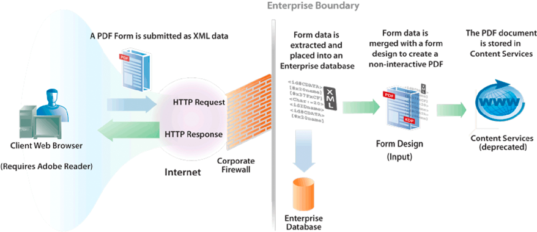
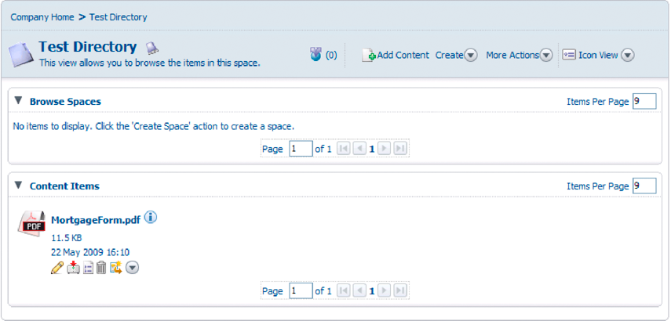

# Creating PDF Documents with Submitted XML Data {#creating-pdf-documents-with-submittedxml-data} 

**Samples and examples in this document are only for AEM Forms on JEE environment.**

## Creating PDF Documents with Submitted XML Data {#creating-pdf-documents-with-submitted-xml-data}

Web-based applications that enable users to fill interactive forms require the data to be submitted back to the server. Using the Forms service, you can retrieve the form data that the user entered into an interactive form. Then you can pass the form data to another AEM Forms service operation and create a PDF document using the data.

>[!NOTE]
>
>Before you read this content, it is recommended that you have a solid understanding of handling submitted forms. Concepts such as the relationship between a form design and submitted XML data are covered in Handling submitted Forms.

Consider the following workflow that involves three AEM Forms services:

* A user submits XML data to the Forms service from a web-based application.
* The Forms service is used to process the submitted form and extract form fields. Form data can be processed. For example, the data can be submitted to an enterprise database.
* Form data is sent to the Output service to create a non-interactive PDF document.
* The non-interactive PDF document is stored in Content Services (deprecated).

The following diagram provides a visual representation of this workflow.

After the user submits the form from the client web browser, the non-interactive PDF document is stored in Content Services (deprecated). The following illustration shows a PDF document stored in Content Services (deprecated).

### Summary of steps {#summary-of-steps}

To create a non-interactive PDF document with submitted XML data and store in the PDF document in Content Services (deprecated), perform the following tasks:

1. Include project files.
1. Create Forms, Output, and Document Management objects.
1. Retrieve form data by using the Forms service.
1. Create a non-interactive PDF document by using the Output service.
1. Store the PDF form in Content Services (deprecated) by using the Document Management service.

**Include project files**

Include necessary files into your development project. If you are creating a client application using Java, include the necessary JAR files. If you are using web services, ensure that you include the proxy files.

**Create Forms, Output, and Document Management objects**

Before you can programmatically perform a Forms service API operation, create a Forms Client API object. Likewise, because this workflow invokes the Output and Document Management services, create both an Output Client API object and a Document Management Client API object.

**Retrieve form data using the Forms service**

Retrieve form data that was submitted to the Forms service. You can process submitted data to meet your business requirements. For example, you can store form data in an enterprise database. However, to create a non-interactive PDF document, the form data is passed to the Output service.

**Create a non-interactive PDF document using the Output service.**

Use the Output service to create a non-interactive PDF document that is based on a form design and XML form data. In the workflow, the form data is retrieved from the Forms service.

**Store the PDF form in Content Services (deprecated) using the Document Management service**

Use the Document Management service API to store a PDF document in Content Services (deprecated).

**See also**

[Including AEM Forms Java library files](/help/forms/developing/invoking-aem-forms-using-java.md#including-aem-forms-java-library-files)

[Setting connection properties](/help/forms/developing/invoking-aem-forms-using-java.md#setting-connection-properties)

[Forms Service API Quick Starts](/help/forms/developing/forms-service-api-quick-starts.md#forms-service-api-quick-starts)

### Create a PDF Document with submitted XML data using the Java API {#create-a-pdf-document-with-submitted-xml-data-using-the-java-api}

Create a PDF document with submitted XML data by using the Forms, Output, and Document Management API (Java):

1. Include project files

   Include client JAR files, such as adobe-forms-client.jar, adobe-output-client.jar, and adobe-contentservices-client.jar in your Java project’s class path.

1. Create Forms, Output, and Document Management objects

    * Create a `ServiceClientFactory` object that contains connection properties.
    * Create a `FormsServiceClient` object by using its constructor and passing the `ServiceClientFactory` object.
    * Create an `OutputClient` object by using its constructor and passing the `ServiceClientFactory` object.
    * Create a `DocumentManagementServiceClientImpl` object by using its constructor and passing the `ServiceClientFactory` object.

1. Retrieve form data using the Forms service

    * Invoke the `FormsServiceClient` object’s `processFormSubmission` method and pass the following values:

        * The `com.adobe.idp.Document` object that contains the form data.
        * A string value that specifies environment variables, including all relevant HTTP headers. Specify the content type to handle by specifying one or more values for the `CONTENT_TYPE` environment variable. For example, to handle XML data, specify the following string value for this parameter: `CONTENT_TYPE=text/xml`.
        * A string value that specifies the `HTTP_USER_AGENT` header value, such as `Mozilla/4.0 (compatible; MSIE 6.0; Windows NT 5.1; SV1; .NET CLR 1.1.4322)`.
        * A `RenderOptionsSpec` object that stores run-time options.

      The `processFormSubmission` method returns a `FormsResult` object containing the results of the form submission.

    * Determine whether the Forms service is finished processing the form data by invoking the `FormsResult` object’s `getAction` method. If this method returns the value `0`, the data is ready to be processed.
    * Retrieve form data by creating a `com.adobe.idp.Document` object by invoking the `FormsResult` object’s `getOutputContent` method. (This object contains form data that can be sent to the Output service.)
    * Create a `java.io.InputStream` object by invoking the `java.io.DataInputStream` constructor and passing the `com.adobe.idp.Document` object.
    * Create an `org.w3c.dom.DocumentBuilderFactory` object by calling the static `org.w3c.dom.DocumentBuilderFactory` object’s `newInstance` method.
    * Create an `org.w3c.dom.DocumentBuilder` object by invoking the `org.w3c.dom.DocumentBuilderFactory` object’s `newDocumentBuilder` method.
    * Create an `org.w3c.dom.Document` object by invoking the `org.w3c.dom.DocumentBuilder` object’s `parse` method and passing the `java.io.InputStream` object.
    * Retrieve the value of each node within the XML document. One way to accomplish this task is to create a custom method that accepts two parameters: the `org.w3c.dom.Document` object and the name of the node whose value you want to retrieve. This method returns a string value representing the value of the node. In the code example that follows this process, this custom method is called `getNodeText`. The body of this method is shown.

1. Create a non-interactive PDF document using the Output service.

   Create a PDF document by invoking the `OutputClient` object’s `generatePDFOutput` method and passing the following values:

    * A `TransformationFormat` enum value. To generate a PDF document, specify `TransformationFormat.PDF`.
    * A string value that specifies the name of the form design. Ensure that the form design is compatible with the form data retrieved from the Forms service.
    * A string value that specifies the content root where the form design is located.
    * A `PDFOutputOptionsSpec` object that contains PDF run-time options.
    * A `RenderOptionsSpec` object that contains rendering run-time options.
    * The `com.adobe.idp.Document` object that contains the XML data source that contains data to merge with the form design. Ensure that this object was returned by the `FormsResult` object’s `getOutputContent` method.
    * The `generatePDFOutput` method returns an `OutputResult` object that contains the results of the operation.
    * Retrieve the non-interactive PDF document by invoking the `OutputResult` object’s `getGeneratedDoc` method. This method returns a `com.adobe.idp.Document` instance that represents the non-interactive PDF document.

1. Store the PDF form in Content Services (deprecated)using the Document Management service

   Add the content by invoking the `DocumentManagementServiceClientImpl` object’s `storeContent` method and passing the following values:

    * A string value that specifies the store where the content is added. The default store is `SpacesStore`. This value is a mandatory parameter.
    * A string value that specifies the fully qualified path of the space where the content is added (for example, `/Company Home/Test Directory`). This value is a mandatory parameter.
    * The node name that represents the new content (for example, `MortgageForm.pdf`). This value is a mandatory parameter.
    * A string value that specifies the node type. To add new content, such as a PDF file, specify `{https://www.alfresco.org/model/content/1.0}content`. This value is a mandatory parameter.
    * A `com.adobe.idp.Document` object that represents the content. This value is a mandatory parameter.
    * A string value that specifies the encoding value (for example, `UTF-8`). This value is a mandatory parameter.
    * An `UpdateVersionType` enumeration value that specifies how to handle version information (for example, `UpdateVersionType.INCREMENT_MAJOR_VERSION` to increment the content version. ) This value is a mandatory parameter.
    * A `java.util.List` instance that specifies aspects related to the content. This value is an optional parameter and you can specify `null`.
    * A `java.util.Map` object that stores content attributes.

   The `storeContent` method returns a `CRCResult` object that describes the content. Using a `CRCResult` object, you can, for example, obtain the content’s unique identifier value. To perform this task, invoke the `CRCResult` object’s `getNodeUuid` method.

**See also**

[Including AEM Forms Java library files](/help/forms/developing/invoking-aem-forms-using-java.md#including-aem-forms-java-library-files)

[Setting connection properties](/help/forms/developing/invoking-aem-forms-using-java.md#setting-connection-properties)
