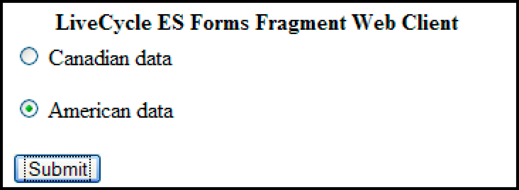
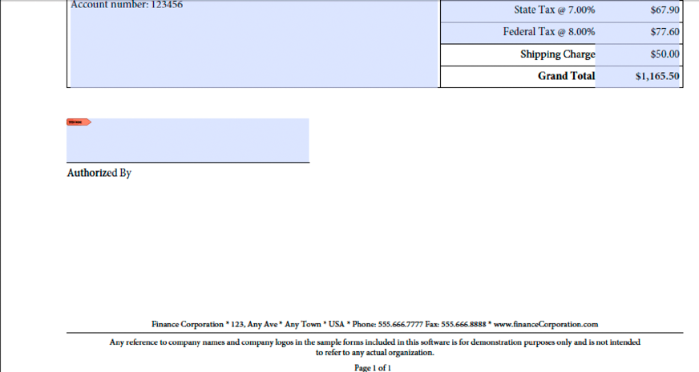
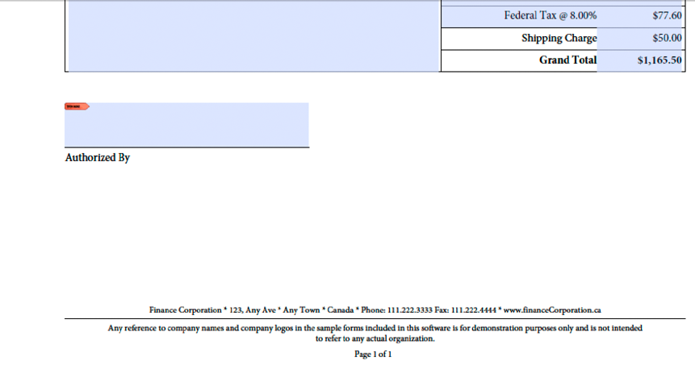

# Creating Web Applications that Renders Forms {#creating-web-applications-thatrenders-forms} 

**Samples and examples in this document are only for AEM Forms on JEE environment.**

## Creating Web Applications that Renders Forms {#creating-web-applications-that-renders-forms}

You can create a web-based application that uses Java servlets to invoke the Forms service and render forms. An advantage of using a Java™ servlet is that you can write the return value of the process to a client web browser. That is, a Java servlet can be used as the link between the Forms service that returns a form and a client web browser.

>[!NOTE]
>
>This section describes how to create a web-based application that uses a Java servlet that invokes the Forms service and renders forms-based on fragments. (See [Rendering Forms Based on Fragments](/help/forms/developing/rendering-forms-based-fragments.md).)

Using a Java servlet, you can write a form to a client web browser so that a customer can view and enter data into the form. After populating the form with data, the web user clicks a submit button located on the form to send information back to the Java servlet, where the data can be retrieved and processed. For example, the data can be sent to another process.

This section discusses how to create a web-based application that enables the user to select either American-based form data or Canadian-based form data, as shown in the following illustration.



The form that is rendered is a form that is based on fragments. That is, if the user selects American data, then the returned form uses fragments based on American data. For example, the footer of the form contains an American address, as shown in the following illustration.



Likewise, if the user selects Canadian data, then the returned form contains a Canadian address, as shown in the following illustration.



>[!NOTE]
>
>For information about creating form designs based on fragments, see [Forms Designer](https://www.adobe.com/go/learn_aemforms_designer_63).

**Sample Files**

This section uses sample files that can be in the following location:

&lt;*Forms Designer install directory*&gt;/Samples/Forms/Purchase Order/Form Fragments

where &lt;*install directory*&gt; is the installation path. For the purposes of the client application, the Purchase Order Dynamic.xdp file was copied from this installation location and deployed to a Forms application named *Applications/FormsApplication*. The Purchase Order Dynamic.xdp file is placed in a folder named FormsFolder. Likewise, the fragments are placed in folder named Fragments, as shown in the following illustration.


To access the Purchase Order Dynamic.xdp form design, specify `Applications/FormsApplication/1.0/FormsFolder/Purchase Order Dynamic.xdp` as the form name (the first parameter passed to the `renderPDFForm` method) and `repository:///` as the content root URI value.

The XML data files used by the web application were moved from the Data folder to `C:\Adobe`(the file system that belongs to the J2EE application server hosting AEM Forms). The file names are Purchase Order *Canada.xml* and Purchase Order *US.xml*.

>[!NOTE]
>
>For information about creating a Forms application using Workbench, see [workbench Help](https://www.adobe.com/go/learn_aemforms_workbench_63).

### Summary of steps {#summary-of-steps}

To create a web-based applications that renders forms based on fragments, perform the following steps:

1. Create a web project.
1. Create Java application logic that represents the Java servlet.
1. Create the web page for the web application.
1. Package the web application to a WAR file.
1. Deploy the WAR file to the J2EE application server.
1. Test your web application.

>[!NOTE]
>
>Some of these steps depend on the J2EE application on which AEM Forms is deployed. For example, the method you use to deploy a WAR file depends on the J2EE application server that you are using. This section assumes that AEM Forms is deployed on JBoss®.

### Creating a web project {#creating-a-web-project}

The first step to create a web application that contains a Java servlet that can invoke the Forms service is to create a web project. The Java IDE that this document is based on is Eclipse 3.3. Using the Eclipse IDE, create a web project and add the required JAR files to your project. Finally, add an HTML page named *index.html* and a Java servlet to your project.

The following list specifies the JAR files that you must add to your web project:

* adobe-forms-client.jar
* adobe-livecycle-client.jar
* adobe-usermanager-client.jar
* adobe-utilities.jar

For the location of these JAR files, see [Including AEM Forms Java library files](/help/forms/developing/invoking-aem-forms-using-java.md#including-aem-forms-java-library-files).

**To create a web project:**

1. Start Eclipse and click **File** &gt;  **New Project**.
1. In the **New Project** dialog box, select **Web** &gt; **Dynamic Web Project**.
1. Type `FragmentsWebApplication` for the name of your project and then click **Finish**.

**To add required JAR files to your project:**

1. From the Project Explorer window, right-click the `FragmentsWebApplication` project and select **Properties**.
1. Click **Java build path** and then click the **Libraries** tab.
1. Click the **Add External JARs** button and browse to the JAR files to include.

**To add a Java servlet to your project:**

1. From the Project Explorer window, right-click the `FragmentsWebApplication` project and select **New** &gt;  **Other**.
1. Expand the **Web** folder, select **Servlet**, and then click **Next**.
1. In the Create Servlet dialog box, type `RenderFormFragment` for the name of the servlet and then click **Finish**.

**To add an HTML page to your project:**

1. From the Project Explorer window, right-click the `FragmentsWebApplication` project and select **New** &gt; **Other**.
1. Expand the **Web** folder, select **HTML**, and click **Next**.
1. In the New HTML dialog box, type `index.html` for the file name and then click **Finish**.

>[!NOTE]
>
>For information about creating the HTML page that invokes the `RenderFormFragment` Java servlet, see [Creating the web page](/help/forms/developing/rendering-forms.md#creating-the-web-page).

### Creating Java application logic for the servlet {#creating-java-application-logic-for-the-servlet}

You create Java application logic that invokes the Forms service from within the Java servlet. The following code shows the syntax of the `RenderFormFragment` Java Servlet:

```java
     public class RenderFormFragment extends HttpServlet implements Servlet {
         public void doGet(HttpServletRequest req, HttpServletResponse resp
         throws ServletException, IOException {
         doPost(req,resp);
 
         }
         public void doPost(HttpServletRequest req, HttpServletResponse resp
         throws ServletException, IOException {
             //Add code here to invoke the Forms service
             }
```

Normally, you would not place client code within a Java servlet’s `doGet` or `doPost` method. A better programming practice is to place this code within a separate class, instantiate the class from within the `doPost` method (or `doGet` method), and call the appropriate methods. However, for code brevity, the code examples in this section are kept to a minimum and code examples are placed in the `doPost` method.

To render a form based on fragments using the Forms service API, perform the following tasks:

1. Include client JAR files, such as adobe-forms-client.jar, in your Java project’s class path. For information about the location of these files, see [Including AEM Forms Java library files](/help/forms/developing/invoking-aem-forms-using-java.md#including-aem-forms-java-library-files).
1. Retrieve the value of the radio button that is submitted from the HTML form and specifies whether to use American or Canadian data. If American is submitted, create a `com.adobe.idp.Document` that stores data in the *Purchase Order US.xml*. Likewise, if Canadian, then create a `com.adobe.idp.Document` that stores data in the *Purchase Order Canada.xml* file.
1. Create a `ServiceClientFactory` object that contains connection properties. (See [Setting connection properties](/help/forms/developing/invoking-aem-forms-using-java.md#setting-connection-properties).)
1. Create an `FormsServiceClient` object by using its constructor and passing the `ServiceClientFactory` object.
1. Create a `URLSpec` object that stores URI values by using its constructor.
1. Invoke the `URLSpec` object’s `setApplicationWebRoot` method and pass a string value that represents the application’s web root.
1. Invoke the `URLSpec` object’s `setContentRootURI` method and pass a string value that specifies the content root URI value. Ensure that the form design and the fragments are in the content root URI. If not, the Forms service throws an exception. To reference the AEM Forms repository, specify `repository://`.
1. Invoke the `URLSpec` object’s `setTargetURL` method and pass a string value that specifies the target URL value to where form data is posted. If you define the target URL in the form design, you can pass an empty string. You can also specify the URL to where a form is sent to perform calculations.
1. Invoke the `FormsServiceClient` object’s `renderPDFForm` method and pass the following values:

    * A string value that specifies the form design name, including the file name extension.
    * A `com.adobe.idp.Document` object that contains data to merge with the form (created in step 2).
    * A `PDFFormRenderSpec` object that stores run-time options. For more information, see [AEM Forms API Reference](https://www.adobe.com/go/learn_aemforms_javadocs_63_en).
    * A `URLSpec` object that contains URI values that are required by the Forms service to render a form based on fragments.
    * A `java.util.HashMap` object that stores file attachments. This is an optional parameter and you can specify `null` if you do not want to attach files to the form.

   The `renderPDFForm` method returns a `FormsResult` object that contains a form data stream that must be written to the client web browser.

1. Create a `com.adobe.idp.Document` object by invoking the `FormsResult` object ‘s `getOutputContent` method.
1. Get the content type of the `com.adobe.idp.Document` object by invoking its `getContentType` method.
1. Set the `javax.servlet.http.HttpServletResponse` object’s content type by invoking its `setContentType` method and passing the content type of the `com.adobe.idp.Document` object.
1. Create a `javax.servlet.ServletOutputStream` object used to write the form data stream to the client web browser by invoking the `javax.servlet.http.HttpServletResponse` object’s `getOutputStream` method.
1. Create a `java.io.InputStream` object by invoking the `com.adobe.idp.Document` object’s `getInputStream` method.
1. Create a byte array populate it with the form data stream by invoking the `InputStream` object’s `read`method and passing the byte array as an argument.
1. Invoke the `javax.servlet.ServletOutputStream` object’s `write` method to send the form data stream to the client web browser. Pass the byte array to the `write` method.

The following code example represents the Java servlet that invokes the Forms service and renders a form based on fragments.

```java
 /*
     * This Java Quick Start uses the following JAR files
     * 1. adobe-forms-client.jar
     * 2. adobe-livecycle-client.jar
     * 3. adobe-usermanager-client.jar
     *
     * (Because Forms quick starts are implemented as Java servlets, it is
     * not necessary to include J2EE specific JAR files - the Java project
     * that contains this quick start is exported as a WAR file which
     * is deployed to the J2EE application server)
     *
     * These JAR files are in the following path:
     * <install directory>/sdk/client-libs
     *
     * For complete details about the location of these JAR files,
     * see "Including AEM Forms library files" in Programming with AEM forms
     */
 import java.io.File;
 import java.io.FileInputStream;
 import java.io.IOException;
 import java.io.PrintWriter;
 
 import javax.servlet.Servlet;
 import javax.servlet.ServletException;
 import javax.servlet.ServletOutputStream;
 import javax.servlet.http.HttpServlet;
 import javax.servlet.http.HttpServletRequest;
 import javax.servlet.http.HttpServletResponse;
 import com.adobe.livecycle.formsservice.client.*;
 import java.util.*;
 import java.io.InputStream;
 import java.net.URL;
 
 import com.adobe.idp.Document;
 import com.adobe.idp.dsc.clientsdk.ServiceClientFactory;
 import com.adobe.idp.dsc.clientsdk.ServiceClientFactoryProperties;
 
 public class RenderFormFragment extends HttpServlet implements Servlet {
 
     public void doGet(HttpServletRequest req, HttpServletResponse resp)
         throws ServletException, IOException {
             doPost(req,resp);
 
     }
     public void doPost(HttpServletRequest req, HttpServletResponse resp)
     throws ServletException, IOException {
 
 
 
         try{
             //Set connection properties required to invoke AEM Forms
             Properties connectionProps = new Properties();
             connectionProps.setProperty(ServiceClientFactoryProperties.DSC_DEFAULT_SOAP_ENDPOINT, "https://'[server]:[port]'");
             connectionProps.setProperty(ServiceClientFactoryProperties.DSC_TRANSPORT_PROTOCOL,ServiceClientFactoryProperties.DSC_SOAP_PROTOCOL);
             connectionProps.setProperty(ServiceClientFactoryProperties.DSC_SERVER_TYPE, "JBoss");
             connectionProps.setProperty(ServiceClientFactoryProperties.DSC_CREDENTIAL_USERNAME, "administrator");
             connectionProps.setProperty(ServiceClientFactoryProperties.DSC_CREDENTIAL_PASSWORD, "password");
 
             //Get the value of selected radio button
             String radioValue = req.getParameter("radio");
 
             //Create an Document object to store form data
             Document oInputData = null;
 
             //The value of the radio button determines the form data to use
             //which determines which fragments used in the form
             if (radioValue.compareTo("AMERICAN") == 0)            {
                 FileInputStream myData = new FileInputStream("C:\\Adobe\Purchase Order US.xml");
                 oInputData = new Document(myData);
             }
             else if (radioValue.compareTo("CANADIAN") == 0)            {
                 FileInputStream myData = new FileInputStream("C:\\Adobe\Purchase Order Canada.xml");
                 oInputData = new Document(myData);
             }
 
             //Create a ServiceClientFactory object
             ServiceClientFactory myFactory = ServiceClientFactory.createInstance(connectionProps);
 
             //Create a FormsServiceClient object
             FormsServiceClient formsClient = new FormsServiceClient(myFactory);
 
             //Set the parameter values for the renderPDFForm method
             String formName = "Applications/FormsApplication/1.0/FormsFolder/Purchase Order Dynamic.xdp";
 
             //Cache the PDF form
             PDFFormRenderSpec pdfFormRenderSpec = new PDFFormRenderSpec();
             pdfFormRenderSpec.setCacheEnabled(new Boolean(true));
 
             //Specify URI values that are required to render a form
             //design based on fragments
             URLSpec uriValues = new URLSpec();
             uriValues.setApplicationWebRoot("https://'[server]:[port]'/RenderFormFragment");
             uriValues.setContentRootURI("repository:///");
             uriValues.setTargetURL("https://'[server]:[port]'/FormsServiceClientApp/HandleData");
 
             //Invoke the renderPDFForm method and write the
             //results to a client web browser
             FormsResult formOut = formsClient.renderPDFForm(
                         formName,               //formQuery
                         oInputData,             //inDataDoc
                         pdfFormRenderSpec,      //PDFFormRenderSpec
                         uriValues,                //urlSpec
                         null                    //attachments
                         );
 
             //Create a Document object that stores form data
             Document myData = formOut.getOutputContent();
 
             //Get the content type of the response and
             //set the HttpServletResponse object’s content type
             String contentType = myData.getContentType();
             resp.setContentType(contentType);
 
             //Create a ServletOutputStream object
             ServletOutputStream oOutput = resp.getOutputStream();
 
             //Create an InputStream object
             InputStream inputStream = myData.getInputStream();
 
             //Write the data stream to the web browser
             byte[] data = new byte[4096];
             int bytesRead = 0;
             while ((bytesRead = inputStream.read(data)) > 0)
             {
                 oOutput.write(data, 0, bytesRead);
             }
 
         }catch (Exception e) {
              System.out.println("The following exception occurred: "+e.getMessage());
       }
     }
 }
```

### Creating the web page {#creating-the-web-page}

The index.html web page provides an entry point to the Java servlet and invokes the Forms service. This web page is a basic HTML form that contains two radio buttons and a submit button. The name of the radio buttons is radio. When the user clicks the submit button, form data is posted to the `RenderFormFragment` Java servlet.

The Java servlet captures the data that is posted from the HTML page by using the following Java code:

```java
             Document oInputData = null;
 
             //Get the value of selected radio button
             String radioValue = req.getParameter("radio");
 
             //The value of the radio button determines the form data to use
             //which determines which fragments used in the form
             if (radioValue.compareTo("AMERICAN") == 0)            {
                 FileInputStream myData = new FileInputStream("C:\\Adobe\Purchase Order US.xml");
                 oInputData = new Document(myData);
             }
             else if (radioValue.compareTo("CANADIAN") == 0)            {
                 FileInputStream myData = new FileInputStream("C:\\Adobe\Purchase Order Canada.xml");
                 oInputData = new Document(myData);
             }
```

The following HTML code is in the index.html file that was created during setup of the development environment. (See [Creating a web project](/help/forms/developing/rendering-forms.md#creating-a-web-project).)

```xml
 <!DOCTYPE html PUBLIC "-//W3C//DTD XHTML 1.0 Transitional//EN" "https://www.w3.org/TR/xhtml1/DTD/xhtml1-transitional.dtd">
 <html xmlns="https://www.w3.org/1999/xhtml">
 <head>
 <meta http-equiv="Content-Type" content="text/html; charset=utf-8" />
 <title>Untitled Document</title>
 </head>
 
 <body>
 <form name="myform" action="https://'[server]:[port]'/FragmentsWebApplication/RenderFormFragment" method="post">
      <table>
      <tr>
        <th>Forms Fragment Web Client</th>
      </tr>
      <tr>
        <td>
          <label>
          <input type="radio" name="radio" id="radio_Data" value="CANADIAN" />
          Canadian data<br />
          </label>
          <p>
            <label>
            <input type="radio" name="radio" id="radio_Data" value="AMERICAN" checked/>
            American data</label>
          </p>
        </td>
      </tr>
      <tr>
      <td>
        <label>
          <input type="submit" name="button_Submit" id="button_Submit" value="Submit" />
            </label>
            </td>
         </tr>
        </table>
      </form>
 </body>
 </html>
```

### Packaging the web application {#packaging-the-web-application}

To deploy the Java servlet that invokes the Forms service, package your web application to a WAR file. Ensure that external JAR files that the component’s business logic depends on, such as adobe-livecycle-client.jar and adobe-forms-client.jar, are also included in the WAR file.

**To package a web application to a WAR file:**

1. From the **Project Explorer** window, right-click the `FragmentsWebApplication` project and select **Export** &gt; **WAR file**.
1. In the **Web module** text box, type `FragmentsWebApplication` for the name of the Java project.
1. In the **Destination** text box, type `FragmentsWebApplication.war`**for the**file name, specify the location for your WAR file, and then click Finish.

### Deploying the WAR file to the J2EE application server {#deploying-the-war-file-to-the-j2ee-application-server}

You can deploy the WAR file to the J2EE application server on which AEM Forms is deployed. After the WAR file is deployed, you can access the HTML web page by using a web browser.

**To deploy the WAR file to the J2EE application server:**

* Copy the WAR file from the export path to `[Forms Install]\Adobe\Adobe Experience Manager Forms\jboss\server\all\deploy`.

### Testing your web application {#testing-your-web-application}

After you deploy the web application, you can test it by using a web browser. Assuming that you are using the same computer that is hosting AEM Forms, you can specify the following URL:

* http://localhost:8080/FragmentsWebApplication/index.html

  Select a radio button and click the Submit button. A Form that is based on fragments will appear in the web browser. If problems occur, see the J2EE application server’s log file.
