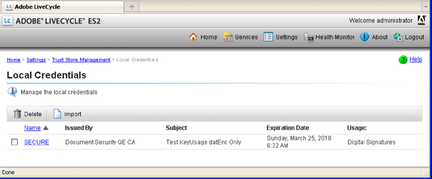

# Working with Credentials {#working-with-credentials} 

**Samples and examples in this document are only for AEM Forms on JEE environment.**

**About the Credential Service**

A credential contains your private key information needed for signing or identifying documents. A certificate is public key information that you configure for trust. AEM Forms uses certificates and credentials for several purposes:

* Acrobat Reader DC extensions uses a credential to enable Adobe Reader usage rights in PDF documents. (See [Applying Usage Rights to PDF Documents](/help/forms/developing/assigning-usage-rights.md#applying-usage-rights-to-pdf-documents).)
* The Signature service accesses certificates and credentials while performing operations such as digitally signing PDF documents. (See [Digitally Signing PDF Documents](/help/forms/developing/digitally-signing-certifying-documents.md#digitally-signing-pdf-documents).)

You can programmatically interact with the Credential service using the Trust Manager Java API. You can perform the following tasks:

* [Importing Credentials by using the Trust Manager API](credentials.md#importing-credentials-by-using-the-trust-manager-api)
* [Deleting Credentials by using the Trust Manager API](credentials.md#deleting-credentials-by-using-the-trust-manager-api)

>[!NOTE]
>
>You can also import and delete certificates by using administration console. (See [administration help.](https://www.adobe.com/go/learn_aemforms_admin_63))

## Importing Credentials by using the Trust Manager API {#importing-credentials-by-using-the-trust-manager-api}

You can programmatically import a credential into AEM Forms by using the Trust Manager API. For example, you can import a credential used to sign a PDF document. (See [Digitally Signing PDF Documents](/help/forms/developing/digitally-signing-certifying-documents.md#digitally-signing-pdf-documents)).

When importing a credential, you specify an alias for the credential. The alias is used to perform a Forms operation that requires a credential. Once imported, a credential can be viewed in administration console, as shown in the following illustration. Notice that the alias for the credential is *Secure*.

>[!NOTE]
>
>You cannot import a credential into AEM Forms using web services.

### Summary of steps {#summary-of-steps}

To import a credential into AEM Forms, perform the following steps:

1. Include project files.
1. Create a credential service client.
1. Reference the credential.
1. Perform the import operation.

**Include project files**

Include necessary files into your development project. If you are creating a client application using Java, then include the necessary JAR files. If you are using web services, then make sure that you include the proxy files.

The following JAR files must be added to your project’s classpath:

* adobe-livecycle-client.jar
* adobe-usermanager-client.jar
* adobe-truststore-client.jar
* adobe-utilities.jar (Required if AEM Forms is deployed on JBoss)
* jbossall-client.jar (Required if AEM Forms is deployed on JBoss)

For information about the location of these JAR files, see [Including AEM Forms Java library files](/help/forms/developing/invoking-aem-forms-using-java.md#including-aem-forms-java-library-files).

**Create a credential service client**

Before you can programmatically import a credential into AEM Forms, create a credential service client. For information, see [Setting connection properties](/help/forms/developing/invoking-aem-forms-using-java.md#setting-connection-properties).

**Reference the credential**

Reference a credential that you want to import into AEM Forms. The quick start associated with this section references a P12 file in the file system.

**Perform the import operation**

After you reference the credential, import the credential into AEM Forms. If the credential is not successfully imported, an exception is thrown. When importing a credential, you specify an alias for the credential.

**See also**

[Import credentials using the Java API](credentials.md#import-credentials-using-the-java-api)

[Including AEM Forms Java library files](/help/forms/developing/invoking-aem-forms-using-java.md#including-aem-forms-java-library-files)

[Setting connection properties](/help/forms/developing/invoking-aem-forms-using-java.md#setting-connection-properties)

[Credential Service API Quick Starts](/help/forms/developing/credential-service-java-api-quick.md#credential-service-java-api-quick-start-soap)

[Deleting Credentials by using the Trust Manager API](credentials.md#deleting-credentials-by-using-the-trust-manager-api)

### Import credentials using the Java API {#import-credentials-using-the-java-api}

Import a credential into AEM Forms by using the Trust Manager API (Java):

1. Include project files

   Include client JAR files, such as adobe-truststore-client.jar, in your Java project’s class path.

1. Create a credential service client

    * Create a `ServiceClientFactory` object that contains connection properties.
    * Create a `CredentialServiceClient` object by using its constructor and passing the `ServiceClientFactory` object.

1. Reference the credential

    * Create a `java.io.FileInputStream` object by using its constructor. Pass a string value that specifies the location of the credential.
    * Create a `com.adobe.idp.Document` object that stores the credential by using the `com.adobe.idp.Document` constructor. Pass the `java.io.FileInputStream` object that contains the credential to the constructor.

1. Perform the import operation

    * Create a string array that holds one element. Assign the value `truststore.usage.type.sign` to the element.
    * Invoke the `CredentialServiceClient` object’s `importCredential` method and pass the following values:

        * A string value that specifies the alias value for the credential.
        * The `com.adobe.idp.Document` instance that stores the credential.
        * A string value that specifies the password that is associated with the credential.
        * The string array that contains the usage value. For example, you can specify this value `truststore.usage.type.sign`. To import a Reader Extension credential, specify `truststore.usage.type.lcre`.

**See also**

[Importing Credentials by using the Trust Manager API](credentials.md#importing-credentials-by-using-the-trust-manager-api)

[Quick Start (SOAP mode): Importing credentials using the Java API](/help/forms/developing/credential-service-java-api-quick.md#quick-start-soap-mode-importing-credentials-using-the-java-api)

[Including AEM Forms Java library files](/help/forms/developing/invoking-aem-forms-using-java.md#including-aem-forms-java-library-files)

[Setting connection properties](/help/forms/developing/invoking-aem-forms-using-java.md#setting-connection-properties)

## Deleting Credentials by using the Trust Manager API {#deleting-credentials-by-using-the-trust-manager-api}

You can programmatically delete a credential by using the Trust Manager API. When deleting a credential, you specify an alias that corresponds to the credential. Once deleted, a credential cannot be used to perform an operation.

>[!NOTE]
>
>You cannot delete a credential into AEM Forms using web services.

### Summary of steps {#summary_of_steps-1}

To delete a credential, perform the following steps:

1. Include project files.
1. Create a credential service client.
1. Perform the delete operation.

**Include project files**

Include necessary files into your development project. If you are creating a client application using Java, then include the necessary JAR files. The following JAR files must be added to your project’s classpath:

* adobe-livecycle-client.jar
* adobe-usermanager-client.jar
* adobe-truststore-client.jar
* adobe-utilities.jar (Required if AEM Forms is deployed on JBoss)
* jbossall-client.jar (Required if AEM Forms is deployed on JBoss)

For information about the location of these JAR files, see [Including AEM Forms Java library files](/help/forms/developing/invoking-aem-forms-using-java.md#including-aem-forms-java-library-files).

**Create a credential service client**

Before you can programmatically delete a credential, create a Data Integration service client. When creating a service client, you define connection settings that are required to invoke a service. For information, see [Setting connection properties](/help/forms/developing/invoking-aem-forms-using-java.md#setting-connection-properties).

**Perform the delete operation**

To delete a credential, specify the alias that corresponds to the credential. If you specify an alias that does not exist, an exception is thrown.

**See also**

[Import credentials using the Java API](credentials.md#import-credentials-using-the-java-api)

[Including AEM Forms Java library files](/help/forms/developing/invoking-aem-forms-using-java.md#including-aem-forms-java-library-files)

[Setting connection properties](/help/forms/developing/invoking-aem-forms-using-java.md#setting-connection-properties)

[Import credentials using the Java API](credentials.md#import-credentials-using-the-java-api)

### Deleting credentials using the Java API {#deleting-credentials-using-the-java-api}

Delete a credential from AEM Forms by using the Trust Manager API (Java):

1. Include project files

   Include client JAR files, such as adobe-truststore-client.jar, in your Java project’s class path.

1. Create a credential service client

    * Create a `ServiceClientFactory` object that contains connection properties.
    * Create a `CredentialServiceClient` object by using its constructor and passing the `ServiceClientFactory` object.

1. Perform the delete operation

   Invoke the `CredentialServiceClient` object’s `deleteCredential` method and pass a string value that specifies the alias value.

**See also**

[Deleting Credentials by using the Trust Manager API](credentials.md#deleting-credentials-by-using-the-trust-manager-api)

[Quick Start (SOAP mode): Deleting credentials using the Java API](/help/forms/developing/credential-service-java-api-quick.md#quick-start-soap-mode-deleting-credentials-using-the-java-api)

[Including AEM Forms Java library files](/help/forms/developing/invoking-aem-forms-using-java.md#including-aem-forms-java-library-files)

[Setting connection properties](/help/forms/developing/invoking-aem-forms-using-java.md#setting-connection-properties)
