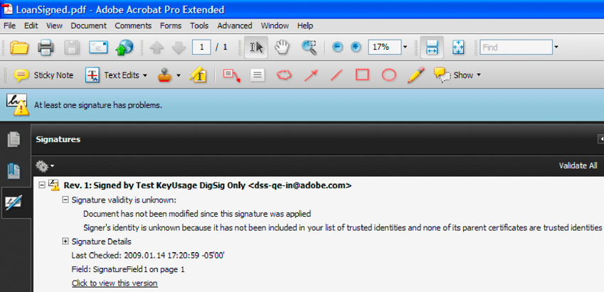

# Digitally Signing and Certifying Documents {#digitally-signing-and-certifying-documents} 

**Samples and examples in this document are only for AEM Forms on JEE environment.**

**About the Signature Service**

The Signature service lets your organization protect the security and privacy of Adobe PDF documents that it distributes and receives. This service uses digital signatures and certification to ensure that only intended recipients can alter documents. Because security features are applied to the document itself, the document remains secure and controlled for its entire life cycle. A document remains secure beyond the firewall, when it is downloaded offline, and when it is submitted back to your organization.

>[!NOTE]
>
>You can create a custom signature handler for the Signature service that is invoked when certain operations are invoked, such as signing a PDF document.

**Signature field names**

Some Signature service operations require that you specify the name of the signature field on which an operation is performed. For example, when signing a PDF document, you specify the name of the signature field to sign. Assume that the full name of a signature field is `form1[0].Form1[0].SignatureField1[0]`. You can specify `SignatureField1[0]` instead of `form1[0].Form1[0].SignatureField1[0]`.

Sometimes a conflict causes the Signature service to sign (or perform another operation that requires the signature field name) the wrong field. This conflict is the result of the name `SignatureField1[0]` appearing in two or more places in the same PDF document. For example, consider a PDF document that contains two signature fields named `form1[0].Form1[0].SignatureField1[0]` and `form1[0].Form1[0].SubForm1[0].SignatureField1[0]` and you specify `SignatureField1[0]`. In this situation, the Signature service signs the first signature field that it finds while iterating over all the signature fields in the document.

If there are multiple signature fields located within a PDF document, it is recommended that you specify the full names of the signature fields. That is, specify `form1[0].Form1[0].SignatureField1[0]`instead of `SignatureField1[0]`.

You can accomplish these tasks using the Signature service:

* Add and delete digital signature fields to a PDF document. (See [Adding Signature Fields](digitally-signing-certifying-documents.md#adding-signature-fields).)
* Retrieve the names of signature fields in a PDF document. (See [Retrieving Signature Field Names](digitally-signing-certifying-documents.md#retrieving-signature-field-names).)
* Modify signature fields. (See [Modifying Signature Fields](digitally-signing-certifying-documents.md#modifying-signature-fields).)
* Digitally sign PDF documents. (See [Digitally Signing PDF Documents](digitally-signing-certifying-documents.md#digitally-signing-pdf-documents).)
* Certify PDF documents. (See [Certifying PDF Documents](digitally-signing-certifying-documents.md#certifying-pdf-documents).)
* Validate digital signatures in a PDF document. (See [Verifying Digital Signatures](digitally-signing-certifying-documents.md#verifying-digital-signatures).)
* Validate all digital signatures in a PDF document. (See [Verifying Multiple Digital Signatures](digitally-signing-certifying-documents.md#verifying-digital-signatures).)
* Remove a digital signature from a signature field. (See [Removing Digital Signatures](digitally-signing-certifying-documents.md#removing-digital-signatures).)

>[!NOTE]
>
>For more information about the Signature service, see [Services Reference for AEM Forms](https://www.adobe.com/go/learn_aemforms_services_63)..

## Adding Signature Fields {#adding-signature-fields}

Digital signatures appear in signature fields, which are form fields that contain a graphic representation of the signature. Signature fields can be visible or invisible. Signers can use a pre-existing signature field, or a signature field can be programmatically added. In either case, the signature field must exist before a PDF document can be signed.

You can programmatically add a signature field by using the Signature service Java API or Signature web service API. You can add more than one signature field to a PDF document; however, each signature field name must be unique.

>[!NOTE]
>
>Some PDF document types do not let you programmatically add a signature field. For more information about the Signature service and adding signature fields, see [Services Reference for AEM Forms](https://www.adobe.com/go/learn_aemforms_services_63).

### Summary of steps {#summary-of-steps}

To add a signature field to a PDF document, perform the following tasks:

1. Include project files.
1. Create a Signature client.
1. Get a PDF document to which a signature field is added.
1. Add a signature field.
1. Save the PDF document as a PDF file.

**Include project files**

Include necessary files into your development project. If you are creating a client application using Java, include the necessary JAR files. If you are using web services, ensure that you include the proxy files.

The following JAR files must be added to your project's classpath:

* adobe-livecycle-client.jar
* adobe-usermanager-client.jar
* adobe-signatures-client.jar
* adobe-utilities.jar (required if AEM Forms is deployed on JBoss)
* jbossall-client.jar (required if AEM Forms is deployed on JBoss)

**Create a Signature client**

Before you can programmatically perform a Signature service operation, you must create a Signature service client.

**Get a PDF document to which a signature field is added**

Obtain a PDF document to which a signature field is added.

**Add a signature field**

To successfully add a signature field to a PDF document, you specify coordinate values that identify the location of the signature field. (If you add an invisible signature field, these values are not required.) Also, you can specify which fields in the PDF document are locked after a signature is applied to the signature field.

**Save the PDF document as a PDF file**

After the Signature service adds a signature field to the PDF document, you can save the document as a PDF file so that users can open it in Acrobat or Adobe Reader.

**See also**

[Including AEM Forms Java library files](/help/forms/developing/invoking-aem-forms-using-java.md#including-aem-forms-java-library-files)

[Setting connection properties](/help/forms/developing/invoking-aem-forms-using-java.md#setting-connection-properties)

[Digitally Signing PDF Documents](digitally-signing-certifying-documents.md#digitally-signing-pdf-documents)

### Add signature fields using the Java API {#add-signature-fields-using-the-java-api}

Add a signature field by using the Signature API (Java):

1. Include project files

   Include client JAR files, such as adobe-signatures-client.jar, in your Java project's classpath.

1. Create a Signature client

    * Create a `ServiceClientFactory` object that contains connection properties.
    * Create a `SignatureServiceClient` object by using its constructor and passing the `ServiceClientFactory` object.

1. Get a PDF document to which a signature field is added

    * Create a `java.io.FileInputStream` object that represents the PDF document to which a signature field is added by using its constructor and passing a string value that specifies the location of the PDF document.
    * Create a `com.adobe.idp.Document` object by using its constructor and passing the `java.io.FileInputStream` object.

1. Add a signature field

    * Create a `PositionRectangle` object that specifies the signature field location by using its constructor. Within the constructor, specify coordinate values.
    * If desired, create a `FieldMDPOptions` object that specifies the fields that are locked when a digital signature is applied to the signature field.
    * Add a signature field to a PDF document by invoking the `SignatureServiceClient` object's `addSignatureField` method and passing the following values:

        * A `com.adobe.idp`. `Document` object that represents the PDF document to which a signature field is added.
        * A string value that specifies the name of the signature field.
        * A `java.lang.Integer` value that represents the page number to which a signature field is added.
        * A `PositionRectangle` object that specifies the location of the signature field.
        * A `FieldMDPOptions` object that specifies fields in the PDF document that are locked after a digital signature is applied to the signature field. This parameter value is optional, and you can pass `null`.

    * A `PDFSeedValueOptions` object that specifies various run-time values. This parameter value is optional, and you can pass `null`.

      The `addSignatureField` method returns a `com.adobe.idp`. `Document` object that represents a PDF document that contains a signature field.

   >[!NOTE]
   >
   >You can invoke the `SignatureServiceClient` object's `addInvisibleSignatureField` method to add an invisible signature field.

1. Save the PDF document as a PDF file

    * Create a `java.io.File` object and ensure that the file extension is .pdf.
    * Invoke the `com.adobe.idp`. `Document` object's `copyToFile` method to copy the contents of the `Document` object to the file. Ensure that you use the `com.adobe.idp`. `Document` object that was returned by the `addSignatureField` method.

**See also**

[Signature Service API Quick Starts](/help/forms/developing/signature-service-java-api-quick.md#signature-service-java-api-quick-start-soap)

### Add signature fields using the web service API {#add-signature-fields-using-the-web-service-api}

To add a signature field by using the Signature API (web service):

1. Include project files

   Create a Microsoft .NET project that uses MTOM. Ensure that you use the following WSDL definition: `http://localhost:8080/soap/services/SignatureService?WSDL&lc_version=9.0.1`.

   >[!NOTE]
   >
   >Replace `localhost` with the IP address of the server hosting AEM Forms.

1. Create a Signature client

    * Create a `SignatureServiceClient` object by using its default constructor.
    * Create a `SignatureServiceClient.Endpoint.Address` object by using the `System.ServiceModel.EndpointAddress` constructor. Pass a string value that specifies the WSDL to the AEM Forms service (for example, `http://localhost:8080/soap/services/SignatureService?WSDL`). You do not need to use the `lc_version` attribute. This attribute is used when you create a service reference.)
    * Create a `System.ServiceModel.BasicHttpBinding` object by getting the value of the `SignatureServiceClient.Endpoint.Binding` field. Cast the return value to `BasicHttpBinding`.
    * Set the `System.ServiceModel.BasicHttpBinding` object's `MessageEncoding` field to `WSMessageEncoding.Mtom`. This value ensures that MTOM is used.
    * Enable basic HTTP authentication by performing the following tasks:

        * Assign the AEM forms user name to the field `SignatureServiceClient.ClientCredentials.UserName.UserName`.
        * Assign the corresponding password value to the field `SignatureServiceClient.ClientCredentials.UserName.Password`.
        * Assign the constant value `HttpClientCredentialType.Basic` to the field `BasicHttpBindingSecurity.Transport.ClientCredentialType`.
        * Assign the constant value `BasicHttpSecurityMode.TransportCredentialOnly` to the field `BasicHttpBindingSecurity.Security.Mode`.

1. Get a PDF document to which a signature field is added

    * Create a `BLOB` object by using its constructor. The `BLOB` object is used to store the PDF document that will contain a signature field.
    * Create a `System.IO.FileStream` object by invoking its constructor and passing a string value that represents the file location of the PDF document and the mode in which to open the file.
    * Create a byte array that stores the content of the `System.IO.FileStream` object. You can determine the size of the byte array by getting the `System.IO.FileStream` object's `Length` property.
    * Populate the byte array with stream data by invoking the `System.IO.FileStream` object's `Read` method and passing the byte array, the starting position, and the stream length to read.
    * Populate the `BLOB` object by assigning its `MTOM` property with the contents of the byte array.

1. Add a signature field

   Add a signature field to the PDF document by invoking the `SignatureServiceClient` object's `addSignatureField` method and passing the following values:

    * A `BLOB` object that represents the PDF document to which a signature field is added.
    * A string value that specifies the signature field name.
    * An integer value that represents the page number to which a signature field is added.
    * A `PositionRect` object that specifies the location of the signature field.
    * A `FieldMDPOptions` object that specifies fields in the PDF document that are locked after a digital signature is applied to the signature field. This parameter value is optional, and you can pass `null`.
    * A `PDFSeedValueOptions` object that specifies various run-time values. This parameter value is optional, and you can pass `null`.

   The `addSignatureField` method returns a `BLOB` object that represents a PDF document that contains a signature field.

1. Save the PDF document as a PDF file

    * Create a `System.IO.FileStream` object by invoking its constructor and passing a string value that represents the file location of the PDF document that will contain the signature field and the mode in which to open the file.
    * Create a byte array that stores the content of the `BLOB` object that was returned by the `addSignatureField` method. Populate the byte array by getting the value of the `BLOB` object's `binaryData` data member.
    * Create a `System.IO.BinaryWriter` object by invoking its constructor and passing the `System.IO.FileStream` object.
    * Write the contents of the byte array to a PDF file by invoking the `System.IO.BinaryWriter` object's `Write` method and passing the byte array.

**See also**

[Invoking AEM Forms using MTOM](/help/forms/developing/invoking-aem-forms-using-web.md#invoking-aem-forms-using-mtom)

[Invoking AEM Forms using SwaRef](/help/forms/developing/invoking-aem-forms-using-web.md#invoking-aem-forms-using-swaref)

## Retrieving Signature Field Names {#retrieving-signature-field-names}

You can retrieve the names of all signature fields that are in a PDF document that you want to sign or certify. If you are unsure of the signature field names that are in a PDF document or you want to verify the names, you can programmatically retrieve them. The Signature service returns the fully qualified name of the signature field, such as `form1[0].grantApplication[0].page1[0].SignatureField1[0]`.

>[!NOTE]
>
>For more information about the Signature service, see [Services Reference for AEM Forms](https://www.adobe.com/go/learn_aemforms_services_63)

### Summary of steps {#summary_of_steps-1}

To retrieve signature field names, perform the following tasks:

1. Include project files.
1. Create a Signature client.
1. Get the PDF document that contains signature fields.
1. Retrieve the signature field names.

**Include project files**

Include necessary files into your development project. If you are creating a client application using Java, include the necessary JAR files. If you are using web services, ensure that you include the proxy files.

The following JAR files must be added to your project's classpath:

* adobe-livecycle-client.jar
* adobe-usermanager-client.jar
* adobe-signatures-client.jar
* adobe-utilities.jar (required if AEM Forms is deployed on JBoss)
* jbossall-client.jar (required if AEM Forms is deployed on JBoss)

For information about the location of these JAR files, see [Including AEM Forms Java library files](/help/forms/developing/invoking-aem-forms-using-java.md#including-aem-forms-java-library-files).

**Create a Signature client**

Before you can programmatically perform a Signature service operation, you must create a Signature service client.

**Get the PDF document that contains signature fields**

Retrieve a PDF document that contains signature fields.

**Retrieve the signature field names**

You can retrieve signature field names after you retrieve a PDF document that contains one or more signature fields.

**See also**

[Retrieve signature field names using the Java API](digitally-signing-certifying-documents.md#retrieve-signature-field-names-using-the-java-api)

[Retrieve signature field using the web service API](digitally-signing-certifying-documents.md#retrieve-signature-field-using-the-web-service-api)

[Including AEM Forms Java library files](/help/forms/developing/invoking-aem-forms-using-java.md#including-aem-forms-java-library-files)

[Setting connection properties](/help/forms/developing/invoking-aem-forms-using-java.md#setting-connection-properties)

[Adding Signature Fields](digitally-signing-certifying-documents.md#adding-signature-fields)

### Retrieve signature field names using the Java API {#retrieve-signature-field-names-using-the-java-api}

Retrieve signature field names by using the Signature API (Java):

1. Include project files

   Include client JAR files, such as the adobe-signatures-client.jar, in your Java project's classpath.

1. Create a Signature client

    * Create a `ServiceClientFactory` object that contains connection properties.
    * Create a `SignatureServiceClient` object by using its constructor and passing the `ServiceClientFactory` object.

1. Get the PDF document that contains signature fields

    * Create a `java.io.FileInputStream` object that represents the PDF document that contains signature fields by using its constructor and passing a string value that specifies the location of the PDF document.
    * Create a `com.adobe.idp.Document` object by using its constructor and passing the `java.io.FileInputStream` object.

1. Retrieve the signature field names

    * Retrieve the signature field names by invoking the `SignatureServiceClient` object's `getSignatureFieldList` method and passing the `com.adobe.idp.Document` object that contains the PDF document that contains signature fields. This method returns a `java.util.List` object, in which each element contains a `PDFSignatureField` object. Using this object, you can obtain additional information about a signature field, such as whether it is visible.
    * Iterate through the `java.util.List` object to determine if there are signature field names. For each signature field in the PDF document, you can obtain a separate `PDFSignatureField` object. To obtain the name of the signature field, invoke the `PDFSignatureField` object's `getName` method. This method returns a string value that specifies the signature field name.

**See also**

[Retrieving Signature Field Names](digitally-signing-certifying-documents.md#retrieving-signature-field-names)

[Quick Start (SOAP mode): Retrieving signature field names using the Java API](/help/forms/developing/signature-service-java-api-quick.md#quick-start-soap-mode-retrieving-signature-field-names-using-the-java-api)

[Including AEM Forms Java library files](/help/forms/developing/invoking-aem-forms-using-java.md#including-aem-forms-java-library-files)

[Setting connection properties](/help/forms/developing/invoking-aem-forms-using-java.md#setting-connection-properties)

### Retrieve signature field using the web service API {#retrieve-signature-field-using-the-web-service-api}

Retrieve signature field names using the Signature API (web service):

1. Include project files

   Create a Microsoft .NET project that uses MTOM. Ensure that you use the following WSDL definition: `http://localhost:8080/soap/services/SignatureService?WSDL&lc_version=9.0.1`.

   >[!NOTE]
   >
   >Replace `localhost` with the IP address of the server hosting AEM Forms.

1. Create a Signature client

    * Create a `SignatureServiceClient` object by using its default constructor.
    * Create a `SignatureServiceClient.Endpoint.Address` object by using the `System.ServiceModel.EndpointAddress` constructor. Pass a string value that specifies the WSDL to the AEM Forms service (for example, `http://localhost:8080/soap/services/SignatureService?WSDL`). You do not need to use the `lc_version` attribute. This attribute is used when you create a service reference.)
    * Create a `System.ServiceModel.BasicHttpBinding` object by getting the value of the `SignatureServiceClient.Endpoint.Binding` field. Cast the return value to `BasicHttpBinding`.
    * Set the `System.ServiceModel.BasicHttpBinding` object's `MessageEncoding` field to `WSMessageEncoding.Mtom`. This value ensures that MTOM is used.
    * Enable basic HTTP authentication by performing the following tasks:

        * Assign the AEM forms user name to the field `SignatureServiceClient.ClientCredentials.UserName.UserName`.
        * Assign the corresponding password value to the field `SignatureServiceClient.ClientCredentials.UserName.Password`.
        * Assign the constant value `HttpClientCredentialType.Basic` to the field `BasicHttpBindingSecurity.Transport.ClientCredentialType`.
        * Assign the constant value `BasicHttpSecurityMode.TransportCredentialOnly` to the field `BasicHttpBindingSecurity.Security.Mode`.

1. Get the PDF document that contains signature fields

    * Create a `BLOB` object by using its constructor. The `BLOB` object is used to store the PDF document that contains signature fields.
    * Create a `System.IO.FileStream` object by invoking its constructor and passing a string value that represents the file location of the PDF document and the mode in which to open the file.
    * Create a byte array that stores the content of the `System.IO.FileStream` object. You can determine the size of the byte array by getting the `System.IO.FileStream` object's `Length` property.
    * Populate the byte array with stream data by invoking the `System.IO.FileStream` object's `Read` method and passing the byte array, the starting position, and the stream length to read.
    * Populate the `BLOB` object by assigning its `MTOM` field the byte array contents.

1. Retrieve the signature field names

    * Retrieve the signature field names by invoking `SignatureServiceClient` object's `getSignatureFieldList` method and passing the `BLOB` object that contains the PDF document that contains signature fields. This method returns a `MyArrayOfPDFSignatureField` collection object where each element contains a `PDFSignatureField` object.
    * Iterate through the `MyArrayOfPDFSignatureField` object to determine whether there are signature field names. For each signature field in the PDF document, you can obtain a `PDFSignatureField` object. To obtain the name of the signature field, invoke the `PDFSignatureField` object's `getName` method. This method returns a string value that specifies the signature field name.

**See also**

[Retrieving Signature Field Names](digitally-signing-certifying-documents.md#retrieving-signature-field-names)

[Invoking AEM Forms using MTOM](/help/forms/developing/invoking-aem-forms-using-web.md#invoking-aem-forms-using-mtom)

[Invoking AEM Forms using SwaRef](/help/forms/developing/invoking-aem-forms-using-web.md#invoking-aem-forms-using-swaref)

## Modifying Signature Fields {#modifying-signature-fields}

You can modify signature fields that are in a PDF document by using the Java API and web service API. Modifying a signature field involves manipulating its signature field lock dictionary values or seed value dictionary values.

A *field lock dictionary* specifies a list of fields that are locked when the signature field is signed. A locked field prevents users from making changes to the field. A *seed value dictionary* contains constraining information that is used at the time the signature is applied. For example, you can change permissions that control the actions that can occur without invalidating a signature.

By modifying an existing signature field, you can change the PDF document to reflect changing business requirements. For example, a new business requirement may require locking all document fields after the document is signed.

This section explains how to modify a signature field by amending both field lock dictionary and seed value dictionary values. Changes made to the signature field lock dictionary result in all fields in the PDF document being locked when a signature field is signed. Changes made to the seed value dictionary prohibit specific types of changes to the document.

>[!NOTE]
>
>For more information about the Signature service and modifying signature fields, see [Services Reference for AEM Forms](https://www.adobe.com/go/learn_aemforms_services_63).

### Summary of steps {#summary_of_steps-2}

To modify signature fields in a PDF document, perform the following tasks:

1. Include project files.
1. Create a Signature client.
1. Get the PDF document that contains the signature field to modify.
1. Set dictionary values.
1. Modify the signature field.
1. Save the PDF document as a PDF file.

**Include project files**

Include necessary files in your development project. If you are creating a client application by using Java, include the necessary JAR files. If you are using web services, ensure that you include the proxy files.

The following JAR files must be added to your project's classpath:

* adobe-livecycle-client.jar
* adobe-usermanager-client.jar
* adobe-signatures-client.jar
* adobe-utilities.jar (required if AEM Forms is deployed on JBoss)
* jbossall-client.jar (required if AEM Forms is deployed on JBoss)

For information about the location of these JAR files, see [Including LiveCycle Java library files](/help/forms/developing/invoking-aem-forms-using-java.md#including-aem-forms-java-library-files).

**Create a Signature client**

Before you can programmatically perform a Signature service operation, you must create a Signature service client.

**Get the PDF document that contains the signature field to modify**

Retrieve a PDF document that contains the signature field to modify.

**Set dictionary values**

To modify a signature field, assign values to its field lock dictionary or seed value dictionary. Specifying signature field lock dictionary values involves specifying PDF document fields that are locked when the signature field is signed. (This section discusses how to lock all fields.)

The following seed value dictionary values can be set:

* **Revision checking**: Specifies whether revocation checking is performed when a signature is applied to the signature field.
* **Certificate options**: Assigns values to the certificate seed value dictionary. Before specifying certificate options, it is recommended that you become familiar with a certificate seed value dictionary. (See [PDF Reference](https://www.adobe.com/devnet/acrobat/pdfs/pdf_reference_1-7.pdf).)
* **Digest options**: Assigns digest algorithms that are used for signing. Valid values are SHA1, SHA256, SHA384, SHA512, and RIPEMD160.
* **Filter**: Specifies the filter that is used with the signature field. For example, you can use the Adobe.PPKLite filter. (See [PDF Reference](https://www.adobe.com/devnet/acrobat/pdfs/pdf_reference_1-7.pdf).)
* **Flag options**: Specifies the flag values that are associated with this signature field. A value of 1 means that a signer must use only the specified values for the entry. A value of 0 means that other values are permitted. Here are the Bit positions:

    * **1(Filter):** The signature handler to be used to sign the signature field
    * **2 (SubFilter):** An array of names that indicate acceptable encodings to use when signing
    * **3 (V)**: The minimum required version number of the signature handler to be used to sign the signature field
    * **4 (Reasons):** An array of strings that specify possible reasons for signing a document
    * **5 (PDFLegalWarnings):** An array of strings that specify possible legal attestations

* **Legal attestations**: When a document is certified, it is automatically scanned for specific types of content that can make the visible contents of a document ambiguous or misleading. For example, an annotation can obscure text that is important for understanding what is being certified. The scanning process generates warnings that indicate the presence of this type of content. It also provides an additional explanation of the content that may have generated warnings.
* **Permissions**: Specifies permissions that can be used on a PDF document without invalidating the signature.
* **Reasons**: Specifies reasons why this document must be signed.
* **Time stamp**: Specifies time-stamping options. You can, for example, set the URL of the time-stamping server that is used.
* **Version**: Specifies the minimum version number of the signature handler to be used to sign the signature field.

**Modify the signature field**

After you create a Signature service client, retrieve the PDF document that contains the signature field to modify, and set dictionary values, you can instruct the Signature service to modify the signature field. The Signature service then returns a PDF document that contains the modified signature field. The original PDF document is not affected.

**Save the PDF document as a PDF file**

Save the PDF document that contains the modified signature field as a PDF file so that users can open it in Acrobat or Adobe Reader.

**See also**

[Including AEM Forms Java library files](/help/forms/developing/invoking-aem-forms-using-java.md#including-aem-forms-java-library-files)

[Setting connection properties](/help/forms/developing/invoking-aem-forms-using-java.md#setting-connection-properties)

[Signature Service API Quick Starts](/help/forms/developing/signature-service-java-api-quick.md#signature-service-java-api-quick-start-soap)

[Digitally Signing PDF Documents](digitally-signing-certifying-documents.md#digitally-signing-pdf-documents)

### Modify signature fields using the Java API {#modify-signature-fields-using-the-java-api}

Modify a signature field by using the Signature API (Java):

1. Include project files

   Include client JAR files, such as the adobe-signatures-client.jar, in your Java project's class path.

1. Create a Signature client

    * Create a `ServiceClientFactory` object that contains connection properties.
    * Create a `SignatureServiceClient` object by using its constructor and passing the `ServiceClientFactory` object.

1. Get the PDF document that contains the signature field to modify

    * Create a `java.io.FileInputStream` object that represents the PDF document that contains the signature field to modify by using its constructor and passing a string value that specifies the location of the PDF document.
    * Create a `com.adobe.idp.Document` object by using its constructor and passing the `java.io.FileInputStream` object.

1. Set dictionary values

    * Create a `PDFSignatureFieldProperties` object by using its constructor. A `PDFSignatureFieldProperties` object stores signature field lock dictionary and seed value dictionary information.
    * Create a `PDFSeedValueOptionSpec` object by using its constructor. This object lets you set seed value dictionary values.
    * Disallow changes to the PDF document by invoking the `PDFSeedValueOptionSpec` object's `setMdpValue` method and passing the `MDPPermissions.NoChanges` enumeration value.
    * Create a `FieldMDPOptionSpec` object by using its constructor. This object lets you set signature field lock dictionary values.
    * Lock all fields in the PDF document by invoking the `FieldMDPOptionSpec` object's `setMdpValue` method and passing the `FieldMDPAction.ALL` enumeration value.
    * Set seed value dictionary information by invoking the `PDFSignatureFieldProperties` object's `setSeedValue` method and passing the `PDFSeedValueOptionSpec` object.
    * Set signature field lock dictionary information by invoking the `PDFSignatureFieldProperties`object's `setFieldMDP` method and passing the `FieldMDPOptionSpec` object.

   >[!NOTE]
   >
   >To see all seed value dictionary values that you can set, see the `PDFSeedValueOptionSpec` class reference. (See [AEM Forms API Reference](https://www.adobe.com/go/learn_aemforms_javadocs_63_en).)

1. Modify the signature field

   Modify the signature field by invoking the `SignatureServiceClient` object's `modifySignatureField` method and passing the following values:

    * The `com.adobe.idp.Document` object that stores the PDF document that contains the signature field to modify
    * A string value that specifies the name of the signature field
    * The `PDFSignatureFieldProperties` object that stores signature field lock dictionary and seed value dictionary information

   The `modifySignatureField` method returns a `com.adobe.idp.Document` object that stores a PDF document that contains the modified signature field.

1. Save the PDF document as a PDF file

    * Create a `java.io.File` object and ensure that the file name extension is .pdf.
    * Invoke the `com.adobe.idp.Document` object's `copyToFile` method to copy the contents of the `com.adobe.idp.Document` object to the file. Ensure that you use the `com.adobe.idp.Document` object that the `modifySignatureField` method returned.

### Modify signature fields using the web service API {#modify-signature-fields-using-the-web-service-api}

Modify a signature field by using the Signature API (web service):

1. Include project files

   Create a Microsoft .NET project that uses MTOM. Ensure that you use the following WSDL definition: `http://localhost:8080/soap/services/SignatureService?WSDL&lc_version=9.0.1`.

   >[!NOTE]
   >
   >Replace `localhost` with the IP address of the server hosting AEM Forms.

1. Create a Signature client

    * Create a `SignatureServiceClient` object by using its default constructor.
    * Create a `SignatureServiceClient.Endpoint.Address` object by using the `System.ServiceModel.EndpointAddress` constructor. Pass a string value that specifies the WSDL to the AEM Forms service (for example, `http://localhost:8080/soap/services/SignatureService?WSDL`). You do not need to use the `lc_version` attribute. This attribute is used when you create a service reference.)
    * Create a `System.ServiceModel.BasicHttpBinding` object by getting the value of the `SignatureServiceClient.Endpoint.Binding` field. Cast the return value to `BasicHttpBinding`.
    * Set the `System.ServiceModel.BasicHttpBinding` object's `MessageEncoding` field to `WSMessageEncoding.Mtom`. This value ensures that MTOM is used.
    * Enable basic HTTP authentication by performing the following tasks:

        * Assign the AEM forms user name to the field `SignatureServiceClient.ClientCredentials.UserName.UserName`.
        * Assign the corresponding password value to the field `SignatureServiceClient.ClientCredentials.UserName.Password`.
        * Assign the constant value `HttpClientCredentialType.Basic` to the field `BasicHttpBindingSecurity.Transport.ClientCredentialType`.
        * Assign the constant value `BasicHttpSecurityMode.TransportCredentialOnly` to the field `BasicHttpBindingSecurity.Security.Mode`.

1. Get the PDF document that contains the signature field to modify

    * Create a `BLOB` object by using its constructor. The `BLOB` object is used to store the PDF document that contains the signature field to modify.
    * Create a `System.IO.FileStream` object by invoking its constructor and passing a string value that represents the file location of the PDF document and the mode in which to open the file.
    * Create a byte array that stores the content of the `System.IO.FileStream` object. You can determine the size of the byte array by getting the `System.IO.FileStream` object's `Length` property.
    * Populate the byte array with stream data by invoking the `System.IO.FileStream` object's `Read` method and passing the byte array, the starting position, and the stream length to read.
    * Populate the `BLOB` object by assigning its `MTOM` property the contents of the byte array.

1. Set dictionary values

    * Create a `PDFSignatureFieldProperties` object by using its constructor. This object stores signature field lock dictionary and seed value dictionary information.
    * Create a `PDFSeedValueOptionSpec` object by using its constructor. This object lets you set seed value dictionary values.
    * Disallow changes to the PDF document by assigning the `MDPPermissions.NoChanges` enumeration value to the `PDFSeedValueOptionSpec` object's `mdpValue` data member.
    * Create a `FieldMDPOptionSpec` object by using its constructor. This object lets you set signature field lock dictionary values.
    * Lock all fields in the PDF document by assigning the `FieldMDPAction.ALL` enumeration value to the `FieldMDPOptionSpec` object's `mdpValue` data member.
    * Set seed value dictionary information by assigning the `PDFSeedValueOptionSpec` object to the `PDFSignatureFieldProperties` object's `seedValue` data member.
    * Set signature field lock dictionary information by assigning the `FieldMDPOptionSpec` object to the `PDFSignatureFieldProperties` object's `fieldMDP` data member.

   >[!NOTE]
   >
   >To see all seed value dictionary values that you can set, see the `PDFSeedValueOptionSpec` class reference. (See [AEM Forms API Reference](https://www.adobe.com/go/learn_aemforms_javadocs_63_en)).

1. Modify the signature field

   Modify the signature field by invoking the `SignatureServiceClient` object's `modifySignatureField` method and passing the following values:

    * The `BLOB` object that stores the PDF document that contains the signature field to modify
    * A string value that specifies the name of the signature field
    * The `PDFSignatureFieldProperties` object that stores signature field lock dictionary and seed value dictionary information

   The `modifySignatureField` method returns a `BLOB` object that stores a PDF document that contains the modified signature field.

1. Save the PDF document as a PDF file

    * Create a `System.IO.FileStream` object by invoking its constructor and passing a string value that represents the file location of the PDF document that will contain the signature field, and the mode in which to open the file.
    * Create a byte array that stores the content of the `BLOB` object that the `addSignatureField` method returns. Populate the byte array by getting the value of the `BLOB` object's `MTOM` data member.
    * Create a `System.IO.BinaryWriter` object by invoking its constructor and passing the `System.IO.FileStream` object.
    * Write the contents of the byte array to a PDF file by invoking the `System.IO.BinaryWriter` object's `Write` method and passing the byte array.

**See also**

[Invoking AEM Forms using MTOM](/help/forms/developing/invoking-aem-forms-using-web.md#invoking-aem-forms-using-mtom)

[Invoking AEM Forms using SwaRef](/help/forms/developing/invoking-aem-forms-using-web.md#invoking-aem-forms-using-swaref)

## Digitally Signing PDF Documents {#digitally-signing-pdf-documents}

Digital signatures can be applied to PDF documents to provide a level of security. Digital signatures, like handwritten signatures, provide a means by which signers identify themselves and make statements about a document. The technology used to digitally sign documents helps to ensure that both the signer and recipients are clear about what was signed and confident that the document was not altered since it was signed.

PDF documents are signed by means of public-key technology. A signer has two keys: a public key and a private key. The private key is stored in a user's credential that must be available at the time of signing. The public key is stored in the user's certificate that must be available to recipients to validate the signature. Information about revoked certificates is found in certificate revocation lists (CRLs) and Online Certificate Status Protocol (OCSP) responses distributed by Certificate Authorities (CAs). The time of signing can be obtained from a trusted source known as a Timestamping Authority.

>[!NOTE]
>
>Before you can digitally sign a PDF document, you must ensure that you add the certificate to AEM Forms. A certificate is added using administration console or programmatically using the Trust Manager API. (See [Importing Credentials by using the Trust Manager API](/help/forms/developing/credentials.md#importing-credentials-by-using-the-trust-manager-api).)

You can programmatically digitally sign PDF documents. When digitally signing a PDF document, you must reference a security credential that exists in AEM Forms. The credential is the private key used for signing.

The Signature service performs the following steps when a PDF document is signed:

1. The Signature service retrieves the credential from the Truststore by passing the alias specified in the request.
1. The Truststore searches for the specified credential.
1. The credential is returned to the Signature service and is used to sign the document. The credential is also cached against the alias for future requests.

For information about handling the security credential, see the *Installing and Deploying AEM Forms* guide for your application server.

>[!NOTE]
>
>There are differences between signing and certifying documents. (See [Certifying PDF Documents](digitally-signing-certifying-documents.md#certifying-pdf-documents).)

>[!NOTE]
>
>Not all PDF documents support signing. For more information about the Signature service and digitally signing documents, see [Services Reference for AEM Forms](https://www.adobe.com/go/learn_aemforms_services_63).

>[!NOTE]
>
>The Signature service does not support XDP files with embedded PDF data as input to an operation, such as certifying a document. This action results in the Signature service throwing a `PDFOperationException`. To resolve this issue, convert the XDP file to a PDF file by using the PDF Utilities service and then pass the converted PDF file to a Signature service operation. (See [Working with PDF Utilities](/help/forms/developing/pdf-utilities.md#working-with-pdf-utilities).)

**nCipher nShield HSM credential**

When using an nCipher nShield HSM credential to sign or certify a PDF document, the new credential cannot be used until the J2EE application server that AEM Forms is deployed on is restarted. However, you can set a configuration value, resulting in the sign or certify operation working without restarting the J2EE application server.

You can add the following configuration value in the cknfastrc file, which is located at /opt/nfast/cknfastrc (or c:\nfast\cknfastrc):

```shell
    CKNFAST_ASSUME_SINGLE_PROCESS=0
```

After you add this configuration value to the cknfastrc file, the new credential can be used without restarting the J2EE application server.

>[!NOTE]
>
> It is recommended to use the 'Ctrl + C' command to restart the SDK. Restarting the AEM SDK using alternative methods, for example, stopping Java processes, may lead to inconsistencies in the AEM development environment.

**Signature is not trusted**

When certifying and signing the same PDF document, if the certifying signature is not trusted, a yellow triangle appears against the first signature when opening the PDF document in Acrobat or Adobe Reader. The certifying signature must be trusted to avoid this situation.

**Signing documents that are XFA based forms**

If you attempt to sign a XFA based form using the Signature service API, the data may be missing from the `View` `Signed` `Version` in Acrobat. For example, consider the following workflow:

* Using an XDP file created by using Designer, you merge a form design that contains a signature field and XML data that contains form data. You use the Forms service to generate an interactive PDF document.
* You sign the PDF document using the Signature service API.

### Summary of steps {#summary_of_steps-3}

To digitally sign a PDF document, perform the following tasks:

1. Include project files.
1. Create a Signature service client.
1. Get the PDF document to sign.
1. Sign the PDF document.
1. Save the signed PDF document as a PDF file.

**Include project files**

Include necessary files into your development project. If you are creating a client application using Java, include the necessary JAR files. If you are using web services, ensure that you include the proxy files.

The following JAR files must be added to your project's classpath:

* adobe-livecycle-client.jar
* adobe-usermanager-client.jar
* adobe-signatures-client.jar
* adobe-utilities.jar (required if AEM Forms is deployed on JBoss)
* jbossall-client.jar (required if AEM Forms is deployed on JBoss)

**Create a Signatures client**

Before you can programmatically perform a Signature service operation, you must create a Signature service client.

**Get the PDF document to sign**

To sign a PDF document, you must obtain a PDF document that contains a signature field. If a PDF document does not contain a signature field, it cannot be signed. A signature field can be added by using Designer or programmatically.

**Sign the PDF document**

When signing a PDF document, you can set run-time options that are used by the Signature service. You can set the following options:

* Appearance options
* Revocation checking
* Time stamping values

You set appearance options by using a `PDFSignatureAppearanceOptionSpec` object. For example, you can display the date within a signature by invoking the `PDFSignatureAppearanceOptionSpec` object's `setShowDate` method and passing `true`.

You can also specify whether or not to perform a revocation check that determines whether the certificate that is used to digitally sign a PDF document has been revoked. To performing revocation checking, you can specify one of the following values:

* **NoCheck**: Do not perform revocation checking.
* **BestEffort**: Always attempt to check for revocation of all certificates in the chain. If any problem occurs in checking, the revocation is assumed to be valid. If any failure happens, assume that the certificate is not revoked.
* **CheckIfAvailable:** Check for revocation of all certificates in the chain if revocation information is available. If any problem occurs in checking, the revocation is assumed to be invalid. If any failure happens, assume the certificate is revoked and invalid. (This is the default value.)
* **AlwaysCheck**: Check for revocation of all certificates in the chain. If revocation information is not present in any certificate, revocation is assumed to be invalid.

To perform revocation checking on a certificate, you can specify a URL to a certificate revocation list (CRL) server by using a `CRLOptionSpec` object. However, if you want to perform revocation checking and you do not specify a URL to a CRL server, then the Signature service obtains the URL from the certificate.

Instead of using a CRL server, you can use an online certificate status protocol (OCSP) server when performing revocation checking. Typically when using an OCSP server as opposed to a CRL server, the revocation check is performed faster. (See "Online Certificate Status Protocol" at [https://tools.ietf.org/html/rfc2560](https://tools.ietf.org/html/rfc2560).)

You can set the CRL and OCSP server order that the Signature service uses using Adobe Applications and Services. For example, if the OCSP server is set first in Adobe Applications and Services, then the OCSP server is checked, followed by the CRL server. (See "Managing certificates and credentials using Trust Store" in AAC Help).

If you specify not to perform revocation checking, then the Signature service does not check to see if the certificate used to sign or certify a document has been revoked. That is, CRL and OCSP server information is ignored.

>[!NOTE]
>
>Although a CRL or an OCSP server may be specified in the certificate, you can override the URL specified in the certificate by using a `CRLOptionSpec` and an `OCSPOptionSpec` object. For example, to override the CRL server, you can invoke the `CRLOptionSpec` object's `setLocalURI` method.

Time stamping refers to the process of tracking the time when a signed or certified document was modified. Once a document is signed, it should not be modified, even by the document owner. Time stamping helps enforce the validity of a signed or certified document. You can set time stamping options using a `TSPOptionSpec` object. For example, you can specify the URL of a time stamping provider (TSP) server.

>[!NOTE]
>
>In the Java and web service walk through sections and the corresponding quick starts, revocation checking is used. Because no CRL or OCSP server information is specified, the server information is obtained from the certificate used to digitally sign the PDF document.

To successfully sign a PDF document, you can specify the fully qualified name of the signature field that will contain the digital signature, such as `form1[0].#subform[1].SignatureField3[3]`. When using an XFA form field, the partial name of the signature field can also be used: `SignatureField3[3]`.

You must also reference a security credential to digitally sign a PDF document. To reference a security credential, you specify an alias. The alias is a reference to an actual credential that may be in a PKCS#12 file (with a .pfx extension), or a hardware security module (HSM). For information about the security credential, see the *Installing and Deploying AEM Forms* guide for your application server.

**Save the signed PDF document**

After the Signature service digitally signs the PDF document, you can save it as a PDF file so that users can open it in Acrobat or Adobe Reader.

**See also**

[Digitally sign PDF documents using the Java API](digitally-signing-certifying-documents.md#digitally-sign-pdf-documents-using-the-java-api)

[Digitally signing PDF documents using the web service API](digitally-signing-certifying-documents.md#digitally-signing-pdf-documents-using-the-web-service-api)

[Including AEM Forms Java library files](/help/forms/developing/invoking-aem-forms-using-java.md#including-aem-forms-java-library-files)

[Setting connection properties](/help/forms/developing/invoking-aem-forms-using-java.md#setting-connection-properties)

[Adding Signature Fields](digitally-signing-certifying-documents.md#adding-signature-fields)

[Retrieving Signature Field Names](digitally-signing-certifying-documents.md#retrieving-signature-field-names)

### Digitally sign PDF documents using the Java API {#digitally-sign-pdf-documents-using-the-java-api}

Digitally sign a PDF document by using the Signature API (Java):

1. Include project files

   Include client JAR files, such as adobe-signatures-client.jar, in your Java project's classpath.

1. Create a Signatures client

    * Create a `ServiceClientFactory` object that contains connection properties.
    * Create a `SignatureServiceClient` object by using its constructor and passing the `ServiceClientFactory` object.

1. Get the PDF document to sign

    * Create a `java.io.FileInputStream` object that represents the PDF document to digitally sign by using its constructor and passing a string value that specifies the location of the PDF document.
    * Create a `com.adobe.idp.Document` object by using its constructor and passing the `java.io.FileInputStream` object.

1. Sign the PDF document

   Sign the PDF document by invoking the `SignatureServiceClient` object's `sign` method and passing the following values:

    * A `com.adobe.idp.Document` object that represents the PDF document to sign.
    * A string value that represents the name of the signature field that will contain the digital signature.
    * A `Credential` object that represents the credential that is used to digitally sign the PDF document. Create a `Credential` object by invoking the `Credential` object's static `getInstance` method and passing a string value that specifies the alias value that corresponds to the security credential.
    * A `HashAlgorithm` object that specifies a static data member that represents the hash algorithm to use to digest the PDF document. For example, you can specify `HashAlgorithm.SHA1` to use the SHA1 algorithm.
    * A string value that represents the reason why the PDF document was digitally signed.
    * A string value that represents the signer's contact information.
    * A `PDFSignatureAppearanceOptions` object that controls the appearance of the digital signature. For example, you can use this object to add a custom logo to a digital signature.
    * A `java.lang.Boolean` object that specifies whether to perform revocation checking on the signer's certificate.
    * An `OCSPOptionSpec` object that stores preferences for Online Certificate Status Protocol (OCSP) support. If revocation checking is not done, this parameter is not used and you can specify `null`.
    * A `CRLPreferences` object that stores certificate revocation list (CRL) preferences. If revocation checking is not done, this parameter is not used and you can specify `null`.
    * A `TSPPreferences` object that stores preferences for time stamp provider (TSP) support. This parameter is optional and can be `null`. For more information, see [AEM Forms API Reference](https://www.adobe.com/go/learn_aemforms_javadocs_63_en).

   The `sign` method returns a `com.adobe.idp.Document` object that represents the signed PDF document.

1. Save the signed PDF document

    * Create a `java.io.File` object and ensure that the file extension is .pdf.
    * Invoke the `com.adobe.idp.Document` object's `copyToFile` method and pass `java.io.File`to copy the contents of the `Document` object to the file. Ensure that you use the `com.adobe.idp.Document` object that was returned by the `sign` method.

**See also**

[Digitally Signing PDF Documents](digitally-signing-certifying-documents.md#digitally-signing-pdf-documents)

[Quick Start (SOAP mode): Digitally signing a PDF document using the Java API](/help/forms/developing/signature-service-java-api-quick.md#quick-start-soap-mode-digitally-signing-a-pdf-document-using-the-java-api)

[Including AEM Forms Java library files](/help/forms/developing/invoking-aem-forms-using-java.md#including-aem-forms-java-library-files)

[Setting connection properties](/help/forms/developing/invoking-aem-forms-using-java.md#setting-connection-properties)

### Digitally signing PDF documents using the web service API {#digitally-signing-pdf-documents-using-the-web-service-api}

To digitally sign a PDF document by using the Signature API (web service):

1. Include project files

   Create a Microsoft .NET project that uses MTOM. Ensure that you use the following WSDL definition: `http://localhost:8080/soap/services/SignatureService?WSDL&lc_version=9.0.1`.

   >[!NOTE]
   >
   >Replace `localhost` with the IP address of the server hosting AEM Forms.

1. Create a Signatures client

    * Create a `SignatureServiceClient` object by using its default constructor.
    * Create a `SignatureServiceClient.Endpoint.Address` object by using the `System.ServiceModel.EndpointAddress` constructor. Pass a string value that specifies the WSDL to the AEM Forms service (for example, `http://localhost:8080/soap/services/SignatureService?WSDL`). You do not need to use the `lc_version` attribute. This attribute is used when you create a service reference.)
    * Create a `System.ServiceModel.BasicHttpBinding` object by getting the value of the `SignatureServiceClient.Endpoint.Binding` field. Cast the return value to `BasicHttpBinding`.
    * Set the `System.ServiceModel.BasicHttpBinding` object's `MessageEncoding` field to `WSMessageEncoding.Mtom`. This value ensures that MTOM is used.
    * Enable basic HTTP authentication by performing the following tasks:

        * Assign the AEM forms user name to the field `SignatureServiceClient.ClientCredentials.UserName.UserName`.
        * Assign the corresponding password value to the field `SignatureServiceClient.ClientCredentials.UserName.Password`.
        * Assign the constant value `HttpClientCredentialType.Basic` to the field `BasicHttpBindingSecurity.Transport.ClientCredentialType`.
        * Assign the constant value `BasicHttpSecurityMode.TransportCredentialOnly` to the field `BasicHttpBindingSecurity.Security.Mode`.

1. Get the PDF document to sign

    * Create a `BLOB` object by using its constructor. The `BLOB` object is used to store a PDF document that is signed.
    * Create a `System.IO.FileStream` object by invoking its constructor and passing a string value that represents the file location of the PDF document to sign, and the mode in which to open the file.
    * Create a byte array that stores the content of the `System.IO.FileStream` object. You can determine the size of the byte array by getting the `System.IO.FileStream` object's `Length` property.
    * Populate the byte array with stream data by invoking the `System.IO.FileStream` object's `Read` method and passing the byte array, the starting position, and the stream length to read.
    * Populate the `BLOB` object by assigning its `MTOM` property the contents of the byte array.

1. Sign the PDF document

   Sign the PDF document by invoking the `SignatureServiceClient` object's `sign` method and passing the following values:

    * A `BLOB` object that represents the PDF document to sign.
    * A string value that represents the name of the signature field that will contain the digital signature.
    * A `Credential` object that represents the credential that is used to digitally sign the PDF document. Create a `Credential` object by using its constructor and specify the alias by assigning a value to the `Credential` object's `alias` property.
    * A `HashAlgorithm` object that specifies a static data member that represents the hash algorithm to use to digest the PDF document. For example, you can specify `HashAlgorithm.SHA1` to use the SHA1 algorithm.
    * A Boolean value that specifies whether the hash algorithm is used.
    * A string value that represents the reason why the PDF document was digitally signed.
    * A string value that represents the signer's location.
    * A string value that represents the signer's contact information.
    * A `PDFSignatureAppearanceOptions` object that controls the appearance of the digital signature. For example, you can use this object to add a custom logo to a digital signature.
    * A `System.Boolean` object that specifies whether to perform revocation checking on the signer's certificate. If this revocation checking is done, it is embedded in the signature. The default is `false`.
    * An `OCSPOptionSpec` object that stores preferences for Online Certificate Status Protocol (OCSP) support. If revocation checking is not done, this parameter is not used and you can specify `null`. For information about this object, see [AEM Forms API Reference](https://www.adobe.com/go/learn_aemforms_javadocs_63_en).
    * A `CRLPreferences` object that stores certificate revocation list (CRL) preferences. If revocation checking is not done, this parameter is not used and you can specify `null`.
    * A `TSPPreferences` object that stores preferences for time stamp provider (TSP) support. This parameter is optional and can be `null`.

   The `sign` method returns a `BLOB` object that represents the signed PDF document.

1. Save the signed PDF document

    * Create a `System.IO.FileStream` object by invoking its constructor. Pass a string value that represents the file location of the signed PDF document and the mode in which to open the file.
    * Create a byte array that stores the content of the `BLOB` object that was returned by the `sign` method. Populate the byte array by getting the value of the `BLOB` object's `MTOM` data member.
    * Create a `System.IO.BinaryWriter` object by invoking its constructor and passing the `System.IO.FileStream` object.
    * Write the contents of the byte array to a PDF file by invoking the `System.IO.BinaryWriter` object's `Write` method and passing the byte array.

**See also**

[Digitally Signing PDF Documents](digitally-signing-certifying-documents.md#digitally-signing-pdf-documents)

[Invoking AEM Forms using MTOM](/help/forms/developing/invoking-aem-forms-using-web.md#invoking-aem-forms-using-mtom)

[Invoking AEM Forms using SwaRef](/help/forms/developing/invoking-aem-forms-using-web.md#invoking-aem-forms-using-swaref)

## Digitally Signing Interactive Forms {#digitally-signing-interactive-forms}

You can sign an interactive form that the Forms service creates. For example, consider the following workflow:

* You merge an XFA-based PDF form created by using Designer and form data in an XML document using the Forms service. The Forms server renders an interactive form.
* You sign the interactive form using the Signature service API.

The result is a digitally signed interactive PDF form. When signing a PDF form that is based on an XFA form, ensure that you save the PDF file as an Adobe Static PDF form. If you attempt to sign a PDF form that is saved as an Adobe Dynamic PDF form, an exception occurs. Because you are signing the form that is returned from the Forms service, ensure that the form contains a signature field.

>[!NOTE]
>
>Before you can digitally sign an interactive form, you must ensure that you add the certificate to AEM Forms. A certificate is added using administration console or programmatically using the Trust Manager API. (See [Importing Credentials by using the Trust Manager API](/help/forms/developing/credentials.md#importing-credentials-by-using-the-trust-manager-api).)

When using the Forms Service API, set the `GenerateServerAppearance` run-time option to `true`. This run-time option ensures that the appearance of the form that is generated on the server remains valid when opened in Acrobat or Adobe Reader. It is recommended that you set this run-time option when generating an interactive form to sign by using the Forms API.

>[!NOTE]
>
>Before reading Digitally Signing Interactive Forms, it is recommended that you are familiar with signing PDF documents. (See [Digitally Signing PDF Documents](digitally-signing-certifying-documents.md#digitally-signing-pdf-documents).)

### Summary of steps {#summary_of_steps-4}

To digitally sign an interactive form the Forms service returns, perform the following tasks:

1. Include project files.
1. Create a Forms and Signatures client.
1. Obtain the interactive form using the Forms service.
1. Sign the interactive form.
1. Save the signed PDF document as a PDF file.

**Include project files**

Include necessary files into your development project. If you are creating a client application using Java, include the necessary JAR files. If you are using web services, ensure that you include the proxy files.

The following JAR files must be added to your project's classpath:

* adobe-livecycle-client.jar
* adobe-usermanager-client.jar
* adobe-signatures-client.jar
* adobe-forms-client.jar
* adobe-utilities.jar (required if AEM Forms is deployed on JBoss)
* jbossall-client.jar (required if AEM Forms is deployed on JBoss)

For information about the location of these JAR files, see [Including AEM Forms Java library files](/help/forms/developing/invoking-aem-forms-using-java.md#including-aem-forms-java-library-files).

**Create a Forms and Signatures client**

Because this workflow invokes both the Forms and Signature services, create both a Forms service client and Signature service client.

**Obtain the interactive form using the Forms service**

You can use the Forms service to obtain the interactive PDF form to sign. As of AEM Forms, you can pass a `com.adobe.idp.Document` object to the Forms service that contains the form to render. The name of this method is `renderPDFForm2`. This method returns a `com.adobe.idp.Document` object that contains the form to sign. You can pass this `com.adobe.idp.Document` instance to the Signature service.

Likewise, if you are using web services, you can pass the `BLOB` instance that the Forms service returns to the Signature service.

>[!NOTE]
>
>The quick start associated with Digitally Signing Interactive Forms section invokes the `renderPDFForm2` method.

**Sign the interactive form**

When signing a PDF document, you can set run-time options that the Signature service uses. You can set the following options:

* Appearance options
* Revocation checking
* Time stamping values

You set appearance options by using a `PDFSignatureAppearanceOptionSpec` object. For example, you can display the date within a signature by invoking the `PDFSignatureAppearanceOptionSpec` object's `setShowDate` method and passing `true`.

**Save the signed PDF document**

After the Signature service digitally signs the PDF document, you can save it as a PDF file. The PDF file can be opened in Acrobat or Adobe Reader.

**See also**

[Digitally sign an interactive form using the Java API](digitally-signing-certifying-documents.md#digitally-sign-an-interactive-form-using-the-java-api)

[Digitally sign an interactive form using the web service API](digitally-signing-certifying-documents.md#digitally-sign-an-interactive-form-using-the-web-service-api)

[Including AEM Forms Java library files](/help/forms/developing/invoking-aem-forms-using-java.md#including-aem-forms-java-library-files)

[Setting connection properties](/help/forms/developing/invoking-aem-forms-using-java.md#setting-connection-properties)

[Digitally Signing PDF Documents](digitally-signing-certifying-documents.md#digitally-signing-pdf-documents)

[Rendering Interactive PDF Forms](/help/forms/developing/rendering-forms.md#rendering-interactive-pdf-forms)

### Digitally sign an interactive form using the Java API {#digitally-sign-an-interactive-form-using-the-java-api}

Digitally sign an interactive form by using the Forms and Signature API (Java):

1. Include project files

   Include client JAR files, such as adobe-signatures-client.jar and adobe-forms-client.jar, in your Java project's classpath.

1. Create a Forms and Signatures client

    * Create a `ServiceClientFactory` object that contains connection properties.
    * Create a `SignatureServiceClient` object by using its constructor and passing the `ServiceClientFactory` object.
    * Create a `FormsServiceClient` object by using its constructor and passing the `ServiceClientFactory` object.

1. Obtain the interactive form using the Forms service

    * Create a `java.io.FileInputStream` object that represents the PDF document to pass to the Forms service by using its constructor. Pass a string value that specifies the location of the PDF document.
    * Create a `com.adobe.idp.Document` object by using its constructor and passing the `java.io.FileInputStream` object.
    * Create a `java.io.FileInputStream` object that represents the XML document that contains form data to pass to the Forms service by using its constructor. Pass a string value that specifies the location of the XML file.
    * Create a `com.adobe.idp.Document` object by using its constructor and passing the `java.io.FileInputStream` object.
    * Create a `PDFFormRenderSpec` object that is used to set run-time options. Invoke the `PDFFormRenderSpec` object's `setGenerateServerAppearance` method and pass `true`.
    * Invoke the `FormsServiceClient` object's `renderPDFForm2` method and pass the following values:

        * A `com.adobe.idp.Document` object that contains the PDF form to render.
        * A `com.adobe.idp.Document` object that contains data to merge with the form.
        * A `PDFFormRenderSpec` object that stores run-time options.
        * A `URLSpec` object that contains URI values that are required by the Forms service. You can specify `null` for this parameter value.
        * A `java.util.HashMap` object that stores file attachments. This is an optional parameter and you can specify `null` if you do not want to attach files to the form.

      The `renderPDFForm2` method returns a `FormsResult` object that contains a form data stream

    * Retrieve the PDF form by invoking the `FormsResult` object's `getOutputContent` method. This method returns a `com.adobe.idp.Document` object that represents the interactive form.

1. Sign the interactive form

   Sign the PDF document by invoking the `SignatureServiceClient` object's `sign` method and passing the following values:

    * A `com.adobe.idp.Document` object that represents the PDF document to sign. Ensure that this object is the `com.adobe.idp.Document` object obtained from the Forms service.
    * A string value that represents the name of the signature field that is signed.
    * A `Credential` object that represents the credential that is used to digitally sign the PDF document. Create a `Credential` object by invoking the `Credential` object's static `getInstance` method. Pass a string value that specifies the alias value that corresponds to the security credential.
    * A `HashAlgorithm` object that specifies a static data member that represents the hash algorithm to use to digest the PDF document. For example, you can specify `HashAlgorithm.SHA1` to use the SHA1 algorithm.
    * A string value that represents the reason why the PDF document was digitally signed.
    * A string value that represents the signer's contact information.
    * A `PDFSignatureAppearanceOptions` object that controls the appearance of the digital signature. For example, you can use this object to add a custom logo to a digital signature.
    * A `java.lang.Boolean` object that specifies whether to perform revocation checking on the signer's certificate.
    * An `OCSPPreferences` object that stores preferences for Online Certificate Status Protocol (OCSP) support. If revocation checking is not done, this parameter is not used and you can specify `null`.
    * A `CRLPreferences` object that stores certificate revocation list (CRL) preferences. If revocation checking is not done, this parameter is not used and you can specify `null`.
    * A `TSPPreferences` object that stores preferences for time stamp provider (TSP) support. This parameter is optional and can be `null`.

   The `sign` method returns a `com.adobe.idp.Document` object that represents the signed PDF document.

1. Save the signed PDF document

    * Create a `java.io.File` object and ensure that the filename extension is .pdf.
    * Invoke the `com.adobe.idp.Document` object's `copyToFile` method and pass `java.io.File`to copy the contents of the `Document` object to the file. Ensure that you use the `com.adobe.idp.Document` object that the `sign` method returned.

**See also**

[Digitally Signing Interactive Forms](digitally-signing-certifying-documents.md#digitally-signing-interactive-forms)

[Quick Start (SOAP mode): Digitally signing a PDF document using the Java API](/help/forms/developing/signature-service-java-api-quick.md#quick-start-soap-mode-digitally-signing-a-pdf-document-using-the-java-api)

[Including AEM Forms Java library files](/help/forms/developing/invoking-aem-forms-using-java.md#including-aem-forms-java-library-files)

[Setting connection properties](/help/forms/developing/invoking-aem-forms-using-java.md#setting-connection-properties)

### Digitally sign an interactive form using the web service API {#digitally-sign-an-interactive-form-using-the-web-service-api}

Digitally sign an interactive form by using the Forms and Signature API (web service):

1. Include project files

   Create a Microsoft .NET project that uses MTOM. Because this client application invokes two AEM Forms services, create two service references. Use the following WSDL definition for the service reference associated with the Signature service: `http://localhost:8080/soap/services/SignatureService?WSDL&lc_version=9.0.1`.

   Use the following WSDL definition for the service reference associated with the Forms service: `http://localhost:8080/soap/services/FormsService?WSDL&lc_version=9.0.1`.

   Because the `BLOB` data type is common to both service references, fully qualify the `BLOB` data type when using it. In the corresponding web service quick start, all `BLOB` instances are fully qualified.

   >[!NOTE]
   >
   >Replace `localhost` with the IP address of the server hosting AEM Forms.

1. Create a Forms and Signatures client

    * Create a `SignatureServiceClient` object by using its default constructor.
    * Create a `SignatureServiceClient.Endpoint.Address` object by using the `System.ServiceModel.EndpointAddress` constructor. Pass a string value that specifies the WSDL to the AEM Forms service (for example, `http://localhost:8080/soap/services/SignatureService?WSDL`). You do not need to use the `lc_version` attribute. This attribute is used when you create a service reference.)
    * Create a `System.ServiceModel.BasicHttpBinding` object by getting the value of the `SignatureServiceClient.Endpoint.Binding` field. Cast the return value to `BasicHttpBinding`.
    * Set the `System.ServiceModel.BasicHttpBinding` object's `MessageEncoding` field to `WSMessageEncoding.Mtom`. This value ensures that MTOM is used.
    * Enable basic HTTP authentication by performing the following tasks:

        * Assign the AEM forms user name to the field `SignatureServiceClient.ClientCredentials.UserName.UserName`.
        * Assign the corresponding password value to the field `SignatureServiceClient.ClientCredentials.UserName.Password`.
        * Assign the constant value `HttpClientCredentialType.Basic` to the field `BasicHttpBindingSecurity.Transport.ClientCredentialType`.

    * Assign the constant value `BasicHttpSecurityMode.TransportCredentialOnly` to the field `BasicHttpBindingSecurity.Security.Mode`.

   >[!NOTE]
   >
   >Repeat these steps for the Forms service client.

1. Obtain the interactive form using the Forms service

    * Create a `BLOB` object by using its constructor. The `BLOB` object is used to store a PDF document that is signed.
    * Create a `System.IO.FileStream` object by invoking its constructor and passing a string value that represents the file location of the PDF document to sign, and the mode in which to open the file.
    * Create a byte array that stores the content of the `System.IO.FileStream` object. You can determine the size of the byte array by getting the `System.IO.FileStream` object's `Length` property.
    * Populate the byte array with stream data by invoking the `System.IO.FileStream` object's `Read` method and passing the byte array, the starting position, and the stream length to read.
    * Populate the `BLOB` object by assigning its `MTOM` property the contents of the byte array.
    * Create a `BLOB` object by using its constructor. The `BLOB` object is used to store form data.
    * Create a `System.IO.FileStream` object by invoking its constructor and passing a string value that represents the file location of the XML file that contains form data, and the mode in which to open the file.
    * Create a byte array that stores the content of the `System.IO.FileStream` object. You can determine the size of the byte array by getting the `System.IO.FileStream` object's `Length` property.
    * Populate the byte array with stream data by invoking the `System.IO.FileStream` object's `Read` method and passing the byte array, the starting position, and the stream length to read.
    * Populate the `BLOB` object by assigning its `MTOM` property the contents of the byte array.
    * Create a `PDFFormRenderSpec` object that is used to set run-time options. Assign the value `true` to the `PDFFormRenderSpec` object's `generateServerAppearance` field.
    * Invoke the `FormsServiceClient` object's `renderPDFForm2` method and pass the following values:

        * A `BLOB` object that contains the PDF form to render.
        * A `BLOB` object that contains data to merge with the form.
        * A `PDFFormRenderSpec` object that stores run-time options.
        * A `URLSpec` object that contains URI values that are required by the Forms service. You can specify `null` for this parameter value.
        * A `java.util.HashMap` object that stores file attachments. This is an optional parameter and you can specify `null` if you do not want to attach files to the form.
        * A long output parameter used to store the number of pages in the form.
        * A string output parameter that is used for the locale value.
        * A `FormResult` value that is an output parameter that is used to store the interactive form.

    * Retieve the PDF form by invoking the `FormsResult` object's `outputContent` field. This field stores a `BLOB` object that represents the interactive form.

1. Sign the interactive form

   Sign the PDF document by invoking the `SignatureServiceClient` object's `sign` method and passing the following values:

    * A `BLOB` object that represents the PDF document to sign. Use the `BLOB` instance returned by the Forms service.
    * A string value that represents the name of the signature field that is signed.
    * A `Credential` object that represents the credential that is used to digitally sign the PDF document. Create a `Credential` object by using its constructor and specify the alias by assigning a value to the `Credential` object's `alias` property.
    * A `HashAlgorithm` object that specifies a static data member that represents the hash algorithm to use to digest the PDF document. For example, you can specify `HashAlgorithm.SHA1` to use the SHA1 algorithm.
    * A Boolean value that specifies whether the hash algorithm is used.
    * A string value that represents the reason why the PDF document was digitally signed.
    * A string value that represents the signer's location.
    * A string value that represents the signer's contact information.
    * A `PDFSignatureAppearanceOptions` object that controls the appearance of the digital signature. For example, you can use this object to add a custom logo to a digital signature.
    * A `System.Boolean` object that specifies whether to perform revocation checking on the signer's certificate. If this revocation checking is done, it is embedded in the signature. The default is `false`.
    * An `OCSPPreferences` object that stores preferences for Online Certificate Status Protocol (OCSP) support. If revocation checking is not done, this parameter is not used and you can specify `null`. For information about this object, see [AEM Forms API Reference](https://www.adobe.com/go/learn_aemforms_javadocs_63_en).
    * A `CRLPreferences` object that stores certificate revocation list (CRL) preferences. If revocation checking is not done, this parameter is not used and you can specify `null`.
    * A `TSPPreferences` object that stores preferences for time stamp provider (TSP) support. This parameter is optional and can be `null`.

   The `sign` method returns a `BLOB` object that represents the signed PDF document.

1. Save the signed PDF document

    * Create a `System.IO.FileStream` object by invoking its constructor. Pass a string value that represents the file location of the signed PDF document and the mode in which to open the file.
    * Create a byte array that stores the content of the `BLOB` object that was returned by the `sign` method. Populate the byte array by getting the value of the `BLOB` object's `MTOM` data member.
    * Create a `System.IO.BinaryWriter` object by invoking its constructor and passing the `System.IO.FileStream` object.
    * Write the contents of the byte array to a PDF file by invoking the `System.IO.BinaryWriter` object's `Write` method and passing the byte array.

**See also**

[Digitally Signing Interactive Forms](digitally-signing-certifying-documents.md#digitally-signing-interactive-forms)

[Invoking AEM Forms using MTOM](/help/forms/developing/invoking-aem-forms-using-web.md#invoking-aem-forms-using-mtom)

## Certifying PDF Documents {#certifying-pdf-documents}

You can secure a PDF document by certifying it with a particular type of signature called a certified signature. A certified signature is distinguished from a digital signature in these ways:

* It must be the first signature applied to the PDF document; that is, at the time the certified signature is applied, any other signature fields in the document must be unsigned. Only one certified signature is permitted in a PDF document. If you want to sign and certify a PDF document, you must certify it before signing it. After you certify a PDF document, you can digitally sign additional signature fields.
* The author or originator of the document can specify that the document can be modified in certain ways without invalidating the certified signature. For example, the document may permit filling in forms or commenting. If the author specifies that a certain modification is not permitted, Acrobat restricts users from modifying the document in that way. If such modifications are made, such as by using another application, the certified signature is invalid and Acrobat issues a warning when a user opens the document. (With non-certified signatures, modifications are not prevented, and normal editing operations do not invalidate the original signature.)
* At the time of signing, the document is scanned for specific types of content that could make the contents of a document ambiguous or misleading. For example, an annotation could obscure some text on a page that is important for understanding what is being certified. An explanation (legal attestation) can be provided about such content.

You can programmatically certify PDF documents by using the Signature service Java API or the Signature web service API. When certifying a PDF document, you must reference a security credential that exists in the Credential service. For information about the security credential, see the *Installing and Deploying AEM Forms* guide for your application server.

>[!NOTE]
>
>When certifying and signing the same PDF document, if the certify signature is not trusted, a yellow triangle appears next to the first sign signature when you open the PDF document in Acrobat or Adobe Reader. The certifying signature must be trusted to avoid this situation.

>[!NOTE]
>
>When using an nCipher nShield HSM credential to sign or certify a PDF document, the new credential cannot be used until the J2EE application server on which AEM Forms is deployed is restarted. However, you can set a configuration value, resulting in the sign or certify operation working without restarting the J2EE application server.

You can add the following configuration value in the cknfastrc file, which is located at /opt/nfast/cknfastrc (or c:\nfast\cknfastrc):

```shell
    CKNFAST_ASSUME_SINGLE_PROCESS=0
```

After you add this configuration value to the cknfastrc file, the new credential can be used without restarting the J2EE application server.

>[!NOTE]
>
>For more information about the Signature service and certifying a document, see [Services Reference for AEM Forms](https://www.adobe.com/go/learn_aemforms_services_63).

### Summary of steps {#summary_of_steps-5}

To certify a PDF document, perform the following tasks:

1. Include project files.
1. Create a Signature client.
1. Get the PDF document to certify.
1. Certify the PDF document.
1. Save the certified PDF document as a PDF file.

**Include project files**

Include necessary files into your development project. If you are creating a client application using Java, include the necessary JAR files. If you are using web services, ensure that you include the proxy files.

The following JAR files must be added to your project's classpath:

* adobe-livecycle-client.jar
* adobe-usermanager-client.jar
* adobe-signatures-client.jar
* adobe-utilities.jar (required if AEM Forms is deployed on JBoss)
* jbossall-client.jar (required if AEM Forms is deployed on JBoss)

For information about the location of these JAR files, see [Including AEM Forms Java library files](/help/forms/developing/invoking-aem-forms-using-java.md#including-aem-forms-java-library-files).

**Create a Signature client**

Before you can programmatically perform a Signature operation, you must create a Signature client.

**Get the PDF document to certify**

To certify a PDF document, you must obtain a PDF document that contains a signature field. If a PDF document does not contain a signature field, it cannot be certified. A signature field can be added by using Designer or programmatically. For information about programmatically adding a signature field, see [Adding Signature Fields](digitally-signing-certifying-documents.md#adding-signature-fields).

**Certify the PDF document**

To successfully certify a PDF document, you require the following input values that are used by the Signature service to certify a PDF document:

* **PDF document**: A PDF document that contains a signature field, which is a form field that contains a graphic representation of the certified signature. A PDF document must contain a signature field before it can be certified. A signature field can be added by using Designer or programmatically. (See [Adding Signature Fields](digitally-signing-certifying-documents.md#adding-signature-fields).)
* **Signature field name**: The fully qualified name of the signature field that is certified. The following value is an example: `form1[0].#subform[1].SignatureField3[3]`. When using an XFA form field, the partial name of the signature field can also be used: `SignatureField3[3]`. If a null value is passed for the field name, an invisible signature field is dynamically created and certified.
* **Security credential**: A credential that is used to certify the PDF document. This security credential contains a password and an alias, which must match an alias that appears in the credential that is located within the Credential service. The alias is a reference to an actual credential that may be in a PKCS#12 file (with a .pfx extension) or a hardware security module (HSM).
* **Hash algorithm**: A hash algorithm to use to digest the PDF document.
* **Reason for signing**: A value that is displayed in Acrobat or Adobe Reader so that other users know the reason why the PDF document was certified.
* **Location of the signer**: The location of the signer specified by the credential.
* **Contact information**: Contact information, such as address and telephone number, of the signer.
* **Permission information**: Permissions that control the actions that an end user can perform on a document without causing the certified signature to be invalid. For example, you can set the permission so that any change to the PDF document causes the certified signature to be invalid.
* **Legal explanation**: When a document is certified, it is automatically scanned for specific types of content that could make the contents of a document ambiguous or misleading. For example, an annotation could obscure some text on a page that is important for understanding what is being certified. The scanning process generates warnings about these types of content. This value provides an additional explanation of the content that may have generated warnings.
* **Appearance options**: Options that control the appearance of the certified signature. For example, the certified signature can display date information.
* **Revocation checking**: This value specifies whether revocation checking is done for the signer's certificate. The default setting of `false` means that revocation checking is not done.
* **OCSP settings**: Settings for Online Certificate Status Protocol (OCSP) support, which provides information about the status of the credential that is used to certify the PDF document. You can, for example, specify the URL of the server that provides information about the credential that you are using to sign on to the PDF document.
* **CRL settings**: Settings for certificate revocation list (CRL) preferences if revocation checking is done. For example, you can specify to always check whether a credential was revoked.
* **Time stamping**: Settings that define time stamping information that is applied to the certified signature. A time stamp indicates that specific data was established before a certain time. This knowledge helps build a trusting relationship between the signer and verifier.

**Save the certified PDF document as a PDF file**

After the Signature service certifies the PDF document, you can save it as a PDF file so that users can open it in Acrobat or Adobe Reader.

**See also**

[Certify PDF documents using the Java API](digitally-signing-certifying-documents.md#certify-pdf-documents-using-the-java-api)

[Certify PDF documents using the web service API](digitally-signing-certifying-documents.md#certify-pdf-documents-using-the-web-service-api)

[Including AEM Forms Java library files](/help/forms/developing/invoking-aem-forms-using-java.md#including-aem-forms-java-library-files)

[Setting connection properties](/help/forms/developing/invoking-aem-forms-using-java.md#setting-connection-properties)

[Adding Signature Fields](digitally-signing-certifying-documents.md#adding-signature-fields)

### Certify PDF documents using the Java API {#certify-pdf-documents-using-the-java-api}

Certify a PDF document by using the Signature API (Java):

1. Include project files

   Include client JAR files, such as adobe-signatures-client.jar, in your Java project's class path.

1. Create a Signature client

    * Create a `ServiceClientFactory` object that contains connection properties.
    * Create a `SignatureServiceClient` object by using its constructor and passing the `ServiceClientFactory` object.

1. Get the PDF document to certify

    * Create a `java.io.FileInputStream` object that represents the PDF document to certify by using its constructor and passing a string value that specifies the location of the PDF document.
    * Create a `com.adobe.idp.Document` object by using its constructor and passing the `java.io.FileInputStream` object.

1. Certify the PDF document

   Certify the PDF document by invoking the `SignatureServiceClient` object's `certify` method and passing the following values:

    * The `com.adobe.idp.Document` object that represents the PDF document to certify.
    * A string value that represents the name of the signature field that will contain the signature.
    * A `Credential` object that represents the credential that is used to certify the PDF document. Create a `Credential` object by invoking the `Credential` object's static `getInstance` method and passing a string value that specifies the alias value that corresponds to the security credential.
    * A `HashAlgorithm` object that specifies a static data member that represents the hash algorithm used to digest the PDF document. For example, you can specify `HashAlgorithm.SHA1` to use the SHA1 algorithm.
    * A string value that represents the reason why the PDF document was certified.
    * A string value that represents the signer's contact information.
    * A `MDPPermissions` object that specifies actions that can be performed on the PDF document that invalidates the signature.
    * A `PDFSignatureAppearanceOptions` object that controls the appearance of the certified signature. If desired, modify the appearance of the signature by invoking a method, such as `setShowDate`.
    * A string value that provides an explanation of what actions invalidate the signature.
    * A `java.lang.Boolean` object that specifies whether to perform revocation checking on the signer's certificate. If this revocation checking is done, it is embedded in the signature. The default is `false`.
    * A `java.lang.Boolean` object that specifies whether the signature field being certified is locked. If the field is locked, the signature field is marked as read only, its properties cannot be modified, and it cannot be cleared by anyone who does not have the required permissions. The default is `false`.
    * An `OCSPPreferences` object that stores preferences for Online Certificate Status Protocol (OCSP) support. If revocation checking is not done, this parameter is not used and you can specify `null`. For information about this object, See [AEM Forms API Reference](https://www.adobe.com/go/learn_aemforms_javadocs_63_en).
    * A `CRLPreferences` object that stores certificate revocation list (CRL) preferences. If revocation checking is not done, this parameter is not used and you can specify `null`.
    * A `TSPPreferences` object that stores preferences for time stamp provider (TSP) support. For example, after you create a `TSPPreferences` object, you can set the URL of the TSP server by invoking the `TSPPreferences` object's `setTspServerURL` method. This parameter is optional and can be `null`. For more information, see [Services Reference for AEM Forms](https://www.adobe.com/go/learn_aemforms_services_63).

   The `certify` method returns a `com.adobe.idp.Document` object that represents the certified PDF document.

1. Save the certified PDF document as a PDF file

    * Create a `java.io.File` object and ensure that the file extension is .pdf.
    * Invoke the `com.adobe.idp.Document` object's `copyToFile` method to copy the contents of the `com.adobe.idp.Document` object to the file.

**See also**

[Certifying PDF Documents](digitally-signing-certifying-documents.md#certifying-pdf-documents)

[Quick Start (SOAP mode): Certifying a PDF document using the Java API](/help/forms/developing/signature-service-java-api-quick.md#quick-start-soap-mode-certifying-a-pdf-document-using-the-java-api)

[Including AEM Forms Java library files](/help/forms/developing/invoking-aem-forms-using-java.md#including-aem-forms-java-library-files)

[Setting connection properties](/help/forms/developing/invoking-aem-forms-using-java.md#setting-connection-properties)

### Certify PDF documents using the web service API {#certify-pdf-documents-using-the-web-service-api}

Certify a PDF document by using the Signature API (web service):

1. Include project files

   Create a Microsoft .NET project that uses MTOM. Ensure that you use the following WSDL definition: `http://localhost:8080/soap/services/SignatureService?WSDL&lc_version=9.0.1`.

   >[!NOTE]
   >
   >Replace `localhost` with the IP address of the server hosting AEM Forms.

1. Create a Signature client

    * Create a `SignatureServiceClient` object by using its default constructor.
    * Create a `SignatureServiceClient.Endpoint.Address` object by using the `System.ServiceModel.EndpointAddress` constructor. Pass a string value that specifies the WSDL to the AEM Forms service (for example, `http://localhost:8080/soap/services/SignatureService?WSDL`). You do not need to use the `lc_version` attribute. This attribute is used when you create a service reference.)
    * Create a `System.ServiceModel.BasicHttpBinding` object by getting the value of the `SignatureServiceClient.Endpoint.Binding` field. Cast the return value to `BasicHttpBinding`.
    * Set the `System.ServiceModel.BasicHttpBinding` object's `MessageEncoding` field to `WSMessageEncoding.Mtom`. This value ensures that MTOM is used.
    * Enable basic HTTP authentication by performing the following tasks:

        * Assign the AEM forms user name to the field `SignatureServiceClient.ClientCredentials.UserName.UserName`.
        * Assign the corresponding password value to the field `SignatureServiceClient.ClientCredentials.UserName.Password`.
        * Assign the constant value `HttpClientCredentialType.Basic` to the field `BasicHttpBindingSecurity.Transport.ClientCredentialType`.
        * Assign the constant value `BasicHttpSecurityMode.TransportCredentialOnly` to the field `BasicHttpBindingSecurity.Security.Mode`.

1. Get the PDF document to certify

    * Create a `BLOB` object by using its constructor. The `BLOB` object is used to store a PDF document that is certified.
    * Create a `System.IO.FileStream` object by invoking its constructor and passing a string value that represents the file location of the PDF document to certify and the mode in which to open the file.
    * Create a byte array that stores the content of the `System.IO.FileStream` object. You can determine the size of the byte array by getting the `System.IO.FileStream` object's `Length` property.
    * Populate the byte array with stream data by invoking the `System.IO.FileStream` object's `Read` method and passing the byte array, the starting position, and the stream length to read.
    * Populate the `BLOB` object by assigning its `MTOM` data member the contents of the byte array.

1. Certify the PDF document

   Certify the PDF document by invoking the `SignatureServiceClient` object's `certify` method and passing the following values:

    * The `BLOB` object that represents the PDF document to certify.
    * A string value that represents the name of the signature field that will contain the signature.
    * A `Credential` object that represents the credential that is used to certify the PDF document. Create a `Credential` object by using its constructor, and specify the alias by assigning a value to the `Credential` object's `alias` property.
    * A `HashAlgorithm` object that specifies a static data member that represents the hash algorithm used to digest the PDF document. For example, you can specify `HashAlgorithm.SHA1` to use the SHA1 algorithm.
    * A Boolean value that specifies whether the hash algorithm is used.
    * A string value that represents the reason why the PDF document was certified.
    * A string value that represents the signer's location.
    * A string value that represents the signer's contact information.
    * An `MDPPermissions` object's static data member that specifies actions that can be performed on the PDF document that invalidate the signature.
    * A Boolean value that specifies whether to use the `MDPPermissions` object that was passed as the previous parameter value.
    * A string value that explains what actions invalidate the signature.
    * A `PDFSignatureAppearanceOptions` object that controls the appearance of the certified signature. Create a `PDFSignatureAppearanceOptions` object by using its constructor. You can modify the appearance of the signature by setting one of its data members.
    * A `System.Boolean` object that specifies whether to perform revocation checking on the signer's certificate. If this revocation checking is done, it is embedded in the signature. The default is `false`.
    * A `System.Boolean` object that specifies whether the signature field being certified is locked. If the field is locked, the signature field is marked as read only, its properties cannot be modified, and it cannot be cleared by anyone who does not have the required permissions. The default is `false`.
    * A `System.Boolean` object that specifies whether the signature field is locked. That is, if you pass `true` to the previous parameter, then pass `true` to this parameter.
    * An `OCSPPreferences` object that stores preferences for Online Certificate Status Protocol (OCSP) support, which provides information about the status of the credential that is used to certify the PDF document. If revocation checking is not done, this parameter is not used and you can specify `null`.
    * A `CRLPreferences` object that stores certificate revocation list (CRL) preferences. If revocation checking is not done, this parameter is not used and you can specify `null`.
    * A `TSPPreferences` object that stores preferences for time stamp provider (TSP) support. For example, after you create a `TSPPreferences` object, you can set the URL of the TSP by setting the `TSPPreferences` object's `tspServerURL` data member. This parameter is optional and can be `null`.

   The `certify` method returns a `BLOB` object that represents the certified PDF document.

1. Save the certified PDF document as a PDF file

    * Create a `System.IO.FileStream` object by invoking its constructor and passing a string value that represents the file location of the PDF document that will contain the certified PDF document and the mode in which to open the file.
    * Create a byte array that stores the content of the `BLOB` object that was returned by the `certify` method. Populate the byte array by getting the value of the `BLOB` object's `binaryData` data member.
    * Create a `System.IO.BinaryWriter` object by invoking its constructor and passing the `System.IO.FileStream` object.
    * Write the contents of the byte array to a PDF file by invoking the `System.IO.BinaryWriter` object's `Write` method and passing the byte array.

**See also**

[Certifying PDF Documents](digitally-signing-certifying-documents.md#certifying-pdf-documents)

[Invoking AEM Forms using MTOM](/help/forms/developing/invoking-aem-forms-using-web.md#invoking-aem-forms-using-mtom)

[Invoking AEM Forms using SwaRef](/help/forms/developing/invoking-aem-forms-using-web.md#invoking-aem-forms-using-swaref)

## Verifying Digital Signatures {#verifying-digital-signatures}

Digital signatures can be verified to ensure that a signed PDF document was not modified and that the digital signature is valid. When verifying a digital signature, you can check the signature's status and the signature's properties, such as the signer's identity. Before trusting a digital signature, it is recommended that you verify it. When verifying a digital signature, reference a PDF document that contains a digital signature.

Assume that the identity of the signer is unknown. When you open the PDF document in Acrobat, a warning message states that the signer's identity is unknown, as shown in the following illustration.



Likewise, when you programmatically verify a digital signature, you can determine the status of the signer's identity. For example, if you verify the digital signature in the document shown in the previous illustration, the result would be that the signer's identity is unknown.

>[!NOTE]
>
>For more information about the Signature service and verifying digital signatures, see [Services Reference for AEM Forms](https://www.adobe.com/go/learn_aemforms_services_63).

### Summary of steps {#summary_of_steps-6}

To verify a digital signature, perform the following tasks:

1. Include project files.
1. Create a Signature client.
1. Get the PDF document that contains the signature to verify.
1. Set PKI run-time options.
1. Verify the digital signature.
1. Determine the status of the signature.
1. Determine the identity of the signer.

**Include project files**

Include the necessary files in your development project. If you are creating a client application using Java, include the necessary JAR files. If you are using web services, include the proxy files.

The following JAR files must be added to your project's classpath:

* adobe-livecycle-client.jar
* adobe-usermanager-client.jar
* adobe-signatures-client.jar
* adobe-utilities.jar (required if AEM Forms is deployed on JBoss)
* jbossall-client.jar (required if AEM Forms is deployed on JBoss)

For information about the location of these JAR files, see [Including AEM Forms Java library files](/help/forms/developing/invoking-aem-forms-using-java.md#including-aem-forms-java-library-files).

**Create a Signature client**

Before you programmatically perform a Signature service operation, create a Signature service client.

**Get the PDF document that contains the signature to verify**

To verify a signature used to digitally sign or certify a PDF document, obtain a PDF document that contains a signature.

**Set PKI run-time options**

Set these PKI run-time options that the Signature service uses when verifying signatures in a PDF document:

* Verification time
* Revocation checking
* Time-stamping values

As part of setting these options, you can specify verification time. For example, you can select current time (the time on the validator's computer), which indicates to use the current time. For information about the different time values, see the `VerificationTime` enumeration value in [AEM Forms API Reference](https://www.adobe.com/go/learn_aemforms_javadocs_63_en).

You can also specify whether to perform revocation checking as part of the verification process. For example, you can perform a revocation check to determine whether the certificate is revoked. For information about the revocation-checking options, see the `RevocationCheckStyle` enumeration value in [AEM Forms API Reference](https://www.adobe.com/go/learn_aemforms_javadocs_63_en).

To perform revocation checking on a certificate, specify a URL to a certificate revocation list (CRL) server by using a `CRLOptionSpec` object. However, if you do not specify a URL to CRL server, the Signature service obtains the URL from the certificate.

Instead of using a CRL server, you can use an online certificate status protocol (OCSP) server when performing revocation checking. Typically, when using an OCSP server as opposed to a CRL server, the revocation check is performed faster. (See [Online Certificate Status Protocol](https://tools.ietf.org/html/rfc2560).)

You can set the CRL and OCSP server order that the Signature service uses by using Adobe Applications and Services. For example, if the OCSP server is set first in Adobe Applications and Services, then the OCSP server is checked, followed by the CRL server.

If you do not perform revocation checking, the Signature service does not check whether the certificate is revoked. That is, CRL and OCSP server information is ignored.

>[!NOTE]
>
>You can override the URL specified in the certificate by using a `CRLOptionSpec` and an `OCSPOptionSpec` object. For example, to override the CRL server, you can invoke the `CRLOptionSpec` object's `setLocalURI` method.

Time stamping is the process of tracking the time when a signed or certified document was modified. After a document is signed, no one can modify it. Time stamping helps enforce the validity of a signed or certified document. You can set time stamping options using a `TSPOptionSpec` object. For example, you can specify the URL of a time stamping provider (TSP) server.

>[!NOTE]
>
>In the Java and web service quick starts, the verification time is set to `VerificationTime.CURRENT_TIME` and revocation checking is set to `RevocationCheckStyle.BestEffort`. Because no CRL or OCSP server information is specified, the server information is obtained from the certificate.

**Verify the digital signature**

To successfully verify a signature, specify the fully qualified name of the signature field that contains the signature, such as `form1[0].#subform[1].SignatureField3[3]`. When using an XFA form field, you can also use the partial name of the signature field : `SignatureField3`.

By default, the Signature service limits the amount of time that a document can be signed after validation time to 65 min. If a user attempts to verify a signature at current time and the sign time is later than the current time and is within 65 min, the Signature service does not create a verification error.

>[!NOTE]
>
>For other values that you require when verifying a signature, see [AEM Forms API Reference](https://www.adobe.com/go/learn_aemforms_javadocs_63_en).

**Determine the status of the signature**

As part of verifying a digital signature, you can check the status of the signature.

**Determine the identity of the signer**

You can determine the identity of the signer, which can be one of the following values:

* **Unknown**: This signer is unknown because the signer verification cannot be performed.
* **Trusted**: This signer is trusted.
* **Not trusted**: This signer is not trusted.

**See also**

[Verify digital signatures using the Java API](#verify-digital-signatures-using-the-java-api)

[Verify digital signatures using the web service API](#verify-digital-signatures-using-the-web-service-api)

[Including AEM Forms Java library files](/help/forms/developing/invoking-aem-forms-using-java.md#including-aem-forms-java-library-files)

[Setting connection properties](/help/forms/developing/invoking-aem-forms-using-java.md#setting-connection-properties)

### Verify digital signatures using the Java API {#verify-digital-signatures-using-the-java-api}

Verify a digital signature by using the Signature Service API (Java):

1. Include project files

   Include client JAR files, such as adobe-signatures-client.jar, in your Java project's classpath.

1. Create a Signature client

    * Create a `ServiceClientFactory` object that contains connection properties.
    * Create a `SignatureServiceClient` object by using its constructor and passing the `ServiceClientFactory` object.

1. Get the PDF document that contains the signature to verify

    * Create a `java.io.FileInputStream` object that represents the PDF document that contains the signature to verify by using its constructor. Pass a string value that specifies the location of the PDF document.
    * Create a `com.adobe.idp.Document` object by using its constructor and passing the `java.io.FileInputStream` object.

1. Set PKI run-time options

    * Create a `PKIOptions` object by using its constructor.
    * Set the verification time by invoking the `PKIOptions` object's `setVerificationTime` method and passing a `VerificationTime` enumeration value that specifies the verification time.
    * Set the revocation-checking option by invoking `PKIOptions` object's `setRevocationCheckStyle` method and passing a `RevocationCheckStyle` enumeration value that specifies whether to perform revocation checking.

1. Verify the digital signature

   Verify the signature by invoking the `SignatureServiceClient` object's `verify2` method and passing the following values:

    * A `com.adobe.idp.Document` object that contains a digitally signed or certified PDF document.
    * A string value that represents the signature field name that contains the signature to verify.
    * A `PKIOptions` object that contains PKI run-time options.
    * A `VerifySPIOptions` instance that contains SPI information. You can specify `null` for this parameter.

   The `verify2` method returns a `PDFSignatureVerificationInfo` object that contains information that can be used to verify the digital signature.

1. Determine the status of the signature

    * Determine the signature's status by invoking the `PDFSignatureVerificationInfo` object's `getStatus` method. This method returns a `SignatureStatus` object that specifies the signature status. For example, if a signed PDF document is not modified, this method returns `SignatureStatus.DocumentSigNoChanges`.

1. Determine the identity of the signer

    * Determine the signer's identity by invoking the `PDFSignatureVerificationInfo` object's `getSigner` method. This method returns an `IdentityInformation` object.
    * Invoke the `IdentityInformation` object's `getStatus` method to determine the signer's identity. This method returns an `IdentityStatus` enumeration value that specifies the identity. For example, if the signer is trusted, this method returns `IdentityStatus.TRUSTED`.

**See also**

[Verifying Digital Signatures](#verify-digital-signatures-using-the-java-api)

[Quick Start (SOAP mode): Verifying a digital signature using the Java API](/help/forms/developing/signature-service-java-api-quick.md#quick-start-soap-mode-verifying-a-digital-signature-using-the-java-api)

[Including AEM Forms Java library files](/help/forms/developing/invoking-aem-forms-using-java.md#including-aem-forms-java-library-files)

[Setting connection properties](/help/forms/developing/invoking-aem-forms-using-java.md#setting-connection-properties)

### Verify digital signatures using the web service API {#verify-digital-signatures-using-the-web-service-api}

Verify a digital signature by using the Signature Service API (web service):

1. Include project files

   Create a Microsoft .NET project that uses MTOM. Ensure that you use the following WSDL definition: `http://localhost:8080/soap/services/SignatureService?WSDL&lc_version=9.0.1`.

   >[!NOTE]
   >
   >Replace `localhost` with the IP address of the server hosting AEM Forms.

1. Create a Signature client

    * Create a `SignatureServiceClient` object by using its default constructor.
    * Create a `SignatureServiceClient.Endpoint.Address` object by using the `System.ServiceModel.EndpointAddress` constructor. Pass a string value that specifies the WSDL to the AEM Forms service (for example, `http://localhost:8080/soap/services/SignatureService?WSDL`). You do not need to use the `lc_version` attribute. This attribute is used when you create a service reference.)
    * Create a `System.ServiceModel.BasicHttpBinding` object by getting the value of the `SignatureServiceClient.Endpoint.Binding` field. Cast the return value to `BasicHttpBinding`.
    * Set the `System.ServiceModel.BasicHttpBinding` object's `MessageEncoding` field to `WSMessageEncoding.Mtom`. This value ensures that MTOM is used.
    * Enable basic HTTP authentication by performing the following tasks:

        * Assign the AEM forms user name to the field `SignatureServiceClient.ClientCredentials.UserName.UserName`.
        * Assign the corresponding password value to the field `SignatureServiceClient.ClientCredentials.UserName.Password`.
        * Assign the constant value `HttpClientCredentialType.Basic` to the field `BasicHttpBindingSecurity.Transport.ClientCredentialType`.
        * Assign the constant value `BasicHttpSecurityMode.TransportCredentialOnly` to the field `BasicHttpBindingSecurity.Security.Mode`.

1. Get the PDF document that contains the signature to verify

    * Create a `BLOB` object by using its constructor. The `BLOB` object is used to store a PDF document that contains a digital or certified signature to verify.
    * Create a `System.IO.FileStream` object by invoking its constructor. Pass a string value that represents the file location of the signed PDF document and the mode in which to open the file.
    * Create a byte array that stores the content of the `System.IO.FileStream` object. You can determine the size of the byte array by getting the `System.IO.FileStream` object's `Length` property.
    * Populate the byte array with stream data by invoking the `System.IO.FileStream` object's `Read` method. Pass the byte array, the starting position, and the stream length to read.
    * Populate the `BLOB` object by assigning its `MTOM` property the contents of the byte array.

1. Set PKI run-time options

    * Create a `PKIOptions` object by using its constructor.
    * Set the verification time by assigning the `PKIOptions` object's `verificationTime` data member a `VerificationTime` enumeration value that specifies the verification time.
    * Set the revocation-checking option by assigning the `PKIOptions` object's `revocationCheckStyle` data member a `RevocationCheckStyle` enumeration value that specifies whether to perform revocation checking.

1. Verify the digital signature

   Verify the signature by invoking the `SignatureServiceClient` object's `verify2` method and passing the following values:

    * The `BLOB` object that contains a digitally signed or certified PDF document.
    * A string value that represents the signature field name that contains the signature to verify.
    * A `PKIOptions` object that contains PKI run-time options.
    * A `VerifySPIOptions` instance that contains SPI information. You can specify `null` for this parameter.

   The `verify2` method returns a `PDFSignatureVerificationInfo` object that contains information that can be used to verify the digital signature.

1. Determine the status of the signature

   Determine the signature's status by getting the value of the `PDFSignatureVerificationInfo` object's `status` data member. This data member stores a `SignatureStatus` object that specifies the signature's status. For example, if a signed PDF document is modified, the `status` data member stores the value `SignatureStatus.DocumentSigNoChanges`.

1. Determine the identity of the signer

    * Determine the signer's identity by retrieving the value of the `PDFSignatureVerificationInfo` object's `signer` data member. This member returns an `IdentityInformation` object.
    * Retrieve the `IdentityInformation` object's `status` data member to determine the signer's identity. This data member returns an `IdentityStatus` enumeration value that specifies the identity. For example, if the signer is trusted, this member returns `IdentityStatus.TRUSTED`.

**See also**

[Verifying Digital Signatures](#verify-digital-signatures-using-the-java-api)

[Invoking AEM Forms using MTOM](/help/forms/developing/invoking-aem-forms-using-web.md#invoking-aem-forms-using-mtom)

[Invoking AEM Forms using SwaRef](/help/forms/developing/invoking-aem-forms-using-web.md#invoking-aem-forms-using-swaref)

## Verifying Multiple Digital Signatures {#verifying-multiple-digital-signatures}

AEM Forms provides the means to verify all digital signatures that are in a PDF document. Assume that a PDF document contains multiple digital signatures as a result of a business process that requires signatures from multiple signers. For example, consider a financial transaction that requires both a loan officer's and a manager's signature. You can use the Signature service Java API or web service API to verify all signatures within the PDF document. When verifying multiple digital signatures, you can check the status and properties of each signature. Before you trust a digital signature, it is recommended that you verify it. It is recommended that you are familiar with verifying a single digital signature.

>[!NOTE]
>
>For more information about the Signature service and verifying digital signatures, see [Services Reference for AEM Forms](https://www.adobe.com/go/learn_aemforms_services_63).

### Summary of steps {#summary_of_steps-7}

To verify multiple digital signature, perform the following tasks:

1. Include project files.
1. Create a Signature client.
1. Get the PDF document that contains the signatures to verify.
1. Set PKI run-time options.
1. Retrieve all digital signatures.
1. Iterate through all signatures.

**Include project files**

Include the necessary files in your development project. If you are creating a client application using Java, include the necessary JAR files. If you are using web services, include the proxy files.

The following JAR files must be added to your project's classpath:

* adobe-livecycle-client.jar
* adobe-usermanager-client.jar
* adobe-signatures-client.jar
* adobe-utilities.jar (required if AEM Forms is deployed on JBoss)
* jbossall-client.jar (required if AEM Forms is deployed on JBoss)

For information about the location of these JAR files, see [Including AEM Forms Java library files](/help/forms/developing/invoking-aem-forms-using-java.md#including-aem-forms-java-library-files).

**Create a Signature client**

Before you programmatically perform a Signature service operation, create a Signature service client.

**Get the PDF document that contains the signatures to verify**

To verify a signature used to digitally sign or certify a PDF document, obtain a PDF document that contains a signature.

**Set PKI runtime options**

Set these PKI run-time options that the Signature service uses when verifying all signatures in a PDF document:

* Verification time
* Revocation checking
* Time-stamping values

As part of setting these options, you can specify verification time. For example, you can select current time (the time on the validator's computer), which indicates to use the current time. For information about the different time values, see the `VerificationTime` enumeration value in [AEM Forms API Reference](https://www.adobe.com/go/learn_aemforms_javadocs_63_en).

You can also specify whether to perform revocation checking as part of the verification process. For example, you can perform a revocation check to determine whether the certificate is revoked. For information about the revocation-checking options, see the `RevocationCheckStyle` enumeration value in [AEM Forms API Reference](https://www.adobe.com/go/learn_aemforms_javadocs_63_en).

To perform revocation checking on a certificate, specify a URL to a certificate revocation list (CRL) server by using a `CRLOptionSpec` object. However, if you do not specify a URL to a CRL server, the Signature service obtains the URL from the certificate.

Instead of using a CRL server, you can use an online certificate status protocol (OCSP) server when performing revocation checking. Typically, when using an OCSP server instead of a CRL server, the revocation check is performed faster. (See [Online Certificate Status Protocol](https://tools.ietf.org/html/rfc2560).)

You can set the CRL and OCSP server order that the Signature service uses by using Adobe Applications and Services. For example, if the OCSP server is set first in Adobe Applications and Services, the OCSP server is checked, followed by the CRL server.

If you do not perform revocation checking, the Signature service does not check whether the certificate is revoked. That is, CRL and OCSP server information is ignored.

>[!NOTE]
>
>You can override the URL specified in the certificate by using a `CRLOptionSpec` and an `OCSPOptionSpec` object. For example, to override the CRL server, you can invoke the `CRLOptionSpec` object's `setLocalURI` method.

Time stamping is the process of tracking the time when a signed or certified document was modified. After a document is signed, no one can modify it. Time stamping helps enforce the validity of a signed or certified document. You can set time stamping options by using a `TSPOptionSpec` object. For example, you can specify the URL of a time stamping provider (TSP) server.

>[!NOTE]
>
>In the Java and web service quick starts, the verification time is set to `VerificationTime.CURRENT_TIME` and revocation checking is set to `RevocationCheckStyle.BestEffort`. Because no CRL or OCSP server information is specified, the server information is obtained from the certificate.

**Retrieve all digital signatures**

To verify all digital signatures in a PDF document, retrieve the digital signatures from the PDF document. All signatures are returned in a list. As part of verifying a digital signature, check the status of the signature.

>[!NOTE]
>
>Unlike when you verify a single digital signature, when you verify multiple signatures, you are not required to specify the signature field name.

**Iterate through all signatures**

Iterate through each signature. That is, for each signature, verify the digital signature, and check the signer's identity and the status of each signature. (See [Verifying Digital Signatures](#verify-digital-signatures-using-the-java-api).)

>[!NOTE]
>
>You do not need to iterate through all the signatures if the requirement is the entire document.

**See also**

[Verify multiple digital signatures using the Java API](#verify-digital-signatures-using-the-java-api)

[Verifying multiple digital signatures using the web service API](#verify-digital-signatures-using-the-web-service-api)

[Including AEM Forms Java library files](/help/forms/developing/invoking-aem-forms-using-java.md#including-aem-forms-java-library-files)

[Setting connection properties](/help/forms/developing/invoking-aem-forms-using-java.md#setting-connection-properties)

### Verify multiple digital signatures using the Java API {#verify-multiple-digital-signatures-using-the-java-api}

Verify multiple digital signatures by using the Signature Service API (Java):

1. Include project files

   Include client JAR files, such as adobe-signatures-client.jar, in your Java project's classpath.

1. Create a Signature client

    * Create a `ServiceClientFactory` object that contains connection properties.
    * Create a `SignatureServiceClient` object by using its constructor and passing the `ServiceClientFactory` object.

1. Get the PDF document that contains the signatures to verify

    * Create a `java.io.FileInputStream` object that represents the PDF document that contains multiple digital signatures to verify by using its constructor. Pass a string value that specifies the location of the PDF document.
    * Create a `com.adobe.idp.Document` object by using its constructor and passing the `java.io.FileInputStream` object.

1. Set PKI runtime options

    * Create a `PKIOptions` object by using its constructor.
    * Set the verification time by invoking the `PKIOptions` object's `setVerificationTime` method and passing a `VerificationTime` enumeration value that specifies the verification time.
    * Set the revocation checking option by invoking `PKIOptions` object's `setRevocationCheckStyle` method and passing a `RevocationCheckStyle` enumeration value that specifies whether to perform revocation checking.

1. Retrieve all digital signatures

   Invoke the `SignatureServiceClient` object's `verifyPDFDocument` method and pass the following values:

    * A `com.adobe.idp.Document` object that contains a PDF document that contains multiple digital signatures.
    * A `PKIOptions` object that contains PKI run-time options.
    * A `VerifySPIOptions` instance that contains SPI information. You can specify `null` for this parameter.

   The `verifyPDFDocument` method returns a `PDFDocumentVerificationInfo` object that contains information about all the digital signatures in the PDF document.

1. Iterate through all signatures

    * Iterate through all signatures by invoking the `PDFDocumentVerificationInfo` object's `getVerificationInfos` method. This method returns a `java.util.List` object where each element is a `PDFSignatureVerificationInfo` object. Use a `java.util.Iterator` object to iterate through the list of signatures.
    * Using the `PDFSignatureVerificationInfo` object, you can perform tasks such as determining the status of the signature by invoking the `PDFSignatureVerificationInfo` object's `getStatus` method. This method returns a `SignatureStatus` object whose static data member informs you about the status of the signature. For example, if the signature is unknown, this method returns `SignatureStatus.DocumentSignatureUnknown`.

**See also**

[Verifying Multiple Digital Signatures](#verifying-multiple-digital-signatures)

[Quick Start (SOAP mode): Verifying multiple digital signatures using the Java API](/help/forms/developing/signature-service-java-api-quick.md#quick-start-soap-mode-verifying-multiple-digital-signatures-using-the-java-api)

[Including AEM Forms Java library files](/help/forms/developing/invoking-aem-forms-using-java.md#including-aem-forms-java-library-files)

[Verifying Digital Signatures](#verify-digital-signatures-using-the-java-api)

[Setting connection properties](/help/forms/developing/invoking-aem-forms-using-java.md#setting-connection-properties)

### Verifying multiple digital signatures using the web service API {#verifying-multiple-digital-signatures-using-the-web-service-api}

Verify multiple digital signatures by using the Signature Service API (web service):

1. Include project files

   Create a Microsoft .NET project that uses MTOM. Ensure that you use the following WSDL definition: `http://localhost:8080/soap/services/SignatureService?WSDL&lc_version=9.0.1`.

   >[!NOTE]
   >
   >Replace `localhost` with the IP address of the server hosting AEM Forms.

1. Create a Signature client

    * Create a `SignatureServiceClient` object by using its default constructor.
    * Create a `SignatureServiceClient.Endpoint.Address` object by using the `System.ServiceModel.EndpointAddress` constructor. Pass a string value that specifies the WSDL to the AEM Forms service (for example, `http://localhost:8080/soap/services/SignatureService?WSDL`). You do not need to use the `lc_version` attribute. This attribute is used when you create a service reference.)
    * Create a `System.ServiceModel.BasicHttpBinding` object by getting the value of the `SignatureServiceClient.Endpoint.Binding` field. Cast the return value to `BasicHttpBinding`.
    * Set the `System.ServiceModel.BasicHttpBinding` object's `MessageEncoding` field to `WSMessageEncoding.Mtom`. This value ensures that MTOM is used.
    * Enable basic HTTP authentication by performing the following tasks:

        * Assign the AEM forms user name to the field `SignatureServiceClient.ClientCredentials.UserName.UserName`.
        * Assign the corresponding password value to the field `SignatureServiceClient.ClientCredentials.UserName.Password`.
        * Assign the constant value `HttpClientCredentialType.Basic` to the field `BasicHttpBindingSecurity.Transport.ClientCredentialType`.
        * Assign the constant value `BasicHttpSecurityMode.TransportCredentialOnly` to the field `BasicHttpBindingSecurity.Security.Mode`.

1. Get the PDF document that contains the signatures to verify

    * Create a `BLOB` object by using its constructor. The `BLOB` object stores a PDF document that contains multiple digital signatures to verify.
    * Create a `System.IO.FileStream` object by invoking its constructor. Pass a string value that represents the file location of the PDF document and the mode in which to open the file.
    * Create a byte array that stores the content of the `System.IO.FileStream` object. You can determine the size of the byte array by getting the `System.IO.FileStream` object's `Length` property.
    * Populate the byte array with stream data by invoking the `System.IO.FileStream` object's `Read` method. Pass the byte array, the starting position, and the stream length to read.
    * Populate the `BLOB` object by assigning its `MTOM` property the contents of the byte array.

1. Set PKI runtime options

    * Create a `PKIOptions` object by using its constructor.
    * Set the verification time by assigning the `PKIOptions` object's `verificationTime` data member a `VerificationTime` enumeration value that specifies the verification time.
    * Set the revocation checking option by assigning the `PKIOptions` object's `revocationCheckStyle` data member a `RevocationCheckStyle` enumeration value that specifies whether to perform revocation checking.

1. Retrieve all digital signatures

   Invoke the `SignatureServiceClient` object's `verifyPDFDocument` method and pass the following values:

    * A `BLOB` object that contains a PDF document that contains multiple digital signatures.
    * A `PKIOptions` object that contains PKI run-time options.
    * A `VerifySPIOptions` instance that contains SPI information. You can specify null for this parameter.

   The `verifyPDFDocument` method returns a `PDFDocumentVerificationInfo` object that contains information about all the digital signatures in the PDF document.

1. Iterate through all signatures

    * Iterate through all signatures by getting the `PDFDocumentVerificationInfo` object's `verificationInfos` data member. This data member returns an `Object` array where each element is a `PDFSignatureVerificationInfo` object.
    * Using the `PDFSignatureVerificationInfo` object, you can perform tasks like determining the status of the signature by getting the `PDFSignatureVerificationInfo` object's `status` data member. This data member returns a `SignatureStatus` object whose static data member informs you about the status of the signature. For example, if the signature is unknown, this method returns `SignatureStatus.DocumentSignatureUnknown`.

**See also**

[Verifying Multiple Digital Signatures](#verifying-multiple-digital-signatures)

[Invoking AEM Forms using MTOM](/help/forms/developing/invoking-aem-forms-using-web.md#invoking-aem-forms-using-mtom)

[Invoking AEM Forms using SwaRef](/help/forms/developing/invoking-aem-forms-using-web.md#invoking-aem-forms-using-swaref)

## Removing Digital Signatures {#removing-digital-signatures}

Digital signatures must be removed from a signature field before a newer digital signature can be applied. A digital signature cannot be overwritten. If you attempt to apply a digital signature to a signature field that contains a signature, an exception occurs.

>[!NOTE]
>
>For more information about the Signature service, see [Services Reference for AEM Forms](https://www.adobe.com/go/learn_aemforms_services_63).

### Summary of steps {#summary_of_steps-8}

To remove a digital signature from a signature field, perform the following tasks:

1. Include project files.
1. Create a Signature client.
1. Get the PDF document that contains a signature to remove.
1. Remove the digital signature from the signature field.
1. Save the PDF document as a PDF file.

**Include project files**

Include necessary files into your development project. If you are creating a client application using Java, then include the necessary JAR files. If you are using web services, then make sure that you include the proxy files.

The following JAR files must be added to your project's classpath:

* adobe-livecycle-client.jar
* adobe-usermanager-client.jar
* adobe-signatures-client.jar
* adobe-utilities.jar (required if AEM Forms is deployed on JBoss)
* jbossall-client.jar (required if AEM Forms is deployed on JBoss)

For information about the location of these JAR files, see [Including AEM Forms Java library files](/help/forms/developing/invoking-aem-forms-using-java.md#including-aem-forms-java-library-files).

**Create a Signature client**

Before you can programmatically perform a Signature service operation, you must create a Signature service client.

**Get the PDF document that contains a signature to remove**

To remove a signature from a PDF document, you must obtain a PDF document that contains a signature.

**Remove the digital signature from the signature field**

To successfully remove a digital signature from a PDF document, you must specify the name of the signature field that contains the digital signature. Also, you must have permission to remove the digital signature; otherwise, an exception occurs.

**Save the PDF document as a PDF file**

After the Signature service removes a digital signature from a signature field, you can save the PDF document as a PDF file so that users can open it in Acrobat or Adobe Reader.

**See also**

[Remove digital signatures using the Java API](digitally-signing-certifying-documents.md#remove-digital-signatures-using-the-java-api)

[Remove digital signatures using the web service API](digitally-signing-certifying-documents.md#remove-digital-signatures-using-the-web-service-api)

[Including AEM Forms Java library files](/help/forms/developing/invoking-aem-forms-using-java.md#including-aem-forms-java-library-files)

[Setting connection properties](/help/forms/developing/invoking-aem-forms-using-java.md#setting-connection-properties)

[Adding Signature Fields](digitally-signing-certifying-documents.md#adding-signature-fields)

### Remove digital signatures using the Java API {#remove-digital-signatures-using-the-java-api}

Remove a digital signature by using the Signature API (Java):

1. Include project files

   Include client JAR files, such as adobe-signatures-client.jar, in your Java project's class path.

1. Create a Signature client.

    * Create a `ServiceClientFactory` object that contains connection properties.
    * Create a `SignatureServiceClient` object by using its constructor and passing the `ServiceClientFactory` object.

1. Get the PDF document that contains a signature to remove

    * Create a `java.io.FileInputStream` object that represents the PDF document that contains the signature to remove by using its constructor and passing a string value that specifies the location of the PDF document.
    * Create a `com.adobe.idp.Document` object by using its constructor and passing the `java.io.FileInputStream` object.

1. Remove the digital signature from the signature field

   Remove a digital signature from a signature field by invoking the `SignatureServiceClient` object's `clearSignatureField` method and passing the following values:

    * A `com.adobe.idp.Document` object that represents the PDF document that contains the signature to remove.
    * A string value that specifies the name of the signature field that contains the digital signature.

   The `clearSignatureField` method returns a `com.adobe.idp.Document` object that represents the PDF document from which the digital signature was removed.

1. Save the PDF document as a PDF file

    * Create a `java.io.File` object and ensure that the file extension is .pdf.
    * Invoke the `com.adobe.idp.Document` object's `copyToFile` method. Pass the `java.io.File` object to copy the contents of the `com.adobe.idp.Document` object to the file. Ensure that you use the `Document` object that was returned by the `clearSignatureField` method.

**See also**

[Removing Digital Signatures](digitally-signing-certifying-documents.md#removing-digital-signatures)

[Quick Start (SOAP mode): Removing a digital signature using the Java API](/help/forms/developing/signature-service-java-api-quick.md#quick-start-soap-mode-removing-a-digital-signature-using-the-java-api)

[Including AEM Forms Java library files](/help/forms/developing/invoking-aem-forms-using-java.md#including-aem-forms-java-library-files)

[Setting connection properties](/help/forms/developing/invoking-aem-forms-using-java.md#setting-connection-properties)

### Remove digital signatures using the web service API {#remove-digital-signatures-using-the-web-service-api}

Remove a digital signature by using the Signature API (web service):

1. Include project files

   Create a Microsoft .NET project that uses MTOM. Ensure that you use the following WSDL definition: `http://localhost:8080/soap/services/SignatureService?WSDL&lc_version=9.0.1`.

   >[!NOTE]
   >
   >Replace `localhost` with the IP address of the server hosting AEM Forms.

1. Create a Signature client

    * Create a `SignatureServiceClient` object by using its default constructor.
    * Create a `SignatureServiceClient.Endpoint.Address` object by using the `System.ServiceModel.EndpointAddress` constructor. Pass a string value that specifies the WSDL to the AEM Forms service (for example, `http://localhost:8080/soap/services/SignatureService?WSDL`). You do not need to use the `lc_version` attribute. This attribute is used when you create a service reference.)
    * Create a `System.ServiceModel.BasicHttpBinding` object by getting the value of the `SignatureServiceClient.Endpoint.Binding` field. Cast the return value to `BasicHttpBinding`.
    * Set the `System.ServiceModel.BasicHttpBinding` object's `MessageEncoding` field to `WSMessageEncoding.Mtom`. This value ensures that MTOM is used.
    * Enable basic HTTP authentication by performing the following tasks:

        * Assign the AEM forms user name to the field `SignatureServiceClient.ClientCredentials.UserName.UserName`.
        * Assign the corresponding password value to the field `SignatureServiceClient.ClientCredentials.UserName.Password`.
        * Assign the constant value `HttpClientCredentialType.Basic` to the field `BasicHttpBindingSecurity.Transport.ClientCredentialType`.
        * Assign the constant value `BasicHttpSecurityMode.TransportCredentialOnly` to the field `BasicHttpBindingSecurity.Security.Mode`.

1. Get the PDF document that contains a signature to remove

    * Create a `BLOB` object by using its constructor. The `BLOB` object is used to store a PDF document that contains a digital signature to remove.
    * Create a `System.IO.FileStream` object by invoking its constructor and passing a string value that represents the file location of the signed PDF document and the mode in which to open the file.
    * Create a byte array that stores the content of the `System.IO.FileStream` object. You can determine the size of the byte array by getting the `System.IO.FileStream` object's `Length` property.
    * Populate the byte array with stream data by invoking the `System.IO.FileStream` object's `Read` method. Pass the byte array, the starting position, and the stream length to read.
    * Populate the `BLOB` object by assigning its `MTOM` property with the contents of the byte array.

1. Remove the digital signature from the signature field

   Remove the digital signature by invoking the `SignatureServiceClient` object's `clearSignatureField` method and passing the following values:

    * A `BLOB` object that contains the signed PDF document.
    * A string value that represents the name of the signature field that contains the digital signature to remove.

   The `clearSignatureField` method returns a `BLOB` object that represents the PDF document from which the digital signature was removed.

1. Save the PDF document as a PDF file

    * Create a `System.IO.FileStream` object by invoking its constructor and passing a string value that represents the file location of the PDF document that contains an empty signature field and the mode in which to open the file.
    * Create a byte array that stores the content of the `BLOB` object that was returned by the `sign` method. Populate the byte array by getting the value of the `BLOB` object's `MTOM` data member.
    * Create a `System.IO.BinaryWriter` object by invoking its constructor and passing the `System.IO.FileStream` object.
    * Write the contents of the byte array to the PDF file by invoking the `System.IO.BinaryWriter` object's `Write` method and passing the byte array.

**See also**

[Removing Digital Signatures](digitally-signing-certifying-documents.md#removing-digital-signatures)

[Invoking AEM Forms using MTOM](/help/forms/developing/invoking-aem-forms-using-web.md#invoking-aem-forms-using-mtom)

[Invoking AEM Forms using SwaRef](/help/forms/developing/invoking-aem-forms-using-web.md#invoking-aem-forms-using-swaref)
