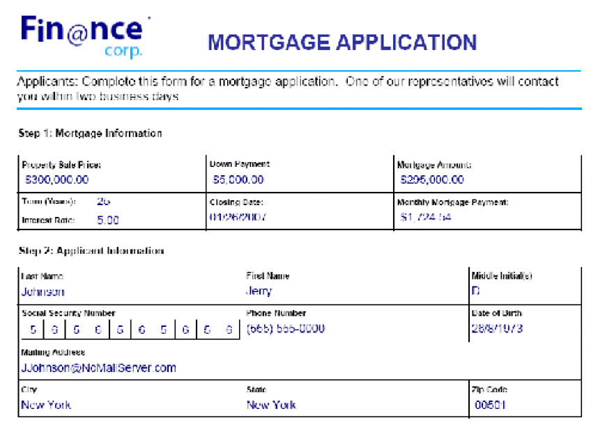
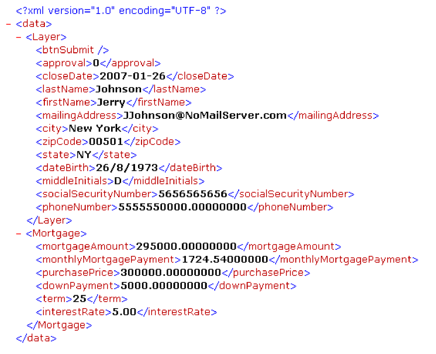
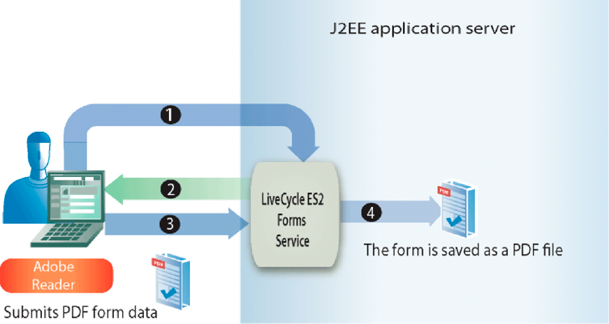

# Handling Submitted Forms {#handling-submitted-forms} 

**Samples and examples in this document are only for AEM Forms on JEE environment.**

Web-based applications that enable a user to fill in interactive forms require the data to be submitted back to the server. Using the Forms service, you can retrieve the data that the user entered into an interactive form. After you retrieve the data, you can process the data to meet your business requirements. For example, you can store the data in a database, send the data to another application, send the data to another service, merge the data in a form design, display the data in a web browser, and so on.

Form data is submitted to the Forms service as either XML or PDF data, which is an option that is set in Designer. A form that is submitted as XML enables you to extract individual field data values. That is, you can extract the value of each form field that the user entered into the form. A form that is submitted as PDF data is binary data, not XML data. You can save the form as a PDF file, or send the form to another service. If you want to extract data from a form submitted as XML and then use the form data to create a PDF document, invoke another AEM Forms operation. (See [Creating PDF Documents with Submitted XML Data](/help/forms/developing/creating-pdf-documents-submitted-xml.md))

The following diagram shows data being submitted to a Java Servlet named `HandleData` from an interactive form displayed in a web browser.

The following table explains the steps in the diagram.

<table>
 <thead>
  <tr>
   <th>
Step
</th>
   <th>
Description
</th>
  </tr>
 </thead>
 <tbody>
  <tr>
   <td>
1
</td>
   <td>
A user fills in an interactive form and clicks the form’s Submit button.
</td>
  </tr>
  <tr>
   <td>
2
</td>
   <td>
Data is submitted to the <code>HandleData</code> Java Servlet as XML data.
</td>
  </tr>
  <tr>
   <td>
3
</td>
   <td>
The <code>HandleData</code> Java Servlet contains application logic to retrieve the data.
</td>
  </tr>
 </tbody>
</table>

## Handling submitted XML data {#handling-submitted-xml-data}

When form data is submitted as XML, you can retrieve XML data that represents the submitted data. All form fields appear as nodes in an XML schema. The node values correspond to the values that the user filled in. Consider a loan form where each field in the form appears as a node within the XML data. The value of each node corresponds to the value that a user fills in. Assume a user fills the loan form with data shown in the following form.

The following illustration shows corresponding XML data that is retrieved by using the Forms service Client API.

The fields in the loan form. These values can be retrieved
using Java XML classes.

>[!NOTE]
>
>The form design must be configured correctly in Designer for data to be submitted as XML data. To properly configure the form design to submit XML data, ensure that the Submit button that is located on the form design is set to submit XML data. For information about setting the Submit button to submit XML data, see [AEM Forms Designer](https://www.adobe.com/go/learn_aemforms_designer_63).

## Handling submitted PDF data {#handling-submitted-pdf-data}

Consider a web application that invokes the Forms service. After the Forms service renders an interactive PDF form to a client web browser, the user fills in the form and submits it back as PDF data. When the Forms service receives the PDF data, it can send the PDF data to another service or save it as a PDF file. The following diagram shows the application’s logic flow.

The following table describes the steps in this diagram.

<table>
 <thead>
  <tr>
   <th>
Step
</th>
   <th>
Description
</th>
  </tr>
 </thead>
 <tbody>
  <tr>
   <td>
1
</td>
   <td>
A web page contains a link that accesses a Java Servlet that invokes the Forms service.
</td>
  </tr>
  <tr>
   <td>
2
</td>
   <td>
The Forms service renders an interactive PDF form to the client web browser.
</td>
  </tr>
  <tr>
   <td>
3
</td>
   <td>
The user fills in an interactive form and clicks a submit button. The form is submitted back to the Forms service as PDF data. This option is set in Designer.
</td>
  </tr>
  <tr>
   <td>
4
</td>
   <td>
The Forms service saves the PDF data as a PDF file. 
</td>
  </tr>
 </tbody>
</table>

## Handling submitted URL UTF-16 data {#handling-submitted-url-utf-16-data}

If form data is submitted as URL UTF-16 data, the client computer requires Adobe Reader or Acrobat 8.1 or later. Also if the form design contains a submit button that has URL-encoded Data (HTTP Post) and the data encoding option is UTF-16, the form design must be modified in a text editor such as Notepad. You can set the encoding option to either `UTF-16LE` or `UTF-16BE` for the submit button. Designer does not provide this functionality.

>[!NOTE]
>
>For more information about the Forms service, see [Services Reference for AEM Forms](https://www.adobe.com/go/learn_aemforms_services_63).

## Summary of steps {#summary-of-steps}

To handle submitted forms, perform the following tasks:

1. Include project files.
1. Create a Forms Client API object.
1. Retrieve form data.
1. Determine if the form submission contains file attachments.
1. Process the submitted data.

**Include project files**

Include necessary files into your development project. If you are creating a client application using Java, include the necessary JAR files. If you are using web services, ensure that you include the proxy files.

**Create a Forms Client API object**

Before you can programmatically perform a Forms service Client API operation, you must create a Forms service client. If you are using the Java API, create a `FormsServiceClient` object. If you are using the Forms web service API, create a `FormsService` object.

**Retrieve form data**

To retrieve submitted form data, you invoke the `FormsServiceClient` object’s `processFormSubmission` method. When invoking this method, you have to specify the submitted form’s content type. When data is submitted from a client web browser to the Forms service, it can be submitted as either XML or PDF data. To retrieve the data that is entered into form fields, the data can be submitted as XML data.

You can also retrieve form fields from a form submitted as PDF data by setting the following run-time options:

* Pass the following value to the `processFormSubmission` method as the content type parameter: `CONTENT_TYPE=application/pdf`.
* Set the `RenderOptionsSpec` object’s `PDFToXDP` value to `true`
* Set the `RenderOptionsSpec` object’s `ExportDataFormat` value to `XMLData`

You specify the content type of the submitted form when you invoke the `processFormSubmission` method. The following list specifies applicable content type values:

* **text/xml**: Represents the content type to use when a PDF form submits form data as XML.
* **application/x-www-form-urlencoded**: Represents the content type to use when an HTML form submits data as XML.
* **application/pdf**: Represents the content type to use when a PDF form submits data as PDF.

>[!NOTE]
>
>You will notice that there are three corresponding quick starts associated with the Handling Submitted Forms section. The Handling PDF forms submitted as PDF using the Java API quick start demonstrates how to handle submitted PDF data. The content type specified in this quick start is `application/pdf`. The Handling PDF forms submitted as XML using the Java API quick start demonstrates how to handle submitted XML data that is submitted from a PDF form. The content type specified in this quick start is `text/xml`. Likewise, the Handling HTML forms submitted as XML using the Java API quick start demonstrates how to handle submitted XML data that is submitted from an HTML form. The content type specified in this quick start is application/x-www-form-urlencoded.

You retrieve form data that was posted to the Forms service and determine its processing state. That is, when data is submitted to the Forms service, it does not necessarily mean that the Forms service is finished processing the data and the data is ready to be processed. For example, data can be submitted to the Forms service so that a calculation can be performed. When the calculation is complete, the form is rendered back to the user with the calculation results displayed. Before you process submitted data, it is recommended that you determine whether the Forms service has finished processing the data.

The Forms service returns the following values to indicate whether it has finished processing the data:

* **0 (Submit):** Submitted data is ready to be processed.
* **1 (Calculate):** The Forms service performed a calculation operation on the data and the results must be rendered back to the user.
* **2 (Validate):** The Forms service validated form data and the results must be rendered back to the user.
* **3 (Next):** The current page has changed with results that must be written to the client application.
* **4 (Previous**): The current page has changed with results that must be written to the client application.

>[!NOTE]
>
>Calculations and validations must be rendered back to the user. (See [Calculating Form Data](/help/forms/developing/calculating-form-data.md#calculating-form-data).

**Determine if the form submission contains file attachments**

Forms submitted to the Forms service can contain file attachments. For example, using Acrobat’s built-in attachment pane, a user can select file attachments to submit along with the form. As well, a user can also select file attachments using an HTML toolbar that is rendered with an HTML file.

After you determine if a form contains file attachments, you can process the data. For example, you can save the file attachment to the local file system.

>[!NOTE]
>
>The form must be submitted as PDF data to retrieve file attachments. If the form is submitted as XML data, file attachments are not submitted.

**Process the submitted data**

Depending on the content type of the submitted data, you can extract individual form field values from the submitted XML data or save the submitted PDF data as a PDF file (or send it to another service). To extract individual form fields, convert submitted XML data to an XML data source and then retrieve XML data source values by using `org.w3c.dom` classes.

**See also**

[Including AEM Forms Java library files](/help/forms/developing/invoking-aem-forms-using-java.md#including-aem-forms-java-library-files)

[Setting connection properties](/help/forms/developing/invoking-aem-forms-using-java.md#setting-connection-properties)

[Forms Service API Quick Starts](/help/forms/developing/forms-service-api-quick-starts.md#forms-service-api-quick-starts)

[Passing Documents to the Forms Service](/help/forms/developing/passing-documents-forms-service.md)

[Creating Web Applications that Renders Forms](/help/forms/developing/creating-web-applications-renders-forms.md)

## Handle submitted forms using the Java API {#handle-submitted-forms-using-the-java-api}

Handle a submitted form by using the Forms API (Java):

1. Include project files

   Include client JAR files, such as adobe-forms-client.jar, in your Java project’s class path.

1. Create a Forms Client API object

    * Create a `ServiceClientFactory` object that contains connection properties.
    * Create an `FormsServiceClient` object by using its constructor and passing the `ServiceClientFactory` object.

1. Retrieve form data

    * To retrieve form data that was posted to a Java Servlet, create a `com.adobe.idp.Document` object by using its constructor and invoking the `javax.servlet.http.HttpServletResponse` object’s `getInputStream` method from within the constructor.
    * Create a `RenderOptionsSpec` object by using its constructor. Set the locale value by invoking the `RenderOptionsSpec` object’s `setLocale` method and passing a string value that specifies the locale value.

   >[!NOTE]
   >
   >You can instruct the Forms service to create XDP or XML data from submitted PDF content by invoking the `RenderOptionsSpec` object’s `setPDF2XDP` method and passing `true` and also calling `setXMLData` and passing `true`. You can then invoke the `FormsResult` object’s `getOutputXML` method to retrieve the XML data that corresponds to the XDP/XML data. (The `FormsResult` object is returned by the `processFormSubmission` method, which is explained in the next sub-step.)

    * Invoke the `FormsServiceClient` object’s `processFormSubmission` method and pass the following values:

        * The `com.adobe.idp.Document` object that contains the form data.
        * A string value that specifies environment variables including all relevant HTTP headers. Specify the content type to handle. To handle XML data, specify the following string value for this parameter: `CONTENT_TYPE=text/xml`. To handle PDF data, specify the following string value for this parameter: `CONTENT_TYPE=application/pdf`.
        * A string value that specifies the `HTTP_USER_AGENT` header value, for example, . `Mozilla/4.0 (compatible; MSIE 6.0; Windows NT 5.1; SV1; .NET CLR 1.1.4322)`. This parameter value is optional.
        * A `RenderOptionsSpec` object that stores run-time options.

      The `processFormSubmission` method returns a `FormsResult` object containing the results of the form submission.

    * Determine whether the Forms service is finished processing the form data by invoking the `FormsResult` object’s `getAction` method. If this method returns the value `0`, the data is ready to be processed.

1. Determine if the form submission contains file attachments

    * Invoke the `FormsResult` object’s `getAttachments` method. This method returns a `java.util.List` object that contains files that were submitted with the form.
    * Iterate through the `java.util.List` object to determine if there are file attachments. If there are file attachments, each element is a `com.adobe.idp.Document` instance. You can save the file attachments by invoking the `com.adobe.idp.Document` object’s `copyToFile` method and passing a `java.io.File` object.

   >[!NOTE]
   >
   >This step is only applicable if the form is submitted as PDF.

1. Process the submitted data

    * If the data content type is `application/vnd.adobe.xdp+xml` or `text/xml`, create application logic to retrieve XML data values.

        * Create a `com.adobe.idp.Document` object by invoking the `FormsResult` object’s `getOutputContent` method.
        * Create a `java.io.InputStream` object by invoking the `java.io.DataInputStream` constructor and passing the `com.adobe.idp.Document` object.
        * Create an `org.w3c.dom.DocumentBuilderFactory` object by calling the static `org.w3c.dom.DocumentBuilderFactory` object’s `newInstance` method.
        * Create an `org.w3c.dom.DocumentBuilder` object by invoking the `org.w3c.dom.DocumentBuilderFactory` object’s `newDocumentBuilder` method.
        * Create an `org.w3c.dom.Document` object by invoking the `org.w3c.dom.DocumentBuilder` object’s `parse` method and passing the `java.io.InputStream` object.
        * Retrieve the value of each node within the XML document. One way to accomplish this task is to create a custom method that accepts two parameters: the `org.w3c.dom.Document` object and the name of the node whose value you want to retrieve. This method returns a string value representing the value of the node. In the code example that follows this process, this custom method is called `getNodeText`. The body of this method is shown.

    * If the data content type is `application/pdf`, create application logic to save the submitted PDF data as a PDF file.

        * Create a `com.adobe.idp.Document` object by invoking the `FormsResult` object’s `getOutputContent` method.
        * Create a `java.io.File` object by using its public constructor. Be sure to specify PDF as the file name extension.
        * Populate the PDF file by invoking the `com.adobe.idp.Document` object’s `copyToFile` method and passing the `java.io.File` object.

**See also**

[Quick Start (SOAP mode): Handling PDF forms submitted as XML using the Java API](/help/forms/developing/forms-service-api-quick-starts.md#quick-start-soap-mode-handling-pdf-forms-submitted-as-xml-using-the-java-api)

[Quick Start (SOAP mode): Handling HTML forms submitted as XML using the Java API](/help/forms/developing/forms-service-api-quick-starts.md#quick-start-soap-mode-handling-html-forms-submitted-as-xml-using-the-java-api)

[Quick Start (SOAP mode): Handling PDF forms submitted as PDF using the Java API](/help/forms/developing/forms-service-api-quick-starts.md#quick-start-soap-mode-handling-pdf-forms-submitted-as-pdf-using-the-java-api)

[Including AEM Forms Java library files](/help/forms/developing/invoking-aem-forms-using-java.md#including-aem-forms-java-library-files)

[Setting connection properties](/help/forms/developing/invoking-aem-forms-using-java.md#setting-connection-properties)

## Handle submitted PDF data using the web service API {#handle-submitted-pdf-data-using-the-web-service-api}

Handle a submitted form by using the Forms API (web service):

1. Include project files

    * Create Java proxy classes that consume the Forms service WSDL.
    * Include the Java proxy classes into your class path.

1. Create a Forms Client API object

   Create a `FormsService` object and set authentication values.

1. Retrieve form data

    * To retrieve form data that was posted to a Java Servlet, create a `BLOB` object by using its constructor.
    * Create a `java.io.InputStream` object by invoking the `javax.servlet.http.HttpServletResponse` object’s `getInputStream` method.
    * Create a `java.io.ByteArrayOutputStream` object by using its constructor and passing the length of the `java.io.InputStream` object.
    * Copy the contents of the `java.io.InputStream` object into the `java.io.ByteArrayOutputStream` object.
    * Create a byte array by invoking the `java.io.ByteArrayOutputStream` object’s `toByteArray` method.
    * Populate the `BLOB` object by invoking its `setBinaryData` method and passing the byte array as an argument.
    * Create a `RenderOptionsSpec` object by using its constructor. Set the locale value by invoking the `RenderOptionsSpec` object’s `setLocale` method and passing a string value that specifies the locale value.
    * Invoke the `FormsService` object’s `processFormSubmission` method and pass the following values:

        * The `BLOB` object that contains the form data.
        * A string value that specifies environment variables including all relevant HTTP headers. Specify the content type to handle. To handle XML data, specify the following string value for this parameter: `CONTENT_TYPE=text/xml`. To handle PDF data, specify the following string value for this parameter: `CONTENT_TYPE=application/pdf`.
        * A string value that specifies the `HTTP_USER_AGENT` header value; for example, `Mozilla/4.0 (compatible; MSIE 6.0; Windows NT 5.1; SV1; .NET CLR 1.1.4322)`.
        * A `RenderOptionsSpec` object that stores run-time options.
        * An empty `BLOBHolder` object that is populated by the method.
        * An empty `javax.xml.rpc.holders.StringHolder` object that is populated by the method.
        * An empty `BLOBHolder` object that is populated by the method.
        * An empty `BLOBHolder` object that is populated by the method.
        * An empty `javax.xml.rpc.holders.ShortHolder` object that is populated by the method.
        * An empty `MyArrayOf_xsd_anyTypeHolder` object that is populated by the method. This parameter is used to store file attachments that are submitted along with the form.
        * An empty `FormsResultHolder` object that is populated by the method with the form that is submitted.

      The `processFormSubmission` method populates the `FormsResultHolder` parameter with the results of the form submission.

    * Determine whether the Forms service is finished processing the form data by invoking the `FormsResult` object’s `getAction` method. If this method returns the value `0`, the form data is ready to be processed. You can get a `FormsResult` object by getting the value of the `FormsResultHolder` object’s `value` data member.

1. Determine if the form submission contains file attachments

   Get the value of the `MyArrayOf_xsd_anyTypeHolder` object’s `value` data member (the `MyArrayOf_xsd_anyTypeHolder` object was passed to the `processFormSubmission` method). This data member returns an array of `Objects`. Each element within the `Object` array is an `Object`that corresponds to the files that were submitted along with the form. You can get each element within the array and cast it to a `BLOB` object.

1. Process the submitted data

    * If the data content type is `application/vnd.adobe.xdp+xml` or `text/xml`, create application logic to retrieve XML data values.

        * Create a `BLOB` object by invoking the `FormsResult` object’s `getOutputContent` method.
        * Create a byte array by invoking the `BLOB` object’s `getBinaryData` method.
        * Create a `java.io.InputStream` object by invoking the `java.io.ByteArrayInputStream` constructor and passing the byte array.
        * Create an `org.w3c.dom.DocumentBuilderFactory` object by calling the static `org.w3c.dom.DocumentBuilderFactory` object’s `newInstance` method.
        * Create an `org.w3c.dom.DocumentBuilder` object by invoking the `org.w3c.dom.DocumentBuilderFactory` object’s `newDocumentBuilder` method.
        * Create an `org.w3c.dom.Document` object by invoking the `org.w3c.dom.DocumentBuilder` object’s `parse` method and passing the `java.io.InputStream` object.
        * Retrieve the value of each node within the XML document. One way to accomplish this task is to create a custom method that accepts two parameters: the `org.w3c.dom.Document` object and the name of the node whose value you want to retrieve. This method returns a string value representing the value of the node. In the code example that follows this process, this custom method is called `getNodeText`. The body of this method is shown.

    * If the data content type is `application/pdf`, create application logic to save the submitted PDF data as a PDF file.

        * Create a `BLOB` object by invoking the `FormsResult` object’s `getOutputContent` method.
        * Create a byte array by invoking the `BLOB` object’s `getBinaryData` method.
        * Create a `java.io.File` object by using its public constructor. Be sure to specify PDF as the file name extension.
        * Create a `java.io.FileOutputStream` object by using its constructor and passing the `java.io.File` object.
        * Populate the PDF file by invoking the `java.io.FileOutputStream` object’s `write` method and passing the byte array.

**See also**

[Invoking AEM Forms using Base64 encoding](/help/forms/developing/invoking-aem-forms-using-web.md#invoking-aem-forms-using-base64-encoding)
