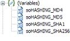

# Generating and working with Hashes in dynamic PDF forms {#generate-work-with-hashes-dynamic-pdf-forms}

## Prerequisite knowledge {#prerequisite-knowledge}

Some experience with AEM Forms on JEE Designer is required, as is the ability to access and call functions in script objects.

## User level {#user-level}

Beginning

When you want to hide a password in your PDF form and you do not want to have it in clear text inside the source code or anywhere else in the PDF document, knowing how to generate and work with MD4, MD5, SHA-1, and SHA-256 hashes is key.

The idea is to obfuscate the password by generating a unique hash and store this hash in the PDF document. This unique hash can be generated by different hash functions, and in this article you are shown how to generate them inside the PDF form and how to work with them.

A hash function takes a long string (or message) of any length as input and produces a fixed-length string as output, sometimes termed a message digest or a digital fingerprint.

AEM Forms on JEE Designer lets you implement the different hash functions in script objects as JavaScript and run them inside a dynamic PDF document. The example PDFs that are included with the sample files for this article use open source implementations of the following hash functions:

* MD4 and MD5 - designed by Ronald Rivest

* SHA-1 and SHA-256 - as they are defined by NIST

The biggest benefit of using hashes is that you do not have to compare passwords directly by comparing clear text strings; instead, you can compare the two hashes of the two passwords. Because it is unlikely that two different strings have the same hash, if both hashes are identical, then you can assume that the compared strings (in this case, the passwords) are identical, too.

>[!NOTE]
>
>There are some well-known security issues (so called hash collisions) with MD4 or MD5. Because of those hash collisions and other SHA-1 hacks (including rainbow tables), I decided to concentrate on the SHA-256 hash function in the second sample. For more information, see the [Collision](https://en.wikipedia.org/wiki/Hash_collision) and [Rainbow Table](https://en.wikipedia.org/wiki/Rainbow_table) pages from Wikipedia.

## Examining the script objects {#examining-script-objects}

When you open one of the two provided samples in AEM Forms on JEE Designer, you find the four script objects in the Hierarchy palette (see Figure below).



To see the JavaScript implementation of the hash functions within these script objects, select the script object and explore the code in the Script Editor. You can see how each of the following hash functions has been implemented:

* soHASHING_MD4.hex_md4()
* soHASHING_MD4.b64_md4()
* soHASHING_MD4.str_md4()
* soHASHING_MD5.hex_md5()
* soHASHING_MD5.b64_md5()
* soHASHING_MD5.str_md5()
* soHASHING_SHA1.hex_sha1()
* soHASHING_SHA1.b64_sha1( )
* soHASHING_SHA1.str_sha1( )
* soHASHING_SHA256.hex_sha256()
* soHASHING_SHA256.b64_sha256()
* soHASHING_SHA256.str_sha256()

As you can see from this list, there are different functions available for the different output types of the hash. You can choose between `hex_` for hexadecimal digits, `b64_` for Base64 encoded output, or `str_` for simple string encoding.

Depending on the hash function you choose, the length of the hash varies:

* MD4: 128 bits
* MD5: 128 bits
* SHA-1: 160 bits
* SHA-256: 256 bits

## Trying the sample PDF forms {#try-sample-pdf-forms}

The sample files for this article include two PDF forms. The first sample lets you type in a string and then generate MD4, MD5, SHA-1, and SHA-256 hash values for the string. The second sample is a simple form that unlocks text fields if a correct password is entered.

### Sample 1:  generating hashes {#generating-dashes}

Follow the steps below to try the first sample:

1. After downloading and unzipping the sample files, open hashing_forms_sample1.pdf with AEM Forms on JEE Designer. Alternatively you can use Adobe Reader or Adobe Acrobat Professional to open and view the sample, but you cannot see the source code.
1. In the text field labeled [!UICONTROL clear text] type in a password or any other message that you want to be hashed.
1. Click one of the four buttons to generate the MD4, MD5, SHA-1, or SHA-256 hash. Depending on the button you pressed, one of the four hash functions that produces hexadecimal output is called and your string or message is hashed.

The result of the hash operation is displayed in the field labeled [!UICONTROL hash]. The length of the hash varies depending on the hash function you chose.

All the samples use hexadecimal digits as the output type. You can use the Script Editor to modify the samples and change the output type to Base64 or simple String.

### Sample 2:  matching passwords {#matching-passwords}

The second sample demonstrates how hashes are compared in the background, without having to unveil the real password. The password you enter is hashed. The real password, which is stored in an invisible field, is hashed too. The password is secure not because it is invisible, but rather because it has been hashed. Because it is impossible to reconstruct the password from the hashed value, it is safe to expose the password in hashed form. The comparison is made only between the hashes, not between the passwords in clear text. If both hashes are the same, then you can assume that the passwords are identical.

Follow the steps below to try the second sample:

1. Open `hashing_forms_sample2.pdf` with AEM Forms on JEE Designer. Alternatively you can use Adobe Reader or Adobe Acrobat Professional to open and view the sample, but you cannot see the source code.
1. Choose one of the two password fields labeled [!UICONTROL Password MAN] or [!UICONTROL Password WOMAN] and type in the passwords:
   1. The password for the man is `bob`
   1. The password for the woman is `alice`
1. When you move the focus out of the password fields or press the Enter key, the hash of the password you have entered is generated automatically and is compared with the stored hash of the correct password in the background. The correct, hashed passwords are stored in the invisible text fields labeled `passwd_man_hashed` and `passwd_woman_hashed`. If you type in the correct password for the man, then the text fields labeled `Man 1` and `Man 2` are made accessible so you can type text in them. The same behavior applies for the woman's fields.
1. Optionally, you can click the button labeled "delete passwords", which will disable the text fields and change their border.

The code to compare the two hashed values and enable the text fields is straightforward:

```xml
if (soHASHING_SHA256.hex_sha256(this.rawValue) == passwd_man_hashed.rawValue){
     VAL_man_1.access = "open";
     VAL_man_2.access = "open";
     VAL_man_1.borderColor = "0,255,0";
     VAL_man_2.borderColor = "0,255,0";
}
```

## Where to go from here {#next-steps}

Where would you need something like this? Consider a PDF form that has fields that should be filled out only by authorized individuals. By securing those fields with a password, which cannot be seen in clear text anywhere in the document as in Sample_2.pdf, you can ensure that those fields are accessible only to users that know the password.

I encourage you to continue to explore the two sample PDF files.  You can generate new hash values with Sample_1.pdf, and use the generated values to change either the password or the hash function used in Sample_2.pdf.  The resources listed in the Attributions section also provide additional information on hashing and the specific JavaScript implementations used in this article.

## Attributions {#attributions}

* [Ronald Rivest](https://en.wikipedia.org/wiki/Ron_Rivest)
* [NIST](https://csrc.nist.gov/projects/cryptographic-standards-and-guidelines)
* [Hash collision](https://en.wikipedia.org/wiki/Hash_collision)
* [Rainbow table](https://en.wikipedia.org/wiki/Rainbow_table)
* [JavaScript MD5 project home page](https://pajhome.org.uk/crypt/md5/)
* [jsSHA2 project home page](https://anmar.eu.org/projects/jssha2/)
