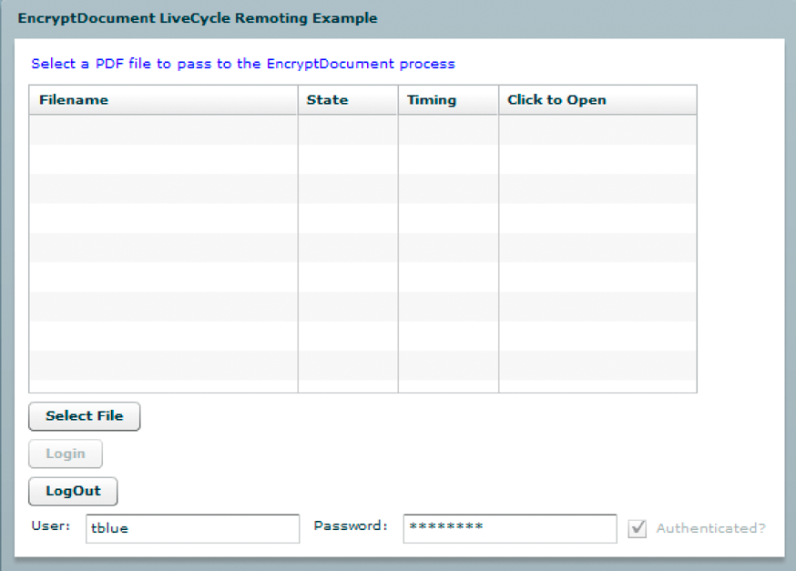
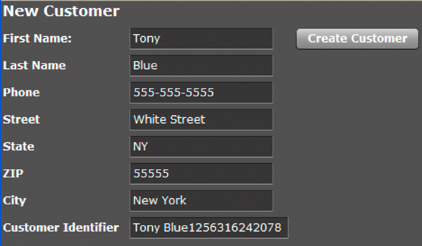
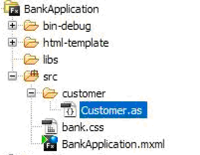

# Invoking AEM Forms using Remoting {#invoking-aem-forms-using-remoting} 

**Samples and examples in this document are only for AEM Forms on JEE environment.**

Processes created in Workbench can be invoked by using Remoting. That is, you can invoke a AEM Forms process from a client application built with Flex. This feature is based on Data Services.

>[!NOTE]
>
>When using Remoting, it is recommended that you invoke processes that were created in Workbench as opposed to AEM Forms services. However, it is possible to invoke AEM Forms services directly. (See Encrypting PDF documents using Remoting located on AEM Forms Developer Center.)

>[!NOTE]
>
>If a AEM Forms service is not configured to allow anonymous access, requests from a Flex client result in a web browser challenge. The user must enter user name and password credentials.

The following AEM Forms short-lived process, named `MyApplication/EncryptDocument`, can be invoked using Remoting. (For information about this process such as its input and output values, see [Short lived process example](/help/forms/developing/aem-forms-processes.md).)


>[!NOTE]
>
>To invoke an AEM Forms process using a Flex application, ensure that a remoting endpoint is enabled. By default, a remoting endpoint is enabled when you deploy a process.

When this process is invoked, it performs the following actions:

1. Obtains the unsecured PDF document that is passed as an input value. This action is based on the `SetValue` operation. The name of the input parameter is `inDoc` and its data type is `document`. (The `document` data type is an available data type from within Workbench.)
1. Encrypts the PDF document with a password. This action is based on the `PasswordEncryptPDF` operation. The name of the output value for this process is `outDoc` and represents the password-encrypted PDF document. The data type of outDoc is `document`.
1. Saves the password-encrypted PDF document as a PDF file to the local file system. This action is based on the `WriteDocument` operation.

>[!NOTE]
>
>The `MyApplication/EncryptDocument` process is not based on an existing AEM Forms process. To following along with the code examples, create a process named `MyApplication/EncryptDocument` using Workbench.

>[!NOTE]
>
>For information about using Remoting to invoke a long-lived process, see [Invoking Human-Centric Long-Lived Processes](/help/forms/developing/invoking-human-centric-long-lived.md#invoking-human-centric-long-lived-processes).

**See also**

[Including the AEM Forms Flex library file](invoking-aem-forms-using-remoting.md#including-the-aem-forms-flex-library-file)

[Handling documents with (Deprecated for AEM forms) AEM Forms Remoting](invoking-aem-forms-using-remoting.md#handling-documents-with-remoting)

[Invoking a short-lived process by passing an unsecure document using (Deprecated for AEM forms) AEM Forms Remoting](invoking-aem-forms-using-remoting.md#invoking-a-short-lived-process-by-passing-an-unsecure-document-using-remoting)

[Authenticating client applications built with Flex](invoking-aem-forms-using-remoting.md#authenticating-client-applications-built-with-flex)

[Passing secure documents to invoke processes using Remoting](invoking-aem-forms-using-remoting.md#passing-secure-documents-to-invoke-processes-using-remoting)

[Invoking custom component services using Remoting](invoking-aem-forms-using-remoting.md#invoking-custom-component-services-using-remoting)

[Creating a client application built with Flex that invokes a human-centric long-lived process](/help/forms/developing/invoking-human-centric-long-lived.md#creating-a-client-application-built-with-flex-that-invokes-a-human-centric-long-lived-process)

[Creating Flash Builder applications that perform SSO authentication using HTTP tokens](/help/forms/developing/creating-flash-builder-applications-perform.md#creating-flash-builder-applications-that-perform-sso-authentication-using-http-tokens)

<!-- For information on how to display process data in a Flex graph control, see [Displaying AEM Forms process data in Flex graphs](https://www.adobe.com/devnet/livecycle/articles/populating_flexcontrols.html). This URL is 404. No suitable replacement URL was found after a search. Do not make this link live if it is dead! -->

>[!NOTE]
>
>*Be sure to place the crossdomain.xml file in the proper place. For example, assuming that you deployed AEM Forms on JBoss, place this file in the following location: &lt;install_directory&gt;\Adobe_Experience_Manager_forms\jboss\server\lc_turnkey\deploy\jboss-web.deployer\ROOT.war.*

## Including the AEM Forms Flex library file {#including-the-aem-forms-flex-library-file}

To programmatically invoke AEM Forms processes using Remoting, add the adobe-remoting-provider.swc file to your Flex project's class path. This SWC file is located in the following location:

* *&lt;install_directory&gt;\Adobe_Experience_Manager_forms\sdk\misc\DataServices\Client-Libraries*

  where &lt;*install_directory*&gt; is the directory where AEM Forms is installed.

**See also**

[Invoking AEM Forms using (Deprecated for AEM forms) AEM Forms Remoting](invoking-aem-forms-using-remoting.md#invoking-aem-forms-using-remoting)

[Handling documents with (Deprecated for AEM forms) AEM Forms Remoting](invoking-aem-forms-using-remoting.md#handling-documents-with-remoting)

[Invoking a short-lived process by passing an unsecure document using (Deprecated for AEM forms) AEM Forms Remoting](invoking-aem-forms-using-remoting.md#invoking-a-short-lived-process-by-passing-an-unsecure-document-using-remoting)

[Authenticating client applications built with Flex](invoking-aem-forms-using-remoting.md#authenticating-client-applications-built-with-flex)

## Handling documents with Remoting {#handling-documents-with-remoting}

One of the most important non-primitive Java&trade; types used in AEM Forms is the `com.adobe.idp.Document` class. A document is commonly required to invoke a AEM Forms operation. It is primarily a PDF document, but can contain other document types such as SWF, HTML, XML, or a DOC file. (See [Passing data to AEM Forms services using the Java API](/help/forms/developing/invoking-aem-forms-using-java.md#passing-data-to-aem-forms-services-using-the-java-api).)

A client application built with Flex cannot directly request a document. For example, you cannot launch Adobe Reader to request a URL that produces a PDF file. Requests for document types, such as PDF and Microsoft&reg; Word documents, return a result that is a URL. It is the client's responsibility to display the contents of the URL. The Document Management service helps generate the URL and content type information. Requests for XML documents return the full XML document in the result.

### Passing a document as an input parameter {#passing-a-document-as-an-input-parameter}

A client application built with Flex cannot pass a document directly to a AEM Forms process. Instead, the client application uses an instance of the `mx.rpc.livecycle.DocumentReference` ActionScript class to pass input parameters to an operation that expects a `com.adobe.idp.Document` instance. A Flex client application has several options for setting up a `DocumentReference` object:

* When the document is on the server and its file location is known, set the DocumentReference object's referenceType property to REF_TYPE_FILE. Set the fileRef property to the location of the file, as the following example shows:

```java
 ... var docRef: DocumentReference = new DocumentReference(); 
 docRef.referenceType = DocumentReference.REF_TYPE_FILE; 
 docRef.fileRef = "C:/install/adobe/cs2/How to Uninstall.pdf"; ...
```

* When the document is on the server and you know its URL, set the DocumentReference object's referenceType property to REF_TYPE_URL. Set the url property to the URL, as the following example shows:

```java
... var docRef: DocumentReference = new DocumentReference(); 
docRef.referenceType = DocumentReference.REF_TYPE_URL; 
docRef.url = "https://companyserver:8080/DocumentManager/116/7855"; ...
```

* To create a DocumentReference object from a text string in the client application, set the DocumentReference object's referenceType property to REF_TYPE_INLINE. Set the text property to the text to include in the object, as the following example shows:

```java
... var docRef: DocumentReference = new DocumentReference(); 
docRef.referenceType = DocumentReference.REF_TYPE_INLINE; 
docRef.text = "Text for my document";  // Optionally, you can override the server's default character set  // if necessary:  // docRef.charsetName=CharacterSetName  ...
```

* When the document is not on the server, use the Remoting upload servlet to upload a document to AEM Forms. New in AEM Forms is the ability to upload secure documents. When uploading a secure document, you have to use a user who has the *Document Upload Application User* role. Without this role, the user cannot upload a secure document. It is recommended that you use single sign on to upload a secure document. (See [Passing secure documents to invoke processes using Remoting](invoking-aem-forms-using-remoting.md#passing-secure-documents-to-invoke-processes-using-remoting).)

>[!NOTE]
>
>if AEM Forms is configured to allow unsecure documents to be uploaded, you can use a user that does not have the Document Upload Application User role to upload a document. A user can also have the Document Upload permission. However, if AEM Forms is configured to only allow secure documents, then ensure that the user has the Document Upload Application User role or Document Upload permission. (See [Configuring AEM Forms to accept secure and unsecure documents](invoking-aem-forms-using-remoting.md#configuring-aem-forms-to-accept-secure-and-unsecure-documents).

  You use standard Flash upload capabilities for the designated upload URL: `https://SERVER:PORT/remoting/lcfileupload`. You can then use the `DocumentReference` object wherever an input parameter of type `Document` is expected
  ` private function startUpload():void  {  fileRef.addEventListener(Event.SELECT, selectHandler);  fileRef.addEventListener("uploadCompleteData", completeHandler);  try  {   var success:Boolean = fileRef.browse();  }    catch (error:Error)  {   trace("Unable to browse for files.");  }  }      private function selectHandler(event:Event):void {  var request:URLRequest = new  URLRequest("https://SERVER:PORT/remoting/lcfileupload")  try   {   fileRef.upload(request);   }    catch (error:Error)   {   trace("Unable to upload file.");   }  }    private function completeHandler(event:DataEvent):void  {   var params:Object = new Object();   var docRef:DocumentReference = new DocumentReference();   docRef.url = event.data as String;   docRef.referenceType = DocumentReference.REF_TYPE_URL;  }`The Remoting Quick Start uses the Remoting upload servlet to pass a PDF file to the `MyApplication/EncryptDocument`process. (See [Invoking a short-lived process by passing an unsecure document using (Deprecated for AEM forms) AEM Forms Remoting](invoking-aem-forms-using-remoting.md#invoking-a-short-lived-process-by-passing-an-unsecure-document-using-remoting).)

```java
 
private
function startUpload(): void  { 
 fileRef.addEventListener(Event.SELECT, selectHandler); 
 fileRef.addEventListener("uploadCompleteData", completeHandler); 
 try  { 
  var success: Boolean = fileRef.browse(); 
 }  
 catch (error: Error)  { 
  trace("Unable to browse for files."); 
 } 
}   
private
function selectHandler(event: Event): void { 
 var request: URLRequest = new  URLRequest("https://SERVER:PORT/remoting/lcfileupload")  try  { 
  fileRef.upload(request); 
 }  
 catch (error: Error)  { 
  trace("Unable to upload file."); 
 } 
}  
private
function completeHandler(event: DataEvent): void  { 
 var params: Object = new Object(); 
 var docRef: DocumentReference = new DocumentReference(); 
 docRef.url = event.data as String; 
 docRef.referenceType = DocumentReference.REF_TYPE_URL; 
}
```

The Remoting Quick Start uses the Remoting upload servlet to pass a PDF file to the `MyApplication/EncryptDocument`process. (See [Invoking a short-lived process by passing an unsecure document using (Deprecated for AEM forms) AEM Forms Remoting](invoking-aem-forms-using-remoting.md#invoking-a-short-lived-process-by-passing-an-unsecure-document-using-remoting).)

### Passing a document back to a client application {#passing-a-document-back-to-a-client-application}

A client application receives an object of type `mx.rpc.livecycle.DocumentReference` for a service operation that returns an `com.adobe.idp.Document` instance as an output parameter. Because a client application deals with ActionScript objects and not Java, you cannot pass a Java-based Document object back to a Flex client. Instead, the server generates a URL for the document and passes the URL back to the client. The `DocumentReference` object's `referenceType` property specifies whether the content is in the `DocumentReference` object or must be retrieved from a URL in the `DocumentReference.url` property. The `DocumentReference.contentType` property specifies the type of document.

**See also**

[Invoking AEM Forms using (Deprecated for AEM forms) AEM Forms Remoting](invoking-aem-forms-using-remoting.md#invoking-aem-forms-using-remoting)

[Including the AEM Forms Flex library file](invoking-aem-forms-using-remoting.md#including-the-aem-forms-flex-library-file)

[Invoking a short-lived process by passing an unsecure document using (Deprecated for AEM forms) AEM Forms Remoting](invoking-aem-forms-using-remoting.md#invoking-a-short-lived-process-by-passing-an-unsecure-document-using-remoting)

[Authenticating client applications built with Flex](invoking-aem-forms-using-remoting.md#authenticating-client-applications-built-with-flex)

[Passing secure documents to invoke processes using Remoting](invoking-aem-forms-using-remoting.md#passing-secure-documents-to-invoke-processes-using-remoting)

## Invoking a short-lived process by passing an unsecure document using Remoting {#invoking-a-short-lived-process-by-passing-an-unsecure-document-using-remoting}

To invoke a AEM Forms process from an application built with Flex, perform the following tasks:

1. Create a `mx:RemoteObject` instance.
1. Create a `ChannelSet` instance.
1. Pass required input values.
1. Handle return values.

>[!NOTE]
>
>This section discusses how to invoke a AEM Forms process and upload a document when AEM Forms is configured to upload unsecure documents. For information about how to invoke AEM Forms processes and upload secure documents and how to configure AEM Forms to accept secure and unsecure documents, see [Passing secure documents to invoke processes using Remoting](invoking-aem-forms-using-remoting.md#passing-secure-documents-to-invoke-processes-using-remoting).

**Creating a mx:RemoteObject instance**

You create a `mx:RemoteObject` instance to invoke a AEM Forms process created in Workbench. To create a `mx:RemoteObject` instance, specify the following values:

* **id:** The name of the `mx:RemoteObject` instance that represents the process to invoke.
* **destination:** The name of the AEM Forms process to invoke. For example, to invoke the `MyApplication/EncryptDocument` process, specify `MyApplication/EncryptDocument`.
* **result:** The name of the Flex method that handles the result.

Within the `mx:RemoteObject` tag, specify a `<mx:method>` tag that specifies the name of the process's invocation method. Typically, the name of a Forms invocation method is `invoke`.

The following code example creates a `mx:RemoteObject` instance that invokes the `MyApplication/EncryptDocument` process.

```java
 <mx:RemoteObject id="EncryptDocument" destination="MyApplication/EncryptDocument" result="resultHandler(event);">
          <mx:method name="invoke" result="handleExecuteInvoke(event)"/>
      </mx:RemoteObject>
```

**Create a Channel to AEM Forms**

A client application can invoke AEM Forms by specifying a Channel in MXML or ActionScript, as the following ActionScript example shows. The Channel must be an `AMFChannel`, `SecureAMFChannel`, `HTTPChannel`, or `SecureHTTPChannel`.

```java
     ...
     private function refresh():void{
         var cs:ChannelSet= new ChannelSet();
         cs.addChannel(new AMFChannel("my-amf",
             "https://yourlcserver:8080/remoting/messagebroker/amf"));
         EncryptDocument.setCredentials("administrator", "password");
         EncryptDocument.channelSet = cs;
     }
     ...
```

Assign the `ChannelSet` instance to the `mx:RemoteObject` instance's `channelSet` field (as shown in the previous code example). Generally, you import the channel class in an import statement rather than specifying the fully qualified name when you invoke the `ChannelSet.addChannel` method.

**Passing input values**

A process created in Workbench can take zero or more input parameters and return an output value. A client application passes input parameters within an `ActionScript` object with fields that correspond to parameters that belong to the AEM Forms process. The short-lived process, named `MyApplication/EncryptDocument`, requires one input parameter named `inDoc`. The name of the operation exposed by the process is `invoke` (the default name for a short-lived process). (See [Invoking AEM Forms using (Deprecated for AEM forms) AEM Forms Remoting](invoking-aem-forms-using-remoting.md#invoking-aem-forms-using-remoting).)

The following code example passes a PDF document to the `MyApplication/EncryptDocument` process:

```java
     ...
     var params:Object = new Object();
 
     //Document is an instance of DocumentReference
     //that store an unsecured PDF document
     params["inDoc"] = pdfDocument;
 
     // Invoke an operation synchronously:
     EncryptDocument.invoke(params);
     ...
```

In this code example, `pdfDocument` is a `DocumentReference` instance that contains an unsecured PDF document. For information about a `DocumentReference`, see [Handling documents with (Deprecated for AEM forms) AEM Forms Remoting](invoking-aem-forms-using-remoting.md#handling-documents-with-remoting).

**Invoking a specific version of a service**

You can invoke a specific version of a Forms service by using a `_version` parameter in the invocation's parameter map. For example, to invoke version 1.2 of the `MyApplication/EncryptDocument` service:

```java
 var params:Object = new Object();
 params["inDoc"] = pdfDocument;
 params["_version"] = "1.2"
 var token:AsyncToken = echoService.echoString(params);
```

The `version` parameter must be a string containing a single period. The values to the left, major version, and right, minor version, of the period must be integers. If this parameter is not specified, the head active version is invoked.

**Handling return values**

AEM Forms process output parameters are deserialized into ActionScript objects from which the client application extracts specific parameters by name, as the following example shows. (The output value of the `MyApplication/EncryptDocument` process is named `outDoc`.)

```java
     ...
     var res:Object = event.result;
     var docRef:DocumentReference = res["outDoc"] as DocumentReference;
     ...
```

**Invoking the MyApplication/EncryptDocument process**

You can invoke the `MyApplication/EncryptDocument` process by performing the following steps:

1. Create a `mx:RemoteObject` instance through either ActionScript or MXML. See Creating a mx:RemoteObject instance.
1. Set up a `ChannelSet` instance to communicate with AEM Forms, and associate it with the `mx:RemoteObject` instance. See Create a Channel to AEM Forms.
1. Call the ChannelSet's `login` method or the service's `setCredentials` method to specify the user identifier value and password. (See [Using single sign-on](invoking-aem-forms-using-remoting.md#using-single-sign-on).)
1. Populate an `mx.rpc.livecycle.DocumentReference` instance with an unsecured PDF document to pass to the `MyApplication/EncryptDocument` process. (See [Passing a document as an input parameter](invoking-aem-forms-using-remoting.md#passing-a-document-as-an-input-parameter).)
1. Encrypt the PDF document by calling the `mx:RemoteObject` instance's `invoke` method. Pass the `Object` that contains the input parameter (which is the unsecured PDF document). See Passing input values.
1. Retrieve the password-encrypted PDF document that is returned from the process. See Handling return values.

[Quick Start: Invoking a short-lived process by passing an unsecure document using (Deprecated for AEM forms) AEM Forms Remoting](/help/forms/developing/invocation-api-quick-starts.md#quick-start-invoking-a-short-lived-process-by-passing-an-unsecure-document-using-deprecated-for-aem-forms-aem-forms-remoting)

## Authenticating client applications built with Flex {#authenticating-client-applications-built-with-flex}

There are several ways that AEM forms user Manager can authenticate a Remoting request from a Flex application, including AEM Forms single sign-on through the central login service, basic authentication, and custom authentication. When neither single sign-on nor anonymous access is enabled, a Remoting request results in either basic authentication (the default) or custom authentication.

Basic authentication relies on standard J2EE basic authentication from the web application container. For basic authentication, an HTTP 401 error causes a browser challenge. That means that when you attempt to connect to a Forms application by using RemoteObject, and have not yet logged in from the Flex application, the browser prompts you for a user name and password.

For custom authentication, the server sends a fault to the client to indicate that authentication is required.

>[!NOTE]
>
>For information about performing authentication using HTTP tokens, see [Creating Flash Builder applications that perform SSO authentication using HTTP tokens](/help/forms/developing/creating-flash-builder-applications-perform.md#creating-flash-builder-applications-that-perform-sso-authentication-using-http-tokens).

### Using custom authentication {#using-custom-authentication}

You enable custom authentication in administration console by changing the authentication method from Basic to Custom on the remoting endpoint. If you use custom authentication, your client application calls the `ChannelSet.login` method to log in and the `ChannelSet.logout` method to log out.

>[!NOTE]
>
>In the previous release of AEM Forms, you sent credentials to a destination by calling the `RemoteObject.setCredentials` method. The `setCredentials` method did not actually pass the credentials to the server until the first attempt by the component to connect to the server. Therefore, if the component issued a fault event, you could not be certain if the fault happened because of an authentication error, or for another reason. The `ChannelSet.login` method connects to the server when you call it so that you can handle an authentication issue immediately. Although you can continue to use the `setCredentials` method, it is recommended that you use the `ChannelSet.login` method.

Because multiple destinations can use the same channels, and corresponding ChannelSet object, logging in to one destination logs the user in to any other destination that uses the same channel or channels. If two components apply different credentials to the same ChannelSet object, the last credentials applied are used. If multiple components use the same authenticated ChannelSet object, calling the `logout` method logs all components out of the destinations.

The following example uses the `ChannelSet.login` and `ChannelSet.logout` methods with a RemoteObject control. This application performs the following actions:

* Creates a `ChannelSet` object in the `creationComplete` handler that represents the channels used by the `RemoteObject` component
* Passes credentials to the server by calling the `ROLogin` function in response to a Button click event
* Uses the RemoteObject component to send a String to the server in response to a Button click event. The server returns the same String back to the RemoteObject component
* Uses the result event of the RemoteObject component to display the String in a TextArea control
* Logs out of the server by calling the `ROLogout` function in response to a Button click event

```java
 <?xml version="1.0"?>
 <!-- security/SecurityConstraintCustom.mxml -->
 <mx:Application xmlns:mx="https://www.adobe.com/2006/mxml" width="100%"
     height="100%" creationComplete="creationCompleteHandler();">
 
     <mx:Script>
         <![CDATA[
             import mx.controls.Alert;
             import mx.messaging.config.ServerConfig;
             import mx.rpc.AsyncToken;
             import mx.rpc.AsyncResponder;
             import mx.rpc.events.FaultEvent;
             import mx.rpc.events.ResultEvent;
             import mx.messaging.ChannelSet;
 
             // Define a ChannelSet object.
             public var cs:ChannelSet;
 
             // Define an AsyncToken object.
             public var token:AsyncToken;
 
             // Initialize ChannelSet object based on the
             // destination of the RemoteObject component.
             private function creationCompleteHandler():void {
                 if (cs == null)
                 cs = ServerConfig.getChannelSet(remoteObject.destination);
             }
 
             // Login and handle authentication success or failure.
             private function ROLogin():void {
                 // Make sure that the user is not already logged in.
                 if (cs.authenticated == false) {
                     token = cs.login("sampleuser", "samplepassword");
                     // Add result and fault handlers.
                     token.addResponder(new AsyncResponder(LoginResultEvent,
                     LoginFaultEvent));
                 }
             }
 
             // Handle successful login.
             private function LoginResultEvent(event:ResultEvent,
                 token:Object=null):void  {
                     switch(event.result) {
                         case "success":
                             authenticatedCB.selected = true;
                             break;
                             default:
                     }
                 }
 
                 // Handle login failure.
                 private function LoginFaultEvent(event:FaultEvent,
                     token:Object=null):void {
                         switch(event.fault.faultCode) {
                             case "Client.Authentication":
                                 default:
                                 authenticatedCB.selected = false;
                                 Alert.show("Login failure: " + event.fault.faultString);
                     }
                 }
 
                 // Logout and handle success or failure.
                 private function ROLogout():void {
                     // Add result and fault handlers.
                     token = cs.logout();
                     token.addResponder(new
                         AsyncResponder(LogoutResultEvent,LogoutFaultEvent));
                 }
 
                 // Handle successful logout.
                 private function LogoutResultEvent(event:ResultEvent,
                     token:Object=null):void {
                         switch (event.result) {
                             case "success":
                                 authenticatedCB.selected = false;
                                 break;
                                 default:
                     }
                 }
 
                 // Handle logout failure.
                 private function LogoutFaultEvent(event:FaultEvent,
                     token:Object=null):void {
                         Alert.show("Logout failure: " + event.fault.faultString);
                 }
                 // Handle message recevied by RemoteObject component.
                 private function resultHandler(event:ResultEvent):void {
                     ta.text += "Server responded: "+ event.result + "\n";
                 }
 
                 // Handle fault from RemoteObject component.
                 private function faultHandler(event:FaultEvent):void {
                     ta.text += "Received fault: " + event.fault + "\n";
                 }
             ]]>
     </mx:Script>
     <mx:HBox>
         <mx:Label text="Enter a text for the server to echo"/>
         <mx:TextInput id="ti" text="Hello World!"/>
         <mx:Button label="Login"
             click="ROLogin();"/>
         <mx:Button label="Echo"
             enabled="{authenticatedCB.selected}"
             click="remoteObject.echo(ti.text);"/>
         <mx:Button label="Logout"
             click="ROLogout();"/>
         <mx:CheckBox id="authenticatedCB"
             label="Authenticated?"
             enabled="false"/>
     </mx:HBox>
     <mx:TextArea id="ta" width="100%" height="100%"/>
 
     <mx:RemoteObject id="remoteObject"
         destination="myDest"
         result="resultHandler(event);"
         fault="faultHandler(event);"/>
 </mx:Application>
```

The `login` and `logout` methods return an AsyncToken object. Assign event handlers to the AsyncToken object for the result event to handle a successful call, and for the fault event to handle a failure.

### Using single sign-on {#using-single-sign-on}

AEM forms users can connect to multiple AEM Forms web applications to perform a task. As users move from one web application to another, it is not efficient to require them to log in separately to each web application. The AEM Forms single sign-on mechanism lets users log in once, and then access any AEM Forms web application. Because AEM Forms developers can create client applications for use with AEM Forms, they must also be able to take advantage of the single sign-on mechanism.

Each AEM Forms web application is packaged in its own Web Archive (WAR) file, which is then packaged as part of an Enterprise Archive (EAR) file. Because an application server does not allow the sharing of session data across different web applications, AEM Forms uses HTTP cookies to store authentication information. Authentication cookies enable a user to log in to a Forms application, and then connect to other AEM Forms web applications. This technique is known as single sign-on.

AEM Forms developers write client applications to extend the functionality of form Guides (deprecated) and to customize Workspace. For example, a Workspace application can start a process. The client application then uses a remoting endpoint to retrieve data from the Forms service.

When an AEM Forms service is invoked using (Deprecated for AEM forms) AEM Forms Remoting, the client application passes the authentication cookie as part of the request. Because the user has already authenticated, no additional login is required to make a connection from the client application to the AEM Forms service.

>[!NOTE]
>
>If a cookie is invalid or missing, there is no implicit redirect to a login page. Therefore, you can still call an anonymous service.

You can bypass the AEM Forms single sign-on mechanism by writing a client application that logs in and logs out on its own. If you bypass the single sign-on mechanism, you can use either basic or custom authentication with your application.

Because this mechanism does not use the AEM Forms single sign-on mechanism, no authentication cookie is written to the client. Login credentials are stored in the `ChannelSet` object for the remoting channel. Therefore, any `RemoteObject` calls you make over the same `ChannelSet` are made in the context of those credentials.

### Setting up single sign-on in AEM Forms {#setting-up-single-sign-on-in-aem-forms}

To use single sign-on in AEM Forms, install the forms workflow component, which includes the centralized login service. After a user successfully logs in, the centralized login service returns an authentication cookie to the user. Every subsequent request to a Forms web applications contains the cookie. If the cookie is valid, the user is considered to be authenticated and does not have to log in again.

### Writing a client application that uses single sign-on {#writing-a-client-application-that-uses-single-sign-on}

When you take advantage of the single sign-on mechanism, you expect users to log in by using the centralized login service before starting a client application. That is, a client application does not log in through the browser or by calling the `ChannelSet.login` method.

If you are using the AEM Forms single sign-on mechanism, configure the Remoting endpoint to use custom authentication, not basic. Otherwise, when using basic authentication, an authentication error causes a browser challenge, which you do not want the user to see. Instead, your application detects the authentication error and then displays a message instructing the user to log in using the centralized login service.

A client application accesses AEM Forms through a remoting endpoint by using the `RemoteObject` component, as the following example shows.

```java
 <?xml version="1.0"?>
 <mx:Application
        backgroundColor="#FFFFFF">
 
       <mx:Script>
          <![CDATA[
 
            import mx.controls.Alert;
            import mx.rpc.events.FaultEvent;
 
            // Prompt user to login on a fault.
            private function faultHandler(event:FaultEvent):void
            {
             if(event.fault.faultCode=="Client.Authentication")
             {
                 Alert.show(
                     event.fault.faultString + "\n" +
                     event.fault.faultCode + "\n" +
                     "Please login to continue.");
             }
         }
          ]]>
       </mx:Script>
 
       <mx:RemoteObject id="srv"
           destination="product"
           fault="faultHandler(event);"/>
 
       <mx:DataGrid
           width="100%" height="100%"
           dataProvider="{srv.getProducts.lastResult}"/>
 
       <mx:Button label="Get Data"
           click="srv.getProducts();"/>
 
 </mx:Application>
```

**Logging in as a new user while the Flex application is still running**

An application built with Flex includes the authentication cookie with every request to an AEM Forms service. For performance reasons, AEM Forms does not validate the cookie on every request. However, AEM Forms does detect when an authentication cookie is replaced with another authentication cookie.

For example, you start a client application and while the application is active, you use the centralized login service to log out. Next, you can log in as a different user. Logging in as a different user replaces the existing authentication cookie with an authentication cookie for the new user.

On the next request from the client application, AEM Forms detects that the cookie has changed, and logs out the user. Therefore, the first request after a cookie change fails. All subsequent requests are made in the context of the new cookie and are successful.

**Logging out**

To log out of AEM Forms and invalidate a session, the authentication cookie must be deleted from the client's computer. Because the purpose of single sign-on is to allow a user to log in once, you do not want a client application to delete the cookie. This action effectively logs out the user.

Therefore, calling the `RemoteObject.logout` method in a client application generates an error message on the client specifying that the session is not logged out. Instead, the user can use the centralized login service to log out and delete the authentication cookie.

**Logging out while the Flex application is still running**

You can start a client application built with Flex and use the centralized login service to log out. As part of the logout process, the authentication cookie is deleted. If a remoting request is made without a cookie, or with an invalid cookie, the user session is invalidated. This action is in effect a logout. The next time the client application attempts to connect to an AEM Forms service, the user is requested to log in.

**See also**

[Invoking AEM Forms using (Deprecated for AEM forms) AEM Forms Remoting](invoking-aem-forms-using-remoting.md#invoking-aem-forms-using-remoting)

[Handling documents with (Deprecated for AEM forms) AEM Forms Remoting](invoking-aem-forms-using-remoting.md#handling-documents-with-remoting)

[Including the AEM Forms Flex library file](invoking-aem-forms-using-remoting.md#including-the-aem-forms-flex-library-file)

[Invoking a short-lived process by passing an unsecure document using (Deprecated for AEM forms) AEM Forms Remoting](invoking-aem-forms-using-remoting.md#invoking-a-short-lived-process-by-passing-an-unsecure-document-using-remoting)

[Passing secure documents to invoke processes using Remoting](invoking-aem-forms-using-remoting.md#passing-secure-documents-to-invoke-processes-using-remoting)

## Passing secure documents to invoke processes using Remoting {#passing-secure-documents-to-invoke-processes-using-remoting}

You can pass secure documents to AEM Forms when invoking a process that requires one or more documents. By passing a secure document, you are protecting business information and confidential documents. In this situation, a document can refer to a PDF document, an XML document, a Word document, and so on. Passing a secure document to AEM Forms from a client application written in Flex is required when AEM Forms is configured to allow secure documents. (See [Configuring AEM Forms to accept secure and unsecure documents](invoking-aem-forms-using-remoting.md#configuring-aem-forms-to-accept-secure-and-unsecure-documents).)

When passing a secure document, use single sign-on and specify a AEM forms user who has the *Document Upload Application User* role. Without this role, the user cannot upload a secure document. You can programmatically assign a role to a user. (See [Managing Roles and Permissions](/help/forms/developing/users.md#managing-roles-and-permissions).)

>[!NOTE]
>
>When you create a new role and you want members of that role to upload secure documents, ensure that you specify the Document Upload permission.

AEM Forms supports an operation named `getFileUploadToken` that returns a token that is passed to the upload servlet. The `DocumentReference.constructRequestForUpload` method requires a URL to AEM Forms along with the token returned by the `LC.FileUploadAuthenticator.getFileUploadToken` method. This method returns a `URLRequest` object that is used in the invocation to the upload servlet. The following code demonstrates this application logic.

```java
     ...
         private function startUpload():void
         {
             fileRef.addEventListener(Event.SELECT, selectHandler);
             fileRef.addEventListener("uploadCompleteData", completeHandler);
             try
             {
         var success:Boolean = fileRef.browse();
             }
             catch (error:Error)
             {
                 trace("Unable to browse for files.");
             }
 
         }
 
          private function selectHandler(event:Event):void
             {
             var authTokenService:RemoteObject = new RemoteObject("LC.FileUploadAuthenticator");
             authTokenService.addEventListener("result", authTokenReceived);
             authTokenService.channelSet = cs;
             authTokenService.getFileUploadToken();
             }
 
         private function authTokenReceived(event:ResultEvent):void
             {
             var token:String = event.result as String;
             var request:URLRequest = DocumentReference.constructRequestForUpload("http://localhost:8080", token);
 
             try
             {
           fileRef.upload(request);
             }
             catch (error:Error)
             {
             trace("Unable to upload file.");
             }
             }
 
         private function completeHandler(event:DataEvent):void
         {
 
             var params:Object = new Object();
             var docRef:DocumentReference = new DocumentReference();
             docRef.url = event.data as String;
             docRef.referenceType = DocumentReference.REF_TYPE_URL;
         }
         ...
```

)

### Configuring AEM Forms to accept secure and unsecure documents {#configuring-aem-forms-to-accept-secure-and-unsecure-documents}

You can use administration console to specify whether documents are secure when passing a document from a Flex client application to a AEM Forms process. By default, AEM Forms is configured to accept secure documents. You can configure AEM Forms to accept secure documents by performing the following steps:

1. Log in to administration console.
1. Click **Settings**.
1. Click **Core System Settings.**
1. Click Configurations.
1. Ensure that the Allow non secured document upload from Flex applications option is unselected.

>[!NOTE]
>
>To configure AEM Forms to accept unsecure documents, select the Allow non secured document upload from Flex applications option. Then restart an application or service to ensure that the setting takes effect.

### Quick Start: Invoking a short-lived process by passing a secure document using Remoting {#quick-start-invoking-a-short-lived-process-by-passing-a-secure-document-using-remoting}

The following code example invokes the `MyApplication/EncryptDocument.`A user must login to click the Select File button that is used to upload a PDF file and invoke the process. That is, once the user is authenticated, the Select File button is enabled. The following illustration shows the Flex client application after a user is authenticated. Notice that the Authenticated CheckBox is enabled.



if AEM Forms is configured to only allow secure documents to be uploaded and the user not have the *Document Upload Application User* role, then an exception is thrown. If the user does have this role, then the file is uploaded and the process is invoked.

```java
 <?xml version="1.0" encoding="utf-8"?>
 <mx:Application  xmlns="*"
      creationComplete="initializeChannelSet();">
        <mx:Script>
        <![CDATA[
      import mx.rpc.livecycle.DocumentReference;
      import flash.net.FileReference;
      import flash.net.URLRequest;
      import flash.events.Event;
      import flash.events.DataEvent;
      import mx.messaging.ChannelSet;
      import mx.messaging.channels.AMFChannel;
      import mx.rpc.events.ResultEvent;
      import mx.collections.ArrayCollection;
      import mx.rpc.AsyncToken;
      import mx.controls.Alert;
      import mx.rpc.events.FaultEvent;
      import mx.rpc.AsyncResponder;
 
      // Classes used in file retrieval
      private var fileRef:FileReference = new FileReference();
      private var docRef:DocumentReference = new DocumentReference();
      private var parentResourcePath:String = "/";
      private var now1:Date;
      private var serverPort:String = "hiro-xp:8080";
 
      // Define a ChannelSet object.
      public var cs:ChannelSet;
 
      // Define an AsyncToken object.
      public var token:AsyncToken;
 
       // Holds information returned from AEM Forms
      [Bindable]
      public var progressList:ArrayCollection = new ArrayCollection();
 
 
      // Handles a successful login
     private function LoginResultEvent(event:ResultEvent,
         token:Object=null):void  {
             switch(event.result) {
                 case "success":
                     authenticatedCB.selected = true;
                     btnFile.enabled = true;
                     btnLogout.enabled = true;
                     btnLogin.enabled = false;
                         break;
                     default:
                 }
             }
 
 
 // Handle login failure.
 private function LoginFaultEvent(event:FaultEvent,
     token:Object=null):void {
     switch(event.fault.faultCode) {
                 case "Client.Authentication":
                         default:
                         authenticatedCB.selected = false;
                         Alert.show("Login failure: " + event.fault.faultString);
                 }
             }
 
 
      // Set up channel set to invoke AEM Forms
      private function initializeChannelSet():void {
        cs = new ChannelSet();
        cs.addChannel(new AMFChannel("remoting-amf", "https://" + serverPort + "/remoting/messagebroker/amf"));
        EncryptDocument2.channelSet = cs;
      }
 
     // Call this method to upload the file.
      // This creates a file picker and lets the user select a PDF file to pass to the EncryptDocument process.
      private function uploadFile():void {
        fileRef.addEventListener(Event.SELECT, selectHandler);
        fileRef.addEventListener(DataEvent.UPLOAD_COMPLETE_DATA,completeHandler);
        fileRef.browse();
      }
 
      // Gets called for selected file. Does the actual upload via the file upload servlet.
      private function selectHandler(event:Event):void {
              var authTokenService:RemoteObject = new RemoteObject("LC.FileUploadAuthenticator");
         authTokenService.addEventListener("result", authTokenReceived);
         authTokenService.channelSet = cs;
         authTokenService.getFileUploadToken();
      }
 
     private function authTokenReceived(event:ResultEvent):void
     {
     var token:String = event.result as String;
     var request:URLRequest = DocumentReference.constructRequestForUpload("https://hiro-xp:8080", token);
 
     try
     {
           fileRef.upload(request);
     }
     catch (error:Error)
     {
         trace("Unable to upload file.");
     }
 }
 
      // Called once the file is completely uploaded.
      private function completeHandler(event:DataEvent):void {
 
        // Set the docRef's url and referenceType parameters
        docRef.url = event.data as String;
        docRef.referenceType=DocumentReference.REF_TYPE_URL;
        executeInvokeProcess();
      }
 
     //This method invokes the EncryptDocument process
      public function executeInvokeProcess():void {
         //Create an Object to store the input value for the EncryptDocument process
           now1 = new Date();
 
         var params:Object = new Object();
         params["inDoc"]=docRef;
 
         // Invoke the EncryptDocument process
         var token:AsyncToken;
         token = EncryptDocument2.invoke(params);
         token.name = name;
      }
 
      // AEM Forms  login method
      private function ROLogin():void {
         // Make sure that the user is not already logged in.
 
         //Get the User and Password
         var userName:String = txtUser.text;
         var pass:String = txtPassword.text;
 
        if (cs.authenticated == false) {
             token = cs.login(userName, pass);
 
         // Add result and fault handlers.
         token.addResponder(new AsyncResponder(LoginResultEvent,    LoginFaultEvent));
                 }
             }
 
      // This method handles a successful process invocation
      public function handleResult(event:ResultEvent):void
      {
            //Retrieve information returned from the service invocation
          var token:AsyncToken = event.token;
          var res:Object = event.result;
          var dr:DocumentReference = res["outDoc"] as DocumentReference;
          var now2:Date = new Date();
 
           // These fields map to columns in the DataGrid
          var progObject:Object = new Object();
          progObject.filename = token.name;
          progObject.timing = (now2.time - now1.time).toString();
          progObject.state = "Success";
          progObject.link = "<a href='" + dr.url + "'> open </a>";
          progressList.addItem(progObject);
      }
 
      // Prompt user to login on a fault.
       private function faultHandler(event:FaultEvent):void
            {
             if(event.fault.faultCode=="Client.Authentication")
             {
                 Alert.show(
                     event.fault.faultString + "\n" +
                     event.fault.faultCode + "\n" +
                     "Please login to continue.");
             }
            }
 
       // AEM Forms  logout method
     private function ROLogout():void {
         // Add result and fault handlers.
         token = cs.logout();
         token.addResponder(new AsyncResponder(LogoutResultEvent,LogoutFaultEvent));
     }
 
     // Handle successful logout.
     private function LogoutResultEvent(event:ResultEvent,
         token:Object=null):void {
         switch (event.result) {
         case "success":
                 authenticatedCB.selected = false;
                 btnFile.enabled = false;
                 btnLogout.enabled = false;
                 btnLogin.enabled = true;
                 break;
                 default:
             }
     }
 
     // Handle logout failure.
     private function LogoutFaultEvent(event:FaultEvent,
             token:Object=null):void {
             Alert.show("Logout failure: " + event.fault.faultString);
     }
 
          private function resultHandler(event:ResultEvent):void {
          // Do anything else here.
          }
        ]]>
 
      </mx:Script>
      <mx:RemoteObject id="EncryptDocument" destination="MyApplication/EncryptDocument" result="resultHandler(event);">
          <mx:method name="invoke" result="handleResult(event)"/>
      </mx:RemoteObject>
 
       <!--//This consists of what is displayed on the webpage-->
      <mx:Panel id="lcPanel" title="EncryptDocument  (Deprecated for AEM forms) AEM Forms Remoting Example"
           height="25%" width="25%" paddingTop="10" paddingLeft="10" paddingRight="10"
           paddingBottom="10">
         <mx:Label width="100%" color="blue"
                text="Select a PDF file to pass to the EncryptDocument process"/>
        <mx:DataGrid x="10" y="0" width="500" id="idProgress" editable="false"
           dataProvider="{progressList}" height="231" selectable="false" >
          <mx:columns>
            <mx:DataGridColumn headerText="Filename" width="200" dataField="filename" editable="false"/>
            <mx:DataGridColumn headerText="State" width="75" dataField="state" editable="false"/>
            <mx:DataGridColumn headerText="Timing" width="75" dataField="timing" editable="false"/>
            <mx:DataGridColumn headerText="Click to Open" dataField="link" editable="false" >
             <mx:itemRenderer>
                <mx:Component>
                   <mx:Text x="0" y="0" width="100%" htmlText="{data.link}"/>
                </mx:Component>
             </mx:itemRenderer>
            </mx:DataGridColumn>
          </mx:columns>
        </mx:DataGrid>
        <mx:Button label="Select File" click="uploadFile()"  id="btnFile" enabled="false"/>
        <mx:Button label="Login" click="ROLogin();" id="btnLogin"/>
        <mx:Button label="LogOut" click="ROLogout();" enabled="false" id="btnLogout"/>
        <mx:HBox>
         <mx:Label text="User:"/>
         <mx:TextInput id="txtUser" text=""/>
         <mx:Label text="Password:"/>
         <mx:TextInput id="txtPassword" text="" displayAsPassword="true"/>
         <mx:CheckBox id="authenticatedCB"
             label="Authenticated?"
             enabled="false"/>
     </mx:HBox>
      </mx:Panel>
 </mx:Application>
```

**See also**

[Invoking AEM Forms using (Deprecated for AEM forms) AEM Forms Remoting](invoking-aem-forms-using-remoting.md#invoking-aem-forms-using-remoting)

[Handling documents with (Deprecated for AEM forms) AEM Forms Remoting](invoking-aem-forms-using-remoting.md#handling-documents-with-remoting)

[Including the AEM Forms Flex library file](invoking-aem-forms-using-remoting.md#including-the-aem-forms-flex-library-file)

[Invoking a short-lived process by passing an unsecure document using (Deprecated for AEM forms) AEM Forms Remoting](invoking-aem-forms-using-remoting.md#invoking-a-short-lived-process-by-passing-an-unsecure-document-using-remoting)

[Authenticating client applications built with Flex](invoking-aem-forms-using-remoting.md#authenticating-client-applications-built-with-flex)

## Invoking custom component services using Remoting {#invoking-custom-component-services-using-remoting}

You can invoke services located in a custom component using Remoting. For example, consider the Bank component that contains the Customer service. You can invoke operations that belong to the Customer service using a client application written in Flex. Before you can execute the quick start associated with this section, you have to create the Bank custom component.

The Customer service exposes an operation named `createCustomer`. This discussion describes how to create a Flex client application that invokes the Customer service and creates a customer. This operation requires a complex object of type `com.adobe.livecycle.sample.customer.Customer` that represents the new customer. The following illustration shows the client application that invokes the Customer service and creates a new customer. The `createCustomer` operation returns a customer identifier value. The identifier value is displayed in the Customer Identifier text box.



The following table lists the controls that are part of this client application.

<table>
 <thead>
  <tr>
   <th><p>Control name</p></th>
   <th><p>Description</p></th>
  </tr>
 </thead>
 <tbody>
  <tr>
   <td><p>txtFirst</p></td>
   <td><p>Specifies the customer's first name. </p></td>
  </tr>
  <tr>
   <td><p>txtLast</p></td>
   <td><p>Specifies the customer's last name. </p></td>
  </tr>
  <tr>
   <td><p>txtPhone</p></td>
   <td><p>Specifies the customer's phone number.</p></td>
  </tr>
  <tr>
   <td><p>txtStreet</p></td>
   <td><p>Specifies the customer's street name.</p></td>
  </tr>
  <tr>
   <td><p>txtState</p></td>
   <td><p>Specifies the customer's state. </p></td>
  </tr>
  <tr>
   <td><p>txtZIP</p></td>
   <td><p>Specifies the customer's zip code. </p></td>
  </tr>
  <tr>
   <td><p>txtCity</p></td>
   <td><p>Specifies the customer's city.</p></td>
  </tr>
  <tr>
   <td><p>txtCustId</p></td>
   <td><p>Specifies the customer identifier value to which the new account belongs. This text box is populated by the return value of the Customer service's <code>createCustomer</code> operation. </p></td>
  </tr>
 </tbody>
</table>

### Mapping AEM Forms complex data types {#mapping-aem-forms-complex-data-types}

Some AEM Forms operations require complex data types as input values. These complex data types define run-time values used by the operation. For example, the Customer service's `createCustomer` operation requires a `Customer` instance that contains run-time values required by the service. Without the complex type, the Customer service throws an exception and does not perform the operation.

When invoking an AEM Forms service, create ActionScript objects that map to required AEM Forms complex types. For each complex data type that an operation requires, create a separate ActionScript object.

In the ActionScript class, use the `RemoteClass` metadata tag to map to the AEM Forms complex type. For example, when invoking the Customer service's `createCustomer` operation, create an ActionScript class that maps to `com.adobe.livecycle.sample.customer.Customer` data type.

The following ActionScript class named Customer shows how to map to the AEM Forms data type `com.adobe.livecycle.sample.customer.Customer`.

```java
 package customer
 
 {
     [RemoteClass(alias="com.adobe.livecycle.sample.customer.Customer")]
     public class Customer
     {
            public var name:String;
            public var street:String;
            public var city:String;
            public var state:String;
            public var phone:String;
            public var zip:int;
        }
 }
```

The fully qualified data type of the AEM Forms complex type is assigned to the alias tag.

The ActionScript class's fields match the fields that belong to the AEM Forms complex type. The six fields located in the Customer ActionScript class match the fields that belong to `com.adobe.livecycle.sample.customer.Customer`.

>[!NOTE]
>
>A good way to determine the field names that belong to a Forms complex type is to view a service's WSDL in a web browser. A WSDL specifies a service's complex types and the corresponding data members. The following WSDL is used for the Customer service: `https://[yourServer]:[yourPort]/soap/services/CustomerService?wsdl.`

The Customer ActionScript class belongs to a package named customer. It is recommended that you place all ActionScript classes that map to complex AEM Forms data types in their own package. Create a folder in the Flex project's src folder and place the ActionScript file in the folder, as shown in the following illustration.



### Quick Start: Invoking the Customer custom service using Remoting {#quick-start-invoking-the-customer-custom-service-using-remoting}

The following code example invokes the Customer service and creates a customer. When you run this code example, ensure that you fill out all text boxes. Also, ensure that you create the Customer.as file that maps to `com.adobe.livecycle.sample.customer.Customer`.

>[!NOTE]
>
>Before you can execute this quick start, you have to create and deploy the Bank custom component.

```java
 <?xml version="1.0" encoding="utf-8"?>
 <mx:Application  layout="absolute" backgroundColor="#B1ABAB">
 
 <mx:Script>
            <![CDATA[
 
      import flash.net.FileReference;
      import flash.net.URLRequest;
      import flash.events.Event;
      import flash.events.DataEvent;
      import mx.messaging.ChannelSet;
      import mx.messaging.channels.AMFChannel;
      import mx.rpc.events.ResultEvent;
      import mx.collections.ArrayCollection;
      import mx.rpc.AsyncToken;
      import mx.managers.CursorManager;
      import mx.rpc.remoting.mxml.RemoteObject;
 
 
      // Custom class that corresponds to an input to the
      // AEM Forms encryption method
      import customer.Customer;
 
      // Classes used in file retrieval
      private var fileRef:FileReference = new FileReference();
      private var parentResourcePath:String = "/";
      private var serverPort:String = "hiro-xp:8080";
      private var now1:Date;
      private var fileName:String;
 
      // Prepares parameters for encryptPDFUsingPassword method call
      public function executeCreateCustomer():void
      {
 
        var cs:ChannelSet= new ChannelSet();
     cs.addChannel(new AMFChannel("remoting-amf", "https://" + serverPort + "/remoting/messagebroker/amf"));
 
     customerService.setCredentials("administrator", "password");
     customerService.channelSet = cs;
 
     //Create a Customer object required to invoke the Customer service's
     //createCustomer operation
     var myCust:Customer = new Customer();
 
     //Get values from the user of the Flex application
     var fullName:String = txtFirst.text +" "+txtLast.text ;
     var Phone:String = txtPhone.text;
     var Street:String = txtStreet.text;
     var State:String = txtState.text;
     var Zip:int = parseInt(txtZIP.text);
     var City:String = txtCity.text;
 
     //Populate Customer fields
     myCust.name = fullName;
     myCust.phone = Phone;
     myCust.street= Street;
     myCust.state= State;
     myCust.zip = Zip;
     myCust.city = City;
 
     //Invoke the Customer service's createCustomer operation
     var params:Object = new Object();
        params["inCustomer"]=myCust;
     var token:AsyncToken;
        token = customerService.createCustomer(params);
        token.name = name;
      }
 
      private function handleResult(event:ResultEvent):void
      {
          // Retrieve the information returned from the service invocation
          var token:AsyncToken = event.token;
          var res:Object = event.result;
          var custId:String = res["CustomerId"] as String;
 
          //Assign to the custId to the text box
          txtCustId.text = custId;
      }
 
 
      private function resultHandler(event:ResultEvent):void
      {
 
      }
            ]]>
 </mx:Script>
 <mx:RemoteObject id="customerService" destination="CustomerService" result="resultHandler(event);">
 <mx:method name="createCustomer" result="handleResult(event)"/>
 </mx:RemoteObject>
 
 
 <mx:Style source="../bank.css"/>
     <mx:Grid>
                     <mx:GridRow width="100%" height="100%">
                         <mx:GridItem width="100%" height="100%">
                             <mx:Label text="New Customer" fontSize="16" fontWeight="bold"/>
                         </mx:GridItem>
                         <mx:GridItem width="100%" height="100%">
                         </mx:GridItem>
                         <mx:GridItem width="100%" height="100%">
                         </mx:GridItem>
                     </mx:GridRow>
                     <mx:GridRow width="100%" height="100%">
                         <mx:GridItem width="100%" height="100%">
                             <mx:Label text="First Name:" fontSize="12" fontWeight="bold"/>
                         </mx:GridItem>
                         <mx:GridItem width="100%" height="100%">
                             <mx:TextInput styleName="textField" id="txtFirst"/>
                         </mx:GridItem>
                         <mx:GridItem width="100%" height="100%">
                             <mx:Button label="Create Customer" id="btnCreateCustomer" click="executeCreateCustomer()"/>
                         </mx:GridItem>
                     </mx:GridRow>
                     <mx:GridRow width="100%" height="100%">
                         <mx:GridItem width="100%" height="100%">
                             <mx:Label text="Last Name" fontSize="12" fontWeight="bold"/>
                         </mx:GridItem>
                         <mx:GridItem width="100%" height="100%">
                             <mx:TextInput styleName="textField" id="txtLast"/>
                         </mx:GridItem>
                         <mx:GridItem width="100%" height="100%">
                         </mx:GridItem>
                     </mx:GridRow>
                     <mx:GridRow width="100%" height="100%">
                         <mx:GridItem width="100%" height="100%">
                             <mx:Label text="Phone" fontSize="12" fontWeight="bold"/>
                         </mx:GridItem>
                         <mx:GridItem width="100%" height="100%">
                             <mx:TextInput styleName="textField" id="txtPhone"/>
                         </mx:GridItem>
                         <mx:GridItem width="100%" height="100%">
                         </mx:GridItem>
                     </mx:GridRow>
                     <mx:GridRow width="100%" height="100%">
                         <mx:GridItem width="100%" height="100%">
                             <mx:Label text="Street" fontSize="12" fontWeight="bold"/>
                         </mx:GridItem>
                         <mx:GridItem width="100%" height="100%">
                             <mx:TextInput styleName="textField" id="txtStreet"/>
                         </mx:GridItem>
                         <mx:GridItem width="100%" height="100%">
                         </mx:GridItem>
                     </mx:GridRow>
                     <mx:GridRow width="100%" height="100%">
                         <mx:GridItem width="100%" height="100%">
                             <mx:Label text="State" fontSize="12" fontWeight="bold"/>
                         </mx:GridItem>
                         <mx:GridItem width="100%" height="100%">
                             <mx:TextInput styleName="textField" id="txtState"/>
                         </mx:GridItem>
                         <mx:GridItem width="100%" height="100%">
                         </mx:GridItem>
                     </mx:GridRow>
                     <mx:GridRow width="100%" height="100%">
                         <mx:GridItem width="100%" height="100%">
                             <mx:Label text="ZIP" fontSize="12" fontWeight="bold"/>
                         </mx:GridItem>
                         <mx:GridItem width="100%" height="100%">
                             <mx:TextInput styleName="textField" id="txtZIP"/>
                         </mx:GridItem>
                         <mx:GridItem width="100%" height="100%">
                         </mx:GridItem>
                     </mx:GridRow>
                     <mx:GridRow width="100%" height="100%">
                         <mx:GridItem width="100%" height="100%">
                             <mx:Label text="City" fontSize="12" fontWeight="bold"/>
                         </mx:GridItem>
                         <mx:GridItem width="100%" height="100%">
                             <mx:TextInput styleName="textField" id="txtCity"/>
                         </mx:GridItem>
                         <mx:GridItem width="100%" height="100%">
                         </mx:GridItem>
                     </mx:GridRow>
                             <mx:GridRow width="100%" height="100%">
                         <mx:GridItem width="100%" height="100%">
                             <mx:Label text="Customer Identifier" fontSize="12" fontWeight="bold"/>
                         </mx:GridItem>
                         <mx:GridItem width="100%" height="100%">
                             <mx:TextInput styleName="textField" id="txtCustId" editable="false"/>
                         </mx:GridItem>
                         <mx:GridItem width="100%" height="100%">
                         </mx:GridItem>
                     </mx:GridRow>
                 </mx:Grid>
 </mx:Application>
 
```

**Style sheet**

This quick start contains a style sheet named *bank.css*. The following code represents the style sheet that is used.

```css
 /* CSS file */
 global
 {
          backgroundGradientAlphas: 1.0, 1.0;
          backgroundGradientColors: #525152,#525152;
          borderColor: #424444;
          verticalAlign: middle;
          color: #FFFFFF;
          font-size:12;
          font-weight:normal;
 }
 
 ApplicationControlBar
 {
          fillAlphas: 1.0, 1.0;
          fillColors: #393839, #393839;
 }
 
 .textField
 {
          backgroundColor: #393839;
          background-disabled-color: #636563;
 }
 
 
 .button
 {
          fillColors: #636563, #424242;
 }
 
 .dropdownMenu
 {
          backgroundColor: #DDDDDD;
          fillColors: #636563, #393839;
          alternatingItemColors: #888888, #999999;
 }
 
 .questionLabel
 {
 
 }
 
 ToolTip
 {
        backgroundColor: black;
        backgroundAlpha: 1.0;
        cornerRadius: 0;
        color: white;
 }
 
 DateChooser
 {
        cornerRadius: 0; /* pixels */
        headerColors: black, black;
        borderColor: black;
        themeColor: black;
        todayColor: red;
        todayStyleName: myTodayStyleName;
        headerStyleName: myHeaderStyleName;
        weekDayStyleName: myWeekDayStyleName;
        dropShadowEnabled: true;
 }
 
 .myTodayStyleName
 {
        color: white;
 }
 
 .myWeekDayStyleName
 {
        fontWeight: normal;
 }
 
 .myHeaderStyleName
 {
        color: red;
        fontSize: 16;
        fontWeight: bold;
 }
```

**See also**

[Invoking AEM Forms using (Deprecated for AEM forms) AEM Forms Remoting](invoking-aem-forms-using-remoting.md#invoking-aem-forms-using-remoting)

[Handling documents with (Deprecated for AEM forms) AEM Forms Remoting](invoking-aem-forms-using-remoting.md#handling-documents-with-remoting)

[Including the AEM Forms Flex library file](invoking-aem-forms-using-remoting.md#including-the-aem-forms-flex-library-file)

[Invoking a short-lived process by passing an unsecure document using (Deprecated for AEM forms) AEM Forms Remoting](invoking-aem-forms-using-remoting.md#invoking-a-short-lived-process-by-passing-an-unsecure-document-using-remoting)

[Authenticating client applications built with Flex](invoking-aem-forms-using-remoting.md#authenticating-client-applications-built-with-flex)

[Passing secure documents to invoke processes using Remoting](invoking-aem-forms-using-remoting.md#passing-secure-documents-to-invoke-processes-using-remoting)
