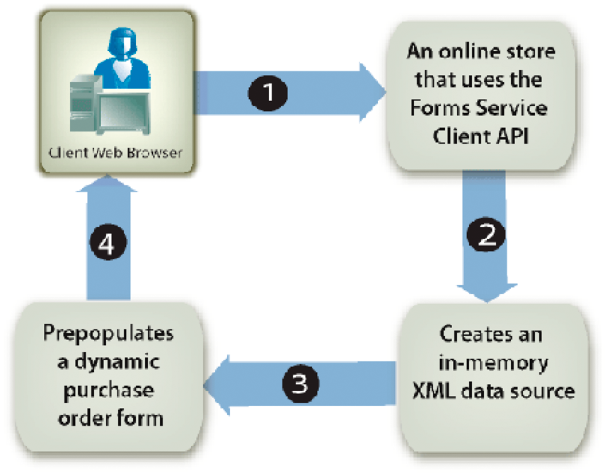
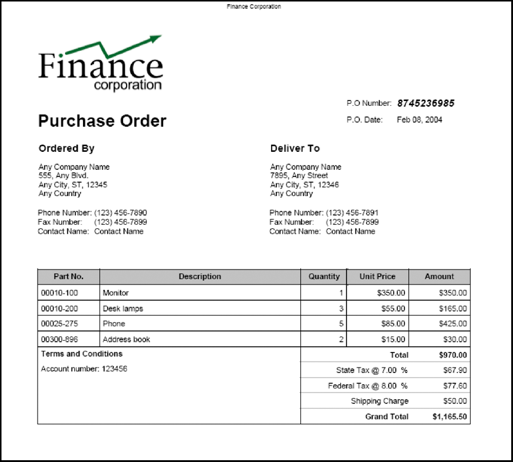

# Prepopulating Forms with Flowable Layouts {#prepopulating-forms-with-flowable-layouts1}

## Prepopulating Forms with Flowable Layouts {#prepopulating-forms-with-flowable-layouts2}

Prepopulating forms displays data to users within a rendered form. For example, assume a user logs in to a website with a user name and password. If authentication is successful, the client application queries a database for user information. The data is merged into the form and then the form is rendered to the user. As a result, the user is able to view personalized data within the form.

Prepopulating a form has the following advantages:

* Enables the user to view custom data in a form.
* Reduces the amount of typing the user does to fill in a form.
* Ensures data integrity by having control over where data is placed.

The following two XML data sources can prepopulate a form:

* An XDP data source, which is XML that conforms to XFA syntax (or XFDF data to prepopulate a form created using Acrobat).
* An arbitrary XML data source that contains name/value pairs matching the form's field names (the examples in this section use an arbitrary XML data source).

An XML element must exist for every form field that you want to prepopulate. The XML element name must match the field name. An XML element is ignored if it does not correspond to a form field or if the XML element name does not match the field name. It is not necessary to match the order in which the XML elements are displayed, as long as all XML elements are specified.

When you prepopulate a form that already contains data, you must specify the data that is already displayed within the XML data source. Assume that a form containing 10 fields has data in four fields. Next, assume that you want to prepopulate the remaining six fields. In this situation, you must specify 10 XML elements in the XML data source that is used to prepopulate the form. If you specify only six elements, the original four fields are empty.

For example, you can prepopulate a form such as the sample confirmation form. (See "Confirmation form" in [Rendering Interactive PDF Forms](/help/forms/developing/rendering-interactive-pdf-forms.md).)

To prepopulate the sample confirmation form, you have to create an XML data source that contains three XML elements that match the three fields in the form. This form contains the following three fields: `FirstName`, `LastName`, and `Amount`. The first step is to create an XML data source that contains XML elements that match the fields in the form design. The next step is to assign data values to the XML elements, as shown in the following XML code.

```xml
     <Untitled>
         <FirstName>Jerry</FirstName>
         <LastName>Johnson</LastName>
         <Amount>250000</Amount>
     </Untitled>
```

After you prepopulate the confirmation form with this XML data source and then render the form, the data values that you assigned to the XML elements are displayed, as shown in the following diagram.


### Prepopulating forms with flowable layouts {#prepopulating_forms_with_flowable_layouts-1}

Forms with flowable layouts are useful to display an undetermined amount of data to users. Because the layout of the form adjusts automatically to the amount of data that is merged, you do not need to predetermine a fixed layout or number of pages for the form as you need to do with a form with a fixed layout.

A form is typically populated with data that is obtained during run-time. As a result, you can prepopulate a form by creating an in-memory XML data source and placing the data directly into the in-memory XML data source.

Consider a web-based application, such as an online store. After an online shopper finishes purchasing items, all purchased items are placed into an in-memory XML data source that is used to prepopulate a form. The following diagram shows this process, which is explained in the table following the diagram.



The following table describes the steps in this diagram.

<table>
 <thead>
  <tr>
   <th><p>Step</p></th>
   <th><p>Description</p></th>
  </tr>
 </thead>
 <tbody>
  <tr>
   <td><p>1</p></td>
   <td><p>A user purchases items from a web-based online store. </p></td>
  </tr>
  <tr>
   <td><p>2</p></td>
   <td><p>After the user finishes purchasing items and clicks the Submit button, an in-memory XML data source is created. Purchased items and user information are placed into the in-memory XML data source. </p></td>
  </tr>
  <tr>
   <td><p>3</p></td>
   <td><p>The XML data source is used to prepopulate a purchase order form (an example of this form is shown following this table). </p></td>
  </tr>
  <tr>
   <td><p>4</p></td>
   <td><p>The purchase order form is rendered to the client web browser. </p></td>
  </tr>
 </tbody>
</table>

The following diagram shows an example of a purchase order form. The information in the table can adjust to the number of records in the XML data.



>[!NOTE]
>
>A form can be prepopulated with data from other sources such as an enterprise database or external applications.

### Form design considerations {#form-design-considerations}

Forms with flowable layouts are based on form designs that are created in Designer. A form design specifies a set of layout, presentation, and data capture rules, including calculating values based on user input. The rules are applied when data is entered into a form. Fields that are added to a form are subforms that are within the form design. For example, in the purchase order form shown in the previous diagram, each line is a subform. For information about creating a form design that contains subforms, see [Creating a purchase order form that has a flowable layout](https://www.adobe.com/go/learn_aemforms_qs_poformflowable_9).

### Understanding data subgroups {#understanding-data-subgroups}

An XML data source is used to prepopulate forms with fixed layouts and flowable layouts. However, the difference is that an XML data source that prepopulates a form with a flowable layout contains repeating XML elements that are used to prepopulate subforms that are repeated within the form. These repeating XML elements are called data subgroups.

An XML data source that is used to prepopulate the purchase order form shown in the previous diagram contains four repeating data subgroups. Each data subgroup corresponds to a purchased item. The purchased items are a monitor, a desk lamp, a phone, and an address book.

The following XML data source is used to prepopulate the purchase order form.

```xml
     <header>
         <!-- XML elements used to prepopulate non-repeating fields such as address
         <!and city
         <txtPONum>8745236985</txtPONum>
         <dtmDate>2004-02-08</dtmDate>
         <txtOrderedByCompanyName>Any Company Name</txtOrderedByCompanyName>
         <txtOrderedByAddress>555, Any Blvd.</txtOrderedByAddress>
         <txtOrderedByCity>Any City</txtOrderedByCity>
         <txtOrderedByStateProv>ST</txtOrderedByStateProv>
         <txtOrderedByZipCode>12345</txtOrderedByZipCode>
         <txtOrderedByCountry>Any Country</txtOrderedByCountry>
         <txtOrderedByPhone>(123) 456-7890</txtOrderedByPhone>
         <txtOrderedByFax>(123) 456-7899</txtOrderedByFax>
         <txtOrderedByContactName>Contact Name</txtOrderedByContactName>
         <txtDeliverToCompanyName>Any Company Name</txtDeliverToCompanyName>
         <txtDeliverToAddress>7895, Any Street</txtDeliverToAddress>
         <txtDeliverToCity>Any City</txtDeliverToCity>
         <txtDeliverToStateProv>ST</txtDeliverToStateProv>
         <txtDeliverToZipCode>12346</txtDeliverToZipCode>
         <txtDeliverToCountry>Any Country</txtDeliverToCountry>
         <txtDeliverToPhone>(123) 456-7891</txtDeliverToPhone>
         <txtDeliverToFax>(123) 456-7899</txtDeliverToFax>
         <txtDeliverToContactName>Contact Name</txtDeliverToContactName>
     </header>
     <detail>
         <!-- A data subgroup that contains information about the monitor>
         <txtPartNum>00010-100</txtPartNum>
         <txtDescription>Monitor</txtDescription>
         <numQty>1</numQty>
         <numUnitPrice>350.00</numUnitPrice>
     </detail>
     <detail>
         <!-- A data subgroup that contains information about the desk lamp>
         <txtPartNum>00010-200</txtPartNum>
         <txtDescription>Desk lamps</txtDescription>
         <numQty>3</numQty>
         <numUnitPrice>55.00</numUnitPrice>
     </detail>
     <detail>
         <!-- A data subgroup that contains information about the Phone>
             <txtPartNum>00025-275</txtPartNum>
             <txtDescription>Phone</txtDescription>
             <numQty>5</numQty>
             <numUnitPrice>85.00</numUnitPrice>
     </detail>
     <detail>
         <!-- A data subgroup that contains information about the address book>
         <txtPartNum>00300-896</txtPartNum>
         <txtDescription>Address book</txtDescription>
         <numQty>2</numQty>
         <numUnitPrice>15.00</numUnitPrice>
     </detail>
```

Notice that each data subgroup contains four XML elements that correspond to this information:

* Items part number
* Items description
* Quantity of items
* Unit price

The name of a data subgroup's parent XML element must match the name of the subform that is in the form design. For example, in the previous diagram, notice that the name of the data subgroup's parent XML element is `detail`. This corresponds to the name of the subform that is in the form design on which the purchase order form is based. If the name of the data subgroup's parent XML element and the subform do not match, a server-side form is not prepopulated.

Each data subgroup must contain XML elements that match the field names in the subform. The `detail` subform in the form design contains the following fields:

* txtPartNum
* txtDescription
* numQty
* numUnitPrice

>[!NOTE]
>
>If you attempt to prepopulate a form with a data source that contains repeating XML elements and you set the `RenderAtClient` option to `No`, only the first data record is merged into the form. To ensure that all data records are merged into the form, set the `RenderAtClient` to `Yes`. For information about the `RenderAtClient` option, see [Rendering Forms at the Client](/help/forms/developing/rendering-forms-client.md).

>[!NOTE]
>
>For more information about the Forms service, see [Services Reference for AEM Forms](https://www.adobe.com/go/learn_aemforms_services_63).

### Summary of steps {#summary-of-steps}

To prepopulate a form with a flowable layout, perform the following tasks:

1. Include project files.
1. Create an in-memory XML data source.
1. Convert the XML data source.
1. Render a prepopulated form.

**Include project files**

Include necessary files into your development project. If you are creating a client application using Java, include the necessary JAR files. If you are using web services, ensure that you include the proxy files.

**Include project files**

Include necessary files into your development project. If you are creating a client application using Java, include the necessary JAR files. If you are using web services, ensure that you include the proxy files.

**Create an in-memory XML data source**

You can use `org.w3c.dom` classes to create an in-memory XML data source to prepopulate a form with a flowable layout. Place data into an XML data source that conforms to the form. For information about the relationship between a form with a flowable layout and the XML data source, see [Understanding data subgroups](#understanding-data-subgroups).

**Convert the XML data source**

An in-memory XML data source that is created by using `org.w3c.dom` classes can be converted to a `com.adobe.idp.Document` object before it can be used to prepopulate a form. An in-memory XML data source can be converted by using Java XML transform classes.

>[!NOTE]
>
>If you are using the Forms service's WSDL to prepopulate a form, you must convert a `org.w3c.dom.Document` object into a `BLOB` object.

**Render a prepopulated form**

You render a prepopulated form just like other form. The only difference is that you use the `com.adobe.idp.Document` object that contains the XML data source to prepopulate the form.

**See also**

[Including AEM Forms Java library files](/help/forms/developing/invoking-aem-forms-using-java.md#including-aem-forms-java-library-files)

[Setting connection properties](/help/forms/developing/invoking-aem-forms-using-java.md#setting-connection-properties)

[Forms Service API Quick Starts](/help/forms/developing/forms-service-api-quick-starts.md#forms-service-api-quick-starts)

[Rendering Interactive PDF Forms](/help/forms/developing/rendering-interactive-pdf-forms.md)

[Creating Web Applications that Renders Forms](/help/forms/developing/creating-web-applications-renders-forms.md)

### Prepopulating forms using the Java API {#prepopulating-forms-using-the-java-api}

To prepopulate a form with a flowable layout by using the Forms API (Java), perform the following steps:

1. Include project files

   Include client JAR files, such as adobe-forms-client.jar, in your Java project's class path. For information about the location of these files, see [Including AEM Forms Java library files](/help/forms/developing/invoking-aem-forms-using-java.md#including-aem-forms-java-library-files).

1. Create an in-memory XML data source

    * Create a Java `DocumentBuilderFactory` object by calling the `DocumentBuilderFactory` class' `newInstance` method.
    * Create a Java `DocumentBuilder` object by calling the `DocumentBuilderFactory` object's `newDocumentBuilder` method.
    * Call the `DocumentBuilder` object's `newDocument` method to instantiate a `org.w3c.dom.Document` object.
    * Create the XML data source's root element by invoking the `org.w3c.dom.Document` object's `createElement` method. This creates an `Element` object that represents the root element. Pass a string value representing the name of the element to the `createElement` method. Cast the return value to `Element`. Next, append the root element to the document by calling the `Document` object's `appendChild` method, and pass the root element object as an argument. The following lines of code shows this application logic:

      ` Element root = (Element)document.createElement("transaction");  document.appendChild(root);`

    * Create the XML data source's header element by calling the `Document` object's `createElement` method. Pass a string value representing the name of the element to the `createElement` method. Cast the return value to `Element`. Next, append the header element to the root element by calling the `root` object's `appendChild` method, and pass the header element object as an argument. The XML elements that are appended to the header element correspond to the static portion of the form. The following lines of code show this application logic:

      ` Element header = (Element)document.createElement("header");  root.appendChild(header);`

    * Create a child element that belongs to the header element by calling the `Document` object's `createElement` method, and pass a string value that represents the element's name. Cast the return value to `Element`. Next, set a value for the child element by calling its `appendChild` method, and pass the `Document` object's `createTextNode` method as an argument. Specify a string value that appears as the child element's value. Finally, append the child element to the header element by calling the header element's `appendChild` method, and pass the child element object as an argument. The following lines of code show this application logic:

      ` Element poNum= (Element)document.createElement("txtPONum");  poNum.appendChild(document.createTextNode("8745236985"));  header.appendChild(LastName);`


    * Add all remaining elements to the header element by repeating the last sub-step for each field appearing in the static portion of the form (in the XML data source diagram, these fields are shown in section A. (See [Understanding data subgroups](#understanding-data-subgroups).)
    * Create the XML data source's detail element by calling the `Document` object's `createElement` method. Pass a string value representing the name of the element to the `createElement` method. Cast the return value to `Element`. Next, append the detail element to the root element by calling the `root` object's `appendChild` method, and pass the detail element object as an argument. The XML elements that are appended to the detail element correspond to the dynamic portion of the form. The following lines of code show this application logic:

      ` Element detail = (Element)document.createElement("detail");  root.appendChild(detail);`

    * Create a child element that belongs to the detail element by calling the `Document` object's `createElement` method, and pass a string value that represents the element's name. Cast the return value to `Element`. Next, set a value for the child element by calling its `appendChild` method, and pass the `Document` object's `createTextNode` method as an argument. Specify a string value that appears as the child element's value. Finally, append the child element to the detail element by calling the detail element's `appendChild` method, and pass the child element object as an argument. The following lines of code show this application logic:

      ` Element txtPartNum = (Element)document.createElement("txtPartNum");  txtPartNum.appendChild(document.createTextNode("00010-100"));  detail.appendChild(txtPartNum);`

    * Repeat the last sub-step for all XML elements to append to the detail element. To properly create the XML data source used to populate the purchase order form, you must append the following XML elements to the detail element: `txtDescription`, `numQty`, and `numUnitPrice`.
    * Repeat the last two sub-steps for all data items used to prepopulate the form.

1. Convert the XML data source

    * Create a `javax.xml.transform.Transformer` object by invoking the `javax.xml.transform.Transformer` object's static `newInstance` method.
    * Create a `Transformer` object by invoking the `TransformerFactory` object's `newTransformer` method.
    * Create a `ByteArrayOutputStream` object by using its constructor.
    * Create a `javax.xml.transform.dom.DOMSource` object by using its constructor and passing the `org.w3c.dom.Document` object that was created in step 1.
    * Create a `javax.xml.transform.dom.DOMSource` object by using its constructor and passing the `ByteArrayOutputStream` object.
    * Populate the Java `ByteArrayOutputStream` object by invoking the `javax.xml.transform.Transformer` object's `transform` method and passing the `javax.xml.transform.dom.DOMSource` and the `javax.xml.transform.stream.StreamResult` objects.
    * Create a byte array and allocate the size of the `ByteArrayOutputStream` object to the byte array.
    * Populate the byte array by invoking the `ByteArrayOutputStream` object's `toByteArray` method.
    * Create a `com.adobe.idp.Document` object by using its constructor and passing the byte array.

1. Render a prepopulated form

   Invoke the `FormsServiceClient` object's `renderPDFForm` method and pass the following values:

    * A string value that specifies the form design name, including the file name extension.
    * A `com.adobe.idp.Document` object that contains data to merge with the form. Ensure that you use the `com.adobe.idp.Document` object created in steps one and two.
    * A `PDFFormRenderSpec` object that stores run-time options.
    * A `URLSpec` object that contains URI values that are required by the Forms service.
    * A `java.util.HashMap` object that stores file attachments. This is an optional parameter and you can specify `null` if you do not want to attach files to the form.

   The `renderPDFForm` method returns a `FormsResult` object that contains a form data stream that must be written to the client web browser.

    * Create a `javax.servlet.ServletOutputStream` object used to send a form data stream to the client web browser.
    * Create a `com.adobe.idp.Document` object by invoking the `FormsResult` object 's `getOutputContent` method.
    * Create a `java.io.InputStream` object by invoking the `com.adobe.idp.Document` object's `getInputStream` method.
    * Create a byte array populate it with the form data stream by invoking the `InputStream` object's `read` method and passing the byte array as an argument.
    * Invoke the `javax.servlet.ServletOutputStream` object's `write` method to send the form data stream to the client web browser. Pass the byte array to the `write` method.

**See also**

[Quick Start (SOAP mode): Prepopulating Forms with Flowable Layouts using the Java API](/help/forms/developing/forms-service-api-quick-starts.md#quick-start-soap-mode-prepopulating-forms-with-flowable-layouts-using-the-java-api)

[Including AEM Forms Java library files](/help/forms/developing/invoking-aem-forms-using-java.md#including-aem-forms-java-library-files)

[Setting connection properties](/help/forms/developing/invoking-aem-forms-using-java.md#setting-connection-properties)

### Prepopulating forms using the web service API {#prepopulating-forms-using-the-web-service-api}

To prepopulate a form with a flowable layout by using the Forms API (web service), perform the following steps:

1. Include project files

    * Create Java proxy classes that consume the Forms service WSDL. (See [Creating Java proxy classes using Apache Axis](/help/forms/developing/invoking-aem-forms-using-web.md#creating-java-proxy-classes-using-apache-axis).)
    * Include the Java proxy classes into your class path.

1. Create an in-memory XML data source

    * Create a Java `DocumentBuilderFactory` object by calling the `DocumentBuilderFactory` class' `newInstance` method.
    * Create a Java `DocumentBuilder` object by calling the `DocumentBuilderFactory` object's `newDocumentBuilder` method.
    * Call the `DocumentBuilder` object's `newDocument` method to instantiate a `org.w3c.dom.Document` object.
    * Create the XML data source's root element by invoking the `org.w3c.dom.Document` object's `createElement` method. This creates an `Element` object that represents the root element. Pass a string value representing the name of the element to the `createElement` method. Cast the return value to `Element`. Next, append the root element to the document by calling the `Document` object's `appendChild` method, and pass the root element object as an argument. The following lines of code show this application logic:

      ` Element root = (Element)document.createElement("transaction");  document.appendChild(root);`

    * Create the XML data source's header element by calling the `Document` object's `createElement` method. Pass a string value representing the name of the element to the `createElement` method. Cast the return value to `Element`. Next, append the header element to the root element by calling the `root` object's `appendChild` method, and pass the header element object as an argument. The XML elements that are appended to the header element correspond to the static portion of the form. The following lines of code show this application logic:

      ` Element header = (Element)document.createElement("header");  root.appendChild(header);`

    * Create a child element that belongs to the header element by calling the `Document` object's `createElement` method, and pass a string value that represents the element's name. Cast the return value to `Element`. Next, set a value for the child element by calling its `appendChild` method, and pass the `Document` object's `createTextNode` method as an argument. Specify a string value that appears as the child element's value. Finally, append the child element to the header element by calling the header element's `appendChild` method, and pass the child element object as an argument. The following lines of code shows this application logic:

      ` Element poNum= (Element)document.createElement("txtPONum");  poNum.appendChild(document.createTextNode("8745236985"));  header.appendChild(LastName);`

    * Add all remaining elements to the header element by repeating the last sub-step for each field appearing in the static portion of the form (in the XML data source diagram, these fields are shown in section A. (See [Understanding data subgroups](#understanding-data-subgroups).)
    * Create the XML data source's detail element by calling the `Document` object's `createElement` method. Pass a string value representing the name of the element to the `createElement` method. Cast the return value to `Element`. Next, append the detail element to the root element by calling the `root` object's `appendChild` method, and pass the detail element object as an argument. The XML elements that are appended to the detail element correspond to the dynamic portion of the form. The following lines of code shows this application logic:

      ` Element detail = (Element)document.createElement("detail");  root.appendChild(detail);`

    * Create a child element that belongs to the detail element by calling the `Document` object's `createElement` method, and pass a string value that represents the element's name. Cast the return value to `Element`. Next, set a value for the child element by calling its `appendChild` method, and pass the `Document` object's `createTextNode` method as an argument. Specify a string value that appears as the child element's value. Finally, append the child element to the detail element by calling the detail element's `appendChild` method, and pass the child element object as an argument. The following lines of code shows this application logic:

      ` Element txtPartNum = (Element)document.createElement("txtPartNum");  txtPartNum.appendChild(document.createTextNode("00010-100"));  detail.appendChild(txtPartNum);`

    * Repeat the last sub-step for all XML elements to append to the detail element. To properly create the XML data source used to populate the purchase order form, you must append the following XML elements to the detail element: `txtDescription`, `numQty`, and `numUnitPrice`.
    * Repeat the last two sub-steps for all data items used to prepopulate the form.

1. Convert the XML data source

    * Create a `javax.xml.transform.Transformer` object by invoking the `javax.xml.transform.Transformer` object's static `newInstance` method.
    * Create a `Transformer` object by invoking the `TransformerFactory` object's `newTransformer` method.
    * Create a `ByteArrayOutputStream` object by using its constructor.
    * Create a `javax.xml.transform.dom.DOMSource` object by using its constructor and passing the `org.w3c.dom.Document` object that was created in step 1.
    * Create a `javax.xml.transform.dom.DOMSource` object by using its constructor and passing the `ByteArrayOutputStream` object.
    * Populate the Java `ByteArrayOutputStream` object by invoking the `javax.xml.transform.Transformer` object's `transform` method and passing the `javax.xml.transform.dom.DOMSource` and the `javax.xml.transform.stream.StreamResult` objects.
    * Create a byte array and allocate the size of the `ByteArrayOutputStream` object to the byte array.
    * Populate the byte array by invoking the `ByteArrayOutputStream` object's `toByteArray` method.
    * Create a `BLOB` object by using its constructor and invoke its `setBinaryData` method and pass the byte array.

1. Render a prepopulated form

   Invoke the `FormsService` object's `renderPDFForm` method and pass the following values:

    * A string value that specifies the form design name, including the file name extension.
    * A `BLOB` object that contains data to merge with the form. Ensure that you use the `BLOB` object that was created in steps one and two.
    * A `PDFFormRenderSpecc` object that stores run-time options. For more information, see [AEM Forms API Reference](https://www.adobe.com/go/learn_aemforms_javadocs_63_en).
    * A `URLSpec` object that contains URI values that are required by the Forms service.
    * A `java.util.HashMap` object that stores file attachments. This is an optional parameter and you can specify `null` if you do not want to attach files to the form.
    * An empty `com.adobe.idp.services.holders.BLOBHolder` object that is populated by the method. This is used to store the rendered PDF form.
    * An empty `javax.xml.rpc.holders.LongHolder` object that is populated by the method. (This argument will store the number of pages in the form).
    * An empty `javax.xml.rpc.holders.StringHolder` object that is populated by the method. (This argument will store the locale value).
    * An empty `com.adobe.idp.services.holders.FormsResultHolder` object that will contain the results of this operation.

   The `renderPDFForm` method populates the `com.adobe.idp.services.holders.FormsResultHolder` object that is passed as the last argument value with a form data stream that must be written to the client web browser.

    * Create a `FormResult` object by getting the value of the `com.adobe.idp.services.holders.FormsResultHolder` object's `value` data member.
    * Create a `BLOB` object that contains form data by invoking the `FormsResult` object's `getOutputContent` method.
    * Get the content type of the `BLOB` object by invoking its `getContentType` method.
    * Set the `javax.servlet.http.HttpServletResponse` object's content type by invoking its `setContentType` method and passing the content type of the `BLOB` object.
    * Create a `javax.servlet.ServletOutputStream` object used to write the form data stream to the client web browser by invoking the `javax.servlet.http.HttpServletResponse` object's `getOutputStream` method.
    * Create a byte array and populate it by invoking the `BLOB` object's `getBinaryData` method. This task assigns the content of the `FormsResult` object to the byte array.
    * Invoke the `javax.servlet.http.HttpServletResponse` object's `write` method to send the form data stream to the client web browser. Pass the byte array to the `write` method.

   >[!NOTE]
   >
   >The `renderPDFForm` method populates the `com.adobe.idp.services.holders.FormsResultHolder` object that is passed as the last argument value with a form data stream that must be written to the client web browser.

**See also**

[Invoking AEM Forms using Base64 encoding](/help/forms/developing/invoking-aem-forms-using-web.md#invoking-aem-forms-using-base64-encoding)
