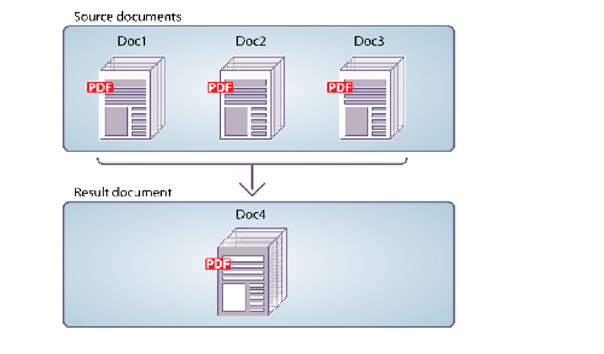

# Programmatically Assembling PDF Documents {#programmatically-assembling-pdf-documents} 

**Samples and examples in this document are only for AEM Forms on JEE environment.**

You can use the Assembler Service API to assemble multiple PDF documents into a single PDF document. The following illustration shows three PDF documents being merged into a single PDF document.



To assemble two or more PDF documents into a single PDF document, you need a DDX document. A DDX document describes the PDF document that the Assembler service produces. That is, the DDX document instructs the Assembler service what actions to perform.

For the purpose of this discussion, assume that the following DDX document is used.

```xml
 <?xml version="1.0" encoding="UTF-8"?>
 <DDX xmlns="https://ns.adobe.com/DDX/1.0/">
     <PDF result="out.pdf">
         <PDF source="map.pdf" />
         <PDF source="directions.pdf" />
     </PDF>
 </DDX>
```

This DDX document merges two PDF documents named *map.pdf* and *directions.pdf* into a single PDF document.

>[!NOTE]
>
>To see a DDX document that disassembles a PDF document, see [Programmatically Disassembling PDF Documents](/help/forms/developing/programmatically-disassembling-pdf-documents.md#programmatically-disassembling-pdf-documents).

>[!NOTE]
>
>For more information about the Assembler service, see [Services Reference for AEM Forms](https://www.adobe.com/go/learn_aemforms_services_63).

>[!NOTE]
>
>For more information about a DDX document, see [Assembler Service and DDX Reference](https://www.adobe.com/go/learn_aemforms_ddx_63).

## Considerations when invoking Assembler service using web services {#considerations-when-invoking-assembler-service-using-web-services}

When you add headers and footers during the assembling of large documents, you may encounter an `OutOfMemory` error and the files will not be assembled. To reduce the chance of this problem occurring, add a `DDXProcessorSetting` element to your DDX document, as shown in the following example.

`<DDXProcessorSetting name="checkpoint" value="2000" />`

You can add this element as a child of the `DDX` element or as a child of a `PDF result` element. The default value for this setting is 0 (zero), which turns checkpointing off and the DDX behaves as if the `DDXProcessorSetting` element is not present. If you have encountered an `OutOfMemory` error, you may need to set the value to an integer, typically between 500 and 5000. A small checkpoint value results in more frequent checkpointing.

## Summary of steps {#summary-of-steps}

To assemble a single PDF document from multiple PDF documents, perform the following tasks:

1. Include project files.
1. Create a PDF Assembler client.
1. Reference an existing DDX document.
1. Reference input PDF documents.
1. Set run-time options.
1. Assemble the input PDF documents.
1. Extract the results.

**Include project files**

Include the necessary files in your development project. If you are creating a client application by using Java, include the necessary JAR files. If you are using web services, ensure that you include the proxy files.

The following JAR files must be added to your project’s class path:

* adobe-livecycle-client.jar
* adobe-usermanager-client.jar
* adobe-assembler-client.jar
* adobe-utilities.jar (required if AEM Forms is deployed on JBoss)
* jbossall-client.jar (required if AEM Forms is deployed on JBoss)

if AEM Forms is deployed on a supported J2EE application server other than JBoss, you must replace the adobe-utilities.jar and jbossall-client.jar files with JAR files that are specific to the J2EE application server on which AEM Forms is deployed.

**Create a PDF Assembler client**

Before you can programmatically perform an Assembler operation, you must create an Assembler client.

**Reference an existing DDX document**

A DDX document must be referenced to assemble a PDF document. For example, consider the DDX document that was introduced in this section. This DDX document instructs the Assembler service to merge two PDF documents into a single PDF document.

**Reference input PDF documents**

Reference input PDF documents that you want to pass to the Assembler service. For example, if you want to pass two input PDF documents named Map and Directions, you must pass the corresponding PDF files.

Both the map.pdf file and the directions.pdf file must be placed in a collection object. The name of the key must match the value of the PDF source attribute in the DDX document. It does not matter what the name of the PDF file is if the key and the source attribute in the DDX document match.

>[!NOTE]
>
>An `AssemblerResult` object, which contains a collection object, is returned if you invoke the `invokeDDX` operation. This operation is used when you pass two or more input PDF documents to the Assembler service. However, if you pass only one input PDF to the Assembler service and expect only one return document, invoke the `invokeOneDocument` operation. When invoking this operation, a single document is returned. For information about using this operation, see [Assembling Encrypted PDF Documents](/help/forms/developing/assembling-encrypted-pdf-documents.md#assembling-encrypted-pdf-documents).

**Set run-time options**

You can set run-time options that control the behaviour of the Assembler service while it performs a job. For example, you can set an option that instructs the Assembler service to continue processing a job if an error is encountered. For information about the run-time options that you can set, see the `AssemblerOptionSpec` class reference in [AEM Forms API Reference](https://www.adobe.com/go/learn_aemforms_javadocs_63_en).

**Assemble the input PDF documents**

After you create the service client, reference a DDX file, create a collection object that stores input PDF documents, and set run-time options, you can invoke the DDX operation. When using the DDX document specified in this section, the map.pdf and direction.pdf files are merged into one PDF document.

**Extract the results**

The Assembler service returns a `java.util.Map` object, which can be obtained from the `AssemblerResult` object, and that contains operation results. The returned `java.util.Map` object contains the resultant documents and any exceptions.

The following table summarizes some of the key values and object types that can be in the returned `java.util.Map` object.

<table>
 <thead>
  <tr>
   <th><p>Key value</p></th>
   <th><p>Object type</p></th>
   <th><p>Description</p></th>
  </tr>
 </thead>
 <tbody>
  <tr>
   <td><p><code><i>documentName</i></code></p></td>
   <td><p><code>com.adobe.idp.Document</code></p></td>
   <td><p>Contains the resultant documents that are specified in a DDX resultant element</p></td>
  </tr>
  <tr>
   <td><p><code><i>documentName</i></code></p></td>
   <td><p><code>Exception</code></p></td>
   <td><p>Contains any exception for the document</p></td>
  </tr>
  <tr>
   <td><p><code>OutputMapConstants.LOG_NAME</code></p></td>
   <td><p><code>com.adobe.idp.Documen</code></p></td>
   <td><p>Contains the job log</p></td>
  </tr>
 </tbody>
</table>

**See also**

[Including AEM Forms Java library files](/help/forms/developing/invoking-aem-forms-using-java.md#including-aem-forms-java-library-files)

[Setting connection properties](/help/forms/developing/invoking-aem-forms-using-java.md#setting-connection-properties)

[Programmatically Disassembling PDF Documents](/help/forms/developing/programmatically-disassembling-pdf-documents.md#programmatically-disassembling-pdf-documents)

## Assemble PDF documents using the Java API {#assemble-pdf-documents-using-the-java-api}

Assemble a PDF document by using the Assembler Service API (Java):

1. Include project files.

   Include client JAR files, such as adobe-assembler-client.jar, in your Java project’s class path.

1. Create a PDF Assembler client.

    * Create a `ServiceClientFactory` object that contains connection properties.
    * Create an `AssemblerServiceClient` object by using its constructor and passing the `ServiceClientFactory` object.

1. Reference an existing DDX document.

    * Create a `java.io.FileInputStream` object that represents the DDX document by using its constructor and passing a string value that specifies the location of the DDX file.
    * Create a `com.adobe.idp.Document` object by using its constructor and passing the `java.io.FileInputStream` object.

1. Reference input PDF documents.

    * Create a `java.util.Map` object that is used to store input PDF documents by using a `HashMap` constructor.
    * For each input PDF document, create a `java.io.FileInputStream` object by using its constructor and passing the location of the input PDF document.
    * For each input PDF document, create a `com.adobe.idp.Document` object and pass the `java.io.FileInputStream` object that contains the PDF document.
    * For each input document, add an entry to the `java.util.Map` object by invoking its `put` method and passing the following arguments:

        * A string value that represents the key name. This value must match the value of the PDF source element specified in the DDX document.
        * A `com.adobe.idp.Document` object (or `java.util.List` object that specifies multiple documents) that contains the source PDF document.

1. Set run-time options.

    * Create an `AssemblerOptionSpec` object that stores run-time options by using its constructor.
    * Set run-time options to meet your business requirements by invoking a method that belongs to the `AssemblerOptionSpec` object. For example, to instruct the Assembler service to continue processing a job when an error occurs, invoke the `AssemblerOptionSpec` object’s `setFailOnError` method and pass `false`.

1. Assemble the input PDF documents.

   Invoke the `AssemblerServiceClient` object’s `invokeDDX` method and pass the following required values:

    * A `com.adobe.idp.Document` object that represents the DDX document to be used
    * A `java.util.Map` object that contains the input PDF files to be assembled
    * A `com.adobe.livecycle.assembler.client.AssemblerOptionSpec` object that specifies the run-time options, including default font and job log level

   The `invokeDDX` method returns a `com.adobe.livecycle.assembler.client.AssemblerResult` object that contains the results of the job and any exceptions that occurred.

1. Extract the results.

   To obtain the newly created PDF document, perform the following actions:

    * Invoke the `AssemblerResult` object’s `getDocuments` method. This returns a `java.util.Map` object.
    * Iterate through the `java.util.Map` object until you find the resultant `com.adobe.idp.Document` object. (You can use the PDF result element specified in the DDX document to get the document.)
    * Invoke the `com.adobe.idp.Document` object’s `copyToFile` method to extract the PDF document.

   >[!NOTE]
   >
   >If `LOG_LEVEL` was set to produce a log, you can extract the log by using the `AssemblerResult` object's `getJobLog` method.

**See also**

[Quick Start (SOAP mode): Assembling a PDF document using the Java API](/help/forms/developing/assembler-service-java-api-quick.md#quick-start-soap-mode-assembling-a-pdf-document-using-the-java-api)

[Including AEM Forms Java library files](/help/forms/developing/invoking-aem-forms-using-java.md#including-aem-forms-java-library-files)

[Setting connection properties](/help/forms/developing/invoking-aem-forms-using-java.md#setting-connection-properties)

## Assemble PDF documents using the web service API {#assemble-pdf-documents-using-the-web-service-api}

Assemble PDF documents by using the Assembler Service API (web service):

1. Include project files.

   Create a Microsoft .NET project that uses MTOM. Ensure that you use the following WSDL definition: `http://localhost:8080/soap/services/AssemblerService?WSDL&lc_version=9.0.1`.

   >[!NOTE]
   >
   >Replace `localhost` with the IP address of the server hosting AEM Forms.

1. Create a PDF Assembler client.

    * Create an `AssemblerServiceClient` object by using its default constructor.
    * Create an `AssemblerServiceClient.Endpoint.Address` object by using the `System.ServiceModel.EndpointAddress` constructor. Pass a string value that specifies the WSDL to the AEM Forms service (for example, `http://localhost:8080/soap/services/AssemblerService?blob=mtom`). You do not need to use the `lc_version` attribute. This attribute is used when you create a service reference.
    * Create a `System.ServiceModel.BasicHttpBinding` object by getting the value of the `AssemblerServiceClient.Endpoint.Binding` field. Cast the return value to `BasicHttpBinding`.
    * Set the `System.ServiceModel.BasicHttpBinding` object’s `MessageEncoding` field to `WSMessageEncoding.Mtom`. This value ensures that MTOM is used.
    * Enable basic HTTP authentication by performing the following tasks:

        * Assign the AEM forms user name to the field `AssemblerServiceClient.ClientCredentials.UserName.UserName`.
        * Assign the corresponding password value to the field `AssemblerServiceClient.ClientCredentials.UserName.Password`.
        * Assign the constant value `HttpClientCredentialType.Basic` to the field `BasicHttpBindingSecurity.Transport.ClientCredentialType`.
        * Assign the constant value `BasicHttpSecurityMode.TransportCredentialOnly` to the field `BasicHttpBindingSecurity.Security.Mode`.

1. Reference an existing DDX document.

    * Create a `BLOB` object by using its constructor. The `BLOB` object is used to store the DDX document.
    * Create a `System.IO.FileStream` object by invoking its constructor and passing a string value that represents the file location of the DDX document and the mode in which to open the file.
    * Create a byte array that stores the content of the `System.IO.FileStream` object. You can determine the size of the byte array by getting the `System.IO.FileStream` object’s `Length` property.
    * Populate the byte array with stream data by invoking the `System.IO.FileStream` object’s `Read` method and passing the byte array, the starting position, and the stream length to read.
    * Populate the `BLOB` object by assigning its `MTOM` property with the contents of the byte array.

1. Reference input PDF documents.

    * For each input PDF document, create a `BLOB` object by using its constructor. The `BLOB` object is used to store the input PDF document.
    * Create a `System.IO.FileStream` object by invoking its constructor and passing a string value that represents the file location of the input PDF document and the mode in which to open the file.
    * Create a byte array that stores the content of the `System.IO.FileStream` object. You can determine the size of the byte array by getting the `System.IO.FileStream` object’s `Length` property.
    * Populate the byte array with stream data by invoking the `System.IO.FileStream` object’s `Read` method. Pass the byte array, the starting position, and the stream length to read.
    * Populate the `BLOB` object by assigning its `MTOM` field with the contents of the byte array.
    * Create a `MyMapOf_xsd_string_To_xsd_anyType` object. This collection object is used to store input PDF documents.
    * For each input PDF document, create a `MyMapOf_xsd_string_To_xsd_anyType_Item` object. For example, if two input PDF documents are used, create two `MyMapOf_xsd_string_To_xsd_anyType_Item` objects.
    * Assign a string value that represents the key name to the `MyMapOf_xsd_string_To_xsd_anyType_Item` object's `key` field. This value must match the value of the PDF source element specified in the DDX document. (Perform this task for each input PDF document.)
    * Assign the `BLOB` object that stores the PDF document to the `MyMapOf_xsd_string_To_xsd_anyType_Item` object's `value` field. (Perform this task for each input PDF document.)
    * Add the `MyMapOf_xsd_string_To_xsd_anyType_Item` object to the `MyMapOf_xsd_string_To_xsd_anyType` object. Invoke the `MyMapOf_xsd_string_To_xsd_anyType` object's `Add` method and pass the `MyMapOf_xsd_string_To_xsd_anyType` object. (Perform this task for each input PDF document.)

1. Set run-time options.

    * Create an `AssemblerOptionSpec` object that stores run-time options by using its constructor.
    * Set run-time options to meet your business requirements by assigning a value to a data member that belongs to the `AssemblerOptionSpec` object. For example, to instruct the Assembler service to continue processing a job when an error occurs, assign `false` to the `AssemblerOptionSpec` object’s `failOnError` data member.

1. Assemble the input PDF documents.

   Invoke the `AssemblerServiceClient` object’s `invoke` method and pass the following values:

    * A `BLOB` object that represents the DDX document.
    * The `mapItem` array that contains the input PDF documents. Its keys must match the names of the PDF source files, and its values must be the `BLOB` objects that correspond to those files.
    * An `AssemblerOptionSpec` object that specifies run-time options.

   The `invoke` method returns an `AssemblerResult` object that contains the results of the job and any exceptions that may have occurred.

1. Extract the results.

   To obtain the newly created PDF document, perform the following actions:

    * Access the `AssemblerResult` object’s `documents` field, which is a `Map` object that contains the result PDF documents.
    * Iterate through the `Map` object until you find the key that matches the name of the resultant document. Then cast that array member’s `value` to a `BLOB`.
    * Extract the binary data that represents the PDF document by accessing its `BLOB` object’s `MTOM` property. This returns an array of bytes that you can write out to a PDF file.

   >[!NOTE]
   >
   >If `LOG_LEVEL` was set to produce a log, you can extract the log by getting the value of the `AssemblerResult` object's `jobLog` data member.

**See also**

[Invoking AEM Forms using MTOM](/help/forms/developing/invoking-aem-forms-using-web.md#invoking-aem-forms-using-mtom)
