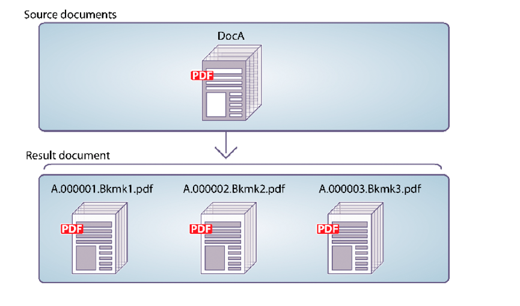

# Programmatically Disassembling PDF Documents {#programmatically-disassembling-pdf-documents} 

**Samples and examples in this document are only for AEM Forms on JEE environment.**

You can disassemble a PDF document by passing it to the Assembler service. Typically, this task is useful when the PDF document was originally created from many individual documents, such as a collection of statements. In the following illustration, DocA is divided into multiple resultant documents, where the first level 1 bookmark on a page identifies the start of a new resultant document.



To disassemble a PDF document, ensure that the `PDFsFromBookmarks` element is in the DDX document. The `PDFsFromBookmarks` element is a resultant element and can be only a child element of the `DDX` element. It does not have a `result` attribute because it can result in the generation of multiple documents.

The `PDFsFromBookmarks` element causes a single document to be generated for each level 1 bookmark in the source document.

For the purpose of this discussion, assume the following DDX document is used.

```xml
 <?xml version="1.0" encoding="UTF-8"?>
 <DDX xmlns="https://ns.adobe.com/DDX/1.0/">
      <PDFsFromBookmarks prefix="stmt">
     <PDF source="AssemblerResultPDF.pdf"/>
 </PDFsFromBookmarks>
 </DDX>
```

>[!NOTE]
>
>Before reading this section, it is recommended that you are familiar with assembling PDF documents by using the Assembler service. (See [Programmatically Assembling PDF Documents](/help/forms/developing/programmatically-assembling-pdf-documents.md).)

>[!NOTE]
>
>When passing a single PDF document to the Assembler service and getting back a single document, you can invoke the `invokeOneDocument` operation. However, to disassemble a PDF document, use the `invokeDDX` operation because although one input PDF document is passed to the Assembler service, the Assembler service returns a collection object that contains one or more documents.

>[!NOTE]
>
>For more information about the Assembler service, see [Services Reference for AEM Forms](https://www.adobe.com/go/learn_aemforms_services_63).

>[!NOTE]
>
>For more information about a DDX document, see [Assembler Service and DDX Reference](https://www.adobe.com/go/learn_aemforms_ddx_63).

## Summary of steps {#summary-of-steps}

To disassemble a PDF document, perform the following tasks:

1. Include project files.
1. Create a PDF Assembler client.
1. Reference an existing DDX document.
1. Reference a PDF document to disassemble.
1. Set run-time options.
1. Disassemble the PDF document.
1. Save the disassembled PDF documents.

**Include project files**

Include the necessary files in your development project. If you are creating a client application by using Java, include the necessary JAR files. If you are using web services, ensure that you include the proxy files.

The following JAR files must be added to your project's class path:

* adobe-livecycle-client.jar
* adobe-usermanager-client.jar
* adobe-assembler-client.jar
* adobe-utilities.jar (required if AEM Forms is deployed on JBoss)
* jbossall-client.jar (required if AEM Forms is deployed on JBoss)

if AEM Forms is deployed on a supported J2EE application server that is not JBoss, you must replace adobe-utilities.jar and jbossall-client.jar with JAR files that are specific to the J2EE application server on which AEM Forms is deployed.

**Create a PDF Assembler client**

Before you can programmatically perform an Assembler operation, you must create an Assembler service client.

**Reference an existing DDX document**

A DDX document must be referenced to disassemble a PDF document. This DDX document must contain the `PDFsFromBookmarks` element.

**Reference a PDF document to disassemble**

To disassemble a PDF document, reference a PDF file that represents the PDF document to disassemble. When passed to the Assembler service, a separate PDF document is returned for each level 1 bookmark in the document.

**Set run-time options**

You can set run-time options that control the behaviour of the Assembler service while it performs a job. For example, you can set an option that instructs the Assembler service to continue processing a job if an error is encountered.

**Disassemble the PDF document**

After you create the Assembler service client, reference the DDX document, reference a PDF document to disassemble, and set run-time options, you can disassemble a PDF document by invoking the `invokeDDX` method. Provided that the DDX document contains instructions to disassemble the PDF document, the Assembler service returns disassembled PDF documents within a collection object.

**Save the disassembled PDF documents**

All disassembled PDF documents are returned within a collection object. Iterate through the collection object and save each PDF document as a PDF file.

**See also**

[Including AEM Forms Java library files](/help/forms/developing/invoking-aem-forms-using-java.md#including-aem-forms-java-library-files)

[Setting connection properties](/help/forms/developing/invoking-aem-forms-using-java.md#setting-connection-properties)

[Programmatically Assembling PDF Documents](/help/forms/developing/programmatically-assembling-pdf-documents.md)

## Disassemble a PDF document using the Java API {#disassemble-a-pdf-document-using-the-java-api}

Disassemble a PDF document by using the Assembler Service API (Java):

1. Include project files.

   Include client JAR files, such as adobe-assembler-client.jar, in your Java project's class path.

1. Create a PDF Assembler client.

    * Create a `ServiceClientFactory` object that contains connection properties.
    * Create an `AssemblerServiceClient` object by using its constructor and passing the `ServiceClientFactory` object.

1. Reference an existing DDX document.

    * Create a `java.io.FileInputStream` object that represents the DDX document by using its constructor and passing a string value that specifies the location of the DDX file.
    * Create a `com.adobe.idp.Document` object by using its constructor and passing the `java.io.FileInputStream` object.

1. Reference a PDF document to disassemble.

    * Create a `java.util.Map` object that is used to store input PDF documents by using a `HashMap` constructor.
    * Create a `java.io.FileInputStream` object by using its constructor and passing the location of the PDF document to disassemble.
    * Create a `com.adobe.idp.Document` object and pass the `java.io.FileInputStream` object that contains the PDF document to disassemble.
    * Add an entry to the `java.util.Map` object by invoking its `put` method and passing the following arguments:

        * A string value that represents the key name. This value must match the value of the PDF source element specified in the DDX document.
        * A `com.adobe.idp.Document` object that contains the PDF document to disassemble.

1. Set run-time options.

    * Create an `AssemblerOptionSpec` object that stores run-time options by using its constructor.
    * Set run-time options to meet your business requirements by invoking a method that belongs to the `AssemblerOptionSpec` object. For example, to instruct the Assembler service to continue processing a job when an error occurs, invoke the `AssemblerOptionSpec` object's `setFailOnError` method and pass `false`.

1. Disassemble the PDF document.

   Invoke the `AssemblerServiceClient` object's `invokeDDX` method and pass the following required values:

    * A `com.adobe.idp.Document` object that represents the DDX document to use
    * A `java.util.Map` object that contains the PDF document to disassemble
    * A `com.adobe.livecycle.assembler.client.AssemblerOptionSpec` object that specifies the run-time options, including the default font and the job log level

   The `invokeDDX` method returns a `com.adobe.livecycle.assembler.client.AssemblerResult` object that contains the disassembled PDF documents and any exceptions that occurred.

1. Save the disassembled PDF documents.

   To obtain the disassembled PDF documents, perform the following actions:

    * Invoke the `AssemblerResult` object's `getDocuments` method. This returns a `java.util.Map` object.
    * Iterate through the `java.util.Map` object until you find the resultant `com.adobe.idp.Document` object.
    * Invoke the `com.adobe.idp.Document` object's `copyToFile` method to extract the PDF document.

**See also**

[Programmatically Disassembling PDF Documents](#programmatically-disassembling-pdf-documents)

[Quick Start (SOAP mode): Disassembling a PDF document using the Java API](/help/forms/developing/assembler-service-java-api-quick.md#quick-start-soap-mode-disassembling-a-pdf-document-using-the-java-api)

[Including AEM Forms Java library files](/help/forms/developing/invoking-aem-forms-using-java.md#including-aem-forms-java-library-files)

[Setting connection properties](/help/forms/developing/invoking-aem-forms-using-java.md#setting-connection-properties)

## Disassemble a PDF document using the web service API {#disassemble-a-pdf-document-using-the-web-service-api}

Disassemble a PDF document by using the Assembler Service API (web service):

1. Include project files.

   Create a Microsoft .NET project that uses MTOM. Ensure that you use the following WSDL definition when setting a service reference: `http://localhost:8080/soap/services/AssemblerService?WSDL&lc_version=9.0.1`.

   >[!NOTE]
   >
   >Replace `localhost` with the IP address of the server hosting AEM Forms.

1. Create a PDF Assembler client.

    * Create an `AssemblerServiceClient` object by using its default constructor.
    * Create an `AssemblerServiceClient.Endpoint.Address` object by using the `System.ServiceModel.EndpointAddress` constructor. Pass a string value that specifies the WSDL to the AEM Forms service (for example, `http://localhost:8080/soap/services/AssemblerService?blob=mtom`). You do not need to use the `lc_version` attribute. This attribute is used when you create a service reference.
    * Create a `System.ServiceModel.BasicHttpBinding` object by getting the value of the `AssemblerServiceClient.Endpoint.Binding` field. Cast the return value to `BasicHttpBinding`.
    * Set the `System.ServiceModel.BasicHttpBinding` object's `MessageEncoding` field to `WSMessageEncoding.Mtom`. This value ensures that MTOM is used.
    * Enable basic HTTP authentication by performing the following tasks:

        * Assign the AEM forms user name to the field `AssemblerServiceClient.ClientCredentials.UserName.UserName`.
        * Assign the corresponding password value to the field `AssemblerServiceClient.ClientCredentials.UserName.Password`.
        * Assign the constant value `HttpClientCredentialType.Basic` to the field `BasicHttpBindingSecurity.Transport.ClientCredentialType`.
        * Assign the constant value `BasicHttpSecurityMode.TransportCredentialOnly` to the field `BasicHttpBindingSecurity.Security.Mode`.

1. Reference an existing DDX document.

    * Create a `BLOB` object by using its constructor. The `BLOB` object is used to store the DDX document.
    * Create a `System.IO.FileStream` object by invoking its constructor. Pass a string value that represents the file location of the DDX document and the mode in which to open the file.
    * Create a byte array that stores the content of the `System.IO.FileStream` object. You can determine the size of the byte array by getting the `System.IO.FileStream` object's `Length` property.
    * Populate the byte array with stream data by invoking the `System.IO.FileStream` object's `Read` method and passing the byte array, the starting position, and the stream length to read.
    * Populate the `BLOB` object by assigning its `MTOM` property with the contents of the byte array.

1. Reference a PDF document to disassemble.

    * Create a `BLOB` object by using its constructor. The `BLOB` object is used to store the input PDF document. This `BLOB` object is passed to the `invokeOneDocument` as an argument.
    * Create a `System.IO.FileStream` object by invoking its constructor and passing a string value that represents the file location of the input PDF document and the mode in which to open the file.
    * Create a byte array that stores the content of the `System.IO.FileStream` object. You can determine the size of the byte array by getting the `System.IO.FileStream` object's `Length` property.
    * Populate the byte array with stream data by invoking the `System.IO.FileStream` object's `Read` method and passing the byte array, the starting position, and the stream length to read.
    * Populate the `BLOB` object by assigning its `MTOM` field the contents of the byte array.
    * Create a `MyMapOf_xsd_string_To_xsd_anyType` object. This collection object is used to store the PDF to disassemble.
    * Create a `MyMapOf_xsd_string_To_xsd_anyType_Item` object.
    * Assign a string value that represents the key name to the `MyMapOf_xsd_string_To_xsd_anyType_Item` object's `key` field. This value must match the value of the PDF source element specified in the DDX document.
    * Assign the `BLOB` object that stores the PDF document to the `MyMapOf_xsd_string_To_xsd_anyType_Item` object's `value` field.
    * Add the `MyMapOf_xsd_string_To_xsd_anyType_Item` object to the `MyMapOf_xsd_string_To_xsd_anyType` object. Invoke the `MyMapOf_xsd_string_To_xsd_anyType` object' `Add` method and pass the `MyMapOf_xsd_string_To_xsd_anyType` object.

1. Set run-time options.

    * Create an `AssemblerOptionSpec` object that stores run-time options by using its constructor.
    * Set run-time options to meet your business requirements by assigning a value to a data member that belongs to the `AssemblerOptionSpec` object. For example, to instruct the Assembler service to continue processing a job when an error occurs, assign `false` to the `AssemblerOptionSpec` object's `failOnError` field.

1. Disassemble the PDF document.

   Invoke the `AssemblerServiceClient` object's `invokeDDX` method and pass the following values:

    * A `BLOB` object that represents the DDX document that disassembles the PDF document
    * The `MyMapOf_xsd_string_To_xsd_anyType` object that contains the PDF document to disassemble
    * An `AssemblerOptionSpec` object that specifies run-time options

   The `invokeDDX` method returns an `AssemblerResult` object that contains the job results and any exceptions that occurred.

1. Save the disassembled PDF documents.

   To obtain the newly created PDF documents, perform the following actions:

    * Access the `AssemblerResult` object's `documents` field, which is a `Map` object that contains the disassembled PDF documents.
    * Iterate through the `Map` object to obtain each resultant document. Then, cast that array member's `value` to a `BLOB`.
    * Extract the binary data that represents the PDF document by accessing its `BLOB` object's `MTOM` property. This returns an array of bytes that you can write out to a PDF file.

**See also**

[Programmatically Disassembling PDF Documents](#programmatically-disassembling-pdf-documents)

[Invoking AEM Forms using MTOM](/help/forms/developing/invoking-aem-forms-using-web.md#invoking-aem-forms-using-mtom)
