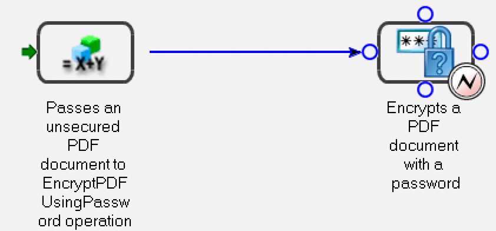

# Programmatically Managing Endpoints {#programmatically-managing-endpoints} 

**Samples and examples in this document are only for AEM Forms on JEE environment.**

**About Endpoint Registry Service**

The Endpoint Registry service provides the ability to programmatically manage endpoints. You can, for example, add the following types of endpoints to a service:

* EJB
* SOAP
* Watched Folder
* Email
* (Deprecated for AEM forms) Remoting
* Task Manager

>[!NOTE]
>
>SOAP, EJB, and (Deprecated for AEM forms on JEE) Remoting endpoints are automatically created for each activated service. The SOAP and EJB endpoints enable SOAP and EJB for all service operations.

  A Remoting endpoint enables Flex clients to invoke operations on the AEM Forms service that the endpoint is added to. A Flex destination with the same name as the endpoint is created and Flex clients can create RemoteObjects that point to this destination to invoke operations on the relevant service.

  The Email, Task Manager, and Watched Folder endpoints expose only a specific operation of the service. Adding these endpoints requires a second configuration step to select a method to invoke, set configuration parameters, and specify input and output parameter mappings.

  You can organize TaskManager endpoints into groups called *categories*. These categories are then exposed to Workspace through TaskManager, with end users seeing the TaskManager endpoints as they are categorized. Within Workspace, end users see these categories in the navigation pane. The endpoints within each category are displayed as process cards on the Start Processes page in Workspace.

  You can accomplish these tasks using the Endpoint Registry service:

* Add EJB endpoints. (See [Adding EJB Endpoints](programmatically-endpoints.md#adding-ejb-endpoints).)
* Add SOAP endpoints. (See [Adding SOAP Endpoints](programmatically-endpoints.md#adding-soap-endpoints).)
* Add Watched Folder endpoints (See [Adding Watched Folder Endpoints](programmatically-endpoints.md#adding-watched-folder-endpoints).)
* Add Email endpoints. (See [Adding Email Endpoints](programmatically-endpoints.md#adding-email-endpoints).)
* Add Remoting endpoints. (See [Adding Remoting Endpoints](programmatically-endpoints.md#adding-remoting-endpoints).)
* Add TaskManager endpoints (See [Adding TaskManager Endpoints](programmatically-endpoints.md#adding-taskmanager-endpoints).)
* Modify endpoints (See [Modifying Endpoints](programmatically-endpoints.md#modifying-endpoints).)
* Remove endpoints (See [Removing Endpoints](programmatically-endpoints.md#removing-endpoints).)
* Retrieve endpoint connector information (See [Retrieving Endpoint Connector Information](programmatically-endpoints.md#retrieving-endpoint-connector-information).)

## Adding EJB Endpoints {#adding-ejb-endpoints}

You can programmatically add an EJB endpoint to a service by using the AEM Forms Java API. By adding an EJB endpoint to a service, you are enabling a client application to invoke the service by using the EJB mode. That is, when setting connection properties that are required to invoke AEM Forms, you can select the EJB mode. (See [Setting connection properties](/help/forms/developing/invoking-aem-forms-using-java.md#setting-connection-properties).)

>[!NOTE]
>
>You cannot add an EJB endpoint by using web services.

>[!NOTE]
>
>Typically, an EJB endpoint is added to a service by default, However, an EJB endpoint can be added to a process that is programmatically deployed or when an EJB endpoint was removed and has to be added again.

### Summary of steps {#summary-of-steps}

To add an EJB endpoint to a service, perform the following tasks:

1. Include project files.
1. Create an `EndpointRegistry Client` object.
1. Set EJB endpoint attributes.
1. Create an EJB endpoint.
1. Enable the endpoint.

**Include project files**

Include necessary files in your development project. The following JAR files must be added to your project's class path:

* adobe-livecycle-client.jar
* adobe-usermanager-client.jar
* adobe-utilities.jar (required if AEM Forms is deployed on JBoss Application Server)
* jbossall-client.jar (required if AEM Forms is deployed on JBoss Application Server)

For information about the location of these JAR files, see [Including AEM Forms Java library files](/help/forms/developing/invoking-aem-forms-using-java.md#including-aem-forms-java-library-files).

**Create an EndpointRegistry Client object**

Before you can programmatically add an EJB endpoint, you must create an `EndpointRegistryClient` object.

**Set EJB endpoint attributes**

To create an EJB endpoint for a service, specify the following values:

* **Connector identifier**: Specifies the type of endpoint to create. To create an EJB endpoint, specify `EJB`.
* **Description**: Specifies the endpoint description.
* **Name**: Specifies the name of the endpoint.
* **Service identifier**: Specifies the service to which the endpoint belongs.
* **Operation name**: Specifies the name of the operation that is invoked by using the endpoint. When creating an EJB endpoint, specify a wildcard character ( `*`). However, if you want to specify a specific operation as opposed to invoking all service operations, specify the name of the operation as opposed to using the wildcard character ( `*`).

**Create an EJB endpoint**

After you set EJB endpoint attributes, you can create an EJB endpoint for a service.

**Enable the endpoint**

After you create an endpoint, you must enable it. After you enable the endpoint, it can be used to invoke the service. After you enable the endpoint, you can view it within administration console.

**See also**

[Adding an EJB endpoint using the Java API](programmatically-endpoints.md#adding-an-ejb-endpoint-using-the-java-api)

[Including AEM Forms Java library files](/help/forms/developing/invoking-aem-forms-using-java.md#including-aem-forms-java-library-files)

[Setting connection properties](/help/forms/developing/invoking-aem-forms-using-java.md#setting-connection-properties)

### Adding an EJB endpoint using the Java API {#adding-an-ejb-endpoint-using-the-java-api}

Add an EJB endpoint by using the Java API:

1. Include project files.

   Include client JAR files, such as adobe-livecycle-client.jar, in your Java project's class path. (

1. Create an EndpointRegistry Client object.

    * Create a `ServiceClientFactory` object that contains connection properties.
    * Create an `EndpointRegistryClient` object by using its constructor and passing the `ServiceClientFactory` object.

1. Set EJB endpoint attributes.

    * Create a `CreateEndpointInfo` object by using its constructor.
    * Specify the connector identifier value by invoking the `CreateEndpointInfo` object's `setConnectorId` method and passing the string value `EJB`.
    * Specify the description of the endpoint by invoking the `CreateEndpointInfo` object's `setDescription` method and passing a string value that describes the endpoint.
    * Specify the name of the endpoint by invoking the `CreateEndpointInfo` object's `setName` method and passing a string value that specifies the name.
    * Specify the service to which the endpoint belongs by invoking the `CreateEndpointInfo` object's `setServiceId` method and passing a string value that specifies the service name.
    * Specify the operation that is invoked by invoking the `CreateEndpointInfo` object's `setOperationName` method and pass a string value that specifies the operation name. For SOAP and EJB endpoints, specify a wildcard character ( `*`), which implies all operations.

1. Create an EJB endpoint.

   Create the endpoint by invoking the `EndpointRegistryClient` object's `createEndpoint` method and passing the `CreateEndpointInfo` object. This method returns an `Endpoint` object that represents the new EJB endpoint.

1. Enable the endpoint.

   Enable the endpoint by invoking the `EndpointRegistryClient` object's enable method and passing the `Endpoint` object that was returned by the `createEndpoint` method.

**See also**

[Summary of steps](programmatically-endpoints.md#summary-of-steps)

[QuickStart: Adding an EJB endpoint using the Java API](/help/forms/developing/endpoint-registry-java-api-quick.md#quickstart-adding-an-ejb-endpoint-using-the-java-api)

[Including AEM Forms Java library files](/help/forms/developing/invoking-aem-forms-using-java.md#including-aem-forms-java-library-files)

[Setting connection properties](/help/forms/developing/invoking-aem-forms-using-java.md#setting-connection-properties)

## Adding SOAP Endpoints {#adding-soap-endpoints}

You can programmatically add a SOAP endpoint to a service by using the AEM Forms Java API. By adding a SOAP endpoint, you enable a client application to invoke the service by using the SOAP mode. That is, when setting connection properties required to invoke AEM Forms, you can select the SOAP mode.

>[!NOTE]
>
>You cannot add a SOAP endpoint by using web services.

>[!NOTE]
>
>Typically, a SOAP endpoint is added to a service by default, However, a SOAP endpoint can be added to a process that is programmatically deployed or when a SOAP endpoint was removed and has to be added again.

### Summary of steps {#summary_of_steps-1}

To add a SOAP endpoint to a service, perform the following tasks:

1. Include project files.
1. Create an `EndpointRegistryClient` object.
1. Set SOAP endpoint attributes.
1. Create a SOAP endpoint.
1. Enable the endpoint.

**Include project files**

Include the necessary files in your development project. If you are creating a client application by using Java, include the necessary JAR files. If you are using web services, make sure that you include the proxy files.

The following JAR files must be added to your project's class path:

* adobe-livecycle-client.jar
* adobe-usermanager-client.jar
* adobe-utilities.jar (required if AEM Forms is deployed on JBoss Application Server)
* jbossall-client.jar (required if AEM Forms is deployed on JBoss Application Server)

These JAR files are required to create a SOAP endpoint. However, you require addition JAR files if you use the SOAP endpoint to invoke the service. For information about AEM Forms JAR files, see [Including AEM Forms Java library files](/help/forms/developing/invoking-aem-forms-using-java.md#including-aem-forms-java-library-files).

**Create an EndpointRegistry Client object**

To programmatically add a SOAP endpoint to a service, you must create an `EndpointRegistryClient` object.

**Set SOAP endpoint attributes**

To add a SOAP endpoint to a service, specify the following values:

* **Connector identifier value**: Specifies the type of endpoint to create. To create a SOAP endpoint, specify `SOAP`.
* **Description**: Specifies the endpoint description.
* **Name**: Specifies the endpoint name.
* **Service identifier value**: Specifies the service to which the endpoint belongs.
* **Operation name**: Specifies the name of the operation that is invoked by using the endpoint. When creating a SOAP endpoint, specify a wildcard character ( `*`). However, if you want to specify a specific operation as opposed to invoking all service operations, specify the name of the operation as opposed to using the wildcard character ( `*`).

**Create a SOAP endpoint**

After you set SOAP endpoint attributes, you can create a SOAP endpoint.

**Enable the endpoint**

After you create an endpoint, you must enable it. When the endpoint is enabled, it can be used to invoke the service. After you enable the endpoint, you can view see it within administration console.

**See also**

[Add a SOAP endpoint using the Java API](programmatically-endpoints.md#add-a-soap-endpoint-using-the-java-api)

[Including AEM Forms Java library files](/help/forms/developing/invoking-aem-forms-using-java.md#including-aem-forms-java-library-files)

[Setting connection properties](/help/forms/developing/invoking-aem-forms-using-java.md#setting-connection-properties)

### Add a SOAP endpoint using the Java API {#add-a-soap-endpoint-using-the-java-api}

Add a SOAP endpoint to a service by using the Java API:

1. Include project files.

   Include client JAR files, such as adobe-livecycle-client.jar, in your Java project's class path.

1. Create an EndpointRegistry Client object.

    * Create a `ServiceClientFactory` object that contains connection properties.
    * Create an `EndpointRegistryClient` object by using its constructor and passing the `ServiceClientFactory` object.

1. Set SOAP endpoint attributes.

    * Create a `CreateEndpointInfo` object by using its constructor.
    * Specify the connector identifier value by invoking the `CreateEndpointInfo` object's `setConnectorId` method and passing the string value `SOAP`.
    * Specify the description of the endpoint by invoking the `CreateEndpointInfo` object's `setDescription` method and passing a string value that describes the endpoint.
    * Specify the name of the endpoint by invoking the `CreateEndpointInfo` object's `setName` method and passing a string value that specifies the name.
    * Specify the service to which the endpoint belongs by invoking the `CreateEndpointInfo` object's `setServiceId` method and passing a string value that specifies the service name.
    * Specify the operation that is invoked by invoking the `CreateEndpointInfo` object's `setOperationName` method and passing a string value that specifies the operation name. For SOAP and EJB endpoints, specify a wildcard character ( `*`), which implies all operations.

1. Create a SOAP endpoint.

   Create the endpoint by invoking the `EndpointRegistryClient` object's `createEndpoint` method and passing the `CreateEndpointInfo` object. This method returns an `Endpoint` object that represents the new SOAP endpoint.

1. Enable the endpoint.

   Enable the endpoint by invoking the `EndpointRegistryClient` object's enable method and pass the `Endpoint` object that was returned by the `createEndpoint` method.

**See also**

[Summary of steps](programmatically-endpoints.md#summary-of-steps)

[QuickStart: Adding a SOAP endpoint using the Java API](/help/forms/developing/endpoint-registry-java-api-quick.md#quickstart-adding-a-soap-endpoint-using-the-java-api)

[Including AEM Forms Java library files](/help/forms/developing/invoking-aem-forms-using-java.md#including-aem-forms-java-library-files)

[Setting connection properties](/help/forms/developing/invoking-aem-forms-using-java.md#setting-connection-properties)

## Adding Watched Folder Endpoints {#adding-watched-folder-endpoints}

You can programmatically add a Watched Folder endpoint to a service by using the AEM Forms Java API. By adding a Watched Folder endpoint, you enable users to place a file (such as a PDF file) in a folder. When the file is placed in the folder, the configured service is then invoked and manipulates the file. After the service performs the specified operation, it saves the modified file in a specified output folder. A watched folder is configured to be scanned at a fixed rate interval or with a cron schedule, such as every Monday, Wednesday, and Friday at noon.

For the purposes of programmatically adding a Watched Folder endpoint to a service, consider the following short-lived process named *EncryptDocument*. (See [Understanding AEM Forms Processes](/help/forms/developing/aem-forms-processes.md#understanding-aem-forms-processes).)


This process accepts an unsecured PDF document as an input value and then passes the unsecured PDF document to the Encryption service's `EncryptPDFUsingPassword` operation. The PDF document is encrypted with a password, and the password-encrypted PDF document is the output value of this process. The name of the input value (the unsecured PDF document) is `InDoc` and the data type is `com.adobe.idp.Document`. The name of the output value (the password-encrypted PDF document) is `SecuredDoc` and the data type is `com.adobe.idp.Document`.

>[!NOTE]
>
>You cannot add a Watched Folder endpoint by using web services.

### Summary of steps {#summary_of_steps-2}

To add a Watched Folder endpoint to a service, perform the following tasks:

1. Include project files.
1. Create an `EndpointRegistryClient` object.
1. Set Watched Folder endpoint attributes.
1. Specify configuration values.
1. Define input parameter values.
1. Define an output parameter value.
1. Create a Watched Folder endpoint.
1. Enable the endpoint.

**Include project files**

Include the necessary files in your development project. If you are creating a client application by using Java, include the necessary JAR files. If you are using web services, make sure that you include the proxy files.

The following JAR files must be added to your project's class path:

* adobe-livecycle-client.jar
* adobe-usermanager-client.jar
* adobe-utilities.jar (required if AEM Forms is deployed on JBoss Application Server)
* jbossall-client.jar (required if AEM Forms is deployed on JBoss Application Server)

For information about the location of these JAR files, see [Including AEM Forms Java library files](/help/forms/developing/invoking-aem-forms-using-java.md#including-aem-forms-java-library-files).

**Create an EndpointRegistry Client object**

To programmatically add a Watched Folder endpoint, you must create an `EndpointRegistryClient` object.

**Set Watched Folder endpoint attributes**

To create a Watched Folder endpoint for a service, specify the following values:

* **Connector identifier**: Specifies the type of endpoint that is created. To create a Watched Folder endpoint, specify `WatchedFolder`.
* **Description**: Specifies the description of the endpoint.
* **Name**: Specifies the name of the endpoint.
* **Service identifier**: Specifies the service to which the endpoint belongs. For example, to add a Watched Folder endpoint to the process that is introduced in this section (a process becomes a service when activated using Workbench), specify `EncryptDocument`.
* **Operation name**: Specifies the name of the operation that is invoked by using the endpoint. Typically, when creating a Watched Folder endpoint for a service that originated from a process created in Workbench, the name of the operation is `invoke`.

**Specify configuration values**

Specify configuration values for a Watched Folder endpoint when programmatically adding a Watched Folder endpoint to a service. These configuration values are specified by an administrator if a Watched Folder endpoint is added by using administration console.

The following list specifies configuration values that are set when programmatically adding a Watched Folder endpoint to a service:

* **url**: Specifies the watched folder location. In a clustered environment, this value must point to a shared network folder that is accessible from every computer in the cluster.
* **asynchronous**: Identifies the invocation type as asynchronous or synchronous. Transient and synchronous processes can only be invoked synchronously. The default value is true. Asynchronous is recommended.
* **cronExpression**: Used by quartz to schedule the polling of the input directory.
* **purgeDuration**: This is a mandatory attribute. Files and folders in the result folder are purged when they are older than this value. This value is measured in days. This attribute is useful in ensuring the result folder does not become full. A value of -1 days indicates to never delete the results folder. The default value is -1.
* **repeatInterval**: The interval, in seconds, for scanning the Watched Folder for input. Unless throttling is enabled, this value should be longer than the time to process an average job; otherwise, the system may become overloaded. The default value is 5.
* **repeatCount**: The number of times a Watched Folder scans the folder or directory. A value of -1 indicates indefinite scanning. The default value is -1.
* **throttleOn**: Limits the number of Watched Folder jobs that can be processed at any given time. The maximum number of jobs is determined by the batchSize value.
* **userName**: The user name used when invoking a target service from the Watched Folder. This value is mandatory. The default value is SuperAdmin.
* **domainName**: The user's domain. This value is mandatory. The default value is DefaultDom.
* **batchSize**: The number of files or folders to be picked up per scan. Use this value to prevent an overload on the system; scanning too many files at one time can result in a crash. The default value is 2.
* **waitTime**: The time, in milliseconds, to wait before scanning a folder or file after creation. For example, if wait time is 36,000,000 milliseconds (one hour) and the file was created one minute ago, this file is picked up after 59 or more minutes have passed. This attribute is useful to ensure that a file or folder is completely copied to the input folder. For example, if you have a large file to process and the file takes ten minutes to download, set the wait time to 10&ast;60 &ast;1000 milliseconds. This setting prevents the watched folder from scanning the file if it has not been waiting for ten minutes. The default value is 0.
* **excludeFilePattern**: The pattern that a watched folder uses to determine which files and folders to scan and pick up. Any file or folder that has this pattern will not be scanned for processing. This setting is useful when the input is a folder that contains multiple files. The contents of the folder can be copied into a folder that has a name that will be picked up by the watched folder. This step prevents the watched folder from picking up a folder for processing before the folder is completely copied into the input folder. For example, if the excludeFilePattern value is `data*`, all files and folders that match `data*` are not picked up. This includes files and folders named `data1`, `data2`, and so on. Additionally, the pattern can be supplemented with wildcard patterns to specify file patterns. The watched folder modifies the regular expression to support wildcard patterns such as `*.*` and `*.pdf`. These wildcard patterns are not supported by regular expressions.
* **includeFilePattern**: The pattern that the watched folder uses to determine which folders and files to scan and pick up. For example, if this value is `*`, all files and folders that match `input*` are picked up. This includes files and folders named `input1`, `input2`, and so on. The default value is `*`. This value indicates all files and folders. Additionally, the pattern can be supplemented with wildcard patterns to specify file patterns. The watched folder modifies the regular expression to support wildcard patterns such as `*.*` and `*.pdf`. These wildcard patterns are not supported by regular expressions. This value is a mandatory.
* **resultFolderName**: The folder where the saved results are stored. This location can be an absolute or a relative directory path. If the results do not appear in this folder, check the failure folder. Read-only files are not processed and will be saved in the failure folder. The default value is `result/%Y/%M/%D/`. This is the results folder inside the watched folder.
* **preserveFolderName**: The location where files are stored after successful scanning and pickup. This location can be an absolute, a relative, or a null directory path. The default value is `preserve/%Y/%M/%D/`.
* **failureFolderName**: The folder where failure files are saved. This location is always relative to the watched folder. Read-only files are not processed and will be saved in the failure folder. The default value is `failure/%Y/%M/%D/`.
* **preserveOnFailure**: Preserve input files if there is a failure to run the operation on a service. The default value is true.
* **overwriteDuplicateFilename**: When set to true, files in the results folder and preserve folder are overwritten. When set to false, files and folders that have a numeric index suffix are used for the name. The default value is false.

**Define input parameter values**

When creating a Watched Folder endpoint, you must define input parameter values. That is, you must describe the input values that are passed to the operation that is invoked by the watched folder. For example, consider the process introduced in this topic. It has one input value named `InDoc` and its data type is `com.adobe.idp.Document`. When creating a Watched Folder endpoint for this process (after a process is activated, it becomes a service), you must define the input parameter value.

To define input parameter values required for a Watched Folder endpoint, specify the following values:

**Input parameter name**: The name of the input parameter. The name of an input value is specified in Workbench for a process. If the input value belongs to a service operation (a service that is not a process created in Workbench), the input name is specified in the component.xml file. For example, the name of the input parameter for the process introduced in this section is `InDoc`.

**Mapping type**: Used to configure the input values required to invoke the service operation. There are two types of mapping types:

* `Literal`: The Watched Folder endpoint uses the value entered in the field as it is displayed. All basic Java types are supported. For example, if an API uses input such as String, long, int, and Boolean, the string is converted into the proper type and the service is invoked.
* `Variable`: The value entered is a file pattern that the watched folder uses to pick the input. For example, if you select Variable for the mapping type and the input document must be a PDF file, you can specify `*.pdf`as the mapping value.

**Mapping value**: Specifies the value of the mapping type. For example, if you select a `Variable` mapping type, you can specify `*.pdf` as the file pattern.

**Data type**: Specifies the data type of the input value(s). For example, the data type of the input value of the process introduced in this section is `com.adobe.idp.Document`.

**Define an output parameter value**

When creating a Watched Folder endpoint, you must define an output parameter value. That is, you must describe the output value that is returned by the service that is invoked by the Watched Folder endpoint. For example, consider the process introduced in this topic. It has an output value named `SecuredDoc` and its data type is `com.adobe.idp.Document`. When creating a Watched Folder endpoint for this process (after a process is activated, it becomes a service), you must define the output parameter value.

To define an output parameter value required for a Watched Folder endpoint, specify the following values:

**Output parameter name**: The name of the output parameter. The name of a process output value is specified in Workbench. If the output value belongs to a service operation (a service that is not a process created in Workbench), the output name is specified in the component.xml file. For example, the name of the output parameter for the process introduced in this section is `SecuredDoc`.

**Mapping type**: Used to configure the output of the service and operation. The following options are available:

* If the service returns a single object (a single document), the pattern is `%F.pdf` and the source destination is sourcefilename.pdf. For example, the process introduced in this section returns a single document. As a result, the mapping type can be defined as `%F.pdf` ( `%F` means use the given file name). The pattern `%E` specifies the extension of the input document.
* If the service returns a list, the pattern is `Result\%F\`, and the source destination is Result\sourcefilename\source1 (output 1) and Result\sourcefilename\source2 (output 2).
* If the service returns a map, the pattern is `Result\%F\`, and the source destination is Result\sourcefilename\file1 and Result\sourcefilename\file2. If the map has more than one object, the pattern is `Result\%F.pdf` and the source destination is Result\sourcefilename1.pdf (output 1), Result\sourcefilenam2.pdf (output 2), and so on.

**Data type**: Specifies the data type of the return value. For example, the data type of the return value of the process introduced in this section is `com.adobe.idp.Document`.

**Create a Watched Folder endpoint**

After you set the endpoint's attributes, configuration values, and define input and output parameter values, you must create the Watched Folder endpoint.

**Enable the endpoint**

After you create a Watched Folder endpoint, you must enable it. When the endpoint is enabled, it can be used to invoke the service. After you enable the endpoint, you can view it within administration console.

**See also**

[Add a Watched Folder endpoint using the Java API](programmatically-endpoints.md#add-a-watched-folder-endpoint-using-the-java-api)

[Including AEM Forms Java library files](/help/forms/developing/invoking-aem-forms-using-java.md#including-aem-forms-java-library-files)

[Setting connection properties](/help/forms/developing/invoking-aem-forms-using-java.md#setting-connection-properties)

### Add a Watched Folder endpoint using the Java API {#add-a-watched-folder-endpoint-using-the-java-api}

Add a Watched Folder endpoint by using the AEM Forms Java API:

1. Include project files.

   Include client JAR files, such as adobe-livecycle-client.jar, in your Java project's class path.

1. Create an EndpointRegistry Client object.

    * Create a `ServiceClientFactory` object that contains connection properties.
    * Create an `EndpointRegistryClient` object by using its constructor and passing the `ServiceClientFactory` object.

1. Set Watched Folder endpoint attributes.

    * Create a `CreateEndpointInfo` object by using its constructor.
    * Specify the connector identifier value by invoking the `CreateEndpointInfo` object's `setConnectorId` method and passing the string value `WatchedFolder`.
    * Specify the description of the endpoint by invoking the `CreateEndpointInfo` object's `setDescription` method and passing a string value that describes the endpoint.
    * Specify the name of the endpoint by invoking the `CreateEndpointInfo` object's `setName` method and passing a string value that specifies the name.
    * Specify the service to which the endpoint belongs by invoking the `CreateEndpointInfo` object's `setServiceId` method and passing a string value that specifies the service name.
    * Specify the operation that is invoked by invoking the `CreateEndpointInfo` object's `setOperationName` method and passing a string value that specifies the operation name. Typically, when creating a Watched Folder endpoint for a service that originated from a process created in Workbench, the name of the operation is invoke.

1. Specify configuration values.

   For each configuration value to set for the Watched Folder endpoint, you must invoke the `CreateEndpointInfo` object's `setConfigParameterAsText` method. For example, to set the `url` configuration value, invoke the `CreateEndpointInfo` object's `setConfigParameterAsText` method and pass the following string values:

    * A string value that specifies the name of the configuration value. When setting the `url` configuration value, specify `url`.
    * A string value that specifies the value of the configuration value. When setting the `url` configuration value, specify the watched folder location.

   >[!NOTE]
   >
   >To see all the configuration values set for the EncryptDocument service, see the Java code example located at [QuickStart: Adding a Watched Folder endpoint using the Java API](/help/forms/developing/endpoint-registry-java-api-quick.md#quickstart-adding-a-watched-folder-endpoint-using-the-java-api).

1. Define input parameter values.

   Define an input parameter value by invoking the `CreateEndpointInfo` object's `setInputParameterMapping` method and pass the following values:

    * A string value that specifies the name of the input parameter. For example, the name of the input parameter for the EncryptDocument service is `InDoc`.
    * A string value that specifies the data type of the input parameter. For example, the data type of the `InDoc` input parameter is `com.adobe.idp.Document`.
    * A string value that specifies the mapping type. For example, you can specify `variable`.
    * A string value that specifies the mapping type value. For example, you can specify &ast;.pdf as the file pattern.

   >[!NOTE]
   >
   >Invoke the `setInputParameterMapping` method for each input parameter value to define. Because the EncryptDocument process has only one input parameter, you need to invoke this method once.

1. Define an output parameter value.

   Define an output parameter value by invoking the `CreateEndpointInfo` object's `setOutputParameterMapping` method and pass the following values:

    * A string value that specifies the name of the output parameter. For example, the name of the output parameter for the EncryptDocument service is `SecuredDoc`.
    * A string value that specifies the data type of the output parameter. For example, the data type of the `SecuredDoc` output parameter is `com.adobe.idp.Document`.
    * A string value that specifies the mapping type. For example, you can specify `%F.pdf`.

1. Create a Watched Folder endpoint.

   Create the endpoint by invoking the `EndpointRegistryClient` object's `createEndpoint` method and passing the `CreateEndpointInfo` object. This method returns an `Endpoint` object that represents the Watched Folder endpoint.

1. Enable the endpoint.

   Enable the endpoint by invoking the `EndpointRegistryClient` object's `enable` method and passing the `Endpoint` object that was returned by the `createEndpoint` method.

**See also**

[Summary of steps](programmatically-endpoints.md#summary-of-steps)

[QuickStart: Adding a Watched Folder endpoint using the Java API](/help/forms/developing/endpoint-registry-java-api-quick.md#quickstart-adding-a-watched-folder-endpoint-using-the-java-api)

[Including AEM Forms Java library files](/help/forms/developing/invoking-aem-forms-using-java.md#including-aem-forms-java-library-files)

[Setting connection properties](/help/forms/developing/invoking-aem-forms-using-java.md#setting-connection-properties)

### Watched folder configuration values constant file {#watched-folder-configuration-values-constant-file}

The [QuickStart: Adding a Watched Folder endpoint using the Java API](/help/forms/developing/endpoint-registry-java-api-quick.md#quickstart-adding-a-watched-folder-endpoint-using-the-java-api) uses a constant file that must be part of your Java project to compile the quick start. This constant file represents configuration values that must be set when adding a Watched Folder endpoint. The following Java code represents the constant file.

```java
 /**
     * This class contains constants that can be used when setting Watched Folder
     * configuration values
     */

 public final class WatchedFolderEndpointConfigConstants {

         public static final String PROPERTY_FILEPROVIDER_URL = "url";
         public static final String PROPERTY_PROPERTY_ASYNCHRONOUS = "asynchronous";
         public static final String PROPERTY_CRON_EXPRESSION = "cronExpression";
         public static final String PROPERTY_PURGE_DURATION = "purgeDuration";
         public static final String PROPERTY_REPEAT_INTERVAL = "repeatInterval";
         public static final String PROPERTY_REPEAT_COUNT = "repeatCount";
         public static final String PROPERTY_THROTTLE = "throttleOn";
         public static final String PROPERTY_USERNAMER = "userName";
         public static final String PROPERTY_DOMAINNAME = "domainName";
         public static final String PROPERTY_FILEPROVIDER_BATCH_SIZE = "batchSize";
         public static final String PROPERTY_FILEPROVIDER_WAIT_TIME = "waitTime";
         public static final String PROPERTY_EXCLUDE_FILE_PATTERN = "excludeFilePattern";
         public static final String PROPERTY_INCLUDE_FILE_PATTERN = "excludeFilePattern";
         public static final String PROPERTY_FILEPROVIDER_RESULT_FOLDER_NAME =  "resultFolderName";
         public static final String PROPERTY_FILEPROVIDER_PRESERVE_FOLDER_NAME = "preserveFolderName";
         public static final String PROPERTY_FILEPROVIDER_FAILURE_FOLDER_NAME = "failureFolderName";
         public static final String PROPERTY_FILEPROVIDER_PRESERVE_ON_FAILURE = "preserveOnFailure";
         public static final String PROPERTY_FILEPROVIDER_OVERWRITE_DUPLICATE_FILENAME = "overwriteDuplicateFilename";
        }
```

## Adding Email Endpoints {#adding-email-endpoints}

You can programmatically add an Email endpoint to a service by using the AEM Forms Java API. By adding an Email endpoint, you enable users to send an email message with one or more file attachments to a specified email account. Then the configure service operation is invoked and manipulates the files. After the service performs the specified operation, it sends an email message to the sender with the modified files as file attachments.

For the purposes of programmatically adding an Email endpoint to a service, consider the following short-lived process named *MyApplication\EncryptDocument*. For information about short-lived processes, see [Understanding AEM Forms Processes](/help/forms/developing/aem-forms-processes.md#understanding-aem-forms-processes).


This process accepts an unsecured PDF document as an input value and then passes the unsecured PDF document to the Encryption service's `EncryptPDFUsingPassword` operation. This process encrypts the PDF document with a password and returns the password-encrypted PDF document as the output value. The name of the input value (the unsecured PDF document) is `InDoc` and the data type is `com.adobe.idp.Document`. The name of the output value (the password-encrypted PDF document) is `SecuredDoc` and the data type is `com.adobe.idp.Document`.

>[!NOTE]
>
>You cannot add an Email endpoint by using web services.

### Summary of steps {#summary_of_steps-3}

To add an Email endpoint to a service, perform the following tasks:

1. Include project files.
1. Create an `EndpointRegistryClient` object.
1. Set Email endpoint attributes.
1. Specify configuration values.
1. Define input parameter values.
1. Define an output parameter value.
1. Create the Email endpoint.
1. Enable the endpoint.

**Include project files**

Include the necessary files in your development project. If you are creating a client application by using Java, include the necessary JAR files. If you are using web services, make sure that you include the proxy files.

The following JAR files must be added to your project's class path:

* adobe-livecycle-client.jar
* adobe-usermanager-client.jar
* adobe-utilities.jar (required if AEM Forms is deployed on JBoss Application Server)
* jbossall-client.jar (required if AEM Forms is deployed on JBoss Application Server)

For information about the location of these JAR files, see [Including AEM Forms Java library files](/help/forms/developing/invoking-aem-forms-using-java.md#including-aem-forms-java-library-files).

**Create an EndpointRegistry Client object**

Before you can programmatically add an Email endpoint, you must create an `EndpointRegistryClient` object.

**Set Email endpoint attributes**

To create an Email endpoint for a service, specify the following values:

* **Connector identifier value**: Specifies the type of endpoint that is created. To create an Email endpoint, specify `Email`.
* **Description**: Specifies a description for the endpoint.
* **Name**: Specifies the name of the endpoint.
* **Service identifier value**: Specifies the service to which the endpoint belongs. For example, to add an Email endpoint to the process that is introduced in this section (a process becomes a service when activated using Workbench), specify `EncryptDocument`.
* **Operation name**: Specifies the name of the operation that is invoked by using the endpoint. Typically, when creating an Email endpoint for a service that originated from a process created in Workbench, the name of the operation is `invoke`.

**Specify configuration values**

Specify configuration values for an Email endpoint when programmatically adding an Email endpoint to a service. These configuration values are specified by an administrator if an Email endpoint is added using administration console.

>[!NOTE]
>
>The email account that is monitored is a special account that is used for the Email endpoint only. This account is not a regular user's email account. A regular user's email account must not be configured as the account that the Email Provider uses because the Email Provider deletes email messages from the inbox after it is finished with the messages.

The following configuration values are set when programmatically adding an Email endpoint to a service:

* **cronExpression**: A cron expression if the email must be scheduled by using a cron expression.
* **repeatCount**: Number of times the email endpoint scans the folder or directory. A value of -1 indicates indefinite scanning. The default value is -1.
* **repeatInterval**: The scanning rate in seconds that the receiver uses for checking for incoming mail. The default value is 10.
* **startDelay**: The time to wait to scan after the scheduler starts. The default time is 0.
* **batchSize**: The number of email messages the receiver processes per scan for optimum performance. A value of -1 indicates all emails. The default value is 2.
* **userName**: The user name used when invoking a target service from email. The default value is `SuperAdmin`.
* **domainName**: A mandatory configuration value. The default value is `DefaultDom`.
* **domainPattern**: Specifies the domain patterns of incoming email that the provider accepts. For example, if `adobe.com` is used, only email from adobe.com is processed, email from other domains is ignored.
* **filePattern**: Specifies the incoming file attachment patterns that the provider accepts. This includes files that have specific file name extensions (&ast;.dat, &ast;.xml), files that have specific names (data), and files that have composite expressions in the name and extension (&ast;.[dD][aA]'port'). The default value is `*`.
* **recipientSuccessfulJob**: An email address to which messages are sent to indicate successful jobs. By default, a successful job message is always sent to the sender. If you type `sender`, email results are sent to the sender. Up to 100 recipients are supported. Specify additional recipients with email addresses, each one separated by a comma. To turn off this option, leave this value blank. In some cases, you may want to trigger a process and do not want an email notification of the result. The default value is `sender`.
* **recipientFailedJob**: An email address to which messages are sent to indicate failed jobs. By default, a failed job message is always sent to the sender. If you type `sender`, email results are sent to the sender. Up to 100 recipients are supported. Specify additional recipients with email addresses, each one separated by a comma. To turn off this option, leave this value blank. The default value is `sender`.
* **inboxHost**: The inbox host name or IP address for the email provider to scan.
* **inboxPort**: The port that the email server uses. The default value for POP3 is 110 and the default value for IMAP is 143. If SSL is enabled, the default value for POP3 is 995 and the default value for IMAP is 993.
* **inboxProtocol**: The email protocol for the email endpoint to use to scan the inbox. The options are `IMAP` or `POP3`. The inbox host mail server must support these protocols.
* **inboxTimeOut**: Time-out in seconds for the email provider to wait for inbox responses. The default value is 60.
* **inboxUser**: The user name required to log in to the email account. Depending on the email server and configuration, this may only be the user name portion of the email or it may be the full email address.
* **inboxPassword**: The password for the inbox user.
* **inboxSSLEnabled**: Set this value to force the email provider to use SSL when sending notification messages of results or errors. Ensure the IMAP or POP3 host supports SSL.
* **smtpHost**: The host name of the mail server that the email provider sends results and error messages to.
* **smtpPort**: The default value for the SMTP port is 25.
* **smtpUser**: The user account for the email provider to use when it sends out email notifications of results and errors.
* **smtpPassword**: The password for the SMTP account. Some mail servers do not require an SMTP password.
* **charSet**: The character set used by the email provider. The default value is `UTF-8`.
* **smtpSSLEnabled**: Set this value to force the email provider to use SSL when sending notification messages of results or errors. Ensure that the SMTP Host supports SSL.
* **failedJobFolder**: Specifies a directory in which to store results when the SMTP mail server is not operational.
* **asynchronous**: When set to synchronous, all input documents are processed and a single response is returned. When set to asynchronous, a response is sent for each input document that is processed. For example, an Email endpoint is created for the process introduced in this topic, and an email message is sent to the endpoint's inbox that contains multiple unsecured PDF documents. When all PDF documents are encrypted with a password, and if the endpoint is configured as synchronous, a single response email message is sent with all secured PDF documents attached. If the endpoint is configured as asynchronous, a separate response email message is sent for each secured PDF document. Each email message contains a single PDF document as an attachment. The default value is asynchronous.

**Define input parameter values**

When creating an Email endpoint, you must define input parameter values. That is, you must describe the input values that are passed to the operation that is invoked by the Email endpoint. For example, consider the process introduced in this topic. It has one input value named `InDoc` and its data type is `com.adobe.idp.Document`. When creating an Email endpoint for this process (after a process is activated, it becomes a service), you must define the input parameter value.

To define input parameter values required for an Email endpoint, specify the following values:

**Input parameter name**: The name of the input parameter. The name of an input value is specified in Workbench for a process. If the input value belongs to a service operation (a Forms service that is not a process created in Workbench), the input name is specified in the component.xml file. For example, the name of the input parameter for the process introduced in this section is `InDoc`.

**Mapping type**: Used to configure the input values required to invoke the service operation. Two types of mapping types are as follows:

* `Literal`: The Email endpoint uses the value entered in the field as it is displayed. All basic Java types are supported. For example, if an API uses input such as String, long, int, and Boolean, the string is converted to the proper type and the service is invoked.
* `Variable`: The value entered is a file pattern that the Email endpoint uses to pick the input. For example, if you select Variable for the mapping type and the input document must be a PDF file, you can specify `*.pdf` as the mapping value.

**Mapping value**: Specifies the value of the mapping type. For example, if you select a Variable mapping type, you can specify `*.pdf` as the file pattern.

**Data type**: Specifies the data type of the input values. For example, the data type of the input value of the process introduced in this section is com.adobe.idp.Document.

**Define an output parameter value**

When creating an Email endpoint, you must define an output parameter value. That is, you must describe the output value that is returned by the service that is invoked by the Email endpoint. For example, consider the process introduced in this topic. It has an output value named `SecuredDoc` and its data type is `com.adobe.idp.Document`. When creating an Email endpoint for this process (after a process is activated, it becomes a service), you must define the output parameter value.

To define an output parameter value required for an Email endpoint, specify the following values:

**Output parameter name**: The name of the output parameter. The name of a process output value is specified in Workbench. If the output value belongs to a service operation (a service that is not a process created in Workbench), the output name is specified in the component.xml file. For example, the name of the output parameter for the process introduced in this section is `SecuredDoc`.

**Mapping type**: Used to configure the output of the service and operation. The following options are available:

* If the service returns a single object (a single document), the pattern is `%F.pdf` and the source destination is sourcefilename.pdf. For example, the process introduced in this section returns a single document. As a result, the mapping type can be defined as `%F.pdf` ( `%F` means use the given file name). The pattern `%E` specifies the extension of the input document.
* If the service returns a list, the pattern is `Result\%F\`, and the source destination is Result\sourcefilename\source1 (output 1) and Result\sourcefilename\source2 (output 2).
* If the service returns a map, the pattern is `Result\%F\`, and the source destination is Result\sourcefilename\file1 and Result\sourcefilename\file2. If the map has more than one object, the pattern is `Result\%F.pdf` and the source destination is Result\sourcefilename1.pdf (output 1), Result\sourcefilenam2.pdf (output 2), and so on.

**Data type**: Specifies the data type of the return value. For example, the data type of the return value of the process introduced in this section is `com.adobe.idp.Document`.

**Create the Email endpoint**

After you set the Email endpoint attributes and configuration values, and define input and output parameter values, you must create the Email endpoint.

**Enable the endpoint**

After you create an Email endpoint, you must enable it. When the endpoint is enabled, it can be used to invoke the service. After you enable the endpoint, you can view it within administration console.

**See also**

[Add an Email endpoint using the Java API](programmatically-endpoints.md#add-an-email-endpoint-using-the-java-api)

[Including AEM Forms Java library files](/help/forms/developing/invoking-aem-forms-using-java.md#including-aem-forms-java-library-files)

[Setting connection properties](/help/forms/developing/invoking-aem-forms-using-java.md#setting-connection-properties)

### Add an Email endpoint using the Java API {#add-an-email-endpoint-using-the-java-api}

Add an Email endpoint by using the Java API:

1. Include project files.

   Include client JAR files, such as adobe-livecycle-client.jar, in your Java project's class path.

1. Create an EndpointRegistry Client object.

    * Create a `ServiceClientFactory` object that contains connection properties.
    * Create an `EndpointRegistryClient` object by using its constructor and passing the `ServiceClientFactory` object.

1. Set Email endpoint attributes.

    * Create a `CreateEndpointInfo` object by using its constructor.
    * Specify the connector identifier value by invoking the `CreateEndpointInfo` object's `setConnectorId` method and passing the string value `Email`.
    * Specify the description of the endpoint by invoking the `CreateEndpointInfo` object's `setDescription` method and passing a string value that describes the endpoint.
    * Specify the name of the endpoint by invoking the `CreateEndpointInfo` object's `setName` method and passing a string value that specifies the name.
    * Specify the service to which the endpoint belongs by invoking the `CreateEndpointInfo` object's `setServiceId` method and passing a string value that specifies the service name.
    * Specify the operation that is invoked by invoking the `CreateEndpointInfo` object's `setOperationName` method and passing a string value that specifies the operation name. Typically, when creating an Email endpoint for a service that originated from a process created in Workbench, the name of the operation is invoke.

1. Specify configuration values.

   For each configuration value to set for the Email endpoint, you must invoke the `CreateEndpointInfo` object's `setConfigParameterAsText` method. For example, to set the `smtpHost` configuration value, invoke the `CreateEndpointInfo` object's `setConfigParameterAsText` method and pass the following values:

    * A string value that specifies the name of the configuration value. When setting the `smtpHost` configuration value, specify `smtpHost`.
    * A string value that specifies the value of the configuration value. When setting the `smtpHost` configuration value, specify a string value that specifies the name of the SMTP server.

   >[!NOTE]
   >
   >To see all the configuration values set for the EncryptDocument service introduced in this section, see the Java code example located at [QuickStart: Adding an Email endpoint using the Java API](/help/forms/developing/endpoint-registry-java-api-quick.md#quickstart-adding-an-email-endpoint-using-the-java-api).

1. Define input parameter values.

   Define an input parameter value by invoking the `CreateEndpointInfo` object's `setInputParameterMapping` method and pass the following values:

    * A string value that specifies the name of the input parameter. For example, the name of the input parameter for the EncryptDocument service is `InDoc`.
    * A string value that specifies the data type of the input parameter. For example, the data type of the `InDoc` input parameter is `com.adobe.idp.Document`.
    * A string value that specifies the mapping type. For example, you can specify `variable`.
    * A string value that specifies the mapping type value. For example, you can specify &ast;.pdf as the file pattern.

   >[!NOTE]
   >
   >Invoke the `setInputParameterMapping` method for each input parameter value to define. Because the EncryptDocument process has only one input parameter, you need to invoke this method once.

1. Define an output parameter value.

   Define an output parameter value by invoking the `CreateEndpointInfo` object's `setOutputParameterMapping` method and passing the following values:

    * A string value that specifies the name of the output parameter. For example, the name of the output parameter for the EncryptDocument service is `SecuredDoc`.
    * A string value that specifies the data type of the output parameter. For example, the data type of the `SecuredDoc` output parameter is `com.adobe.idp.Document`.
    * A string value that specifies the mapping type. For example, you can specify `%F.pdf`.

1. Create the Email endpoint.

   Create the endpoint by invoking the `EndpointRegistryClient` object's `createEndpoint` method and passing the `CreateEndpointInfo` object. This method returns an `Endpoint` object that represents the Email endpoint.

1. Enable the endpoint.

   Enable the endpoint by invoking the `EndpointRegistryClient` object's `enable` method and passing the `Endpoint` object that was returned by the `createEndpoint` method.

**See also**

[Summary of steps](programmatically-endpoints.md#summary-of-steps)

[QuickStart: Adding a Watched Folder endpoint using the Java API](/help/forms/developing/endpoint-registry-java-api-quick.md#quickstart-adding-a-watched-folder-endpoint-using-the-java-api)

[Including AEM Forms Java library files](/help/forms/developing/invoking-aem-forms-using-java.md#including-aem-forms-java-library-files)

[Setting connection properties](/help/forms/developing/invoking-aem-forms-using-java.md#setting-connection-properties)

### Email configuration values constant file {#email-configuration-values-constant-file}

The [QuickStart: Adding an Email endpoint using the Java API](/help/forms/developing/endpoint-registry-java-api-quick.md#quickstart-adding-an-email-endpoint-using-the-java-api) uses a constant file that must be part of your Java project to compile the quick start. This constant file represents configuration values that must be set when adding an email endpoint. The following Java code represents the constant file.

```java
 /**
     * This class contains constants that can be used when setting email endpoint
     * configuration values
     */
 public class EmailEndpointConfigConstants {

     public static final String PROPERTY_EMAILPROVIDER_CRON_EXPRESSION = "cronExpression";
     public static final String PROPERTY_EMAILPROVIDER_REPREAT_COUNT = "repeatCount";
     public static final String PROPERTY_EMAILPROVIDER_REPREAT_INTERVAL = "repeatInterval";
     public static final String PROPERTY_EMAILPROVIDER_START_DELAY = "startDelay";
     public static final String PROPERTY_EMAILPROVIDER_BATCH_SIZE = "batchSize";
     public static final String PROPERTY_EMAILPROVIDER_USERNAME = "userName";
     public static final String PROPERTY_EMAILPROVIDER_DOMAINNAME = "domainName";
     public static final String PROPERTY_EMAILPROVIDER_DOMAINPATTERN = "domainPattern";
     public static final String PROPERTY_EMAILPROVIDER_FILEPATTERN = "filePattern";
     public static final String PROPERTY_EMAILPROVIDER_RECIPIENT_SUCCESSFUL_JOB = "recipientSuccessfulJob";
     public static final String PROPERTY_EMAILPROVIDER_RECIPIENT_FAILED_JOB = "recipientFailedJob";
     public static final String PROPERTY_EMAILPROVIDER_INBOX_HOST = "inboxHost";
     public static final String PROPERTY_EMAILPROVIDER_INBOX_PORT = "inboxPort";
     public static final String PROPERTY_EMAILPROVIDER_PROTOCOL = "inboxProtocol";
     public static final String PROPERTY_EMAILPROVIDER_INBOX_TIMEOUT = "inboxTimeOut";
     public static final String PROPERTY_EMAILPROVIDER_INBOX_USER = "inboxUser";
     public static final String PROPERTY_EMAILPROVIDER_INBOX_PASSWORD = "inboxPassword";
     public static final String PROPERTY_EMAILPROVIDER_INBOX_SSL = "inboxSSLEnabled";
     public static final String PROPERTY_EMAILPROVIDER_SMTP_HOST = "smtpHost";
     public static final String PROPERTY_EMAILPROVIDER_SMTP_PORT = "smtpPort";
     public static final String PROPERTY_EMAILPROVIDER_SMTP_USER = "smtpUser";
     public static final String PROPERTY_EMAILPROVIDER_SMTP_PASSWORD = "smtpPassword";
     public static final String PROPERTY_EMAILPROVIDER_CHARSET = "charSet";
     public static final String PROPERTY_EMAILPROVIDER_SMTP_SSL = "smtpSSLEnabled";
     public static final String PROPERTY_EMAILPROVIDER_FAILED_FOLDER = "failedJobFolder";
     public static final String PROPERTY_EMAILPROVIDER_ASYNCHRONOUS = "asynchronous";
 }
```

## Adding Remoting Endpoints {#adding-remoting-endpoints}

>[!NOTE]
>
>LiveCycle Remoting APIs deprecated for AEM forms on JEE.

You can programmatically add a Remoting endpoint to a service by using the AEM Forms Java API. By adding a Remoting endpoint, you are enabling a Flex application to invoke the service by using remoting. (See [Invoking AEM Forms Using (Deprecated for AEM forms) AEM Forms Remoting](/help/forms/developing/invoking-aem-forms-using-remoting.md#invoking-aem-forms-using-remoting).)

For the purposes of programmatically adding a Remoting endpoint to a service, consider the following short-lived process named *EncryptDocument*.



This process accepts an unsecured PDF document as an input value and then passes the unsecured PDF document to the Encryption service's `EncryptPDFUsingPassword` operation. The PDF document is encrypted with a password, and the password-encrypted PDF document is the output value of this process. The name of the input value (the unsecured PDF document) is `InDoc` and the data type is `com.adobe.idp.Document`. The name of the output value (the password-encrypted PDF document) is `SecuredDoc` and the data type is `com.adobe.idp.Document`.

To demonstrate how to add a Remoting endpoint to a service, this section adds a Remoting endpoint to a service named EncryptDocument.

>[!NOTE]
>
>You cannot add a Remoting endpoint by using web services.

### Summary of steps {#summary_of_steps-4}

To remove an endpoint from a service, perform the following tasks:

1. Include project files.
1. Create an `EndpointRegistryClient` object.
1. Set Remoting endpoint attributes.
1. Create a Remoting endpoint.
1. Enable the endpoint.

**Include project files**

Include the necessary files in your development project. If you are creating a client application by using Java, include the necessary JAR files. If you are using web services, make sure that you include the proxy files.

The following JAR files must be added to your project's class path:

* adobe-livecycle-client.jar
* adobe-usermanager-client.jar
* adobe-utilities.jar (required if AEM Forms is deployed on JBoss Application Server)
* jbossall-client.jar (required if AEM Forms is deployed on JBoss Application Server)

For information about the location of these JAR files, see [Including AEM Forms Java library files](/help/forms/developing/invoking-aem-forms-using-java.md#including-aem-forms-java-library-files).

**Create an EndpointRegistry Client object**

To programmatically add a Remoting endpoint, you must create an `EndpointRegistryClient` object.

**Set Remoting endpoint attributes**

To create a Remoting endpoint for a service, specify the following values:

* **Connector identifier value**: Specifies the type of endpoint that is created. To create a Remoting endpoint, specify `Remoting`.
* **Description**: Specifies the description of the endpoint.
* **Name**: Specifies the name of the endpoint.
* **Service identifier value**: Specifies the service to which the endpoint belongs. For example, to add a Remoting endpoint to the process that is introduced in this section (a process becomes a service when it is activated within Workbench), specify `EncryptDocument`.
* **Operation name**: Specifies the name of the operation that is invoked by using the endpoint. When creating a Remoting endpoint, specify a wildcard character (&ast;).

**Create a Remoting endpoint**

After you set Remoting endpoint attributes, you can create a Remoting endpoint for a service.

**Enable the endpoint**

After you create an endpoint, you must enable it. When a Remoting endpoint is enabled, it enables a Flex client to invoke the service.

**See also**

[Add a Remoting endpoint using the Java API](programmatically-endpoints.md#add-a-remoting-endpoint-using-the-java-api)

[Including AEM Forms Java library files](/help/forms/developing/invoking-aem-forms-using-java.md#including-aem-forms-java-library-files)

[Setting connection properties](/help/forms/developing/invoking-aem-forms-using-java.md#setting-connection-properties)

### Add a Remoting endpoint using the Java API {#add-a-remoting-endpoint-using-the-java-api}

Add a Remoting endpoint by using the Java API:

1. Include project files.

   Include client JAR files, such as adobe-livecycle-client.jar, in your Java project's class path.

1. Create an EndpointRegistry Client object.

    * Create a `ServiceClientFactory` object that contains connection properties.
    * Create an `EndpointRegistryClient` object by using its constructor and passing the `ServiceClientFactory` object.

1. Set Remoting endpoint attributes.

    * Create a `CreateEndpointInfo` object by using its constructor.
    * Specify the connector identifier value by invoking the `CreateEndpointInfo` object's `setConnectorId` method and passing the string value `Remoting`.
    * Specify the description of the endpoint by invoking the `CreateEndpointInfo` object's `setDescription` method and passing a string value that describes the endpoint.
    * Specify the name of the endpoint by invoking the `CreateEndpointInfo` object's `setName` method and passing a string value that specifies the name.
    * Specify the service to which the endpoint belongs by invoking the `CreateEndpointInfo` object's `setServiceId` method and passing a string value that specifies the service name.
    * Specify the operation that is invoked by the `CreateEndpointInfo` object's `setOperationName` method and passing a string value that specifies the operation name. For a Remoting endpoint, specify a wildcard character (&ast;).

1. Create a Remoting endpoint.

   Create the endpoint by invoking the `EndpointRegistryClient` object's `createEndpoint` method and passing the `CreateEndpointInfo` object. This method returns an `Endpoint` object that represents the new Remoting endpoint.

1. Enable the endpoint.

   Enable the endpoint by invoking the `EndpointRegistryClient` object's `enable` method and passing the `Endpoint` object that was returned by the `createEndpoint` method.

**See also**

[Summary of steps](programmatically-endpoints.md#summary-of-steps)

[QuickStart: Adding a Remoting endpoint using the Java API](/help/forms/developing/endpoint-registry-java-api-quick.md#quickstart-adding-a-remoting-endpoint-using-the-java-api)

[Including AEM Forms Java library files](/help/forms/developing/invoking-aem-forms-using-java.md#including-aem-forms-java-library-files)

[Setting connection properties](/help/forms/developing/invoking-aem-forms-using-java.md#setting-connection-properties)

## Adding TaskManager Endpoints {#adding-taskmanager-endpoints}

You can programmatically add a TaskManager endpoint to a service by using the AEM Forms Java API. By adding a TaskManager endpoint to a service, you enable a Workspace user to invoke the service. That is, a user working in Workspace can invoke a process that has a corresponding TaskManager endpoint.

>[!NOTE]
>
>You cannot add a TaskManager endpoint by using web services.

### Summary of steps {#summary_of_steps-5}

To add a TaskManager endpoint to a service, perform the following tasks:

1. Include project files.
1. Create an `EndpointRegistryClient` object.
1. Create a category for the endpoint.
1. Set TaskManager endpoint attributes.
1. Create a TaskManager endpoint.
1. Enable the endpoint.

**Include project files**

Include the necessary files in your development project. If you are creating a client application by using Java, include the necessary JAR files. If you are using web services, make sure that you include the proxy files.

The following JAR files must be added to your project's class path:

* adobe-livecycle-client.jar
* adobe-usermanager-client.jar
* adobe-utilities.jar (required if AEM Forms is deployed on JBoss Application Server)
* jbossall-client.jar (required if AEM Forms is deployed on JBoss Application Server)

For information about the location of these JAR files, see [Including AEM Forms Java library files](/help/forms/developing/invoking-aem-forms-using-java.md#including-aem-forms-java-library-files).

**Create an EndpointRegistry Client object**

Before you can programmatically add a TaskManager endpoint, you must create an `EndpointRegistryClient` object.

**Create a category for the endpoint**

Categories are used to organize services within Workspace. That is, a Workspace user can invoke a service that has a TaskManager endpoint by selecting a category within Workspace. When creating a TaskManager endpoint, you can either reference an existing category or programmatically create a category.

>[!NOTE]
>
>This section creates a new category as part of adding a TaskManager endpoint to a service.

**Set TaskManager endpoint attributes**

To create a TaskManager endpoint for a service, specify the following values:

* **Connector identifier**: Specifies the type of endpoint that is created. To create a TaskManager endpoint, specify `TaskManagerConnector`.
* **Description**: Specifies the description of the endpoint.
* **Name**: Specifies the name of the endpoint.
* **Service identifier**: Specifies the service to which the endpoint belongs.
* **Category**: Specifies a category identifier value that is associated with the TaskManager endpoint.
* **Operation name**: Typically, when creating a TaskManager endpoint for a service that originated from a process created in Workbench, the name of the operation is `invoke`.

**Create a TaskManager endpoint**

After you set a TaskManager endpoint attributes, you can create a TaskManager endpoint for a service.

**Enable the endpoint**

After you create an endpoint, you must enable it. When the endpoint is enabled, it can be used to invoke the service from within Workspace. After you enable the endpoint, you can view it within administration console.

**See also**

[Add a TaskManager endpoint using the Java API](programmatically-endpoints.md#add-a-taskmanager-endpoint-using-the-java-api)

[Including AEM Forms Java library files](/help/forms/developing/invoking-aem-forms-using-java.md#including-aem-forms-java-library-files)

[Setting connection properties](/help/forms/developing/invoking-aem-forms-using-java.md#setting-connection-properties)

### Add a TaskManager endpoint using the Java API {#add-a-taskmanager-endpoint-using-the-java-api}

Add a TaskManager endpoint by using the Java API:

1. Include project files.

   Include client JAR files, such as adobe-livecycle-client.jar, in your Java project's class path.

1. Create an EndpointRegistry Client object.

    * Create a `ServiceClientFactory` object that contains connection properties.
    * Create an `EndpointRegistryClient` object by using its constructor and passing the `ServiceClientFactory` object.

1. Create a category for the endpoint.

    * Create a `CreateEndpointCategoryInfo` object by using its constructor and passing the following values:

        * A string value that specifies the identifier value of the category
        * A string value that specifies the description of the category

    * Create the category by invoking the `EndpointRegistryClient` object's `createEndpointCategory` method and passing the `CreateEndpointCategoryInfo` object. This method returns an `EndpointCategory` object that represents the new category.

1. Set TaskManager endpoint attributes.

    * Create a `CreateEndpointInfo` object by using its constructor.
    * Specify the connector identifier value by invoking the `CreateEndpointInfo` object's `setConnectorId` method and passing the string value `TaskManagerConnector`.
    * Specify the description of the endpoint by invoking the `CreateEndpointInfo` object's `setDescription` method and passing a string value that describes the endpoint.
    * Specify the name of the endpoint by invoking the `CreateEndpointInfo` object's `setName` method and passing a string value that specifies the name.
    * Specify the service to which the endpoint belongs by invoking the `CreateEndpointInfo` object's `setServiceId` method and passing a string value that specifies the service name.
    * Specify the category to which the endpoint belongs by invoking the `CreateEndpointInfo` object's `setCategoryId` method and passing a string value that specifies the category identifier value. You can invoke the `EndpointCategory` object's `getId` method to get the identifier value of this category.
    * Specify the operation that is invoked by invoking the `CreateEndpointInfo` object's `setOperationName` method and passing a string value that specifies the operation name. Typically, when creating a `TaskManager` endpoint for a service that originated from a process created in Workbench, the name of the operation is `invoke`.

1. Create a TaskManager endpoint.

   Create the endpoint by invoking the `EndpointRegistryClient` object's `createEndpoint` method and passing the `CreateEndpointInfo` object. This method returns an `Endpoint` object that represents the new TaskManager endpoint.

1. Enable the endpoint.

   Enable the endpoint by invoking the `EndpointRegistryClient` object's `enable` method and passing the `Endpoint` object that was returned by the `createEndpoint` method.

**See also**

[Summary of steps](programmatically-endpoints.md#summary-of-steps)

[QuickStart: Adding a TaskManager endpoint using the Java API](/help/forms/developing/endpoint-registry-java-api-quick.md#quickstart-adding-a-taskmanager-endpoint-using-the-java-api)

[Including AEM Forms Java library files](/help/forms/developing/invoking-aem-forms-using-java.md#including-aem-forms-java-library-files)

[Setting connection properties](/help/forms/developing/invoking-aem-forms-using-java.md#setting-connection-properties)

## Modifying Endpoints {#modifying-endpoints}

You can programmatically modify an existing endpoint by using the AEM Forms Java API. By modifying an endpoint, you can change the behaviour of the endpoint. Consider, for example, a Watched Folder endpoint that specifies a folder that is used as the watched folder. You can programmatically modify configuration values that belong to the Watched Folder endpoint, resulting in another folder functioning as the watched folder. For information about configuration values that belong to a Watched Folder endpoint, see [Adding Watched Folder Endpoints](programmatically-endpoints.md#adding-watched-folder-endpoints).

To demonstrate how to modify an endpoint, this section modifies a Watched Folder endpoint by changing the folder that behaves as the watched folder.

>[!NOTE]
>
>You cannot modify an endpoint by using web services.

### Summary of steps {#summary_of_steps-6}

To modify an endpoint, perform the following tasks:

1. Include project files.
1. Create an `EndpointRegistryClient` object.
1. Retrieve the endpoint.
1. Specify new configuration values.

**Include project files**

Include the necessary files in your development project. If you are creating a client application by using Java, include the necessary JAR files. If you are using web services, make sure that you include the proxy files.

The following JAR files must be added to your project's class path:

* adobe-livecycle-client.jar
* adobe-usermanager-client.jar
* adobe-utilities.jar (required if AEM Forms is deployed on JBoss Application Server)
* jbossall-client.jar (required if AEM Forms is deployed on JBoss Application Server)

For information about the location of these JAR files, see [Including AEM Forms Java library files](/help/forms/developing/invoking-aem-forms-using-java.md#including-aem-forms-java-library-files).

**Create an EndpointRegistry Client object**

To programmatically modify an endpoint, you must create an `EndpointRegistryClient` object.

**Retrieve the endpoint to modify**

Before you can modify an endpoint, you must retrieve it. To retrieve an endpoint, you must connect as a user who can access an endpoint. It is recommended that you connect as an administrator. (See [Setting connection properties](/help/forms/developing/invoking-aem-forms-using-java.md#setting-connection-properties)).

You can retrieve an endpoint by retrieving a list of endpoints. You can then iterate through the list, searching for the specific endpoint to remove. For example, you can locate an endpoint by determining the service that corresponds to the endpoint and the type of endpoint. When you locate the endpoint, you can modify it.

**Specify new configuration values**

When modifying an endpoint, specify new configuration values. For example, to modify a Watched Folder endpoint, reset all Watched Folder endpoint configuration values, not just the ones that you want to modify. For information about configuration values that belong to a Watched Folder endpoint, see [Adding Watched Folder Endpoints](programmatically-endpoints.md#adding-watched-folder-endpoints).

>[!NOTE]
>
>For information about configuration values that belong to an Email endpoint, see [Adding Email Endpoints](programmatically-endpoints.md#adding-email-endpoints).

>[!NOTE]
>
>You cannot modify the service that is invoked by the endpoint. If you attempt to modify the service, an exception is thrown. To modify the service associated with a given endpoint, remove the endpoint and create a one. (See [Removing Endpoints](programmatically-endpoints.md#removing-endpoints).)

**See also**

[Modifying an endpoint using the Java API](programmatically-endpoints.md#modifying-an-endpoint-using-the-java-api)

[Including AEM Forms Java library files](/help/forms/developing/invoking-aem-forms-using-java.md#including-aem-forms-java-library-files)

[Setting connection properties](/help/forms/developing/invoking-aem-forms-using-java.md#setting-connection-properties)

### Modifying an endpoint using the Java API {#modifying-an-endpoint-using-the-java-api}

Modify an endpoint by using the Java API:

1. Include project files.

   Include client JAR files, such as adobe-livecycle-client.jar, in your Java project's class path.

1. Create an EndpointRegistry Client object.

    * Create a `ServiceClientFactory` object that contains connection properties.
    * Create an `EndpointRegistryClient` object by using its constructor and passing the `ServiceClientFactory` object.

1. Retrieve the endpoint to modify.

    * Retrieve a list of all endpoints to which the current user (specified in the connection properties) can access by invoking the `EndpointRegistryClient` object's `getEndpoints` method and passing a `PagingFilter` object that acts as a filter. You can pass a `(PagingFilter)null` value to return all endpoints. This method returns a `java.util.List` object where each element is an `Endpoint` object. For information about a `PagingFilter` object, see [AEM Forms API Reference](https://www.adobe.com/go/learn_aemforms_javadocs_63_en).
    * Iterate through the `java.util.List` object to determine whether it has endpoints. If endpoints exist, each element is an `EndPoint` instance.
    * Determine the service that corresponds to an endpoint by invoking the `EndPoint` object's `getServiceId` method. This method returns a string value that specifies the service name.
    * Determine the type of endpoint by invoking the `EndPoint` object's `getConnectorId` method. This method returns a string value that specifies the type of endpoint. For example, if the endpoint is a Watched Folder endpoint, this method returns `WatchedFolder`.

1. Specify new configuration values.

    * Create a `ModifyEndpointInfo` object by invoking its constructor.
    * For each configuration value to set, invoke the `ModifyEndpointInfo` object's `setConfigParameterAsText` method. For example, to set the url configuration value, invoke the `ModifyEndpointInfo` object's `setConfigParameterAsText` method and pass the following values:

        * A string value that specifies the name of the configuration value. For example, to set the `url` configuration value, specify `url`.
        * A string value that specifies the value of the configuration value. To define a value for the `url` configuration value, specify the watched folder location.

    * Invoke the `EndpointRegistryClient` object's `modifyEndpoint` method and pass the `ModifyEndpointInfo` object.

**See also**

[Summary of steps](programmatically-endpoints.md#summary-of-steps)

[QuickStart: Modifying an endpoint using the Java API](/help/forms/developing/endpoint-registry-java-api-quick.md#quickstart-modifying-an-endpoint-using-the-java-api)

[Including AEM Forms Java library files](/help/forms/developing/invoking-aem-forms-using-java.md#including-aem-forms-java-library-files)

[Setting connection properties](/help/forms/developing/invoking-aem-forms-using-java.md#setting-connection-properties)

## Removing Endpoints {#removing-endpoints}

You can programmatically remove an endpoint from a service by using the AEM Forms Java API. After you remove an endpoint, the service cannot be invoked by using the invocation method that the endpoint enabled. For example, if you remove an SOAP endpoint from a service, you cannot invoke the service by using the SOAP mode.

To demonstrate how to remove an endpoint from a service, this section removes an EJB endpoint from a service named *EncryptDocument*.

>[!NOTE]
>
>You cannot remove an endpoint by using web services.

### Summary of steps {#summary_of_steps-7}

To remove an endpoint from a service, perform the following tasks:

1. Include project files.
1. Create an `EndpointRegistryClient` object.
1. Retrieve the endpoint.
1. Remove the endpoint.

**Include project files**

Include the necessary files into your development project. If you are creating a client application by using Java, include the necessary JAR files. If you are using web services, make sure that you include the proxy files.

The following JAR files must be added to your project's class path:

* adobe-livecycle-client.jar
* adobe-usermanager-client.jar
* adobe-utilities.jar (required if AEM Forms is deployed on JBoss Application Server)
* jbossall-client.jar (required if AEM Forms is deployed on JBoss Application Server)

For information about the location of these JAR files, see [Including AEM Forms Java library files](/help/forms/developing/invoking-aem-forms-using-java.md#including-aem-forms-java-library-files).

**Create an EndpointRegistry Client object**

To programmatically remove an endpoint, you must create an `EndpointRegistryClient` object.

**Retrieve the endpoint to remove**

Before you can remove an endpoint, you must retrieve it. To retrieve an endpoint, you must connect as a user who can access an endpoint. It is recommended that you connect as an administrator. (See [Setting connection properties](/help/forms/developing/invoking-aem-forms-using-java.md#setting-connection-properties)).

You can retrieve an endpoint by retrieving a list of endpoints. You can then iterate through the list, searching for the specific endpoint to remove. For example, you can locate an endpoint by determining the service that corresponds to the endpoint and the type of endpoint. When you locate the endpoint, you can remove it.

**Remove the endpoint**

After you create an endpoint, you must enable it. When the endpoint is enabled, it can be used to invoke the service. After you enable the endpoint, you can view it within administration console.

**See also**

[Removing an endpoint using the Java API](programmatically-endpoints.md#removing-an-endpoint-using-the-java-api)

[Including AEM Forms Java library files](/help/forms/developing/invoking-aem-forms-using-java.md#including-aem-forms-java-library-files)

[Setting connection properties](/help/forms/developing/invoking-aem-forms-using-java.md#setting-connection-properties)

### Removing an endpoint using the Java API {#removing-an-endpoint-using-the-java-api}

Remove an endpoint by using the Java API:

1. Include project files.

   Include client JAR files, such as adobe-livecycle-client.jar, in your Java project's class path.

1. Create an EndpointRegistry Client object.

    * Create a `ServiceClientFactory` object that contains connection properties.
    * Create an `EndpointRegistryClient` object by using its constructor and passing the `ServiceClientFactory` object.

1. Retrieve the endpoint to remove.

    * Retrieve a list of all endpoints to which the current user (specified in the connection properties) has access by invoking the `EndpointRegistryClient` object's `getEndpoints` method and passing a `PagingFilter` object that acts as a filter. You can pass `(PagingFilter)null` to return all endpoints. This method returns a `java.util.List` object where each element is an `Endpoint` object.
    * Iterate through the `java.util.List` object to determine whether it has endpoints. If endpoints exist, each element is a `EndPoint` instance.
    * Determine the service that corresponds to an endpoint by invoking the `EndPoint` object's `getServiceId` method. This method returns a string value that specifies the service name.
    * Determine the type of endpoint by invoking the `EndPoint` object's `getConnectorId` method. This method returns a string value that specifies the type of endpoint. For example, if the endpoint is an EJB endpoint, this method returns `EJB`.

1. Remove the endpoint.

   Remove the endpoint by invoking the `EndpointRegistryClient` object's `remove` method and passing the `EndPoint` object that represents the endpoint to remove.

**See also**

[Summary of steps](programmatically-endpoints.md#summary-of-steps)

[QuickStart: Removing an endpoint using the Java API](/help/forms/developing/endpoint-registry-java-api-quick.md#quickstart-removing-an-endpoint-using-the-java-api)

[Including AEM Forms Java library files](/help/forms/developing/invoking-aem-forms-using-java.md#including-aem-forms-java-library-files)

[Setting connection properties](/help/forms/developing/invoking-aem-forms-using-java.md#setting-connection-properties)

## Retrieving Endpoint Connector Information {#retrieving-endpoint-connector-information}

You can programmatically retrieve information about endpoint connectors using the AEM Forms API. A connector enables an endpoint to invoke a service using various invocation methods. For example, a Watched Folder connector enables an endpoint to invoke a service using watched folders. By programmatically retrieving information about endpoint connectors, you can retrieve configuration values associated with a connector such as which configuration values are required and which ones are optional.

To demonstrate how to retrieve information about endpoint connectors, this section retrieves information about a Watched Folder connector. (See [Adding Watched Folder Endpoints](programmatically-endpoints.md#adding-watched-folder-endpoints).)

>[!NOTE]
>
>You cannot retrieve information about endpoints by using web services.

>[!NOTE]
>
>This topic uses the `ConnectorRegistryClient` API to retrieve information about endpoint connectors. (See [AEM Forms API Reference](https://www.adobe.com/go/learn_aemforms_javadocs_63_en).)

### Summary of steps {#summary_of_steps-8}

To retrieve endpoint connector information, perform the following tasks:

1. Include project files.
1. Create an `ConnectorRegistryClient` object.
1. Specify the connector type.
1. Retrieve configuration values.

**Include project files**

Include the necessary files into your development project. If you are creating a client application by using Java, include the necessary JAR files. If you are using web services, make sure that you include the proxy files.

The following JAR files must be added to your project's class path:

* adobe-livecycle-client.jar
* adobe-usermanager-client.jar
* adobe-utilities.jar (required if AEM Forms is deployed on JBoss Application Server)
* jbossall-client.jar (required if AEM Forms is deployed on JBoss Application Server)

If AEM Forms is deployed on a supported J2EE application server that is not JBoss, then replace adobe-utilities.jar and jbossall-client.jar with JAR files that are specific to the J2EE application server on which AEM Forms is deployed. For information about the location of all AEM Forms JAR files, see [Including AEM Forms Java library files](/help/forms/developing/invoking-aem-forms-using-java.md#including-aem-forms-java-library-files).

**Create an ConnectorRegistry Client object**

To programmatically retrieve endpoint connector information, create a `ConnectorRegistryClient` object.

**Specify the connector type**

Specify the type of connector from which to retrieve information. The following types of connectors exist:

* **EJB**: Enables a client application to invoke a service using the EJB mode.
* **SOAP**: Enables a client application to invoke a service using the SOAP mode.
* **Watched Folder**: Enables watched folders to invoke a service.
* **Email**: Enables email messages to invoke a service.
* **Remoting**: Enables a Flex client application to invoke a service.
* **TaskManagerConnector**: Enables a Workspace user to invoke a service from within Workspace.

**Retrieve configuration values**

After you specify the connector type, you can retrieve information about the connector such as supported configuration value. For example, for any connector, you can determine which configuration values are required and which ones are optional.

**See also**

[Retrieve endpoint connector information using the Java API](programmatically-endpoints.md#retrieve-endpoint-connector-information-using-the-java-api)

[Including AEM Forms Java library files](/help/forms/developing/invoking-aem-forms-using-java.md#including-aem-forms-java-library-files)

[Setting connection properties](/help/forms/developing/invoking-aem-forms-using-java.md#setting-connection-properties)

### Retrieve endpoint connector information using the Java API {#retrieve-endpoint-connector-information-using-the-java-api}

Retrieve endpoint connector information by using the Java API:

1. Include project files.

   Include client JAR files, such as adobe-livecycle-client.jar, in your Java project's class path.

1. Create a ConnectorRegistry Client object.

    * Create a `ServiceClientFactory` object that contains connection properties.
    * Create a `ConnectorRegistryClient` object by using its constructor and passing the `ServiceClientFactory` object.

1. Specify the connector type.

   Specify the connector type by invoking the `ConnectorRegistryClient` object's `getEndpointDefinition` method and passing a string value that specifies the connector type. For example, to specify the Watched Folder connector type, pass the string value `WatchedFolder`. This method returns an `Endpoint` object that corresponds to the connector type.

1. Retrieve configuration values.

    * Retrieve configuration values that are associated within this endpoint by invoking the `Endpoint` object's `getConfigParameters` method. This method returns an array of `ConfigParameter` objects.
    * Retrieve information about each configuration value by retrieving each element within the array. Each element is a `ConfigParameter` object. You can, for example, determine whether the configuration value is required or optional by invoking the `ConfigParameter` object's `isRequired` method. If the configuration value is required, then this method returns `true`.

**See also**

[Summary of steps](programmatically-endpoints.md#summary-of-steps)

[QuickStart: Retrieving endpoint connector information using the Java API](/help/forms/developing/endpoint-registry-java-api-quick.md#quickstart-retrieving-endpoint-connector-information-using-the-java-api)

[Including AEM Forms Java library files](/help/forms/developing/invoking-aem-forms-using-java.md#including-aem-forms-java-library-files)

[Setting connection properties](/help/forms/developing/invoking-aem-forms-using-java.md#setting-connection-properties)
