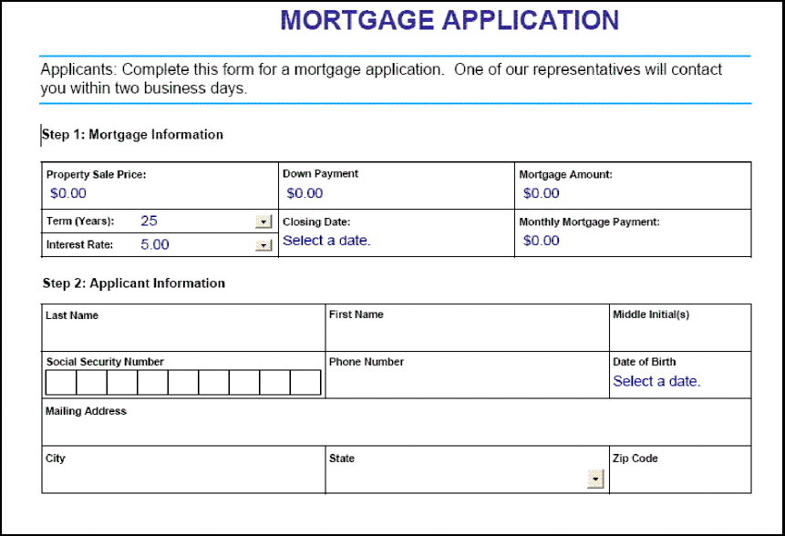
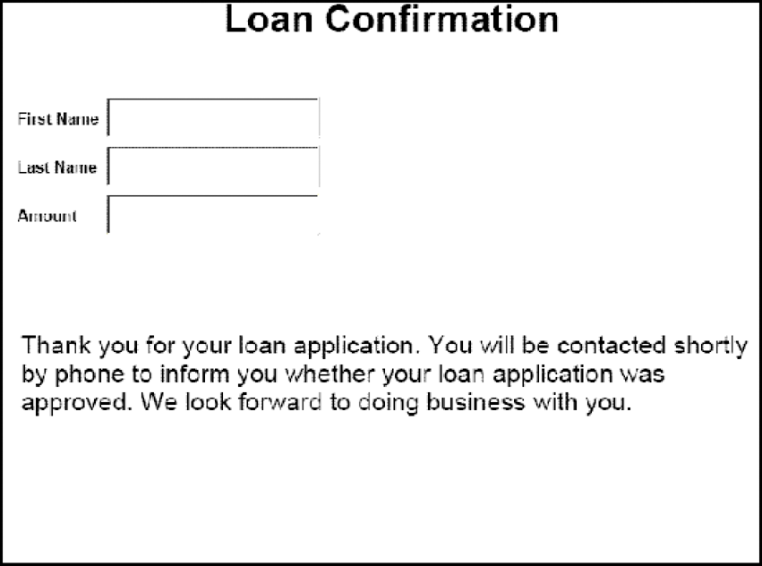

# Rendering Interactive PDF Forms {#rendering-interactive-pdf-forms} 

**Samples and examples in this document are only for AEM Forms on JEE environment.**

The Forms service renders interactive PDF forms to client devices, typically web browsers, to collect information from users. After an interactive form is rendered, a user can enter data into form fields and click a submit button located on the form to send information back to the Forms service. Adobe Reader or Acrobat must be installed on the computer hosting the client web browser in order for an interactive PDF form to be visible.

>[!NOTE]
>
>Before you can render a form using the Forms service, create a form design. Typically, a form design is created in Designer and is saved as an XDP file. For information about creating a form design, see [Forms Designer](https://www.adobe.com/go/learn_aemforms_designer_63).

**Sample loan application**

A sample loan application is introduced to demonstrate how the Forms service uses interactive forms to collect information from users. This application lets a user fill in a form with data required to secure a loan and then submits data to the Forms service. The following diagram shows the loan application's logic flow.


The following table describes the steps in this diagram.

<table>
 <thead>
  <tr>
   <th><p>Step</p></th>
   <th><p>Description</p></th>
  </tr>
 </thead>
 <tbody>
  <tr>
   <td><p>1</p></td>
   <td><p>The <code>GetLoanForm</code> Java Servlet is invoked from an HTML page. </p></td>
  </tr>
  <tr>
   <td><p>2</p></td>
   <td><p>The <code>GetLoanForm</code> Java Servlet uses the Forms service Client API to render the loan form to the client web browser. (See <a href="#render-an-interactive-pdf-form-using-the-java-api">Render an interactive PDF form using the Java API</a>.)</p></td>
  </tr>
  <tr>
   <td><p>3</p></td>
   <td><p>After the user fills the loan form and clicks the submit button, data is submitted to the <code>HandleData</code> Java Servlet. (See <i>"Loan form"</i>.)</p></td>
  </tr>
  <tr>
   <td><p>4</p></td>
   <td><p>The <code>HandleData</code> Java Servlet uses the Forms service Client API to process the form submission and retrieve form data. The data is then stored in an enterprise database. (See <a href="/help/forms/developing/handling-submitted-forms.md#handling-submitted-forms">Handling Submitted Forms</a>.)</p></td>
  </tr>
  <tr>
   <td><p>5</p></td>
   <td><p>A confirmation form is rendered back to the web browser. Data such as the user's first and last name is merged with the form before it is rendered. (See <a href="/help/forms/developing/prepopulating-forms-flowable-layouts.md">Prepopulating Forms with Flowable Layouts</a>.)</p></td>
  </tr>
 </tbody>
</table>

**Loan form**

This interactive loan form is rendered by the sample loan application's `GetLoanForm` Java Servlet.



**Confirmation form**

This form is rendered by the sample loan application's `HandleData` Java Servlet.



The `HandleData` Java Servlet prepopulates this form with the user's first and last name and the amount. After the form is prepopulated, it is sent to the client web browser. (See [Prepopulating Forms with Flowable Layouts](/help/forms/developing/prepopulating-forms-flowable-layouts.md))

**Java Servlets**

The sample loan application is an example of a Forms service application that exists as a Java Servlet. A Java Servlet is a Java program running on a J2EE application server, such as WebSphere, and contains Forms service Client API code.

The following code shows the syntax of a Java Servlet named GetLoanForm:

```java
     public class GetLoanForm extends HttpServlet implements Servlet {
         public void doGet(HttpServletRequest req, HttpServletResponse resp
         throws ServletException, IOException {

         }
         public void doPost(HttpServletRequest req, HttpServletResponse resp
         throws ServletException, IOException {

             }
```

Normally, you would not place Forms service Client API code within a Java Servlet's `doGet` or `doPost` method. It is better programming practice to place this code within a separate class, instantiate the class from within the `doPost` method (or `doGet` method), and call the appropriate methods. However, for code brevity, the code examples in this section are kept to a minimum and code examples are placed in the `doPost` method.

>[!NOTE]
>
>For more information about the Forms service, see [Services Reference for AEM Forms](https://www.adobe.com/go/learn_aemforms_services_63).

**Summary of steps**

To render an interactive PDF form, perform the following tasks:

1. Include project files.
1. Create a Forms Client API object.
1. Specify URI values.
1. Attach files to the form (Optional).
1. Render an interactive PDF form.
1. Write the form data stream to the client web browser.

**Include project files**

Include necessary files into your development project. If you are creating a client application using Java, include the necessary JAR files. If you are using web services, ensure that you include the proxy files.

**Create a Forms Client API object**

Before you can programmatically perform a Forms service Client API operation, you must create a Forms Client API object. If you are using the Java API, create a `FormsServiceClient` object. If you are using the Forms web service API, create a `FormsService` object.

**Specify URI values**

You can specify URI values that are required by the Forms service to render a form. A form design that is saved as part of a Forms application can be referenced by using the content root URI value `repository:///`. For example, consider the following form design named *Loan.xdp* located within a Forms application named *FormsApplication*:


To access this form design, specify `Applications/FormsApplication/1.0/FormsFolder/Loan.xdp` as the form name (the first parameter passed to the `renderPDFForm` method) and `repository:///` as the content root URI value.

>[!NOTE]
>
>For information about creating a Forms application using Workbench, see [Workbench Help](https://www.adobe.com/go/learn_aemforms_workbench_63).

The path to a resource in a Forms application is:

`Applications/Application-name/Application-version/Folder.../Filename`

The following values show some examples of URI values:

* Applications/AppraisalReport/1.0/Forms/FullForm.xdp
* Applications/AnotherApp/1.1/Assets/picture.jpg
* Applications/SomeApp/2.0/Resources/Data/XSDs/MyData.xsd

When you render an interactive form, you can define URI values such as the target URL to where form data is posted. The target URL can be defined in one of the following ways:

* On the Submit button while designing the form design in Designer
* By using the Forms service Client API

If the target URL is defined within the form design, do not override it with the Forms service Client API. That is, setting the target URL using the Forms API resets the specified URL in the form design to the one specified using the API. If you wish to submit the PDF form to the target URL specified in the form design, then programmatically set the target URL to an empty string.

If you have a form that contains a submit button and a calculate button (with a corresponding script that runs at the server), you can programmatically define the URL to where the form is sent to execute the script. Use the submit button on the form design to specify the URL to where form data is posted. (See [Calculating Form Data](/help/forms/developing/calculating-form-data.md).)

>[!NOTE]
>
>Instead of specifying a URL value to reference an XDP file, you can also pass a `com.adobe.idp.Document` instance to the Forms service. The `com.adobe.idp.Document` instance contains a form design. (See [Passing Documents to the Forms Service](/help/forms/developing/passing-documents-forms-service.md).)

**Attach files to the form**

You can attach files to a form. When you render a PDF form with file attachments, users can retrieve the file attachments in Acrobat using the file attachment pane. You can attach different file types to a form, such as a text file, or to a binary file such as a JPG file.

>[!NOTE]
>
>Attaching file attachments to a form is optional.

**Render an interactive PDF form**

To render a form, use a form design that was created in Designer and saved as an XDP or PDF file. As well, you can render a form that was created using Acrobat and saved as a PDF file. To render an interactive PDF form, invoke the `FormsServiceClient` object's `renderPDFForm` method or `renderPDFForm2` method.

The `renderPDFForm` uses a `URLSpec` object. The content root to the XDP file is passed to the Forms service using the `URLSpec` object's `setContentRootURI` method. The Form design name ( `formQuery`) is passed as a separate parameter value. The two values are concatenated to get the absolute reference to the form design.

The `renderPDFForm2` method accepts a `com.adobe.idp.Document` instance that contains the XDP or PDF document to render.

>[!NOTE]
>
>The tagged PDF run-time option cannot be set if the input document is a PDF document. If the input file is an XDP file, the tagged PDF option can be set.

## Render an interactive PDF form using the Java API {#render-an-interactive-pdf-form-using-the-java-api}

Render an interactive PDF form by using the Forms API (Java):

1. Include project files

   Include client JAR files, such as adobe-forms-client.jar, in your Java project's class path.

1. Create a Forms Client API object

    * Create a `ServiceClientFactory` object that contains connection properties.
    * Create an `FormsServiceClient` object by using its constructor and passing the `ServiceClientFactory` object.

1. Specify URI values

    * Create a `URLSpec` object that stores URI values by using its constructor.
    * Invoke the `URLSpec` object's `setApplicationWebRoot` method and pass a string value that represents the application's web root.
    * Invoke the `URLSpec` object's `setContentRootURI` method and pass a string value that specifies the content root URI value. Ensure that the form design is in the content root URI. If not, the Forms service throws an exception. To reference the repository, specify `repository:///`.
    * Invoke the `URLSpec` object's `setTargetURL` method and pass a string value that specifies the target URL value to where form data is posted. If you define the target URL in the form design, you can pass an empty string. You can also specify the URL to where a form is sent to perform calculations.

1. Attach files to the form

    * Create a `java.util.HashMap` object to store file attachments by using its constructor.
    * Invoke the `java.util.HashMap` object's `put` method for each file to attach to the rendered form. Pass the following values to this method:

        * A string value that specifies the name of the file attachment, including the file name extension.

    * A `com.adobe.idp.Document` object that contains the file attachment.

   >[!NOTE]
   >
   >Repeat this step for each file to attach to the form. This step is optional and you can pass `null` if you do not want to send file attachments.

1. Render an interactive PDF form

   Invoke the `FormsServiceClient` object's `renderPDFForm` method and pass the following values:

    * A string value that specifies the form design name, including the file name extension. If you reference a form design that is part of a Forms application, ensure that you specify the complete path, such as `Applications/FormsApplication/1.0/FormsFolder/Loan.xdp`.
    * A `com.adobe.idp.Document` object that contains data to merge with the form. If you do not want to merge data, pass an empty `com.adobe.idp.Document` object.
    * A `PDFFormRenderSpec` object that stores run-time options. This is an optional parameter and you can specify `null` if you do not want to specify run-time options.
    * A `URLSpec` object that contains URI values that are required by the Forms service.
    * A `java.util.HashMap` object that stores file attachments. This is an optional parameter and you can specify `null` if you do not want to attach files to the form.

   The `renderPDFForm` method returns a `FormsResult` object that contains a form data stream that must be written to the client web browser.

1. Write the form data stream to the client web browser

    * Create a `com.adobe.idp.Document` object by invoking the `FormsResult` object 's `getOutputContent` method.
    * Get the content type of the `com.adobe.idp.Document` object by invoking its `getContentType` method.
    * Set the `javax.servlet.http.HttpServletResponse` object's content type by invoking its `setContentType` method and passing the content type of the `com.adobe.idp.Document` object.
    * Create a `javax.servlet.ServletOutputStream` object used to write the form data stream to the client web browser by invoking the `javax.servlet.http.HttpServletResponse` object's `getOutputStream` method.
    * Create a `java.io.InputStream` object by invoking the `com.adobe.idp.Document` object's `getInputStream` method.
    * Create a byte array and populate it with the form data stream by invoking the `InputStream` object's `read` method and passing the byte array as an argument.
    * Invoke the `javax.servlet.ServletOutputStream` object's `write` method to send the form data stream to the client web browser. Pass the byte array to the `write` method.

## Render an interactive PDF form using the web service API {#render-an-interactive-pdf-form-using-the-web-service-api}

Render an interactive PDF form by using the Forms API (web service):

1. Include project files

    * Create Java proxy classes that consume the Forms service WSDL.
    * Include the Java proxy classes into your class path.

1. Create a Forms Client API object

   Create a `FormsService` object and set authentication values.

1. Specify URI values

    * Create a `URLSpec` object that stores URI values by using its constructor.
    * Invoke the `URLSpec` object's `setApplicationWebRoot` method and pass a string value that represents the application's web root.
    * Invoke the `URLSpec` object's `setContentRootURI` method and pass a string value that specifies the content root URI value. Ensure that the form design is in the content root URI. If not, the Forms service throws an exception. To reference the repository, specify `repository:///`.
    * Invoke the `URLSpec` object's `setTargetURL` method and pass a string value that specifies the target URL value to where form data is posted. If you define the target URL in the form design, you can pass an empty string. You can also specify the URL to where a form is sent to perform calculations.

1. Attach files to the form

    * Create a `java.util.HashMap` object to store file attachments by using its constructor.
    * Invoke the `java.util.HashMap` object's `put` method for each file to attach to the rendered form. Pass the following values to this method:

        * A string value that specifies the name of the file attachment, including the file name extension

    * A `BLOB` object that contains the file attachment

   >[!NOTE]
   >
   >Repeat this step for each file to attach to the form.

1. Render an interactive PDF form

   Invoke the `FormsService` object's `renderPDFForm` method and pass the following values:

    * A string value that specifies the form design name, including the file name extension. If you reference a form design that is part of a Forms application, ensure that you specify the complete path, such as `Applications/FormsApplication/1.0/FormsFolder/Loan.xdp`.
    * A `BLOB` object that contains data to merge with the form. If you do not want to merge data, pass `null`.
    * A `PDFFormRenderSpec` object that stores run-time options. This is an optional parameter and you can specify `null` if you do not want to specify run-time options.
    * A `URLSpec` object that contains URI values that are required by the Forms service.
    * A `java.util.HashMap` object that stores file attachments. This is an optional parameter and you can specify `null` if you do not want to attach files to the form.
    * An empty `com.adobe.idp.services.holders.BLOBHolder` object that is populated by the method. This is used to store the rendered PDF form.
    * An empty `javax.xml.rpc.holders.LongHolder` object that is populated by the method. (This argument will store the number of pages in the form.)
    * An empty `javax.xml.rpc.holders.StringHolder` object that is populated by the method. (This argument will store the locale value.)
    * An empty `com.adobe.idp.services.holders.FormsResultHolder` object that will contain the results of this operation.

   The `renderPDFForm` method populates the `com.adobe.idp.services.holders.FormsResultHolder` object that is passed as the last argument value with a form data stream that must be written to the client web browser.

1. Write the form data stream to the client web browser

    * Create a `FormResult` object by getting the value of the `com.adobe.idp.services.holders.FormsResultHolder` object's `value` data member.
    * Create a `BLOB` object that contains form data by invoking the `FormsResult` object's `getOutputContent` method.
    * Get the content type of the `BLOB` object by invoking its `getContentType` method.
    * Set the `javax.servlet.http.HttpServletResponse` object's content type by invoking its `setContentType` method and passing the content type of the `BLOB` object.
    * Create a `javax.servlet.ServletOutputStream` object used to write the form data stream to the client web browser by invoking the `javax.servlet.http.HttpServletResponse` object's `getOutputStream` method.
    * Create a byte array and populate it by invoking the `BLOB` object's `getBinaryData` method. This task assigns the content of the `FormsResult` object to the byte array.
    * Invoke the `javax.servlet.http.HttpServletResponse` object's `write` method to send the form data stream to the client web browser. Pass the byte array to the `write` method.

**Write the form data stream to the client web browser**

When the Forms service renders a form, it returns a form data stream that you must write to the client web browser. When written to the client web browser, the form is visible to the user.
